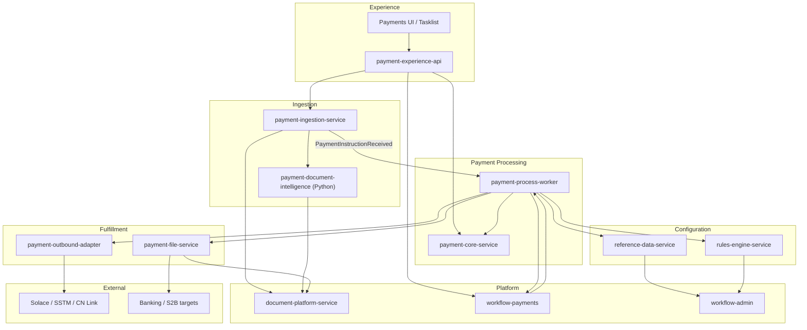
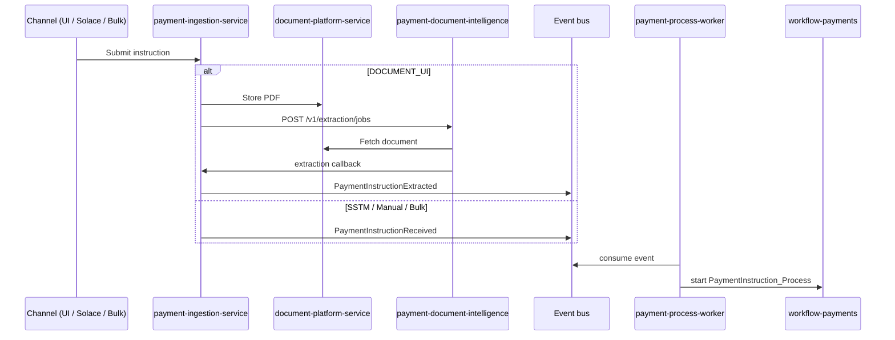
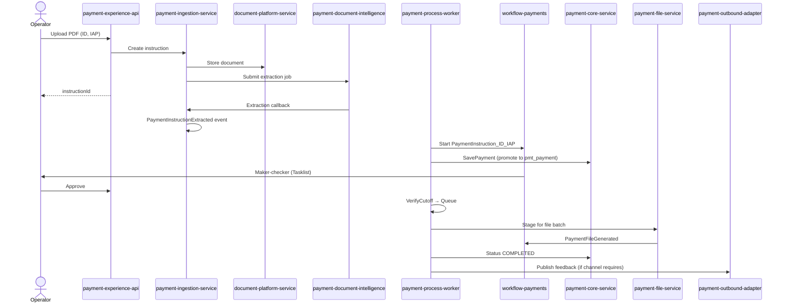

# FSS Payments Platform — Target Architecture (Big Bang Re-Architecture)

> **Companion documents:**
> - [ID_payments.md](./ID_payments.md) — as-is workflow, Java mapping, BPMN inventory, known gaps.
> - [ID_payments_UI_OCR_Rearchitecture.md](./ID_payments_UI_OCR_Rearchitecture.md) — incremental Option A design (strangler-fig); **superseded for target state** by this document.
>
> **Intent:** Define a **clean-slate target architecture** for the entire FSS payments platform — optimal trade-offs for extensibility, operability, and country/product growth — accepting **big-bang replacement** of legacy `payment-gateway-service`, `payment-publisher-service`, and monolithic BPMN sprawl.

---

## 1. Executive Summary

The current platform grew organically: Solace-driven ingestion, country-specific BPMNs, Camunda workers split across misnamed “gateway” and “publisher” services, duplicated JPA entities, one overloaded Camunda engine for payments and admin approvals, and OCR embedded in queue messages (SWOOSH). That model is hard to extend, hard to rollback safely, and hard to reason about.

The **target architecture** reorganizes around **bounded contexts**, **one integration style per concern**, **config-driven product/country extension**, and **explicit service ownership** of data and workflows.

| Dimension | Current (as-is) | Target (big bang) |
|---|---|---|
| Ingress | `payment-gateway-service` (JMS + REST + workers mixed) | **`payment-ingestion-service`** — all channels, no Camunda |
| Document AI | SWOOSH in Solace / external idea | **`payment-document-intelligence`** (Python service) |
| Payment processing workers | gateway + publisher (14+ scattered handlers) | **`payment-process-worker`** — single Camunda worker fleet |
| Workflow engines | One engine, 13 BPMNs | **Two engines:** payments vs admin |
| BPMNs | 3 large payment BPMNs + duplicates | **Shared subprocess library** + thin product orchestrators |
| Core transactions | `payments-impl` | **`payment-core-service`** (clear aggregate API) |
| Reference / rules | Duplicated table access | **Single owner** each + read APIs |
| S2B / files | Missing / external gap | **`payment-file-service`** (owned) |
| UI | Tasklist + scattered REST | **`payment-experience-api`** (BFF) + Tasklist |
| Extension model | New Java handler per country | **Route config + pipeline plugin + subprocess** |

---

## 2. Why Big Bang (Trade-off Rationale)

| Incremental (strangler) | Big bang (this document) |
|---|---|
| Lower short-term risk | Higher cutover risk — mitigated by parallel run + feature flags during migration window |
| Permanent dual BPMN / dual handlers | **One** target path per product — no legacy debt |
| gateway/publisher naming persists | **Retire** confusing services; names match responsibilities |
| Three Camunda integration patterns remain | **Two** patterns: external tasks (payments) + REST façade (admin) |
| Duplicated entities linger | **Schema ownership** enforced at migration |
| Best when production cannot pause | Best when leadership accepts a **bounded migration program** (see §16) |

**Recommendation:** Execute as a **program** with a hard decommission date for gateway/publisher and legacy BPMNs — not an endless parallel run.

---

## 3. Problems in Current Architecture (Evidence)

Derived from [ID_payments.md](./ID_payments.md) §8.5 and workflow analysis:

| # | Problem | Impact |
|---|---|---|
| 1 | **Single Camunda engine** hosts IAP, China ETF, S2B, refdata, rules, samples | Blast radius on upgrade/outage |
| 2 | **`payment-gateway-service`** mixes JMS ingestion, REST, and enrichment workers | Unclear ownership; hard rollback |
| 3 | **`payment-publisher-service`** is really fulfillment + outbound + schedulers | Naming lies; same coupling |
| 4 | **Four Camunda integration styles** (external tasks, message correlation, WorkflowServicesController, JMS) | Onboarding cost; bugs at boundaries |
| 5 | **Country-hard-coded workers** (`IDVerifyPaymentCutOffs` sets `PaymentCountry='ID'`) | Every new country clones classes |
| 6 | **Duplicated JPA** on `fss_pmt_serv_internal_account`, `fss_serv_rule_master` | Silent schema drift |
| 7 | **`Message` JSON blob** + `Payment` in `fss_payment_txns` — dual persistence | Lineage complexity |
| 8 | **S2B workflow** tasks have no implementing code in workspace | File-generation boundary is fragile |
| 9 | **Inconsistent external-task retry** / variable completion | Gateway routing failures |
| 10 | **SWOOSH OCR** tied to Solace channel | Cannot unify document-first UX |

The target design addresses each item explicitly (§5–§14).

---

## 4. Design Principles

1. **Bounded context over “service count”** — fewer services than contexts is worse than one service per context.
2. **Camunda orchestrates; services execute** — no microservice re-implements maker-checker or cut-off gateways in code.
3. **Commands in, events out** — ingestion publishes facts; workers react; UI reads via BFF.
4. **Config over code** for country/product/channel routing.
5. **One writer per table** — no shared JPA entities across services.
6. **Polyglot where justified** — Python for document intelligence; Java for transactional payment processing.
7. **Product extension = pipeline + route + subprocess**, not new microservice.
8. **Audit is append-only** — business events stored independently of Camunda history.

---

## 5. Bounded Contexts & Service Catalog

### 5.1 Context Map



### 5.2 Service Catalog

| Service | Stack | Replaces | Responsibility |
|---|---|---|---|
| **`payment-experience-api`** | Java | Scattered gateway REST + UI glue | BFF: upload, status, maker-checker actions, document viewer, aggregated reads |
| **`payment-ingestion-service`** | Java | gateway JMS handlers + channel upload | **All ingress:** Solace, document UI, bulk file, manual API; normalize to `PaymentInstruction`; audit; publish events; **no Camunda, no ML** |
| **`payment-document-intelligence`** | **Python** | SWOOSH | Async OCR/LLM pipelines per profile; callbacks to ingestion |
| **`payment-core-service`** | Java | `payments-impl` | **Payment aggregate** CRUD, value dates, status transitions, optimistic locking |
| **`payment-process-worker`** | Java | gateway enrichment workers + publisher cut-off/status workers | **Single** Camunda external-task fleet for payment BPMNs |
| **`payment-file-service`** | Java | orphan `s2b-file-generation` + S2B gap | Stage payments, construct file entries, generate files, correlate `PaymentFileGenerated` |
| **`payment-outbound-adapter`** | Java | publisher SSTM/wireback/fund-movement handlers | Solace publish, CN Link feedback, wireback — **outbound only** |
| **`reference-data-service`** | Java | `payments-reference-data-mgmt` | Owns refdata tables; CRUD + read APIs; admin workflows via admin engine |
| **`rules-engine-service`** | Java | `payments-rules-management-services` | Owns rules tables; rule evaluation API; admin workflows |
| **`document-platform-service`** | Java | `document-service` | Binary document store/retrieve (PDF, generated files) |
| **`workflow-payments`** | Camunda | `workflow-management` (payment half) | Engine + BPMN for **payment** flows only |
| **`workflow-admin`** | Camunda | `workflow-management` (admin half) | Refdata, rules, generic maker-checker shells |

**Retired after migration:** `51786-payment-gateway-service`, `51786-payment-publisher-service`, legacy payment BPMNs (`IAP_ID_Payments`, `ChinaETF_*`), SWOOSH path for new channels.

### 5.3 Responsibility Boundaries (Hard Rules)

| Service | May do | Must never do |
|---|---|---|
| ingestion | Accept channel input, store instruction, trigger extraction, publish `PaymentInstructionReceived` | Start Camunda, enrich payment, write `fss_payment_txns` |
| document-intelligence | OCR/LLM, callback with fields | Payment rules, Camunda, write payment txn |
| process-worker | External tasks: init, enrich, save, verify cut-off, queue | Public UI APIs, Solace consume |
| outbound-adapter | Publish feedback messages, wireback | Inbound JMS, enrichment |
| file-service | S2B batch, file generation events | Payment enrichment |
| core | Payment aggregate persistence | Channel ingress, Camunda polling |

---

## 6. Workflow Platform — Dual Engine Strategy

Split the overloaded single engine into two **operationally independent** Camunda deployments:

| Engine | Hosts | Rationale |
|---|---|---|
| **`workflow-payments`** | Payment instruction lifecycle, S2B file batch (payment-correlated) | High volume, strict SLAs, payment release cadence |
| **`workflow-admin`** | RefDataProcess, ruleWorkflow, MirrorMemo, FSSBulkUploadCreation | Low volume, different owners, safer upgrade window |

Both expose `engine-rest`. Payment workers poll **only** `workflow-payments`. Refdata/rules keep the generic REST façade (`WorkflowServicesController` pattern) on **workflow-admin**.

**Trade-off:** Two engines to operate vs. eliminating payment/admin blast-radius coupling. **Chosen:** dual engine.

---

## 7. Unified Payment Instruction Model

Replace the dual `fss_services_message` + ad-hoc JSON journey with a single **instruction aggregate** at ingress, promoting to **payment** at save.

### 7.1 Lifecycle States

```text
RECEIVED → EXTRACTING → EXTRACTED → PROCESSING → PENDING_APPROVAL →
APPROVED → CUTOFF_VERIFIED → QUEUED → FILE_GENERATED → COMPLETED
                                                          ↘ CANCELLED / FAILED / ON_HOLD
```

### 7.2 Core Tables (new schema — target)

#### `pmt_instruction` (ingestion-owned until processing starts)

| Column | Description |
|---|---|
| `instruction_id` PK | Platform UUID |
| `country`, `product`, `channel` | `ID`, `IAP`, `DOCUMENT_UI` / `SSTM_QUEUE` / … |
| `channel_ref_id` | External correlation (Solace msg id, upload id) |
| `document_id` | Optional — document-platform |
| `extraction_job_id` | Optional — link to Python job |
| `instruction_status` | Lifecycle enum |
| `raw_payload` JSON | Channel-native payload (audit) |
| `extracted_payload` JSON | Normalized fields post-intelligence |
| `payment_id` | Set when promoted to core |
| `workflow_instance_id` | Camunda instance on payment engine |
| `submitted_by`, timestamps, `error_detail` | Audit |

#### `pmt_payment` (core-owned — evolves `fss_payment_txns`)

| Column | Description |
|---|---|
| `payment_id` PK | |
| `instruction_id` FK | Traceability |
| `country`, `product`, `status`, `sub_status` | |
| `value_date`, `workflow_key` | |
| `payment_data` JSON | Canonical `Payment`/`PaymentData` blob |
| `version` | Optimistic lock |
| audit columns | |

#### `pmt_instruction_event` (append-only — all services write)

| Column | Description |
|---|---|
| `event_id`, `instruction_id`, `event_type`, `actor`, `payload` JSON, `timestamp`, `source_service` | |

#### `pmt_channel_route` + `pmt_extraction_profile`

Config tables (same role as incremental design) — drive routing without deploy.

**Migration:** ETL from `fss_services_message` + `fss_payment_txns` during cutover; legacy tables read-only archive.

---

## 8. Channel Architecture (Unified)

All channels converge on **one ingestion API** internally:

| Channel | Source | Extraction | Entry event |
|---|---|---|---|
| `DOCUMENT_UI` | UI via BFF → ingestion | Python intelligence service | Upload completes → extract → `PaymentInstructionExtracted` |
| `SSTM_QUEUE` | Solace → ingestion | Pre-structured (legacy SWOOSH fields in payload) → migrate to intelligence over time | `PaymentInstructionReceived` |
| `BULK_FILE` | File upload | Row parser or batch intelligence | `PaymentInstructionReceived` (per row) |
| `MANUAL_ENTRY` | BFF form | None | `PaymentInstructionReceived` (structured) |



---

## 9. BPMN Target State — Consolidated Processes

### 9.1 Retire Legacy Payment BPMNs

| Legacy (decommission) | Target replacement |
|---|---|
| `IAP_ID_Payments` | `PaymentInstruction_ID_IAP` |
| `ChinaETF_TplusZero` | `PaymentInstruction_CN_ETF_T0` |
| `ChinaETF_TPlusN` | `PaymentInstruction_CN_ETF_TN` |
| `s2b-file-generation` | `PaymentFileBatch_Process` (on payment engine, owned by file-service workers) |

Admin BPMNs move to **`workflow-admin`** unchanged in behavior, renamed for clarity optional.

### 9.2 Shared Subprocess Library (`bpmn-lib/`)

Extract duplicated tails into **Call Activities** used by all product orchestrators:

| Subprocess ID | Contents |
|---|---|
| `SP_MakerChecker` | Maker → checker gateways → rework (assignee vars) |
| `SP_CutoffAndHold` | Verify cut-off → on-hold → value-date boundary |
| `SP_QueueAndComplete` | Queue for file → wait `PaymentFileGenerated` → complete status |
| `SP_CancelInstruction` | Boundary cancel → cancelled status |
| `SP_ID_Enrichment` | ID-specific enrichment chain |
| `SP_CN_T0_Enrichment` | CN T+0 enrichment |
| `SP_CN_TN_Enrichment` | CN T+N enrichment + fund movement entry |
| `SP_CN_TN_Fulfillment` | Wireback, EBBS, QFI tail |

Product orchestrators are **thin**:

```text
PaymentInstruction_ID_IAP:
  Start → InitializeInstruction → SP_ID_Enrichment → SavePayment →
  SP_MakerChecker → SP_CutoffAndHold → SP_QueueAndComplete → End
```

### 9.3 Generic External Task Topics (config-driven workers)

Replace country-specific topic sprawl with **generic topics** + process variables:

| Topic | Worker behavior |
|---|---|
| `InitializeInstruction` | Route by `country` + `product` plugin |
| `EnrichPayment` | Plugin registry: `ID_IAP`, `CN_ETF_T0`, `CN_ETF_TN` |
| `SavePayment` | Call payment-core-service |
| `VerifyCutoff` | Plugin per country/product |
| `UpdatePaymentStatus` | Generic status transition via core API |
| `PublishOutboundFeedback` | Delegate to outbound-adapter by `feedbackChannel` var |

**Trade-off:** Slightly more complex worker routing vs. dozens of `@ExternalTaskSubscription` classes. **Chosen:** plugin registry inside **one** `payment-process-worker` deployable.

---

## 10. `payment-process-worker` — Unified Camunda Worker Fleet

Single Java service polling `workflow-payments`:

```
com.sc.fss.payment.processworker/
├── camunda/
│   ├── ExternalTaskClientConfig
│   └── WorkflowCorrelationService      # boundary messages, ValueDateReached
├── plugin/
│   ├── InstructionInitializerPlugin    # per country/product
│   ├── EnrichmentPlugin
│   ├── CutoffPlugin
│   └── registry/PluginRegistry         # config + Spring beans
├── handlers/
│   ├── InitializeInstructionHandler
│   ├── EnrichPaymentHandler
│   ├── SavePaymentHandler
│   ├── VerifyCutoffHandler
│   ├── UpdatePaymentStatusHandler
│   └── handlers/file/...               # if file tasks stay on payment engine
├── client/
│   ├── PaymentCoreClient
│   ├── ReferenceDataClient
│   ├── RulesEngineClient
│   └── OutboundAdapterClient
└── event/
    └── InstructionEventConsumer        # starts workflow on PaymentInstructionExtracted
```

**Replaces:** All enrichment handlers in gateway + cut-off/status handlers in publisher (payment-related only).

Schedulers (`ValueDateReached`, batch triggers) live in **process-worker** or a small **`payment-scheduler`** sidecar if isolation needed.

---

## 11. `payment-document-intelligence` (Python)

Same bounded context as incremental design, elevated to **platform standard** for all document extraction:

| Capability | Detail |
|---|---|
| Framework | FastAPI + Celery/RQ |
| Pipelines | `pipelines/{country}/{product}_vN.py` |
| API | `POST /v1/extraction/jobs`, callback to ingestion |
| Profiles | `pmt_extraction_profile.pipeline_id` |
| Scale | Independent GPU/CPU pool |
| SWOOSH retirement | Solace path migrates: structured payload → optional re-extraction via intelligence for parity |

---

## 12. `payment-file-service` + `payment-outbound-adapter`

### 12.1 File service (closes S2B gap)

| Responsibility | Detail |
|---|---|
| Owns | `pmt_file_batch`, `pmt_file_entry`, `pmt_file_artifact` |
| Workflow | `PaymentFileBatch_Process` on payment engine |
| Integration | document-platform for generated artifacts |
| Event | Publishes / correlates `PaymentFileGenerated` to payment instances |
| Replaces | Missing `s2b-file-generation` implementers |

### 12.2 Outbound adapter

| Responsibility | Detail |
|---|---|
| SSTM IAP feedback | Channel-aware (skip when `DOCUMENT_UI`) |
| CN Link / wireback / EBBS / QFI publish | Product plugins |
| Solace producers only | No inbound consumers |

---

## 13. Experience Layer — `payment-experience-api`

BFF decouples UI from internal service topology:

| API area | Backend |
|---|---|
| `POST /payments/instructions/upload` | ingestion (+ BFF validates user) |
| `GET /payments/instructions/{id}` | ingestion + core + workflow status |
| `GET /payments/{id}/document` | document-platform |
| `POST /payments/tasks/{taskId}/complete` | workflow-payments engine-rest |
| `GET /payments/tasks/my` | Tasklist / Camunda filter API |

UI never calls process-worker, outbound-adapter, or intelligence service directly.

---

## 14. Event Catalog (Backbone)

| Event | Producer | Consumer(s) |
|---|---|---|
| `PaymentInstructionReceived` | ingestion | process-worker (start workflow if structured) |
| `PaymentInstructionExtracted` | ingestion | process-worker |
| `PaymentInstructionSaved` | process-worker | analytics, audit |
| `PaymentInstructionApproved` | process-worker / BFF | audit |
| `PaymentInstructionQueued` | process-worker | file-service (optional pre-stage) |
| `PaymentFileGenerated` | file-service | workflow correlation |
| `PaymentInstructionCompleted` | process-worker | outbound-adapter, analytics |
| `PaymentInstructionFailed` | any | alerting, DLQ handling |

Transport: **Solace** (existing enterprise bus) or **Kafka** — pick one platform bus; avoid dual writes.

---

## 15. Data Ownership Matrix

| Table / aggregate | Owner service | Readers |
|---|---|---|
| `pmt_instruction`, `pmt_instruction_event` | ingestion | BFF, process-worker (read), intelligence (callback metadata) |
| `pmt_payment` | core | process-worker, BFF, file-service, outbound-adapter |
| `pmt_channel_route`, `pmt_extraction_profile` | ingestion (config) | intelligence, process-worker |
| `ref_*` tables | reference-data-service | process-worker via API |
| `rule_*` tables | rules-engine-service | process-worker via API |
| `doc_*` / FileNet refs | document-platform | ingestion, intelligence, file-service |
| `pmt_file_*` | file-service | core (status), BFF |
| `act_*` (payments) | workflow-payments | ops only |
| `act_*` (admin) | workflow-admin | ops only |
| `doc_intel_job` | document-intelligence | ops |

**No duplicated JPA entities.** Rules service does not map `ref_internal_account`; it calls reference-data API for account context at rule authoring time if needed.

---

## 16. End-to-End Flow — Indonesia Document UI (Target)



---

## 17. Legacy → Target Mapping

| Legacy component | Target | Action |
|---|---|---|
| `IAPIDPaymentsMessageHandler` | ingestion Solace consumer | Rewrite → normalize to instruction |
| `IAPPaymentTransactionHandler` | `InitializeInstruction` plugin `ID_IAP` | Move to process-worker |
| `IDVerifyPaymentCutOffs` | `VerifyCutoff` plugin `ID_IAP` | Generic handler + plugin |
| `ProcessSSTMIAPMessage` | outbound-adapter | |
| `FssPaymentsSHNBatchUpload` | ingestion bulk channel | |
| China ETF handlers (gateway/publisher) | Enrichment + outbound plugins | |
| `WorkflowServicesController` | workflow-admin API | Keep for admin flows |
| `fss_services_message` | `pmt_instruction` + events | Migrate & archive |
| `fss_payment_txns` | `pmt_payment` | Migrate & archive |
| SWOOSH | document-intelligence pipelines | Deprecate on cutover |
| `payment-gateway-service` | ingestion + process-worker | **Decommission** |
| `payment-publisher-service` | process-worker + outbound-adapter + file-service | **Decommission** |
| `workflow-management` (monolith) | workflow-payments + workflow-admin | Split deploy |

---

## 18. Implementation Program (Big Bang with Controlled Cutover)

Big bang **architecture**, phased **delivery** — single target, no permanent dual stack.

| Wave | Duration (indicative) | Deliverables | Cutover gate |
|---|---|---|---|
| **W0 — Foundation** | 8–10 weeks | core schema, ingestion, intelligence (Python), document-platform, event bus, dual workflow engines, process-worker skeleton, BFF stub | No production traffic |
| **W1 — ID IAP document UI** | 6–8 weeks | `PaymentInstruction_ID_IAP`, full UI path, file-service MVP | Parallel run: % traffic to new stack |
| **W2 — ID Solace** | 4–6 weeks | ingestion Solace consumer; retire SWOOSH for ID | 100% ID IAP on new stack |
| **W3 — CN ETF T+0** | 6–8 weeks | `PaymentInstruction_CN_ETF_T0` + plugins | CN T+0 cutover |
| **W4 — CN ETF T+N** | 10–12 weeks | Largest subprocess + outbound plugins | CN T+N cutover |
| **W5 — Admin split** | 4 weeks | Migrate admin BPMNs to workflow-admin | Low risk migration |
| **W6 — Decommission** | 4 weeks | Remove gateway, publisher, legacy BPMNs, archive old tables | Hard off |

**Parallel run strategy:** Traffic router at ingestion (config) sends clone or shadow traffic; compare outcomes before flipping `pmt_channel_route.primary_stack=TARGET`.

---

## 19. Old State vs New State — Master Comparison

### 19.1 Services

| Concern | Old | New |
|---|---|---|
| UI API | gateway REST + Tasklist | **payment-experience-api** + Tasklist |
| Ingress | gateway (mixed) | **payment-ingestion-service** |
| OCR / AI | SWOOSH / external | **payment-document-intelligence** (Python) |
| Enrichment workers | gateway | **payment-process-worker** (plugins) |
| Fulfillment workers | publisher | **payment-process-worker** + **file-service** |
| Outbound messaging | publisher | **payment-outbound-adapter** |
| Payment DB | payments-impl | **payment-core-service** |
| Reference data | refdata-mgmt (duplicated entities) | **reference-data-service** (single owner) |
| Rules | rules-mgmt (duplicated entities) | **rules-engine-service** |
| Documents | document-service | **document-platform-service** |
| Workflow | single workflow-management | **workflow-payments** + **workflow-admin** |

### 19.2 Integration patterns

| Pattern | Old count | New |
|---|---|---|
| Camunda external tasks | gateway + publisher (fragmented) | **One worker fleet** |
| Workflow start | gateway, ingestion ideas | ingestion event → process-worker |
| Admin workflow REST | refdata, rules | workflow-admin only |
| Channel ingress | JMS in gateway | **ingestion** (all channels) |

### 19.3 Extensibility

| Add Indonesia-style product X | Old effort | New effort |
|---|---|---|
| New country IAP | JMS handler + BPMN clone + 6+ Java handlers | route row + extraction profile + pipeline + enrichment plugin + thin BPMN |
| New channel | New handler class in gateway | channel adapter in ingestion only |
| OCR model upgrade | SWOOSH dependency | Deploy Python pipeline `vN` + profile pointer |

---

## 20. Non-Functional Requirements

| NFR | Target approach |
|---|---|
| **Audit** | `pmt_instruction_event` + Camunda history + model version in extraction |
| **Security** | BFF OAuth; service mTLS; callback HMAC ingestion ↔ intelligence |
| **Observability** | Unified trace: `instruction_id` baggage across all services |
| **Idempotency** | `channel_ref_id` + checksum dedup at ingestion |
| **DLQ** | Failed events → replay admin API on ingestion |
| **Performance** | Intelligence scales independently; worker pool horizontal |
| **DR** | workflow-payments RPO/RTO aligned with payment SLA; admin engine separate |

---

## 21. Risks & Mitigations

| Risk | Mitigation |
|---|---|
| Big bang cutover failure | Parallel run + automated reconciliation (payment counts, amounts, statuses) |
| process-worker becomes monolith | **Plugin packages** per product; enforce module boundaries in build |
| Dual engine ops overhead | Shared Helm charts; different namespaces; clear ownership |
| BPMN migration bugs | Subprocess library tested once; product BPMNs thin |
| Python/Java split debugging | OpenTelemetry + shared `instruction_id`; contract tests |
| Team skill split | Platform team owns worker framework + BPMN lib; country teams own plugins |

---

## 22. Summary — Target Platform Decisions

| Decision | Choice |
|---|---|
| Architecture style | **Big bang** target; phased waves; hard decommission |
| Ingress | **`payment-ingestion-service`** — all channels |
| Document AI | **`payment-document-intelligence`** (Python) — owned service |
| Camunda workers | **Single `payment-process-worker`** with plugin registry |
| Outbound | **`payment-outbound-adapter`** — producers only |
| Files / S2B | **`payment-file-service`** — owned, closes gap |
| Workflow engines | **Dual:** payments vs admin |
| BPMN | **Shared subprocess library** + thin product processes |
| Data | **`pmt_instruction` → `pmt_payment`** + event log; single table owner |
| UI | **`payment-experience-api`** BFF |
| Legacy gateway/publisher | **Retire** — not extended |
| Country extension | Config route + Java/Python plugins + subprocess — not new microservices |

This document is the **authoritative target state** for FSS payments platform re-architecture. Implementation details for the first wave (Indonesia IAP document UI) should trace every component to §5–§9 and §16 W1.

---

## 23. Related deliverables

| Document | Audience | Purpose |
|---|---|---|
| [FSS_Payments_Executive_Summary.md](./FSS_Payments_Executive_Summary.md) | Sponsors, product owners, ARB | One-page program summary, timeline, decisions, success criteria |
| [FSS_Payments_W0_Technical_Spike.md](./FSS_Payments_W0_Technical_Spike.md) | Engineering squads | W0 checklist, exit criteria, ADRs, demo script, W1 gate |
