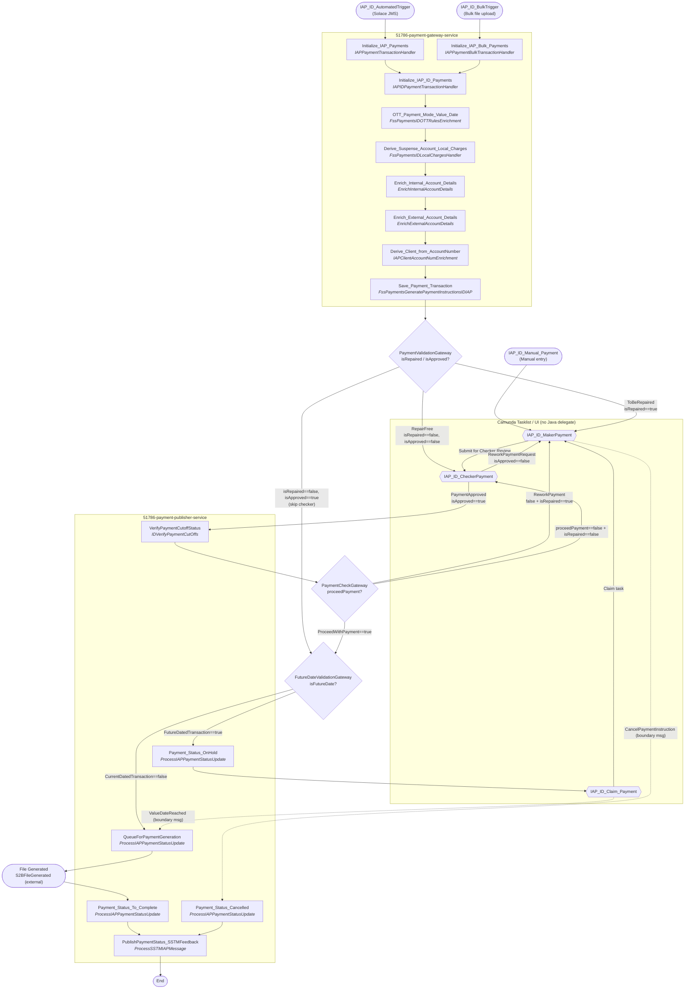
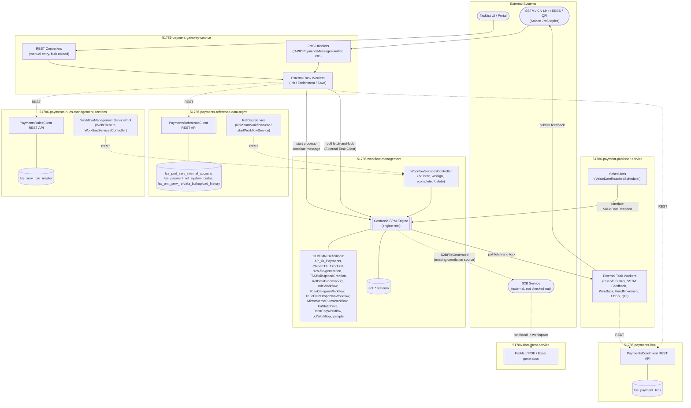

# IAP_ID_Payments — Camunda Workflow Documentation

> **Source BPMN:** [IAP_ID_Payments.bpmn](../src/main/resources/IAP_ID_Payments.bpmn) (module `51786-workflow-management`)

## 1. Workflow Overview

| Attribute | Value |
|---|---|
| **Process ID** | `IAP_ID_Payments` |
| **Process Name** | `IAP_ID_Payments` |
| **BPMN Definitions ID** | `Definitions_1t1lv1p` |
| **History Time To Live** | `10000` days (`camunda:historyTimeToLive="10000"`) |
| **Executable** | `true` |

### Trigger / Start Events
The process has **three** entry points, reflecting the different ways an Indonesia ("ID") payment instruction can enter the maker-checker workflow. All three are now confirmed against Java code in `51786-payment-gateway-service`:

1. **`IAP_ID_AutomatedTrigger`** — a message start event (`Message_0ovzidh`, message name `IAP_ID_AutomatedTrigger`). Confirmed trigger source: [`IAPIDPaymentsMessageHandler`](../../51786-payment-gateway-service/src/main/java/com/sc/fss/paymentgateway/handler/IAPIDPaymentsMessageHandler.java) — a Solace JMS message handler (`GatewayMessageHandler<SSTMIAPRequestDTO>`) that receives an inbound SSTM IAP request off a Solace topic, validates it (`ValidationService`), persists the raw message (`MessageService`), and calls `WorkflowService.startWorkflow(...)` with a `WorkflowRequest` built by `buildWorkflowReqObj(messageId)` using `processKeyValue = "IAP_ID_AutomatedTrigger"` and an initial process variable `isRepaired=false`. Leads into `Initialize_IAP_Payments`.
2. **`IAP_ID_BulkTrigger`** — a message start event (`Message_0wv9miu`, message name `IAP_ID_BulkTrigger`). Confirmed trigger source: [`FssPaymentsSHNBatchUpload`](../../51786-payment-gateway-service/src/main/java/com/sc/fss/paymentgateway/workflow/handler/cnetf/bulkupload/FssPaymentsSHNBatchUpload.java) — a shared batch-upload external task handler (also used for China ETF bulk uploads) that, for `country == "ID"`, sets `processKey = "IAP_ID_BulkTrigger"` (constant `IAP_BATCH_UPLOAD_PROCESS`) plus `isRepaired=false`, `paymentMaker = "{country}_CREATE_{msgType}"`, `paymentChecker = "{country}_VALIDATE_{msgType}"`, and triggers workflow start via `WorkflowService`. Leads into `Initialize_IAP_Bulk_Payments`.
3. **`IAP_ID_Manual_Payment`** — a plain (non-message) start event, used when a maker manually keys in a payment instruction directly (e.g., through a UI/portal action that starts the process instance directly, skipping initialization). Leads straight into `IAP_ID_MakerPayment`. No dedicated Java trigger class was found for this path in-workspace (likely a generic "start process instance by key" call from the UI/gateway, not tied to a country-specific class).

All three entry paths converge before/at the checker-maker cycle, meaning the same downstream validation, checker, cut-off, and file-generation logic is reused regardless of how the payment originated.

### High-Level Goal
This workflow implements the end-to-end lifecycle of an **Indonesia (ID) domestic payment instruction**: it initializes and enriches the payment (client, account, suspense/local-charge, OTT payment-mode/value-date derivation), drives a **maker-checker approval cycle**, validates the payment against currency cut-off/holiday rules, defers execution for future-dated payments, queues the payment for file generation, and finally publishes the completed/cancelled status back to SSTM/S2B while keeping the payment status in sync throughout.

---

## 2. Step-by-Step Process Flow

### Visual Flow Diagram (Process + Code)

The diagram below is the "infographic" view of the whole `IAP_ID_Payments` journey: BPMN triggers/gateways/tasks on top, grouped by the microservice/class that actually implements each step underneath. Diamonds are gateways, stadium shapes are events, hexagons are human (Tasklist/UI) tasks, and rectangles are service tasks (external task handlers) labelled with the BPMN topic + implementing Java class.

### Initialization branch
| Step | Type | Execution Logic |
|---|---|---|
| `IAP_ID_AutomatedTrigger` | Start Event (Message) | Correlates on message `IAP_ID_AutomatedTrigger` — triggered by `IAPIDPaymentsMessageHandler` (Solace JMS inbound handler) with initial variable `isRepaired=false`. |
| `IAP_ID_BulkTrigger` | Start Event (Message) | Correlates on message `IAP_ID_BulkTrigger` — triggered by `FssPaymentsSHNBatchUpload` (shared bulk-upload handler) for `country=="ID"`, with initial variables `isRepaired=false`, `paymentMaker`, `paymentChecker`. |
| `Initialize_IAP_Payments` | Service Task (external, topic `Initialize_IAP_Payments`) | Implemented by `IAPPaymentTransactionHandler`. Parses the raw SSTM IAP JMS message (`SSTMIAPRequestDTO`) into a new `Payment`/`PaymentData`, mapping identifiers (transaction reference, SCA reference, payment type, processing mode, client name), debit/credit detail placeholders, and value date (calling `PaymentsCoreClient.getValueDate(...)`/`getCheckDate(...)` to roll forward past-dated value dates). Persists the enriched payment onto the `Message` (`MessageService.save`). Always completes with `isApproved=false` (both success and failure paths) — meaning single/automated payments always require checker approval. |
| `Initialize_IAP_Bulk_Payments` | Service Task (external, topic `Initialize_IAP_Bulk_Payments`) | Implemented by `IAPPaymentBulkTransactionHandler`. Parses `PaymentsIdBulkUploadDTO` (bulk file row) into `Payment`/`PaymentData`, builds debit/credit detail blocks (`buildDebitDetails`/`buildCreditDetails`), handles cross-currency FX fields (`fxType`, `fxDealNo`, `custFxRate`, `amtPriority`), sets `forcePosting=true`. Completes with `isApproved=true` on success, `isApproved=false` on exhausted-retry failure — i.e. bulk-uploaded payments are pre-approved and can skip the checker step. |
| `Initialize_IAP_ID_Payments` | Service Task (external, topic `Initialize_IAP_ID_Payments`) | Implemented by `IAPIDPaymentTransactionHandler`. Reads the enriched `Payment` and derives the Indonesia-specific payment mode from `transactionType`: `BT` → `TRANSFER` (same-currency) or `BT_CROSS_CURRENCY`; `OTT` → `TT` (USD/USD) or `TT_CROSS_CURRENCY` (setting placeholder `fxType`/`amountPriority` for non-batch channels); any other type produces a `ValidationError` ("Not a Valid Payment Transaction Type"). Saves the enriched message. Common convergence point for both the automated and bulk trigger paths before enrichment begins. |

### Enrichment branch
| Step | Type | Execution Logic |
|---|---|---|
| `OTT_Payment_Mode_Value_Date` | Service Task (external, topic `OTT_Payment_Mode_Value_Date`) | Implemented by `FssPaymentsIDOTTRulesEnrichment`, delegating to `IDOttPaymentEnrichmentStep.process(payment)`. For OTT/IDR-IDR transactions that are **not** client-instructed and **not** batch-uploaded, calls `PaymentsRulesClient.triggerIAPIDOTTRules("OTT_PAYMENT", ...)` with the credit-amount range to get default/next/last preferred payment modes, then calls `PaymentsReferenceClient.getCurrencyCutoffDetails(...)` and `PaymentsCoreClient.getValueDate/getCurrentdate/getNextValueDate(...)` to pick the final payment mode + value date based on whether each mode's cut-off has lapsed. For client-instructed OTT payments, only validates that the client-chosen mode's cut-off hasn't lapsed (adds a `ValidationError` if it has). Skipped entirely if the client has a preferred RTGS mode (per text annotation) or for non-OTT/non-IDR transactions. |
| `Derive_Suspense_Account_Local_Charges` | Service Task (external, topic `Derive_Suspense_Account_Local_Charges`) | Implemented by `FssPaymentsIDLocalChargesHandler`, delegating to `IDIAPLocalChargesEnrichmentStep.process(payment)`. When `localCharge=="C"` (charges borne by remitter) and payment mode is ACH/RTGS/IBFT, adds a second debit leg (suspense account, narration "SERVICE CHARGES") and a second credit leg by calling `PaymentsRulesClient.triggerIAPIDLocalChargeRules("CHARGES_LOCAL", ...)` to resolve the suspense account/currency, then looks up the charge amount via `PaymentsReferenceClient.getChargeSetupModel(...)` (using the debit account's master number if present) and applies it to both new legs. |
| `Enrich_Internal_Account_Details` | Service Task (external, topic `Enrich_Internal_Account_Details`) | Implemented by `EnrichInternalAccountDetails`, delegating to `IDIAPInternalAccountEnrichmentStep.process(payment)`. For each debit/credit leg still missing an `accountType`, calls `PaymentsReferenceClient.getInternalAccountDetailsByCurrency(...)` — if found, marks the leg `INTERNAL` and populates `intDebitAccount`/`intCreditAccount`; if the payment hasn't started its workflow yet and enrichment fails, attaches a `ValidationError` ("Auto enrichment failed for Rules..."). |
| `Enrich_External_Account_Details` | Service Task (external, topic `Enrich_External_Account_Details`) | Implemented by `EnrichExternalAccountDetails`, delegating to `IDIAPExternalAccountEnrichmentStep.process(payment)`. For each debit/credit leg still missing an `accountType`, calls `PaymentsReferenceClient.getExternalAccountDetailsCurrency(...)` — if found, marks the leg `EXTERNAL`; on the debit side, if not found it falls back to marking the leg `INTERNAL` using the raw account number/currency. |
| `Derive_Client_from_AccountNumber` | Service Task (external, topic `Derive_Client_from_AccountNumber`) | Implemented by `IAPClientAccountNumEnrichment`, delegating to `IDIAPClientDetailsEnrichmentStep.process(payment)`. For each debit/credit leg with a resolved `accountType` (`INTERNAL`/`EXTERNAL`), looks up the owning client via `PaymentsReferenceClient.getAllClientInternalDetails(...)` or `getAllClientExternalDetails(...)` (keyed by the account's `funRefId`) and attaches `ClientAllDetailsJsonDTO`; also records the resolved `debitType` in `additionalProperties`. |
| `Save_Payment_Transaction` | Service Task (external, topic `Save_Payment_Transaction`, `processDefinitionKeyIn=["IAP_ID_Payments"]`) | Implemented by `FssPaymentsGeneratePaymentInstructionsIDIAP`. Persists the fully-enriched `Payment` via `PaymentsCoreClient.savePaymentData(...)` (REST call to the core payments DB service), re-hydrates the saved `Payment` (with its generated ID/status) from the response, re-links all related `Message` rows to the new payment ID (`MessageService.getMessageList`/`save`). Completes the task setting `paymentMaker`/`paymentChecker` (from `${iap.candidateGroup.maker}`/`${iap.candidateGroup.checker}` config) and `isRepaired = "true"` if the saved status is `TO_BE_REPAIR`, else `"false"` (also setting `lastUpdatedUser="SYSTEM_USER"` in the repair-free case). A caught `HttpClientErrorException` (validation error from the core service) is treated the same as `isRepaired="true"`. |

### Gateway: `PaymentValidationGateway` (exclusive)
Routes based on the outcome of `Save_Payment_Transaction`:

| Sequence Flow | Condition | Target |
|---|---|---|
| `RepairFree` | `${isRepaired==false and isApproved==false}` | `IAP_ID_CheckerPayment` |
| `ToBeRepaired` | `${isRepaired==true}` | `IAP_ID_MakerPayment` |
| `Flow_12mndij` | `${isRepaired==false and isApproved==true}` | `CheckerApprovalGateway` (skips checker if already approved, e.g. re-entry after rework) |

### Maker / Checker cycle
| Step | Type | Execution Logic |
|---|---|---|
| `IAP_ID_MakerPayment` | User Task (`camunda:assignee="${paymentMaker}"`) | Maker reviews/repairs/keys the payment. Incoming from manual start, rework paths, repair path, and the "claim task" path. Outgoing "Submit for Checker Review" to the checker. Has a **boundary message event** `CancelPaymentInstruction`. |
| `IAP_ID_CheckerPayment` | User Task (`camunda:assignee="${paymentChecker}"`, `documentation="${lastUpdatedUser}"`) | Checker approves/rejects. *Per text annotation:* "Checker review driven by configuration???" (marked as an open question in the model itself). |
| `CheckerApprovalGateway` | Exclusive Gateway | Routes based on checker decision. |

### Gateway: `CheckerApprovalGateway` (exclusive)
| Sequence Flow | Condition | Target |
|---|---|---|
| `ReworkPaymentRequest` | `${isApproved==false}` | `IAP_ID_MakerPayment` (sent back for rework) |
| `PaymentApproved` | `${isApproved==true}` | `VerifyPaymentCutoffStatus` |

### Cut-off / Payment check
| Step | Type | Execution Logic |
|---|---|---|
| `VerifyPaymentCutoffStatus` (id `VerifyPaymentCutoffStatus`, topic `Verify_PaymentCutoffStatus`) | Service Task (external) | *Per text annotation:* Verifies the chosen payment mode is still valid for the current time and sets status: current value date & valid → `QUEUED_FOR_GENERATION`; future value date & valid → `ON_HOLD`; invalid → `TO_BE_REPAIRED`. |
| `PaymentCheckGateway` | Exclusive Gateway | Routes based on `proceedPayment` / `isRepaired`. |

### Gateway: `PaymentCheckGateway` (exclusive)
| Sequence Flow | Condition | Target |
|---|---|---|
| `ProceedWithPayment` | `${proceedPayment==true}` | `FutureDateValidationGateway` |
| `ReworkPayment` | `${proceedPayment=="false" and isRepaired=="true"}` | `IAP_ID_MakerPayment` |
| `Flow_0flkyeb` | `${proceedPayment=="false" and isRepaired=="false"}` | `IAP_ID_CheckerPayment` |

> Note the mixed condition typing (`proceedPayment==true` as boolean vs. `proceedPayment=="false"` as string comparison) — both forms exist in the model; see [§5 Error Handling & Edge Cases](#5-error-handling--edge-cases).

### Gateway: `FutureDateValidationGateway` (exclusive)
| Sequence Flow | Condition | Target |
|---|---|---|
| `FutureDatedTransaction` | `${isFutureDate==true}` | `Payment_Status_OnHold` |
| `CurrentDatedTransaction` | `${isFutureDate==false}` | `QueueForPaymentGeneration` |

### Future-dated (on-hold) path
| Step | Type | Execution Logic |
|---|---|---|
| `Payment_Status_OnHold` | Service Task (external, topic `Payment_Status_OnHold`) | Sets payment status to `On Hold`. |
| `IAP_ID_Claim_Payment` | User Task (`camunda:assignee="${paymentMaker}"`) | *Per text annotation:* When the maker completes this task, status is set to `DRAFT`. Represents the maker "claiming" the on-hold payment for further action before its value date. Has boundary event `ValueDateReached`. |
| `ValueDateReached` | Boundary Event (Message, non-interrupting position not specified — attached to `IAP_ID_Claim_Payment`) | Correlates on message `ValueDateReached` (`Message_1gi791u`) once the payment's value date arrives, routing straight to `QueueForPaymentGeneration` (bypassing the claim task). |
| `Flow_0owiip3` ("Claim task") | Sequence Flow | If the maker completes the claim task before the value date is reached, control returns to `IAP_ID_MakerPayment`. |

### File generation & completion
| Step | Type | Execution Logic |
|---|---|---|
| `QueueForPaymentGeneration` (id `QueueForPaymentGeneration`, topic `Queue_For_PaymentGeneration`) | Service Task (external) | Queues the payment for inclusion in the outbound payment file. |
| `Event_0kavmph` ("File Generated") | Intermediate Catch Event (Message) | Correlates on message `S2BFileGenerated` (`Message_1sme7co`) once the S2B file-generation subsystem confirms the file has been produced. |
| `PaymentStatusToComplete` (topic `Payment_Status_To_Complete`) | Service Task (external) | Sets payment status to `Completed`. |
| `PublishPaymentStatusAndSSTMFeedback` (topic `PublishPaymentStatus_SSTMFeedback`) | Service Task (external) | Publishes the final payment status and SSTM feedback message. Shared end-point for both the normal completion path and the cancellation path. |
| `Event_1c15k4d` ("End") | End Event | Terminates the process instance. |

### Cancellation path
| Step | Type | Execution Logic |
|---|---|---|
| `CancelPaymentInstruction` | Boundary Event (Message), attached to `IAP_ID_MakerPayment` | Correlates on message `CancelPaymentInstruction` (`Message_0z2vtqb`) — allows cancelling a payment instruction while it is with the maker. |
| `PaymentCancellation` (topic `Payment_Status_Cancelled`) | Service Task (external) | Sets payment status to `Cancelled`. |
| → `PublishPaymentStatusAndSSTMFeedback` | Service Task (external) | Same shared publish/feedback task as the completion path. |

---

## 3. Java Implementation Mapping

All Service Tasks use **external task pattern** (`camunda:type="external"`), i.e. they are polled/handled by external workers using `org.camunda.bpm.client` (`@ExternalTaskSubscription` + `ExternalTaskHandler`), **not** `javaDelegate` / `camunda:class` / `camunda:expression` bindings inside the BPMN itself. No `camunda:executionListener` or `camunda:taskListener` extension elements are defined anywhere in this BPMN file. With the prod branches now checked out, **all 14 external task topics** are resolvable to Java classes across two services: `51786-payment-gateway-service` (initialization + enrichment + save) and `51786-payment-publisher-service` (cut-off verification + status updates + SSTM feedback).

| BPMN Task ID / Name | Topic | Service | Java Class / Bean | Core Responsibility |
|---|---|---|---|---|
| `Initialize_IAP_Payments` | `Initialize_IAP_Payments` | `51786-payment-gateway-service` | [`IAPPaymentTransactionHandler`](../../51786-payment-gateway-service/src/main/java/com/sc/fss/paymentgateway/workflow/handler/iap/IAPPaymentTransactionHandler.java) | Parses inbound SSTM IAP JMS message into `Payment`/`PaymentData`; calls `PaymentsCoreClient.getValueDate(...)`/`getCheckDate(...)` (REST) to normalize the value date; persists enriched message via `MessageService`. |
| `Initialize_IAP_Bulk_Payments` | `Initialize_IAP_Bulk_Payments` | `51786-payment-gateway-service` | [`IAPPaymentBulkTransactionHandler`](../../51786-payment-gateway-service/src/main/java/com/sc/fss/paymentgateway/workflow/handler/iap/IAPPaymentBulkTransactionHandler.java) | Parses bulk-upload DTO row into `Payment`/`PaymentData` (debit/credit legs, FX fields); persists enriched message via `MessageService`. |
| `Initialize_IAP_ID_Payments` | `Initialize_IAP_ID_Payments` | `51786-payment-gateway-service` | [`IAPIDPaymentTransactionHandler`](../../51786-payment-gateway-service/src/main/java/com/sc/fss/paymentgateway/workflow/handler/iap/id/IAPIDPaymentTransactionHandler.java) | Derives ID-specific payment mode from transaction type/currency combination (no external REST calls); persists enriched message. |
| `OTT_Payment_Mode_Value_Date` | `OTT_Payment_Mode_Value_Date` | `51786-payment-gateway-service` | [`FssPaymentsIDOTTRulesEnrichment`](../../51786-payment-gateway-service/src/main/java/com/sc/fss/paymentgateway/workflow/handler/iap/id/FssPaymentsIDOTTRulesEnrichment.java) → [`IDOttPaymentEnrichmentStep`](../../51786-payment-gateway-service/src/main/java/com/sc/fss/paymentgateway/processor/iap/id/IDOttPaymentEnrichmentStep.java) | Calls `PaymentsRulesClient.triggerIAPIDOTTRules(...)`, `PaymentsReferenceClient.getCurrencyCutoffDetails(...)`, and `PaymentsCoreClient.getValueDate/getCurrentdate/getNextValueDate(...)` (all REST) to derive final payment mode/value date. |
| `Derive_Suspense_Account_Local_Charges` | `Derive_Suspense_Account_Local_Charges` | `51786-payment-gateway-service` | [`FssPaymentsIDLocalChargesHandler`](../../51786-payment-gateway-service/src/main/java/com/sc/fss/paymentgateway/workflow/handler/iap/id/FssPaymentsIDLocalChargesHandler.java) → [`IDIAPLocalChargesEnrichmentStep`](../../51786-payment-gateway-service/src/main/java/com/sc/fss/paymentgateway/processor/iap/id/IDIAPLocalChargesEnrichmentStep.java) | Calls `PaymentsRulesClient.triggerIAPIDLocalChargeRules(...)` and `PaymentsReferenceClient.getChargeSetupModel(...)`/`getInternalAccountDetails(...)` (REST) to add a suspense debit/credit leg and charge amount when local charges apply. |
| `Enrich_Internal_Account_Details` | `Enrich_Internal_Account_Details` | `51786-payment-gateway-service` | [`EnrichInternalAccountDetails`](../../51786-payment-gateway-service/src/main/java/com/sc/fss/paymentgateway/workflow/handler/iap/id/EnrichInternalAccountDetails.java) → [`IDIAPInternalAccountEnrichmentStep`](../../51786-payment-gateway-service/src/main/java/com/sc/fss/paymentgateway/processor/iap/id/IDIAPInternalAccountEnrichmentStep.java) | Calls `PaymentsReferenceClient.getInternalAccountDetailsByCurrency(...)` (REST) for each debit/credit leg to resolve on-us account details. |
| `Enrich_External_Account_Details` | `Enrich_External_Account_Details` | `51786-payment-gateway-service` | [`EnrichExternalAccountDetails`](../../51786-payment-gateway-service/src/main/java/com/sc/fss/paymentgateway/workflow/handler/iap/id/EnrichExternalAccountDetails.java) → [`IDIAPExternalAccountEnrichmentStep`](../../51786-payment-gateway-service/src/main/java/com/sc/fss/paymentgateway/processor/iap/id/IDIAPExternalAccountEnrichmentStep.java) | Calls `PaymentsReferenceClient.getExternalAccountDetailsCurrency(...)` (REST) for each debit/credit leg to resolve other-bank account details. |
| `Derive_Client_from_AccountNumber` | `Derive_Client_from_AccountNumber` | `51786-payment-gateway-service` | [`IAPClientAccountNumEnrichment`](../../51786-payment-gateway-service/src/main/java/com/sc/fss/paymentgateway/workflow/handler/iap/id/IAPClientAccountNumEnrichment.java) → [`IDIAPClientDetailsEnrichmentStep`](../../51786-payment-gateway-service/src/main/java/com/sc/fss/paymentgateway/processor/iap/id/IDIAPClientDetailsEnrichmentStep.java) | Calls `PaymentsReferenceClient.getAllClientInternalDetails(...)` / `getAllClientExternalDetails(...)` (REST) to resolve the owning client per account leg. |
| `Save_Payment_Transaction` | `Save_Payment_Transaction` | `51786-payment-gateway-service` | [`FssPaymentsGeneratePaymentInstructionsIDIAP`](../../51786-payment-gateway-service/src/main/java/com/sc/fss/paymentgateway/workflow/handler/payments/FssPaymentsGeneratePaymentInstructionsIDIAP.java) (subscription scoped via `processDefinitionKeyIn=["IAP_ID_Payments"]`) | Calls `PaymentsCoreClient.savePaymentData(...)` (REST/DB write) to persist the payment; re-links messages to the new payment ID; sets `isRepaired` / `paymentMaker` / `paymentChecker` / `lastUpdatedUser`. |
| `VerifyPaymentCutoffStatus` | `Verify_PaymentCutoffStatus` | `51786-payment-publisher-service` | [`IDVerifyPaymentCutOffs`](../../51786-payment-publisher-service/src/main/java/com/sc/fss/payments/publisher/handlers/iap/IDVerifyPaymentCutOffs.java) | Fetches the payment record via `PaymentProcessing`; calls `PaymentsReferenceClient.getCurrencyCutoffDetails(...)`, `PaymentsRulesClient.triggerIAPIDOTTRules(...)`, `PaymentsCoreClient` (all REST) for a **second, later** cut-off/OTT re-check post-approval; updates payment mode/value date/status via `PaymentsCoreClient.updatePaymentData(...)` and `PaymentProcessing.updatePayment(...)`; completes with `proceedPayment`, `isRepaired`, `isFutureDate`. |
| `QueueForPaymentGeneration` | `Queue_For_PaymentGeneration` | `51786-payment-publisher-service` | [`ProcessIAPPaymentStatusUpdate`](../../51786-payment-publisher-service/src/main/java/com/sc/fss/payments/publisher/handlers/iap/ProcessIAPPaymentStatusUpdate.java) → bean `PaymentStatusQueueForGeneration()` → `IAPPaymentStatusUpdate.updatePaymentStatusIAPQueuedForGeneration(...)` | Delegates the actual status-update DB write to the `IAPPaymentStatusUpdate` service (interface only — implementation still not present in this workspace, see §6). |
| `Payment_Status_OnHold` | `Payment_Status_OnHold` | `51786-payment-publisher-service` | `ProcessIAPPaymentStatusUpdate` → bean `PaymentStatusOnHold()` → `IAPPaymentStatusUpdate.updatePaymentStatusIAPOnHold(...)` | Same pattern — sets payment status to On Hold via the (external) service implementation. |
| `PaymentCancellation` | `Payment_Status_Cancelled` | `51786-payment-publisher-service` | `ProcessIAPPaymentStatusUpdate` → bean `PaymentStatusCancelled()` → `IAPPaymentStatusUpdate.updatePaymentStatusIAPCancelled(...)` | Sets payment status to Cancelled. |
| `PaymentStatusToComplete` | `Payment_Status_To_Complete` | `51786-payment-publisher-service` | `ProcessIAPPaymentStatusUpdate` → bean `PaymentStatusCompleted()` → `IAPPaymentStatusUpdate.updatePaymentStatusIAPCompleted(...)` | Sets payment status to Completed. |
| `PublishPaymentStatusAndSSTMFeedback` | `PublishPaymentStatus_SSTMFeedback` | `51786-payment-publisher-service` | [`ProcessSSTMIAPMessage`](../../51786-payment-publisher-service/src/main/java/com/sc/fss/payments/publisher/handlers/ProcessSSTMIAPMessage.java) | Loads the `Payment` via `PaymentProcessing.getPaymentRecord(businessKey)`; for `SSTM_SYSTEM` channel payments, rebuilds and publishes the SSTM feedback message via `MessagePublishService.publishMessage(...)`, then persists an audit `Message` (status `PROCESSED`). |
| `IAP_ID_MakerPayment` / `IAP_ID_CheckerPayment` / `IAP_ID_Claim_Payment` | n/a (User Tasks) | n/a (Tasklist/UI) | No delegate — resolved by Camunda Tasklist against `${paymentMaker}` / `${paymentChecker}` process variables (assignee expressions), no listeners defined. The checker's Approve/Reject decision is submitted from the UI/gateway as a generic workflow-action REST request (`workflowAction: APPROVE/REJECT`, `variables.isApproved`) that calls `WorkflowService.completeTask(...)` — no country-specific Java class implements this action. | Human review/action steps. |

Related/adjacent infrastructure identified (trigger sources and correlation, confirmed against code now available):
- **`IAPIDPaymentsMessageHandler`** (`51786-payment-gateway-service`) — Solace JMS inbound handler; starts the `IAP_ID_AutomatedTrigger` process (see §1).
- **`FssPaymentsSHNBatchUpload`** (`51786-payment-gateway-service`) — shared batch-upload handler; starts the `IAP_ID_BulkTrigger` process for country `ID` (see §1).
- **`ValueDateReachedScheduler`** (`51786-payment-publisher-service`, `@Component`, `@Scheduled(cron = "${value-date-reached-schedule}")`) — iterates configured countries (`${value-date-reached-country-codes}`), finds `ON_HOLD` payments whose value date has arrived via `PaymentProcessing.getPaymentRecordsByValueDate(...)`, and correlates the `ValueDateReached` message via `WorkflowService.startMessageCorrelation(...)` using the payment's `workflowKey` as the `functionId`. This is the most likely trigger for the `ValueDateReached` boundary event on `IAP_ID_Claim_Payment`.
- A commented-out/deprecated class `IDVerifyPaymentCutOff` (topic `Verify_PaymentCutoffStatus1`, marked "Need to remove this class file") exists alongside the active `IDVerifyPaymentCutOffs` — safe to ignore, but worth flagging for cleanup since it's dead code in the same package.
- `VerifyPaymentCutoffStatus` / `Verify_PaymentCutoffStatus` runs a very similar OTT/cut-off computation to `OTT_Payment_Mode_Value_Date`'s `IDOttPaymentEnrichmentStep` earlier in the flow — this is intentional (initial derivation during enrichment, then a re-verification immediately before queueing, to catch cut-off lapses that occurred during the maker/checker cycle), but worth confirming with the team given the amount of duplicated logic between the two classes.

---

## 4. Process Variables Dictionary

| Variable Name | Data Type | Origin | Purpose |
|---|---|---|---|
| `paymentMaker` | String (candidate group id) | Initial value set at process start via `FssPaymentsSHNBatchUpload` for the bulk path (`"{country}_CREATE_{msgType}"`); authoritatively (re)set by `FssPaymentsGeneratePaymentInstructionsIDIAP` (`Save_Payment_Transaction`) from config `${iap.candidateGroup.maker}` for all paths | Assignee expression `${paymentMaker}` for `IAP_ID_MakerPayment` and `IAP_ID_Claim_Payment`. |
| `paymentChecker` | String (candidate group id) | Initial value set at process start via `FssPaymentsSHNBatchUpload` for the bulk path (`"{country}_VALIDATE_{msgType}"`); authoritatively (re)set by `FssPaymentsGeneratePaymentInstructionsIDIAP` (`Save_Payment_Transaction`) from config `${iap.candidateGroup.checker}` | Assignee expression `${paymentChecker}` for `IAP_ID_CheckerPayment`. |
| `lastUpdatedUser` | String | Set to the literal `"SYSTEM_USER"` by `FssPaymentsGeneratePaymentInstructionsIDIAP` (`Save_Payment_Transaction`) only on the repair-free completion path; otherwise reflects whichever user (maker/checker) last actioned the task via the UI/Tasklist | Rendered as the `IAP_ID_CheckerPayment` task documentation. |
| `isRepaired` | Boolean (initial value from `IAPIDPaymentsMessageHandler` / `FssPaymentsSHNBatchUpload`) / String `"true"`/`"false"` (from external task handlers thereafter) | Initialized `false` at process start; set by `FssPaymentsGeneratePaymentInstructionsIDIAP` (`Save_Payment_Transaction`) to `"true"` if the saved status is `TO_BE_REPAIR` else `"false"`; re-set by `IDVerifyPaymentCutOffs` (`Verify_PaymentCutoffStatus`) — read via `externalTask.getVariable("isRepaired")`, defaults to `"false"` if absent | Drives `PaymentValidationGateway` and `PaymentCheckGateway` routing between checker/maker/rework paths. |
| `isApproved` | Boolean | Set by `IAPPaymentTransactionHandler` (`Initialize_IAP_Payments`) to **always `false`** for automated/single payments (forces checker review); set by `IAPPaymentBulkTransactionHandler` (`Initialize_IAP_Bulk_Payments`) to `true` on success / `false` on failure (bulk payments can be pre-approved and skip checker review); subsequently overwritten when the checker actions the `IAP_ID_CheckerPayment` task via a generic workflow-action REST request (`variables.isApproved`, not a country-specific Java class) | Drives `PaymentValidationGateway` (`Flow_12mndij` skip-checker path) and `CheckerApprovalGateway` (`ReworkPaymentRequest` / `PaymentApproved`). |
| `proceedPayment` | String (`"true"`/`"false"`) | Set by `IDVerifyPaymentCutOffs` (`Verify_PaymentCutoffStatus`) via `externalTaskService.complete(externalTask, Map.of("proceedPayment", proceedPayment, ...))` | Drives `PaymentCheckGateway` routing (proceed / rework / send back to checker). |
| `isFutureDate` | String (`"true"`/`"false"`) | Set by `IDVerifyPaymentCutOffs` (`Verify_PaymentCutoffStatus`), computed by comparing the payment's value date against `PaymentsCoreClient.getCurrentdate(...)` | Drives `FutureDateValidationGateway` (on-hold vs. queue-for-generation). |
| `PaymentCountry` | String (`"ID"`) | Set by `IDVerifyPaymentCutOffs` on task completion (hard-coded `"ID"`) | Country context passed to downstream tasks for status-update lookups. |
| `PaymentCategory` | String (`"FSPAYMENT"`) | Set by `IDVerifyPaymentCutOffs` on task completion (hard-coded `"FSPAYMENT"`); also set to `"FSPAYMENT"` on the `Payment` object by `FssPaymentsGeneratePaymentInstructionsIDIAP` | Category context passed to downstream tasks for status-update lookups. |

> `execution.getVariable()` / `execution.setVariable()` (the classic `JavaDelegate` API) are **not used** anywhere in this flow — every task is an external task worker, using `externalTask.getVariable(...)` (read) and `externalTaskService.complete(externalTask, Map.of(...))` (write), the external-task-client equivalent. The six pure-enrichment steps (`Initialize_IAP_ID_Payments`, `OTT_Payment_Mode_Value_Date`, `Derive_Suspense_Account_Local_Charges`, `Enrich_Internal_Account_Details`, `Enrich_External_Account_Details`, `Derive_Client_from_AccountNumber`) do **not** read/write Camunda process variables at all — they operate purely on the `Payment` / `PaymentData` object serialized inside the `Message.enrichedMessage` JSON blob (read via `MessageService.getMessage(id)`, written back via `MessageService.save(message)`), and call `externalTaskService.complete(externalTask)` with no variables to simply advance the flow.

---

## 5. Error Handling & Edge Cases

- **No BPMN Error Boundary Events (`bpmn:errorEventDefinition`)** exist anywhere in this process. All boundary events present are **message** boundary events:
  - `CancelPaymentInstruction` (on `IAP_ID_MakerPayment`) — message `Message_0z2vtqb`.
  - `ValueDateReached` (on `IAP_ID_Claim_Payment`) — message `Message_1gi791u`.
- **No `camunda:failedJobRetryTimeCycle`** is configured on any task in the BPMN XML itself. Retry handling instead happens **programmatically** inside every external task handler in both services, using a shared pattern: catch `Exception`, look up remaining retries via `ExternalTaskHelper.getRetries(externalTask)` and a computed backoff via `ExternalTaskHelper.getNextTimeout(retries)` (implementation of `ExternalTaskHelper` is in the shared `com.sc.fssservices.workflowclient` library, still not present as source in this workspace — it's a compiled dependency), then call `externalTaskService.handleFailure(...)` to retry. This pattern is used consistently by `IAPPaymentTransactionHandler`, `IAPPaymentBulkTransactionHandler`, `IAPIDPaymentTransactionHandler`, `FssPaymentsIDOTTRulesEnrichment`, `FssPaymentsIDLocalChargesHandler`, `EnrichInternalAccountDetails`, `EnrichExternalAccountDetails`, `IAPClientAccountNumEnrichment`, `FssPaymentsGeneratePaymentInstructionsIDIAP`, and `IDVerifyPaymentCutOffs`.
- When retries are exhausted (`retries == 0`), most handlers **swallow the error and call `externalTaskService.complete(externalTask)`** with no (or only partial) variables — e.g. `IDVerifyPaymentCutOffs` completes with no `proceedPayment` / `isFutureDate` / `isRepaired`, which would cause a Camunda expression evaluation failure (missing variable) on `PaymentCheckGateway` / `FutureDateValidationGateway`. `FssPaymentsGeneratePaymentInstructionsIDIAP` is the one exception that completes exhausted retries with `isRepaired="true"` (safely routing to rework) instead of leaving variables unset. This inconsistency across handlers is a notable edge case / potential defect worth flagging to the team.
- `FssPaymentsGeneratePaymentInstructionsIDIAP` (`Save_Payment_Transaction`) explicitly distinguishes `HttpClientErrorException` (treated as a validation failure from the core payments service → completes immediately with `isRepaired="true"`, no retry) from other exceptions (→ goes through the standard retry/exhaustion logic above).
- An internal error inside `IDOttPaymentEnrichmentStep` / `IDVerifyPaymentCutOffs`'s OTT-rules branch is deliberately re-thrown as `com.sc.fssservices.common.exception.FSSServiceException` to be caught by the outer handler and routed into the standard retry/complete logic.
- `IDIAPLocalChargesEnrichmentStep` additionally catches `NullPointerException` separately (logs and silently continues without failing the task) — guarding against a missing debit account number during local-charges enrichment.
- `ProcessSSTMIAPMessage` catches `Exception` around its message-rebuilding logic and re-throws as an unchecked `RuntimeException` — with **no explicit `externalTaskService.handleFailure(...)` call**, so Camunda's default external-task retry behavior (engine-level default retries) would apply for that specific task.
- **Mixed condition typing** on gateway sequence flows is worth noting as a subtle edge case: `PaymentValidationGateway` / `CheckerApprovalGateway` use boolean-style comparisons (`${isApproved==true}`), while `PaymentCheckGateway` uses string comparisons (`'${proceedPayment=="false" and isRepaired=="true"}'`). Since `IDVerifyPaymentCutOffs` sets `proceedPayment` / `isRepaired` as `String` values (`"true"`/`"false"`) when completing the external task, the string-comparison flows are consistent with the producer, but this inconsistency across the model increases the risk of a future regression if a delegate is changed to emit real `Boolean` variables instead of strings.
- **`ValueDateReachedScheduler`** wraps its country-loop payment-correlation logic in `@Transactional`, and any `MismatchingMessageCorrelationException` thrown by `WorkflowService.startMessageCorrelation(...)` is unhandled in the loop — an exception for one payment would abort the whole scheduled batch run for that invocation (visible in the corresponding test suite mocking `MismatchingMessageCorrelationException`).

---

## 6. Missing Java Delegates / Implementations

Following the prod branch checkout of `51786-payment-gateway-service`, **all 14 BPMN external task topics** referenced by `IAP_ID_Payments.bpmn` are now resolved to a Java handler in this workspace (see §3). Only two gaps remain:

1. **`IAPPaymentStatusUpdate` implementation** — the interface (used by `ProcessIAPPaymentStatusUpdate` for `Queue_For_PaymentGeneration`, `Payment_Status_OnHold`, `Payment_Status_Cancelled`, `Payment_Status_To_Complete`) still has **no implementing class present in this workspace** — only its interface definition was found at `[IAPPaymentStatusUpdate.java](../../51786-payment-publisher-service/src/main/java/com/sc/fss/payments/publisher/service/IAPPaymentStatusUpdate.java)`. The concrete DB/status-update logic for those four tasks could not be fully documented in §3/§4 as a result — likely implemented in a `paymentcore`/service-impl module not checked out in this workspace.
2. **Correlation source for `Message_1sme7co` (`S2BFileGenerated`) and `CancelPaymentInstruction`** — unlike the other message events (`IAP_ID_AutomatedTrigger`, `IAP_ID_BulkTrigger`, `ValueDateReached`, all now confirmed in §3), no class calling `startMessageCorrelation`/`startProcessInstanceByMessage` with these two message names could be located anywhere in the workspace, even after the additional checkouts. The S2B file-generation confirmation and the maker-side cancel action are presumably raised by a downstream file-generation service and a generic UI/gateway cancel endpoint, respectively, neither of which appear to be checked out here.

`ExternalTaskHelper` (used for retry/backoff calculations by every handler) also remains a compiled dependency from the shared `com.sc.fssservices.workflowclient` library with no source in this workspace — its exact retry-count/backoff behavior could not be verified beyond what's inferable from call sites.

## 7. Key Database Tables

The tables below back the `IAP_ID_Payments` flow end-to-end (rules, reference data, core transaction storage, messaging, workflow engine state, S2B file generation, and bulk upload tracking). Owning module/service and schema detail were confirmed against JPA entities (`@Table`) and `schema.sql` fixtures found in the workspace.

| S.No | Table Name | Brief Description | Owning Module / Entity |
|---|---|---|---|
| 1 | `fss_serv_rule_master` | Rule table for ID payment-related configured rules (e.g. OTT payment-mode rules, local-charges rules invoked via `PaymentsRulesClient.triggerIAPIDOTTRules(...)` / `triggerIAPIDLocalChargeRules(...)`). | `51786-payments-rules-management-services` — [`RuleMasterEntity`](../../51786-payments-rules-management-services/src/main/java/com/sc/fss/payments/rules/entity/RuleMasterEntity.java) (columns: `id`, `country`, `module_name`, `rule_group`, `rule_id`, `rule_name`, `rule_description`, `rule_weightage`, `status`, `is_active`, `rule_drl`, `rule_blob`, `created_by`, `created_on`, ...). |
| 2 | `fss_pmt_serv_internal_account` | Reference table for ID payment static data for internal accounts (credit & debit account details — on-us account master). Looked up via `PaymentsReferenceClient.getInternalAccountDetailsByCurrency(...)` / `getInternalAccountDetails(...)`. | `51786-payments-reference-data-mgmt` — [`InternalAccountDAO`](../../51786-payments-reference-data-mgmt/src/main/java/com/sc/fss/payments/refdata/entity/InternalAccountDAO.java) (columns: `id`, `country_entity`, `country`, `acc_num`, `short_name`, `currency`, `bic`, `addr_ln1..3`, `type`, `status`, `active_from`, `active_to`, `version`, `funrefid`). Also mirrored as [`InternalAccountEntity`](../../51786-payments-rules-management-services/src/main/java/com/sc/fss/payments/rules/entity/InternalAccountEntity.java) in the rules service. |
| 3 | `fss_payment_txns` | Core payment transaction table for ID payment-related transactions — the row created/updated by `Save_Payment_Transaction` (`FssPaymentsGeneratePaymentInstructionsIDIAP` -> `PaymentsCoreClient.savePaymentData(...)`) and read back by `PaymentProcessing.getPaymentRecord(...)` throughout the flow. | `51786-payments-impl` (schema fixture: [`schema.sql`](../../51786-payments-impl/src/test/resources/schema.sql)) — columns: `payment_id`, `version`, `created_date`, `last_updated_date`, `value_date`, `client_name`, `country`, `created_by`, `last_updated_by`, `payment_category`, `payment_type`, `scenario_name`, `status`, `sub_status`, `transaction_type`, `workflow_key`, `processing_error`, `txn_data` (full 'Payment'/'PaymentData' JSON), `external_txn_ref_id`. |
| 4 | `fss_payment_ref_system_codes` | System code setup for ID payments (e.g. lookup/enum-style reference codes used across enrichment steps). | `51786-payments-reference-data-mgmt` — [`SystemCodeDAO`](../../51786-payments-reference-data-mgmt/src/main/java/com/sc/fss/payments/refdata/entity/v2/SystemCodeDAO.java) (columns: `id`, `type`, `code_id`, `code_val`, `description`, `ordr_by`, `created_by`, `updated_by`, `created_date`, ...). |
| 5 | `fss_services_message` | Service message table for all Solace-related inbound & outbound messages — every 'Message' row (`message_data`, `enriched_message`) referenced throughout §3 (`MessageService.getMessage(...)` / `save(...)`), including the inbound SSTM IAP request consumed by `IAPIDPaymentsMessageHandler` and the enriched 'Payment' payload passed between enrichment steps. | `51786-payment-gateway-service` / `51786-payment-publisher-service` (shared schema fixture: `schema.sql` in both modules) — columns: `message_id`, `message_ts`, `message_type`, `message_status`, `processing_count`, `message_data`, `message_headers`, `processing_errors`, `last_updated_ts`, `functional_id`, `batch_id`, `channel`, `country`, `sub_type`, `enriched_message`. |
| 6 | `act_*` | Camunda workflow engine tables (e.g. `act_ru_execution`, `act_hi_procinst`, `act_ru_task`, `act_ru_variable`, etc.) that hold the live and historic state of every `IAP_ID_Payments` process instance, its gateways/tasks, and process variables (`isRepaired`, `isApproved`, `proceedPayment`, `isFutureDate`, `paymentMaker`, `paymentChecker`, ...). | `51786-workflow-management` — managed by the embedded Camunda BPM engine (`camunda.bpm.database.schema-update=false` in [`application.properties`](../../src/main/resources/application.properties), i.e. schema is pre-provisioned, not auto-generated). Not a workspace-defined entity — standard Camunda engine schema. |
| 7 | `fss_pmt_serv_s2b_rec` & `fss_pmt_serv_s2b_req` | S2B (Straight-2-Bank) related tables — back the outbound payment file generation/request-response cycle correlated by the `Event_0kavmph` ("File Generated" / `S2BFileGenerated`) intermediate catch event after `QueueForPaymentGeneration`. | **Not found in this workspace** — no `@Table`/entity or `schema.sql` reference located under any of the nine checked out repos. Referenced indirectly via the external `com.sc.fssservice.s2b.payments.service.PaymentFileService` client (seen in `ValueDateReachedScheduler`), implying these tables live in a separate S2B service not checked out here. |
| 8 | `fss_pmt_serv_refdata_bulkupload_history` | Reference data bulk upload functionality — tracks bulk uploads of reference data (accounts, system codes, etc.), not payment transactions themselves. | `51786-payments-reference-data-mgmt` — [`RefDataBulkUploadHistoryDAO`](../../51786-payments-reference-data-mgmt/src/main/java/com/sc/fss/payments/refdata/entity/RefDataBulkUploadHistoryDAO.java) (columns: `file_upload_id`, `file_name`, `uploaded_by`, `uploaded_timestamp`, `upload_status`, `remarks`, `uploaded_file_path`, `entity`). |
| 9 | `fss_serv_batch` | Bulk-upload **payment transaction** batch tracking (distinct from #8's reference-data uploads) — tracks the batch file consumed by `Initialize_IAP_Bulk_Payments` (`IAPPaymentBulkTransactionHandler`) / `FssPaymentsSHNBatchUpload` for the `IAP_ID_BulkTrigger` path. | `51786-payment-gateway-service` — [`BatchUploadHistoryEntity`](../../51786-payment-gateway-service/src/main/java/com/sc/fss/paymentgateway/model/entity/BatchUploadHistoryEntity.java) (columns: `batch_id`, `file_name` (unique), `file_path`, `country`, `type`, `subtype`, `status`, `created_by`, `created_timestamp`, `updated_by`, `updated_timestamp`). |

> Note: table #2 (`fss_pmt_serv_internal_account`) and rule table #1 are both duplicated as JPA entities in two services (`51786-payments-reference-data-mgmt` and `51786-payments-rules-management-services`) — each service maintains its own read model against the same underlying table, rather than one owning service exposing it via REST to the other.

## 8. Basic Architecture & Service Interaction (All Workflows)

This section zooms out from `IAP_ID_Payments` to the **whole `51786-workflow-management` Camunda engine** and how every checked-out service plugs into it. It is intended as a reference for anyone designing or modifying the overall architecture, not just the ID payments flow.

### 8.1 All BPMN Process Definitions Hosted in `51786-workflow-management`

A single embedded Camunda BPM engine (in `51786-workflow-management`) hosts **13 process definitions**. They fall into two clearly distinct families:

| Process ID (`bpmn:process id`) | BPMN File | Trigger(s) | Category | Owning Business Service(s) |
|---|---|---|---|---|
| `IAP_ID_Payments` | `IAP_ID_Payments.bpmn` | Message (`IAP_ID_AutomatedTrigger`, `IAP_ID_BulkTrigger`) + manual start | **Payment flow** (maker-checker + external tasks) | `51786-payment-gateway-service` (init/enrichment/save) + `51786-payment-publisher-service` (cut-off/status/SSTM) — fully documented in §1-§6 above. |
| `ChinaETF_TplusZero` | `ChinaEFT_T+0.bpmn` | Message (`SSTM_CN_ETF_T0_AutomatedTrigger`) + manual start (`CN_ETF_TO_ManualPayment`) | **Payment flow** | Same pattern as IAP_ID: `51786-payment-gateway-service` handles `CN_ETF_TO_GeneratePaymentInstruction`, `CN_ETF_TO_RulesEnrichment`, `CN_ETF_TO_ReferenceEnrichment`, `CN_ETF_TO_SSTMEnrichment`; `51786-payment-publisher-service` handles `CN_ETF_TO_QFI_PaymentFulfillment`, `CN_ETF_TO_SSTM_Update`, `CN_ETF_TO_PaymentStatusUpdate`, `CN_ETF_TO_PaymentIntermediateStatus`. Same-day (T+0) settlement variant of the China ETF flow. |
| `ChinaETF_TPlusN` | `ChinaEFT_T+N.bpmn` | Message (`CN_LINK_ETF_TN_AutomatedTrigger`, `CN_LINK_ETF_TN_BulkUpload`) + manual start (`CN_ETF_ManualPayment`) | **Payment flow** (largest/most complex definition in the engine — 30+ service tasks) | Same two services, much larger surface: CN Link enrichment (`CN_LINK_Enrichment`), fund movement checks/approvals (`FundMovementChecks`, `FundMovementApprovalUpdate`, `FundMovementRejectUpdate`, `FundMovementSkip*Update`), wireback (`WireBackRequest*`, `WireBackSkip*Update`, `WireBackRejectedStatusUpdate`), EBBS postings/holdings (`PublishEbbsPostingsFor(Pay,Receive)`, `EbbsPaymentsHoldingsFor(Pay,Receive)`, `EBBSSkip*Update(Pay,Receive)`), QFI fulfillment (`CN_ETF_QFI_PaymentFulfillment`, `QfiPaymentFulfillmentUpdate`, `QfiSkip*Update`), cash affirmation (`GenerateCashAffirmation`, `CashAffirmationFulfillmentStatus`), and bulk upload (`CN_BulkUpload_Enrichment`). Deferred (T+N) settlement variant. Nearly all of these topics are implemented in `51786-payment-publisher-service/.../handlers/fundmovement/**` and `handlers/wireback/**` (confirmed in earlier sessions), plus `51786-payment-gateway-service` for enrichment. |
| `s2b-file-generation` | `S2b-Workflow.bpmn` | Plain start event (`S2b_Workflow_Initiate` — likely kicked off by a scheduler/batch job, not a message) | **Batch/file-generation flow** | Topics `Change_S2B_Batch_IN_Progress`, `StagePaymentID`, `ConstructS2BFileEntries`, `GenerateS2BFiles`, `UpdateS2BBatch_Payment_Status`, `HandleFileGeneratedEvent` — **no implementing Java class found anywhere in this workspace**. This is almost certainly the producer of the `S2BFileGenerated` message that `IAP_ID_Payments` (`Event_0kavmph`) and other payment flows wait on, confirming the gap already flagged in §6/§7 — the S2B service is a separate, not-checked-out microservice (per its own text annotations: search `QUEUED_FOR_GENERATION` payments -> stage -> construct file entries -> generate file via FileNet -> update batch/payment status -> handle file-generated event, e.g. emailing the file for country `ID`). |
| `FSSBulkUploadCreation` | `FSSBulkUpload.bpmn` | Plain start event (`FSSBulkUpload`) | **Generic maker-checker** | `BulkUploadMaker` / `BulkUploadChecker` user tasks (`${paymentMaker}` / `${paymentChecker}`) + `BulkUploadBatchUpdate` external task. Generic bulk-upload approval shell — distinct from the country-specific `IAP_ID_BulkTrigger` path inside `IAP_ID_Payments` itself. |
| `RefDataProcess` / `RefDataProcessV2` | `refDataWorkflow.bpmn` / `refDataWorkflowV2.bpmn` | Plain start event, driven purely by REST | **Generic maker-checker** (no external service tasks — pure human-task shell) | `51786-payments-reference-data-mgmt` — every ref-data service (`ClientServiceImpl`, `HolidayCurrCalServiceImpl`, `ContactDetailsServiceImpl`, `ExternalAccountServiceImpl`, `InterestedPartyServiceImpl`, etc.) calls its own `RefDataService.kickStartWorkflowServ(...)` / `startWorkflowService(...)` to draft -> submit these processes for approval. |
| `MirrorMemoRulesWorkflow` | `MirrorMemoRulesWorkflow.bpmn` | Plain start event | **Generic maker-checker** | `51786-payments-reference-data-mgmt` — `MirrorMemoMappingServiceImpl` (mirror-memo account mapping approvals). |
| `ruleWorkflow` | `rulesWorkflow.bpmn` | Plain start event | **Generic maker-checker** | `51786-payments-rules-management-services` — `RefCodeServiceImpl`, `RulesModificationServiceImpl` (`PROCESSKEYVALUE = "ruleWorkflow"`); drives approval of `fss_serv_rule_master` rows (OTT rules, local-charges rules, etc.). |
| `RuleCategoryWorkflow` | `RuleCategoryWorkflow.bpmn` | Plain start event | **Generic maker-checker** | `51786-payments-rules-management-services` — rule *category* CRUD approval (separate from individual rule approval). |
| `RuleFieldDropdownWorkflow` | `RuleFieldDropdownWorkflow.bpmn` | Plain start event | **Generic maker-checker** | `51786-payments-rules-management-services` — rule *field dropdown* config approval. |
| `FaStaticData` | `FeesAccrualStaticData.bpmn` | Plain start event | **Generic maker-checker** | No confirmed caller found in this workspace — likely a Fees Accrual module/service not checked out, or a template awaiting integration. |
| `BtOttChqWorkflow` | `btOttChequeWorkflow.bpmn` | Plain start event | **Generic maker-checker** (`savePayment` -> `reviewPaymentInstructions` -> approve/reject -> `Activity_17ytwfu` "Process Payments") | No confirmed caller found in this workspace — likely superseded by `IAP_ID_Payments`/`ChinaETF_*` or reserved for a BT/OTT cheque feature not yet wired up. Note it's mislabeled `name="PDF Workflow"` in the XML (copy-paste artifact from `pdfWorkflow.bpmn`). |
| `pdfWorkflow` | `pdfWorkflow.bpmn` | Plain start event | **Template/sample** | No confirmed caller — appears to be a template that `btOttChequeWorkflow.bpmn` was cloned from. |
| `sampWf` | `sample.bpmn` | Plain start event | **Template/sample** | Trivial `sampleExtTask`/`sampleTopic` — developer scaffold, not a real business flow. |

### 8.2 Service Inventory & Responsibilities

| Service | Primary Responsibility | Talks to Camunda via |
|---|---|---|
| `51786-workflow-management` | Hosts the single embedded Camunda BPM engine + exposes both the native Camunda `engine-rest` API and a custom [`WorkflowServicesController`](../../src/main/java/com/sc/fss/iap/workflow/controller/WorkflowServicesController.java) (`/v1/start/startWorkflowProcess`, `/v1/assign/**`, `/v1/complete/completeCurrentTask/{referenceId}`, `/v1/delete/**`). Owns only Camunda's own `act_*` schema — no business data. | n/a (is the engine) |
| `51786-payment-gateway-service` | Inbound channel/ingestion layer: Solace JMS consumers for SSTM/CN Link/EBBS/QFI messages, REST controllers for UI/manual/bulk entry, external task workers for **initialization + enrichment + save** across `IAP_ID_Payments` and both `ChinaETF_*` flows. | (a) `camunda-bpm-client` (External Task Client, `@ExternalTaskSubscription`) polling `engine-rest` — see `camunda_bpm_client_base_url` in `ado-playbook/variables/*.yml`; (b) `com.sc.fssservices.workflowclient.service.WorkflowService` client to start processes / correlate messages via `engine-rest` or `WorkflowServicesController`. |
| `51786-payment-publisher-service` | Outbound/status layer: cut-off verification, payment-status updates, SSTM feedback publishing, wireback, fund-movement, EBBS postings, QFI fulfillment; scheduled jobs (`ValueDateReachedScheduler`) that correlate boundary messages back into running instances. | Same dual pattern as gateway-service: External Task Client for service tasks, `WorkflowService` client for message correlation (`startMessageCorrelation`). |
| `51786-payments-impl` | Core payment transaction persistence (`fss_payment_txns`) and the `PaymentsCoreClient` REST API surface (`savePaymentData`, `getValueDate`, `getCurrentDate`, `getNextValueDate`, `getCheckDate`, `updatePaymentData`) consumed by both gateway and publisher services. | Not a Camunda participant itself — pure REST backend called *by* the external task workers in the two services above. |
| `51786-payments-reference-data-mgmt` | Reference data CRUD (internal/external accounts, system codes, holidays/cut-offs, clients, interested parties, mirror-memo mappings, bulk upload history) behind `PaymentsReferenceClient`, with its own maker-checker approval flows (`RefDataProcess(V2)`, `MirrorMemoRulesWorkflow`). | REST `WebClient` calls to `WorkflowServicesController` (`kickStartWorkflowServ` / `startWorkflowService`) — does **not** use the External Task Client (its workflows are plain human-task shells with no service tasks). |
| `51786-payments-rules-management-services` | Rules CRUD (`fss_serv_rule_master`, rule categories, dropdown configs) behind `PaymentsRulesClient` (`triggerIAPIDOTTRules`, `triggerIAPIDLocalChargeRules`, etc.), with its own maker-checker flows (`ruleWorkflow`, `RuleCategoryWorkflow`, `RuleFieldDropdownWorkflow`). | Same REST pattern as reference-data-mgmt, via its own `WorkflowManagementServiceImpl` (`${workflow.baseurl}` + `WebClient`). |
| `51786-document-service` | Document/PDF/FileNet generation (e.g. `S2B.xlsx` templates referenced in test fixtures). | Not a confirmed Camunda participant in this workspace — likely invoked by the (external) S2B service or `GenerateS2BFiles` / `HandleFileGeneratedEvent` topics for file storage. |
| *S2B service (external, not checked out)* | Implements `s2b-file-generation`'s service tasks, owns `fss_pmt_serv_s2b_rec` / `fss_pmt_serv_s2b_req`, and raises `S2BFileGenerated` back to the payment flows. | Inferred only — no source present in this workspace. |

### 8.3 Integration Patterns in Play

Four distinct integration mechanisms coexist across the platform — important to know which one applies when extending or troubleshooting any given flow:

1. **Camunda External Task Client (pull/poll model)** — every `camunda:type="external"` service task in every BPMN is picked up by a `@ExternalTaskSubscription`-annotated Spring bean living in `payment-gateway-service` or `payment-publisher-service`. These workers long-poll `51786-workflow-management`'s `engine-rest` API (`camunda_bpm_client_base_url`, e.g. `https://.../api/fss/payments/workflow/engine-rest`) to fetch-and-lock tasks, execute business logic (often calling out over REST to `payments-impl` / `reference-data-mgmt` / `rules-management-services`), then report completion/failure back over the same REST API. This is the dominant pattern for **all payment flows** (`IAP_ID_Payments`, `ChinaETF_*`, `s2b-file-generation` in theory, `FSSBulkUploadCreation`).
2. **Message correlation (push model)** — process **start** (`IAP_ID_AutomatedTrigger`, `IAP_ID_BulkTrigger`, `SSTM_CN_ETF_TO_AutomatedTrigger`, etc.) and **boundary events** (`CancelPaymentInstruction`, `ValueDateReached`) are driven by the shared `com.sc.fssservices.workflowclient.service.WorkflowService` client calling `startWorkflow(...)` / `startMessageCorrelation(...)`, ultimately hitting Camunda's message-correlation REST API on `engine-rest`.
3. **Generic Workflow REST façade (`WorkflowServicesController`)** — `reference-data-mgmt` and `rules-management-services` don't use the External Task Client at all (their BPMN processes are plain human-task/maker-checker shells with no service tasks). Instead they call a small, generic REST contract (`startWorkflowProcess`, `assignUserToTask`, `completeCurrentTask`, `deleteProcessInstanceById`, ...) so they never need direct Camunda engine knowledge — this is the pattern to reuse for any **new simple approval workflow** that doesn't need automated service tasks.
4. **Solace JMS pub/sub** — inbound channel messages (SSTM IAP/ETF, CN Link, EBBS, QFI) arrive via Solace topics/queues into `payment-gateway-service` (`GatewayMessageHandler<T>` implementations like `IAPIDPaymentsMessageHandler`), which persist them to `fss_services_message` before triggering the workflow; outbound feedback (SSTM, wireback) is published back to Solace by `payment-publisher-service`.

### 8.4 Architecture Diagram

### 8.5 Considerations for Architecture Design / Modification

- **Single shared Camunda engine = single point of failure/contention.** All 13 process definitions (spanning IAP, China ETF, S2B, bulk upload, and every reference-data/rules approval flow) run on one embedded engine in `51786-workflow-management`. Any engine outage, schema migration, or version upgrade affects every downstream service simultaneously. If splitting workloads, consider separating high-volume payment flows (IAP/ETF) from low-volume admin approval flows (rules/refdata) onto separate engines.
- **Two different "how do I talk to Camunda" patterns exist side-by-side** (External Task Client + message correlation for payment flows vs. the generic `WorkflowServicesController` REST façade for admin approval flows). New features should pick the pattern matching their needs — don't mix a plain-REST-controlled process with expectations of `@ExternalTaskSubscription` workers, and vice versa.
- **`s2b-file-generation` is a real gap**: its 6 service tasks have no implementing Java anywhere in the checked-out repos, and it's the most likely producer of `S2BFileGenerated` / owner of `fss_pmt_serv_s2b_rec` / `fss_pmt_serv_s2b_req` (§6, §7). Any architecture change touching file generation or the `IAP_ID_Payments` / `ChinaETF_*` "queue for generation -> file generated" boundary should get that service checked out/scoped in first.
- **Duplicated reference entities** (`fss_pmt_serv_internal_account`, effectively `fss_serv_rule_master` too) are independently modeled as JPA entities in more than one service against the same table — a schema change in one service can silently break the other; consider consolidating to a single owning service exposing REST, or introducing a shared schema-versioning contract.
- **Retry/variable-completeness inconsistency** (documented in §5) exists across *all* external task workers, not just IAP_ID's — since the same `ExternalTaskHelper` retry pattern is copy-pasted per handler in both `payment-gateway-service` and `payment-publisher-service`, a shared retry/backoff + "safe default variables on exhaustion" utility would reduce risk platform-wide, not just for ID payments.
- **Two apparently orphaned workflows** (`FaStaticData`, `BtOttChqWorkflow`) have no confirmed caller in this workspace — before removing or repurposing them, confirm whether an external/not-checked-out service depends on them (same caveat as the S2B gap).
- **Country-specific vs. shared topics**: some topics are truly generic across countries (`BulkUploadBatchUpdate`, `PublishEbbsPostingsForPay`, `WireBackRequest`), while others are hard-coded per country (`Verify_PaymentCutOffStatus` / `IDVerifyPaymentCutOffs` sets `PaymentCountry='ID'` literally). When adding a new country to an existing flow, check whether the target handler is generic (safe to reuse) or ID-hard-coded (needs a country-specific sibling class, following the `IDxxx` naming convention already used for Indonesia).