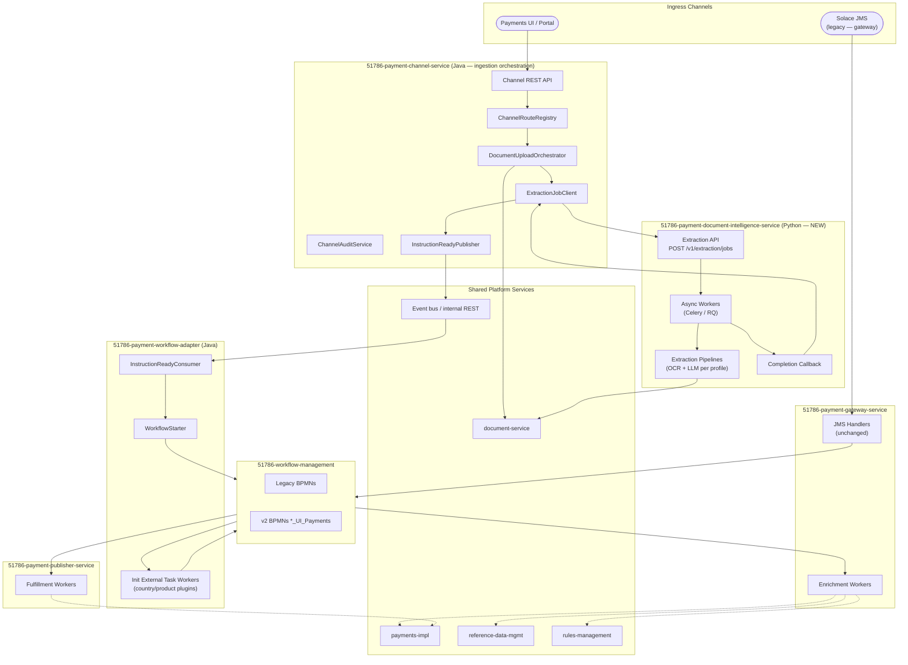
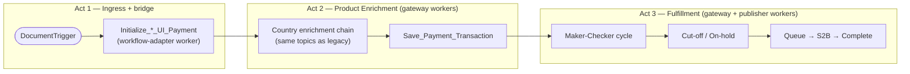
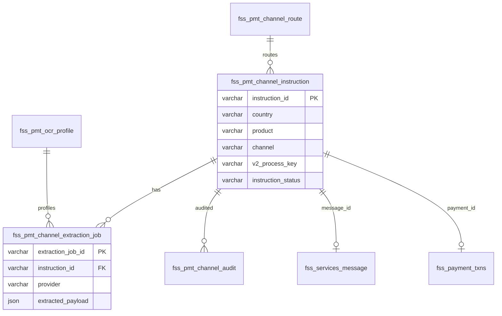
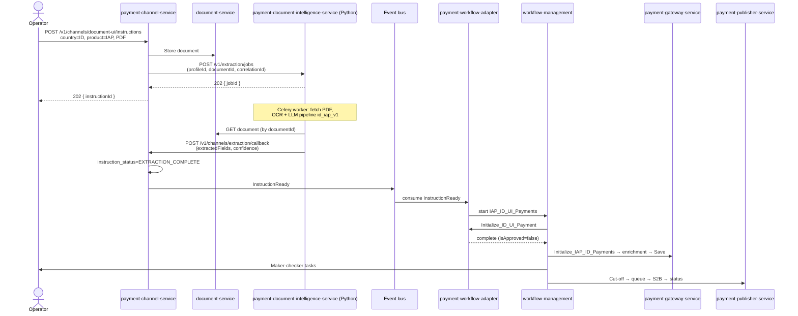

# Payment Channel Platform — UI Upload & AI Document Intelligence Re-Architecture

> **Companion documents:**
> - [ID_payments.md](./ID_payments.md) — current-state `IAP_ID_Payments` workflow, Java mapping, full BPMN inventory (§8).
>
> **Scope:** Platform design for incremental rewrite of **all payment BPMN flows** via UI upload → document-service → **Python document-intelligence service** → workflow. **Indonesia (`IAP_ID_Payments`) is Phase 1** — patterns apply to `ChinaETF_TplusZero`, `ChinaETF_TPlusN`, and future countries without redesign.

---

## 1. Strategic Intent

The platform is moving from **queue-first ingestion** (Solace + embedded SWOOSH OCR) to **document-first ingestion** (UI PDF upload → document-service → **Python document-intelligence service** → workflow). This is an **incremental strangler-fig rewrite**, not a big-bang replacement:

| Principle | How |
|---|---|
| **Rollback = config** | Per-country feature flags choose legacy BPMN vs new BPMN; no undeploy in prod |
| **Ingress ≠ workflow integration** | **Option A:** `payment-channel-service` (upload/audit only) + `payment-workflow-adapter` (Camunda bridge) |
| **AI extraction = owned Python service** | **`payment-document-intelligence-service`** — not a third-party API wrapper; OCR/LLM pipelines live here |
| **One ingress platform** | Country-agnostic Java channel service — not `id-*`, not per-country microservices |
| **One new BPMN per legacy payment flow** | Parallel process definitions; legacy BPMNs untouched |
| **Reuse worker pool** | Enrichment, cut-off, status, S2B workers stay in gateway/publisher until a later consolidation phase |
| **Camunda orchestrates** | Microservices execute tasks; BPMN drives routing — no service replaces the engine |
| **Shared subprocess (target)** | Extract common maker-checker + fulfillment tail into reusable BPMN subprocesses |
| **Config-driven routing** | Registry maps `country + product + channel` → process key, OCR profile, mapper, feedback channel |

### 1.1 Payment BPMN Rewrite Scope (from ID_payments.md §8.1)

| Priority | Legacy BPMN (unchanged) | New v2 BPMN (parallel) | Complexity | Notes |
|---|---|---|---|---|
| **P1** | `IAP_ID_Payments` | `IAP_ID_UI_Payments` | Medium | Indonesia domestic — **first delivery** |
| **P2** | `ChinaETF_TplusZero` | `ChinaETF_T0_UI_Payments` | Medium | Same-day China ETF; fewer service tasks than T+N |
| **P3** | `ChinaETF_TPlusN` | `ChinaETF_TN_UI_Payments` | High | Fund movement, wireback, EBBS, QFI — largest rewrite |
| **Out of scope** | `s2b-file-generation` | — | — | Batch file gen; consumed by payment flows, not rewritten |
| **Out of scope** | `FSSBulkUploadCreation`, `RefData*`, `rule*`, `MirrorMemo*`, etc. | — | — | Admin maker-checker shells; different channel model |

Legacy Solace/JMS triggers for `IAP_ID_Payments` and `ChinaETF_*` remain on the **old BPMNs** until each country is fully migrated and decommissioned.

---

## 2. Target Platform Architecture (Option A)

### 2.1 Design Choice — Ingress vs Workflow Adapter Split

Camunda is the orchestrator; microservices execute **steps**, not the full lifecycle. Option A enforces that split:

| Service | Bounded context | Stack | Camunda? |
|---|---|---|---|
| **`payment-channel-service`** | Document-channel **ingestion** orchestration | Java | **No** |
| **`payment-document-intelligence-service`** | **AI/OCR extraction** execution | **Python** | **No** |
| **`payment-workflow-adapter`** | v2 BPMN **bridge** | Java | **Yes** — start + init workers only |
| **`payment-gateway-service`** | Legacy JMS + **enrichment** workers | Java | External tasks |
| **`payment-publisher-service`** | **Fulfillment** workers | Java | External tasks |

**Why not one channel-service for everything?** Mixing upload APIs, OCR, audit DB, workflow start, and Camunda polling creates a third worker host, unclear ownership, and couples ingress deploys to Camunda client upgrades. Option A keeps rollback clean: disable adapter or channel independently.

**Phase 1 delivery note:** Adapter can ship as a **separate deployable** (`51786-payment-workflow-adapter`) or as an isolated **module** inside a multi-module repo — but must have **no shared Camunda client** with channel-service at code level.

### 2.2 Service Topology (Future State)



### 2.3 Handoff — `InstructionReady` Event

When OCR completes, channel-service **does not** call Camunda. It publishes (or POSTs) an **`InstructionReady`** signal:

| Field | Purpose |
|---|---|
| `instructionId` | PK from `fss_pmt_channel_instruction` |
| `country` / `product` / `channel` | Routing |
| `messageId` | `fss_services_message` stub (if created at upload) |
| `extractionJobId` | Audit cross-ref |
| `documentId` | document-service ref |
| `extractedPayload` | Normalized JSON from **document-intelligence service** (or ref to `fss_pmt_channel_extraction_job`) |
| `routeId` | Resolved route from registry |
| `correlationTimestamp` | Audit |

**Transport options (pick one per environment):**

| Mode | When to use |
|---|---|
| **Async event** (Solace topic / Kafka `payments.channel.instruction-ready`) | Preferred — decouples OCR callback latency from workflow start |
| **Internal REST** `POST /internal/instructions/{instructionId}/start` on adapter | Simpler Phase 1 if event infra is heavy |

Channel-service updates `instruction_status=EXTRACTION_COMPLETE` before publish; adapter sets `WORKFLOW_STARTED` after successful `startWorkflow`.

### 2.4 Why Not Extend payment-gateway-service?

`51786-payment-gateway-service` is a **legacy multi-channel ingestion + Camunda worker host**. Adding the UI channel there would blur ingress with enrichment workers and worsen rollback isolation. Gateway remains the **enrichment worker pool** for legacy and v2 BPMNs.

### 2.5 Service Inventory

| Service | Stack | Role in Target Platform (Option A) |
|---|---|---|
| **`51786-payment-channel-service`** | Java | Upload REST API, document-service client, **extraction job submit** (HTTP to Python service), channel audit DB, **`InstructionReady` publish** — **no Camunda, no ML** |
| **`51786-payment-document-intelligence-service`** | **Python** | **Owned AI document processor:** async extraction jobs, OCR/LLM pipelines per profile, confidence scoring, callback to channel-service — **no Camunda, no payment business rules** |
| **`51786-payment-workflow-adapter`** | Java | Consume `InstructionReady`, `startWorkflow`, **`Initialize_*_UI_Payment` external tasks**, mapper plugins |
| **`51786-payment-gateway-service`** | Java | Legacy JMS unchanged; enrichment + save workers for both BPMN families |
| **`51786-payment-publisher-service`** | Java | Fulfillment workers for both BPMN families |
| **`51786-workflow-management`** | — | + v2 BPMNs per country; + shared subprocesses |
| **`51786-document-service`** | — | Binary document storage (PDF); intelligence service **reads** from here |
| **`51786-payments-impl`** | Java | Core txn persistence — unchanged |

### 2.6 Camunda Ownership Rules (enforce in code reviews)

1. **channel-service** never imports `WorkflowService`, `ExternalTaskClient`, or ML/OCR libraries.
2. **document-intelligence-service** never calls Camunda, never writes `fss_payment_txns`, never applies payment business rules.
3. **workflow-adapter** never exposes upload APIs; never calls document-service upload or extraction submit.
4. **workflow-adapter** subscribes to **init topics only** — no enrichment, save, cut-off, or publisher topics.
5. **gateway / publisher** never start v2 workflows for `DOCUMENT_UI` — adapter-only.
6. **No microservice** encodes maker-checker, cut-off, or on-hold routing — that stays in BPMN.

---

## 3. Channel Abstraction (Core Extensibility Model)

Every payment instruction enters through a **channel** — a stable platform concept independent of country.

### 3.1 Channel Types

| Channel Code | Trigger | OCR Provider | Legacy Equivalent |
|---|---|---|---|
| `SSTM_QUEUE` | Solace JMS | SWOOSH (embedded in message) | `IAPIDPaymentsMessageHandler`, CN ETF handlers |
| `BULK_FILE` | Batch file upload | Pre-structured file / optional OCR | `IAP_ID_BulkTrigger`, `CN_LINK_ETF_TN_BulkUpload` |
| `MANUAL_ENTRY` | UI form (no document) | None | Manual start events |
| **`DOCUMENT_UI`** | UI PDF upload | **`payment-document-intelligence-service` (Python)** | **New — all v2 BPMNs** |

Phase 1 implements `DOCUMENT_UI` for Indonesia. China ETF phases add the same channel with different OCR profiles; **adapter** mapper/init plugins extend per product.

### 3.2 Channel Route Registry (Config + DB)

Central routing table — the **single place** to add a new country without new microservices.

#### `fss_pmt_channel_route` (configuration table)

| Column | Type | Description |
|---|---|---|
| `route_id` | `VARCHAR(64)` PK | UUID |
| `country` | `VARCHAR(8)` | `ID`, `CN`, … |
| `product` | `VARCHAR(32)` | `IAP`, `ETF_T0`, `ETF_TN`, … |
| `channel` | `VARCHAR(32)` | `DOCUMENT_UI`, `SSTM_QUEUE`, … |
| `legacy_process_key` | `VARCHAR(128)` | e.g. `IAP_ID_Payments` |
| `v2_process_key` | `VARCHAR(128)` | e.g. `IAP_ID_UI_Payments` |
| `v2_message_start` | `VARCHAR(128)` | e.g. `IAP_ID_UI_DocumentTrigger` |
| `init_task_topic` | `VARCHAR(128)` | e.g. `Initialize_Channel_Payment` or country-specific |
| `ocr_profile_id` | `VARCHAR(64)` | FK → extraction profile (`pipeline_id` for Python service) |
| `mapper_bean` | `VARCHAR(128)` | Spring bean in **workflow-adapter** for extraction → `Payment` mapping |
| `feedback_channel` | `VARCHAR(32)` | `SSTM`, `NONE`, `CN_LINK`, … |
| `enabled` | `BOOLEAN` | Master switch |
| `v2_rollout_percent` | `INT` | 0–100 for gradual rollout (optional) |
| `feature_flag_key` | `VARCHAR(128)` | e.g. `payments.channel.document-ui.ID.enabled` |

**Feature-flag rollback:** Set `enabled=false` or `v2_process_key` unused → UI falls back to disabled or legacy path. Legacy BPMN and Solace handlers never deployed.

#### Example rows (seed data)

| country | product | channel | legacy_process_key | v2_process_key | init_task_topic |
|---|---|---|---|---|---|
| `ID` | `IAP` | `DOCUMENT_UI` | `IAP_ID_Payments` | `IAP_ID_UI_Payments` | `Initialize_ID_UI_Payment` |
| `CN` | `ETF_T0` | `DOCUMENT_UI` | `ChinaETF_TplusZero` | `ChinaETF_T0_UI_Payments` | `Initialize_CN_T0_UI_Payment` |
| `CN` | `ETF_TN` | `DOCUMENT_UI` | `ChinaETF_TPlusN` | `ChinaETF_TN_UI_Payments` | `Initialize_CN_TN_UI_Payment` |

---

## 4. BPMN Strategy — Parallel v2 Workflows

### 4.1 Naming Convention

| Artifact | Pattern | Example (ID) | Example (CN T+N) |
|---|---|---|---|
| Legacy process | `{Product}_{Country}_Payments` or existing name | `IAP_ID_Payments` | `ChinaETF_TPlusN` |
| v2 process | `{Product}_{Country}_UI_Payments` or `{Product}_UI_Payments` | `IAP_ID_UI_Payments` | `ChinaETF_TN_UI_Payments` |
| v2 BPMN file | `{name}.bpmn` | `IAP_ID_UI_Payments.bpmn` | `ChinaETF_TN_UI_Payments.bpmn` |
| Message start | `{Process}_DocumentTrigger` | `IAP_ID_UI_DocumentTrigger` | `ChinaETF_TN_UI_DocumentTrigger` |

### 4.2 v2 BPMN Internal Structure (Template)

Each v2 BPMN follows the same **three-act structure** — clone the template, swap country-specific init + downstream call activity:



**Pre-BPMN:** channel-service uploads to document-service → submits job to **Python intelligence service** → on callback, publishes `InstructionReady`.

**Act 1 (workflow-adapter):** consumes `InstructionReady`, `startWorkflow`, executes init external task (maps extraction → `Payment` on `Message`).

**Act 2 + 3** reuse existing external task **topics** from legacy BPMNs. Workers subscribe with an explicit allow-list of legacy + v2 process keys.

### 4.3 Shared Subprocess (Phase 2 Platform Refactor)

To avoid copying Act 3 three times (and more as countries are added), extract:

| Subprocess ID | Contents | Used By |
|---|---|---|
| `IAP_Payment_MakerChecker` | Maker → checker gateways → rework | `IAP_ID_UI_Payments`, future IAP countries |
| `IAP_Payment_Fulfillment` | Cut-off → on-hold → queue → S2B → status → feedback | Same |
| `ChinaETF_T0_Fulfillment` | CN T+0 specific publisher tasks | `ChinaETF_T0_UI_Payments` |
| `ChinaETF_TN_Fulfillment` | Fund movement, wireback, EBBS, QFI tail | `ChinaETF_TN_UI_Payments` |

Legacy BPMNs are **not modified** to use subprocesses (rollback safety). v2 BPMNs use Call Activities from day one where practical.

### 4.4 External Task Topic Strategy (Option A)

| Topic category | Owner service | Camunda client? |
|---|---|---|
| `Initialize_*_UI_Payment` | **workflow-adapter** | Yes — init workers only |
| Enrichment topics (`Initialize_IAP_ID_Payments`, `CN_LINK_Enrichment`, …) | gateway-service | Yes |
| `Save_Payment_Transaction` | gateway-service | Yes — broaden `processDefinitionKeyIn` for `*_UI_Payments` |
| Cut-off / status / SSTM / wireback / … | publisher-service | Yes |
| User tasks | Camunda Tasklist | No |
| Workflow start for `DOCUMENT_UI` | **workflow-adapter** | Yes — `WorkflowService.startWorkflow` |
| Upload / extraction orchestration | **channel-service** | No — delegates to Python service |
| AI/OCR/LLM execution | **document-intelligence-service** | No |

**Camunda worker hosts after Option A:** gateway + publisher + workflow-adapter (three hosts, but adapter is **single-purpose** and tiny).

---

## 5. Component Design (Option A — Two Services)

### 5.1 `51786-payment-channel-service` — Ingestion Orchestration (Java)

**No Camunda or ML dependencies in this service.**

```
com.sc.fss.paymentchannel/
├── api/
│   ├── ChannelInstructionController
│   ├── ExtractionCallbackController          # receives callback FROM Python intelligence service
│   └── ChannelStatusController
├── routing/
│   ├── ChannelRouteRegistry
│   └── ChannelRouteResolver
├── upload/
│   ├── DocumentUploadOrchestrator
│   └── DocumentServiceClient
├── extraction/
│   ├── ExtractionJobOrchestrator             # submit job to Python service
│   └── DocumentIntelligenceClient            # HTTP client to intelligence service
├── audit/
│   └── ChannelAuditService
└── event/
    ├── InstructionReadyEvent
    └── InstructionReadyPublisher
```

| REST endpoint | Purpose |
|---|---|
| `POST /v1/channels/document-ui/instructions` | Upload PDF; `country`, `product`, metadata |
| `GET /v1/channels/document-ui/instructions/{instructionId}` | Status: upload → extraction |
| `POST /v1/channels/extraction/callback` | **Inbound** callback from Python intelligence service |
| `GET /v1/channels/document-ui/instructions/{instructionId}/document` | Proxy to document-service |

**Upload + extraction submit flow:**

```text
DocumentUploadOrchestrator
    → document-service.store(pdf) → documentId
    → persist fss_pmt_channel_instruction (UPLOADED)
    → persist fss_services_message stub
    → ExtractionJobOrchestrator.submit(profileId, documentId, correlationId=instructionId)
    → DocumentIntelligenceClient POST /v1/extraction/jobs
    → persist fss_pmt_channel_extraction_job (SUBMITTED, external_job_id)
    → instruction_status = EXTRACTION_SUBMITTED
```

**Extraction callback flow (from Python service):**

```text
ExtractionCallbackController
    → validate callback auth / signature
    → update fss_pmt_channel_extraction_job (SUCCESS / PARTIAL / FAILED)
    → store extracted_payload + confidence_score
    → instruction_status = EXTRACTION_COMPLETE
    → InstructionReadyPublisher.publish(...)
```

---

### 5.2 `51786-payment-workflow-adapter` — Thin Camunda Bridge

**Only service besides gateway/publisher that polls Camunda for v2 document-ui flows.**

```
com.sc.fss.paymentworkflowadapter/
├── ingress/
│   ├── InstructionReadyConsumer          # event subscriber
│   └── InstructionStartController          # optional internal REST fallback
├── workflow/
│   ├── WorkflowStarter                     # WorkflowService.startWorkflow
│   └── RouteConfigClient                   # read route (or cache from channel DB/API)
├── worker/
│   ├── AbstractChannelInitHandler
│   └── plugin/
│       ├── id/InitializeIDUIPaymentHandler
│       ├── cn/t0/InitializeCNT0UIPaymentHandler
│       └── cn/tn/InitializeCNTNUIPaymentHandler
├── mapper/
│   ├── ExtractionMapper (interface)
│   ├── id/IDPaymentExtractionMapper
│   └── cn/CNETFExtractionMapper
└── message/
    └── ChannelMessageService               # read/update fss_services_message enriched_message
```

| Internal endpoint (optional) | Purpose |
|---|---|
| `POST /internal/instructions/{instructionId}/start` | REST handoff if not using async events |

**Consumer flow:**

```text
InstructionReadyConsumer
    → load route (v2_process_key, v2_message_start, init_task_topic)
    → WorkflowStarter.start(messageStart, businessKey=instructionId, vars: messageId, isRepaired=false)
    → update instruction_status = WORKFLOW_STARTED (via channel DB or shared schema)
    → audit WORKFLOW_STARTED

InitializeIDUIPaymentHandler (external task)
    → load Message + extracted_payload by messageId
    → ExtractionMapper.toPayment(...) → Payment/PaymentData
    → MessageService.save(enriched_message)
    → complete(isApproved=false, channel=DOCUMENT_UI)
```

**Adding a new country** at adapter layer = init handler plugin + mapper + BPMN deploy — no upload/OCR changes.

---

### 5.3 Extraction Profile Model (platform config)

Profiles are stored in `fss_pmt_ocr_profile` (channel DB). **Python intelligence service** loads profile metadata to select pipeline; channel-service references `profile_id` at submit.

| Profile field | Purpose |
|---|---|
| `profile_id` | e.g. `ID_IAP_PAYMENT_INSTRUCTION` |
| `pipeline_id` | Maps to Python pipeline implementation (e.g. `id_iap_v1`) |
| `document_type` | `PAYMENT_INSTRUCTION`, `ETF_AFFIRMATION`, … |
| `min_confidence` | Threshold for SUCCESS vs PARTIAL |
| `field_schema_json` | Expected output field schema for validation |
| `model_version` | Traceable model/prompt version for audit |

SWOOSH remains on the **legacy Solace path only**. The **Python document-intelligence service** is the **sole extraction provider for `DOCUMENT_UI`** across all countries.

---

### 5.4 `51786-payment-document-intelligence-service` — AI Document Processor (Python)

**First-class microservice — not an external API adapter.** Owns all ML/OCR/LLM execution for payment document extraction.

#### 5.4.1 Why Python + separate service?

| Reason | Detail |
|---|---|
| **Ecosystem** | OCR (Tesseract, PaddleOCR), PDF parsing, LLM SDKs, notebooks → Python-native |
| **Isolation** | GPU workers, model deps, and heavy CPU scale independently from Java payment services |
| **Bounded context** | "Understand this document" ≠ "process this payment" |
| **Extensibility** | New country = new pipeline module + profile row — no Java deploy |

#### 5.4.2 Recommended stack

| Layer | Choice |
|---|---|
| API framework | **FastAPI** |
| Async job queue | **Celery** + Redis/RabbitMQ, or **RQ** |
| OCR | Tesseract / PaddleOCR / cloud OCR SDK (per pipeline) |
| LLM / structured extraction | Internal LLM gateway or Azure OpenAI — behind pipeline abstraction |
| Document fetch | HTTP client to **document-service** (by `documentId`) |
| Observability | OpenTelemetry + structured logs; model version in every response |

#### 5.4.3 Package structure

```
payment_document_intelligence/
├── api/
│   ├── routes/extraction_jobs.py       # REST: submit, status, health
│   └── schemas/job_request.py
├── workers/
│   ├── celery_app.py
│   └── extraction_worker.py            # async job execution
├── pipelines/
│   ├── base.py                         # AbstractExtractionPipeline
│   ├── registry.py                     # pipeline_id → pipeline class
│   ├── id/iap_payment_v1.py            # Phase 1 Indonesia
│   ├── cn/etf_t0_v1.py                 # Phase 2
│   └── cn/etf_tn_v1.py                 # Phase 3
├── services/
│   ├── document_fetcher.py             # document-service client
│   ├── ocr_engine.py
│   ├── llm_extractor.py
│   └── callback_client.py              # POST result to channel-service
├── models/
│   └── db.py                           # optional local job state
└── config/
    └── profiles.py                     # pipeline + model config
```

#### 5.4.4 REST API (intelligence service exposes)

| Endpoint | Direction | Purpose |
|---|---|---|
| `POST /v1/extraction/jobs` | channel-service → Python | Submit async extraction job |
| `GET /v1/extraction/jobs/{jobId}` | channel-service (poll fallback) | Job status + result |
| `GET /v1/health` | ops | Liveness |
| `GET /v1/pipelines` | ops / CI | Registered pipeline catalog |

**Submit request (`POST /v1/extraction/jobs`):**

| Field | Description |
|---|---|
| `correlationId` | `instructionId` from channel-service |
| `documentId` | document-service reference |
| `profileId` / `pipelineId` | From `fss_pmt_ocr_profile` |
| `country`, `product` | Routing metadata |
| `callbackUrl` | channel-service callback endpoint |
| `callbackAuth` | Token / HMAC for callback verification |

**Submit response (202):**

| Field | Description |
|---|---|
| `jobId` | Intelligence service job id → stored as `external_job_id` |
| `status` | `ACCEPTED` |

**Callback payload (Python → channel-service):**

| Field | Description |
|---|---|
| `jobId`, `correlationId` | Cross-reference |
| `status` | `SUCCESS` / `PARTIAL` / `FAILED` |
| `extractedFields` | Normalized field map (profile schema) |
| `confidenceScore` | Aggregate score |
| `modelVersion` | Pipeline + model version audit |
| `rawOcrText` | Optional — for audit only |
| `errorCode`, `errorMessage` | On failure |

#### 5.4.5 Pipeline execution flow (inside Python worker)

```text
extraction_worker(jobId)
    → load job + profile (pipeline_id)
    → DocumentFetcher.get(documentId) from document-service
    → pipeline = PipelineRegistry.get(pipeline_id)
    → ocr_text = pipeline.run_ocr(pdf_bytes)
    → fields, confidence = pipeline.extract_fields(ocr_text, profile.field_schema)
    → validate against field_schema_json
    → persist local job result (optional)
    → CallbackClient.post(callbackUrl, payload)
```

#### 5.4.6 Extensibility — adding a country/product

1. Implement `AbstractExtractionPipeline` subclass (e.g. `cn/etf_tn_v1.py`).
2. Register in `PipelineRegistry` with `pipeline_id`.
3. Add row to `fss_pmt_ocr_profile` with `pipeline_id`.
4. Add route row in channel DB — **no Java channel-service code change** if profile exists.
5. Deploy Python service (or hot-load pipeline if supported).

#### 5.4.7 Intelligence service database (optional local state)

Channel-service owns business audit (`fss_pmt_channel_extraction_job`). Python service may maintain **operational** job state:

#### `doc_intel_processing_job` (Python service DB)

| Column | Type | Description |
|---|---|---|
| `job_id` | UUID PK | Intelligence service job id |
| `correlation_id` | VARCHAR | `instructionId` |
| `document_id` | VARCHAR | document-service ref |
| `pipeline_id` | VARCHAR | Pipeline used |
| `status` | VARCHAR | `QUEUED` → `PROCESSING` → `COMPLETED` / `FAILED` |
| `model_version` | VARCHAR | Audit |
| `ocr_duration_ms` | INT | Metrics |
| `llm_duration_ms` | INT | Metrics |
| `result_json` | JSONB | Full extraction output |
| `error_detail` | TEXT | |
| `created_at` / `completed_at` | TIMESTAMP | |

Dual-write audit: channel DB holds business-facing job row; Python DB holds processing telemetry. `external_job_id` links them.

---

## 6. Database Design (Platform Tables)

Country-specific table names (`fss_pmt_serv_id_*`) are **replaced** by generic channel tables.

### 6.1 `fss_pmt_channel_instruction`

Authoritative record for every document-ui instruction (all countries).

| Column | Type | Description |
|---|---|---|
| `instruction_id` | `VARCHAR(64)` PK | Platform UUID |
| `country` | `VARCHAR(8)` | `ID`, `CN`, … |
| `product` | `VARCHAR(32)` | `IAP`, `ETF_T0`, `ETF_TN` |
| `channel` | `VARCHAR(32)` | `DOCUMENT_UI` |
| `document_id` | `VARCHAR(128)` | document-service reference |
| `file_name` | `VARCHAR(256)` | Original filename |
| `file_checksum` | `VARCHAR(64)` | Duplicate detection |
| `instruction_status` | `VARCHAR(32)` | `UPLOADED` → `EXTRACTION_SUBMITTED` → `EXTRACTION_COMPLETE` → `WORKFLOW_STARTED` (set by adapter) → terminal states |
| `message_id` | `VARCHAR(64)` | → `fss_services_message` |
| `payment_id` | `VARCHAR(64)` | → `fss_payment_txns` (after save) |
| `workflow_key` | `VARCHAR(128)` | Camunda business key |
| `v2_process_key` | `VARCHAR(128)` | Which v2 BPMN was started |
| `submitted_by` | `VARCHAR(128)` | UI user |
| `client_reference` | `VARCHAR(128)` | Optional |
| `created_timestamp` | `TIMESTAMP` | |
| `updated_timestamp` | `TIMESTAMP` | |
| `processing_error` | `VARCHAR(1024)` | |

**Indexes:** `(country, product, instruction_status)`, `(document_id)`, `(payment_id)`, `(workflow_key)`.

### 6.2 `fss_pmt_channel_extraction_job`

| Column | Type | Description |
|---|---|---|
| `extraction_job_id` | `VARCHAR(64)` PK | |
| `instruction_id` | `VARCHAR(64)` FK | |
| `ocr_profile_id` | `VARCHAR(64)` | |
| `external_job_id` | `VARCHAR(128)` | Job id from **document-intelligence service** |
| `provider` | `VARCHAR(32)` | `DOCUMENT_INTELLIGENCE` |
| `request_payload` | `JSON` | Audit |
| `response_payload` | `JSON` | Audit |
| `extracted_payload` | `JSON` | Normalized DTO |
| `extraction_status` | `VARCHAR(32)` | `PENDING` … `SUCCESS` / `PARTIAL` / `FAILED` / `TIMEOUT` |
| `confidence_score` | `DECIMAL(5,4)` | |
| `retry_count` | `INT` | |
| `submitted_timestamp` | `TIMESTAMP` | |
| `completed_timestamp` | `TIMESTAMP` | |
| `error_code` / `error_message` | | |

### 6.3 `fss_pmt_channel_audit` (append-only)

| Column | Type | Description |
|---|---|---|
| `audit_id` | `BIGINT` PK | |
| `instruction_id` | `VARCHAR(64)` | |
| `extraction_job_id` | `VARCHAR(64)` | nullable |
| `event_type` | `VARCHAR(64)` | `DOCUMENT_UPLOADED`, `EXTRACTION_COMPLETED`, `WORKFLOW_STARTED`, … |
| `event_timestamp` | `TIMESTAMP` | |
| `actor` | `VARCHAR(128)` | |
| `event_detail` | `JSON` | |
| `source_system` | `VARCHAR(64)` | `UI`, `DOCUMENT_INTELLIGENCE`, `CAMUNDA`, `CHANNEL_SERVICE`, `WORKFLOW_ADAPTER` |

### 6.4 `fss_pmt_channel_route` + `fss_pmt_ocr_profile`

Defined in §3.2 and §5.3. Route registry is **read** by channel-service (validation) and **read** by workflow-adapter (workflow start + init routing). `mapper_bean` resolves in **adapter** only.

### 6.5 Existing Tables — Unchanged

| Table | Usage |
|---|---|
| `fss_services_message` | `channel=DOCUMENT_UI`, cross-refs in `message_data` |
| `fss_payment_txns` | Same lifecycle; `txn_data.additionalProperties.sourceChannel`, `instructionId`, `documentId` |
| `fss_serv_rule_master`, refdata tables | Enrichment unchanged |
| `act_*` | v2 process instances alongside legacy |
| `fss_serv_batch` | Bulk path unchanged on legacy BPMNs |

### 6.6 Entity Relationship



---

## 7. Incremental Migration Roadmap

### 7.1 Phase Timeline

| Phase | Deliverable | Countries / BPMNs | Rollback |
|---|---|---|---|
| **0 — Platform foundation** | `payment-channel-service`; **`payment-document-intelligence-service` (Python skeleton)**; `payment-workflow-adapter`; platform DB tables; extraction API contract | None live | N/A |
| **1 — Indonesia** | `id_iap_v1` pipeline; `IAP_ID_UI_Payments.bpmn`; ID mapper in adapter; profile `ID_IAP` | `IAP_ID_Payments` | Disable channel flag or pause Python workers |
| **2 — China T+0** | `ChinaETF_T0_UI_Payments.bpmn`; CN T+0 plugins in adapter | `ChinaETF_TplusZero` | Per-country flag |
| **3 — China T+N** | `ChinaETF_TN_UI_Payments.bpmn`; largest publisher surface | `ChinaETF_TPlusN` | Per-country flag |
| **4 — Subprocess extraction** | Shared fulfillment subprocesses in v2 BPMNs only | v2 only | BPMN version rollback |
| **5 — Worker consolidation** | Evaluate `payment-orchestration-workers` merge (gateway enrichment + adapter init) | All | Separate program |
| **6 — Legacy decommission** | Stop Solace triggers; archive legacy BPMNs | Per country when v2 proven | Irreversible — gated on metrics |

### 7.2 Per-Country Cutover Checklist

- [ ] `payment-channel-service` deployed (no Camunda client in dependency tree)
- [ ] `payment-workflow-adapter` deployed with init worker + consumer
- [ ] `InstructionReady` event topic / internal REST handoff configured
- [ ] v2 BPMN deployed to workflow-management (legacy BPMN untouched)
- [ ] Route row in `fss_pmt_channel_route` with `enabled=true`
- [ ] **`payment-document-intelligence-service` (Python)** deployed with extraction API + worker queue
- [ ] `id_iap_v1` (or equivalent) pipeline validated against sample ID payment PDFs
- [ ] Callback auth between Python service and channel-service configured
- [ ] Extraction profile row + pipeline_id in `fss_pmt_ocr_profile`
- [ ] Init handler + extraction mapper plugin registered in **adapter**
- [ ] Gateway/publisher `processDefinitionKeyIn` includes v2 process key
- [ ] UI upload screen enabled for country/product
- [ ] Regression: legacy Solace path still passes on **legacy** BPMN
- [ ] Observability: dashboards for instruction status, OCR latency, v2 vs legacy volume
- [ ] Run parallel (shadow) period: v2 only for pilot users before full rollout

---

## 8. Feature Flags & Rollback Model

| Flag | Scope | Effect when `false` |
|---|---|---|
| `payments.channel.document-ui.enabled` | Global kill switch | Upload API rejects; adapter consumer can remain idle |
| `payments.channel.workflow-adapter.enabled` | Adapter kill switch | Events consumed but workflow not started (or consumer paused) |
| `payments.channel.document-ui.{country}.enabled` | Country | Uploads for that country disabled |
| `payments.channel.document-ui.{country}.{product}.enabled` | Product | e.g. CN ETF T+N only |
| `payments.channel.document-ui.{country}.v2-process-key` | Config | Points to v2 BPMN (change to rollback routing) |

Rollback never requires:
- Undeploying BPMN
- Changing Solace consumers
- Modifying legacy `IAP_ID_Payments.bpmn` or `ChinaETF_*.bpmn`

---

## 9. Old State vs New State (Platform View)

### 9.1 Ingress

| Dimension | Old State | New State (v2 Platform) |
|---|---|---|
| Primary trigger | Solace JMS per country handler in gateway | `DOCUMENT_UI` channel via channel-service REST |
| OCR / extraction | SWOOSH embedded in queue message | **Python document-intelligence service** (async jobs) |
| Document intelligence | N/A (third-party SWOOSH) | **Owned `payment-document-intelligence-service`** |
| Document storage | N/A (structured messages) | document-service (all countries) |
| Service ownership | channel (Java) + **document-intelligence (Python)** + workflow-adapter + gateway/publisher |
| Handoff | N/A | `InstructionReady` event after OCR |
| Country extension | New JMS handler + BPMN trigger in gateway | Route row + mapper plugin + v2 BPMN |

### 9.2 Workflow

| Dimension | Old State | New State |
|---|---|---|
| BPMN | One per country/product (legacy) | **Parallel** v2 BPMN per country/product |
| Rollback | BPMN version rollback (risky) | Feature flag → legacy BPMN still running |
| Init task | Country-specific in gateway | Country plugin in **workflow-adapter** |
| Workflow start | JMS handler in gateway | **workflow-adapter** after `InstructionReady` |
| Enrichment / fulfillment | Gateway + publisher topics | **Same topics**, broader process key allow-list |
| User tasks | Maker-checker in legacy BPMN | Same task semantics in v2 BPMN |

### 9.3 Data & Audit

| Dimension | Old State | New State |
|---|---|---|
| Upload audit | Solace message headers only | `fss_pmt_channel_instruction` + audit log |
| OCR audit | Embedded in SSTM payload | `fss_pmt_channel_extraction_job` |
| Payment lifecycle | `fss_payment_txns` + Camunda history | Same |
| Cross-channel trace | `message_id` → `payment_id` | `instruction_id` → `message_id` → `payment_id` → `workflow_key` |

---

## 10. Phase 1 Reference — Indonesia (`IAP_ID_UI_Payments`)

Indonesia is the **first plugin**, not a separate architecture.

| Platform concept | Indonesia instance |
|---|---|
| Route row | `country=ID`, `product=IAP`, `channel=DOCUMENT_UI` |
| v2 BPMN | `IAP_ID_UI_Payments` |
| Message start | `IAP_ID_UI_DocumentTrigger` |
| Init topic | `Initialize_ID_UI_Payment` |
| Init handler | `InitializeIDUIPaymentHandler` (**workflow-adapter**) |
| Mapper | `IDPaymentExtractionMapper` (**workflow-adapter**) |
| OCR profile | `ID_IAP_PAYMENT_INSTRUCTION` (`pipeline_id=id_iap_v1`) |
| Intelligence pipeline | `id_iap_payment_v1.py` (**Python service**) |
| Feature flag | `payments.channel.document-ui.ID.enabled` |
| Enrichment convergence | `Initialize_IAP_ID_Payments` (gateway, shared topic) |
| Legacy (unchanged) | `IAP_ID_Payments` + Solace + SWOOSH |

### 10.1 Indonesia v2 BPMN Entry Points

| Start Event | Source | Init Task | Joins At |
|---|---|---|---|
| `IAP_ID_UI_DocumentTrigger` | workflow-adapter after `InstructionReady` | `Initialize_ID_UI_Payment` | `Initialize_IAP_ID_Payments` |
| *(legacy unchanged)* | `IAP_ID_AutomatedTrigger` | `Initialize_IAP_Payments` | `Initialize_IAP_ID_Payments` |
| *(legacy unchanged)* | `IAP_ID_BulkTrigger` | `Initialize_IAP_Bulk_Payments` | `Initialize_IAP_ID_Payments` |
| *(legacy unchanged)* | `IAP_ID_Manual_Payment` | — | `IAP_ID_MakerPayment` |

### 10.2 Indonesia Sequence (Phase 1)



---

## 11. Configuration Reference

| Key | Example | Scope |
|---|---|---|
| `payments.channel.document-ui.enabled` | `true` | Global |
| `payments.channel.document-ui.ID.enabled` | `true` | Indonesia |
| `payments.channel.document-ui.CN.ETF_T0.enabled` | `false` | China T+0 (Phase 2) |
| `payments.channel.document-ui.max-file-size` | `10MB` | Global |
| `payments.channel.document-intelligence.base-url` | `https://doc-intel…` | channel-service → Python |
| `payments.channel.document-intelligence.callback-path` | `/v1/channels/extraction/callback` | channel-service inbound |
| `payments.document-intelligence.worker-concurrency` | `4` | Python Celery workers |
| `payments.document-intelligence.model-version` | `id_iap_v1.0` | Default pipeline version tag |
| `payments.channel.instruction-ready.topic` | `payments/channel/instruction-ready` | Event bus |
| `payments.channel.workflow-adapter.enabled` | `true` | Adapter |
| `payments.channel.workflow-adapter.base-url` | `https://adapter…` | Internal REST fallback |
| `payments.channel.extraction.timeout-minutes` | `30` | Global default; override per profile |
| `document-service.base-url` | (existing) | channel-service + **Python service** |

---

## 12. Summary — Platform Decisions (Option A)

| Decision | Choice | Rationale |
|---|---|---|
| Ingress service | **`51786-payment-channel-service` (Java)** | Upload orchestration, audit — **no Camunda, no ML** |
| Document intelligence | **`51786-payment-document-intelligence-service` (Python)** | **Owned** OCR/LLM pipelines, async workers, callbacks |
| Workflow bridge | **`51786-payment-workflow-adapter` (Java)** | `startWorkflow` + init external tasks only |
| Handoff chain | channel → **Python extraction** → callback → `InstructionReady` → adapter | Clean separation of ML vs payment orchestration |
| Extend gateway for UI? | **No** | Wrong bounded context |
| Reuse gateway/publisher workers? | **Yes** | Enrichment + fulfillment unchanged |
| BPMN approach | **Parallel v2 per legacy payment flow** | Feature-flag rollback |
| Country extension (ML) | New **Python pipeline** + profile `pipeline_id` | No Java change for extraction logic |
| Country extension (payment) | Route row + adapter mapper/init + v2 BPMN | |
| Extraction for UI channel | **Python intelligence service** | SWOOSH stays on legacy Solace path |
| First delivery | Indonesia `id_iap_v1` + `IAP_ID_UI_Payments` | Validates full pipeline |

Final platform service count for `DOCUMENT_UI` channel: **four new/extended roles** — channel (Java), document-intelligence (Python), workflow-adapter (Java), plus reused gateway/publisher workers — with Camunda and payment rules strictly outside the Python ML boundary.
