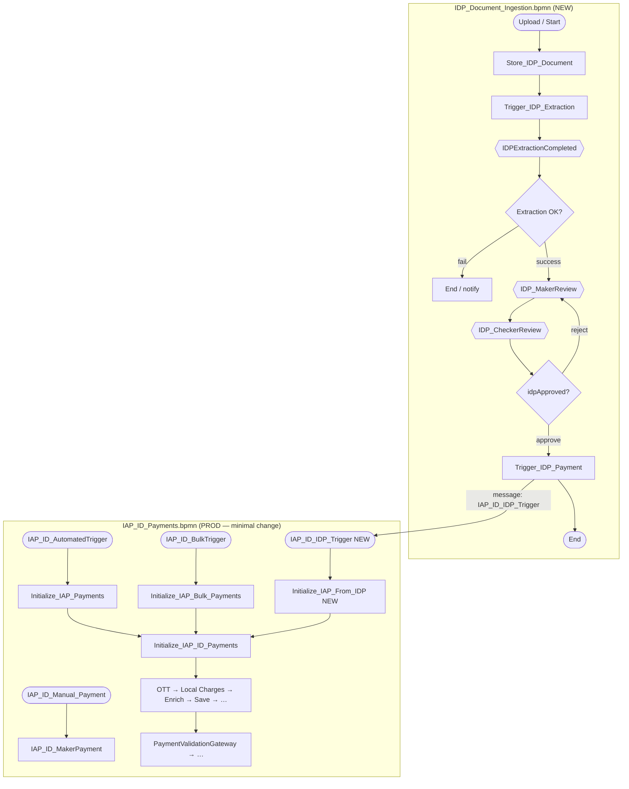
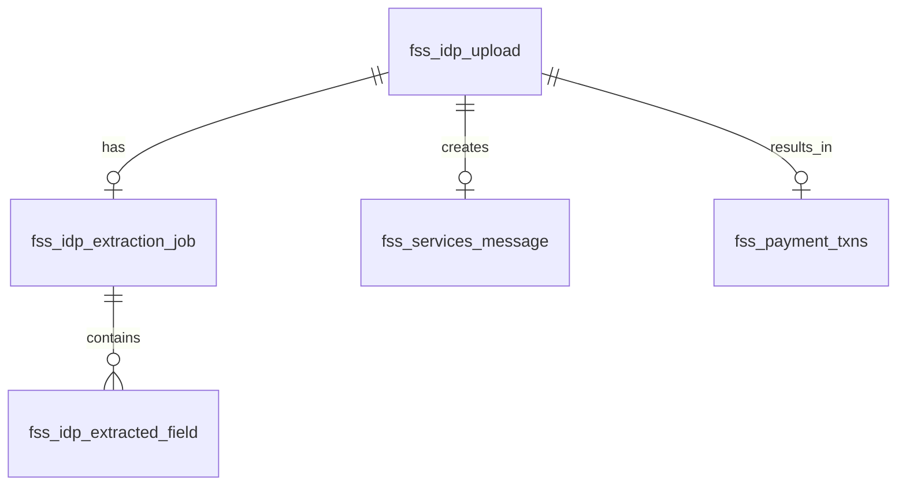

# IDP Document Ingestion — Production-Safe Design (Two BPMN Files)

> **Status:** Design / review — for implementation tracking  
> **Created:** 2026-07-30  
> **Related:** [ID_payments.md](./ID_payments.md) · [ID_payments.bpmn](./ID_payments.bpmn) · [after_ocr-llm-output.json](./after_ocr-llm-output.json) · [IDP_ID_Payments_Enhancement.md](./IDP_ID_Payments_Enhancement.md) (earlier single-BPMN draft — superseded by this document for BPMN strategy)

---

## 1. Design decision summary

| Topic | Decision |
|-------|----------|
| BPMN strategy | **Two files** linked by Camunda message correlation |
| New file | `IDP_Document_Ingestion.bpmn` — upload, OCR/LLM, IDP maker/checker |
| Prod file | `IAP_ID_Payments.bpmn` — **additive only** (4th message start + one init task + merge) |
| LLM / extraction / IDP human tasks | **Only** in `IDP_Document_Ingestion.bpmn` |
| Existing prod triggers | **Unchanged** — automated, bulk, manual |
| Cross-process link | Message `IAP_ID_IDP_Trigger` + BPMN text annotations on both files |
| Handoff implementation | External task `Trigger_IDP_Payment` → `WorkflowService.startMessageCorrelation(...)` |
| Manual payment keying | `IAP_ID_Manual_Payment` stays as-is; IDP upload is a **separate** process |

---

## 2. Architecture overview

**Annotation on `IAP_ID_IDP_Trigger`:**  
*"Triggered upon Checker approval in IDP_Document_Ingestion.bpmn"*

**Annotation on `Trigger_IDP_Payment`:**  
*"Correlates message IAP_ID_IDP_Trigger → starts IAP_ID_Payments"*

---

## 3. Production safety — what must not change

### 3.1 Existing entry paths (frozen)

| Start event | Message / type | First step | Producer (Java) |
|-------------|----------------|------------|-----------------|
| `IAP_ID_AutomatedTrigger` | Message `IAP_ID_AutomatedTrigger` | `Initialize_IAP_Payments` | `IAPIDPaymentsMessageHandler` |
| `IAP_ID_BulkTrigger` | Message `IAP_ID_BulkTrigger` | `Initialize_IAP_Bulk_Payments` | `FssPaymentsSHNBatchUpload` |
| `IAP_ID_Manual_Payment` | Plain start | `IAP_ID_MakerPayment` | Manual UI / generic start |

**Do not modify:** sequence flows, gateway conditions, task IDs, or external task topics on these paths.

### 3.2 Frozen downstream (shared enrichment + completion)

| Region | Elements |
|--------|----------|
| Enrichment chain | `Initialize_IAP_ID_Payments` → OTT → local charges → internal/external enrich → derive client → `Save_Payment_Transaction` |
| Gateways | `PaymentValidationGateway`, `CheckerApprovalGateway`, `PaymentCheckGateway`, `FutureDateValidationGateway` |
| Human tasks | `IAP_ID_MakerPayment`, `IAP_ID_CheckerPayment`, `IAP_ID_Claim_Payment` |
| Cut-off / S2B | `VerifyPaymentCutoffStatus` → queue → `S2BFileGenerated` → complete → SSTM feedback |
| Boundary events | `CancelPaymentInstruction`, `ValueDateReached` |
| Messages | `IAP_ID_AutomatedTrigger`, `IAP_ID_BulkTrigger`, `CancelPaymentInstruction`, `ValueDateReached`, `S2BFileGenerated` |

### 3.3 Safe additions to `IAP_ID_Payments.bpmn` only

| Addition | Type | Notes |
|----------|------|-------|
| `IAP_ID_IDP_Trigger` | Message start event | 4th entry |
| `Initialize_IAP_From_IDP` | External service task | Topic `Initialize_IAP_From_IDP` |
| Sequence flow | Start → init → `Initialize_IAP_ID_Payments` | **Add** incoming on `Initialize_IAP_ID_Payments` (3rd incoming, alongside automated + bulk) |
| `Message_IAP_ID_IDP_Trigger` | BPMN message definition | New unique name |
| Text annotation | On new start | Cross-process documentation |

**Do not:** rename process id `IAP_ID_Payments`, remove existing incomings on `Initialize_IAP_ID_Payments`, or edit gateway condition expressions.

### 3.4 Camunda deployment behavior

| Scenario | Impact |
|----------|--------|
| In-flight instances on old definition version | Continue on version they started — **unaffected** |
| New automated/bulk/manual after deploy | Use latest version — must behave identically on old paths |
| New IDP path | Only starts when `IAP_ID_IDP_Trigger` correlated |

---

## 4. BPMN file 1: `IDP_Document_Ingestion.bpmn` (NEW)

### 4.1 Process metadata

| Attribute | Value |
|-----------|-------|
| Process ID | `IDP_Document_Ingestion` |
| Process name | `IDP_Document_Ingestion` |
| Executable | `true` |
| Owning module | `51786-workflow-management` |

### 4.2 Process flow

| Step | BPMN ID | Type | Topic / message |
|------|---------|------|-----------------|
| Start | `IDP_Upload_Start` | Plain or message start | REST upload triggers `startWorkflow` |
| Store document | `Store_IDP_Document` | External | `Store_IDP_Document` |
| Trigger extraction | `Trigger_IDP_Extraction` | External | `Trigger_IDP_Extraction` |
| Wait for extraction | `Event_IDPExtractionCompleted` | Intermediate catch | `IDPExtractionCompleted` |
| Extraction gateway | `IDPExtractionGateway` | Exclusive | `${idpStatus=='READY_FOR_REVIEW'}` |
| Maker review | `IDP_MakerReview` | User task | `${paymentMaker}` |
| Checker review | `IDP_CheckerReview` | User task | `${paymentChecker}` |
| Checker gateway | `IDPCheckerGateway` | Exclusive | `${idpApproved==true}` → handoff |
| Trigger payment | `Trigger_IDP_Payment` | External | `Trigger_IDP_Payment` |
| End | `Event_IDP_End` | End event | After successful handoff |

### 4.3 Optional boundary / failure paths

| Element | Message | Attached to |
|---------|---------|-------------|
| `CancelIDPUpload` | `CancelIDPUpload` | `IDP_MakerReview` |
| `IDPExtractionFailed` | `IDPExtractionFailed` | Extraction wait or gateway fail path |

### 4.4 BPMN messages (IDP process only)

| Message name | Purpose |
|--------------|---------|
| `IDPExtractionCompleted` | Extraction service correlates when OCR + LLM done |
| `IDPExtractionFailed` | Optional — permanent extraction failure |
| `CancelIDPUpload` | Optional — maker cancels during review |

### 4.5 Java handlers (gateway-service + idp-extraction-service)

| Topic | Service | Handler (planned) |
|-------|---------|-------------------|
| `Store_IDP_Document` | payment-gateway-service | `IDPStoreDocumentHandler` |
| `Trigger_IDP_Extraction` | payment-gateway-service | `IDPTriggerExtractionHandler` |
| `Trigger_IDP_Payment` | payment-gateway-service | `IDPTriggerPaymentHandler` |
| OCR + LLM pipeline | idp-extraction-service | Internal; correlates `IDPExtractionCompleted` |

---

## 5. BPMN file 2: `IAP_ID_Payments.bpmn` (PROD — additive diff)

### 5.1 Before vs after entry paths

| # | Path | Before | After |
|---|------|--------|-------|
| 1 | Automated | `IAP_ID_AutomatedTrigger` → init → enrichment | **Same** |
| 2 | Bulk | `IAP_ID_BulkTrigger` → bulk init → enrichment | **Same** |
| 3 | Manual keying | `IAP_ID_Manual_Payment` → maker | **Same** |
| 4 | IDP document | — | `IAP_ID_IDP_Trigger` → `Initialize_IAP_From_IDP` → enrichment |

### 5.2 Merge point

`Initialize_IAP_From_IDP` → `Initialize_IAP_ID_Payments` (existing enrichment spine).

`Initialize_IAP_ID_Payments` incomings after change:

1. `Initialize_IAP_Payments` (automated) — existing  
2. `Initialize_IAP_Bulk_Payments` (bulk) — existing  
3. `Initialize_IAP_From_IDP` (IDP) — **new**

### 5.3 New external task on payment BPMN

| Task | Topic | Handler | Responsibility |
|------|-------|---------|----------------|
| `Initialize_IAP_From_IDP` | `Initialize_IAP_From_IDP` | `IAPIDPInitializeHandler` | Load structured JSON from extraction job; map to `Payment` / `Message`; `MessageService.save` with `channel=IDP_UPLOAD` |

---

## 6. Message contract (cross-process API)

### 6.1 Handoff message

| Attribute | Value |
|-----------|-------|
| Message name | `IAP_ID_IDP_Trigger` |
| Producer | `Trigger_IDP_Payment` in `IDP_Document_Ingestion` |
| Consumer | Message start `IAP_ID_IDP_Trigger` in `IAP_ID_Payments` |
| Correlation key | `businessKey = idpUploadId` |
| Mechanism | `WorkflowService.startMessageCorrelation("IAP_ID_IDP_Trigger", ...)` |

### 6.2 Variables passed at correlation

| Variable | Type | Value / source |
|----------|------|----------------|
| `idpUploadId` | String | Upload row PK |
| `extractionJobId` | String | Latest job with `is_latest=true` |
| `documentId` | String | Document service ref |
| `messageId` | String | If `fss_services_message` pre-created |
| `idpApproved` | Boolean | `true` |
| `isApproved` | Boolean | `true` — enables bulk-like skip of payment checker when validation clean |
| `isRepaired` | Boolean | `false` |
| `channel` | String | `IDP_UPLOAD` |
| `paymentMaker` | String | From upload / config |
| `paymentChecker` | String | From upload / config |

### 6.3 Idempotency

- Before correlating: check `fss_idp_upload.payment_workflow_key IS NULL`
- On success: store child `IAP_ID_Payments` process instance id in `payment_workflow_key`
- Double approve → no second payment instance

---

## 7. Two maker-checker cycles

| Stage | Process | User tasks | Purpose |
|-------|---------|------------|---------|
| Extraction QC | `IDP_Document_Ingestion` | `IDP_MakerReview`, `IDP_CheckerReview` | Validate OCR/LLM fields |
| Payment QC | `IAP_ID_Payments` | `IAP_ID_MakerPayment`, `IAP_ID_CheckerPayment` | Payment repair / banking approval |

**Routing after IDP checker approves:**

- Set `isApproved=true` at handoff.
- After `Save_Payment_Transaction`, existing `PaymentValidationGateway` flow `Flow_12mndij` (`isRepaired==false and isApproved==true`) may **skip payment checker**.
- If save yields `TO_BE_REPAIR`, existing `ToBeRepaired` → `IAP_ID_MakerPayment` — no new logic.

**Do not** reuse `IAP_ID_MakerPayment` for extraction review — affects manual and rework paths.

---

## 8. Manual trigger clarification

| Concept | BPMN | UI action | Change |
|---------|------|-----------|--------|
| Manual payment keying | `IAP_ID_Manual_Payment` | User keys payment fields | **No change** |
| IDP document upload | `IDP_Document_Ingestion` start | User uploads PDF/image | **New** — starts IDP process, not manual payment |

Upload REST must call `startWorkflow(IDP_Document_Ingestion)`, **not** `IAP_ID_Manual_Payment`.

---

## 9. Services and components

| Component | Action | Prod impact |
|-----------|--------|-------------|
| `51786-workflow-management` | Deploy `IDP_Document_Ingestion.bpmn` + new version `IAP_ID_Payments.bpmn` | Additive on payment BPMN |
| `51786-idp-extraction-service` | **New** — OCR, LLM, job state | None on existing |
| `51786-payment-gateway-service` | IDP REST upload; 4 new external task handlers | Existing handlers unchanged |
| `51786-document-service` | File storage integration | None on existing |
| `51786-payment-publisher-service` | No change (unless IDP-specific SSTM feedback later) | None |
| `51786-payments-impl` | No schema change on `fss_payment_txns` | None |
| Portal UI | Upload, processing status, IDP maker/checker screens | Feature-flagged |

### 9.1 New external task topics (isolated)

| Topic | Process | Handler |
|-------|---------|---------|
| `Store_IDP_Document` | IDP | `IDPStoreDocumentHandler` |
| `Trigger_IDP_Extraction` | IDP | `IDPTriggerExtractionHandler` |
| `Trigger_IDP_Payment` | IDP | `IDPTriggerPaymentHandler` |
| `Initialize_IAP_From_IDP` | IAP_ID_Payments | `IAPIDPInitializeHandler` |

Existing 14 topics on `IAP_ID_Payments` — **no topic renames, no handler changes** unless explicitly required.

### 9.2 Unchanged prod producers

| Class | Still starts |
|-------|--------------|
| `IAPIDPaymentsMessageHandler` | `IAP_ID_AutomatedTrigger` |
| `FssPaymentsSHNBatchUpload` (country ID) | `IAP_ID_BulkTrigger` |
| Manual UI | `IAP_ID_Manual_Payment` |

---

## 10. Database design

### 10.1 New tables

#### `fss_idp_upload`

| Column | Type | Notes |
|--------|------|-------|
| `idp_upload_id` | VARCHAR(36) PK | UUID; business key |
| `batch_id` | VARCHAR(36) | Optional multi-doc batch |
| `file_name` | VARCHAR(255) | |
| `document_id` | VARCHAR(255) | FileNet / blob ref |
| `country` | VARCHAR(10) | `ID` |
| `dept_id` | VARCHAR(50) | |
| `process_id` | VARCHAR(50) | |
| `sub_process_id` | VARCHAR(50) | |
| `activity_id` | VARCHAR(50) | |
| `sub_activity_id` | VARCHAR(50) | |
| `upload_status` | VARCHAR(30) | UPLOADED, PROCESSING, READY_FOR_REVIEW, SUBMITTED, APPROVED, REJECTED, CANCELLED, FAILED |
| `idp_workflow_key` | VARCHAR(100) | IDP process instance id |
| `payment_workflow_key` | VARCHAR(100) | IAP payment process instance id (after handoff) |
| `payment_id` | VARCHAR(36) | After Save_Payment_Transaction |
| `message_id` | VARCHAR(36) | Link to `fss_services_message` |
| `uploaded_by` | VARCHAR(100) | |
| `uploaded_timestamp` | TIMESTAMP | |
| `approved_by` | VARCHAR(100) | IDP checker |
| `approved_timestamp` | TIMESTAMP | |
| `remarks` | VARCHAR(500) | Reject reason |
| Audit columns | | created/updated by/timestamp |

#### `fss_idp_extraction_job`

| Column | Type | Notes |
|--------|------|-------|
| `extraction_job_id` | VARCHAR(36) PK | |
| `idp_upload_id` | VARCHAR(36) FK | |
| `extraction_token` | VARCHAR(512) | OCR API token |
| `ocr_job_id` | VARCHAR(100) | External OCR id |
| `job_status` | VARCHAR(30) | PENDING, OCR_IN_PROGRESS, LLM_IN_PROGRESS, READY_FOR_REVIEW, FAILED |
| `ocr_response_payload` | CLOB | |
| `llm_response_payload` | CLOB | |
| `structured_output` | CLOB | Target: [after_ocr-llm-output.json](./after_ocr-llm-output.json) shape |
| `error_code` / `error_description` | VARCHAR | |
| `retry_count` | INT | |
| `is_latest` | BOOLEAN | Re-extract support |
| Timestamps | TIMESTAMP | started, completed, created |

#### `fss_idp_extracted_field` (optional — UI edits)

| Column | Type | Notes |
|--------|------|-------|
| `field_id` | BIGINT PK | |
| `extraction_job_id` | VARCHAR(36) FK | |
| `section` | VARCHAR(50) | HEADER, TRANSACTION, DEBIT, CREDIT |
| `leg_index` | INT | |
| `field_name` | VARCHAR(100) | |
| `field_value` | VARCHAR(500) | |
| `confidence` | DECIMAL(5,2) | |
| `is_edited` | BOOLEAN | |
| `edited_by` / `edited_timestamp` | | |

#### `fss_idp_upload_audit` (optional)

| Column | Type | Notes |
|--------|------|-------|
| `audit_id` | BIGINT PK | |
| `idp_upload_id` | VARCHAR(36) | |
| `action` | VARCHAR(50) | UPLOAD, EXTRACT_COMPLETE, MAKER_SUBMIT, CHECKER_APPROVE, PAYMENT_TRIGGERED, … |
| `actor` | VARCHAR(100) | |
| `details` | CLOB | |
| `timestamp` | TIMESTAMP | |

### 10.2 Existing tables (usage only)

| Table | Usage |
|-------|-------|
| `fss_services_message` | `channel=IDP_UPLOAD`; enriched Payment after `Initialize_IAP_From_IDP` |
| `fss_payment_txns` | No schema change |
| `fss_serv_batch` | Optional `batch_id` link for multi-doc upload |

### 10.3 Entity relationships

---

## 11. JSON → Payment mapping

Handler: `Initialize_IAP_From_IDP` / `IAPIDPInitializeHandler`

| JSON path | Payment / Message field |
|-----------|-------------------------|
| `header.uniqueId` | External ref / functional_id |
| `initiationDetail.TxRef` | Transaction reference |
| `initiationDetail.TrnTyp` / `SubActivityId` | Transaction type |
| `initiationDetail.ClntNm` | Client name |
| `initiationDetail.ValDt` | Value date |
| `TransactionDetails[*]` | Payment attributes |
| `DebitDetails.details[*].data` | Debit legs |
| `CreditDetails.details[*].data` | Credit legs |
| `header.doc_ids[0]` | Document linkage |

Reference output: [after_ocr-llm-output.json](./after_ocr-llm-output.json)

---

## 12. UI screens (planned)

| Screen | Process task | Actions |
|--------|--------------|---------|
| IDP Upload | Starts `IDP_Document_Ingestion` | Upload, Cancel |
| Processing status | Between extraction tasks | Poll job status |
| IDP Maker review | `IDP_MakerReview` | Save, Submit to checker, Cancel, Re-extract |
| IDP Checker review | `IDP_CheckerReview` | Approve, Reject |
| Payment maker/checker | `IAP_ID_MakerPayment` / `IAP_ID_CheckerPayment` | Existing — only if validation routes there |

---

## 13. Deployment plan

| Phase | Deliverable | Prod risk |
|-------|-------------|-----------|
| P1 | DDL `fss_idp_*` tables | None |
| P2 | `IDP_Document_Ingestion.bpmn` + IDP service (mock OCR/LLM) | None on IAP |
| P3 | Gateway workers for IDP topics | None until IDP started |
| P4 | Additive deploy `IAP_ID_Payments.bpmn` v(N+1) | Old paths must regression-pass |
| P5 | Real OCR + LLM integration | IDP path only |
| P6 | UI behind feature flag | Controlled rollout |
| P7 | Canary E2E test | New path only |

**Deploy order:** tables → IDP BPMN + service → payment BPMN additive version → enable UI flag.

**Rollback:** disable feature flag; IAP automated/bulk/manual unaffected.

---

## 14. Regression test matrix

| # | Scenario | Expected | Must match prod |
|---|----------|----------|-----------------|
| 1 | Automated (mock JMS) | `Initialize_IAP_Payments` | Yes |
| 2 | Bulk upload ID | Bulk init → `isApproved=true` path | Yes |
| 3 | Manual start | `IAP_ID_MakerPayment` directly | Yes |
| 4 | IDP upload → approve → handoff | `Initialize_IAP_From_IDP` → enrichment | New |
| 5 | Automated `TO_BE_REPAIR` | `IAP_ID_MakerPayment` | Yes |
| 6 | Cut-off rework gateways | Maker/checker routing | Yes |
| 7 | Cancel on payment maker | `PaymentCancellation` | Yes |
| 8 | Future value date | On-hold / `ValueDateReached` | Yes |
| 9 | Double IDP checker approve | Single payment instance | New |
| 10 | IDP handoff failure | IDP process does not complete; retries | New |

---

## 15. Risk register

| Risk | Mitigation |
|------|------------|
| Editing shared gateway conditions | Freeze prod paths; code review BPMN diff |
| Message name collision | Unique `IAP_ID_IDP_Trigger` only for IDP handoff |
| Duplicate payment instances | `payment_workflow_key` idempotency check |
| Handoff fails silently | External task `Trigger_IDP_Payment` with retry (not bare message end) |
| Variable type mismatch (boolean vs string) | Match existing patterns; document in correlation payload |
| Two instances in Cockpit | Shared `businessKey=idpUploadId`; link columns on `fss_idp_upload` |
| Deploy IAP BPMN without `Initialize_IAP_From_IDP` worker | Deploy workers before enabling IDP UI |

---

## 16. Implementation checklist

### BPMN

- [ ] Create `IDP_Document_Ingestion.bpmn` in `51786-workflow-management`
- [ ] Add annotations on IDP handoff task and IAP_IDP start
- [ ] Additive change to `IAP_ID_Payments.bpmn` (4th start + `Initialize_IAP_From_IDP` + merge)
- [ ] Verify `Initialize_IAP_ID_Payments` has 3 incomings, none removed

### Java

- [ ] `IDPUploadController` — starts IDP process only
- [ ] `IDPStoreDocumentHandler`
- [ ] `IDPTriggerExtractionHandler`
- [ ] `IDPTriggerPaymentHandler` — correlates `IAP_ID_IDP_Trigger`
- [ ] `IAPIDPInitializeHandler` — topic `Initialize_IAP_From_IDP`
- [ ] Confirm no changes to `IAPIDPaymentsMessageHandler`, `FssPaymentsSHNBatchUpload`

### IDP service

- [ ] `51786-idp-extraction-service` — OCR, LLM, job repo
- [ ] Correlate `IDPExtractionCompleted` on success

### Database

- [ ] `fss_idp_upload` (+ `payment_workflow_key`, `idp_workflow_key`)
- [ ] `fss_idp_extraction_job`
- [ ] Optional: `fss_idp_extracted_field`, `fss_idp_upload_audit`

### UI

- [ ] Upload screen (feature-flagged)
- [ ] Processing status view
- [ ] IDP maker / checker task forms
- [ ] Do not change manual payment keying flow

### Testing & release

- [ ] Regression matrix §14 on IAP v(N+1) before prod
- [ ] E2E IDP → payment path in lower env
- [ ] Feature flag + rollback runbook

---

## 17. Document history

| Date | Change |
|------|--------|
| 2026-07-30 | Initial version — two BPMN files, prod-safe additive IAP change, message handoff, tables, deployment and test plan |

---

## 18. Open questions

- OCR API contract (auth, callback, max file size)?
- LLM hosting and prompt versioning?
- Full field parity with legacy upload screens?
- PII retention policy for OCR/LLM CLOB payloads?
- SSTM feedback behavior for `channel=IDP_UPLOAD` payments?
