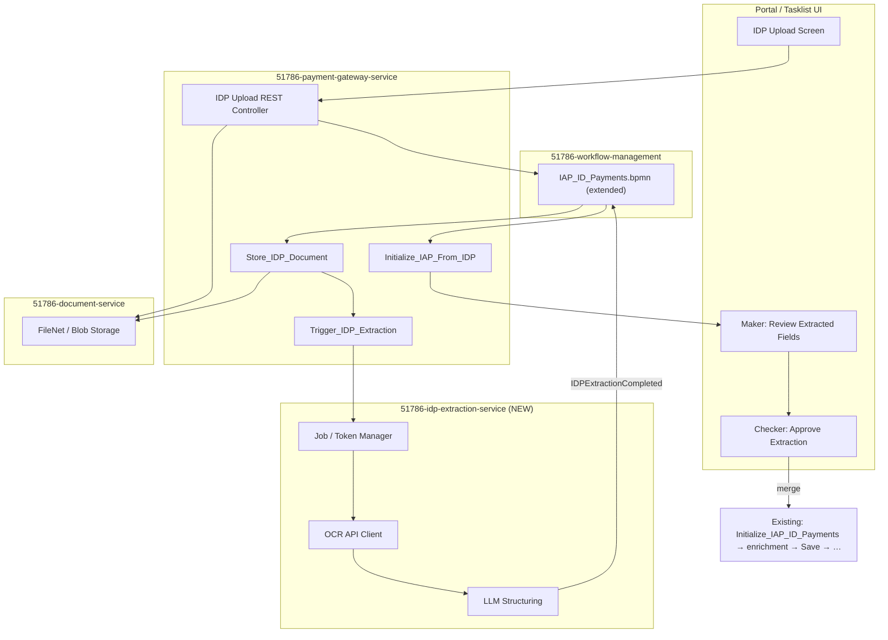
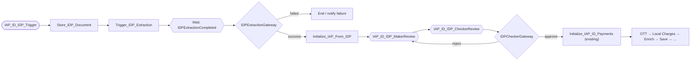
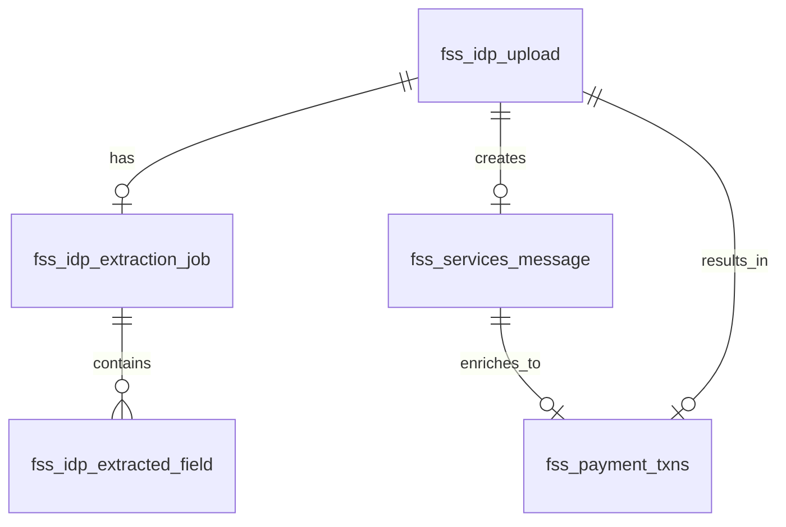

# ID Payments — IDP Upload & Extraction Enhancement

> **Related docs:** [ID_payments.md](./ID_payments.md) (existing workflow) · [ID_payments.bpmn](./ID_payments.bpmn) (existing BPMN) · [after_ocr-llm-output.json](./after_ocr-llm-output.json) (target extraction JSON shape)

## Document purpose

This document captures the **planned enhancement** to add an Intelligent Document Processing (IDP) path to Indonesia payments: upload screen, OCR + LLM extraction, maker-checker on extracted fields, then convergence into the existing `IAP_ID_Payments` enrichment and downstream pipeline.

**Status:** Design / review — no implementation yet.

---

## 1. BPMN Strategy — New File or Extend Existing?

### Recommendation: **Extend existing `IAP_ID_Payments.bpmn`** (no new BPMN file)

| Approach | Pros | Cons |
|----------|------|------|
| **Extend `IAP_ID_Payments.bpmn`** ✅ | Reuses enrichment, cut-off, S2B, cancellation, and variable dictionary; one process instance end-to-end; matches how `IAP_ID_AutomatedTrigger` and `IAP_ID_BulkTrigger` already share the same definition | Larger BPMN diagram; IDP-specific steps live beside automated/bulk/manual paths |
| **New `IAP_ID_IDP_Payments.bpmn`** | Cleaner separation; IDP team owns a smaller diagram | Needs **Call Activity** or duplicate downstream tasks; two process instances or complex handoff; harder to reuse `PaymentValidationGateway` / checker routing |
| **New standalone IDP-only BPMN (no merge)** | Simplest IDP scope | Does **not** meet requirement — approved extraction must flow into existing Camunda payment processing |

### What we add to `IAP_ID_Payments.bpmn`

1. **4th message start event:** `IAP_ID_IDP_Trigger` (message name `IAP_ID_IDP_Trigger`)
2. **IDP pre-processing external tasks** (before existing enrichment)
3. **2 user tasks** for extraction review (maker + checker)
4. **1 intermediate catch event** for async extraction: `IDPExtractionCompleted`
5. **2 exclusive gateways** for extraction success and checker decision
6. **Merge point:** approved path joins existing `Initialize_IAP_ID_Payments` (same as automated/bulk after their init steps)

### New BPMN messages (add to same definitions file)

| Message name | Purpose |
|--------------|---------|
| `IAP_ID_IDP_Trigger` | Start process when maker uploads document via UI |
| `IDPExtractionCompleted` | Correlated when OCR + LLM pipeline finishes successfully |
| `IDPExtractionFailed` | Optional — extraction failed after retries |
| `CancelIDPUpload` | Optional boundary — maker cancels during IDP review |

### File change summary

| File | Action |
|------|--------|
| `ID_payments.bpmn` | **Modify** — add IDP branch (4th entry + tasks + merge) |
| `IAP_ID_Payments.bpmn` (in `51786-workflow-management`) | **Same change** when implementing in repo |
| New BPMN file | **Not required** for initial release |

---

## 2. Enhancement Overview

### Problem

Today, ID payments enter via:

1. SSTM JMS (`IAP_ID_AutomatedTrigger`)
2. Bulk file upload (`IAP_ID_BulkTrigger`)
3. Manual keying (`IAP_ID_Manual_Payment`)

There is no path for **uploading a payment instruction document** (PDF/image), extracting fields via OCR + LLM, and feeding the result into the same enrichment and maker-checker pipeline.

### Goal

| Step | Actor | Outcome |
|------|-------|---------|
| 1 | Maker | Uploads document via new UI screen |
| 2 | System | OCR API + LLM produces structured JSON (see `after_ocr-llm-output.json`) |
| 3 | Maker | Reviews/edits extracted fields; submits for approval |
| 4 | Checker | Approves or rejects extraction |
| 5 | System | Maps JSON → `Payment` / `Message`; runs existing enrichment chain |
| 6 | Existing flow | Save, validation gateway, optional payment checker, cut-off, S2B file generation |

---

## 3. Architecture



### Service responsibilities

| Service | Role |
|---------|------|
| **Portal UI** | Upload screen, processing status, IDP maker/checker forms |
| **51786-payment-gateway-service** | Upload REST API; Camunda external tasks; workflow start/correlate; map IDP JSON to Payment |
| **51786-idp-extraction-service (NEW)** | Token/job management; OCR call; LLM structuring; job persistence; correlate `IDPExtractionCompleted` |
| **51786-document-service** | Store uploaded file; return `document_id` |
| **51786-workflow-management** | Extended `IAP_ID_Payments.bpmn` |
| **51786-payment-publisher-service** | No change (unless IDP channel needs different SSTM feedback) |
| **51786-payments-impl** | No schema change on `fss_payment_txns` |

---

## 4. User Journey & UI Screens

Aligned with legacy screens (upload list, transaction field grid, debit/credit legs, confidence scores).

### Screen 1 — IDP Upload

- **Fields:** country (`ID`), dept/process/sub-process, activity, document type
- **File:** PDF/image upload
- **Actions:** Upload, Cancel
- **On upload:** store file → create `idp_upload_id` → start workflow with `IAP_ID_IDP_Trigger`

### Screen 2 — Processing (wait)

- **Statuses:** `SUBMITTED` → `OCR_IN_PROGRESS` → `LLM_IN_PROGRESS` → `READY_FOR_REVIEW` / `FAILED`
- **UI:** poll `GET /v1/idp/jobs/{jobId}` or websocket
- **BPMN:** process waits on `IDPExtractionCompleted`

### Screen 3 — Maker review (`IAP_ID_IDP_MakerReview`)

- Display structured output:
  - Header: `uniqueId`, `job_id`, `doc_ids`
  - `TransactionDetails` (Name / Value / Confidence)
  - `DebitDetails` / `CreditDetails` grids
- Highlight low-confidence fields (e.g. confidence &lt; 90%)
- **Actions:** Save draft, Submit for checker, Cancel, Re-extract (optional)

### Screen 4 — Checker review (`IAP_ID_IDP_CheckerReview`)

- Read-only view + approve/reject with comments
- Sets `idpApproved`, `isApproved` for downstream routing

### Screen 5 — Existing payment screens (reuse)

After mapping + enrichment, existing `IAP_ID_MakerPayment` / `IAP_ID_CheckerPayment` when validation routes to repair or review (`TO_BE_REPAIR` / `TO_BE_REVIEWED`).

---

## 5. IDP Extraction Service (NEW)

### Pipeline

```
1. Create extraction_job_id + token (for OCR API auth)
2. POST document to OCR endpoint (via document_id or multipart)
3. Store ocr_response_payload
4. POST LLM with OCR output + field schema → structured JSON
5. Validate schema / required fields (TrnRef, ValDt, accounts, amounts)
6. job_status = READY_FOR_REVIEW | FAILED
7. On success: WorkflowService.startMessageCorrelation("IDPExtractionCompleted", businessKey=idpUploadId)
```

### API sketch

| Method | Path | Purpose |
|--------|------|---------|
| POST | `/v1/idp/jobs` | Create job (internal; gateway worker) |
| POST | `/v1/idp/jobs/{jobId}/process` | Run OCR + LLM |
| GET | `/v1/idp/jobs/{jobId}` | Status + result for UI |
| GET | `/v1/idp/jobs/{jobId}/structured` | Final JSON only |

### Target output shape

See [after_ocr-llm-output.json](./after_ocr-llm-output.json) — `header`, `initiationDetail`, `TransactionDetails`, `DebitDetails`, `CreditDetails` with confidence per field.

---

## 6. BPMN Changes (detail)

### IDP branch flow



### New BPMN elements

| BPMN ID | Type | Topic / message | Implementing handler |
|---------|------|-----------------|----------------------|
| `IAP_ID_IDP_Trigger` | Message start | `IAP_ID_IDP_Trigger` | `IDPUploadController` → `WorkflowService` |
| `Store_IDP_Document` | External service task | `Store_IDP_Document` | `IDPStoreDocumentHandler` |
| `Trigger_IDP_Extraction` | External service task | `Trigger_IDP_Extraction` | `IDPTriggerExtractionHandler` |
| `Event_IDPExtractionCompleted` | Intermediate catch | `IDPExtractionCompleted` | Correlated by idp-extraction-service |
| `IDPExtractionGateway` | Exclusive gateway | `${idpStatus=='READY_FOR_REVIEW'}` | — |
| `Initialize_IAP_From_IDP` | External service task | `Initialize_IAP_From_IDP` | `IAPIDPInitializeHandler` |
| `IAP_ID_IDP_MakerReview` | User task | — | `${paymentMaker}` |
| `IAP_ID_IDP_CheckerReview` | User task | — | `${paymentChecker}` |
| `IDPCheckerGateway` | Exclusive gateway | `${idpApproved==true}` | — |

### Merge with existing process

- **Merge point:** `Initialize_IAP_ID_Payments` (same enrichment chain as automated/bulk)
- On IDP checker **approve:** set `isApproved=true` (bulk-like) so `PaymentValidationGateway` can skip payment checker when mapping is clean (`Flow_12mndij`)
- If `Save_Payment_Transaction` sets `TO_BE_REPAIR`, existing `IAP_ID_MakerPayment` path still applies

### Comparison with existing entry paths

| Entry | Init steps | Pre-checker | Joins at |
|-------|------------|-------------|----------|
| Automated | `Initialize_IAP_Payments` | No | `Initialize_IAP_ID_Payments` |
| Bulk | `Initialize_IAP_Bulk_Payments` | No (pre-approved) | `Initialize_IAP_ID_Payments` |
| Manual | None | No | `IAP_ID_MakerPayment` |
| **IDP (new)** | Store doc → Extract → Map from IDP | **Yes (IDP maker/checker)** | `Initialize_IAP_ID_Payments` |

---

## 7. Process Variables (new)

| Variable | Type | Set by | Purpose |
|----------|------|--------|---------|
| `idpUploadId` | String | Upload REST | Business key / correlation id |
| `extractionJobId` | String | `Store_IDP_Document` | Link to extraction job |
| `documentId` | String | `Store_IDP_Document` | Document service reference |
| `idpStatus` | String | Extraction service | `READY_FOR_REVIEW`, `FAILED`, etc. |
| `idpApproved` | Boolean | IDP checker task | Extraction approved |
| `isApproved` | Boolean | IDP checker | `true` → may skip payment checker (like bulk) |
| `channel` | String | Upload | `IDP_UPLOAD` |
| `paymentMaker` | String | Upload / Save | Existing assignee for user tasks |
| `paymentChecker` | String | Upload / Save | Existing assignee for user tasks |

Existing variables (`isRepaired`, `proceedPayment`, `isFutureDate`, etc.) unchanged downstream of merge.

---

## 8. JSON → Payment Mapping

`Initialize_IAP_From_IDP` maps extraction JSON to structures used by `IAPPaymentTransactionHandler`:

| JSON path | Payment / Message field |
|-----------|-------------------------|
| `header.uniqueId` | External ref / `functional_id` |
| `initiationDetail.TxRef` | Transaction reference |
| `initiationDetail.TrnTyp` / `SubActivityId` | Transaction type |
| `initiationDetail.ClntNm` | Client name |
| `initiationDetail.ValDt` | Value date |
| `TransactionDetails[*]` | Payment attribute map |
| `DebitDetails.details[*].data` | Debit legs |
| `CreditDetails.details[*].data` | Credit legs |
| `header.doc_ids[0]` | Document linkage |

Persist via `MessageService.save` with `channel=IDP_UPLOAD` before enrichment.

---

## 9. Database Design

### 9.1 New tables

#### `fss_idp_upload` — upload header

| Column | Type | Notes |
|--------|------|-------|
| `idp_upload_id` | VARCHAR(36) PK | UUID; workflow business key |
| `batch_id` | VARCHAR(36) | Optional multi-file batch |
| `file_name` | VARCHAR(255) | Original filename |
| `document_id` | VARCHAR(255) | FileNet / blob reference |
| `country` | VARCHAR(10) | `ID` |
| `dept_id` | VARCHAR(50) | e.g. FundServices |
| `process_id` | VARCHAR(50) | e.g. Cash |
| `sub_process_id` | VARCHAR(50) | e.g. CI |
| `activity_id` | VARCHAR(50) | e.g. BT |
| `sub_activity_id` | VARCHAR(50) | e.g. Redemption |
| `upload_status` | VARCHAR(30) | UPLOADED, PROCESSING, READY_FOR_REVIEW, SUBMITTED, APPROVED, REJECTED, CANCELLED, FAILED |
| `workflow_key` | VARCHAR(100) | Camunda process instance id |
| `payment_id` | VARCHAR(36) | Set after Save_Payment_Transaction |
| `message_id` | VARCHAR(36) | Link to `fss_services_message` |
| `uploaded_by` | VARCHAR(100) | Maker user id |
| `uploaded_timestamp` | TIMESTAMP | |
| `approved_by` | VARCHAR(100) | Checker |
| `approved_timestamp` | TIMESTAMP | |
| `remarks` | VARCHAR(500) | Reject reason |
| `created_by` | VARCHAR(100) | Audit |
| `created_timestamp` | TIMESTAMP | Audit |
| `updated_by` | VARCHAR(100) | Audit |
| `updated_timestamp` | TIMESTAMP | Audit |

#### `fss_idp_extraction_job` — OCR/LLM job (idp-extraction-service)

| Column | Type | Notes |
|--------|------|-------|
| `extraction_job_id` | VARCHAR(36) PK | UUID |
| `idp_upload_id` | VARCHAR(36) FK | → `fss_idp_upload` |
| `extraction_token` | VARCHAR(512) | Token for OCR API |
| `ocr_job_id` | VARCHAR(100) | External OCR provider job id |
| `job_status` | VARCHAR(30) | PENDING, OCR_IN_PROGRESS, OCR_COMPLETE, LLM_IN_PROGRESS, READY_FOR_REVIEW, FAILED |
| `ocr_request_payload` | CLOB | Optional audit |
| `ocr_response_payload` | CLOB | Raw OCR response |
| `llm_request_payload` | CLOB | Prompt + schema |
| `llm_response_payload` | CLOB | Raw LLM response |
| `structured_output` | CLOB | Final JSON |
| `error_code` | VARCHAR(50) | |
| `error_description` | VARCHAR(1000) | |
| `retry_count` | INT | |
| `is_latest` | BOOLEAN | For re-extract scenarios |
| `started_timestamp` | TIMESTAMP | |
| `completed_timestamp` | TIMESTAMP | |
| `created_timestamp` | TIMESTAMP | |

#### `fss_idp_extracted_field` — optional normalized fields (UI edits / search)

| Column | Type | Notes |
|--------|------|-------|
| `field_id` | BIGINT PK | |
| `extraction_job_id` | VARCHAR(36) FK | |
| `section` | VARCHAR(50) | HEADER, TRANSACTION, DEBIT, CREDIT |
| `leg_index` | INT | Debit/credit row index |
| `field_name` | VARCHAR(100) | e.g. DrAccNo |
| `field_value` | VARCHAR(500) | |
| `confidence` | DECIMAL(5,2) | |
| `is_edited` | BOOLEAN | Maker changed vs extraction |
| `edited_by` | VARCHAR(100) | |
| `edited_timestamp` | TIMESTAMP | |

#### `fss_idp_upload_audit` — optional audit trail

| Column | Type | Notes |
|--------|------|-------|
| `audit_id` | BIGINT PK | |
| `idp_upload_id` | VARCHAR(36) | |
| `action` | VARCHAR(50) | UPLOAD, EXTRACT_START, EXTRACT_COMPLETE, MAKER_SUBMIT, CHECKER_APPROVE, … |
| `actor` | VARCHAR(100) | |
| `details` | CLOB | JSON snapshot |
| `timestamp` | TIMESTAMP | |

### 9.2 Existing tables (usage / light extensions)

| Table | Change |
|-------|--------|
| `fss_services_message` | `channel = IDP_UPLOAD`; `enriched_message` holds mapped Payment after IDP init |
| `fss_payment_txns` | No schema change; `txn_data` from IDP path same as other channels |
| `fss_serv_batch` | Optional link via `batch_id` for multi-doc upload |

### 9.3 Entity relationships



---

## 10. Implementation Phases

| Phase | Scope | Deliverable |
|-------|--------|-------------|
| **P1 — Foundation** | DDL for `fss_idp_*`; document upload API; extraction job service (mock OCR/LLM) | Job status API works end-to-end |
| **P2 — Workflow** | Extend `IAP_ID_Payments.bpmn`; external tasks; message correlation | Process reaches maker task with mock JSON |
| **P3 — Real OCR/LLM** | Wire OCR endpoint + LLM; schema validation | Real structured output |
| **P4 — UI** | Upload + review screens wired to Camunda tasks | Maker-checker on extracted fields |
| **P5 — Payment merge** | `Initialize_IAP_From_IDP` + full enrichment path | Payment row in `fss_payment_txns` |
| **P6 — Hardening** | Retries, idempotency, audit, security | Production readiness |

---

## 11. Design Decisions to Confirm

| # | Decision | Recommendation |
|---|----------|----------------|
| 1 | Sync vs async extraction | **Async** + `IDPExtractionCompleted` message |
| 2 | New BPMN file vs extend existing | **Extend `IAP_ID_Payments.bpmn`** |
| 3 | Second payment checker after IDP approve | Skip when `isApproved=true` and validation clean (bulk-like) |
| 4 | Field edits storage | Normalized `fss_idp_extracted_field` if UI edits before submit |
| 5 | Re-extract | New `extraction_job_id` with `is_latest=true` on newest row |
| 6 | One workflow instance per document | **Yes** — simpler correlation |

---

## 12. Open Questions

- Exact OCR API contract (auth, callback URL, max file size)?
- LLM hosting (internal vs vendor) and prompt versioning strategy?
- Full parity with legacy screen fields?
- File retention and PII rules for OCR/LLM payloads in CLOB columns?

---

## 13. Change Checklist (implementation)

- [ ] DDL: `fss_idp_upload`, `fss_idp_extraction_job`, `fss_idp_extracted_field`, `fss_idp_upload_audit`
- [ ] New service: `51786-idp-extraction-service`
- [ ] Gateway: REST upload + 3 external task handlers
- [ ] Document service: upload endpoint integration
- [ ] **Modify** `IAP_ID_Payments.bpmn` (not new file)
- [ ] Portal UI: 4 screens (upload, processing, maker review, checker review)
- [ ] Update [ID_payments.md](./ID_payments.md) §1 triggers and §8 architecture when implemented
