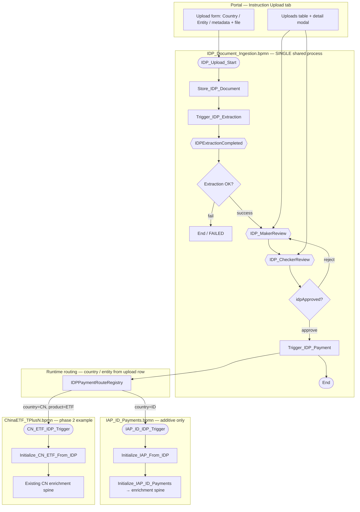
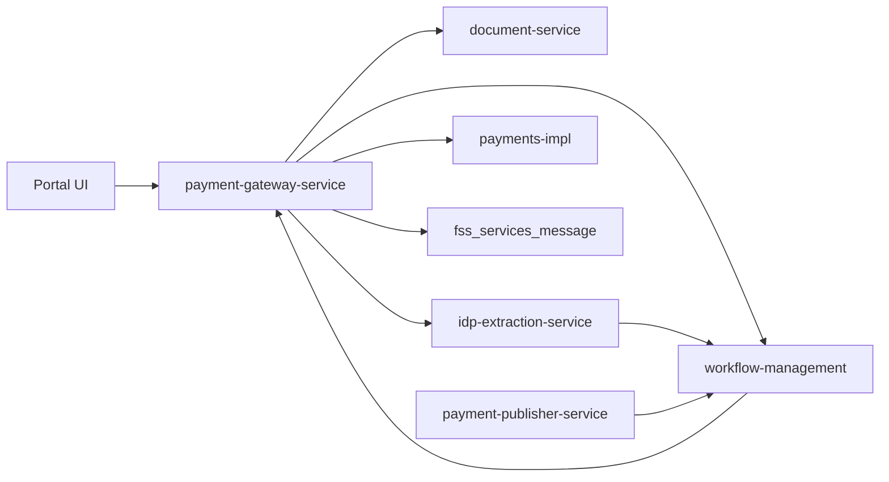
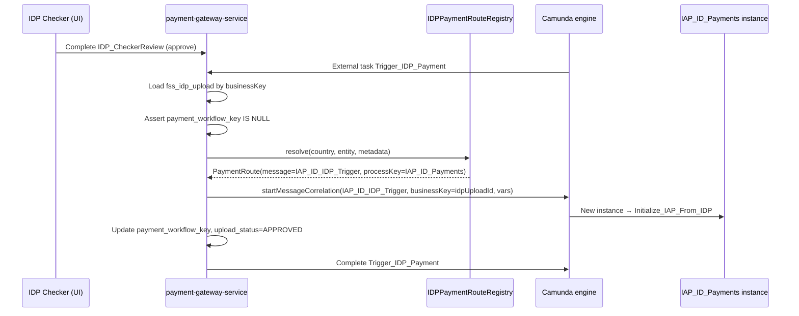
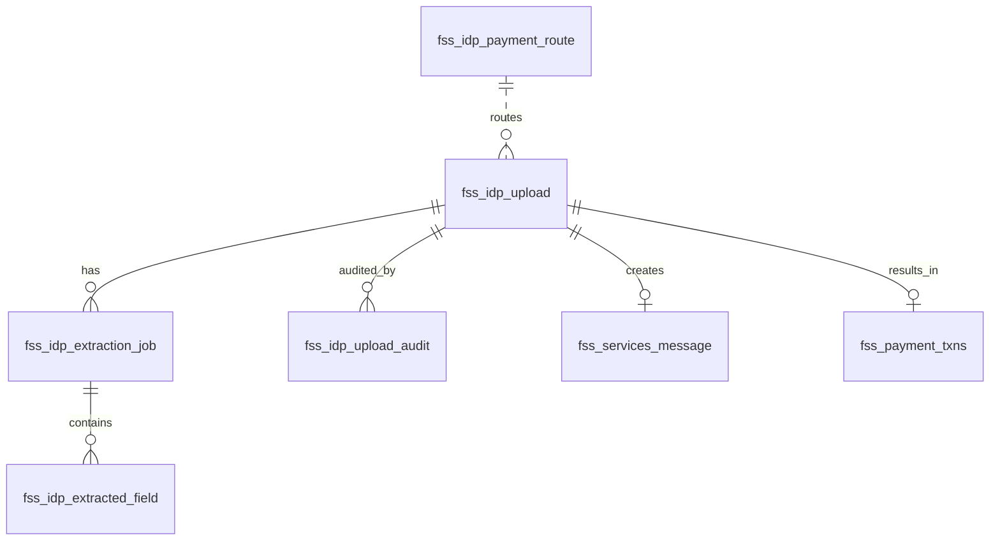
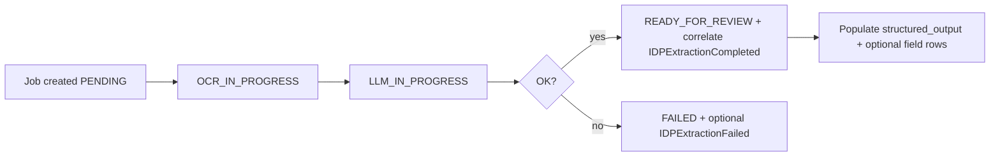

# IDP Document Upload — Low Level Design (LLD)

> **Status:** LLD for implementation  
> **Created:** 2026-07-30  
> **Related:** [IDP_UX_Design.md](./IDP_UX_Design.md) · [IDP_Document_Ingestion_Design.md](./IDP_Document_Ingestion_Design.md) · [ID_payments.md](./ID_payments.md) · [after_ocr-llm-output.json](./after_ocr-llm-output.json)

---

## 1. Purpose and scope

This LLD translates the UX specification and ingestion design into implementable detail: **one common IDP Camunda process for all countries**, **additive triggers on each country-specific payment BPMN**, **database schema**, **REST contracts**, and **Java/UI implementation strategy**.

### 1.1 Design evolution (from prior docs)

| Prior decision ([IDP_Document_Ingestion_Design.md](./IDP_Document_Ingestion_Design.md)) | LLD refinement |
|------------------------------------------------------------------------------------------|----------------|
| Common `IDP_Document_Ingestion.bpmn` + ID-only `IAP_ID_IDP_Trigger` handoff | **Confirmed and extended:** common IDP BPMN is **country-agnostic**; handoff message is **selected at runtime** from `country` / `entity` chosen in UI |
| Indonesia-first (`country = ID`) | **Phase 1 = ID**; registry pattern allows CN ETF and others without new IDP BPMN |
| Two BPMN files (IDP + additive IAP) | **Same pattern per country payment process** — not a single merged IAP file ([IDP_ID_Payments_Enhancement.md](./IDP_ID_Payments_Enhancement.md) single-file approach is **superseded**) |

### 1.2 In scope (v1)

- Landing-page tab UX ([IDP_UX_Design.md](./IDP_UX_Design.md)) for **Indonesia (ID)** payments
- Common `IDP_Document_Ingestion` workflow (upload → OCR/LLM → IDP maker/checker)
- Additive 4th entry on `IAP_ID_Payments` (`IAP_ID_IDP_Trigger`)
- DDL for `fss_idp_*` tables
- Gateway REST + external task handlers
- New `51786-idp-extraction-service`

### 1.3 Out of scope (v1)

- Batch multi-file upload
- New sidebar nav route
- China ETF IDP handoff (registry entry only — implement in phase 2)
- SSTM feedback changes for `channel=IDP_UPLOAD`

---

## 2. Architecture overview

### 2.1 Two-layer BPMN model



**Principle:** OCR, LLM, extraction QC (IDP maker/checker), and upload persistence live **only** in `IDP_Document_Ingestion`. Payment enrichment, cut-off, S2B, and payment maker/checker stay in **existing country BPMNs** — unchanged except for one new message start + one init external task per country.

### 2.2 Service interaction



| Service | Responsibility |
|---------|----------------|
| `51786-payment-gateway-service` | `IDPUploadController`, IDP external task workers, `Trigger_IDP_Payment` routing, `Initialize_*_From_IDP` handlers |
| `51786-idp-extraction-service` | OCR client, LLM structuring, job repo, correlate `IDPExtractionCompleted` |
| `51786-workflow-management` | Deploy `IDP_Document_Ingestion.bpmn` + additive versions of country payment BPMNs |
| `51786-document-service` | Blob / FileNet storage |
| `51786-payment-publisher-service` | No IDP changes in v1 (existing cut-off / status path after handoff) |

---

## 3. BPMN design

### 3.1 Common process: `IDP_Document_Ingestion.bpmn`

| Attribute | Value |
|-----------|-------|
| Process ID | `IDP_Document_Ingestion` |
| Executable | `true` |
| Module | `51786-workflow-management` |
| Country scope | **Global** — one definition for all countries |

#### Process variables (set at start / maintained through flow)

| Variable | Type | Set by | Purpose |
|----------|------|--------|---------|
| `idpUploadId` | String | Upload REST | Business key; correlation id |
| `country` | String | UI upload form | Routes payment handoff |
| `entity` | String | UI (optional) | Legal entity / booking entity when distinct from country |
| `deptId`, `processId`, `subProcessId`, `activityId`, `subActivityId` | String | UI metadata dropdowns | Passed to OCR/LLM context |
| `paymentMaker`, `paymentChecker` | String | Config / upload | IDP user task assignees |
| `idpStatus` | String | Extraction + handlers | `PROCESSING`, `READY_FOR_REVIEW`, `FAILED`, … |
| `idpApproved` | Boolean | Checker complete task | Checker decision |
| `documentId` | String | `Store_IDP_Document` | Document service ref |
| `extractionJobId` | String | Extraction service | Latest job id |
| `paymentTriggerMessage` | String | `Trigger_IDP_Payment` (optional audit) | Message name correlated |

#### Task catalog

| BPMN ID | Type | Topic / message | Handler |
|---------|------|-----------------|---------|
| `IDP_Upload_Start` | Start | REST `startWorkflow(IDP_Document_Ingestion)` | `IDPUploadService` |
| `Store_IDP_Document` | External | `Store_IDP_Document` | `IDPStoreDocumentHandler` |
| `Trigger_IDP_Extraction` | External | `Trigger_IDP_Extraction` | `IDPTriggerExtractionHandler` |
| `Event_IDPExtractionCompleted` | Intermediate catch | `IDPExtractionCompleted` | idp-extraction-service |
| `IDPExtractionGateway` | Exclusive | `${idpStatus=='READY_FOR_REVIEW'}` | — |
| `IDP_MakerReview` | User task | `${paymentMaker}` | Portal modal |
| `IDP_CheckerReview` | User task | `${paymentChecker}` | Portal modal |
| `IDPCheckerGateway` | Exclusive | `${idpApproved==true}` | — |
| `Trigger_IDP_Payment` | External | `Trigger_IDP_Payment` | `IDPTriggerPaymentHandler` |
| `Event_IDP_End` | End | — | — |

#### Boundary events

| Event | Message | Attached to | Action |
|-------|---------|-------------|--------|
| `CancelIDPUpload` | `CancelIDPUpload` | `IDP_MakerReview` | Set status `CANCELLED`; end or cancel path |
| `IDPExtractionFailed` | `IDPExtractionFailed` | Extraction wait (optional) | Set status `FAILED` |

#### BPMN messages (IDP process only)

| Message | Producer | Consumer |
|---------|----------|----------|
| `IDPExtractionCompleted` | idp-extraction-service | `Event_IDPExtractionCompleted` |
| `IDPExtractionFailed` | idp-extraction-service | Boundary (optional) |
| `CancelIDPUpload` | Upload cancel API | Boundary on maker review |

**Important:** `IDP_Document_Ingestion` does **not** define `IAP_ID_IDP_Trigger` or any country payment messages — those belong to country payment BPMNs.

### 3.2 Country payment BPMN — additive pattern (template)

Apply the **same additive diff** to each country payment process when IDP is enabled for that country.

#### Indonesia — `IAP_ID_Payments.bpmn` (phase 1)

| Addition | Detail |
|----------|--------|
| Message start | `IAP_ID_IDP_Trigger` (message `IAP_ID_IDP_Trigger`) |
| External task | `Initialize_IAP_From_IDP` (topic `Initialize_IAP_From_IDP`) |
| Merge | `Initialize_IAP_From_IDP` → `Initialize_IAP_ID_Payments` (3rd incoming) |
| Annotation | *"Triggered from IDP_Document_Ingestion via Trigger_IDP_Payment when country=ID"* |

Existing paths **frozen:** `IAP_ID_AutomatedTrigger`, `IAP_ID_BulkTrigger`, `IAP_ID_Manual_Payment` — no edits to sequence flows, gateway expressions, or existing external task topics.

#### China ETF — `ChinaETF_TPlusN.bpmn` (phase 2 example)

| Addition | Detail |
|----------|--------|
| Message start | `CN_ETF_IDP_Trigger` |
| External task | `Initialize_CN_ETF_From_IDP` |
| Merge | Into existing CN enrichment entry (equivalent of `Initialize_IAP_ID_Payments`) |

Same pattern for `ChinaETF_TplusZero` if product requires separate process.

### 3.3 Handoff flow (`Trigger_IDP_Payment`)



#### Correlation payload (minimum)

| Variable | Value |
|----------|-------|
| `idpUploadId` | Upload PK |
| `extractionJobId` | Latest `is_latest=true` job |
| `documentId` | Document ref |
| `country` | From upload row |
| `entity` | From upload row |
| `channel` | `IDP_UPLOAD` |
| `idpApproved` | `true` |
| `isApproved` | `true` (bulk-like skip of payment checker when validation clean) |
| `isRepaired` | `false` |
| `paymentMaker` / `paymentChecker` | From upload / config |
| `messageId` | If pre-created on `fss_services_message` |

#### Idempotency

1. Before correlate: `SELECT payment_workflow_key FROM fss_idp_upload WHERE idp_upload_id = ?` — abort if non-null.
2. On success: store child process instance id in `payment_workflow_key`.
3. Double approve → single payment instance.

---

## 4. Country / entity routing

### 4.1 `IDPPaymentRouteRegistry` (Java)

Config-driven registry — **no country logic inside BPMN**.

```java
// Conceptual — payment-gateway-service
public record PaymentRoute(
    String messageName,      // e.g. IAP_ID_IDP_Trigger
    String processDefinitionKey, // e.g. IAP_ID_Payments
    String initializeTopic     // e.g. Initialize_IAP_From_IDP — for validation/docs
) {}

public interface IDPPaymentRouteRegistry {
    PaymentRoute resolve(String country, String entity,
                         String processId, String subProcessId);
}
```

#### Phase 1 registry entries

| country | entity | processId (optional) | messageName | processDefinitionKey | initializeTopic |
|---------|--------|----------------------|-------------|----------------------|-----------------|
| `ID` | * | * | `IAP_ID_IDP_Trigger` | `IAP_ID_Payments` | `Initialize_IAP_From_IDP` |

#### Phase 2 stubs (config only — no BPMN deploy until ready)

| country | entity | messageName | processDefinitionKey |
|---------|--------|-------------|----------------------|
| `CN` | `ETF` | `CN_ETF_IDP_Trigger` | `ChinaETF_TPlusN` |
| `CN` | `ETF_T0` | `CN_ETF_T0_IDP_Trigger` | `ChinaETF_TplusZero` |

**Resolution order:** exact match `(country, entity, processId, subProcessId)` → `(country, entity)` → `(country, *)` → error with clear ops message.

Store routes in `application.yml` or DB table `fss_idp_payment_route` (see §5) for runtime changes without redeploy.

### 4.2 UI country / entity selection

From [IDP_UX_Design.md](./IDP_UX_Design.md) upload zone:

```
Country [ID]  Dept ▼  Process ▼  SubProcess ▼  Activity ▼  SubAct ▼
```

| UI field | DB column | Workflow variable | Routing use |
|----------|-----------|-------------------|-------------|
| Country | `country` | `country` | Primary route key |
| Dept / Process / … | `dept_id`, … | same | OCR context + optional route refinement |
| Entity (if separate dropdown added) | `entity` | `entity` | Secondary route key |

For ID v1, country defaults to `ID` on ID payments landing; multi-country portal can expose country picker later using the same tab component.

---

## 5. Database design

### 5.1 New tables

#### `fss_idp_upload` (core)

| Column | Type | Null | Notes |
|--------|------|------|-------|
| `idp_upload_id` | VARCHAR(36) | N | PK, UUID, Camunda business key |
| `batch_id` | VARCHAR(36) | Y | Optional multi-doc batch |
| `file_name` | VARCHAR(255) | N | |
| `document_id` | VARCHAR(255) | Y | Set after store step |
| `country` | VARCHAR(10) | N | Route key — **not hardcoded ID in schema** |
| `entity` | VARCHAR(50) | Y | Legal / booking entity |
| `dept_id` | VARCHAR(50) | Y | |
| `process_id` | VARCHAR(50) | Y | |
| `sub_process_id` | VARCHAR(50) | Y | |
| `activity_id` | VARCHAR(50) | Y | |
| `sub_activity_id` | VARCHAR(50) | Y | |
| `upload_status` | VARCHAR(30) | N | See §5.4 |
| `idp_workflow_key` | VARCHAR(100) | Y | IDP process instance id |
| `payment_workflow_key` | VARCHAR(100) | Y | Country payment instance id after handoff |
| `payment_trigger_message` | VARCHAR(100) | Y | Audited message name from registry |
| `payment_id` | VARCHAR(36) | Y | After `Save_Payment_Transaction` |
| `message_id` | VARCHAR(36) | Y | `fss_services_message` link |
| `uploaded_by` | VARCHAR(100) | N | |
| `uploaded_timestamp` | TIMESTAMP | N | Table sort: DESC |
| `approved_by` | VARCHAR(100) | Y | IDP checker |
| `approved_timestamp` | TIMESTAMP | Y | |
| `remarks` | VARCHAR(500) | Y | Reject / cancel reason |
| `created_by` | VARCHAR(100) | N | Audit |
| `created_timestamp` | TIMESTAMP | N | |
| `updated_by` | VARCHAR(100) | Y | |
| `updated_timestamp` | TIMESTAMP | Y | |

**Indexes:**

- `idx_idp_upload_status_ts` on (`upload_status`, `uploaded_timestamp` DESC)
- `idx_idp_upload_country_ts` on (`country`, `uploaded_timestamp` DESC)
- `idx_idp_upload_user` on (`uploaded_by`, `uploaded_timestamp` DESC)
- `uq_idp_payment_workflow` on (`payment_workflow_key`) WHERE `payment_workflow_key IS NOT NULL` (optional — idempotency)

#### `fss_idp_extraction_job`

| Column | Type | Null | Notes |
|--------|------|------|-------|
| `extraction_job_id` | VARCHAR(36) | N | PK |
| `idp_upload_id` | VARCHAR(36) | N | FK → `fss_idp_upload` |
| `extraction_token` | VARCHAR(512) | Y | OCR API token |
| `ocr_job_id` | VARCHAR(100) | Y | External OCR id |
| `job_status` | VARCHAR(30) | N | PENDING, OCR_IN_PROGRESS, LLM_IN_PROGRESS, READY_FOR_REVIEW, FAILED |
| `ocr_response_payload` | CLOB | Y | Retention policy applies |
| `llm_response_payload` | CLOB | Y | |
| `structured_output` | CLOB | Y | Target: [after_ocr-llm-output.json](./after_ocr-llm-output.json) |
| `error_code` | VARCHAR(50) | Y | |
| `error_description` | VARCHAR(500) | Y | |
| `retry_count` | INT | N | Default 0 |
| `is_latest` | BOOLEAN | N | Default true; false on re-extract |
| `started_timestamp` | TIMESTAMP | Y | |
| `completed_timestamp` | TIMESTAMP | Y | |
| `created_timestamp` | TIMESTAMP | N | |

**Indexes:**

- `idx_idp_job_upload` on (`idp_upload_id`, `is_latest`)
- `idx_idp_job_status` on (`job_status`)

#### `fss_idp_extracted_field` (recommended for modal PATCH)

| Column | Type | Null | Notes |
|--------|------|------|-------|
| `field_id` | BIGINT | N | PK, identity |
| `extraction_job_id` | VARCHAR(36) | N | FK |
| `section` | VARCHAR(50) | N | HEADER, TRANSACTION, DEBIT, CREDIT |
| `leg_index` | INT | Y | 0-based leg |
| `field_name` | VARCHAR(100) | N | |
| `field_value` | VARCHAR(500) | Y | |
| `confidence` | DECIMAL(5,2) | Y | |
| `is_edited` | BOOLEAN | N | Default false |
| `edited_by` | VARCHAR(100) | Y | |
| `edited_timestamp` | TIMESTAMP | Y | |

**Indexes:** `idx_idp_field_job` on (`extraction_job_id`, `section`, `leg_index`)

#### `fss_idp_upload_audit` (recommended)

| Column | Type | Null | Notes |
|--------|------|------|-------|
| `audit_id` | BIGINT | N | PK |
| `idp_upload_id` | VARCHAR(36) | N | |
| `action` | VARCHAR(50) | N | UPLOAD, EXTRACT_COMPLETE, MAKER_SUBMIT, CHECKER_APPROVE, PAYMENT_TRIGGERED, … |
| `actor` | VARCHAR(100) | Y | |
| `details` | CLOB | Y | JSON snippet |
| `timestamp` | TIMESTAMP | N | |

#### `fss_idp_payment_route` (optional — alternative to YAML)

| Column | Type | Notes |
|--------|------|-------|
| `route_id` | BIGINT PK | |
| `country` | VARCHAR(10) | |
| `entity` | VARCHAR(50) | Nullable = wildcard |
| `process_id` | VARCHAR(50) | Optional filter |
| `sub_process_id` | VARCHAR(50) | Optional |
| `message_name` | VARCHAR(100) | e.g. `IAP_ID_IDP_Trigger` |
| `process_definition_key` | VARCHAR(100) | |
| `initialize_topic` | VARCHAR(100) | |
| `is_active` | BOOLEAN | |
| `priority` | INT | Higher wins on match |

### 5.2 Existing tables (usage)

| Table | Usage |
|-------|-------|
| `fss_services_message` | `channel = IDP_UPLOAD`; enriched Payment after `Initialize_*_From_IDP` |
| `fss_payment_txns` | No schema change; row created by existing `Save_Payment_Transaction` |
| `fss_serv_batch` | Optional `batch_id` on upload |
| `act_*` | Camunda state for IDP + payment instances |

### 5.3 ER diagram



### 5.4 Upload status lifecycle

| Status | Set by | UI table | Row clickable |
|--------|--------|----------|---------------|
| `UPLOADED` | Insert on REST | — | No |
| `PROCESSING` | After start workflow | Processing | No |
| `READY_FOR_REVIEW` | Extraction complete | Ready review | Yes (maker) |
| `SUBMITTED` | Maker submit | With checker | Yes |
| `REJECTED` | Checker reject | Rejected | Yes (maker) |
| `APPROVED` | Handoff triggered | Approved | Yes (read-only) |
| `COMPLETED` | Payment completed | Completed | Yes |
| `FAILED` | Extraction fail | Failed | Yes |
| `CANCELLED` | Maker cancel | Cancelled | Optional |

Map `upload_status` ↔ `idpStatus` process variable on every transition.

### 5.5 DDL sketch (Oracle / generic)

```sql
CREATE TABLE fss_idp_upload (
    idp_upload_id        VARCHAR2(36)  PRIMARY KEY,
    batch_id             VARCHAR2(36),
    file_name            VARCHAR2(255) NOT NULL,
    document_id          VARCHAR2(255),
    country              VARCHAR2(10)  NOT NULL,
    entity               VARCHAR2(50),
    dept_id              VARCHAR2(50),
    process_id           VARCHAR2(50),
    sub_process_id       VARCHAR2(50),
    activity_id          VARCHAR2(50),
    sub_activity_id      VARCHAR2(50),
    upload_status        VARCHAR2(30)  NOT NULL,
    idp_workflow_key     VARCHAR2(100),
    payment_workflow_key VARCHAR2(100),
    payment_trigger_message VARCHAR2(100),
    payment_id           VARCHAR2(36),
    message_id           VARCHAR2(36),
    uploaded_by          VARCHAR2(100) NOT NULL,
    uploaded_timestamp   TIMESTAMP     NOT NULL,
    approved_by          VARCHAR2(100),
    approved_timestamp   TIMESTAMP,
    remarks              VARCHAR2(500),
    created_by           VARCHAR2(100) NOT NULL,
    created_timestamp    TIMESTAMP     NOT NULL,
    updated_by           VARCHAR2(100),
    updated_timestamp    TIMESTAMP
);

CREATE TABLE fss_idp_extraction_job (
    extraction_job_id    VARCHAR2(36)  PRIMARY KEY,
    idp_upload_id        VARCHAR2(36)  NOT NULL REFERENCES fss_idp_upload(idp_upload_id),
    extraction_token     VARCHAR2(512),
    ocr_job_id           VARCHAR2(100),
    job_status           VARCHAR2(30)  NOT NULL,
    ocr_response_payload CLOB,
    llm_response_payload CLOB,
    structured_output    CLOB,
    error_code           VARCHAR2(50),
    error_description    VARCHAR2(500),
    retry_count          NUMBER(5)     DEFAULT 0 NOT NULL,
    is_latest            CHAR(1)       DEFAULT 'Y' NOT NULL,
    started_timestamp    TIMESTAMP,
    completed_timestamp  TIMESTAMP,
    created_timestamp    TIMESTAMP     NOT NULL
);

-- fss_idp_extracted_field, fss_idp_upload_audit, fss_idp_payment_route — same columns as §5.1
```

---

## 6. REST API design

Base path: `/v1/idp` (gateway-service). Auth: existing portal JWT + `paymentMaker` / `paymentChecker` groups.

| Method | Path | Purpose |
|--------|------|---------|
| `POST` | `/uploads` | Multipart upload + metadata; creates row; starts `IDP_Document_Ingestion` |
| `GET` | `/uploads` | List with `sort=recent`, filters: `status`, `country`, `myUploads` |
| `GET` | `/uploads/{id}` | Detail for modal (upload + latest job + fields) |
| `PATCH` | `/uploads/{id}/fields` | Maker save draft |
| `POST` | `/uploads/{id}/re-extract` | New job; row → `PROCESSING` |
| `POST` | `/workflow/complete` | Existing generic complete — maker submit, checker approve/reject, cancel |

### 6.1 `POST /v1/idp/uploads` request

```json
{
  "country": "ID",
  "entity": null,
  "deptId": "FundServices",
  "processId": "Cash",
  "subProcessId": "CI",
  "activityId": "BT",
  "subActivityId": "Redemption"
}
```

Multipart: `file` (PDF/image).

### 6.2 `POST /v1/idp/uploads` response

```json
{
  "idpUploadId": "a1b2c3d4-...",
  "uploadStatus": "PROCESSING",
  "idpWorkflowKey": "..."
}
```

### 6.3 List response row

```json
{
  "idpUploadId": "...",
  "fileName": "3897122.pdf",
  "uploadedTimestamp": "2026-07-30T10:22:00Z",
  "uploadStatus": "READY_FOR_REVIEW",
  "uploadedBy": "you",
  "paymentRef": null,
  "country": "ID"
}
```

---

## 7. Code implementation strategy

### 7.1 Module layout

```
51786-payment-gateway-service/
  src/main/java/.../idp/
    controller/IDPUploadController.java
    service/
      IDPUploadService.java
      IDPFieldService.java
      IDPPaymentRouteRegistry.java (+ YamlPaymentRouteRegistry)
    workflow/handler/idp/
      IDPStoreDocumentHandler.java
      IDPTriggerExtractionHandler.java
      IDPTriggerPaymentHandler.java
    workflow/handler/iap/id/
      IAPIDPInitializeHandler.java      // topic Initialize_IAP_From_IDP
    mapper/
      IDPStructuredOutputMapper.java    // JSON → Payment / fields
    model/entity/
      IdpUploadEntity.java
      IdpExtractionJobEntity.java
      IdpExtractedFieldEntity.java
    repository/
      IdpUploadRepository.java
      ...

51786-idp-extraction-service/   (NEW)
  src/main/java/.../
    client/OcrApiClient.java
    client/LlmStructuringClient.java
    service/ExtractionPipelineService.java
    service/ExtractionCorrelationService.java
    model/entity/IdpExtractionJobEntity.java  // or shared lib
    listener/ExtractionJobListener.java

51786-workflow-management/
  src/main/resources/
    IDP_Document_Ingestion.bpmn
    IAP_ID_Payments.bpmn          // additive v(N+1)
```

### 7.2 Implementation patterns (align with [ID_payments.md](./ID_payments.md))

| Pattern | Application |
|---------|-------------|
| External task workers | All IDP service tasks use `@ExternalTaskSubscription` + `ExternalTaskHelper` retry — same as `IAPPaymentTransactionHandler` |
| Message correlation | `WorkflowService.startMessageCorrelation` for handoff and extraction complete |
| Payment enrichment | **No** IDP logic in enrichment chain — only `Initialize_*_From_IDP` builds `Message.enrichedMessage` |
| Process variables | Booleans for gateways (`idpApproved`); strings `"true"`/`"false"` for payment gateways after handoff — match existing IAP conventions |
| Human tasks | Portal completes via generic `/v1/workflow/complete` — not country-specific Java |

### 7.3 Key class responsibilities

#### `IDPUploadService`

1. Validate file type / size.
2. Insert `fss_idp_upload` (`UPLOADED`).
3. Call `WorkflowService.startWorkflow` with `processKey = IDP_Document_Ingestion`, `businessKey = idpUploadId`, variables from form.
4. Update `idp_workflow_key`, `upload_status = PROCESSING`.

**Must not** start `IAP_ID_Manual_Payment` or country payment processes directly.

#### `IDPStoreDocumentHandler`

1. Read file from temp storage or process variable.
2. `document-service` upload → `document_id`.
3. Update upload row; complete external task.

#### `IDPTriggerExtractionHandler`

1. Create `fss_idp_extraction_job` (`PENDING`, `is_latest=true`).
2. REST call to idp-extraction-service `POST /internal/jobs`.
3. Complete external task (async pipeline).

#### `IDPTriggerPaymentHandler`

1. Load upload; guard `payment_workflow_key`.
2. `registry.resolve(country, entity, processId, subProcessId)`.
3. Build correlation variables (§3.3).
4. `startMessageCorrelation(route.messageName(), ...)`.
5. Update `payment_workflow_key`, `payment_trigger_message`, `upload_status = APPROVED`.
6. Audit `PAYMENT_TRIGGERED`.
7. Complete external task.

#### `IAPIDPInitializeHandler` (`Initialize_IAP_From_IDP`)

1. Load latest extraction job structured JSON.
2. `IDPStructuredOutputMapper` → `Payment` / `PaymentData` (§7.4).
3. `MessageService.save` with `channel=IDP_UPLOAD`, `country=ID`.
4. Set `messageId` variable; complete task.
5. Flow continues to `Initialize_IAP_ID_Payments` — **no changes** to downstream handlers.

#### Country-specific init handlers (phase 2)

- `CNEFTPDPInitializeHandler` — same structure, CN-specific mapper.
- Consider abstract `AbstractIDPInitializeHandler` with injected `PaymentMapper` per country.

### 7.4 JSON → Payment mapping (ID)

Handler: `Initialize_IAP_From_IDP` / `IAPIDPInitializeHandler`

| JSON path | Payment / Message field |
|-----------|-------------------------|
| `header.uniqueId` | External ref / `functional_id` |
| `initiationDetail.TxRef` | Transaction reference |
| `initiationDetail.TrnTyp` / `SubActivityId` | Transaction type |
| `initiationDetail.ClntNm` | Client name |
| `initiationDetail.ValDt` | Value date |
| `TransactionDetails[*]` | Payment attributes |
| `DebitDetails.details[*].data` | Debit legs |
| `CreditDetails.details[*].data` | Credit legs |
| `header.doc_ids[0]` | Document linkage |

Reference: [after_ocr-llm-output.json](./after_ocr-llm-output.json)

Keep mapper **per country** when CN field shapes diverge; share leg-building utilities.

### 7.5 idp-extraction-service pipeline



On success:

1. Update job + upload status.
2. Optionally flatten to `fss_idp_extracted_field`.
3. `WorkflowService.startMessageCorrelation("IDPExtractionCompleted", businessKey=idpUploadId, { idpStatus: READY_FOR_REVIEW, extractionJobId })`.

### 7.6 Error handling

| Layer | Strategy |
|-------|----------|
| External tasks | `ExternalTaskHelper` retries; exhausted → fail upload row + audit |
| Handoff | If correlate fails, **do not** complete `Trigger_IDP_Payment`; upload stays `SUBMITTED`; ops alert |
| Extraction | Retry with `retry_count`; re-extract creates new job, marks old `is_latest=false` |
| Payment gateways | Existing IAP behavior after handoff — no IDP changes |

### 7.7 Feature flags

| Flag | Purpose |
|------|---------|
| `idp.instruction-upload.enabled` | Show upload tab |
| `idp.countries.enabled` | List e.g. `ID` only in v1 |
| `idp.extraction.mock` | Mock OCR/LLM in lower env |

---

## 8. Frontend implementation strategy

Align with [IDP_UX_Design.md](./IDP_UX_Design.md) §8.

### 8.1 Components

| Component | Responsibility |
|-----------|----------------|
| `IdPaymentsLandingPage` | Add `TabBar`; wrap existing dashboard |
| `InstructionUploadTab` | Upload form + table |
| `UploadForm` | Country (default ID), metadata dropdowns, file picker |
| `UploadsTable` | Recent-first, disabled rows when processing |
| `UploadDetailModal` | Field grids, role/status actions |
| `useUploadsTable` | Fetch, 5s poll when processing rows exist |

### 8.2 URL state

| Query | Behavior |
|-------|----------|
| `tab=instruction-upload` | Active upload tab |
| `uploadId={id}` | Open modal on load |
| default / `tab=dashboard` | Existing dashboard |

### 8.3 API integration map

| Interaction | API |
|-------------|-----|
| Tab load | `GET /v1/idp/uploads?sort=recent&country=ID` |
| Upload | `POST /v1/idp/uploads` |
| Poll | `GET /v1/idp/uploads?sort=recent` every 5s if processing |
| Modal | `GET /v1/idp/uploads/{id}` |
| Save draft | `PATCH /v1/idp/uploads/{id}/fields` |
| Submit / Approve / Reject | `POST /v1/workflow/complete` |
| Re-extract | `POST /v1/idp/uploads/{id}/re-extract` |

### 8.4 Role matrix (modal buttons)

See [IDP_UX_Design.md](./IDP_UX_Design.md) §5 — implement via `ActionBar` driven by `uploadStatus` + `paymentMaker` / `paymentChecker`.

---

## 9. Two maker-checker cycles

| Stage | Process | Tasks | Purpose |
|-------|---------|-------|---------|
| Extraction QC | `IDP_Document_Ingestion` | `IDP_MakerReview`, `IDP_CheckerReview` | Validate OCR/LLM fields |
| Payment QC | `IAP_ID_Payments` (etc.) | `IAP_ID_MakerPayment`, `IAP_ID_CheckerPayment` | Banking repair / approval |

After IDP checker approves:

- Handoff sets `isApproved=true`.
- `PaymentValidationGateway` may skip payment checker when `isRepaired=false` and `isApproved=true` (existing `Flow_12mndij`).
- `TO_BE_REPAIR` still routes to payment maker — no new logic.

**Do not** reuse `IAP_ID_MakerPayment` for extraction review.

---

## 10. Deployment plan

| Phase | Deliverable | Prod risk |
|-------|-------------|-----------|
| P1 | DDL `fss_idp_*` | None |
| P2 | `IDP_Document_Ingestion.bpmn` + mock extraction service | None on IAP |
| P3 | Gateway IDP handlers (`Store`, `Trigger_Extraction`, `Trigger_Payment` with registry) | None until IDP started |
| P4 | Additive `IAP_ID_Payments.bpmn` v(N+1) + `IAPIDPInitializeHandler` | Regression on old paths |
| P5 | Real OCR + LLM | IDP path only |
| P6 | UI tab behind feature flag | Controlled rollout |
| P7 | Canary E2E ID upload → payment | New path only |

**Order:** tables → IDP BPMN + extraction service → payment BPMN additive + init handler → enable UI flag.

**Rollback:** disable feature flag; automated/bulk/manual IAP paths unaffected.

---

## 11. Test strategy

### 11.1 Regression (IAP v(N+1) before prod)

| # | Scenario | Expected |
|---|----------|----------|
| 1 | Automated JMS | `Initialize_IAP_Payments` — unchanged |
| 2 | Bulk upload ID | Bulk init — unchanged |
| 3 | Manual start | `IAP_ID_MakerPayment` — unchanged |
| 4 | IDP upload → approve → handoff | `Initialize_IAP_From_IDP` → enrichment |
| 5 | IDP double approve | Single payment instance |
| 6 | IDP handoff failure | No duplicate payment; retriable task |
| 7 | Wrong country in registry | Clear error; no correlate |

### 11.2 IDP-specific

| # | Scenario | Expected |
|---|----------|----------|
| 1 | Upload PDF | Row `PROCESSING`, workflow started |
| 2 | Extraction complete | `READY_FOR_REVIEW`, row clickable |
| 3 | Maker submit | `SUBMITTED` |
| 4 | Checker reject | `REJECTED`, back to maker |
| 5 | Re-extract | New job, old `is_latest=false` |
| 6 | Cancel upload | `CANCELLED` |
| 7 | Modal deep link | `?tab=instruction-upload&uploadId=` |

---

## 12. Risk register

| Risk | Mitigation |
|------|------------|
| Editing shared IAP gateway conditions | Additive-only BPMN diff; code review |
| Message name collision | Country-prefixed names: `IAP_ID_IDP_Trigger`, `CN_ETF_IDP_Trigger` |
| Duplicate payment instances | `payment_workflow_key` idempotency |
| Registry misconfiguration | Startup validation; integration test per route |
| Two Cockpit instances | Shared `businessKey=idpUploadId`; link columns on upload row |
| Deploy payment BPMN without init worker | Deploy workers before UI flag |
| PII in CLOB columns | Retention policy; mask in non-prod |

---

## 13. Open questions

| # | Question | Owner |
|---|----------|-------|
| 1 | OCR API contract (auth, callback, max size) | IDP / integration |
| 2 | LLM hosting and prompt versioning | IDP |
| 3 | Final upload tab label ([IDP_UX_Design.md](./IDP_UX_Design.md) §2.1.1) | UX |
| 4 | Separate `entity` dropdown vs infer from metadata | UX / product |
| 5 | Route config: YAML vs `fss_idp_payment_route` table | Engineering |
| 6 | SSTM feedback for `channel=IDP_UPLOAD` | Payments |
| 7 | PDF preview in modal v1? | UX |

---

## 14. Document history

| Date | Change |
|------|--------|
| 2026-07-30 | Initial LLD — common IDP BPMN, per-country payment triggers, tables, code strategy |
