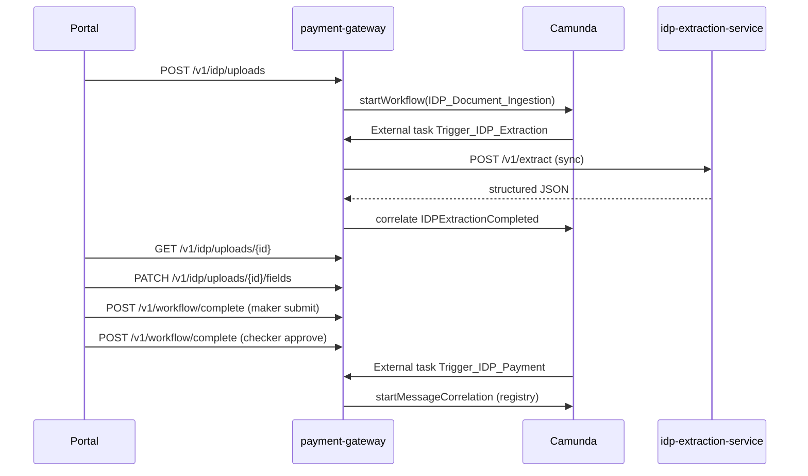

# IDP Document Ingestion — API Reference

> **Status:** Final  
> **Created:** 2026-08-02  
> **Related:** [README.md](./README.md) · [IDP_LLD.md](./IDP_LLD.md) §6 · [IDP_UX_Design.md](./IDP_UX_Design.md) §8.5 · [../51786-idp-extraction-service/README.md](../51786-idp-extraction-service/README.md)

This document lists **all APIs** in the IDP document upload flow: what each endpoint does, who calls it, and how it fits the end-to-end journey.

---

## 1. API landscape

Two services expose HTTP APIs. The portal talks only to **payment-gateway-service**. The gateway orchestrates Camunda and calls **idp-extraction-service** internally.

| Service | Base path | Caller | Status |
|---------|-----------|--------|--------|
| `51786-payment-gateway-service` | `/v1/idp` | Portal UI (makers/checkers) | **Planned** |
| `51786-payment-gateway-service` | `/v1/workflow` | Portal UI (human tasks) | **Existing** — reused for IDP tasks |
| `51786-payment-gateway-service` | `/v1/idp/internal` | idp-extraction-service, ops | **Planned** (internal network only) |
| `51786-idp-extraction-service` | `/v1/extract` | payment-gateway-service | **Built** |



---

## 2. Portal APIs — `payment-gateway-service`

**Base path:** `/v1/idp`  
**Auth:** Existing portal JWT. Role groups: `paymentMaker`, `paymentChecker`.

### 2.1 Summary table

| Method | Path | Purpose | UI use |
|--------|------|---------|--------|
| `POST` | `/uploads` | Upload file + metadata; persist rows; start `IDP_Document_Ingestion` | Upload button |
| `GET` | `/uploads` | List uploads (recent first, filters) | Upload tab table |
| `GET` | `/uploads/{id}` | Upload detail + latest extraction run + fields (no blob) | Detail modal |
| `PATCH` | `/uploads/{id}/fields` | Maker saves draft field edits | Save draft |
| `POST` | `/uploads/{id}/re-extract` | Start new extraction run | Re-extract button |
| `POST` | `/workflow/complete` | Complete Camunda user task | Submit / Approve / Reject / Cancel |

---

### 2.2 `POST /v1/idp/uploads`

Upload a payment instruction document and start the IDP workflow.

**Content-Type:** `multipart/form-data`

| Part | Type | Required | Description |
|------|------|----------|-------------|
| `file` | file | Yes | PDF or image |
| `country` | string | Yes | Route key — phase 1: `ID` |
| `entity` | string | No | Legal/booking entity when distinct from country |
| `deptId` | string | Yes | Department metadata |
| `processId` | string | Yes | Process metadata |
| `subProcessId` | string | No | Sub-process metadata |
| `activityId` | string | No | Activity metadata |
| `subActivityId` | string | No | Sub-activity metadata |

**Alternative:** metadata as JSON part `metadata` (same fields as below).

**Example metadata (JSON part):**

```json
{
  "country": "ID",
  "entity": null,
  "deptId": "FundServices",
  "processId": "Cash",
  "subProcessId": "CI",
  "activityId": "BT",
  "subActivityId": "Redemption"
}
```

**Server actions:**

1. Insert `fss_idp_upload` (status `UPLOADED` → `PROCESSING`).
2. Insert `fss_idp_upload_content` (BLOB).
3. `startWorkflow(IDP_Document_Ingestion)` with `businessKey = idpUploadId`.
4. Camunda reaches `Trigger_IDP_Extraction` → gateway handler calls extraction service.

**Response `201 Created`:**

```json
{
  "idpUploadId": "a1b2c3d4-e5f6-7890-abcd-ef1234567890",
  "uploadStatus": "PROCESSING",
  "idpWorkflowKey": "camunda-process-instance-id"
}
```

**Errors:**

| HTTP | When |
|------|------|
| `400` | Missing file, invalid metadata, unsupported content type |
| `401` / `403` | Not authenticated or not in `paymentMaker` group |
| `413` | File exceeds max size |
| `500` | DB or workflow start failure |

---

### 2.3 `GET /v1/idp/uploads`

List uploads for the upload tab.

**Query parameters:**

| Param | Type | Default | Description |
|-------|------|---------|-------------|
| `sort` | string | `recent` | `recent` = `uploaded_timestamp` DESC |
| `country` | string | — | Filter by country (e.g. `ID`) |
| `status` | string | — | Filter by `uploadStatus` |
| `myUploads` | boolean | `false` | When `true`, only current user's uploads |
| `page` | int | `0` | Page index |
| `size` | int | `20` | Page size |

**Example:** `GET /v1/idp/uploads?sort=recent&country=ID&myUploads=true`

**Response `200 OK`:**

```json
{
  "content": [
    {
      "idpUploadId": "a1b2c3d4-...",
      "fileName": "3897122.pdf",
      "uploadedTimestamp": "2026-07-30T10:22:00Z",
      "uploadStatus": "READY_FOR_REVIEW",
      "overallConfidence": 97.23,
      "uploadedBy": "maker.user",
      "paymentRef": null,
      "country": "ID",
      "extractionRunId": "ext-run-uuid",
      "idpWorkflowKey": "..."
    }
  ],
  "page": 0,
  "size": 20,
  "totalElements": 42
}
```

**UI behaviour:**

- Poll every **5 seconds** while any row has `uploadStatus` in `UPLOADED`, `PROCESSING`.
- Disable row click when status is `PROCESSING` (see [IDP_UX_Design.md](./IDP_UX_Design.md) §3).

**Upload status values:**

| `uploadStatus` | Meaning | Row clickable |
|----------------|---------|---------------|
| `UPLOADED` | Persisted, workflow starting | No |
| `PROCESSING` | OCR/LLM in progress | No |
| `READY_FOR_REVIEW` | Extraction complete — maker review | Yes |
| `SUBMITTED` | With checker | Yes |
| `REJECTED` | Checker rejected | Yes (maker) |
| `APPROVED` | Handed off to payment BPMN | Yes (read-only) |
| `COMPLETED` | Payment path finished | Yes |
| `FAILED` | Extraction failed | Yes |
| `CANCELLED` | Maker cancelled | Optional |

---

### 2.4 `GET /v1/idp/uploads/{id}`

Load upload detail for the modal. Does **not** return the file blob.

**Response `200 OK`:**

```json
{
  "idpUploadId": "a1b2c3d4-...",
  "fileName": "3897122.pdf",
  "contentType": "application/pdf",
  "fileSize": 245760,
  "country": "ID",
  "entity": null,
  "deptId": "FundServices",
  "processId": "Cash",
  "subProcessId": "CI",
  "activityId": "BT",
  "subActivityId": "Redemption",
  "uploadStatus": "READY_FOR_REVIEW",
  "uploadedBy": "maker.user",
  "uploadedTimestamp": "2026-07-30T10:22:00Z",
  "approvedBy": null,
  "approvedTimestamp": null,
  "remarks": null,
  "paymentRef": null,
  "paymentId": null,
  "idpWorkflowKey": "...",
  "paymentWorkflowKey": null,
  "extractionRun": {
    "extractionRunId": "ext-run-uuid",
    "runStatus": "READY_FOR_REVIEW",
    "overallConfidence": 97.23,
    "startedTimestamp": "2026-07-30T10:22:05Z",
    "completedTimestamp": "2026-07-30T10:24:12Z",
    "isLatest": true,
    "errorCode": null,
    "errorDescription": null
  },
  "structuredOutput": { },
  "camundaTasks": [
    {
      "taskId": "camunda-task-id",
      "taskDefinitionKey": "IDP_MakerReview",
      "assignee": "maker.user"
    }
  ]
}
```

`structuredOutput` follows [../after_ocr-llm-output.json](../after_ocr-llm-output.json) — every extracted field includes `Confidence` (0–100). UI highlights fields where `Confidence < 90` (configurable).

**Errors:**

| HTTP | When |
|------|------|
| `404` | Unknown `idpUploadId` |
| `403` | User cannot view this upload |

---

### 2.5 `PATCH /v1/idp/uploads/{id}/fields`

Maker saves draft edits without submitting to checker.

**Allowed when:** `uploadStatus` is `READY_FOR_REVIEW` or `REJECTED`, and caller is `paymentMaker`.

**Request body:**

```json
{
  "structuredOutput": {
    "initiationDetail": {
      "TxRef": "3897122-001",
      "TransactionDetails": [
        { "Name": "BankChg", "Value": "No", "Confidence": "99.0" }
      ]
    }
  },
  "fields": [
    {
      "section": "TRANSACTION",
      "legIndex": 0,
      "fieldName": "BankChg",
      "fieldValue": "No"
    }
  ]
}
```

- Send full `structuredOutput` **or** granular `fields` array (server merges into `fss_idp_extraction_run.structured_output` and optional `fss_idp_extracted_field`).
- Maker edits **values only** — original `Confidence` values are retained for audit.

**Response `200 OK`:**

```json
{
  "idpUploadId": "a1b2c3d4-...",
  "uploadStatus": "READY_FOR_REVIEW",
  "extractionRunId": "ext-run-uuid",
  "savedAt": "2026-07-30T10:30:00Z"
}
```

---

### 2.6 `POST /v1/idp/uploads/{id}/re-extract`

Trigger a new OCR + LLM pass on the same upload.

**Allowed when:** `uploadStatus` is `READY_FOR_REVIEW`, `REJECTED`, or `FAILED`, and caller is `paymentMaker`.

**Request body:** optional

```json
{
  "reason": "Poor OCR quality on debit section"
}
```

**Server actions:**

1. Mark current run `is_latest = false`.
2. Insert new `fss_idp_extraction_run` (`PENDING`).
3. Set upload `uploadStatus = PROCESSING`.
4. Signal workflow / re-fire extraction (same path as initial `Trigger_IDP_Extraction`).

**Response `202 Accepted`:**

```json
{
  "idpUploadId": "a1b2c3d4-...",
  "uploadStatus": "PROCESSING",
  "extractionRunId": "new-ext-run-uuid"
}
```

---

### 2.7 `POST /v1/workflow/complete` (existing — IDP task usage)

Generic Camunda task completion API already used by the payments portal. IDP reuses it for maker/checker human tasks — **no new country-specific complete endpoints**.

**Base path:** `/v1/workflow` (gateway-service)

#### Maker — submit to checker

Completes `IDP_MakerReview`. Sets upload `SUBMITTED`.

```json
{
  "taskId": "camunda-task-id",
  "variables": {
    "idpStatus": "SUBMITTED"
  }
}
```

#### Checker — approve

Completes `IDP_CheckerReview`. Triggers `Trigger_IDP_Payment` → registry → country payment BPMN.

```json
{
  "taskId": "camunda-task-id",
  "variables": {
    "idpApproved": true,
    "idpStatus": "APPROVED"
  }
}
```

#### Checker — reject

Returns flow to maker. Sets upload `REJECTED`.

```json
{
  "taskId": "camunda-task-id",
  "variables": {
    "idpApproved": false,
    "idpStatus": "REJECTED",
    "remarks": "Debit account number does not match statement"
  }
}
```

#### Maker — cancel upload

Correlates `CancelIDPUpload` boundary message on `IDP_MakerReview`.

```json
{
  "taskId": "camunda-task-id",
  "messageName": "CancelIDPUpload",
  "variables": {
    "idpStatus": "CANCELLED"
  }
}
```

> **Note:** Exact request shape follows the existing gateway `WorkflowComplete` contract. Align field names with current portal payment task completion — IDP only adds the variables above.

**Response `200 OK`:** standard workflow complete response (task closed, next task if any).

---

## 3. Internal gateway API

Not exposed to the portal. Service-to-service or ops only.

### 3.1 `GET /v1/idp/internal/uploads/{id}/content`

Stream the uploaded file bytes from `fss_idp_upload_content`.

| Header | Value |
|--------|-------|
| `Accept` | `application/octet-stream` or original `contentType` |

**Caller:** `IDPTriggerExtractionHandler` (gateway loads blob and base64-encodes for extraction service), or idp-extraction-service if configured to fetch content by URL.

**Auth:** Internal service token / mTLS — not portal JWT.

**Response `200 OK`:** raw file bytes.

**Errors:** `404` if upload or content row missing.

---

## 4. Extraction service APIs — `51786-idp-extraction-service`

**Base path:** `/v1/extract`  
**Status:** **Implemented** (mock mode available)  
**Caller:** `payment-gateway-service` only (not portal)

Domain-agnostic — no Camunda, no payment tables. Technical audit in `idp_extraction_audit`.

### 4.1 `POST /v1/extract` (synchronous)

Run OCR + LLM for one document. **Blocks** until complete or failure (phase 1). Gateway HTTP read timeout: **15 min**.

**Request `application/json`:**

```json
{
  "templateId": "id-payment-v1",
  "correlationId": "a1b2c3d4-e5f6-7890-abcd-ef1234567890",
  "fileName": "3897122.pdf",
  "fileContent": "<base64-encoded-bytes>",
  "locale": "id-ID",
  "metadata": {
    "deptId": "FundServices",
    "processId": "Cash",
    "subProcessId": "CI",
    "country": "ID"
  }
}
```

| Field | Required | Description |
|-------|----------|-------------|
| `templateId` | Yes | Template manifest under `templates/{templateId}/` — phase 1: `id-payment-v1` |
| `correlationId` | No | Opaque caller reference — gateway sets to `idpUploadId` |
| `fileName` | No | Original filename (prompt context) |
| `fileContent` | No* | Base64 document bytes — gateway supplies from upload content |
| `locale` | No | e.g. `id-ID` for Indonesia |
| `metadata` | No | Passed into LLM user prompt |

\*Required in production when OCR runs on document bytes; optional in mock mode.

**Response `200 OK` (success):**

```json
{
  "extractionId": "ext-audit-uuid",
  "templateId": "id-payment-v1",
  "correlationId": "a1b2c3d4-...",
  "status": "COMPLETED",
  "structuredOutput": { },
  "ocrTraceId": "ocr-job-id",
  "processingTimeMs": 45230,
  "errorCode": null,
  "errorDescription": null
}
```

**Response `422 Unprocessable Entity` (pipeline failure):**

```json
{
  "extractionId": "ext-audit-uuid",
  "templateId": "id-payment-v1",
  "correlationId": "a1b2c3d4-...",
  "status": "FAILED",
  "structuredOutput": null,
  "ocrTraceId": null,
  "processingTimeMs": 12000,
  "errorCode": "OCR_TIMEOUT",
  "errorDescription": "OCR read exceeded 420000ms"
}
```

**`status` values:** `PENDING`, `OCR_IN_PROGRESS`, `LLM_IN_PROGRESS`, `COMPLETED`, `FAILED` (sync API typically returns terminal `COMPLETED` or `FAILED`).

**Gateway handler after success:**

1. Persist `structured_output`, `overall_confidence` on `fss_idp_extraction_run`.
2. Set upload `READY_FOR_REVIEW`.
3. Complete Camunda `Trigger_IDP_Extraction`.
4. Correlate `IDPExtractionCompleted`.

---

### 4.2 `GET /v1/extract/{extractionId}`

Retrieve extraction audit by technical id. Used for **recovery/troubleshooting** when gateway retries after crash.

**Response `200 OK`:** same shape as `POST /v1/extract` response.

**Use cases:**

| Scenario | Action |
|----------|--------|
| Gateway crash after HTTP 200, before DB save | Retry handler; `GET` by `extractionId` from prior response |
| Idempotency check | Query audit by `correlationId` (= `idpUploadId`) before re-running OCR |
| Ops / support | Inspect OCR trace, error codes, processing time |

---

## 5. UI action → API map

| User action | API | Upload status after |
|-------------|-----|---------------------|
| Open upload tab | `GET /v1/idp/uploads?sort=recent&country=ID` | — |
| Click Upload | `POST /v1/idp/uploads` | `PROCESSING` |
| Table auto-refresh | `GET /v1/idp/uploads?sort=recent` (poll 5s) | — |
| Click enabled row | `GET /v1/idp/uploads/{id}` | — |
| Save draft | `PATCH /v1/idp/uploads/{id}/fields` | unchanged |
| Submit to checker | `POST /v1/workflow/complete` (`IDP_MakerReview`) | `SUBMITTED` |
| Approve | `POST /v1/workflow/complete` (`IDP_CheckerReview`, `idpApproved=true`) | `APPROVED` |
| Reject | `POST /v1/workflow/complete` (`idpApproved=false`) | `REJECTED` |
| Re-extract | `POST /v1/idp/uploads/{id}/re-extract` | `PROCESSING` |
| Cancel upload | `POST /v1/workflow/complete` (`CancelIDPUpload`) | `CANCELLED` |
| View payment | Navigate to existing payment detail (uses `paymentId` / `paymentRef` from upload) | — |

---

## 6. Background flows (no portal API)

These steps run inside Camunda external task handlers — documented here for completeness.

| External task topic | Handler | Calls |
|---------------------|---------|-------|
| `Trigger_IDP_Extraction` | `IDPTriggerExtractionHandler` | `POST /v1/extract` (sync) |
| `Trigger_IDP_Payment` | `IDPTriggerPaymentHandler` | `IDPPaymentRouteRegistry.resolve()` → `startMessageCorrelation` |
| `Initialize_IAP_From_IDP` | `IAPIDPInitializeHandler` | Load `structured_output` → map to Payment/Message |

**Phase 1 routing (registry):**

| `country` | `messageName` | `processDefinitionKey` |
|-----------|---------------|------------------------|
| `ID` | `IAP_ID_IDP_Trigger` | `IAP_ID_Payments` |

See [IDP_LLD.md §4](./IDP_LLD.md#4-country--entity-routing).

---

## 7. Timeouts and limits

| Layer | Value | Notes |
|-------|-------|-------|
| OCR + LLM budget | 10 min | Extraction service pipeline |
| Gateway → extraction HTTP read | 15 min | Must exceed pipeline budget |
| Camunda `Trigger_IDP_Extraction` lock | PT15M | Handler blocks on sync extract |
| Upload max file size | TBD | Enforce on `POST /uploads` |
| List poll interval | 5 s | UI only — while `PROCESSING` rows exist |

Load balancers and API gateways on the gateway → extraction path must use **≥ 15 min** idle/read timeout.

---

## 8. Error handling summary

| API | Failure | Client behaviour |
|-----|---------|------------------|
| `POST /uploads` | 5xx | Show error; user retries upload |
| `POST /v1/extract` (internal) | 422 / timeout | Upload → `FAILED`; row clickable for re-extract |
| `PATCH /fields` | 409 wrong status | Show "cannot edit in current status" |
| `POST /re-extract` | 409 already processing | Disable button |
| `POST /workflow/complete` | 409 task already completed | Refresh modal / table |

Gateway reconciliation job (no public API): uploads stuck `PROCESSING` with run `READY_FOR_REVIEW` → re-correlate `IDPExtractionCompleted`.

---

## 9. Implementation status

| API | Service | Status |
|-----|---------|--------|
| `POST /v1/extract` | idp-extraction-service | **Built** |
| `GET /v1/extract/{id}` | idp-extraction-service | **Built** |
| `POST /v1/idp/uploads` | payment-gateway-service | Planned |
| `GET /v1/idp/uploads` | payment-gateway-service | Planned |
| `GET /v1/idp/uploads/{id}` | payment-gateway-service | Planned |
| `PATCH /v1/idp/uploads/{id}/fields` | payment-gateway-service | Planned |
| `POST /v1/idp/uploads/{id}/re-extract` | payment-gateway-service | Planned |
| `GET /v1/idp/internal/uploads/{id}/content` | payment-gateway-service | Planned |
| `POST /v1/workflow/complete` | payment-gateway-service | **Existing** — extend for IDP variables |

---

## 10. Document history

| Date | Change |
|------|--------|
| 2026-08-02 | Initial API reference for final documentation pack |
