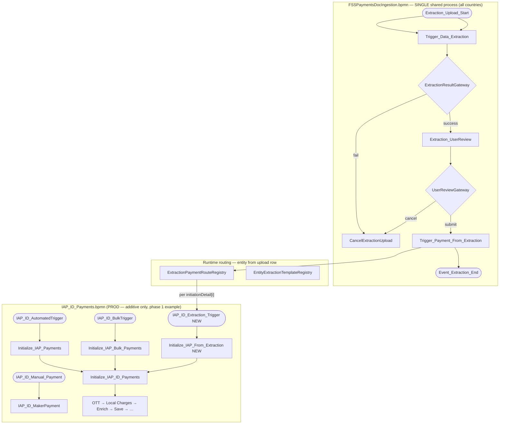
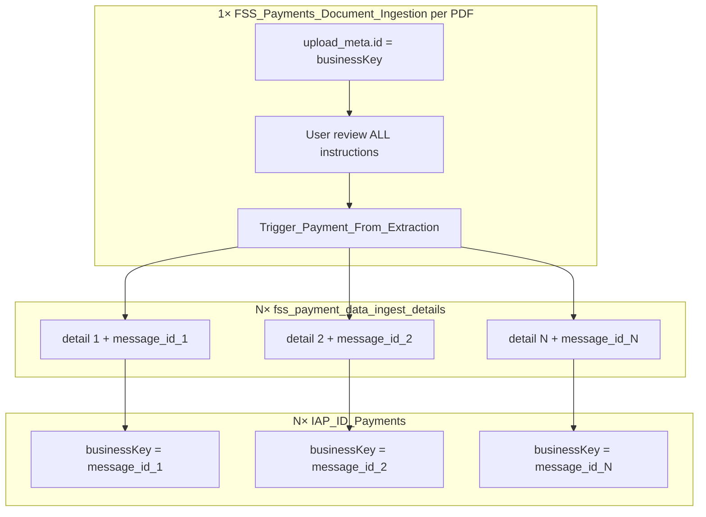
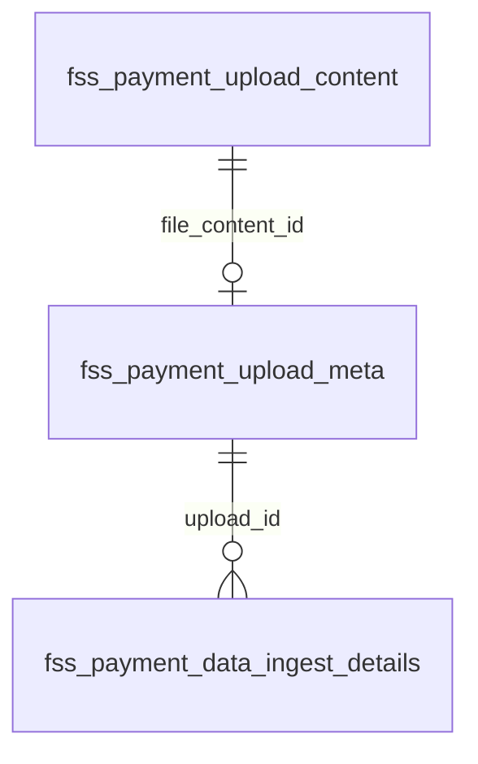

# FSS Payments Document Ingestion — Production-Safe Design (Two BPMN Files)

> **Status:** **Final v6** — entity-only routing, ZIP bulk upload, multi-instruction PDFs; gateway-owned `header`; re-extract removed (`FAILED` terminal); three confidence scopes; file status folded from instruction statuses (see [README.md](./README.md))  
> **Created:** 2026-07-30 · **Finalized:** 2026-08-04 · **Updated:** 2026-08-05 (v5 — `entity` replaces `country` as routing key) · **Corrected:** 2026-08-10 (v6)
> **Related:** [README.md](./README.md) · [IDP_LLD.md](./IDP_LLD.md) (implementation LLD — routing §4, structured output §6) · [IDP_UX_Design.md](./IDP_UX_Design.md) · [IDP_API_Reference.md](./IDP_API_Reference.md) · [../ID_payments.md](../ID_payments.md) · [../ID_payments.bpmn](../ID_payments.bpmn) · [FSSPaymentsDocIngestion.bpmn](./FSSPaymentsDocIngestion.bpmn) · [../after_ocr-llm-output.json](../after_ocr-llm-output.json)

---

## 1. Design decision summary

| Topic | Decision |
|-------|----------|
| BPMN strategy | **Two files** linked by Camunda message correlation |
| New file | `FSSPaymentsDocIngestion.bpmn` — upload, OCR/LLM, single user review |
| Prod file | `IAP_ID_Payments.bpmn` — **additive only** (4th message start + one init task + merge) |
| LLM / extraction / human tasks | **Only** in `FSSPaymentsDocIngestion.bpmn` |
| Existing prod triggers | **Unchanged** — automated, bulk, manual |
| Cross-process link | Entity-specific message start on each payment BPMN (e.g. `IAP_ID_Extraction_Trigger` when `entity=ID`) + BPMN text annotations |
| Entity / payment routing | **`ExtractionPaymentRouteRegistry`** + **`EntityExtractionTemplateRegistry`** resolve `entity` → payment message + LLM `templateId` — **not** a BPMN gateway in the ingestion process — see [§2.1](#21-entity--payment-routing-responsibilities) and [IDP_LLD.md §4](./IDP_LLD.md#4-entity-routing--template-config) |
| Handoff implementation | External task `Trigger_Payment_From_Extraction` → registry lookup → **one `startMessageCorrelation` per `initiationDetail`** (see [§6.4](#64-multi-instruction-pdf-fan-out)) |
| Manual payment keying | `IAP_ID_Manual_Payment` stays as-is; document upload is a **separate** process |
| Upload formats | **Single PDF** or **ZIP of PDFs** (bulk upload). Only `.pdf` entries are processed; other ZIP members are ignored |
| Multi-instruction PDF | One PDF may contain **N** payment instructions. LLM returns **`initiationDetail` as an array only**; gateway merges the shared `header` at persist and at handoff |
| Document storage (Phase 1) | **Three tables** — `fss_payment_upload_content` (PDF bytes as `BYTEA`) + `fss_payment_upload_meta` (file metadata) + `fss_payment_data_ingest_details` (per instruction, incl. `retry` / `error_desc`); lazy-fetched; **no** document-service |
| Extraction naming | **`extracted_data`** on `fss_payment_data_ingest_details` — one row per instruction, written once and never reset |
| Retry after failure | **Re-upload, not re-extract.** There is no re-extract endpoint, button, or status edge; `FAILED` is terminal and the maker uploads the document again ([IDP_LLD.md §7.3](./IDP_LLD.md#73-re-extract--dropped-from-v1-the-workaround-is-to-upload-the-document-again)) |
| Header ownership | **The gateway builds `header`**, not the extraction service. The service returns `initiationDetail` only ([§6.3](#63-llm-output-vs-stored-structured_output)) |
| Confidence | **Three scopes, all from the extraction payload** — file (`fss_payment_upload_meta.confidence`), instruction (`confidence_score`), field (inside each `{ Name, Value, Confidence }` triple). The file score is **not** an average of the instruction scores ([§6.3](#63-llm-output-vs-stored-structured_output)) |
| BPMN orchestration (v3+) | **No BPMN messages** inside the ingestion process — extraction result and maker Submit/Cancel are plain exclusive-gateway decisions evaluated when the preceding task completes |

### 1.1 Domain glossary

| Term | Meaning |
|------|---------|
| **Upload (meta)** | `fss_payment_upload_meta` — one row per PDF; `id` = Camunda business key; links to the stored bytes via `file_content_id` |
| **Batch** | Shared `batch_id` on meta for ZIP-derived PDFs |
| **File ID** | One unique business ID `YYENTYXXXXX` per identified PDF — year + Level-1 access code + system sequence |
| **Upload content** | `fss_payment_upload_content` — PDF bytes (lazy-fetched) |
| **Ingest detail** | `fss_payment_data_ingest_details` — one row per instruction: `extracted_data`, `status`, `retry`, `error_desc`, workflow keys |

Camunda passes **`uploadId`** (`fss_payment_upload_meta.id`) only between steps in the ingestion process — not OCR/LLM payloads.

---

## 2. Architecture overview



**Annotation on `IAP_ID_Extraction_Trigger`:**  
*"Triggered from FSS_Payments_Document_Ingestion via Trigger_Payment_From_Extraction when entity=ID (registry resolves message name). One correlation per initiationDetail."*

**Annotation on `Trigger_Payment_From_Extraction`:**  
*"External-task hook only — not an entity-routing BPMN gateway. Handler loads extracted_data, fans out one payment message per initiationDetail[], correlates via ExtractionPaymentRouteRegistry."*

### 2.1 Entity / payment routing responsibilities

`FSSPaymentsDocIngestion.bpmn` **is** a decision engine for **ingestion-internal** flow only (extraction success/fail, user submit/cancel). It is **not** the entity/payment routing decision engine.

> **v5:** `country` and `entity` are the same concept — use **`entity` only** on upload form, DB, Camunda variables, and registry config.

| Layer | Owns entity routing? | Responsibility |
|-------|----------------------|----------------|
| `FSSPaymentsDocIngestion.bpmn` | **No** | Upload → extract → single user review. Gateways: `ExtractionResultGateway`, `UserReviewGateway` only. `Trigger_Payment_From_Extraction` is a **single external-task step** — a hook, not a branching gateway. |
| Entity payment BPMN (e.g. `IAP_ID_Payments.bpmn`) | **Defines entry only** | Declares message start events (`IAP_ID_Extraction_Trigger`, future entity-specific names) and `Initialize_*_From_Extraction` merge into existing enrichment. |
| `ExtractionPaymentRouteRegistry` (gateway config) | **Yes — payment selection** | Maps `entity` from upload row → `messageName` + `processDefinitionKey`. Phase 1: `ID` → `IAP_ID_Extraction_Trigger` / `IAP_ID_Payments`. |
| `EntityExtractionTemplateRegistry` (gateway config) | **Yes — LLM template** | Maps `entity` → `templateId` for `POST /v1/extract`. Phase 1: `ID` → `id-payment-v1`. |
| `EntityHandlerRegistry` + `EntityPaymentMapper` | **Yes — handoff mapping** | Jackson POJO → `Payment` / `PaymentData` per entity — see [LLD §6.3](./IDP_LLD.md#63-jackson-pojo-model--entity-mappers-no-mapget-in-v1). |
| `ExtractionPaymentHandoffHandler` (gateway Java) | **Executes** | On `Trigger_Payment_From_Extraction`: for each instruction, map POJO, save message, `startMessageCorrelation(messageName, businessKey=messageId, ...)`. No per-entity `if` chains in handler code. |

**Principle:** Message names are **declared in entity payment BPMN** (deploy contract). **Which** message and **which** LLM template to use is **selected at runtime** from `entity` via registries. Adding an entity does **not** require changing `FSSPaymentsDocIngestion.bpmn` — only registry rows + entity-specific mapper + BPMN message start on that entity's payment process.

---

## 3. Production safety — what must not change

### 3.1 Existing entry paths (frozen)

| Start event | Message / type | First step | Producer (Java) |
|-------------|----------------|------------|-----------------|
| `IAP_ID_AutomatedTrigger` | Message `IAP_ID_AutomatedTrigger` | `Initialize_IAP_Payments` | `IAPIDPaymentsMessageHandler` |
| `IAP_ID_BulkTrigger` | Message `IAP_ID_BulkTrigger` | `Initialize_IAP_Bulk_Payments` | `FssPaymentsSHNBatchUpload` |
| `IAP_ID_Manual_Payment` | Plain start | `IAP_ID_MakerPayment` | Manual UI / generic start |

**Do not modify:** sequence flows, gateway conditions, task IDs, or external task topics on these paths.

### 3.2 Safe additions to `IAP_ID_Payments.bpmn` only

| Addition | Type | Notes |
|----------|------|-------|
| `IAP_ID_Extraction_Trigger` | Message start event | 4th entry |
| `Initialize_IAP_From_Extraction` | External service task | Topic `Initialize_IAP_From_Extraction` |
| Sequence flow | Start → init → `Initialize_IAP_ID_Payments` | **Add** incoming on `Initialize_IAP_ID_Payments` (3rd incoming, alongside automated + bulk) |
| `Message_IAP_ID_Extraction_Trigger` | BPMN message definition | New unique name |
| Text annotation | On new start | Cross-process documentation |

**Do not:** rename process id `IAP_ID_Payments`, remove existing incomings on `Initialize_IAP_ID_Payments`, or edit gateway condition expressions.

---

## 4. BPMN file 1: `FSSPaymentsDocIngestion.bpmn` (NEW)

### 4.1 Process metadata

| Attribute | Value |
|-----------|-------|
| Process ID | `FSS_Payments_Document_Ingestion` |
| Process name | `FSS Payments Document Ingestion` |
| Executable | `true` |
| Owning module | `51786-workflow-management` |
| Deploy file | `FSSPaymentsDocIngestion.bpmn` (in `final/`) |

### 4.2 Process flow

| Step | BPMN ID | Type | Topic / variable |
|------|---------|------|------------------|
| Start | `Extraction_Upload_Start` | Plain start | REST upload persists file + triggers `startWorkflowProcess` |
| Trigger extraction | `Trigger_Data_Extraction` | External | `Trigger_Data_Extraction` |
| Extraction gateway | `ExtractionResultGateway` | Exclusive | `${extractionStatus=='READY_FOR_REVIEW'}` (default → `CancelExtractionUpload`) |
| User review | `Extraction_UserReview` | User task | `${paymentMaker}` — user edits extracted fields |
| User review gateway | `UserReviewGateway` | Exclusive | `${reviewAction=='SUBMIT'}` (default → `CancelExtractionUpload`) |
| Trigger payment(s) | `Trigger_Payment_From_Extraction` | External | `Trigger_Payment_From_Extraction` |
| End (success) | `Event_Extraction_End` | End event | After all handoffs complete |
| End (fail/cancel) | `CancelExtractionUpload` | End event | Extraction fail or user cancel |

### 4.3 No BPMN messages inside ingestion process

There are **no boundary events and no `bpmn:message` definitions** in this process. `ExtractionResultGateway` and `UserReviewGateway` are evaluated the instant the preceding external/user task completes — the gateway handler completes `Trigger_Data_Extraction` with `extractionStatus`; the user review task is completed via **gateway façade APIs** (`ExtractionUploadActionService`), not direct portal → workflow-management calls.

Extraction service **never** calls Camunda.

### 4.4 How gateway knows extraction is done

| Phase | Extract API | How gateway knows | BPMN |
|-------|-------------|-------------------|------|
| **Phase 1 (recommended)** | `POST /v1/extract` — **synchronous** HTTP | HTTP response = completion; handler persists `structured_output` + completes `Trigger_Data_Extraction` with `extractionStatus` | `ExtractionResultGateway` evaluates immediately |
| Phase 2 (optional) | `202 Accepted` + poll/callback | Async worker completes task when done | Same gateway pattern |

#### `ExtractionTriggerHandler` sequence (Phase 1 sync)

```
1. Load blob; set fss_payment_upload_meta.status=PROCESSING
   (no detail rows exist yet — they are created from the extraction result)
2. POST /v1/extract (sync; gateway read-timeout 15 min, Camunda lock PT15M)
3. On HTTP 200 + valid JSON:
     - LLM returns { "initiationDetail": [ ... ] } only
     - Gateway builds header (§6.3), INSERTs one fss_payment_data_ingest_details row
       per instruction, each born READY_FOR_REVIEW
     - refresh(uploadId) → folds child statuses into meta.status (= READY_FOR_REVIEW)
     - INSERT audit EXTRACT_COMPLETE
     - complete(Trigger_Data_Extraction, extractionStatus=READY_FOR_REVIEW)
4. On HTTP 422 / timeout / invalid JSON:
     - UPDATE meta: status=FAILED, error_desc populated; INSERT audit EXTRACT_FAILED
       (there are no detail rows to update — the failure is file-level by definition)
     - complete(Trigger_Data_Extraction, extractionStatus=FAILED) OR fail external task
```

**Step 1 no longer touches detail rows, and step 4 cannot.** Detail rows are inserted *from* the extraction result, so at step 1 there are none and an extraction that never returns produces none. This is why `PROCESSING` exists only on the file and never on an instruction ([IDP_LLD.md §5.3](./IDP_LLD.md#53-status-lifecycle)) — earlier revisions of this pseudo-code set detail rows to `PROCESSING`, describing rows that do not exist at that point.

**Step 3 writes `meta.status` through the fold, not directly.** `ExtractionUploadAggregateService.refresh` is the only writer of that column, so the file status can never disagree with the rows beneath it — which matters later, when a partially handed-off file has children in different states.

#### Failure & shutdown scenarios (Phase 1)

| Scenario | System state | Recovery |
|----------|--------------|----------|
| Extraction service down / timeout | Meta `PROCESSING`, **no detail rows**; Camunda task not completed | `ExternalTaskHelper` retries; after max → meta `FAILED`. The maker's recourse is a fresh upload — there is no re-extract (§1) |
| Gateway crashes during HTTP call | Camunda lock expires; upload `PROCESSING` | Re-claim task; idempotent via `idp_extraction_audit` / `GET /v1/extract/{extractionId}` |
| Gateway saves DB but complete fails | Rows `READY_FOR_REVIEW`, Camunda stuck before gateway | Reconciliation: re-complete `Trigger_Data_Extraction` with `extractionStatus=READY_FOR_REVIEW` |
| Duplicate handler (lock race) | Two workers same upload | Guard on detail `status`; second worker no-ops or loads existing result |

**Source of truth for UI:** `fss_payment_upload_meta.status` + `fss_payment_data_ingest_details.status` (action trail in `fss_payment_upload_audit`, field-level edit trail in `fss_payment_field_audit`), not Camunda alone.

### 4.5 Timeout configuration (10 min OCR+LLM budget)

See [IDP_LLD.md §7](./IDP_LLD.md#7-error-handling--resilience). Summary:

| Layer | Value | Owner |
|-------|-------|-------|
| OCR + LLM processing budget | **10 min** | idp-extraction-service |
| Inbound `/v1/extract` server timeout | **15 min** | idp-extraction-service |
| Gateway HTTP client read (sync extract) | **15 min** | payment-gateway-service |
| Camunda `Trigger_Data_Extraction` lock | **PT15M** | payment-gateway BPMN / handler |

### 4.6 Java handlers (gateway-service + idp-extraction-service)

| Topic | Service | Handler |
|-------|---------|---------|
| `Trigger_Data_Extraction` | payment-gateway-service | `ExtractionTriggerHandler` |
| `Trigger_Payment_From_Extraction` | payment-gateway-service | `ExtractionPaymentHandoffHandler` |
| OCR + LLM | idp-extraction-service | `POST /v1/extract` only — **no workflow client** |
| `Initialize_IAP_From_Extraction` | payment-gateway-service | `IAPExtractionInitializeHandler` |

### 4.7 Gateway-orchestrated user review actions (`performAction`)

**Problem:** If the portal calls `workflow-management` directly (`setTaskDetails` + `completeCurrentTask`), Camunda advances but `fss_payment_upload_meta`, `fss_payment_data_ingest_details`, and `fss_payment_upload_audit` stay stale — the uploads table shows wrong status and there is no audit trail.

**Solution:** Single gateway endpoint **`POST .../performAction?uploadId={id}`** with body `{ "action": "SUBMIT" | "CANCEL", "remarks": "..." }`, implemented by `ExtractionUploadActionService` (switch / handler map). Optional thin aliases `/submit` and `/cancel` delegate to the same service method.

| UI button | Gateway API | DB + audit (before WFM) | Camunda (server-side) |
|-----------|-------------|-------------------------|------------------------|
| Submit for routing | `POST .../performAction` `{ "action": "SUBMIT" }` | meta → `SUBMITTED`; audit `USER_SUBMIT` | `Extraction_UserReview` + `{reviewAction:'SUBMIT'}` |
| Cancel upload | `POST .../performAction` `{ "action": "CANCEL" }` | meta + details → `CANCELLED`; audit `USER_CANCEL` | `Extraction_UserReview` + `{reviewAction:'CANCEL'}` |

**Auth:** `@PreAuthorize` for **`paymentMaker`** on `performAction` (and aliases if implemented).

**Removed (v8):** `/approve`, `/reject`, and ingestion checker actions — not part of `FSSPaymentsDocIngestion.bpmn`.

On submit, meta becomes `SUBMITTED`; `ExtractionPaymentHandoffHandler` sets `TRIGGERING_PAYMENT` while routing, then `COMPLETED` when all `IAP_ID` correlations succeed. Per-detail rows follow the same vocabulary; `message_id` is saved during `TRIGGERING_PAYMENT`. On WFM failure after DB commit, gateway rolls back or leaves status unchanged and returns `502` — see API Reference §3.3.

---

## 5. Upload: single PDF and ZIP bulk

### 5.1 Accepted file types

| Upload | `Content-Type` / extension | Behaviour |
|--------|---------------------------|-----------|
| Single PDF | `application/pdf`, `.pdf` | One `fss_payment_upload_meta` row + one `FSS_Payments_Document_Ingestion` instance |
| ZIP bulk | `application/zip`, `application/x-zip-compressed`, `.zip` | Unpack; **only** `.pdf` entries become uploads; all other entries ignored |

**Rules:**

- ZIP is a **bulk upload convenience** — each PDF inside is a **separate** upload row and workflow instance.
- Non-PDF files inside a ZIP (`.xlsx`, `.txt`, folders, `__MACOSX`, etc.) are **skipped** without failing the whole batch.
- ZIP with **zero** PDF entries → `400 Bad Request` ("No PDF files found in archive").
- All PDFs from one ZIP share the same `batch_id` (UUIDv7 generated at upload time).
- Every identified PDF receives its own File ID `YYENTYXXXXX`: `YY` from the upload timestamp year, `ENTY` from the user's Level-1 access (`IDJY` for Indonesia, configuration-driven for later rollouts), `XXXXX` from a sequence scoped to that `(year, ENTY)` and restarted each year.
- Sort all identified PDFs by file upload timestamp ascending and allocate sequence values in that order. Equal timestamps use normalized ZIP source path, then discovery order, as deterministic tie-breakers.
- The sequence is padded to five digits but not limited to five: after `99999` it continues at `100000`, so no rollout ever exhausts the format ([LLD §5.1.1](./IDP_LLD.md#511-file-id-generation)).
- File ID—not file name—is the per-file identity. PDFs with the same base name in different ZIP folders receive different File IDs.
- Only extracted PDF content is persisted in `fss_payment_upload_content` (referenced by meta `file_content_id`).

### 5.2 REST upload response

**Single PDF** — `201 Created`:

```json
{
  "uploadId": "a1b2c3d4-...",
  "fileId": "26IDJY00001",
  "uploadStatus": "PROCESSING"
}
```

**ZIP bulk** — `201 Created`:

```json
{
  "batchId": "batch-uuid",
  "uploads": [
    { "uploadId": "...", "fileId": "26IDJY00002", "fileName": "doc1.pdf", "sourcePath": "folder-a/doc1.pdf", "uploadStatus": "PROCESSING" },
    { "uploadId": "...", "fileId": "26IDJY00003", "fileName": "doc1.pdf", "sourcePath": "folder-b/doc1.pdf", "uploadStatus": "PROCESSING" }
  ],
  "skippedEntries": [
    { "path": "readme.txt", "reason": "NOT_PDF" },
    { "path": "summary.xlsx", "reason": "NOT_PDF" }
  ]
}
```

Each item in `uploads` appears as its own row in the uploads table (filterable by `batchId`).

**The id field is `uploadId` in both shapes.** An earlier revision named it `extractionUploadId` on the single-PDF response while the ZIP response already used `uploadId`, so a client had to branch on the upload type to find the same value. `extractionUploadId` survives only as the **Camunda variable** name (§6.2) — it is not a REST field on any endpoint.

---

## 6. Message contract (cross-process API)

### 6.1 Handoff message (phase 1 — Indonesia)

| Attribute | Value |
|-----------|-------|
| Message name | `IAP_ID_Extraction_Trigger` (from registry when `entity=ID`) |
| Producer | `ExtractionPaymentHandoffHandler` on external task `Trigger_Payment_From_Extraction` |
| Consumer | Message start `IAP_ID_Extraction_Trigger` in `IAP_ID_Payments` |
| Correlation key | `businessKey = messageId` (per instruction — **not** `extractionUploadId`) |
| Mechanism | `registry.resolve(entity)` then `startMessageCorrelation(messageName, businessKey=messageId, ...)` |

### 6.2 Variables passed at correlation (per instruction)

| Variable | Type | Value / source |
|----------|------|----------------|
| `extractionUploadId` | String | Upload row PK |
| `instructionIndex` | Integer | 0-based index in `initiationDetail[]` |
| `messageId` | String | Pre-created `fss_services_message` row for this instruction |
| `extractionApproved` | Boolean | `true` |
| `isApproved` | Boolean | `true` — enables bulk-like skip of payment checker when validation clean |
| `isRepaired` | Boolean | `false` |
| `channel` | String | `DOC_EXTRACTION` |
| `paymentMaker` | String | From upload / config |
| `paymentChecker` | String | From upload / config |

### 6.3 LLM output vs stored `structured_output`

The extraction service LLM step returns **only** the instruction list:

```json
{
  "initiationDetail": [
    { "TxRef": "3897122-001", "Confidence1": "97.23", "TransactionDetails": [ ... ], "DebitDetails": { ... }, "CreditDetails": { ... } },
    { "TxRef": "3897122-002", "Confidence1": "95.10", "TransactionDetails": [ ... ], "DebitDetails": { ... }, "CreditDetails": { ... } }
  ]
}
```

The **header is shared** across all instructions in the same PDF, and the **gateway** builds it — the extraction service never returns one. Every value in it is data the gateway already owns (upload metadata, entity, document ids) or derives from the instruction array it just received, so asking the model to reproduce it would invite hallucinated values in fields that are authoritative elsewhere, with no way to tell a wrong header from a right one. `ExtractionTriggerHandler` builds it once and merges before persisting:

```json
{
  "header": {
    "uniqueId": "3897122",
    "country": "SS_ID_DOC",
    "TotInst": "2",
    "InstructionSummary": [ { "DeptId": "FundServices", "ProcessId": "Cash", "SubProcessId": "CI", "NoInst1": "2" } ],
    "doc_ids": [ "..." ]
  },
  "initiationDetail": [ /* array from LLM */ ]
}
```

The merged shape above is a **transient, document-scoped intermediate** that exists only inside `ExtractionTriggerHandler`. It is never stored as one blob. The handler immediately fans it out into one row per instruction, each storing a **singular** `initiationDetail`:

```json
{ "header": { "…identical in all N rows…" }, "initiationDetail": { "…one element…" } }
```

- **`header.TotInst` cannot disagree with `initiationDetail.length`, because the gateway computes it from that array rather than reading it from the model.** Earlier drafts treated `TotInst` as an LLM-produced string and specified a mismatch warning; with the header moved to the gateway there is no second source to reconcile, and the reconciliation rule is retired. The same applies to `InstructionSummary` counts, which are rolled up from the persisted rows — see [IDP_LLD.md §6.1b](./IDP_LLD.md#61b-the-gateway-builds-the-header).
- Single-instruction PDFs use an array of length **1** (the fixture [after_ocr-llm-output.json](../after_ocr-llm-output.json) shows the legacy single-object shape; production contract is **always an array**). *N*=1 is not a special case in code.
- The header is copied into every row deliberately, so each row is self-contained. It is therefore **read-only in review** — editing it on one row would desync the other *N*−1.
- **Confidence exists at three scopes**: document (`fss_payment_upload_meta.confidence`), instruction (`Confidence1` → `fss_payment_data_ingest_details.confidence_score`), and field (the `Confidence` in each `{ Name, Value, Confidence }` triple, never a column). See [IDP_LLD.md §6.4](./IDP_LLD.md#64-confidence--three-scopes-three-homes).
- The review modal shows the document header once and **one section per instruction row**, so the user sees the equivalent of `{ header, initiationDetail[] }` even though it is assembled from *N* rows (see [IDP_UX_Design.md](./IDP_UX_Design.md)). Each edit targets a single row, but **Save draft** is a file-level button, so one request carries every dirty row (see [IDP_API_Reference.md §2.5](./IDP_API_Reference.md#25-post-apifsspaymentsgatewayv1extraction-uploadsfieldsuploadidid)).

### 6.4 Multi-instruction PDF fan-out

**Application pattern (two processes, N payment instances):**



**Do not add a 4th table** — `fss_payment_data_ingest_details` is both the extraction review record **and** the handoff tracker. `message_id` is **mandatory** (not deprecated) because `ID_payments.bpmn` requires `fss_services_message` before enrichment.

Handoff loop:

```
FOR each fss_payment_data_ingest_details WHERE upload_id = ? AND message_id IS NULL:
  1. payload = detail.extracted_data
  2. Payment/PaymentData = map(payload)
  3. message_id = MessageService.save(channel=DOC_EXTRACTION)   -- REQUIRED
  4. UPDATE detail: message_id, payment_workflow_key, handoff_message_name, status=TRIGGERING_PAYMENT
  5. startMessageCorrelation(IAP_ID_Extraction_Trigger, businessKey=message_id)
  6. UPDATE detail: status=COMPLETED
AFTER each row, and again at the end: refresh(uploadId) folds child statuses into meta.status
THEN: complete Trigger_Payment_From_Extraction
```

On failure: set `error_desc`, increment `retry` on failed detail only; do not complete external task.

**`meta.status` is never assigned `COMPLETED` here — it is folded.** Handing off eighteen instructions means eighteen row transitions, and the file is only `COMPLETED` once the last one lands; until then the fold yields `TRIGGERING_PAYMENT` because that state outranks `COMPLETED` ([IDP_LLD.md §5.3.2](./IDP_LLD.md#532-the-fold--how-metastatus-is-derived-from-its-children)). Writing the file status directly at the end of the loop is what would let a crash halfway through leave a file reading `COMPLETED` over rows that never handed off — the exact state reconciliation cannot distinguish from success.

`retry` in this loop is the **only** thing that increments it: it counts handoff attempts, never extraction attempts, because extraction is never retried at the application level (§1).

**UI:** uploads table = 1 row per PDF; detail modal = master–detail for 10–20 instructions (see [IDP_UX_Design.md §4](./IDP_UX_Design.md#4-detail-modal--multi-instruction-review-1020-per-file)).

### 6.5 Idempotency

- Before handoff loop: abort if any `fss_payment_data_ingest_details` row for `upload_id` already has `message_id` set
- On partial failure mid-loop: do **not** complete `Trigger_Payment_From_Extraction`; upload stays `SUBMITTED` or `TRIGGERING_PAYMENT`; ops alert; retry is safe because completed handoffs are skipped by `message_id` guard per row
- Double user submit → no duplicate payment instances

---

## 7. BPMN file 2: `IAP_ID_Payments.bpmn` (PROD — additive diff)

### 7.1 Before vs after entry paths

| # | Path | Before | After |
|---|------|--------|-------|
| 1 | Automated | `IAP_ID_AutomatedTrigger` → init → enrichment | **Same** |
| 2 | Bulk | `IAP_ID_BulkTrigger` → bulk init → enrichment | **Same** |
| 3 | Manual keying | `IAP_ID_Manual_Payment` → maker | **Same** |
| 4 | Document extraction | — | `IAP_ID_Extraction_Trigger` → `Initialize_IAP_From_Extraction` → enrichment (**N instances per multi-instruction upload**) |

### 7.2 New external task on payment BPMN

| Task | Topic | Handler | Responsibility |
|------|-------|---------|----------------|
| `Initialize_IAP_From_Extraction` | `Initialize_IAP_From_Extraction` | `IAPExtractionInitializeHandler` | Load pre-created `fss_services_message` by `messageId` (business key); confirm enriched payload; flow continues to `Initialize_IAP_ID_Payments` |

Payment/PaymentData mapping happens in `ExtractionPaymentHandoffHandler` **before** correlation — see [IDP_LLD.md §6.3](./IDP_LLD.md#63-jackson-pojo-model--entity-mappers-no-mapget-in-v1).

---

## 8. Extraction review vs payment maker-checker

| Stage | Process | User tasks | Purpose |
|-------|---------|------------|---------|
| Extraction review | `FSS_Payments_Document_Ingestion` | `Extraction_UserReview` | User validates/edits OCR/LLM fields for **all** instructions, then submits for routing |
| Payment QC | `IAP_ID_Payments` | `IAP_ID_MakerPayment`, `IAP_ID_CheckerPayment` | Payment repair / banking approval **per instruction** |

**Routing after user submits for routing:**

- `Trigger_Payment_From_Extraction` correlates `IAP_ID_Extraction_Trigger` per instruction.
- Set `isApproved=true` at each handoff correlation when appropriate.
- After `Save_Payment_Transaction`, existing `PaymentValidationGateway` may **skip payment checker** when validation is clean.
- **Do not** reuse `IAP_ID_MakerPayment` for extraction review.

---

## 9. Manual trigger clarification

| Concept | BPMN | UI action | Change |
|---------|------|-----------|--------|
| Manual payment keying | `IAP_ID_Manual_Payment` | User keys payment fields | **No change** |
| Document upload | `FSS_Payments_Document_Ingestion` start | User uploads PDF or ZIP | **New** — starts ingestion process, not manual payment |

Upload REST must call `startWorkflowProcess(processKey=FSS_Payments_Document_Ingestion)`, **not** `IAP_ID_Manual_Payment`.

---

## 10. Database design (summary)

Full PostgreSQL DDL in [IDP_LLD.md §5](./IDP_LLD.md#5-database-design-postgresql-manual-sql-no-liquibase).

**Surrogate keys** owned by this feature are native `UUID` columns holding **UUIDv7** values — time-ordered, so they index like a sequence without being guessable in the REST API. Keys owned by other systems (`message_id`, `payment_workflow_key`, `extraction_id`) keep their existing types. See [IDP_LLD.md §5.1.3](./IDP_LLD.md#513-surrogate-keys--native-uuid-generated-as-uuidv7).

### 10.1 Three-table model

| Table | Granularity | Role |
|-------|-------------|------|
| `fss_payment_upload_content` | Per file | PDF bytes only (`id`, `file_content BYTEA`) |
| `fss_payment_upload_meta` | Per PDF | File metadata, `status`, `file_content_id`, upload audit (`uploaded_by`, `uploaded_at`, `processed_at`); optional `batch_id` for ZIP |
| `fss_payment_data_ingest_details` | Per instruction | One row per `initiationDetail` — `extracted_data`, `status`, `confidence_score`, workflow keys, **`retry`**, **`error_desc`** |



### 10.2 `fss_payment_data_ingest_details` (key columns)

| Column | Notes |
|--------|-------|
| `id` | PK — native `UUID`, generated as UUIDv7 |
| `upload_id` | FK → `fss_payment_upload_meta.id`; **also** the FSS ingestion process business key — there is no separate `extraction_workflow_key` column |
| `instruction_index` | 0-based; unique with `upload_id` |
| `status` | Per-instruction lifecycle. Same vocabulary as meta **minus** `UPLOADED` and `PROCESSING` — rows are not created until extraction returns, so those two states exist only on the file. `fss_payment_upload_meta.status` is a **fold** over these values, not an independent column ([IDP_LLD.md §5.3.2](./IDP_LLD.md#532-the-fold--how-metastatus-is-derived-from-its-children)) |
| `extracted_data` | `TEXT` — `{ header, initiationDetail }` per instruction |
| `confidence_score` | From `Confidence1` |
| `message_id` | **Mandatory** after handoff — FK to `fss_services_message`; IAP business key |
| `payment_workflow_key` | = `message_id` |
| `handoff_message_name` | Which registry message was resolved at correlation |
| `trn_typ` | Transaction type — the **only** business field promoted to a column, used to group instructions. All other display fields are parsed from `extracted_data` on read |
| `retry` | Default 0; incremented on a **failed payment handoff** only. With re-extract removed it is never an extraction-attempt counter, and nothing resets it |
| `error_desc` | Failure reason. **Never cleared** — `FAILED` is terminal, so the reason stays as the record of what happened |

### 10.3 Existing tables (usage only)

| Table | Usage |
|-------|-------|
| `fss_services_message` | `channel=DOC_EXTRACTION`; one row **per ingest detail** at handoff |
| `fss_payment_txns` | No schema change |

---

## 11. JSON → Payment mapping (summary)

Handler: `ExtractionStructuredOutputMapper` (invoked from `ExtractionPaymentHandoffHandler` per instruction)

- Business fields (`TrnTyp`, `ClntNm`, `ValDt`, …) live inside `TransactionDetails[]` as `{ Name, Value, Confidence }` — **not** as direct `initiationDetail` properties.
- Debit/credit legs: `DebitDetails.details[].data[]`, `CreditDetails.details[].data[]`.
- `header.doc_ids[0]` → document linkage; `header.uniqueId` → external ref candidate.

Full catalog: [IDP_LLD.md §6.2](./IDP_LLD.md#62-structuredoutput-shape).

---

## 12. UI screens (planned)

| Screen | Process task | Actions |
|--------|--------------|---------|
| Upload tab | Starts `FSS_Payments_Document_Ingestion` | Upload PDF **or ZIP**; Cancel |
| Uploads table | — | One row per PDF; `batch_id` filter for ZIP batches; poll while `PROCESSING` |
| Detail modal | `Extraction_UserReview` | Review all instructions (tabs/accordion); Save draft; Submit for routing; Cancel |
| Payment detail | `IAP_ID_Payments` | Existing — one link per handoff row |

---

## 13. Deployment plan

| Phase | Deliverable | Prod risk |
|-------|-------------|-----------|
| P1 | DDL `fss_payment_upload_*` + `fss_payment_data_ingest_details` | None |
| P2 | `FSSPaymentsDocIngestion.bpmn` + gateway upload/extract handlers | None on IAP |
| P3 | Additive deploy `IAP_ID_Payments.bpmn` v(N+1) | Old paths must regression-pass |
| P4 | Handoff handler + `IAPExtractionInitializeHandler` | None until uploads start |
| P5 | Portal upload tab | Controlled rollout |

**Deploy order:** tables → ingestion BPMN + gateway handlers → payment BPMN additive version → UI.

**Rollback:** disable the upload route with **`extraction.upload.enabled=false`** — the single canonical kill-switch key ([IDP_LLD.md §4.1](./IDP_LLD.md#41-applicationyml-configuration)); the `extraction-upload.enabled` spelling used in earlier drafts is retired. Because it is read at startup via `@ConditionalOnProperty`, the route disappears rather than returning errors, and the change needs a restart. IAP automated/bulk/manual flows are unaffected.

---

## 14. Regression test matrix

| # | Scenario | Expected | Must match prod |
|---|----------|----------|-----------------|
| 1 | Automated (mock JMS) | `Initialize_IAP_Payments` | Yes |
| 2 | Bulk upload ID | Bulk init → `isApproved=true` path | Yes |
| 3 | Manual start | `IAP_ID_MakerPayment` directly | Yes |
| 4 | Single PDF → submit → handoff | 1× `Initialize_IAP_From_Extraction` | New |
| 5 | Multi-instruction PDF (N=3) → submit | 3× `IAP_ID_Extraction_Trigger` correlated | New |
| 6 | ZIP with 2 PDFs | 2 upload rows, 2 ingestion instances, shared `batch_id` | New |
| 7 | ZIP with no PDFs | `400` error | New |
| 8 | ZIP with PDF + non-PDF | PDFs processed; others in `skippedEntries` | New |
| 9 | Automated `TO_BE_REPAIR` | `IAP_ID_MakerPayment` | Yes |
| 10 | Double submit | No duplicate payment instances | New |

---

## 15. Risk register

| Risk | Mitigation |
|------|------------|
| Editing shared gateway conditions | Freeze prod paths; code review BPMN diff |
| Message name collision | Unique `IAP_ID_Extraction_Trigger` only for extraction handoff |
| Duplicate payment instances | Per-detail `message_id` guard on `fss_payment_data_ingest_details` |
| Partial multi-instruction handoff | Transactional loop with skip-on-existing; do not complete external task until all succeed or explicit partial policy |
| ZIP bomb / oversized archive | Max ZIP size + max extracted PDF count + per-PDF size limits |
| Variable type mismatch | Match existing `IAP_ID_Payments` patterns (`isApproved` boolean) |

---

## 16. Implementation checklist

### BPMN

- [ ] Deploy `FSSPaymentsDocIngestion.bpmn` in `51786-workflow-management`
- [ ] Additive change to `IAP_ID_Payments.bpmn` (4th start + `Initialize_IAP_From_Extraction` + merge)
- [ ] Verify `Initialize_IAP_ID_Payments` has 3 incomings, none removed

### Java

- [ ] `ExtractionUploadController` — PDF + ZIP unpack; persists rows; starts ingestion process only
- [ ] `ExtractionTriggerHandler` — merge header + `initiationDetail[]` from LLM
- [ ] `ExtractionPaymentHandoffHandler` — fan-out loop per instruction
- [ ] `ExtractionPaymentRouteRegistry` — config: `entity=ID` → `IAP_ID_Extraction_Trigger`
- [ ] `EntityExtractionTemplateRegistry` — config: `entity=ID` → `id-payment-v1`
- [ ] `IAPExtractionInitializeHandler` — topic `Initialize_IAP_From_Extraction`
- [ ] Confirm no changes to `IAPIDPaymentsMessageHandler`, `FssPaymentsSHNBatchUpload`

### Database

- [ ] `fss_payment_upload_content` + `fss_payment_upload_meta` + `fss_payment_data_ingest_details` (incl. `retry`, `error_desc`)
- [ ] PostgreSQL DDL applied (`V1`–`V5`); confirm no entity uses `@Lob` (it maps to `oid`, not `BYTEA`/`TEXT`)

### UI

- [ ] Upload accepts `.pdf` and `.zip`
- [ ] Table shows batch grouping; modal supports multi-instruction review
- [ ] Payment links per handoff row

---

## 17. Document history

| Date | Change |
|------|--------|
| 2026-07-30 | Initial version — two BPMN files, prod-safe additive IAP change |
| 2026-08-02 | Phase 1 sync extract; country routing registry; moved to `final/` |
| 2026-08-04 | **v5** — Three-table schema (`fss_payment_upload_*`, `fss_payment_data_ingest_details`); `retry` + `error_desc` on details |
| 2026-08-10 | **v6** — Header ownership moved to the gateway, so `TotInst` is computed from `initiationDetail.size()` and the compare-and-warn reconciliation rule is retired. Re-extract removed: `FAILED` is terminal, `retry` counts payment-handoff attempts only, `error_desc` is never cleared, and retry means re-uploading the document. Confidence documented as three payload-sourced scopes rather than a computed average. Instruction `status` restricted to the six reachable values, with `fss_payment_upload_meta.status` defined as a fold over them. Kill-switch spelling corrected to `extraction.upload.enabled` |

---

## 18. Open questions

- Max PDF count per ZIP and max uncompressed size?
- ~~Partial handoff policy if instruction 2 of 3 fails to correlate?~~ **Answered:** the file folds to `FAILED` while the instructions that already correlated stay `COMPLETED` — successful payments are never rolled back, and the file status makes it visible that something needs attention ([IDP_LLD.md §5.3.2](./IDP_LLD.md#532-the-fold--how-metastatus-is-derived-from-its-children) rule B1).
- UI layout for reviewing 5+ instructions in one modal?
- PII retention policy for OCR/LLM JSON payloads?
- SSTM feedback behavior for `channel=DOC_EXTRACTION` payments?
