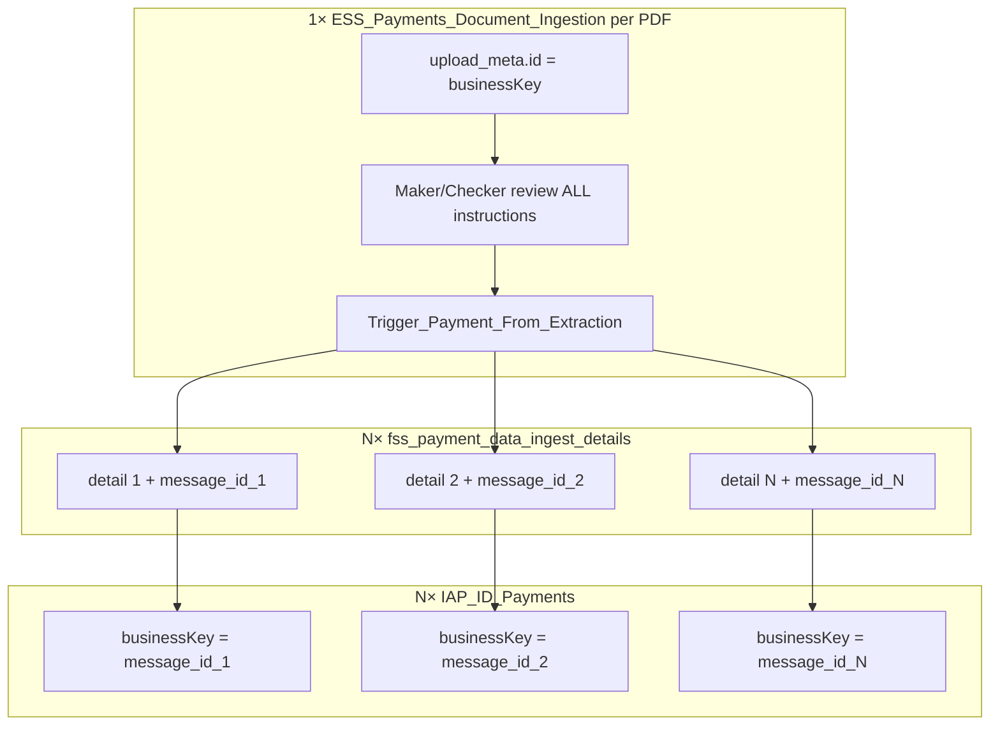
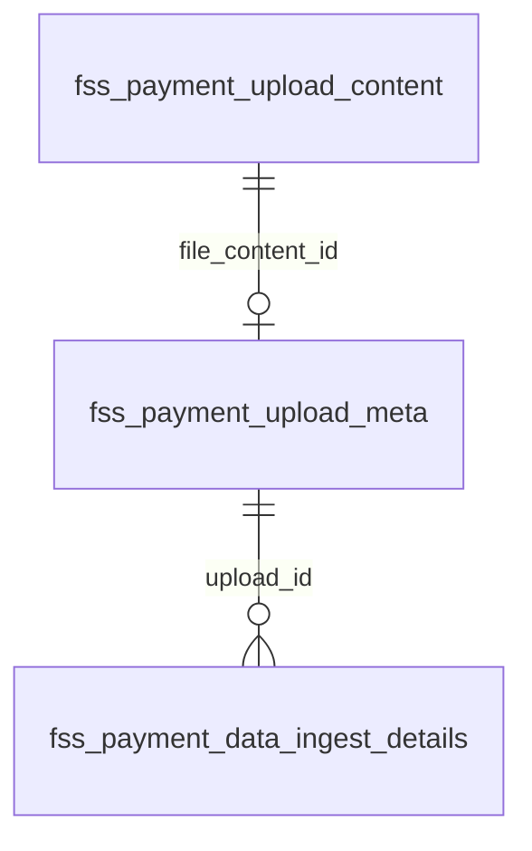

# ESS Payments Document Ingestion — Production-Safe Design (Two BPMN Files)

> **Status:** **Final v5** — entity-only routing, ZIP bulk upload, multi-instruction PDFs (see [README.md](./README.md))  
> **Created:** 2026-07-30 · **Finalized:** 2026-08-04 · **Updated:** 2026-08-05 (v5 — `entity` replaces `country` as routing key)
> **Related:** [README.md](./README.md) · [IDP_LLD.md](./IDP_LLD.md) (implementation LLD — routing §4, structured output §6) · [IDP_UX_Design.md](./IDP_UX_Design.md) · [IDP_API_Reference.md](./IDP_API_Reference.md) · [../ID_payments.md](../ID_payments.md) · [../ID_payments.bpmn](../ID_payments.bpmn) · [ESS_Payments_Document_Ingestion.bpmn](./ESS_Payments_Document_Ingestion.bpmn) · [../after_ocr-llm-output.json](../after_ocr-llm-output.json)

---

## 1. Design decision summary

| Topic | Decision |
|-------|----------|
| BPMN strategy | **Two files** linked by Camunda message correlation |
| New file | `ESS_Payments_Document_Ingestion.bpmn` — upload, OCR/LLM, extraction maker/checker |
| Prod file | `IAP_ID_Payments.bpmn` — **additive only** (4th message start + one init task + merge) |
| LLM / extraction / human tasks | **Only** in `ESS_Payments_Document_Ingestion.bpmn` |
| Existing prod triggers | **Unchanged** — automated, bulk, manual |
| Cross-process link | Entity-specific message start on each payment BPMN (e.g. `IAP_ID_Extraction_Trigger` when `entity=ID`) + BPMN text annotations |
| Entity / payment routing | **`ExtractionPaymentRouteRegistry`** + **`EntityExtractionTemplateRegistry`** resolve `entity` → payment message + LLM `templateId` — **not** a BPMN gateway in the ingestion process — see [§2.1](#21-entity--payment-routing-responsibilities) and [IDP_LLD.md §4](./IDP_LLD.md#4-entity-routing--template-config) |
| Handoff implementation | External task `Trigger_Payment_From_Extraction` → registry lookup → **one `startMessageCorrelation` per `initiationDetail`** (see [§6.4](#64-multi-instruction-pdf-fan-out)) |
| Manual payment keying | `IAP_ID_Manual_Payment` stays as-is; document upload is a **separate** process |
| Upload formats | **Single PDF** or **ZIP of PDFs** (bulk upload). Only `.pdf` entries are processed; other ZIP members are ignored |
| Multi-instruction PDF | One PDF may contain **N** payment instructions. LLM returns **`initiationDetail` as an array only**; gateway merges the shared `header` at persist and at handoff |
| Document storage (Phase 1) | **Three tables** — `fss_payment_upload_content` (BLOB) + `fss_payment_upload_meta` (file metadata) + `fss_payment_data_ingest_details` (per instruction, incl. `retry` / `error_desc`); lazy-fetched; **no** document-service |
| Extraction naming | **`extracted_data`** on `fss_payment_data_ingest_details` — one row per instruction; re-extract resets detail rows in place |
| Confidence | Per-field `Confidence` in LLM JSON (strings); `overall_confidence` on workflow mapping row |
| BPMN orchestration (v3+) | **No BPMN messages** inside the ingestion process — extraction result and maker Submit/Cancel are plain exclusive-gateway decisions evaluated when the preceding task completes |

### 1.1 Domain glossary

| Term | Meaning |
|------|---------|
| **Upload (meta)** | `fss_payment_upload_meta` — one row per PDF; `id` = Camunda business key; links to BLOB via `file_content_id` |
| **Batch** | Shared `batch_id` on meta for ZIP-derived PDFs |
| **Upload content** | `fss_payment_upload_content` — PDF bytes (lazy-fetched) |
| **Ingest detail** | `fss_payment_data_ingest_details` — one row per instruction: `extracted_data`, `status`, `retry`, `error_desc`, workflow keys |

Camunda passes **`uploadId`** (`fss_payment_upload_meta.id`) only between steps in the ingestion process — not OCR/LLM payloads.

---

## 2. Architecture overview


**Annotation on `IAP_ID_Extraction_Trigger`:**  
*"Triggered from ESS_Payments_Document_Ingestion via Trigger_Payment_From_Extraction when entity=ID (registry resolves message name). One correlation per initiationDetail."*

**Annotation on `Trigger_Payment_From_Extraction`:**  
*"External-task hook only — not an entity-routing BPMN gateway. Handler loads extracted_data, fans out one payment message per initiationDetail[], correlates via ExtractionPaymentRouteRegistry."*

### 2.1 Entity / payment routing responsibilities

`ESS_Payments_Document_Ingestion.bpmn` **is** a decision engine for **ingestion-internal** flow only (extraction success/fail, checker approve/reject, maker submit/cancel). It is **not** the entity/payment routing decision engine.

> **v5:** `country` and `entity` are the same concept — use **`entity` only** on upload form, DB, Camunda variables, and registry config.

| Layer | Owns entity routing? | Responsibility |
|-------|----------------------|----------------|
| `ESS_Payments_Document_Ingestion.bpmn` | **No** | Upload → extract → extraction maker/checker. Gateways: `ExtractionResultGateway`, `MakerDecisionGateway`, `ExtractionCheckerGateway` only. `Trigger_Payment_From_Extraction` is a **single external-task step** — a hook, not a branching gateway. |
| Entity payment BPMN (e.g. `IAP_ID_Payments.bpmn`) | **Defines entry only** | Declares message start events (`IAP_ID_Extraction_Trigger`, future entity-specific names) and `Initialize_*_From_Extraction` merge into existing enrichment. |
| `ExtractionPaymentRouteRegistry` (gateway config) | **Yes — payment selection** | Maps `entity` from upload row → `messageName` + `processDefinitionKey`. Phase 1: `ID` → `IAP_ID_Extraction_Trigger` / `IAP_ID_Payments`. |
| `EntityExtractionTemplateRegistry` (gateway config) | **Yes — LLM template** | Maps `entity` → `templateId` for `POST /v1/extract`. Phase 1: `ID` → `id-payment-v1`. |
| `EntityHandlerRegistry` + `EntityPaymentMapper` | **Yes — handoff mapping** | Jackson POJO → `Payment` / `PaymentData` per entity — see [LLD §6.3](./IDP_LLD.md#63-jackson-pojo-model--entity-mappers-no-mapget-in-v1). |
| `ExtractionPaymentHandoffHandler` (gateway Java) | **Executes** | On `Trigger_Payment_From_Extraction`: for each instruction, map POJO, save message, `startMessageCorrelation(messageName, businessKey=messageId, ...)`. No per-entity `if` chains in handler code. |

**Principle:** Message names are **declared in entity payment BPMN** (deploy contract). **Which** message and **which** LLM template to use is **selected at runtime** from `entity` via registries. Adding an entity does **not** require changing `ESS_Payments_Document_Ingestion.bpmn` — only registry rows + entity-specific mapper + BPMN message start on that entity's payment process.

---

## 3. Production safety — what must not change

### 3.1 Existing entry paths (frozen)

| Start event | Message / type | First step | Producer (Java) |
|-------------|----------------|------------|-----------------|
| `IAP_ID_AutomatedTrigger` | Message `IAP_ID_AutomatedTrigger` | `Initialize_IAP_Payments` | `IAPIDPaymentsMessageHandler` |
| `IAP_ID_BulkTrigger` | Message `IAP_ID_BulkTrigger` | `Initialize_IAP_Bulk_Payments` | `FssPaymentsSHNBatchUpload` |
| `IAP_ID_Manual_Payment` | Plain start | `IAP_ID_MakerPayment` | Manual UI / generic start |

**Do not modify:** sequence flows, gateway conditions, task IDs, or external task topics on these paths.

### 3.2 Safe additions to `IAP_ID_Payments.bpmn` only

| Addition | Type | Notes |
|----------|------|-------|
| `IAP_ID_Extraction_Trigger` | Message start event | 4th entry |
| `Initialize_IAP_From_Extraction` | External service task | Topic `Initialize_IAP_From_Extraction` |
| Sequence flow | Start → init → `Initialize_IAP_ID_Payments` | **Add** incoming on `Initialize_IAP_ID_Payments` (3rd incoming, alongside automated + bulk) |
| `Message_IAP_ID_Extraction_Trigger` | BPMN message definition | New unique name |
| Text annotation | On new start | Cross-process documentation |

**Do not:** rename process id `IAP_ID_Payments`, remove existing incomings on `Initialize_IAP_ID_Payments`, or edit gateway condition expressions.

---

## 4. BPMN file 1: `ESS_Payments_Document_Ingestion.bpmn` (NEW)

### 4.1 Process metadata

| Attribute | Value |
|-----------|-------|
| Process ID | `ESS_Payments_Document_Ingestion` |
| Process name | `ESS Payments Document Ingestion` |
| Executable | `true` |
| Owning module | `51786-workflow-management` |
| Deploy file | `ESS_Payments_Document_Ingestion.bpmn` (in `final/`) |

### 4.2 Process flow

| Step | BPMN ID | Type | Topic / variable |
|------|---------|------|------------------|
| Start | `Extraction_Upload_Start` | Plain start | REST upload persists file + triggers `startWorkflowProcess` |
| Trigger extraction | `Trigger_Data_Extraction` | External | `Trigger_Data_Extraction` |
| Extraction gateway | `ExtractionResultGateway` | Exclusive | `${extractionStatus=='READY_FOR_REVIEW'}` (default → `CancelExtractionUpload`) |
| Maker review | `Extraction_MakerReview` | User task | `${paymentMaker}` |
| Maker gateway | `MakerDecisionGateway` | Exclusive | `${makerAction=='SUBMIT'}` (default → `CancelExtractionUpload`) |
| Checker review | `Extraction_CheckerReview` | User task | `${paymentChecker}` |
| Checker gateway | `ExtractionCheckerGateway` | Exclusive | `${extractionApproved==true}` → handoff |
| Trigger payment(s) | `Trigger_Payment_From_Extraction` | External | `Trigger_Payment_From_Extraction` |
| End (success) | `Event_Extraction_End` | End event | After all handoffs complete |
| End (fail/cancel) | `CancelExtractionUpload` | End event | Extraction fail or maker cancel |

### 4.3 No BPMN messages inside ingestion process (v3+)

There are **no boundary events and no `bpmn:message` definitions** in this process. `ExtractionResultGateway` and `MakerDecisionGateway` are evaluated the instant the preceding external/user task completes — the gateway handler completes `Trigger_Data_Extraction` with `extractionStatus`; maker/checker tasks are completed via **gateway façade APIs** (`ExtractionUploadActionService`), not direct portal → workflow-management calls.

Extraction service **never** calls Camunda.

### 4.4 How gateway knows extraction is done

| Phase | Extract API | How gateway knows | BPMN |
|-------|-------------|-------------------|------|
| **Phase 1 (recommended)** | `POST /v1/extract` — **synchronous** HTTP | HTTP response = completion; handler persists `structured_output` + completes `Trigger_Data_Extraction` with `extractionStatus` | `ExtractionResultGateway` evaluates immediately |
| Phase 2 (optional) | `202 Accepted` + poll/callback | Async worker completes task when done | Same gateway pattern |

#### `ExtractionTriggerHandler` sequence (Phase 1 sync)

```
1. Load blob; set fss_payment_upload_meta.status=PROCESSING; detail rows PROCESSING
2. POST /v1/extract (sync; gateway read-timeout 15 min, Camunda lock PT15M)
3. On HTTP 200 + valid JSON:
     - LLM returns { "initiationDetail": [ ... ] } only
     - Gateway builds header (§6.3), INSERTs one fss_payment_data_ingest_details row per instruction
     - UPDATE meta: status=READY_FOR_REVIEW; INSERT audit EXTRACT_COMPLETE
     - complete(Trigger_Data_Extraction, extractionStatus=READY_FOR_REVIEW)
4. On HTTP 422 / timeout / invalid JSON:
     - UPDATE meta + details: status=FAILED, error_desc populated; INSERT audit EXTRACT_FAILED
     - complete(Trigger_Data_Extraction, extractionStatus=FAILED) OR fail external task
```

#### Failure & shutdown scenarios (Phase 1)

| Scenario | System state | Recovery |
|----------|--------------|----------|
| Extraction service down / timeout | Detail rows `FAILED` or meta `PROCESSING`; Camunda task not completed | `ExternalTaskHelper` retries; after max → `FAILED` |
| Gateway crashes during HTTP call | Camunda lock expires; upload `PROCESSING` | Re-claim task; idempotent via `idp_extraction_audit` / `GET /v1/extract/{extractionId}` |
| Gateway saves DB but complete fails | Rows `READY_FOR_REVIEW`, Camunda stuck before gateway | Reconciliation: re-complete `Trigger_Data_Extraction` with `extractionStatus=READY_FOR_REVIEW` |
| Duplicate handler (lock race) | Two workers same upload | Guard on detail `status`; second worker no-ops or loads existing result |

**Source of truth for UI:** `fss_payment_upload_meta.status` + `fss_payment_data_ingest_details.status` (and audit trail in `fss_payment_upload_audit`), not Camunda alone.

### 4.5 Timeout configuration (10 min OCR+LLM budget)

See [IDP_LLD.md §7](./IDP_LLD.md#7-error-handling--resilience). Summary:

| Layer | Value | Owner |
|-------|-------|-------|
| OCR + LLM processing budget | **10 min** | idp-extraction-service |
| Inbound `/v1/extract` server timeout | **15 min** | idp-extraction-service |
| Gateway HTTP client read (sync extract) | **15 min** | payment-gateway-service |
| Camunda `Trigger_Data_Extraction` lock | **PT15M** | payment-gateway BPMN / handler |

### 4.6 Java handlers (gateway-service + idp-extraction-service)

| Topic | Service | Handler |
|-------|---------|---------|
| `Trigger_Data_Extraction` | payment-gateway-service | `ExtractionTriggerHandler` |
| `Trigger_Payment_From_Extraction` | payment-gateway-service | `ExtractionPaymentHandoffHandler` |
| OCR + LLM | idp-extraction-service | `POST /v1/extract` only — **no workflow client** |
| `Initialize_IAP_From_Extraction` | payment-gateway-service | `IAPExtractionInitializeHandler` |

### 4.7 Gateway-orchestrated maker/checker actions

**Problem:** If the portal calls `workflow-management` directly (`setTaskDetails` + `completeCurrentTask`), Camunda advances but `fss_payment_upload_meta`, `fss_payment_data_ingest_details`, and `fss_payment_upload_audit` stay stale — the uploads table shows wrong status and there is no audit trail.

**Solution:** Expose four gateway endpoints (see [IDP_API_Reference.md §3](./IDP_API_Reference.md#3-maker-checker-action-apis--gateway-facade-required)) implemented by `ExtractionUploadActionService`:

| UI button | Gateway API | DB + audit (before WFM) | Camunda (server-side) |
|-----------|-------------|-------------------------|------------------------|
| Submit to checker | `POST .../submit?uploadId={id}` | meta + all details → `SUBMITTED`; audit `MAKER_SUBMIT` | `Extraction_MakerReview` + `{makerAction:'SUBMIT'}` |
| Cancel upload | `POST .../cancel?uploadId={id}` | meta + details → `CANCELLED`; audit `MAKER_CANCEL` | `Extraction_MakerReview` + `{makerAction:'CANCEL'}` |
| Approve | `POST .../approve?uploadId={id}` | meta → `HANDOFF_IN_PROGRESS`; audit `CHECKER_APPROVE` | `Extraction_CheckerReview` + `{extractionApproved:true}` |
| Reject | `POST .../reject?uploadId={id}` | meta + details → `REJECTED`; audit `CHECKER_REJECT` | `Extraction_CheckerReview` + `{extractionApproved:false}` |

On approve, `ExtractionPaymentHandoffHandler` sets per-detail `message_id`, detail `APPROVED`, and meta `APPROVED` when all correlations succeed. On WFM failure after DB commit, gateway rolls back or leaves status unchanged and returns `502` — see API Reference §3.3.

---

## 5. Upload: single PDF and ZIP bulk

### 5.1 Accepted file types

| Upload | `Content-Type` / extension | Behaviour |
|--------|---------------------------|-----------|
| Single PDF | `application/pdf`, `.pdf` | One `fss_payment_upload_meta` row + one `ESS_Payments_Document_Ingestion` instance |
| ZIP bulk | `application/zip`, `application/x-zip-compressed`, `.zip` | Unpack; **only** `.pdf` entries become uploads; all other entries ignored |

**Rules:**

- ZIP is a **bulk upload convenience** — each PDF inside is a **separate** upload row and workflow instance.
- Non-PDF files inside a ZIP (`.xlsx`, `.txt`, folders, `__MACOSX`, etc.) are **skipped** without failing the whole batch.
- ZIP with **zero** PDF entries → `400 Bad Request` ("No PDF files found in archive").
- All PDFs from one ZIP share the same `batch_id` (UUID generated at upload time).
- Only extracted PDF content is persisted in `fss_payment_upload_content` (referenced by meta `file_content_id`).

### 5.2 REST upload response

**Single PDF** — `201 Created`:

```json
{
  "extractionUploadId": "a1b2c3d4-...",
  "uploadStatus": "PROCESSING"
}
```

**ZIP bulk** — `201 Created`:

```json
{
  "batchId": "batch-uuid",
  "uploads": [
    { "extractionUploadId": "...", "fileName": "doc1.pdf", "uploadStatus": "PROCESSING" },
    { "extractionUploadId": "...", "fileName": "doc2.pdf", "uploadStatus": "PROCESSING" }
  ],
  "skippedEntries": ["readme.txt", "summary.xlsx"]
}
```

Each item in `uploads` appears as its own row in the uploads table (filterable by `batchId`).

---

## 6. Message contract (cross-process API)

### 6.1 Handoff message (phase 1 — Indonesia)

| Attribute | Value |
|-----------|-------|
| Message name | `IAP_ID_Extraction_Trigger` (from registry when `entity=ID`) |
| Producer | `ExtractionPaymentHandoffHandler` on external task `Trigger_Payment_From_Extraction` |
| Consumer | Message start `IAP_ID_Extraction_Trigger` in `IAP_ID_Payments` |
| Correlation key | `businessKey = messageId` (per instruction — **not** `extractionUploadId`) |
| Mechanism | `registry.resolve(entity)` then `startMessageCorrelation(messageName, businessKey=messageId, ...)` |

### 6.2 Variables passed at correlation (per instruction)

| Variable | Type | Value / source |
|----------|------|----------------|
| `extractionUploadId` | String | Upload row PK |
| `instructionIndex` | Integer | 0-based index in `initiationDetail[]` |
| `messageId` | String | Pre-created `fss_services_message` row for this instruction |
| `extractionApproved` | Boolean | `true` |
| `isApproved` | Boolean | `true` — enables bulk-like skip of payment checker when validation clean |
| `isRepaired` | Boolean | `false` |
| `channel` | String | `DOC_EXTRACTION` |
| `paymentMaker` | String | From upload / config |
| `paymentChecker` | String | From upload / config |

### 6.3 LLM output vs stored `structured_output`

The extraction service LLM step returns **only** the instruction list:

```json
{
  "initiationDetail": [
    { "TxRef": "3897122-001", "Confidence1": "97.23", "TransactionDetails": [ ... ], "DebitDetails": { ... }, "CreditDetails": { ... } },
    { "TxRef": "3897122-002", "Confidence1": "95.10", "TransactionDetails": [ ... ], "DebitDetails": { ... }, "CreditDetails": { ... } }
  ]
}
```

The **header is shared** across all instructions in the same PDF. `ExtractionTriggerHandler` builds it once from OCR/job context and merges before persisting:

```json
{
  "header": {
    "uniqueId": "3897122",
    "country": "SS_ID_DOC",
    "TotInst": "2",
    "InstructionSummary": [ { "DeptId": "FundServices", "ProcessId": "Cash", "SubProcessId": "CI", "NoInst1": "2" } ],
    "doc_ids": [ "..." ]
  },
  "initiationDetail": [ /* array from LLM */ ]
}
```

- `header.TotInst` = `initiationDetail.length`.
- Single-instruction PDFs use an array of length **1** (the fixture [after_ocr-llm-output.json](../after_ocr-llm-output.json) shows the legacy single-object shape; production contract is **always an array**).
- Maker/checker review the full `{ header, initiationDetail[] }` payload in the UI (see [IDP_UX_Design.md](./IDP_UX_Design.md)).

### 6.4 Multi-instruction PDF fan-out

**Application pattern (two processes, N payment instances):**



**Do not add a 4th table** — `fss_payment_data_ingest_details` is both the extraction review record **and** the handoff tracker. `message_id` is **mandatory** (not deprecated) because `ID_payments.bpmn` requires `fss_services_message` before enrichment.

Handoff loop:

```
FOR each fss_payment_data_ingest_details WHERE upload_id = ? AND message_id IS NULL:
  1. payload = detail.extracted_data
  2. Payment/PaymentData = map(payload)
  3. message_id = MessageService.save(channel=DOC_EXTRACTION)   -- REQUIRED
  4. UPDATE detail: message_id, payment_workflow_key, handoff_at, handoff_message_name, status=APPROVED
  5. startMessageCorrelation(IAP_ID_Extraction_Trigger, businessKey=message_id)
AFTER all succeed: UPDATE meta status=APPROVED; complete Trigger_Payment_From_Extraction
```

On failure: set `error_desc`, increment `retry` on failed detail only; do not complete external task.

**UI:** uploads table = 1 row per PDF; detail modal = master–detail for 10–20 instructions (see [IDP_UX_Design.md §4](./IDP_UX_Design.md#4-detail-modal--multi-instruction-review-1020-per-file)).

### 6.5 Idempotency

- Before handoff loop: abort if any `fss_payment_data_ingest_details` row for `upload_id` already has `message_id` set
- On partial failure mid-loop: do **not** complete `Trigger_Payment_From_Extraction`; upload stays `SUBMITTED`; ops alert; retry is safe because completed handoffs are skipped by `message_id` guard per row
- Double checker approve → no duplicate payment instances

---

## 7. BPMN file 2: `IAP_ID_Payments.bpmn` (PROD — additive diff)

### 7.1 Before vs after entry paths

| # | Path | Before | After |
|---|------|--------|-------|
| 1 | Automated | `IAP_ID_AutomatedTrigger` → init → enrichment | **Same** |
| 2 | Bulk | `IAP_ID_BulkTrigger` → bulk init → enrichment | **Same** |
| 3 | Manual keying | `IAP_ID_Manual_Payment` → maker | **Same** |
| 4 | Document extraction | — | `IAP_ID_Extraction_Trigger` → `Initialize_IAP_From_Extraction` → enrichment (**N instances per multi-instruction upload**) |

### 7.2 New external task on payment BPMN

| Task | Topic | Handler | Responsibility |
|------|-------|---------|----------------|
| `Initialize_IAP_From_Extraction` | `Initialize_IAP_From_Extraction` | `IAPExtractionInitializeHandler` | Load pre-created `fss_services_message` by `messageId` (business key); confirm enriched payload; flow continues to `Initialize_IAP_ID_Payments` |

Payment/PaymentData mapping happens in `ExtractionPaymentHandoffHandler` **before** correlation — see [IDP_LLD.md §6.3](./IDP_LLD.md#63-iapextractioninitializehandler-mapping-algorithm-proposed).

---

## 8. Two maker-checker cycles

| Stage | Process | User tasks | Purpose |
|-------|---------|------------|---------|
| Extraction QC | `ESS_Payments_Document_Ingestion` | `Extraction_MakerReview`, `Extraction_CheckerReview` | Validate OCR/LLM fields for **all** instructions in the PDF |
| Payment QC | `IAP_ID_Payments` | `IAP_ID_MakerPayment`, `IAP_ID_CheckerPayment` | Payment repair / banking approval **per instruction** |

**Routing after extraction checker approves:**

- Set `isApproved=true` at each handoff correlation.
- After `Save_Payment_Transaction`, existing `PaymentValidationGateway` may **skip payment checker** when validation is clean.
- **Do not** reuse `IAP_ID_MakerPayment` for extraction review.

---

## 9. Manual trigger clarification

| Concept | BPMN | UI action | Change |
|---------|------|-----------|--------|
| Manual payment keying | `IAP_ID_Manual_Payment` | User keys payment fields | **No change** |
| Document upload | `ESS_Payments_Document_Ingestion` start | User uploads PDF or ZIP | **New** — starts ingestion process, not manual payment |

Upload REST must call `startWorkflowProcess(processKey=ESS_Payments_Document_Ingestion)`, **not** `IAP_ID_Manual_Payment`.

---

## 10. Database design (summary)

Full DDL in [IDP_LLD.md §5](./IDP_LLD.md#5-database-design-manual-sql-no-liquibase).

### 10.1 Three-table model

| Table | Granularity | Role |
|-------|-------------|------|
| `fss_payment_upload_content` | Per file | BLOB only (`id`, `file_content`) |
| `fss_payment_upload_meta` | Per PDF | File metadata, `status`, `file_content_id`, upload audit (`uploaded_by`, `uploaded_at`, `processed_at`); optional `batch_id` for ZIP |
| `fss_payment_data_ingest_details` | Per instruction | One row per `initiationDetail` — `extracted_data`, `status`, `confidence_score`, workflow keys, **`retry`**, **`error_desc`** |



### 10.2 `fss_payment_data_ingest_details` (key columns)

| Column | Notes |
|--------|-------|
| `id` | PK |
| `upload_id` | FK → `fss_payment_upload_meta.id` |
| `instruction_index` | 0-based; unique with `upload_id` |
| `status` | Per-instruction lifecycle (same vocabulary as meta) |
| `extracted_data` | CLOB — `{ header, initiationDetail }` per instruction |
| `confidence_score` | From `Confidence1` |
| `extraction_workflow_key` | = `upload_id` (ESS process business key) |
| `message_id` | **Mandatory** after handoff — FK to `fss_services_message`; IAP business key |
| `payment_workflow_key` | = `message_id` |
| `payment_id` | Backfilled after `Save_Payment_Transaction` |
| `handoff_at` / `handoff_message_name` | Audit when correlation succeeded |
| `tx_ref`, `sub_activity_id`, `activity_id`, `trn_typ`, … | Denormalized for instruction list UI (no CLOB parse) |
| `retry` | Default 0; incremented on re-extract / failed handoff retry |
| `error_desc` | Failure reason; cleared on re-extract |

### 10.3 Existing tables (usage only)

| Table | Usage |
|-------|-------|
| `fss_services_message` | `channel=DOC_EXTRACTION`; one row **per ingest detail** at handoff |
| `fss_payment_txns` | No schema change |

---

## 11. JSON → Payment mapping (summary)

Handler: `ExtractionStructuredOutputMapper` (invoked from `ExtractionPaymentHandoffHandler` per instruction)

- Business fields (`TrnTyp`, `ClntNm`, `ValDt`, …) live inside `TransactionDetails[]` as `{ Name, Value, Confidence }` — **not** as direct `initiationDetail` properties.
- Debit/credit legs: `DebitDetails.details[].data[]`, `CreditDetails.details[].data[]`.
- `header.doc_ids[0]` → document linkage; `header.uniqueId` → external ref candidate.

Full catalog: [IDP_LLD.md §6.2](./IDP_LLD.md#62-real-structuredoutput-shape-verbatim-confirmed-against-the-built-fixture).

---

## 12. UI screens (planned)

| Screen | Process task | Actions |
|--------|--------------|---------|
| Upload tab | Starts `ESS_Payments_Document_Ingestion` | Upload PDF **or ZIP**; Cancel |
| Uploads table | — | One row per PDF; `batch_id` filter for ZIP batches; poll while `PROCESSING` |
| Detail modal | `Extraction_MakerReview` / `Extraction_CheckerReview` | Review all instructions (tabs/accordion); Save; Submit; Approve/Reject |
| Payment detail | `IAP_ID_Payments` | Existing — one link per handoff row |

---

## 13. Deployment plan

| Phase | Deliverable | Prod risk |
|-------|-------------|-----------|
| P1 | DDL `fss_payment_upload_*` + `fss_payment_data_ingest_details` | None |
| P2 | `ESS_Payments_Document_Ingestion.bpmn` + gateway upload/extract handlers | None on IAP |
| P3 | Additive deploy `IAP_ID_Payments.bpmn` v(N+1) | Old paths must regression-pass |
| P4 | Handoff handler + `IAPExtractionInitializeHandler` | None until uploads start |
| P5 | Portal upload tab | Controlled rollout |

**Deploy order:** tables → ingestion BPMN + gateway handlers → payment BPMN additive version → UI.

**Rollback:** disable upload route (`extraction-upload.enabled=false`); IAP automated/bulk/manual unaffected.

---

## 14. Regression test matrix

| # | Scenario | Expected | Must match prod |
|---|----------|----------|-----------------|
| 1 | Automated (mock JMS) | `Initialize_IAP_Payments` | Yes |
| 2 | Bulk upload ID | Bulk init → `isApproved=true` path | Yes |
| 3 | Manual start | `IAP_ID_MakerPayment` directly | Yes |
| 4 | Single PDF → approve → handoff | 1× `Initialize_IAP_From_Extraction` | New |
| 5 | Multi-instruction PDF (N=3) → approve | 3× `IAP_ID_Extraction_Trigger` correlated | New |
| 6 | ZIP with 2 PDFs | 2 upload rows, 2 ingestion instances, shared `batch_id` | New |
| 7 | ZIP with no PDFs | `400` error | New |
| 8 | ZIP with PDF + non-PDF | PDFs processed; others in `skippedEntries` | New |
| 9 | Automated `TO_BE_REPAIR` | `IAP_ID_MakerPayment` | Yes |
| 10 | Double checker approve | No duplicate payment instances | New |

---

## 15. Risk register

| Risk | Mitigation |
|------|------------|
| Editing shared gateway conditions | Freeze prod paths; code review BPMN diff |
| Message name collision | Unique `IAP_ID_Extraction_Trigger` only for extraction handoff |
| Duplicate payment instances | Per-detail `message_id` guard on `fss_payment_data_ingest_details` |
| Partial multi-instruction handoff | Transactional loop with skip-on-existing; do not complete external task until all succeed or explicit partial policy |
| ZIP bomb / oversized archive | Max ZIP size + max extracted PDF count + per-PDF size limits |
| Variable type mismatch | Match existing `IAP_ID_Payments` patterns (`isApproved` boolean) |

---

## 16. Implementation checklist

### BPMN

- [ ] Deploy `ESS_Payments_Document_Ingestion.bpmn` in `51786-workflow-management`
- [ ] Additive change to `IAP_ID_Payments.bpmn` (4th start + `Initialize_IAP_From_Extraction` + merge)
- [ ] Verify `Initialize_IAP_ID_Payments` has 3 incomings, none removed

### Java

- [ ] `ExtractionUploadController` — PDF + ZIP unpack; persists rows; starts ingestion process only
- [ ] `ExtractionTriggerHandler` — merge header + `initiationDetail[]` from LLM
- [ ] `ExtractionPaymentHandoffHandler` — fan-out loop per instruction
- [ ] `ExtractionPaymentRouteRegistry` — config: `entity=ID` → `IAP_ID_Extraction_Trigger`
- [ ] `EntityExtractionTemplateRegistry` — config: `entity=ID` → `id-payment-v1`
- [ ] `IAPExtractionInitializeHandler` — topic `Initialize_IAP_From_Extraction`
- [ ] Confirm no changes to `IAPIDPaymentsMessageHandler`, `FssPaymentsSHNBatchUpload`

### Database

- [ ] `fss_payment_upload_content` + `fss_payment_upload_meta` + `fss_payment_data_ingest_details` (incl. `retry`, `error_desc`)

### UI

- [ ] Upload accepts `.pdf` and `.zip`
- [ ] Table shows batch grouping; modal supports multi-instruction review
- [ ] Payment links per handoff row

---

## 17. Document history

| Date | Change |
|------|--------|
| 2026-07-30 | Initial version — two BPMN files, prod-safe additive IAP change |
| 2026-08-02 | Phase 1 sync extract; country routing registry; moved to `final/` |
| 2026-08-04 | **v5** — Three-table schema (`fss_payment_upload_*`, `fss_payment_data_ingest_details`); `retry` + `error_desc` on details |

---

## 18. Open questions

- Max PDF count per ZIP and max uncompressed size?
- Partial handoff policy if instruction 2 of 3 fails to correlate?
- UI layout for reviewing 5+ instructions in one modal?
- PII retention policy for OCR/LLM CLOB payloads?
- SSTM feedback behavior for `channel=DOC_EXTRACTION` payments?
