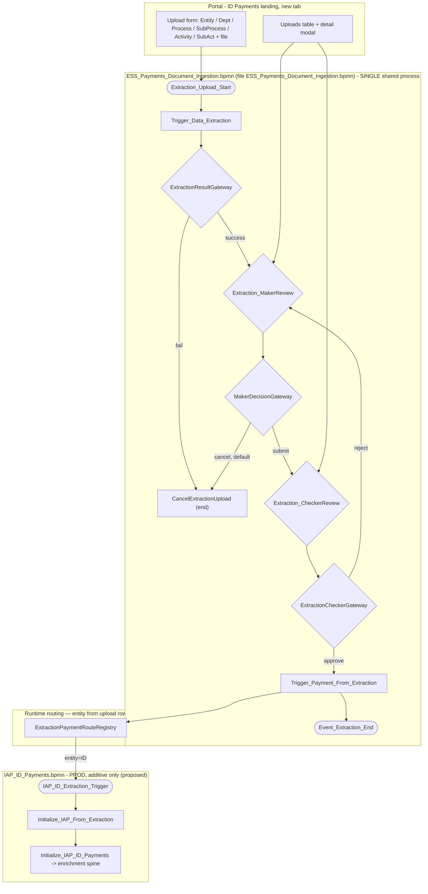
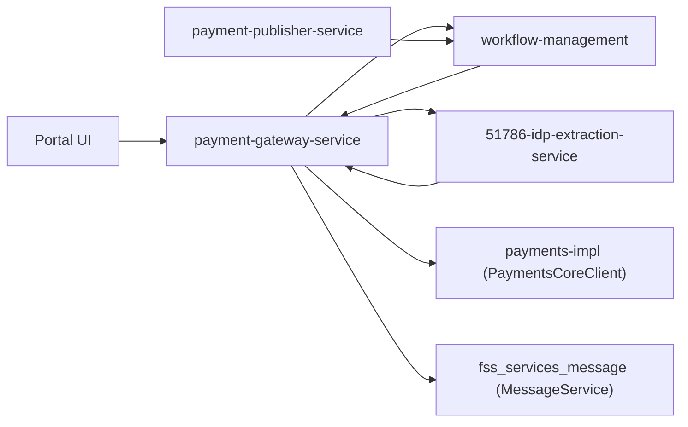
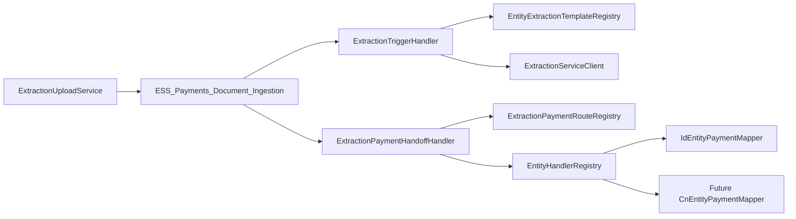
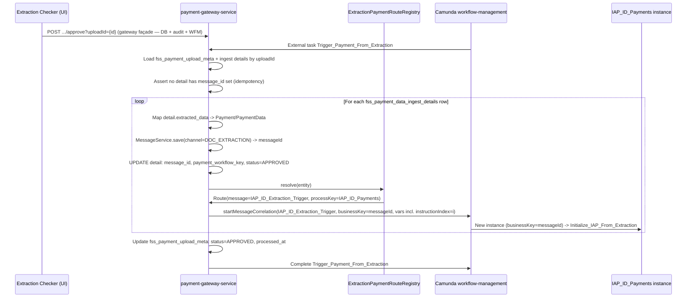
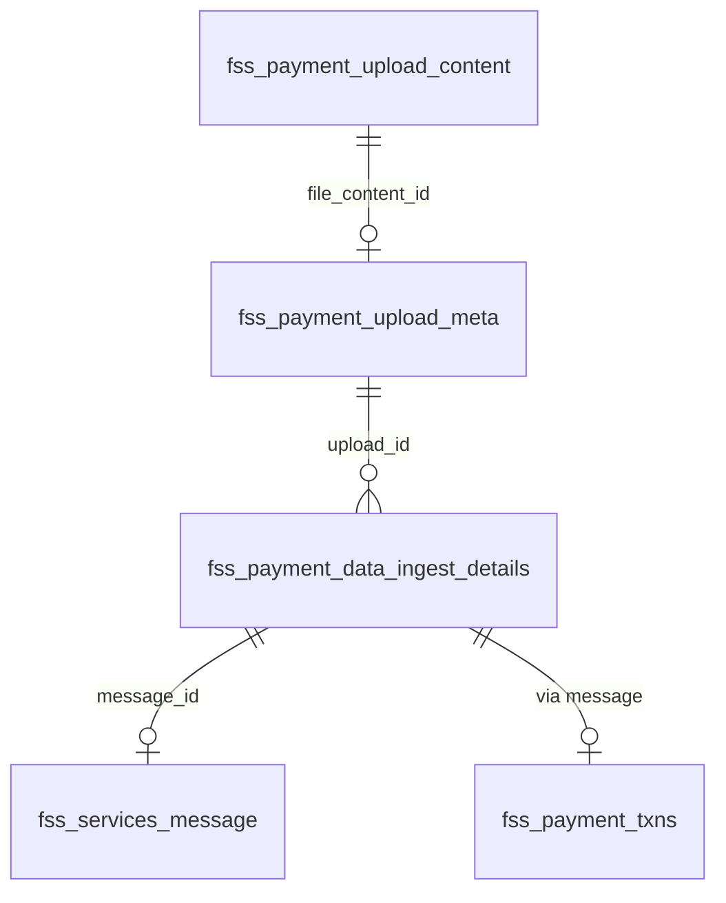

# ESS Payments Document Ingestion — Low Level Design (LLD)

> **Status:** Final v7 — **implementation guide** (extensibility patterns, interfaces, entity routing, Jackson POJOs, Camunda handlers)
> **Created:** 2026-07-30 · **Corrected:** 2026-08-03 (v2/v3) · **Corrected:** 2026-08-04 (v4/v6) · **Corrected:** 2026-08-04 (v7)
> **Canonical:** **This file (`IDP_LLD.md`) is the only LLD to use for implementation.** Run [IDP_LLD_REPO_SCAN_PROMPT.md](./IDP_LLD_REPO_SCAN_PROMPT.md) against active code repos before coding.
> **Related:** [README.md](./README.md) · [IDP_Document_Ingestion_Design.md](./IDP_Document_Ingestion_Design.md) · [IDP_UX_Design.md](./IDP_UX_Design.md) · [ESS_Payments_Document_Ingestion.bpmn](./ESS_Payments_Document_Ingestion.bpmn) · [../IAP_ID_Payments.md](../IAP_ID_Payments.md)

---

## 1. Purpose and scope

Implementable detail for: one common `ESS_Payments_Document_Ingestion` Camunda process (file `ESS_Payments_Document_Ingestion.bpmn`), an additive trigger proposed on `IAP_ID_Payments.bpmn`, database schema (manual SQL only), REST contracts (built on the **real** `WorkflowServicesController`), and Java/UI implementation strategy.

### 1.1 In scope (v1)

- Landing-page tab UX for Indonesia entity (`entity=ID`)
- `ESS_Payments_Document_Ingestion` workflow (upload -> data extraction -> extraction maker/checker)
- ZIP bulk upload (one upload row + workflow per PDF inside the archive; non-PDF ZIP entries ignored)
- Additive 4th entry on `IAP_ID_Payments` (`IAP_ID_Extraction_Trigger`) — **proposal, not applied**
- Manual SQL DDL for `fss_payment_upload_*` + `fss_payment_data_ingest_details` tables
- Gateway REST + external task handlers (new)
- `51786-idp-extraction-service` — **already built**, contract documented as-is

### 1.2 Out of scope (v1)

- New sidebar nav route
- China ETF extraction handoff (registry entry only, phase 2)
- SSTM feedback changes for `channel=DOC_EXTRACTION`
- `51786-document-service` integration (phase 2 — phase 1 uses in-table BLOB + lazy fetch)
- Feature flag (none — see §8)
- Liquibase/Flyway (not used anywhere in this codebase — see §5)

### 1.3 Domain glossary

| Term | Table / artifact | Meaning |
|---|---|---|
| **Upload (meta)** | `fss_payment_upload_meta` | One row per PDF file — file name, entity, file-level `status`, link to BLOB (`id` = Camunda business key for `ESS_Payments_Document_Ingestion`) |
| **Upload content** | `fss_payment_upload_content` | PDF bytes (lazy-fetched via `file_content_id` on meta) |
| **Ingest detail** | `fss_payment_data_ingest_details` | One row per `initiationDetail` instruction — `extracted_data`, per-instruction `status`, `confidence_score`, workflow keys, `retry`, `error_desc` |
| **Review payload** | `extracted_data` CLOB (on ingest details) | Per-instruction JSON `{ header, initiationDetail }` the maker/checker view and edit |
| **Workflow** | Camunda `ESS_Payments_Document_Ingestion` | Orchestration per PDF upload — passes `uploadId` (= `fss_payment_upload_meta.id`), never OCR/LLM payloads |

---

## 2. Architecture overview

### 2.1 Two-layer BPMN model



**Principle:** OCR, LLM, extraction QC (maker/checker), and upload persistence live **only** in `ESS_Payments_Document_Ingestion`. Payment enrichment, cut-off, S2B, and payment maker/checker stay in `IAP_ID_Payments` — unchanged except for one new message start + one init external task. No BPMN messages are used inside `ESS_Payments_Document_Ingestion` (v3) — extraction result and maker Submit/Cancel are both plain exclusive-gateway decisions on process variables, evaluated the instant the preceding task completes.

### 2.2 Service interaction



| Service | Responsibility |
| --- | --- |
| `51786-payment-gateway-service` | `ExtractionUploadController` (meta + content tables), extraction external task workers, `Trigger_Payment_From_Extraction` routing, `IAPExtractionInitializeHandler`, internal content endpoint for extraction |
| `51786-idp-extraction-service` | OCR client, LLM structuring, `POST /v1/extract`, `GET /v1/extract/{id}`, technical audit (`idp_extraction_audit`) — **already built, unchanged** |
| `51786-workflow-management` | Deploy `ESS_Payments_Document_Ingestion.bpmn` (process id `ESS_Payments_Document_Ingestion`) + additive `IAP_ID_Payments.bpmn` |
| `51786-document-service` | Phase 2 only — not invoked in phase 1 |
| `51786-payment-publisher-service` | No changes in v1 — existing cut-off/status path runs unchanged after handoff |

### 2.3 Orchestration boundary (unchanged principle, confirmed true in the built service)

`51786-idp-extraction-service`'s own README states: *"No Camunda, payment orchestration, or workflow clients — callers (e.g. payment-gateway-service) own orchestration."* Confirmed in its `pom.xml` — no Camunda/workflow-client dependency present.

```mermaid
sequenceDiagram
    participant WFM as Camunda (workflow-management)
    participant GW as payment-gateway-service
    participant EXT as 51786-idp-extraction-service

    WFM->>GW: External task Trigger_Data_Extraction
    GW->>GW: Load blob; INSERT fss_payment_data_ingest_details rows (status=PROCESSING)
    GW->>EXT: POST /v1/extract (correlationId=extractionUploadId)
    EXT->>EXT: OCR -> LLM -> idp_extraction_audit
    EXT->>GW: 200 structuredOutput+extractionId, OR 422 status=FAILED
    GW->>GW: UPDATE ingest details: extracted_data, confidence_score, status=READY_FOR_REVIEW; sync meta.status
    GW->>WFM: complete Trigger_Data_Extraction with extractionStatus (ExtractionResultGateway evaluates immediately - no wait/correlation step)
    Note over GW,WFM: Gateway owns workflow - extraction service never calls WorkflowService

```

### 2.4 Extensibility design patterns (required for implementation)

New **document types**, **payment entities**, and **LLM template changes** must be addable without modifying core orchestration code. Apply these patterns in `51786-payment-gateway-service`:

| Pattern | Where | Purpose |
|---------|-------|---------|
| **Registry** | `ExtractionPaymentRouteRegistry`, `EntityExtractionTemplateRegistry` | Map `entity` → payment BPMN message + extraction `templateId` |
| **Strategy** | `EntityPaymentMapper` (per entity) | Map `StoredExtractedData` POJO → `Payment` / `PaymentData` |
| **Template method** | `AbstractExtractionExternalTaskHandler` | Shared Camunda lock/retry/complete; subclasses implement `doExecute` |
| **Factory / resolver** | `EntityHandlerRegistry` | `resolve(entity)` → correct `EntityPaymentMapper` bean |
| **Facade** | `ExtractionUploadActionService` | Single orchestration for DB + audit + WFM (all user actions) |
| **Adapter** | `ExtractionServiceClient` | HTTP to `51786-idp-extraction-service`; returns typed `ExtractResponse` POJO |

**Extension scenarios:**

| Change | Touch points | Do **not** change |
|--------|--------------|-------------------|
| New payment entity (e.g. `CN`) | `application.yml` route row + new `CnEntityPaymentMapper` + BPMN message start on that entity's payment process | `ESS_Payments_Document_Ingestion.bpmn`, `ExtractionTriggerHandler` core loop |
| New LLM template for entity | `entity-templates` config: `entity → templateId` passed in extract request metadata | Extraction service API (still `POST /v1/extract`) |
| LLM JSON shape change for entity | New Jackson POJO package or versioned DTO under `model/extraction/{entity}/` + entity-specific mapper | DB schema (`extracted_data` stays CLOB) |
| New upload file type (phase 2) | New `DocumentTypeHandler` strategy (`PdfDocumentTypeHandler`, future `XlsxDocumentTypeHandler`) | Meta/detail tables |



---

## 3. BPMN design

### 3.1 Common process: `ESS_Payments_Document_Ingestion.bpmn` (file `ESS_Payments_Document_Ingestion.bpmn`)

| Attribute | Value |
| --- | --- |
| Process ID | `ESS_Payments_Document_Ingestion` |
| Executable | `true` |
| Module | `51786-workflow-management` |
| Country scope | Global — one definition for all countries |

#### Process variables

| Variable | Type | Set by | Purpose |
| --- | --- | --- | --- |
| `extractionUploadId` | String | Upload REST | Business key; correlation id |
| `entity` | String | UI upload form | **Routing key** — selects payment BPMN + LLM template (phase 1: `ID`) |
| `deptId`, `processId`, `subProcessId`, `activityId`, `subActivityId` | String | UI metadata dropdowns | Passed to OCR/LLM `metadata` map |
| `paymentMaker`, `paymentChecker` | String | Config / upload | Assignee expressions on `Extraction_MakerReview` / `Extraction_CheckerReview` |
| `extractionStatus` | String | `ExtractionTriggerHandler` | `PROCESSING`, `READY_FOR_REVIEW`, `FAILED` — evaluated immediately by `ExtractionResultGateway` on task completion |
| `makerAction` | String | Portal (maker Submit/Cancel button) | `SUBMIT` or `CANCEL` — evaluated immediately by `MakerDecisionGateway` on task completion |
| `extractionApproved` | Boolean | Checker complete task | Checker decision |

#### Task catalog

| BPMN ID | Type | Topic / message | Handler (proposed) |
| --- | --- | --- | --- |
| `Extraction_Upload_Start` | Start | REST `startWorkflowProcess` after meta + content rows persisted | `ExtractionUploadService` |
| `Trigger_Data_Extraction` | External | `Trigger_Data_Extraction` | `ExtractionTriggerHandler` |
| `ExtractionResultGateway` | Exclusive | - evaluated immediately, no wait state | `${extractionStatus=='READY_FOR_REVIEW'}` (default: `CancelExtractionUpload`) |
| `Extraction_MakerReview` | User task | `${paymentMaker}` | Portal modal |
| `MakerDecisionGateway` | Exclusive | - evaluated immediately | `${makerAction=='SUBMIT'}` (default: `CancelExtractionUpload`) |
| `Extraction_CheckerReview` | User task | `${paymentChecker}` | Portal modal |
| `ExtractionCheckerGateway` | Exclusive | `${extractionApproved==true}` | — |
| `Trigger_Payment_From_Extraction` | External | `Trigger_Payment_From_Extraction` | `ExtractionPaymentHandoffHandler` |
| `Event_Extraction_End` | End | — | — |
| `CancelExtractionUpload` | End | — | Reached from `ExtractionResultGateway` (fail) or `MakerDecisionGateway` (cancel); set status `CANCELLED`/`FAILED` accordingly |

#### No boundary events / no BPMN messages (v3)

There are **no boundary events and no `bpmn:message` definitions** in this process. `Event_ExtractionCompleted`, `ExtractionFailedBoundary`, and the message form of `CancelExtractionUpload` were removed — both `ExtractionResultGateway` and `MakerDecisionGateway` are plain exclusive gateways evaluated the instant the preceding external/user task completes.

### 3.2 Entity payment BPMN — additive pattern (template, proposal against real `IAP_ID_Payments.bpmn`)

| Addition | Detail |
| --- | --- |
| Message start | `IAP_ID_Extraction_Trigger` |
| External task | `Initialize_IAP_From_Extraction` (topic `Initialize_IAP_From_Extraction`) |
| Merge | `Initialize_IAP_From_Extraction` -> `Initialize_IAP_ID_Payments` (3rd incoming, alongside the 2 existing: `SequenceFlow_1e0z7n9`, `Flow_0af90pb`) |
| Annotation | *"Triggered from ESS_Payments_Document_Ingestion via Trigger_Payment_From_Extraction when entity=ID"* |

Existing paths frozen: `IAP_ID_AutomatedTrigger`, `IAP_ID_BulkTrigger`, `IAP_ID_Manual_Payment` — no edits to sequence flows, gateway expressions, or existing topics (see [Design doc §3](https://www.google.com/search?q=./IDP_Document_Ingestion_Design.md%233-production-safety--what-must-not-change)).

### 3.3 Handoff flow (`Trigger_Payment_From_Extraction`)



**Why `businessKey=messageId`, not `extractionUploadId`:** the real, already-built `IAP_ID_Payments` convention keys every process instance by `messageId` (confirmed: `IAPIDPaymentsMessageHandler.buildWorkflowReqObj(messageId)`, and downstream handlers resolve the payment record via `PaymentProcessing.getPaymentRecord(businessKey)` — see [IAP_ID_Payments.md](https://www.google.com/search?q=../IAP_ID_Payments.md)). Reusing `extractionUploadId` as the new instance's business key would silently break that convention (Cockpit search, reconciliation, any downstream `getPaymentRecord` lookup). So the `fss_services_message` row (and its `messageId`) is created **before** correlation, not inside `Initialize_IAP_From_Extraction` — see `ExtractionPaymentHandoffHandler` (§9.3).

#### Correlation payload

See [Design doc §6.2](https://www.google.com/search?q=./IDP_Document_Ingestion_Design.md%2362-variables-passed-at-correlation) — uses the **real** `IAP_ID_Payments` variable names (`isApproved`, `isRepaired`), not invented ones.

#### Idempotency

1. Before handoff loop: abort if any `fss_payment_data_ingest_details` row for `upload_id` already has `message_id` set.
2. Each detail row stores `message_id` and `payment_workflow_key` (= `message_id`) after successful correlation.
3. `upload_id` (`fss_payment_upload_meta.id`) is the `ESS_Payments_Document_Ingestion` business key; each `message_id` is the payment instance business key (see §3.3).
4. Double approve → no duplicate correlations (`message_id` guard per detail row).

---

## 4. Entity routing & template config

### 4.0 Routing responsibilities

`ESS_Payments_Document_Ingestion.bpmn` decides only ingestion-internal gateways. **Payment BPMN selection** and **LLM template selection** are config-driven from `entity` on the upload row.

> **Correction (v7):** `country` and `entity` are the same concept in this platform. Use **`entity` only** — no separate `country` column, process variable, or registry dimension.

| Layer | Responsibility |
|-------|----------------|
| Upload form / meta row | `entity` = routing key (phase 1: `ID` for Indonesia) |
| `EntityExtractionTemplateRegistry` | `entity` → `templateId` for `POST /v1/extract` (phase 1: `ID` → `id-payment-v1`) |
| `ExtractionPaymentRouteRegistry` | `entity` → payment message + process key |
| `EntityHandlerRegistry` | `entity` → `EntityPaymentMapper` implementation |

### 4.1 `application.yml` configuration

**Proposed location:** `51786-payment-gateway-service/src/main/resources/application.yml`

```yaml
extraction:
  payment-routes:
    - entity: ID
      message-name: IAP_ID_Extraction_Trigger
      process-definition-key: IAP_ID_Payments
      initialize-topic: Initialize_IAP_From_Extraction
  entity-templates:
    - entity: ID
      template-id: id-payment-v1
  upload:
    enabled: true
    max-file-size-mb: 50
```

**Adding a new entity (checklist):**

1. Add row to `extraction.payment-routes` and `extraction.entity-templates`.
2. Implement `EntityPaymentMapper` (e.g. `CnEntityPaymentMapper`) and register as Spring bean.
3. Deploy message start + init external task on that entity's payment BPMN.
4. Add LLM template in extraction service (if new JSON shape → new Jackson POJO package).

### 4.2 Java interfaces & config binding

```java
// com.sc.fss.paymentgateway.config.extraction.ExtractionRouteProperties
@ConfigurationProperties(prefix = "extraction")
public class ExtractionProperties {
    private List<PaymentRouteEntry> paymentRoutes = List.of();
    private List<EntityTemplateEntry> entityTemplates = List.of();
    private UploadProperties upload = new UploadProperties();
    // getters/setters
}

public record PaymentRouteEntry(
    String entity,
    String messageName,
    String processDefinitionKey,
    String initializeTopic
) {}

public record EntityTemplateEntry(String entity, String templateId) {}
```

```java
// com.sc.fss.paymentgateway.service.extraction.routing
public interface ExtractionPaymentRouteRegistry {
    PaymentRouteEntry resolve(String entity);
}

@Component
public class YamlExtractionPaymentRouteRegistry implements ExtractionPaymentRouteRegistry {
    private final Map<String, PaymentRouteEntry> byEntity;

    public YamlExtractionPaymentRouteRegistry(ExtractionProperties props) {
        this.byEntity = props.getPaymentRoutes().stream()
            .collect(Collectors.toUnmodifiableMap(
                e -> e.entity().toUpperCase(Locale.ROOT),
                Function.identity(),
                (a, b) -> { throw new IllegalStateException("Duplicate entity: " + a.entity()); }));
    }

    @Override
    public PaymentRouteEntry resolve(String entity) {
        return Optional.ofNullable(byEntity.get(entity.toUpperCase(Locale.ROOT)))
            .orElseThrow(() -> new UnknownEntityException(entity));
    }
}
```

```java
public interface EntityExtractionTemplateRegistry {
    String resolveTemplateId(String entity);
}

@Component
public class YamlEntityExtractionTemplateRegistry implements EntityExtractionTemplateRegistry {
  // same Map pattern as route registry
}
```

**Reuse scan:** mirror `CountrySpecificProcessorFactory` / `CountryExcelMsgProcessorFactory` wiring — see [IDP_LLD_REPO_SCAN_PROMPT.md](./IDP_LLD_REPO_SCAN_PROMPT.md).

### 4.3 UI entity selection

See [UX doc §2.4](./IDP_UX_Design.md). On the ID landing page, `entity` defaults to `ID` (hidden or read-only until multi-entity tabs exist).

---

## 5. Database design (manual SQL, no Liquibase)

**No migration tool (Liquibase/Flyway) exists anywhere in this codebase today.** DDL is delivered as **plain, manually-run `.sql` scripts**.

**Proposed location:** `51786-payment-gateway-service/src/main/resources/sql/manual-ddl/`

```
V1__fss_payment_upload_content.sql
V2__fss_payment_upload_meta.sql
V3__fss_payment_data_ingest_details.sql
V4__fss_payment_upload_audit.sql
```

### 5.1 Three-table model

The ingestion pipeline uses **three tables** with clear separation of concerns:

| Table | Granularity | Role |
|-------|-------------|------|
| `fss_payment_upload_content` | Per file | BLOB storage only — never joined in list queries |
| `fss_payment_upload_meta` | Per PDF | File metadata, upload audit fields, file-level `status`, FK to content |
| `fss_payment_data_ingest_details` | Per instruction | One row per `initiationDetail` — extraction result, per-instruction lifecycle, payment handoff keys, `retry`, `error_desc` |



**Relationships (from schema diagram):**

- `fss_payment_upload_meta.file_content_id` → `fss_payment_upload_content.id` (many meta rows could theoretically share content; in practice 1:1 per PDF upload).
- `fss_payment_data_ingest_details.upload_id` → `fss_payment_upload_meta.id` (**1:N** — one PDF upload produces N detail rows when the LLM returns N instructions).
- Camunda `ESS_Payments_Document_Ingestion` business key = `fss_payment_upload_meta.id` (`uploadId`).
- Each detail row's `payment_workflow_key` / `message_id` = `IAP_ID_Payments` business key after handoff.

---

#### `fss_payment_upload_content` (BLOB — isolated)

| Column | Type | Null | Notes |
| --- | --- | --- | --- |
| `id` | VARCHAR2(36) | N | PK, UUID |
| `file_content` | BLOB | N | PDF bytes |

---

#### `fss_payment_upload_meta` (per PDF file)

| Column | Type | Null | Notes |
| --- | --- | --- | --- |
| `id` | VARCHAR2(36) | N | PK, UUID; **Camunda business key** for `ESS_Payments_Document_Ingestion` |
| `batch_id` | VARCHAR2(36) | Y | Shared by all PDFs extracted from one ZIP upload |
| `file_name` | VARCHAR2(255) | N | Original PDF file name |
| `entity` | VARCHAR2(50) | N | **Routing key** — phase 1: `ID`; selects payment BPMN + LLM template |
| `dept_id` | VARCHAR2(50) | Y | Upload metadata |
| `process_id` | VARCHAR2(50) | Y | Upload metadata |
| `sub_process_id` | VARCHAR2(50) | Y | Upload metadata |
| `activity_id` | VARCHAR2(50) | Y | Upload metadata |
| `sub_activity_id` | VARCHAR2(50) | Y | Upload metadata |
| `status` | VARCHAR2(30) | N | File-level lifecycle — see §5.4; aggregate of child detail statuses |
| `file_content_id` | VARCHAR2(36) | N | FK → `fss_payment_upload_content.id` |
| `uploaded_by` | VARCHAR2(100) | N | |
| `uploaded_at` | TIMESTAMP | N | Sort key (DESC) |
| `processed_at` | TIMESTAMP | Y | Set when all details reach terminal state |
| `remarks` | VARCHAR2(500) | Y | Last reject/cancel reason (also in audit) |
| `approved_by` | VARCHAR2(100) | Y | Extraction checker (on approve) |
| `approved_at` | TIMESTAMP | Y | On checker approve |

**Indexes:** `idx_payment_upload_meta_entity` (`entity`), `idx_payment_upload_meta_batch` (`batch_id`), `idx_payment_upload_meta_status_ts` (`status`, `uploaded_at` DESC), `idx_payment_upload_meta_user` (`uploaded_by`, `uploaded_at` DESC).

---

#### `fss_payment_data_ingest_details` (per instruction — core pipeline row)

| Column | Type | Null | Notes |
| --- | --- | --- | --- |
| `id` | VARCHAR2(36) | N | PK, UUID |
| `upload_id` | VARCHAR2(36) | N | FK → `fss_payment_upload_meta.id` |
| `instruction_index` | NUMBER(5) | N | 0-based position in LLM `initiationDetail[]` |
| `status` | VARCHAR2(30) | N | Per-instruction lifecycle — see §5.4 |
| `extraction_id` | VARCHAR2(36) | Y | `extractionId` from `51786-idp-extraction-service` (shared across details from same OCR pass) |
| `extracted_data` | CLOB | Y | Per-instruction JSON: `{ "header": {…}, "initiationDetail": {…} }` — maker edits merged in place |
| `confidence_score` | NUMBER(5,2) | Y | From `initiationDetail.Confidence1` (parsed double) |
| `tx_ref` | VARCHAR2(50) | Y | Denormalized from `initiationDetail.TxRef` — list/sort without parsing CLOB |
| `sub_activity_id` | VARCHAR2(50) | Y | Denormalized — e.g. `Redemption`, `Subscription` |
| `activity_id` | VARCHAR2(10) | Y | Denormalized — e.g. `BT`, `OTT` |
| `trn_typ` | VARCHAR2(50) | Y | Denormalized from `TransactionDetails.TrnTyp` |
| `value_date` | DATE | Y | Denormalized from `TransactionDetails.ValDt` |
| `client_name` | VARCHAR2(255) | Y | Denormalized from `TransactionDetails.ClntNm` |
| `debit_amount` | VARCHAR2(50) | Y | Denormalized from first debit leg `DrAmt` (display only) |
| `low_confidence_field_count` | NUMBER(5) | Y | Count of fields with `Confidence < 90` — drives ⚠ badge in UI |
| `extraction_workflow_key` | VARCHAR2(36) | Y | = `upload_id` — ESS ingestion process business key |
| `message_id` | VARCHAR2(36) | Y → **N after handoff** | **Mandatory link to `fss_services_message`** — created **before** `startMessageCorrelation`; becomes IAP business key. `NOT NULL` when `status IN (APPROVED, COMPLETED)` |
| `payment_workflow_key` | VARCHAR2(36) | Y | = `message_id` after handoff (same convention as existing IAP handlers) |
| `payment_id` | VARCHAR2(36) | Y | Backfilled from `MessageService.getMessage(message_id).getFuncId()` after `Save_Payment_Transaction` |
| `handoff_at` | TIMESTAMP | Y | When `message_id` was saved and correlation succeeded |
| `handoff_message_name` | VARCHAR2(100) | Y | e.g. `IAP_ID_Extraction_Trigger` — audited registry resolution |
| `approved_by` | VARCHAR2(100) | Y | Extraction checker |
| `approved_at` | TIMESTAMP | Y | |
| `started_at` | TIMESTAMP | Y | Extraction/handoff attempt start |
| `completed_at` | TIMESTAMP | Y | Terminal state reached |
| `updated_by` | VARCHAR2(100) | Y | Last actor/handler |
| `updated_at` | TIMESTAMP | Y | |
| `retry` | NUMBER(5) | N | Default `0`; incremented on re-extract or retried handoff |
| `error_desc` | VARCHAR2(500) | Y | Human-readable failure reason (extraction `422`, timeout, handoff error); cleared on re-extract |

**Unique constraint:** `(upload_id, instruction_index)`.

**Indexes:** `idx_ingest_details_upload` (`upload_id`), `idx_ingest_details_status` (`status`), `idx_ingest_details_message` (`message_id`).

**Why one row per instruction:** each row is the **complete lifecycle record** for one `initiationDetail` → one `fss_services_message` → one `IAP_ID_Payments` instance. Do **not** deprecate `message_id` — it is the mandatory handoff anchor required by `ID_payments.bpmn` (business key = `messageId`). There is no separate handoff table; tracking lives on this row.

**Handoff invariant (application-enforced):**

```
FOR each detail WHERE status transitions to APPROVED:
  1. MessageService.save(channel=DOC_EXTRACTION) → message_id  (REQUIRED)
  2. UPDATE detail SET message_id, payment_workflow_key=message_id, handoff_at, handoff_message_name
  3. startMessageCorrelation(..., businessKey=message_id)
  4. Abort if message_id IS NULL before correlate
```

Partial handoff: details that already have `message_id` are skipped on retry; details without `message_id` are retried. `retry` + `error_desc` capture per-instruction failures.

**`retry` / `error_desc` usage:**

| Scenario | `retry` | `error_desc` |
| --- | --- | --- |
| Extraction fails (HTTP 422) | unchanged | OCR/LLM error from extraction service |
| Extraction timeout (exhausted Camunda retries) | unchanged | e.g. `OCR_TIMEOUT` |
| Re-extract requested | `retry + 1` | cleared |
| Handoff correlate fails | `retry + 1` | correlation error message |
| Success | unchanged | cleared |

---

### 5.2 Existing tables (usage only, no schema change)

| Table | Usage |
|---|---|
| `fss_services_message` | `channel='DOC_EXTRACTION'`; one row **per ingest detail** at handoff |
| `fss_payment_txns` | No schema change; row created by existing `Save_Payment_Transaction` |
| `act_*` | Camunda engine state — new process definitions only |

### 5.3 Status lifecycle

**File-level (`fss_payment_upload_meta.status`)** — derived/synced from child details:

| Status | Meaning |
| --- | --- |
| `UPLOADED` | Meta row inserted; workflow not yet started |
| `PROCESSING` | `ESS_Payments_Document_Ingestion` running extraction |
| `READY_FOR_REVIEW` | All details extracted; maker can review |
| `SUBMITTED` | Maker submitted to checker |
| `HANDOFF_IN_PROGRESS` | Checker approved; `Trigger_Payment_From_Extraction` running |
| `REJECTED` | Checker rejected (any detail or whole upload) |
| `APPROVED` | All details correlated; handoff complete |
| `COMPLETED` | All details reached payment completion |
| `FAILED` | Extraction failed for all details / unrecoverable |
| `CANCELLED` | Maker cancelled |

**Per-instruction (`fss_payment_data_ingest_details.status`)** — same vocabulary; each detail row transitions independently after handoff:

| Status | Set by | Notes |
| --- | --- | --- |
| `UPLOADED` | Row inserted (placeholder before extract) | Transient |
| `PROCESSING` | Extraction in flight | |
| `READY_FOR_REVIEW` | Extract complete for this instruction | Maker editable |
| `SUBMITTED` | Maker submit | |
| `REJECTED` | Checker reject | Loops to maker |
| `HANDOFF_IN_PROGRESS` | Checker approve (transient) | Until `message_id` saved per detail |
| `APPROVED` | Handoff correlated for this instruction | |
| `COMPLETED` | Payment workflow completed | |
| `FAILED` | Extraction or handoff failed | `error_desc` populated |
| `CANCELLED` | Maker cancel | |

### 5.4 DDL (Oracle — manual scripts)

```sql
-- V1__fss_payment_upload_content.sql
CREATE TABLE fss_payment_upload_content (
    id              VARCHAR2(36) PRIMARY KEY,
    file_content    BLOB         NOT NULL
);

-- V2__fss_payment_upload_meta.sql
CREATE TABLE fss_payment_upload_meta (
    id              VARCHAR2(36) PRIMARY KEY,
    batch_id        VARCHAR2(36),
    file_name       VARCHAR2(255) NOT NULL,
    entity          VARCHAR2(50) NOT NULL,
    dept_id         VARCHAR2(50),
    process_id      VARCHAR2(50),
    sub_process_id  VARCHAR2(50),
    activity_id     VARCHAR2(50),
    sub_activity_id VARCHAR2(50),
    status          VARCHAR2(30) NOT NULL,
    file_content_id VARCHAR2(36) NOT NULL REFERENCES fss_payment_upload_content(id),
    uploaded_by     VARCHAR2(100) NOT NULL,
    uploaded_at     TIMESTAMP    NOT NULL,
    processed_at    TIMESTAMP,
    remarks         VARCHAR2(500),
    approved_by     VARCHAR2(100),
    approved_at     TIMESTAMP
);
CREATE INDEX idx_payment_upload_meta_entity ON fss_payment_upload_meta (entity);
CREATE INDEX idx_payment_upload_meta_batch ON fss_payment_upload_meta (batch_id);
CREATE INDEX idx_payment_upload_meta_status_ts ON fss_payment_upload_meta (status, uploaded_at DESC);
CREATE INDEX idx_payment_upload_meta_user ON fss_payment_upload_meta (uploaded_by, uploaded_at DESC);

-- V3__fss_payment_data_ingest_details.sql
CREATE TABLE fss_payment_data_ingest_details (
    id                      VARCHAR2(36) PRIMARY KEY,
    upload_id               VARCHAR2(36) NOT NULL REFERENCES fss_payment_upload_meta(id),
    instruction_index       NUMBER(5)    NOT NULL,
    status                  VARCHAR2(30) NOT NULL,
    extraction_id           VARCHAR2(36),
    extracted_data          CLOB,
    confidence_score        NUMBER(5,2),
    tx_ref                  VARCHAR2(50),
    sub_activity_id         VARCHAR2(50),
    activity_id             VARCHAR2(10),
    trn_typ                 VARCHAR2(50),
    value_date              DATE,
    client_name             VARCHAR2(255),
    debit_amount            VARCHAR2(50),
    low_confidence_field_count NUMBER(5),
    extraction_workflow_key VARCHAR2(36),
    message_id              VARCHAR2(36),
    payment_workflow_key    VARCHAR2(36),
    payment_id              VARCHAR2(36),
    handoff_at              TIMESTAMP,
    handoff_message_name    VARCHAR2(100),
    approved_by             VARCHAR2(100),
    approved_at             TIMESTAMP,
    started_at              TIMESTAMP,
    completed_at            TIMESTAMP,
    updated_by              VARCHAR2(100),
    updated_at              TIMESTAMP,
    retry                   NUMBER(5)    DEFAULT 0 NOT NULL,
    error_desc              VARCHAR2(500),
    CONSTRAINT uk_ingest_details_upload_idx UNIQUE (upload_id, instruction_index)
);
CREATE INDEX idx_ingest_details_upload ON fss_payment_data_ingest_details (upload_id);
CREATE INDEX idx_ingest_details_status ON fss_payment_data_ingest_details (status);
CREATE INDEX idx_ingest_details_message ON fss_payment_data_ingest_details (message_id);
CREATE INDEX idx_ingest_details_sub_act ON fss_payment_data_ingest_details (upload_id, sub_activity_id);
CREATE INDEX idx_ingest_details_trn_typ ON fss_payment_data_ingest_details (upload_id, trn_typ);

-- V4__fss_payment_upload_audit.sql
CREATE TABLE fss_payment_upload_audit (
    audit_id        NUMBER GENERATED ALWAYS AS IDENTITY PRIMARY KEY,
    upload_id       VARCHAR2(36) NOT NULL REFERENCES fss_payment_upload_meta(id),
    action          VARCHAR2(50) NOT NULL,
    actor           VARCHAR2(100),
    before_status   VARCHAR2(30),
    after_status    VARCHAR2(30),
    remarks         VARCHAR2(500),
    details         CLOB,
    created_at      TIMESTAMP NOT NULL
);
CREATE INDEX idx_payment_upload_audit_upload ON fss_payment_upload_audit (upload_id, created_at DESC);
```

**Audit `action` values:** `UPLOAD`, `EXTRACT_COMPLETE`, `EXTRACT_FAILED`, `MAKER_SUBMIT`, `MAKER_CANCEL`, `CHECKER_APPROVE`, `CHECKER_REJECT`, `RE_EXTRACT`, `HANDOFF_STARTED`, `HANDOFF_COMPLETE`, `HANDOFF_FAILED`, `WORKFLOW_ACTION_FAILED`.

#### Who writes audit?

| Event | Writer |
| --- | --- |
| Upload, re-extract | `ExtractionUploadService` |
| Extraction complete/fail | `ExtractionTriggerHandler` |
| Submit, cancel, approve, reject | **`ExtractionUploadActionService`** (before WFM call) |
| Payment handoff | `ExtractionPaymentHandoffHandler` |

### 5.6 Why not a DB-backed route registry in v1

A `fss_payment_data_ingest_route` table (runtime-editable routing) is optional for phase 2. Ship the registry as a static `application.yml` list in `payment-gateway-service` first.

---

## 6. Structured output contract & JSON -> Payment mapping (corrected, real contract)

**This section replaces the v1 "IDP Document Ingestion" mapping table**, which incorrectly assumed `TrnTyp`/`ClntNm`/`ValDt` were direct fields of `initiationDetail`. The **real**, already-built and tested output of `51786-idp-extraction-service` (`POST /v1/extract`, confirmed against `IdPaymentOutput`/`InitiationDetail`/`ExtractedField` Java records and the actual fixture `after_ocr-llm-output.json`) is documented below **verbatim**. See [README.md decision log item 2](https://www.google.com/search?q=./README.md%23decision-log) for why this contract is kept as-is rather than rewritten.

### 6.1 Real response envelope (`POST /v1/extract`)

On `status=COMPLETED`, the LLM returns **`structuredOutput` with `initiationDetail` array only** (no `header`). `ExtractionTriggerHandler` builds `header` once, then **INSERTs one `fss_payment_data_ingest_details` row per instruction** with `extracted_data = { header, initiationDetail: item[i] }`, `confidence_score`, `extraction_workflow_key = upload_id` — see [Design doc §6.3](./IDP_Document_Ingestion_Design.md#63-llm-output-vs-stored-extracted_data).

```json
{
  "extractionId": "ext-audit-uuid",
  "templateId": "id-payment-v1",
  "correlationId": "extraction-upload-id",
  "status": "COMPLETED",
  "structuredOutput": { "...": "see 6.2" },
  "ocrTraceId": "ocr-job-id",
  "processingTimeMs": 45230,
  "errorCode": null,
  "errorDescription": null
}

```

`status` is one of `PENDING`, `OCR_IN_PROGRESS`, `LLM_IN_PROGRESS`, `COMPLETED`, `FAILED` (`JobStatus` enum, confirmed). On `FAILED`, the HTTP status is **422**, not 200 — see [Design doc § 4.4.1](https://www.google.com/search?q=./IDP_Document_Ingestion_Design.md%23441-how-the-gateway-knows-extraction-is-done-and-the-real-http-status-contract).

### 6.2 Real `structuredOutput` shape (verbatim, confirmed against the built fixture)

```json
{
  "header": {
    "uniqueId": "3897122",
    "country": "SS_ID_DOC",
    "project_version": "1.0.0",
    "request_timestamp": "03022026212204",
    "response_timestamp": "03022026212212",
    "job_id": "JID-549a5d3a-0103-11f1-9107-9e5a5da3c310",
    "doc_ids": ["C0AA239C-0000-CD1F-8C11-408513E7F19F"],
    "ErrorCode": "200",
    "ErrorDescription": "",
    "TotInst": "1",
    "InstructionSummary": [
      { "DeptId": "FundServices", "ProcessId": "Cash", "SubProcessId": "CI", "NoInst1": "1" }
    ]
  },
  "initiationDetail": [
    {
      "TxRef": "3897122-001",
    "DocRef": "page1",
    "DocId": "C0AA239C-0000-CD1F-8C11-408513E7F19F",
    "DocName": "3897122.pdf",
    "DeptId": "FundServices",
    "ProcessId": "Cash",
    "SubProcessId": "CI",
    "ActivityId": "BT",
    "SubActivityId": "Redemption",
    "function": "NEWM",
    "Lang": "Eng",
    "Confidence1": "97.23",
    "TransactionDetails": [
      { "Name": "BankChg", "Value": "No", "Confidence": "94.07" },
      { "Name": "Multi", "Value": "No", "Confidence": "92.78" },
      { "Name": "NonS2B", "Value": "No", "Confidence": "94.36" },
      { "Name": "TrnRef", "Value": "IDPYRE015001", "Confidence": "92.76" },
      { "Name": "ScaRef", "Value": "", "Confidence": "0" },
      { "Name": "TrnTyp", "Value": "Redemption", "Confidence": "94.69" },
      { "Name": "ClntNm", "Value": "PT BNI ASSET MANAGEMENT", "Confidence": "93.23" },
      { "Name": "ValDt", "Value": "2025-10-29", "Confidence": "94.0" }
    ],
    "DebitDetails": {
      "summary": "1",
      "details": [{ "data": [
        { "Name": "Transaction-Id", "Value": "Txn-1", "Confidence": "96.48" },
        { "Name": "DrAccCcy", "Value": "IDR", "Confidence": "97.19" },
        { "Name": "DrAccNo", "Value": "30681655612", "Confidence": "92.58" },
        { "Name": "DrAccNm", "Value": "", "Confidence": "0" },
        { "Name": "DrAmt", "Value": "5000000000", "Confidence": "95.7" },
        { "Name": "DrNarrLn1", "Value": "Redemption", "Confidence": "93.13" }
      ]}]
    },
    "CreditDetails": {
      "summary": "1",
      "details": [{ "data": [
        { "Name": "Transaction-Id", "Value": "Txn-1", "Confidence": "92.94" },
        { "Name": "CrAccCcy", "Value": "IDR", "Confidence": "95.19" },
        { "Name": "CrAccNo", "Value": "30608788756", "Confidence": "94.95" },
        { "Name": "CrAccNm", "Value": "", "Confidence": "0" },
        { "Name": "CrAmt", "Value": "5000000000", "Confidence": "94.38" },
        { "Name": "CrNarrLn1", "Value": "Redemption", "Confidence": "93.8" }
      ]}]
    }
    }
  ]
}
```

**Stored shape** (after gateway merges header): `{ "header": { ... }, "initiationDetail": [ ... ] }`. Single-instruction PDFs use an array of length 1.

**Key facts (all confirmed against real code, not assumed):**

* LLM output is **`initiationDetail[]` only**; `header` is built by `ExtractionTriggerHandler` from OCR/job context (`uniqueId`, `TotInst` = array length, `InstructionSummary`, `doc_ids`, …).
* `header` has 11 fields, including a per-instruction `InstructionSummary[]` array — none of these map to `Payment`, they are OCR/LLM job metadata only, except `doc_ids[0]` (document linkage) and `uniqueId` (external ref candidate).
* `initiationDetail` has **no** direct `TrnTyp`/`ClntNm`/`ValDt`/`TrnRef` fields. Every business field except `TxRef`/`DocRef`/`DocId`/`DocName`/`DeptId`/`ProcessId`/`SubProcessId`/`ActivityId`/`SubActivityId`/`function`/`Lang`/`Confidence1` lives inside `TransactionDetails[]`, `DebitDetails.details[].data[]`, or `CreditDetails.details[].data[]` as `{ "Name", "Value", "Confidence" }` triples.
* `Confidence` (and `Confidence1`) are **JSON strings**, e.g. `"94.07"` — not numbers. Any comparison (e.g. "highlight if `Confidence < 90`") must `Double.parseDouble(...)` first.
* `DebitDetails`/`CreditDetails` share the same `LegDetails { summary, details[] }` shape; `details[].data[]` is the actual field list per leg (supports future multi-leg payments even though phase 1 uses a single leg each).
* **Maker edits** are merged into `fss_payment_data_ingest_details.extracted_data` in place (per instruction row) via `POST .../fields`.

### 6.2.1 `TransactionDetails[]` known `Name` catalog (from the real fixture — treat as the confirmed baseline; the LLM may omit fields it cannot find, never add undocumented ones without updating this table)

| `Name` | Meaning | Maps to |
| --- | --- | --- |
| `BankChg` | Bank charges indicator (Yes/No) | Payment charge-bearer flag |
| `Multi` | Multi-transaction indicator | Payment attribute |
| `NonS2B` | Non-S2B indicator | Payment attribute |
| `TrnRef` | Transaction reference | Payment attribute (distinct from `initiationDetail.TxRef`) |
| `ScaRef` | SCA reference | Payment attribute (may be empty/`Confidence:"0"` when not present) |
| `TrnTyp` | **Transaction type** | `Payment.transactionType` |
| `ClntNm` | **Client name** | `Payment.clientName` |
| `ValDt` | **Value date** (`YYYY-MM-DD`) | `Payment.valueDate` |

### 6.2.2 `DebitDetails.details[].data[]` / `CreditDetails.details[].data[]` known `Name` catalog

| `Name` | Meaning | Maps to |
| --- | --- | --- |
| `Transaction-Id` | Leg correlation id within the instruction | Debit/credit leg key |
| `DrAccCcy` / `CrAccCcy` | Account currency | Leg currency |
| `DrAccNo` / `CrAccNo` | Account number | Leg account number |
| `DrAccNm` / `CrAccNm` | Account name (often blank, `Confidence:"0"`, pending enrichment) | Leg account name |
| `DrAmt` / `CrAmt` | Amount | Leg amount |
| `DrNarrLn1` / `CrNarrLn1` | Narration line 1 | Leg narration |

### 6.3 Jackson POJO model & entity mappers (no `Map.get()` in v1)

**Rule:** Deserialize `extracted_data` CLOB and extraction HTTP responses with **Jackson POJOs**. Do not use `Map<String,Object>`, `JsonNode.get()`, or stringly-typed field lookup in production mapping code.

#### 6.3.1 Reuse extraction-service types (do not duplicate)

Import from `51786-idp-extraction-service` (scan repo for exact package): `ExtractResponse`, `InitiationDetail`, `ExtractedField`.

Gateway storage wrapper: `StoredExtractedData { ExtractionHeader header; InitiationDetail initiationDetail; }` — serialized via `ExtractedDataCodec` + injected `ObjectMapper`.

When an entity's LLM template changes, add versioned POJOs (e.g. `model.extraction.id.v2`) + new `EntityPaymentMapper`.

#### 6.3.2 `EntityPaymentMapper` strategy

```java
public interface EntityPaymentMapper {
    String entity();
    Payment mapToPayment(StoredExtractedData extracted, PaymentUploadMetaEntity meta);
    PaymentData mapToPaymentData(StoredExtractedData extracted, PaymentUploadMetaEntity meta);
}
```

`EntityHandlerRegistry` collects all `EntityPaymentMapper` Spring beans by `entity()` code. `ExtractionPaymentHandoffHandler` calls `require(meta.getEntity())`.

`Payment`/`PaymentData` from `com.sc.fssservices.model.transaction.*` — mirror `IAPPaymentBulkTransactionHandler` leg-building (scan repo).

#### 6.3.3 Typed helpers (optional)

`InitiationDetailSupport.transactionDetailValue(detail, "TrnTyp")` streams `List<ExtractedField>` — not `Map.get()`.

#### 6.3.4 Denormalized columns

Populate `tx_ref`, `trn_typ`, etc. from POJO getters in `ExtractionTriggerHandler`.

### 6.4 `confidence_score` (on `fss_payment_data_ingest_details`)

| Source | Rule |
| --- | --- |
| Primary | `initiationDetail.Confidence1` on each detail row, parsed as double |
| Meta aggregate | `MIN(confidence_score)` across details for upload list display |
| Fallback | Minimum of all per-field `Confidence` values in `extracted_data` |
| After maker edit | Unchanged; edited fields get `isEdited` metadata inside `extracted_data` |

### 6.5 Maker review & confidence

* Maker edits **field values** only (`PATCH /v1/extraction-uploads/{id}/fields`, see API Reference).
* Original LLM `Confidence` is retained for audit regardless of edits.
* UI highlights fields where the **parsed** `Confidence < 90` (configurable threshold, plain constant in v1 — no feature-flag config system, see §8).

---

## 7. Error handling & resilience

| Layer | Strategy |
| --- | --- |
| Extraction HTTP call | `ExtractionTriggerHandler` branches explicitly: `200` -> success, `422` -> permanent fail (no retry), timeout/5xx -> retry via the same `ExternalTaskHelper.getRetries`/`getNextTimeout` pattern every other `IAP_ID_Payments` handler already uses ([IAP_ID_Payments.md](https://www.google.com/search?q=../IAP_ID_Payments.md) §5) |
| Handoff | If correlate fails, do **not** complete `Trigger_Payment_From_Extraction`; upload stays `SUBMITTED`/`APPROVED`-pending; ops alert |
| Extraction retry | `retry` on `fss_payment_data_ingest_details`; re-extract increments `retry`, clears `extracted_data`/`error_desc`, resets `status=PROCESSING` on all detail rows for the upload |
| Stuck uploads | Reconciliation scheduler in the gateway (below) |
| Payment gateways | Existing `IAP_ID_Payments` behavior after handoff — no changes |

### 7.1 Reconciliation scheduler (gateway, new)

| Condition | Action |
| --- | --- |
| `status=PROCESSING` on meta with details still `PROCESSING` after timeout | Mark details `FAILED`, set `error_desc`; sync meta `FAILED` |
| Detail `status=APPROVED` AND `message_id IS NOT NULL` AND payment not complete | Backfill from `MessageService.getMessage(message_id)` |

### 7.2 Idempotency keys

`uploadId` (`fss_payment_upload_meta.id`) — Camunda business key. Before re-extracting, check `idp_extraction_audit` for `correlation_id=uploadId` and `job_status=COMPLETED`.

---

## 8. Feature flag — none in v1

No feature-flag framework exists anywhere in `51786-transaction-data-tiles` today (confirmed — no LaunchDarkly, no config-toggle pattern). Building one just for this feature is out of scope. Rollout is controlled by:

1. Deploying all backend pieces (§P1–P5 in [Design doc §11](https://www.google.com/search?q=./IDP_Document_Ingestion_Design.md%2311-deployment-plan)) and verifying end-to-end in a lower environment **before** merging the UI tab.
2. The new tab and upload form are only usable by users in the `paymentMaker`/`paymentChecker` candidate groups already configured for `IAP_ID_Payments` — no separate access control needed.
3. If a kill-switch is required later, the simplest option consistent with this codebase's existing config style is a single `application.properties` boolean read once at controller startup (`extraction-upload.enabled=true|false`) returning `404`/disabling the route — not a runtime-toggleable flag service.

---

## 9. Java implementation guide

> **Before coding:** run [IDP_LLD_REPO_SCAN_PROMPT.md](./IDP_LLD_REPO_SCAN_PROMPT.md) in the active workspace and fill §13.2 with findings.

### 9.1 Module layout

```
51786-payment-gateway-service/
  src/main/java/com/sc/fss/paymentgateway/
    config/extraction/
      ExtractionProperties.java              // @ConfigurationProperties("extraction")
      ExtractionAutoConfiguration.java       // enable config props
    controller/
      ExtractionUploadController.java
    client/
      ExtractionServiceClient.java           // Feign/RestTemplate → POST /v1/extract
    service/ingestion/
      ExtractionUploadService.java
      ExtractionUploadActionService.java
      ExtractionUploadContentService.java
      ExtractionUploadAuditService.java
      ExtractedDataCodec.java / JacksonExtractedDataCodec.java
    service/extraction/routing/
      ExtractionPaymentRouteRegistry.java
      YamlExtractionPaymentRouteRegistry.java
      EntityExtractionTemplateRegistry.java
      YamlEntityExtractionTemplateRegistry.java
      EntityHandlerRegistry.java
    service/extraction/mapper/
      EntityPaymentMapper.java
      IdEntityPaymentMapper.java             // phase 1
    service/extraction/support/
      InitiationDetailSupport.java
    workflow/handler/extraction/
      AbstractExtractionExternalTaskHandler.java
      ExtractionTriggerHandler.java
      ExtractionPaymentHandoffHandler.java
    workflow/handler/iap/id/
      IAPExtractionInitializeHandler.java
    model/entity/ingestion/
      PaymentUploadContentEntity.java
      PaymentUploadMetaEntity.java
      PaymentDataIngestDetailsEntity.java
      PaymentUploadAuditEntity.java
    model/extraction/
      StoredExtractedData.java
      ExtractionHeader.java
    repository/ingestion/
      PaymentUploadContentRepository.java
      PaymentUploadMetaRepository.java
      PaymentDataIngestDetailsRepository.java
      PaymentUploadAuditRepository.java
```

### 9.2 Camunda external task implementation

Follow the **same pattern** as existing IAP handlers in `51786-payment-gateway-service` (scan: `@ExternalTaskSubscription`, `ExternalTaskHandler`, `ExternalTaskHelper`).

#### Base template (new — factor shared logic)

```java
@Slf4j
public abstract class AbstractExtractionExternalTaskHandler implements ExternalTaskHandler {

    protected abstract String topic();

    protected abstract void doExecute(ExternalTask task, ExternalTaskService service) throws Exception;

    @Override
    public void execute(ExternalTask externalTask, ExternalTaskService externalTaskService) {
        String businessKey = externalTask.getBusinessKey();
        try {
            doExecute(externalTask, externalTaskService);
        } catch (PermanentFailureException e) {
            log.warn("Permanent fail topic={} key={}: {}", topic(), businessKey, e.getMessage());
            externalTaskService.handleFailure(externalTask, e.getMessage(), null,
                0, 0L); // no retry — mirrors 422 extraction path
        } catch (Exception e) {
            int retries = ExternalTaskHelper.getRetries(externalTask); // reuse existing helper
            long timeout = ExternalTaskHelper.getNextTimeout(externalTask);
            externalTaskService.handleFailure(externalTask, e.getMessage(),
                ExceptionUtils.getStackTrace(e), retries, timeout);
        }
    }

    protected void complete(ExternalTask task, ExternalTaskService service, Map<String, Object> variables) {
        service.complete(task, variables);
    }

    protected String requireVariable(ExternalTask task, String name) {
        return Optional.ofNullable(task.getVariable(name))
            .map(Object::toString)
            .orElseThrow(() -> new IllegalStateException("Missing variable: " + name));
    }
}
```

#### Handler inventory

| Class | `@ExternalTaskSubscription` topic | Extends | Completes with variables |
|-------|-----------------------------------|---------|--------------------------|
| `ExtractionTriggerHandler` | `Trigger_Data_Extraction` | `AbstractExtractionExternalTaskHandler` | `extractionStatus` = `READY_FOR_REVIEW` \| `FAILED` |
| `ExtractionPaymentHandoffHandler` | `Trigger_Payment_From_Extraction` | `AbstractExtractionExternalTaskHandler` | none (empty map) |
| `IAPExtractionInitializeHandler` | `Initialize_IAP_From_Extraction` | existing IAP base if present | per IAP convention |

**Registration:** Spring component scan — same as other `@ExternalTaskSubscription` beans; Camunda client polls topics automatically. **No** changes to `workflow-management` Java for external task workers (workers live in gateway).

**workflow-management changes:** deploy BPMN only (`ESS_Payments_Document_Ingestion.bpmn`, additive `IAP_ID_Payments.bpmn`).

### 9.3 Interface & class inventory

| Type | Name | Responsibility |
|------|------|----------------|
| REST | `ExtractionUploadController` | Upload, list, detail, fields, re-extract, `performAction` |
| Service | `ExtractionUploadService` | Persist meta/content, start workflow |
| Service | `ExtractionUploadActionService` | `performAction(UploadAction, …)` — audit + DB + WFM |
| Service | `ExtractionUploadAuditService` | Insert audit rows |
| Service | `ExtractionUploadContentService` | BLOB load/store |
| Client | `ExtractionServiceClient` | Typed `ExtractResponse extract(ExtractRequest)` |
| Codec | `ExtractedDataCodec` | CLOB ↔ `StoredExtractedData` |
| Registry | `ExtractionPaymentRouteRegistry` | `entity` → route |
| Registry | `EntityExtractionTemplateRegistry` | `entity` → `templateId` |
| Registry | `EntityHandlerRegistry` | `entity` → `EntityPaymentMapper` |
| Strategy | `EntityPaymentMapper` | POJO → `Payment` / `PaymentData` |
| Handler | `ExtractionTriggerHandler` | External: extraction |
| Handler | `ExtractionPaymentHandoffHandler` | External: handoff loop |
| Handler | `IAPExtractionInitializeHandler` | External: IAP init |
| Enum | `UploadAction` | `SUBMIT`, `CANCEL`, `APPROVE`, `REJECT` |
| Enum | `UploadStatus` | Mirrors §5.3 |
| Exception | `UnknownEntityException`, `InvalidUploadTransitionException` | 400/404 mapping |

### 9.4 `ExtractionUploadActionService` — single entry (switch inside service)

```java
public enum UploadAction { SUBMIT, CANCEL, APPROVE, REJECT }

public interface ExtractionUploadActionService {
    UploadActionResult performAction(String uploadId, UploadAction action,
        Optional<String> remarks, String actor);
}

@Service
@Transactional
public class ExtractionUploadActionServiceImpl implements ExtractionUploadActionService {

    private final Map<UploadAction, UploadActionHandler> handlers;

    public ExtractionUploadActionServiceImpl(List<UploadActionHandler> handlerList) {
        this.handlers = handlerList.stream()
            .collect(Collectors.toUnmodifiableMap(UploadActionHandler::action, Function.identity()));
    }

    @Override
    public UploadActionResult performAction(String uploadId, UploadAction action,
            Optional<String> remarks, String actor) {
        return handlers.get(action).execute(uploadId, remarks, actor);
    }
}

public interface UploadActionHandler {
    UploadAction action();
    UploadActionResult execute(String uploadId, Optional<String> remarks, String actor);
}
```

REST: `POST .../performAction?uploadId={id}` body `{ "action": "SUBMIT", "remarks": "..." }` — see [API Reference](./IDP_API_Reference.md) (four separate paths also valid; service layer stays unified).

### 9.5 Java language features (use what parent POM allows)

| Feature | Where to use |
|---------|--------------|
| **Java 8** `Optional`, `Stream`, `Collectors.toUnmodifiableMap` | Registries, null-safe variable read |
| **Java 11** `var` (local only), `String.isBlank()` | Handler internals |
| **Java 17** `record` | `PaymentRouteEntry`, `EntityTemplateEntry`, DTO responses if POM ≥17 |
| **Generics** | `UploadActionHandler`, `EntityPaymentMapper`, repository `JpaRepository<Entity, String>` |
| **Sealed interfaces** (17+) | Optional: `sealed interface UploadActionHandler permits SubmitHandler, …` |
| **@ConfigurationProperties** | Type-safe `application.yml` binding — not manual `Environment.getProperty` |

Do not use reflection-based plugin loading in v1 — Spring `List<EntityPaymentMapper>` injection is sufficient.

### 9.6 Implementation patterns

| Pattern | Application |
| --- | --- |
| External task workers | `@ExternalTaskSubscription` + extend `AbstractExtractionExternalTaskHandler` |
| Message correlation | `WorkflowService.startMessageCorrelation(...)` — same as `IAPIDPaymentsMessageHandler` |
| Human tasks | Gateway `performAction` only — never portal → WFM |
| JSON | Jackson POJOs via `ExtractedDataCodec` + extraction service types |
| Routing | `entity` only — `YamlExtractionPaymentRouteRegistry` |

### 9.7 Key class responsibilities

#### `ExtractionUploadService`

1. Validate file type/size — accept `.pdf` or `.zip`.
2. **If PDF:** insert content + meta (`status=UPLOADED`, `entity` from form).
3. **If ZIP:** `batchId`; per `.pdf` entry: content + meta.
4. `startWorkflowProcess(processKey=ESS_Payments_Document_Ingestion, referenceId=uploadId, variables incl. entity)`.
5. Update meta: `status=PROCESSING`.

#### `ExtractionUploadActionService`

See §9.4 and [API Reference §3](./IDP_API_Reference.md#3-maker--checker-action-apis--gateway-facade-required).

#### `ExtractionTriggerHandler`

1. Load meta + blob; resolve `templateId = entityTemplateRegistry.resolveTemplateId(meta.getEntity())`.
2. `extractionServiceClient.extract(...)` → typed `ExtractResponse`.
3. On success: build `ExtractionHeader`; for each `InitiationDetail` build `StoredExtractedData`, `codec.toJson`, INSERT detail row, denormalize columns from POJO.
4. On 422: FAIL details + meta; on timeout: rethrow for Camunda retry.
5. `complete(task, Map.of("extractionStatus", status))`.

#### `ExtractionPaymentHandoffHandler`

1. Load meta + details; idempotency guard on `message_id`.
2. `EntityPaymentMapper mapper = entityHandlerRegistry.require(meta.getEntity())`.
3. Per detail: `mapper.mapToPayment(codec.fromJson(detail.getExtractedData()), meta)` → `MessageService.save` → correlate via `routeRegistry.resolve(meta.getEntity())`.
4. Update meta `APPROVED`; complete task.

#### `IAPExtractionInitializeHandler`

Load `fss_services_message` by `businessKey`; complete task — same package as `IAPIDPaymentTransactionHandler`.

---

## 10. Frontend implementation strategy

See [IDP_UX_Design.md §8](./IDP_UX_Design.md#8-implementation-task-list-frontend) for the concrete, buildable task list against the real current components.

---

## 11. Two maker-checker cycles

See [Design doc §7](./IDP_Document_Ingestion_Design.md#7-two-maker-checker-cycles).

---

## 12. Test strategy

### 12.1 Regression (on `IAP_ID_Payments` v(N+1) before prod)

See [Design doc §12](./IDP_Document_Ingestion_Design.md#12-regression-test-matrix).

### 12.2 Extraction-specific

| # | Scenario | Expected |
|---|---|---|
| 1 | Upload PDF | Row `PROCESSING`, `ESS_Payments_Document_Ingestion` instance started |
| 2 | Extraction complete (200) | `READY_FOR_REVIEW`, row clickable |
| 3 | Extraction fails (422) | `FAILED`, no retry, row clickable for re-extract; `ExtractionResultGateway` default flow routes to `CancelExtractionUpload` |
| 4 | Extraction times out | Retried per `ExternalTaskHelper` policy, then `FAILED` after exhaustion |
| 5 | Maker submit | `POST {GW}/submit?uploadId={id}` → audit `MAKER_SUBMIT`, meta/details `SUBMITTED`, then gateway completes `Extraction_MakerReview` |
| 6 | Checker reject | `POST {GW}/reject?uploadId={id}` → audit `CHECKER_REJECT`, `REJECTED`, back to maker |
| 7 | Re-extract | All detail rows: `retry+1`, clear `extracted_data`/`error_desc`, `status=PROCESSING` |
| 8 | Maker cancel upload | `POST {GW}/cancel?uploadId={id}` → audit `MAKER_CANCEL`, `CANCELLED` |
| 9 | ZIP with 2 PDFs | 2 upload rows, shared `batch_id`, 2 ingestion instances |
| 10 | ZIP with no PDFs | `400` from upload API |
| 11 | Multi-instruction PDF (N=3) approve | 3 rows in `fss_payment_data_ingest_details` with `message_id`; 3× `IAP_ID_Extraction_Trigger` |

---

## 13. Repository discovery (run before implementation)

### 13.1 How to run

1. Open workspace containing `51786-payment-gateway-service`, `51786-workflow-management`, `51786-idp-extraction-service`.
2. Paste prompt from [IDP_LLD_REPO_SCAN_PROMPT.md](./IDP_LLD_REPO_SCAN_PROMPT.md) into Cursor/agent.
3. Record findings in §13.2 below (or `IDP_LLD_REPO_FINDINGS.md`).

### 13.2 Reuse & alignment report (fill after scan)

| LLD class / concern | Reuse (path) or New | Pattern reference (path:line) | Notes |
|---------------------|---------------------|-------------------------------|-------|
| `AbstractExtractionExternalTaskHandler` | _TBD_ | _e.g. IAP*Handler_ | |
| `ExternalTaskHelper` | _TBD_ | | |
| `WorkflowService` | _TBD_ | | |
| `IAPIDPaymentsMessageHandler` | _TBD_ | | |
| `MessageService` / DOC_EXTRACTION | _TBD_ | | |
| `CountrySpecificProcessorFactory` | _TBD_ | | Registry pattern |
| `InitiationDetail` / `ExtractedField` | _TBD_ | extraction service | Import, don't duplicate |
| `BulkUploadController` | _TBD_ | | URL conventions |
| `ObjectMapper` / Jackson config | _TBD_ | | |
| Java version (parent POM) | _TBD_ | | Enables record/sealed |

### 13.3 Expected repo touch list

| Repo | Changes |
|------|---------|
| `51786-payment-gateway-service` | All Java in §9.1, `application.yml`, manual DDL scripts |
| `51786-workflow-management` | Deploy `ESS_Payments_Document_Ingestion.bpmn`; additive `IAP_ID_Payments.bpmn` — **no new Java** for external workers |
| `51786-idp-extraction-service` | **No change** in v1 — consume existing API + POJOs |
| Portal UI | Per [IDP_UX_Design.md](./IDP_UX_Design.md) |

---

## 14. Implementation order

| Step | Deliverable | Depends on |
|------|-------------|------------|
| 1 | Repo scan (§13) | Active workspace |
| 2 | Manual DDL V1–V4 | DBA |
| 3 | JPA entities + repositories | DDL |
| 4 | `ExtractionProperties` + YAML registries | — |
| 5 | `ExtractedDataCodec` + import extraction POJOs | Scan §13 |
| 6 | `IdEntityPaymentMapper` | Codec + POJOs |
| 7 | `ExtractionUploadService` + controller upload/list | Entities, WorkflowService |
| 8 | `AbstractExtractionExternalTaskHandler` + `ExtractionTriggerHandler` | Client, codec, registries |
| 9 | `ExtractionUploadActionService` + handlers | Audit, WorkflowService |
| 10 | `ExtractionPaymentHandoffHandler` | Mapper, route registry, MessageService |
| 11 | `IAPExtractionInitializeHandler` | IAP handler pattern |
| 12 | BPMN deploy + E2E tests | §12 |