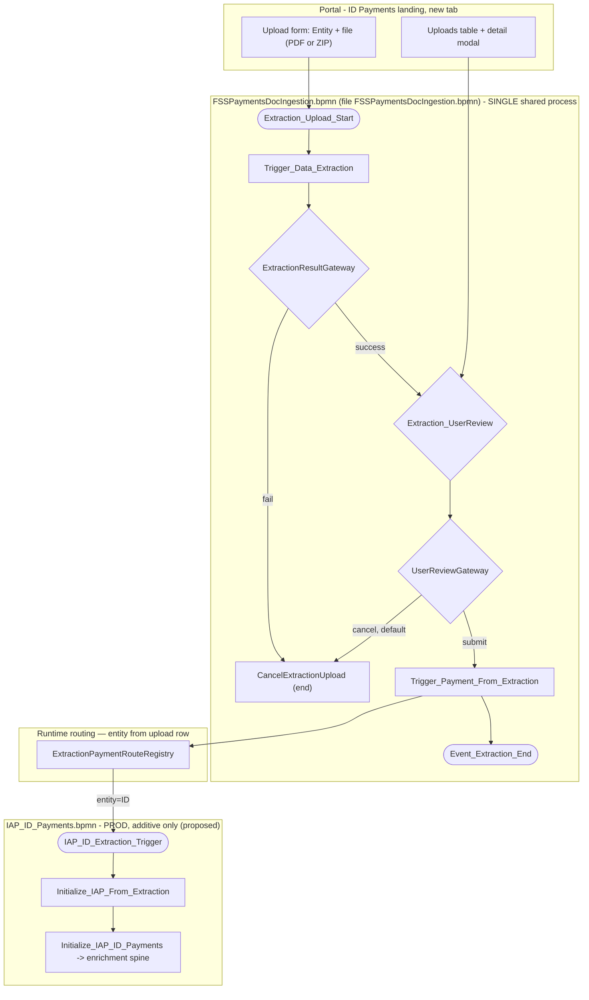
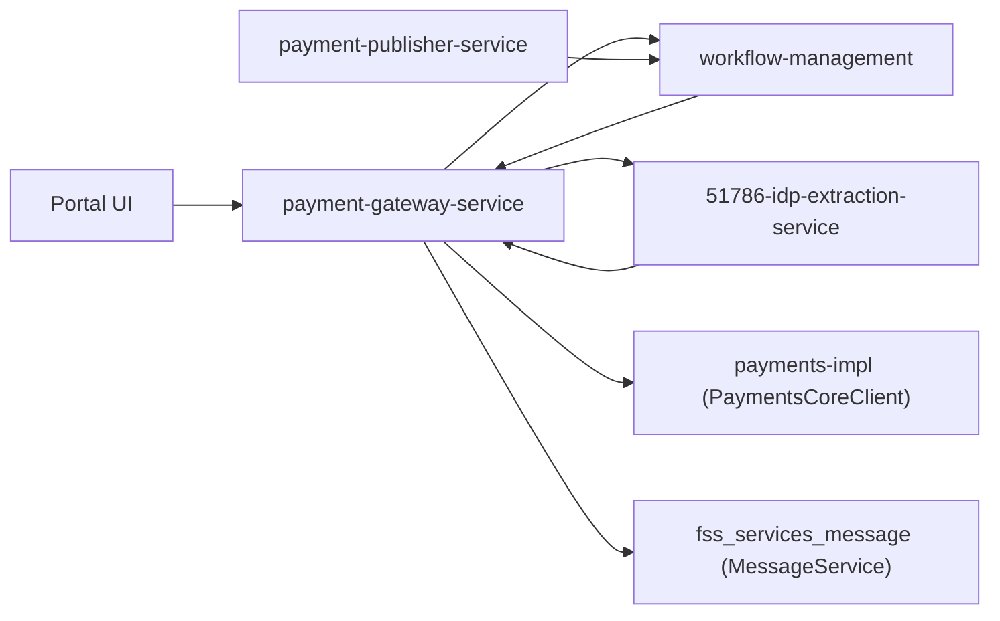
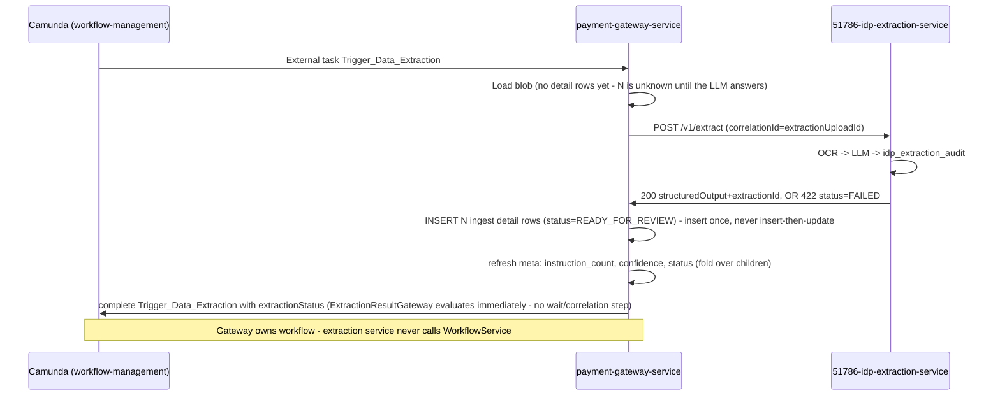
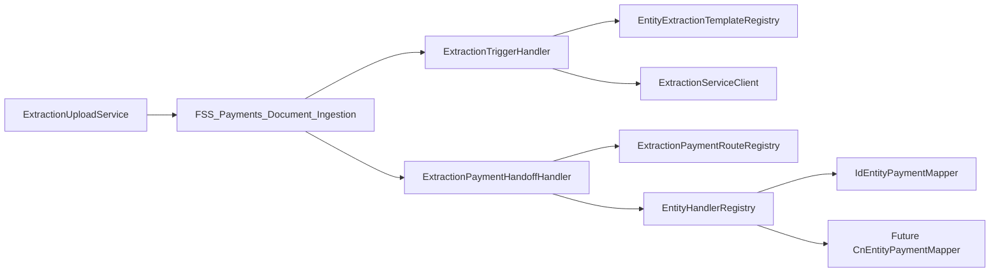
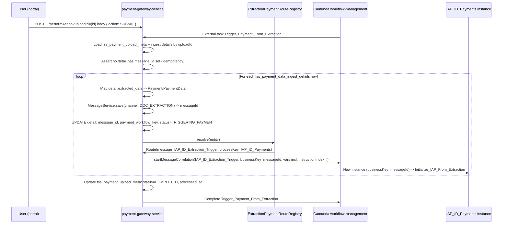
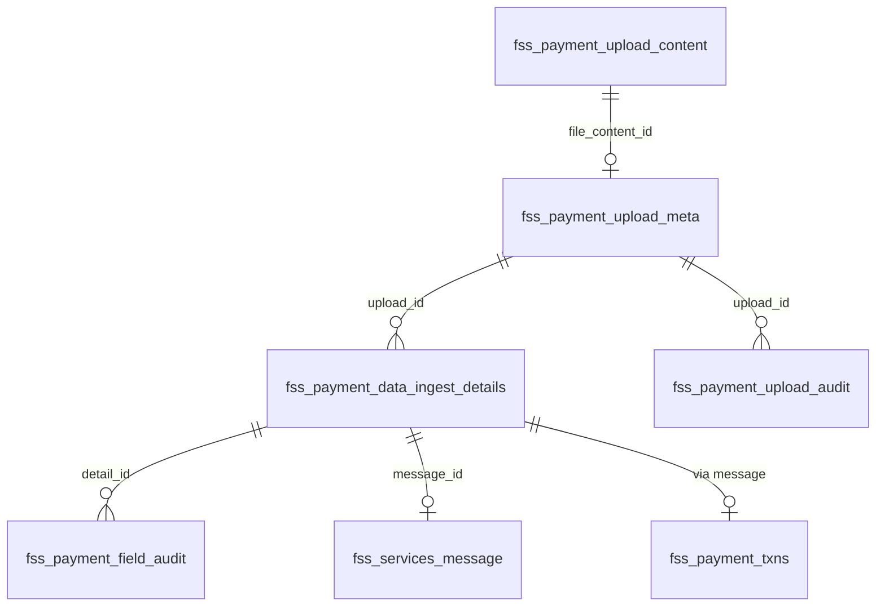
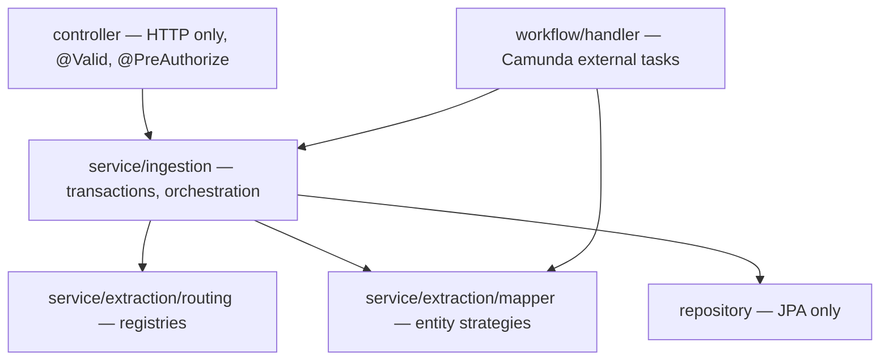

# FSS Payments Document Ingestion — Low Level Design (LLD)

> **Status:** Final v13 — **implementation guide** (extensibility patterns, Java 8/11/17 feature matrix, generics, enterprise layering, interfaces, entity routing, Jackson POJOs, Camunda handlers, document→instruction fan-out and three confidence scopes, nested ZIP + password-protected upload, File ID generation `YYENTYXXXXX`, **PostgreSQL** schema)
> **Created:** 2026-07-30 · **Corrected:** 2026-08-03 (v2/v3) · **Corrected:** 2026-08-04 (v4/v6) · **Corrected:** 2026-08-04 (v7) · **Corrected:** 2026-08-06 (v8) · **Corrected:** 2026-08-07 (v9)
> **Canonical:** **This file (`IDP_LLD.md`) is the only LLD to use for implementation.** Run [IDP_LLD_REPO_SCAN_PROMPT.md](./IDP_LLD_REPO_SCAN_PROMPT.md) against active code repos before coding.
> **Related:** [README.md](./README.md) · [IDP_Document_Ingestion_Design.md](./IDP_Document_Ingestion_Design.md) · [IDP_UX_Design.md](./IDP_UX_Design.md) · [FSSPaymentsDocIngestion.bpmn](./FSSPaymentsDocIngestion.bpmn) · [../IAP_ID_Payments.md](../IAP_ID_Payments.md)

---

## 1. Purpose and scope

Implementable detail for: one common `FSS_Payments_Document_Ingestion` Camunda process (file `FSSPaymentsDocIngestion.bpmn`), an additive trigger proposed on `IAP_ID_Payments.bpmn`, database schema (manual SQL only), REST contracts (built on the **real** `WorkflowServicesController`), and Java/UI implementation strategy.

### 1.1 In scope (v1)

- Landing-page tab UX for Indonesia entity (`entity=ID`)
- `FSS_Payments_Document_Ingestion` workflow (upload → data extraction → single user review → routing to IAP_ID)
- ZIP bulk upload (one upload row + workflow per PDF inside the archive; non-PDF ZIP entries ignored; **configurable nested-folder depth** — default: root + 1 subfolder level)
- Password-protected upload support — ZIP archive encryption and PDF document encryption; password supplied by user at upload time only (**never persisted**)
- Additive 4th entry on `IAP_ID_Payments` (`IAP_ID_Extraction_Trigger`) — **proposal, not applied**
- Manual SQL DDL for `fss_payment_upload_*` + `fss_payment_data_ingest_details` tables
- Gateway REST + external task handlers (new)
- `51786-idp-extraction-service` — **already built**, contract documented as-is

### 1.2 Out of scope (v1)

- New sidebar nav route
- China ETF extraction handoff (registry entry only, phase 2)
- SSTM feedback changes for `channel=DOC_EXTRACTION`
- `51786-document-service` integration (phase 2 — phase 1 uses an in-table `BYTEA` column + lazy fetch)
- Feature flag (none — see §8)
- Liquibase/Flyway (not used anywhere in this codebase — see §5)

### 1.3 Domain glossary

| Term | Table / artifact | Meaning |
|---|---|---|
| **Upload (meta)** | `fss_payment_upload_meta` | One row per PDF file — file name, entity, file-level `status`, link to the stored PDF bytes (`id` = Camunda business key for `FSS_Payments_Document_Ingestion`) |
| **Upload content** | `fss_payment_upload_content` | PDF bytes (lazy-fetched via `file_content_id` on meta) |
| **Ingest detail** | `fss_payment_data_ingest_details` | One row per `initiationDetail` instruction — `extracted_data`, per-instruction `status`, `confidence_score`, workflow keys, `retry`, `error_desc` |
| **Review payload** | `extracted_data` `TEXT` (on ingest details) | Per-instruction JSON `{ header, initiationDetail }` the user views and edits in review |
| **Workflow** | Camunda `FSS_Payments_Document_Ingestion` | Orchestration per PDF upload — passes `uploadId` (= `fss_payment_upload_meta.id`), never OCR/LLM payloads |

---

## 2. Architecture overview

### 2.1 Two-layer BPMN model



**Principle:** OCR, LLM, extraction user review, and upload persistence live **only** in `FSS_Payments_Document_Ingestion`. Payment enrichment, cut-off, S2B, and payment maker/checker stay in `IAP_ID_Payments` — unchanged except for one new message start + one init external task. No BPMN messages are used inside `FSS_Payments_Document_Ingestion` — extraction result and user Submit/Cancel are plain exclusive-gateway decisions on process variables, evaluated the instant the preceding task completes.

### 2.2 Service interaction



| Service | Responsibility |
| --- | --- |
| `51786-payment-gateway-service` | `ExtractionUploadController` (meta + content tables), extraction external task workers, `Trigger_Payment_From_Extraction` routing, `IAPExtractionInitializeHandler`, internal content endpoint for extraction |
| `51786-idp-extraction-service` | OCR client, LLM structuring, `POST /v1/extract`, `GET /v1/extract/{id}`, technical audit (`idp_extraction_audit`) — **already built, unchanged** |
| `51786-workflow-management` | Deploy `FSSPaymentsDocIngestion.bpmn` (process id `FSS_Payments_Document_Ingestion`) + additive `IAP_ID_Payments.bpmn` |
| `51786-document-service` | Phase 2 only — not invoked in phase 1 |
| `51786-payment-publisher-service` | No changes in v1 — existing cut-off/status path runs unchanged after handoff |

### 2.3 Orchestration boundary (unchanged principle, confirmed true in the built service)

`51786-idp-extraction-service`'s own README states: *"No Camunda, payment orchestration, or workflow clients — callers (e.g. payment-gateway-service) own orchestration."* Confirmed in its `pom.xml` — no Camunda/workflow-client dependency present.



**Why the detail rows are inserted *after* the call, not before.** The number of instructions is a property of the LLM output, so there is nothing to insert a row for until `structuredOutput` arrives — the pre-multi-instruction flow of "insert one placeholder row, then update it" cannot be generalized to *N*. Two consequences follow, and both are relied on elsewhere: a `422` or a timeout leaves **zero** detail rows rather than orphaned placeholders (§12.2 #10b), and `UPLOADED` / `PROCESSING` are therefore not reachable states on a detail row (§5.3).

### 2.4 Extensibility design patterns (required for implementation)

New **document types**, **payment entities**, and **LLM template changes** must be addable without modifying core orchestration code. Apply these patterns in `51786-payment-gateway-service`:

| Pattern | Where | Purpose |
|---------|-------|---------|
| **Registry** | `ExtractionPaymentRouteRegistry`, `EntityExtractionTemplateRegistry` | Map `entity` → payment BPMN message + extraction `templateId` |
| **Strategy** | `EntityPaymentMapper` (per entity) | Map `StoredExtractedData` POJO → `Payment` / `PaymentData` |
| **Template method** | `AbstractExtractionExternalTaskHandler` | Shared Camunda lock/retry/complete; subclasses implement `doExecute` |
| **Factory / resolver** | `EntityHandlerRegistry` | `resolve(entity)` → correct `EntityPaymentMapper` bean |
| **Facade** | `ExtractionUploadActionService` | Single orchestration for DB + audit + WFM (all user actions) |
| **Adapter** | `ExtractionServiceClient` | HTTP to `51786-idp-extraction-service`; returns typed `ExtractResponse` POJO |

**Extension scenarios:**

| Change | Touch points | Do **not** change |
|--------|--------------|-------------------|
| New payment entity (e.g. `CN`) | `application.yml` route row + new `CnEntityPaymentMapper` + BPMN message start on that entity's payment process | `FSSPaymentsDocIngestion.bpmn`, `ExtractionTriggerHandler` core loop |
| New LLM template for entity | `entity-templates` config: `entity → templateId` passed in extract request metadata | Extraction service API (still `POST /v1/extract`) |
| LLM JSON shape change for entity | New Jackson POJO package or versioned DTO under `model/extraction/{entity}/` + entity-specific mapper + `FieldGroupCatalog` and `ExtractedDataFieldAccessor` for the new shape | DB schema (`extracted_data` stays `TEXT`, `fss_payment_field_audit` unchanged), the `fields` request/response contract, `ExtractionFieldEditService` |
| New upload file type | New `UploadSourceExtractor` strategy (§9.7) — `Pdf`/`Zip` in v1, future `Xlsx` | Meta/detail tables |



---

## 3. BPMN design

### 3.1 Common process: `FSSPaymentsDocIngestion.bpmn` (file `FSSPaymentsDocIngestion.bpmn`)

| Attribute | Value |
| --- | --- |
| Process ID | `FSS_Payments_Document_Ingestion` |
| Executable | `true` |
| Module | `51786-workflow-management` |
| Country scope | Global — one definition for all countries |

#### Process variables

| Variable | Type | Set by | Purpose |
| --- | --- | --- | --- |
| `extractionUploadId` | String | Upload REST | Business key; correlation id |
| `entity` | String | UI upload form | **Routing key** — selects payment BPMN + LLM template (phase 1: `ID`) |
| `fileId` | String | Upload REST | Business File ID `YYENTYXXXXX` — display and traceability |
| `paymentMaker` | String | Config / upload | Assignee on `Extraction_UserReview` |
| `extractionStatus` | String | `ExtractionTriggerHandler` | `PROCESSING`, `READY_FOR_REVIEW`, `FAILED` — evaluated immediately by `ExtractionResultGateway` on task completion |
| `reviewAction` | String | Portal (Submit/Cancel button) | `SUBMIT` or `CANCEL` — evaluated immediately by `UserReviewGateway` on task completion |

#### Task catalog

| BPMN ID | Type | Topic / message | Handler (proposed) |
| --- | --- | --- | --- |
| `Extraction_Upload_Start` | Start | REST `startWorkflowProcess` after meta + content rows persisted | `ExtractionUploadService` |
| `Trigger_Data_Extraction` | External | `Trigger_Data_Extraction` | `ExtractionTriggerHandler` |
| `ExtractionResultGateway` | Exclusive | - evaluated immediately, no wait state | `${extractionStatus=='READY_FOR_REVIEW'}` (default: `CancelExtractionUpload`) |
| `Extraction_UserReview` | User task | `${paymentMaker}` | Portal modal — user edits extracted fields |
| `UserReviewGateway` | Exclusive | - evaluated immediately | `${reviewAction=='SUBMIT'}` (default: `CancelExtractionUpload`) |
| `Trigger_Payment_From_Extraction` | External | `Trigger_Payment_From_Extraction` | `ExtractionPaymentHandoffHandler` |
| `Event_Extraction_End` | End | — | — |
| `CancelExtractionUpload` | End | — | Reached from `ExtractionResultGateway` (fail) or `UserReviewGateway` (cancel); set status `CANCELLED`/`FAILED` accordingly |

#### No boundary events / no BPMN messages

There are **no boundary events and no `bpmn:message` definitions** in this process. `ExtractionResultGateway` and `UserReviewGateway` are plain exclusive gateways evaluated the instant the preceding external/user task completes.

### 3.2 Entity payment BPMN — additive pattern (template, proposal against real `IAP_ID_Payments.bpmn`)

| Addition | Detail |
| --- | --- |
| Message start | `IAP_ID_Extraction_Trigger` |
| External task | `Initialize_IAP_From_Extraction` (topic `Initialize_IAP_From_Extraction`) |
| Merge | `Initialize_IAP_From_Extraction` -> `Initialize_IAP_ID_Payments` (3rd incoming, alongside the 2 existing: `SequenceFlow_1e0z7n9`, `Flow_0af90pb`) |
| Annotation | *"Triggered from FSS_Payments_Document_Ingestion via Trigger_Payment_From_Extraction when entity=ID"* |

Existing paths frozen: `IAP_ID_AutomatedTrigger`, `IAP_ID_BulkTrigger`, `IAP_ID_Manual_Payment` — no edits to sequence flows, gateway expressions, or existing topics (see [Design doc §3](https://www.google.com/search?q=./IDP_Document_Ingestion_Design.md%233-production-safety--what-must-not-change)).

### 3.3 Handoff flow (`Trigger_Payment_From_Extraction`)



**Why `businessKey=messageId`, not `extractionUploadId`:** the real, already-built `IAP_ID_Payments` convention keys every process instance by `messageId` (confirmed: `IAPIDPaymentsMessageHandler.buildWorkflowReqObj(messageId)`, and downstream handlers resolve the payment record via `PaymentProcessing.getPaymentRecord(businessKey)` — see [IAP_ID_Payments.md](https://www.google.com/search?q=../IAP_ID_Payments.md)). Reusing `extractionUploadId` as the new instance's business key would silently break that convention (Cockpit search, reconciliation, any downstream `getPaymentRecord` lookup). So the `fss_services_message` row (and its `messageId`) is created **before** correlation, not inside `Initialize_IAP_From_Extraction` — see `ExtractionPaymentHandoffHandler` (§9.3).

#### Correlation payload

See [Design doc §6.2](https://www.google.com/search?q=./IDP_Document_Ingestion_Design.md%2362-variables-passed-at-correlation) — uses the **real** `IAP_ID_Payments` variable names (`isApproved`, `isRepaired`), not invented ones.

#### Idempotency

1. Before handoff loop: abort if any `fss_payment_data_ingest_details` row for `upload_id` already has `message_id` set.
2. Each detail row stores `message_id` and `payment_workflow_key` (= `message_id`) after successful correlation.
3. `upload_id` (`fss_payment_upload_meta.id`) is the `FSS_Payments_Document_Ingestion` business key; each `message_id` is the payment instance business key (see §3.3).
4. Double submit → no duplicate correlations (`message_id` guard per detail row).

---

## 4. Entity routing & template config

### 4.0 Routing responsibilities

`FSSPaymentsDocIngestion.bpmn` decides only ingestion-internal gateways. **Payment BPMN selection** and **LLM template selection** are config-driven from `entity` on the upload row.

> **Correction (v7):** `country` and `entity` are the same concept in this platform. Use **`entity` only** — no separate `country` column, process variable, or registry dimension.

| Layer | Responsibility |
|-------|----------------|
| Upload form / meta row | `entity` = routing key (phase 1: `ID` for Indonesia) |
| `EntityExtractionTemplateRegistry` | `entity` → `templateId` for `POST /v1/extract` (phase 1: `ID` → `id-payment-v1`) |
| `ExtractionPaymentRouteRegistry` | `entity` → payment message + process key |
| `EntityHandlerRegistry` | `entity` → `EntityPaymentMapper` implementation |

### 4.1 `application.yml` configuration

**Proposed location:** `51786-payment-gateway-service/src/main/resources/application.yml`

```yaml
extraction:
  payment-routes:
    - entity: ID
      message-name: IAP_ID_Extraction_Trigger
      process-definition-key: IAP_ID_Payments
      initialize-topic: Initialize_IAP_From_Extraction
  entity-templates:
    - entity: ID
      template-id: id-payment-v1
      locale: id-ID               # passed as ExtractRequest.locale — per entity, not hardcoded
  client:                          # ExtractionServiceClient — the one call that can block for 10 min (§7.0)
    base-url: http://51786-idp-extraction-service
    connect-timeout: 10s
    read-timeout: 11m              # must exceed the §7.0 budget; see the edge-timeout row there
  confidence:
    low-threshold: 90              # field-level highlight + lowConfidenceFieldCount (§6.5)
  reconciliation:
    interval: 5m
    stuck-after: 15m               # must exceed the full extraction budget (§7.1)
  file-id:
    sequence-min-width: 5         # zero-padding width only — larger values render wider, never fail
    # ENTY = User Level 1 access: Entity Location + support region/area (4 chars)
    entity-codes:
      ID: IDJY                    # Indonesia phase 1; add a mapping per country / Level-1 combo
  upload:
    enabled: true
    max-file-size-mb: 50
    zip:
      max-folder-depth: 1          # 0 = root entries only; 1 = root + one subfolder level (default)
      max-extracted-pdf-count: 100
      max-uncompressed-size-mb: 500
    password:
      required-when-encrypted: true  # if user leaves slider off but file is encrypted → 400
```

**`extraction.upload.enabled` is the one and only kill-switch key.** Three spellings existed across the design set — `extraction.upload.enabled` here, `extraction-upload.enabled` in §8, and `idp.instruction-upload.enabled` in the UX doc. This one wins because §9.5.4 already wires `@ConditionalOnProperty` against it; the other two are corrected in place. §8's "no feature flag in v1" statement is narrowed accordingly: there is no feature-flag *framework*, but there is this single boolean.

**`upload.max-file-size-mb` must be derived from the container limit, not set independently.** A multipart request larger than `spring.servlet.multipart.max-file-size` is rejected by the servlet container before any application code runs, so the user receives a bare `413` with no `errorCode` body while §9.8.4 and the UI contract assume a `400` with a code. Set the Spring limit slightly **above** `max-file-size-mb` so the application check always fires first and owns the error response; record both values in §13.2. Document the `413` body anyway, because a request that is large for other reasons (many parts, huge headers) can still trip the container.

**Confirm this ceiling against the extraction transport before trusting it** — `ExtractRequest.fileContent` is base64, and the built extraction service caps its OCR client's in-memory body at 16 MB. See §7.0.

**`zip.max-folder-depth` semantics** — depth is measured as the number of path segments **below** the ZIP root (directory entries themselves are not uploaded):

| Entry path in ZIP | Depth | Included when `max-folder-depth=1`? |
|---|---|---|
| `invoice.pdf` | 0 | Yes |
| `batch01/invoice.pdf` | 1 | Yes |
| `batch01/sub/invoice.pdf` | 2 | No — added to `skippedEntries` with reason `EXCEEDS_MAX_DEPTH` |
| `__MACOSX/._invoice.pdf` | varies | No — always skipped (`SYSTEM_ENTRY`) |

Depth is **configurable per environment** via `application.yml`; ops can raise to `2` or `3` without code change. Default `1` matches the business rule: root files plus one level of subfolders.

**Adding a new entity (checklist):**

1. Add a row to `extraction.payment-routes` and to `extraction.entity-templates` (including that entity's `locale`), and add the Level-1 `ENTY` code (Entity Location + support region/area) to `extraction.file-id.entity-codes`.
2. Implement `EntityPaymentMapper` (e.g. `CnEntityPaymentMapper`) and register as Spring bean.
3. Deploy message start + init external task on that entity's payment BPMN.
4. Add LLM template in extraction service (if new JSON shape → new Jackson POJO package).
5. Implement `FieldGroupCatalog` + `ExtractedDataFieldAccessor` for that entity's `initiationDetail` shape and register in `EntityFieldAccessorRegistry`. The review-edit API contract and `fss_payment_field_audit` need **no** change — that is the point of `fieldGroup` / `occurrenceIndex` carrying JSON keys and positions rather than an `id-payment-v1` enum (§5.5).

### 4.2 Java interfaces & config binding

Bind the whole tree by **constructor**, as one immutable graph. Do not mix a mutable setter-bound outer class with immutable nested records — an outer JavaBean needs field defaults like `new FileIdProperties()`, and a record has no no-arg constructor, so that combination does not compile:

```java
// com.sc.fss.paymentgateway.config.extraction.ExtractionProperties
@ConfigurationProperties(prefix = "extraction")
@Validated
public record ExtractionProperties(
    @NotEmpty List<PaymentRouteEntry> paymentRoutes,
    @NotEmpty List<EntityTemplateEntry> entityTemplates,
    @NotNull @Valid ClientProperties client,
    @NotNull @Valid ConfidenceProperties confidence,
    @NotNull @Valid ReconciliationProperties reconciliation,
    @NotNull @Valid FileIdProperties fileId,
    @NotNull @Valid UploadProperties upload
) {}

public record PaymentRouteEntry(
    @NotBlank String entity,
    @NotBlank String messageName,
    @NotBlank String processDefinitionKey,
    @NotBlank String initializeTopic
) {}

public record EntityTemplateEntry(
    @NotBlank String entity,
    @NotBlank String templateId,
    @NotBlank String locale
) {}

public record ClientProperties(
    @NotBlank String baseUrl,
    @NotNull Duration connectTimeout,
    @NotNull Duration readTimeout
) {}

public record ConfidenceProperties(@Min(0) @Max(100) int lowThreshold) {}

public record ReconciliationProperties(
    @NotNull Duration interval,
    @NotNull Duration stuckAfter
) {}

public record FileIdProperties(
    @Min(1) @Max(18) int sequenceMinWidth,
    @NotEmpty Map<String, String> entityCodes
) {
    /** Validate and normalize once, at startup — not on the first upload of a mis-configured country. */
    public FileIdProperties {
        Map<String, String> normalized = new LinkedHashMap<>();
        entityCodes.forEach((entity, enty) -> {
            if (enty == null || enty.length() != 4) {
                throw new IllegalArgumentException(
                    "ENTY code for entity " + entity + " must be exactly 4 characters, was: " + enty);
            }
            normalized.put(entity.trim().toUpperCase(Locale.ROOT), enty);
        });
        entityCodes = Collections.unmodifiableMap(normalized);
    }

    /** ID -> IDJY. Throws for an unmapped entity — never returns null (§9.10 naming rule). */
    public String requireEntyCode(String entity) {
        String enty = entityCodes.get(entity.trim().toUpperCase(Locale.ROOT));
        if (enty == null) {
            throw new UnknownEntityException(entity);
        }
        return enty;
    }
}

public record UploadProperties(
    boolean enabled,
    @Min(1) int maxFileSizeMb,
    @NotNull @Valid ZipUploadProperties zip,
    @NotNull @Valid PasswordUploadProperties password
) {}

public record ZipUploadProperties(
    @Min(0) int maxFolderDepth,
    @Min(1) int maxExtractedPdfCount,
    @Min(1) int maxUncompressedSizeMb
) {}

public record PasswordUploadProperties(boolean requiredWhenEncrypted) {}
```

**Binding notes.** Spring Boot 3 constructor-binds a record automatically; Boot 2.6–2.7 also does, but Boot 2.x **below** 2.6 needs `@ConstructorBinding` on the type. `@Validated` on the properties class is what turns the constraints above into a **startup failure** rather than a `NullPointerException` on the first upload of the day — §9.5.4 promises fail-fast config, and these annotations are what actually deliver it. Registering the type still requires `@EnableConfigurationProperties(ExtractionProperties.class)` (or `@ConfigurationPropertiesScan`) in `ExtractionAutoConfiguration`.

Two validations cannot be expressed as annotations, and each has exactly **one** home:

| Validation | Home | Why there |
|---|---|---|
| Duplicate `entity` keys across `paymentRoutes` / `entityTemplates` | `AbstractKeyedRegistry` constructor (§9.10) | The registry is the thing that would silently lose an entry, and it already builds the map |
| Every `ENTY` code exactly 4 characters | `FileIdProperties` compact constructor, above | The record owns the map; putting the check anywhere else means a caller can read an invalid code before the check runs. `requireEntyCode` lives here for the same reason |

Both throw at startup, not on first use.

**Nested property records are values, not beans.** `ZipUploadProperties`, `FileIdProperties`, `ClientProperties` and the rest are reachable only through `ExtractionProperties` — only that outer type carries `@ConfigurationProperties`, so the nested records are never registered in the application context. A component declaring `UploadEntryFilter(ZipUploadProperties limits)` therefore **fails to start**. Two ways to fix it, and the design uses the second so the component constructors stay narrow (interface segregation, §9.9):

```java
// Option A — inject the root and navigate. Works, but every component now depends
// on the whole config tree to read three ints.
UploadEntryFilter(ExtractionProperties props) { this.limits = props.upload().zip(); }

// Option B (used here) — publish the nested values as beans, once.
@Configuration
@EnableConfigurationProperties(ExtractionProperties.class)
public class ExtractionAutoConfiguration {

    @Bean ZipUploadProperties zipUploadProperties(ExtractionProperties p) { return p.upload().zip(); }
    @Bean PasswordUploadProperties passwordUploadProperties(ExtractionProperties p) { return p.upload().password(); }
    @Bean FileIdProperties fileIdProperties(ExtractionProperties p) { return p.fileId(); }
    @Bean ClientProperties extractionClientProperties(ExtractionProperties p) { return p.client(); }
    @Bean ConfidenceProperties confidenceProperties(ExtractionProperties p) { return p.confidence(); }
    @Bean ReconciliationProperties reconciliationProperties(ExtractionProperties p) { return p.reconciliation(); }

    @Bean Clock clock() { return Clock.systemUTC(); }        // §9.5.6
}
```

Every `@Component` in §9.1 that takes a nested properties record — `UploadEntryFilter`, `ZipArchiveExtractor`, `FileIdGenerator` — depends on these beans existing. This is not optional wiring detail; without it the context does not start.

If the POM is below Java 17, convert these records per the §9.5.2 downgrade table and switch to setter binding with `@Valid` on the nested getters.

```java
// com.sc.fss.paymentgateway.service.extraction.routing
public interface ExtractionPaymentRouteRegistry {
    PaymentRouteEntry resolve(String entity);
}

@Component
public class YamlExtractionPaymentRouteRegistry
        extends AbstractKeyedRegistry<PaymentRouteEntry>
        implements ExtractionPaymentRouteRegistry {

    public YamlExtractionPaymentRouteRegistry(ExtractionProperties props) {
        super(props.paymentRoutes(), PaymentRouteEntry::entity);
    }

    @Override
    public PaymentRouteEntry resolve(String entity) {
        return require(entity);   // throws UnknownEntityException
    }
}
```

```java
public interface EntityExtractionTemplateRegistry {
    String resolveTemplateId(String entity);
}

@Component
public class YamlEntityExtractionTemplateRegistry
        extends AbstractKeyedRegistry<EntityTemplateEntry>
        implements EntityExtractionTemplateRegistry {

    public YamlEntityExtractionTemplateRegistry(ExtractionProperties props) {
        super(props.entityTemplates(), EntityTemplateEntry::entity);
    }

    @Override
    public String resolveTemplateId(String entity) {
        return require(entity).templateId();
    }
}
```

Duplicate-key detection, case/whitespace normalization, and the unknown-entity exception all live in `AbstractKeyedRegistry` — see [§9.10](#910-type-safe-registry-base-one-generic-class-three-registries) for the base class and why it is the one place in this feature that earns a type parameter. Callers inject the **interface**, never the base class.

**Reuse scan:** mirror `CountrySpecificProcessorFactory` / `CountryExcelMsgProcessorFactory` wiring — see [IDP_LLD_REPO_SCAN_PROMPT.md](./IDP_LLD_REPO_SCAN_PROMPT.md).

### 4.3 UI entity selection

See [UX doc §2.4](./IDP_UX_Design.md). On the ID landing page, `entity` defaults to `ID` (hidden or read-only until multi-entity tabs exist).

---

## 5. Database design (PostgreSQL, manual SQL, no Liquibase)

**Target database: PostgreSQL.** All DDL in this section is PostgreSQL syntax. Application code is JPA/JPQL with **one deliberate exception** — the File ID counter statement in §5.1.1, isolated behind the `FileIdSequenceAllocator` interface. Everything else stays dialect-free, but **PostgreSQL is the deployment target and the authoritative test target** (§12); H2 is a fast feedback loop for the parts that do not touch the counter.

**No migration tool (Liquibase/Flyway) exists anywhere in this codebase today.** DDL is delivered as **plain, manually-run `.sql` scripts**.

**Proposed location:** `51786-payment-gateway-service/src/main/resources/sql/manual-ddl/`

```
V1__fss_payment_upload_content.sql
V2__fss_payment_upload_meta.sql
V3__fss_payment_data_ingest_details.sql
V4__fss_payment_upload_audit.sql
V5__fss_payment_file_seq.sql
V6__fss_payment_field_audit.sql
```

### 5.1 Three-table model

The ingestion pipeline uses **three tables** with clear separation of concerns:

| Table | Granularity | Role |
|-------|-------------|------|
| `fss_payment_upload_content` | Per file | PDF byte storage only — never joined in list queries |
| `fss_payment_upload_meta` | Per PDF | File metadata, upload audit fields, file-level `status`, FK to content |
| `fss_payment_data_ingest_details` | Per instruction | One row per `initiationDetail` — extraction result, per-instruction lifecycle, payment handoff keys, `retry`, `error_desc` |



**Relationships (from schema diagram):**

- `fss_payment_upload_meta.file_content_id` → `fss_payment_upload_content.id` (many meta rows could theoretically share content; in practice 1:1 per PDF upload).
- `fss_payment_data_ingest_details.upload_id` → `fss_payment_upload_meta.id` (**1:N** — one PDF upload produces N detail rows when the LLM returns N instructions).
- Camunda `FSS_Payments_Document_Ingestion` business key = `fss_payment_upload_meta.id` (`uploadId`).
- Each detail row's `payment_workflow_key` / `message_id` = `IAP_ID_Payments` business key after handoff.

---

#### `fss_payment_upload_content` (PDF bytes — isolated)

| Column | Type | Null | Notes |
| --- | --- | --- | --- |
| `id` | UUID | N | PK — UUIDv7 (§5.1.3) |
| `file_content` | BYTEA | N | PDF bytes |

**Map `file_content` as a plain `byte[]` — do not annotate it `@Lob`.** On Postgres, Hibernate maps `@Lob byte[]` to an `oid` **large object**, not to `BYTEA`. Large objects live in `pg_largeobject`, are not deleted when the referencing row is deleted (they need an explicit `lo_unlink` or `vacuumlo`, so they leak silently), and require the read to happen inside the same transaction. Plain `byte[]` maps to `BYTEA` and behaves like any other column. The same rule applies to `extracted_data` and audit `details`: map them as plain `String`, because `@Lob String` on Postgres becomes an `oid` too. This is the single most common defect when a JPA model written against Oracle is pointed at Postgres — Oracle needs `@Lob` for `CLOB`/`BLOB`, Postgres is actively harmed by it.

---

#### `fss_payment_upload_meta` (per PDF file)

| Column | Type | Null | Notes |
| --- | --- | --- | --- |
| `id` | UUID | N | PK — UUIDv7 (§5.1.3); **Camunda business key** for `FSS_Payments_Document_Ingestion`, passed as `id.toString()` |
| `batch_id` | UUID | Y | Shared by all PDFs extracted from one ZIP upload |
| `file_id` | VARCHAR(32) | N | Business File ID: `YYENTYXXXXX` (§5.1.1). **Single source of truth** — `YY`, `ENTY`, and the sequence are not stored separately. Column is deliberately oversized so sequence growth never needs a migration |
| `file_name` | VARCHAR(255) | N | Original PDF file name |
| `entity` | VARCHAR(50) | N | **Routing key** — phase 1: `ID`; selects payment BPMN + LLM template |
| `status` | VARCHAR(30) | N | File-level lifecycle (§5.3). Workflow-driven up to `READY_FOR_REVIEW`, then a **fold over child detail statuses** (§5.3.2) — never a copy of one child's status |
| `file_content_id` | UUID | N | FK → `fss_payment_upload_content.id` |
| `uploaded_by` | VARCHAR(100) | N | |
| `uploaded_at` | TIMESTAMPTZ | N | Sort key (DESC); also the source of `YY` in the File ID |
| `processed_at` | TIMESTAMPTZ | Y | Set when all details reach terminal state |
| `remarks` | VARCHAR(500) | Y | Last cancel reason (also in audit) |
| `approved_by` | VARCHAR(100) | Y | User who submitted for routing (set on `SUBMITTED`) |
| `approved_at` | TIMESTAMPTZ | Y | When user submitted (`SUBMITTED`) |
| `instruction_count` | SMALLINT | N | Default `0` — **denormalized** count of child detail rows, i.e. the length of the LLM `initiationDetail[]` (§6.2.3). Authoritative count for the document; do **not** read `header.TotInst` from a row's JSON instead |
| `confidence` | NUMERIC(5,2) | Y | **Denormalized** document-level LLM confidence — the payload's whole-file score, else `AVG(confidence_score)` across details (§6.4). `NULL` before extraction creates rows |
| `version` | BIGINT | N | Default `0` — JPA `@Version`. Optimistic lock for status transitions and aggregate refreshes; see §5.5 |

**List-query rule:** `getUploads` reads `instruction_count` and `confidence` from **meta only** — no `COUNT`/`JOIN` to `fss_payment_data_ingest_details` on list or poll. Refreshed on write paths (§5.1.2).

**Phase 2 (optional):** per-instruction low-confidence rollups — **not in v1**; the modal derives low-confidence counts from `extracted_data` per instruction.

**Constraints / indexes:** `UNIQUE (file_id)` — the uniqueness guarantee for the whole feature; `idx_payment_upload_meta_entity` (`entity`), `idx_payment_upload_meta_batch` (`batch_id`), `idx_payment_upload_meta_status_ts` (`status`, `uploaded_at` DESC), `idx_payment_upload_meta_user` (`uploaded_by`, `uploaded_at` DESC).

**No exploded File ID columns.** `YY`, `ENTY`, and the sequence are **not** stored as separate columns. The composition is injective — the prefix is fixed-width, so one `file_id` maps to exactly one `(year, enty, sequence)` triple and back. `UNIQUE (file_id)` is therefore exactly as strong as a composite unique on the parts, and storing both would be duplicated state that can drift. Queries scoped to a year or access code use a prefix match (`file_id LIKE '26IDJY%'`); row ordering uses `uploaded_at`, which is the sort key the UI already uses.

> **Postgres caveat if that prefix query is ever put on a hot path.** The btree index behind `UNIQUE (file_id)` is built with the database's default collation, and in any non-`C` locale (`en_US.UTF-8` and friends) Postgres **cannot** use it for `LIKE 'prefix%'` — the query degrades to a sequential scan. Either add a companion index declared with the pattern operator class, or keep the prefix filter off hot paths:
>
> ```sql
> CREATE INDEX idx_payment_upload_meta_file_id_prefix
>     ON fss_payment_upload_meta (file_id varchar_pattern_ops);
> ```
>
> Not created in v1 — no current screen filters by File ID prefix, and the UNIQUE index already serves exact-match lookups regardless of collation. The allocator's own `(file_year, file_enty)` columns live on `fss_payment_file_seq`, where they are the primary key rather than derived data.

**Upload metadata (`dept_id`, `process_id`, `sub_process_id`, `activity_id`, `sub_activity_id`) is not stored on meta.** These values are country-specific and are not captured from the UI, so v1 keeps them out of the schema entirely. If a country later needs them for routing or for the LLM `metadata` map, resolve them server-side from entity configuration (§4) rather than reintroducing columns. The like-named columns on `fss_payment_data_ingest_details` have also been removed, for a separate reason — see §5.1 on that table.

#### 5.1.1 File ID generation

**Format:** `file_id = YY + ENTY + XXXXX` — one ID per identified file, no suffix.

| Segment | Width | Source |
| --- | --- | --- |
| `YY` | Fixed 2 | Year of the file upload timestamp — e.g. `26` |
| `ENTY` | Fixed 4 | User Level-1 access (Entity Location + support region/area) from `extraction.file-id.entity-codes`; `IDJY` for Indonesia |
| `XXXXX` | **Minimum** 5, grows | System-generated sequence, zero-padded to `file-id.sequence-min-width` |

Examples: `26IDJY00001`, `26IDJY00002`, `26IDJY99999`, `26IDJY100000`, `26IDJY1000000`.

##### Why the sequence never runs out

The sequence is allocated as an **unbounded number** and padding is a **rendering concern only**. At `99999` the next value renders as `100000` — six characters — and the system keeps running with no format break, no migration, and no exhaustion error. Fixed-width padding with a hard ceiling is what creates the "we ran out of digits" problem; this design has no ceiling.

This stays unambiguous because **the prefix is fixed-width**, so the sequence is simply everything after character 6:

```
year = fileId.substring(0, 2)
enty = fileId.substring(2, 6)
seq  = Long.parseLong(fileId.substring(6))     // any length
regex: ^(\d{2})([A-Z0-9]{4})(\d{5,})$
```

**Scope and reset:** the sequence is unique per **`(YY, ENTY)`** and restarts at `1` each calendar year and for each new Level-1 access code. Capacity at the 5-wide default is 99,999 files per code per year *before padding grows* — and growth is automatic, so the product-stated 5 digits is satisfied today without capping the future.

**Consequences to respect in code:**

- Never sort or range-compare on `file_id` as a string — `26IDJY100000` sorts before `26IDJY99999` lexicographically. Order by `uploaded_at`; parse the suffix to a `long` if numeric ordering is ever genuinely needed.
- Never assume `file_id.length() == 11`. Size DB columns, DTOs, and UI widths from `VARCHAR(32)`.
- Changing `sequence-min-width` later only changes padding of **new** IDs; existing IDs are never rewritten. Treat stored IDs as opaque, and match with `\d{5,}`.

##### Assignment order

1. Identify every eligible PDF **first** — direct upload or all ZIP entries that pass the depth/extension filters.
2. Sort the identified files by file upload timestamp ascending.
3. Break equal timestamps by normalized `sourcePath` ascending, then discovery ordinal ascending. A directly uploaded PDF uses its normalized file name as `sourcePath`.
4. Allocate one sequence value per file in that order, compose `file_id`, and persist it as the only File ID column on the meta row.

Assignment completes **before** any workflow starts, so parallel processing cannot reorder IDs. `file_id` — never `file_name` — is the identity, so the same base name in two different ZIP folders receives two different IDs.

##### Sequence allocation — one atomic statement

The counter is **persisted in the database** so it survives restarts and is shared by all service instances. Allocation is a **single atomic `INSERT … ON CONFLICT DO UPDATE … RETURNING`**. There is no read-then-write window, so there is nothing to retry, no optimistic-locking token, and no separate branch for the first upload of a `(year, ENTY)` partition:

```sql
INSERT INTO fss_payment_file_seq AS s (file_year, file_enty, next_val, updated_at)
VALUES (:year, :enty, 1 + :count, :now)
ON CONFLICT (file_year, file_enty) DO UPDATE
   SET next_val = s.next_val + :count,
       updated_at = :now
RETURNING next_val - :count
```

`RETURNING next_val - :count` yields the **first reserved value** on both paths. On insert, `next_val` is `1 + count`, so it returns `1`. On conflict, `s.next_val` is the pre-update value, so it returns exactly where the previous allocation stopped. Reserving `n` values for a ZIP of `n` PDFs is the same one statement as reserving one.

```java
// com.sc.fss.paymentgateway.service.extraction.fileid.FileIdSequenceAllocator
public interface FileIdSequenceAllocator {
    /** Reserve `count` contiguous values for one (year, enty) partition. */
    long[] allocate(String fileYear, String fileEnty, int count);
}
```

```java
@Component
class PostgresFileIdSequenceAllocator implements FileIdSequenceAllocator {

    private static final String ALLOCATE_SQL =
        "INSERT INTO fss_payment_file_seq AS s (file_year, file_enty, next_val, updated_at) "
      + "VALUES (:year, :enty, 1 + :count, :now) "
      + "ON CONFLICT (file_year, file_enty) DO UPDATE "
      + "   SET next_val = s.next_val + :count, updated_at = :now "
      + "RETURNING next_val - :count";

    private final NamedParameterJdbcTemplate jdbc;
    private final Clock clock;                       // never Instant.now() — see §9.5.6

    PostgresFileIdSequenceAllocator(NamedParameterJdbcTemplate jdbc, Clock clock) {
        this.jdbc = jdbc;
        this.clock = clock;
    }

    @Override
    @Transactional(propagation = Propagation.REQUIRES_NEW)
    public long[] allocate(String fileYear, String fileEnty, int count) {
        Long start = jdbc.queryForObject(ALLOCATE_SQL, new MapSqlParameterSource()
                .addValue("year", fileYear)
                .addValue("enty", fileEnty)
                .addValue("count", count)
                .addValue("now", Timestamp.from(clock.instant())), Long.class);
        return LongStream.range(start, start + count).toArray();
    }
}
```

`REQUIRES_NEW` keeps the counter write in its own short transaction, independent of the slow upload transaction that calls it. The row lock is held for the duration of one statement, so concurrent uploads serialise for microseconds rather than contending.

**There is no JPA entity, composite-id class, or repository for this table.** `fss_payment_file_seq` is an internal counter, never read as a domain object and never joined — mapping it as an entity would add three classes and buy nothing. This is the one place in the feature where `JdbcTemplate` beats JPA.

**Why this is native SQL when the rest of the feature is not.** Earlier revisions used a vendor-neutral compare-and-swap in JPQL, written when the target database was still open. That cost five classes, a retry loop with backoff, and a page of caveats about persistence-context eviction and Postgres transaction-abort semantics — all to avoid one statement. With PostgreSQL confirmed, **portability now lives at the `FileIdSequenceAllocator` seam instead of inside every statement**: a different engine means one new implementation of that interface, not a different design. That is what the interface was always for. Nothing else in the feature uses native SQL (§9.5.3).

**Isolation.** Correct at `READ COMMITTED`, the Postgres default: a concurrent writer blocks on the row lock and the `DO UPDATE` then applies to the committed row. Under `REPEATABLE READ` or `SERIALIZABLE`, a conflicting `ON CONFLICT DO UPDATE` can abort with `40001 could not serialize access`; if a global isolation level is ever raised, wrap the call in a retry that treats `SQLState 40001` as retryable. Confirm the server's default in the repo scan (§13.2).

**A Postgres `SEQUENCE` is still the wrong tool**, for the reason it always was: the counter must be **partitioned by `(year, ENTY)` and restart at `1` every January**. That would mean one `SEQUENCE` object per country per year, created and reset by a scheduled DDL job. The counter table expresses the same thing as **one row**, inserted lazily by the first upload of the year.

**Why each piece matters:**

| Concern | Handling |
| --- | --- |
| Concurrency across instances | Atomic single statement — no read-then-write window, so no lost update is possible and no application-level retry exists |
| First upload for a new `(year, enty)` | `ON CONFLICT` handles insert and update in one statement; no create branch, no unique-violation catch |
| Lock duration | One statement inside `REQUIRES_NEW` — the counter transaction never waits on the slow upload transaction |
| Bulk ZIP upload | One call reserves all `n` values in a single round trip |
| Portability | Behind `FileIdSequenceAllocator` — a second engine is a second implementation, not a redesign |
| Correctness backstop | `UNIQUE (file_id)` on the meta table — a duplicate can never be persisted even if an allocator is faulty |

**Gaps are acceptable:** a rolled-back upload skips its reserved values. File IDs are unique identifiers, not a gapless audit count — do not add logic that depends on contiguity.

##### Composing the ID

```java
@Component
public class FileIdGenerator {

    private final FileIdSequenceAllocator allocator;
    private final FileIdProperties properties;

    /** Files must already be sorted by upload timestamp ascending. */
    public List<String> generate(Instant uploadTimestamp, String entity, int fileCount) {
        String fileYear = DateTimeFormatter.ofPattern("yy")
                .withZone(ZoneOffset.UTC).format(uploadTimestamp);
        String fileEnty = properties.requireEntyCode(entity);   // ID -> IDJY

        long[] sequences = allocator.allocate(fileYear, fileEnty, fileCount);
        List<String> fileIds = new ArrayList<>(fileCount);
        for (long sequence : sequences) {
            fileIds.add(fileYear + fileEnty + pad(sequence));
        }
        return fileIds;
    }

    /** Pads to the configured width; longer values are returned in full. */
    private String pad(long sequence) {
        return String.format("%0" + properties.sequenceMinWidth() + "d", sequence);
    }
}
```

`String.format("%05d", …)` pads short values and leaves longer ones untouched, so `100000` renders as `100000` rather than being truncated or rejected. That single line is what makes the format survive overflow.

**DDL for the counter table** (PostgreSQL syntax for this deployment; the JPA entity above generates the equivalent on any other dialect):

```sql
-- V5__fss_payment_file_seq.sql
CREATE TABLE fss_payment_file_seq (
    file_year   VARCHAR(2)   NOT NULL,
    file_enty   VARCHAR(4)   NOT NULL,
    next_val    BIGINT       DEFAULT 1 NOT NULL,
    updated_at  TIMESTAMPTZ  NOT NULL,
    CONSTRAINT pk_payment_file_seq PRIMARY KEY (file_year, file_enty)
);
```

`VARCHAR` rather than `CHAR` for the two key columns: Postgres blank-pads `CHAR(n)`, and a padded value read back into the entity's `String` field would no longer equal the `ENTY` code the allocator was called with. `BIGINT` matches the `long nextVal` field exactly, so a sequence can run to 9.2 × 10¹⁸ before the type — rather than the format — becomes the limit.

---

#### `fss_payment_data_ingest_details` (per instruction — core pipeline row)

| Column | Type | Null | Notes |
| --- | --- | --- | --- |
| `id` | UUID | N | PK — UUIDv7 (§5.1.3) |
| `upload_id` | UUID | N | FK → `fss_payment_upload_meta.id`; **also the `FSS_Payments_Document_Ingestion` business key** for this row |
| `instruction_index` | SMALLINT | N | 0-based position in LLM `initiationDetail[]` |
| `status` | VARCHAR(30) | N | Per-instruction lifecycle (§5.3). Same `UploadStatus` enum as meta but **six reachable values of the eight** — rows are inserted directly as `READY_FOR_REVIEW`, so neither `UPLOADED` nor `PROCESSING` ever occurs |
| `extraction_id` | VARCHAR(36) | Y | `extractionId` from `51786-idp-extraction-service` (shared across details from same OCR pass) |
| `extracted_data` | TEXT | Y | Per-instruction JSON: `{ "header": {…}, "initiationDetail": {…} }` — maker edits merged in place |
| `confidence_score` | NUMERIC(5,2) | Y | From `initiationDetail.Confidence1` (parsed double) — drives the meta `confidence` rollup |
| `trn_typ` | VARCHAR(50) | Y | Transaction type from `TransactionDetails.TrnTyp` — **the only business field promoted to a column**, because instructions are grouped by it |
| `message_id` | VARCHAR(36) | Y → **N after handoff** | **Mandatory link to `fss_services_message`** — created **before** `startMessageCorrelation`; becomes IAP business key. `NOT NULL` when `status IN (TRIGGERING_PAYMENT, COMPLETED)`. Type follows `fss_services_message`, not this design |
| `payment_workflow_key` | VARCHAR(36) | Y | = `message_id` after handoff (same convention as existing IAP handlers) |
| `handoff_message_name` | VARCHAR(100) | Y | e.g. `IAP_ID_Extraction_Trigger` — audited registry resolution |
| `started_at` | TIMESTAMPTZ | Y | Extraction/handoff attempt start |
| `completed_at` | TIMESTAMPTZ | Y | Terminal state reached |
| `updated_by` | VARCHAR(100) | Y | Last actor/handler |
| `updated_at` | TIMESTAMPTZ | Y | |
| `retry` | SMALLINT | N | Default `0`; incremented on a retried **payment handoff** only. Re-extract is dropped (§7.3), so this counter has exactly one writer |
| `error_desc` | VARCHAR(500) | Y | Human-readable failure reason (extraction `422`, timeout, handoff error). **Never cleared** — nothing re-opens a row, so a failure reason is permanent (§7.3) |
| `version` | BIGINT | N | Default `0` — JPA `@Version`. **Required, not optional:** `extracted_data` is edited by read-modify-write of a whole JSON document (§5.5), which is the classic lost-update shape. See §5.5 |

**Unique constraint:** `(upload_id, instruction_index)`.

**Indexes:** `idx_ingest_details_upload` (`upload_id`), `idx_ingest_details_status` (`status`), `idx_ingest_details_message` (`message_id`), `idx_ingest_details_trn_typ` (`upload_id`, `trn_typ`).

**No denormalized business fields.** This is an **interface parsing system**: `extracted_data` is the record of what was parsed, and duplicating fields out of it into columns creates two copies that drift the moment a maker edits a value. `tx_ref`, `sub_activity_id`, `activity_id`, `value_date`, `client_name`, `debit_amount`, and `low_confidence_field_count` are therefore **not** stored. `trn_typ` is the single exception — instructions are grouped by transaction type, so it earns a column and an index.

Everything else the modal displays is read from `extracted_data`. The gateway parses it once when building the `getDetail` response (§9.7), so the frontend never walks the `{ Name, Value, Confidence }` triples itself. The low-confidence count comes from the same pass — every field already carries a `Confidence`, so counting those below the threshold needs no stored column and cannot go stale after a maker edit. This costs nothing on the list path, because `getUploads` reads `fss_payment_upload_meta` only and never touches detail rows (§5.1.2).

**No `extraction_workflow_key`.** It was defined as always equal to `upload_id`, which is already on the row as the foreign key — the same duplication removed elsewhere on this table, costing a second key-width column and an index on every instruction. Code that needs the ingestion business key reads `upload_id` directly. The name is retained only where it describes a *concept* (the `FSS_Payments_Document_Ingestion` business key); it is not a column. Note the asymmetry with `payment_workflow_key`, which **is** kept: that one equals `message_id` today by convention, but it points at a process in another system whose keying we do not control, so it stays an explicit column.

**No `handoff_at`.** The handoff timestamp is not kept on the row. `fss_payment_upload_audit` already records `HANDOFF_STARTED` / `HANDOFF_COMPLETE` / `HANDOFF_FAILED` with `created_at`, which is the audit trail of record; `message_id` being non-null is what marks the handoff as done.

**No `approved_by` / `approved_at` — approval is file-level.** There is exactly **one** `Extraction_UserReview` task per file, and the maker submits the whole file with a single `performAction` call; detail rows move to `SUBMITTED` in bulk. Per-instruction approval is deliberately **not** supported: partial approval would leave the single review task unable to complete, stalling the process instance. The approving user and timestamp therefore live only on `fss_payment_upload_meta`, where the action actually happened, instead of being copied onto all N detail rows.

**No `payment_id` — this is a production-safety constraint, not just schema trimming.** Backfilling a payment id onto the detail row would mean writing back from inside the payment process after `Save_Payment_Transaction`, which requires editing the **existing** `ID_payments.bpmn` external task implementor. That path is frozen ([Design §3](./IDP_Document_Ingestion_Design.md#3-production-safety--what-must-not-change)), so the column is dropped.

The **View payment** link still works, because the ingestion side already holds everything needed to find the payment:

- `message_id` is the `IAP_ID_Payments` business key, written by **our** handoff handler at correlation time.
- The payment reference is read on demand during `getDetail` via the existing `MessageService.getMessage(message_id).getFuncId()`.

That is a **read** performed by the gateway, so no existing handler, BPMN, or external task changes. If `getFuncId()` is still null — the payment has not reached `Save_Payment_Transaction` yet — return `paymentRef` as `null` and the UI simply omits the link for that instruction.

**Why one row per instruction:** each row is the **complete lifecycle record** for one `initiationDetail` → one `fss_services_message` → one `IAP_ID_Payments` instance. Do **not** deprecate `message_id` — it is the mandatory handoff anchor required by `ID_payments.bpmn` (business key = `messageId`). There is no separate handoff table; tracking lives on this row.

**Handoff invariant (application-enforced):**

```
FOR each detail WHERE status transitions to TRIGGERING_PAYMENT or COMPLETED:
  1. MessageService.save(channel=DOC_EXTRACTION) → message_id  (REQUIRED)
  2. UPDATE detail SET message_id, payment_workflow_key=message_id, handoff_message_name
  3. startMessageCorrelation(..., businessKey=message_id)
  4. Abort if message_id IS NULL before correlate
```

Partial handoff: details that already have `message_id` are skipped on retry; details without `message_id` are retried. `retry` + `error_desc` capture per-instruction failures.

**`retry` / `error_desc` usage:**

| Scenario | `retry` | `error_desc` |
| --- | --- | --- |
| Extraction fails (HTTP 422) | unchanged | OCR/LLM error from extraction service — but note **no detail rows exist** on this path (§2.3), so this is recorded on meta, not here |
| Extraction timeout (exhausted Camunda retries) | unchanged | e.g. `OCR_TIMEOUT` — same caveat |
| Handoff correlate fails | `retry + 1` | correlation error message |
| Handoff succeeds after a retry | unchanged | cleared |

`retry` therefore only ever counts **handoff** attempts for a row that already exists. There is no re-extract scenario (§7.3), and extraction failures never reach this table because the rows are inserted only after extraction returns.

---

#### `fss_payment_field_audit` (per changed field — the maker's review edit trail)

The maker overrides machine-extracted values that become real payment instructions, so **what** they changed has to be recorded, not just that they saved. Before this table, the only trace of a field edit was `updated_by` / `updated_at` on the detail row — no field name, no before-value, no way to answer "who changed this debit account number".

**Two audit grains, two tables — deliberately not merged:**

| Question | Grain | Table |
| --- | --- | --- |
| "What happened to this file, in order?" | One row per **user action** | `fss_payment_upload_audit` |
| "Who changed `DrAccNo` on instruction 7, from what to what?" | One row per **changed field** | `fss_payment_field_audit` |

Serving the second question from the first table's `details` `TEXT` column would mean JSON-parsing every audit row for a file to answer a field question, and would make cross-file queries ("which fields do makers override most?") impossible.

| Column | Type | Null | Notes |
| --- | --- | --- | --- |
| `audit_id` | BIGINT | N | PK — `GENERATED ALWAYS AS IDENTITY`; append-only, never updated |
| `detail_id` | UUID | N | FK → `fss_payment_data_ingest_details.id` — the instruction whose field changed. **The only identity column**; `upload_id` is reached through it |
| `extraction_id` | VARCHAR(36) | Y | Extraction **generation** the edit was made against — not an identity column, see below |
| `field_group` | VARCHAR(50) | N | The **JSON container key** the field lives in, verbatim — for `ID`: `TransactionDetails`, `DebitDetails`, `CreditDetails`. Entity-scoped vocabulary, not a fixed enum |
| `occurrence_index` | SMALLINT | Y | 0-based position within a **repeating** group; `NULL` when the group is not a list. For `ID`: `NULL` on `TransactionDetails`, the `details[]` index on `DebitDetails` / `CreditDetails` |
| `field_name` | VARCHAR(50) | N | The `Name` from the `{ Name, Value, Confidence }` triple (§6.2.1 / §6.2.2) |
| `old_value` | TEXT | Y | Value before the edit; `NULL` only when the field did not previously exist |
| `new_value` | TEXT | Y | Value after the edit |
| `edited_by` | VARCHAR(100) | N | Maker who made the edit — always a human, never a system component |
| `created_at` | TIMESTAMPTZ | N | |

**Indexes:** `idx_field_audit_detail` (`detail_id`, `created_at DESC`) — the edit trail for one instruction, and the join target for the per-file trail; `idx_field_audit_field` (`field_name`, `created_at DESC`) — cross-file override reporting.

**No `upload_id`.** The audit screen is per file, but it also has to *display* which instruction each edit belongs to — instruction number, `TxRef`, `trnTyp` — all of which live on `fss_payment_data_ingest_details`. The join to that table therefore happens on every audit read regardless, so denormalizing `upload_id` here would buy nothing and add a second key column plus an index to every row. `WHERE d.upload_id = ?` on the already-indexed detail row is the file-scoped query.

**This is now unconditional.** Earlier revisions qualified it — "holds only while re-extract resets detail rows in place" — because a re-extract that *replaced* rows would orphan the audit trail. With re-extract dropped (§7.3), a detail row is created once and never reset or replaced, so the row it points at is guaranteed to outlive the audit row.

**`extraction_id` is now redundant — decide whether to keep it.** It was never an identity column; it recorded *which extraction run the edited value came from*, so that a maker who edited, re-extracted, and edited again did not leave two indistinguishable sets of audit rows describing before-values from different generations. **With one extraction per upload (§7.3) there is exactly one generation, so the column holds the same value for every row of an upload and carries no information.** A second attempt at a document is a new `uploadId` with its own detail rows and its own trail, which partitions the generations naturally.

Keep it only as forward-compatibility for a future re-extract, and if you keep it, say in the DDL comment that it is invariant per upload — otherwise the next reader will assume generations exist and write a query that silently returns everything. Dropping it is also defensible; it is 36 characters per corrected field, not per row of the main table.

**No `old_confidence`.** Dropped: it duplicates data that is already retained. §5.5 rule 3 guarantees the maker's edit replaces `Value` only and never touches `Confidence`, so the original LLM score for an edited field is still sitting in `extracted_data` and can be read from there if an override-risk report is ever wanted. Nothing is lost by not copying it, and the design elsewhere consistently refuses to store a second copy of a value it already holds.

**Why `edited_by` and not `actor`.** The sibling table uses `actor` because its rows can be written by the system — `HANDOFF_COMPLETE` and `EXTRACT_FAILED` have no human behind them. Every row in *this* table is a person editing a field, so the narrower name is accurate and the difference between the two columns is deliberate rather than an inconsistency. `created_by` was rejected as ambiguous: it reads as "who created the audit row".

**Why `field_group` / `occurrence_index` and not `section` / `leg_index`.** The addressing has to outlive the Indonesia payload shape. `TRANSACTION` / `DEBIT` / `CREDIT` and the word *leg* both come from `id-payment-v1` — a different entity's template may have no debit/credit split, different container names, or a different nesting depth (§2.4 already anticipates a new Jackson POJO package per entity). Anything entity-specific baked into an audit column forces a schema change the first time a second country ships, and audit tables are the worst place to take a migration.

Two properties make the replacement generic:

| Property | Effect |
| --- | --- |
| `field_group` holds the **real JSON key**, not an invented token | No per-entity translation table between an enum like `DEBIT` and the container it means. The value is self-describing in any payload shape, and the accessor needs no mapping step |
| `occurrence_index` names a *position within a repeating group*, not a payment leg | Applies unchanged whether the repeating thing is a debit leg, a tax line, or a settlement instruction — and is simply `NULL` for groups that do not repeat |

`field_group` and `field_name` are **entity-scoped vocabulary**: `DrAccNo` means something under `ID` and may mean nothing under another entity. Cross-entity reporting must therefore group by entity (reached via `detail_id → upload_id → entity` on meta) rather than aggregating on `field_name` alone. Within one file — the per-file audit screen — the entity is already known, so no extra join is needed.

**The header stays unreachable by construction** even though `field_group` is now a free string rather than an enum: `ExtractedDataFieldAccessor` resolves the group *relative to the `initiationDetail` node*, never from the document root, so a group named `header` cannot resolve no matter what a caller sends (§6.2.3).

**Why `TEXT` for the values, not `VARCHAR(n)`.** Narration lines and client names have no reliable upper bound, and a silently truncated audit record is worse than a wide column. Map as plain `String`, never `@Lob` (§5.1 note on Postgres `oid`).

**The FK on `detail_id` is safe** for the same reason as the missing `upload_id` above: a detail row is inserted once and never reset or replaced (§7.3), so its `id` is stable for the life of the upload and the trail stays attached. The rule that would have been at risk — an append-only trail must never become deletable by a functional operation — is now structurally guaranteed rather than dependent on how re-extract was implemented.

**Sensitivity.** `DrAccNo`, `CrAccNo`, and `ClntNm` land here in plaintext. That is the same sensitivity class as `extracted_data`, so no new data category is introduced — but it is a new place the data lives, so table-level access control and the retention policy must match whatever governs `fss_services_message`. Confirm the retention rule in the repo scan (§13.2).

**Volume** is proportional to *corrections*, not to fields — untouched fields write nothing (see the write rules in §5.5), so this table stays small relative to `fss_payment_data_ingest_details`.

#### 5.1.2 File-level aggregates on meta (denormalized — not computed on list read)

The uploads table shows **instruction count** and **overall confidence** per **PDF file**. That is **file-level** data — store on `fss_payment_upload_meta`, not via live aggregation on every `getUploads` (polls every 5s while processing).

| UI / API field | DB column (`fss_payment_upload_meta`) | Computation (on refresh only) |
| --- | --- | --- |
| `instructionCount` | `instruction_count` | Number of detail rows for `upload_id` |
| `confidence` | `confidence` | **Document-level LLM confidence** — the payload's own whole-file score, falling back to `AVG(confidence_score)` across the instruction rows when it is absent or unparseable (single instruction → that row's `Confidence1`); `NULL` before extraction. §6.4 has the precedence rule and the scan items |

**Which table:** only **`fss_payment_upload_meta`** holds file-level rollups. **`fss_payment_data_ingest_details`** holds the per-instruction `confidence_score` the average is computed from — do not duplicate file-level `confidence` on each detail row. The three confidence scopes and which table owns each are set out in §6.4.

**Refresh service:** `ExtractionUploadAggregateService.refresh(uploadId)` — recompute `instruction_count`, `confidence`, **and `status` (the fold in §5.3.2)**, then `UPDATE` meta (one SQL `UPDATE` with subselects, or in-memory when details are loaded in the same transaction). `status` belongs here rather than in each handler for the reason given in §5.3.2: it is derived from the same read of the children as the other two, and a second writer produces a parent that disagrees with its own rows.

| Event | Caller | After refresh |
| --- | --- | --- |
| Meta inserted (upload) | `ExtractionUploadService` | `instruction_count=0`, `confidence=NULL`, `status=UPLOADED` — **not** folded; there are no children yet, so the fold does not apply until the first detail row exists |
| Extraction complete (N details inserted) | `ExtractionTriggerHandler` | `instruction_count=N`, `confidence=` payload document score **else** `AVG(confidence_score)` (§6.4 precedence — not `AVG` unconditionally), `status=READY_FOR_REVIEW` |
| Submit / cancel | Action handlers | Children set in bulk first, then `status` folds to `SUBMITTED` / `CANCELLED` |
| Each instruction correlated | `ExtractionPaymentHandoffHandler` | `status` folds — stays `TRIGGERING_PAYMENT` while any child is still non-terminal (§5.3.2 rule A1) |
| Reconciliation (optional) | Scheduler §7.1 | Fix drift if meta ≠ details |

There is no re-extract row in that table, because there is no re-extract (§7.3). `instruction_count` and `confidence` are written once, when extraction succeeds, and never reset — a second attempt at a document is a **new** upload with its own meta row.

**Not in v1:** `low_confidence_instruction_count` on meta — optional future column; v1 low-confidence UX is derived from per-field `Confidence` values in the modal only.

**Read paths:** `getUploads` and `getDetail` header read meta `instruction_count` + `confidence`. **Never** aggregate from details on list/poll paths.

---

#### 5.1.3 Surrogate keys — native `UUID`, generated as UUIDv7

Every surrogate key this design owns — `fss_payment_upload_content.id`, `fss_payment_upload_meta.id`, `fss_payment_upload_meta.batch_id`, `fss_payment_data_ingest_details.id`, and the `upload_id` / `file_content_id` foreign keys — is a **native Postgres `UUID` column holding a UUIDv7 value**. Not `VARCHAR(36)`, not `BIGINT`.

**Two of the identifier columns are deliberately excluded** and stay `VARCHAR(36)`: `message_id` and `payment_workflow_key` are foreign keys into the existing `fss_services_message`, and `extraction_id` is issued by `51786-idp-extraction-service`. Those types belong to the systems that mint the values. Confirm the actual `fss_services_message.id` type in the repo scan (§13) and match it exactly — do **not** convert them to `UUID` to make this table look uniform.

**Why not `VARCHAR(36)`.** A UUID written as text is 36 characters plus a length header, about 40 bytes; the native type is a fixed 16. That difference is paid on the primary key index of every table, again on `upload_id` and its index, and again on `file_content_id` — so it compounds well beyond the row itself. Narrower btree keys also mean more entries per 8 KB page and a shallower tree. The native type additionally rejects malformed values at the database boundary and makes `=` a 16-byte integer comparison instead of a collation-aware string comparison.

**Why not `BIGINT` with a sequence,** which would be smaller still at 8 bytes and has ideal insert locality:

| Reason | Detail |
| --- | --- |
| Enumerable in the API | `uploadId` is a REST query parameter (`performAction?uploadId=…`, `fields?uploadId=…`) and `detailId` is client-supplied in the `fields` request body. Sequential integers let an authenticated maker walk neighbouring IDs and probe other users' uploads. Authorization must stop that regardless — and for `fields` it does, by verifying every `detailId` belongs to the `uploadId` (§6.5) — but exposing guessable object IDs in a payments API is an avoidable finding |
| Breaks batch inserts | `GenerationType.IDENTITY` forces Hibernate to execute the `INSERT` on every `persist()` to learn the key, which **silently disables JDBC batching** — exactly the ZIP path, where one request inserts N content + N meta + N detail rows. Going numeric would require `GenerationType.SEQUENCE` with a pooled `allocationSize`, never `IDENTITY` |
| Key needed before flush | `id` is the Camunda business key and is passed to `startWorkflowProcess`. A client-generated value is available before the transaction commits, with no sequence round trip and no ordering constraint between persist and workflow start |

**Why v7 rather than v4.** The real cost of random UUID primary keys on Postgres is not width, it is **locality**. UUIDv4 values are uniformly distributed, so consecutive inserts land on random index pages: the working set of the index cannot stay cached, pages split constantly, and each split writes a full page image into the WAL. UUIDv7 puts a 48-bit millisecond timestamp in the leading bits, so values generated in sequence sort in sequence and inserts append at the right edge of the btree, the same access pattern a `BIGINT` sequence gives. It remains unguessable, because the trailing bits are random.

A useful side effect: `ORDER BY id` is chronological, so the natural insert order of detail rows within an upload is stable without relying on `instruction_index` for ordering.

**Generation.** UUIDv7 is not in the JDK. Use `com.fasterxml.uuid:java-uuid-generator` (5.1+, runs on Java 8) via **`Generators.timeBasedEpochRandomGenerator()`**, wrapped in a single injectable component so the generator is mockable in tests and swappable if the project later moves to Hibernate's `@UuidGenerator` or Postgres 18's built-in `uuidv7()`:

```java
public interface IdGenerator {
    UUID newId();
}
```

**Why the `…Random` variant and not plain `timeBasedEpochGenerator()`.** Both produce version 7. The plain generator fills the trailing 74 bits with fresh randomness on every call, so two ids minted inside the **same millisecond** have no defined order — which is fine for storage but makes the ordering guarantee below untrue, and makes the §12.3 assertion that successive ids strictly increase an intermittently failing test. `timeBasedEpochRandomGenerator()` keeps a counter within a tick, so ids are monotonic even in a tight loop, which is exactly the property a batch of *N* detail rows inserted in one transaction needs. Whichever is used, state it — this is not an interchangeable detail.

Do **not** call `UUID.randomUUID()` anywhere in this feature — that is v4, and it reintroduces the scatter problem one call site at a time. Make it a review checklist item.

**Mapping notes.** Entity fields are `java.util.UUID`; on Hibernate 6 with the Postgres dialect this maps to the `uuid` column with no annotation. On Hibernate 5 it may need `@Type(type = "pg-uuid")` — confirm the Hibernate version in the repo scan (§13). Because IDs are assigned by the application rather than the database, entities have an assigned identifier with no `@GeneratedValue`, so Spring Data cannot distinguish new from detached: use `entityManager.persist(...)` on insert paths, or implement `Persistable`, exactly as the File ID allocator does for its composite key (§5.1.1).

**API and Camunda are unaffected.** JSON still carries the canonical 36-character string form, so no API contract or UI change follows from this. The Camunda business key is `id.toString()`, since `ACT_RU_EXECUTION.BUSINESS_KEY_` is a `varchar` regardless.

---

### 5.2 Existing tables (usage only, no schema change)

| Table | Usage |
|---|---|
| `fss_services_message` | `channel='DOC_EXTRACTION'`; one row **per ingest detail** at handoff |
| `fss_payment_txns` | No schema change; row created by existing `Save_Payment_Transaction` |
| `act_*` | Camunda engine state — new process definitions only |

### 5.3 Status lifecycle

**File-level (`fss_payment_upload_meta.status`)** — synced from workflow + child details:

| Status | Meaning |
| --- | --- |
| `UPLOADED` | Meta row inserted; workflow not yet started |
| `PROCESSING` | `Trigger_Data_Extraction` running (OCR/LLM) |
| `READY_FOR_REVIEW` | Extraction complete; user can review and edit fields |
| `SUBMITTED` | User submitted for routing (`performAction` SUBMIT); `Extraction_UserReview` completed |
| `TRIGGERING_PAYMENT` | `Trigger_Payment_From_Extraction` running — registry routing + `IAP_ID` message correlation per instruction |
| `COMPLETED` | Handoff succeeded; ingestion process ended (`Event_Extraction_End`) |
| `FAILED` | Extraction or handoff failed (not user cancel). **Terminal** — the maker's recourse is to upload the document again (§7.3), so the row is not clickable for a retry |
| `CANCELLED` | User cancelled during review |

**Typical happy path:** `UPLOADED` → `PROCESSING` → `READY_FOR_REVIEW` → `SUBMITTED` → `TRIGGERING_PAYMENT` → `COMPLETED`.

**Per-instruction (`fss_payment_data_ingest_details.status`)** — the same `UploadStatus` enum, but **six reachable values of the eight**, and each detail row may transition independently after submit:

| Status | Set by | Notes |
| --- | --- | --- |
| ~~`UPLOADED`~~ | **Never** | Not reachable. A detail row cannot exist before extraction returns, because *N* is unknown until then (§2.3). Listed here only because earlier revisions claimed it |
| ~~`PROCESSING`~~ | **Never** | Not reachable either. Rows are born `READY_FOR_REVIEW`, and re-extract — the only thing that reset an existing row back to `PROCESSING` — was dropped (§7.3) |
| `READY_FOR_REVIEW` | `ExtractionTriggerHandler` | **Detail rows are born here.** Extract complete for this instruction; user editable |
| `SUBMITTED` | `SubmitUploadActionHandler` | Bulk with the parent — the one value that always matches `meta.status` |
| `TRIGGERING_PAYMENT` | Handoff loop — `message_id` saved, correlation in flight | Transient per detail; siblings advance independently |
| `COMPLETED` | Handoff complete for this instruction | `message_id` set |
| `FAILED` | Extraction or handoff failed | `error_desc` populated. A single failed instruction does **not** roll its siblings back |
| `CANCELLED` | `CancelUploadActionHandler` | Bulk with the parent |

**The two columns share a vocabulary, not a value.** `UploadStatus` is deliberately one enum — a second one would duplicate eight constants and the `performAction` result type — but `meta.status` is **workflow-driven up to `READY_FOR_REVIEW` and a fold over its children after that**, so the two are equal only by coincidence. Never copy a child's status onto the parent, and never infer a child's status from the parent. The three parent values that are folds (`TRIGGERING_PAYMENT`, `COMPLETED`, `FAILED`) are computed by exactly one method — see §5.3.2.

#### 5.3.1 Allowed transitions — the content of `UploadStatusTransitionGuard`

`UploadStatusTransitionGuard` is called by every write path and is the single place status rules live, so the rules have to be written down rather than left to whoever implements it first. **Any edge not in this table is rejected** with `InvalidUploadTransitionException` → `409 INVALID_STATUS_TRANSITION`.

**File level (`fss_payment_upload_meta.status`):**

| From | To | Driven by | Notes |
| --- | --- | --- | --- |
| — | `UPLOADED` | `ExtractionUploadService` | Row insert |
| `UPLOADED` | `PROCESSING` | `ExtractionUploadService` | After `startWorkflowProcess` |
| `PROCESSING` | `READY_FOR_REVIEW` | `ExtractionTriggerHandler` | ≥1 detail row persisted |
| `PROCESSING` | `FAILED` | `ExtractionTriggerHandler` / reconciliation | `422`, retry exhaustion, empty `initiationDetail`, or stuck past `reconciliation.stuck-after` |
| `READY_FOR_REVIEW` | `SUBMITTED` | `SubmitUploadActionHandler` | Maker, `performAction SUBMIT` |
| `READY_FOR_REVIEW` | `CANCELLED` | `CancelUploadActionHandler` | Maker, `performAction CANCEL` |
| `SUBMITTED` | `TRIGGERING_PAYMENT` | `ExtractionPaymentHandoffHandler` | External task claimed |
| `TRIGGERING_PAYMENT` | `COMPLETED` | `ExtractionPaymentHandoffHandler` | All correlations succeeded |
| `TRIGGERING_PAYMENT` | `FAILED` | `ExtractionPaymentHandoffHandler` | Correlation failed; task **not** completed (§7) |

**Terminal states:** `COMPLETED`, `CANCELLED`, **and `FAILED`**. All three have no outgoing edge. Earlier revisions gave `FAILED` two outgoing edges back to `PROCESSING` for re-extract; that feature is dropped (§7.3), so nothing re-opens a terminal upload and the maker's recourse is a fresh upload. A second `performAction` against any terminal state is a `409`, which is where the API's duplicate-submit rule comes from rather than from prose.

There is therefore **no cycle in this graph at all**, which is worth stating because it is what makes the guard trivially safe: every write moves strictly forward, so no transition can be replayed and no state can be revisited. It also means `PROCESSING` is reachable exactly once per upload, from `UPLOADED`.

**Per-instruction (`fss_payment_data_ingest_details.status`)** — the same edges minus the ones the detail table cannot reach, with four differences:

| # | Difference | Why |
| --- | --- | --- |
| 1 | **No `— → UPLOADED` and no `UPLOADED → PROCESSING`.** Rows are inserted directly as `READY_FOR_REVIEW` | *N* is unknown until extraction returns, so there is no placeholder row to transition (§2.3). An earlier revision said rows are inserted as `PROCESSING` "or" as `READY_FOR_REVIEW`; only the second is possible |
| 2 | **No `PROCESSING` at all**, in or out | Rows are born `READY_FOR_REVIEW`, and re-extract — the only thing that put an existing row back into `PROCESSING` — is dropped (§7.3) |
| 3 | `SUBMITTED` and `CANCELLED` are set **in bulk** with the parent, never per row | A maker submits a file, not an instruction (§5.1) |
| 4 | Siblings advance independently — one row may be `COMPLETED` while another is `TRIGGERING_PAYMENT` or `FAILED` | This is the normal multi-instruction handoff, which is why the parent is a fold (§5.3.2) and not a copy |

Because of difference 1, the guard needs **two** transition tables keyed by which column is being written — not one shared table. A single table would either permit `UPLOADED` on a detail row or forbid the legitimate `— → READY_FOR_REVIEW` insert.

**Editability is derived from this table, not stored:** `POST .../fields` is legal only while the targeted detail row is `READY_FOR_REVIEW`. Every other state is a `409`, which is the rule the API reference already documents.

#### 5.3.2 The fold — how `meta.status` is derived from its children

Once detail rows exist, the parent's status is a **precedence scan over children, not an equality check**. This has to be written down because the mixed-children cases are the normal outcome of a multi-instruction handoff, not an edge case: `ExtractionPaymentHandoffHandler` correlates instructions one at a time, so a 3-instruction file passes through `{COMPLETED, TRIGGERING_PAYMENT, SUBMITTED}` on its way to done.

The fold must be a **total** function over any multiset of child statuses, including the transient mixtures the handoff loop passes through — an "all children are X" style rule set leaves holes, because `{COMPLETED, SUBMITTED, SUBMITTED}` is a real state observed between two correlations and matches no such rule. Split it on whether any child is still non-terminal:

`COMPLETED`, `FAILED`, and `CANCELLED` are **terminal** child states. `READY_FOR_REVIEW`, `SUBMITTED`, and `TRIGGERING_PAYMENT` are **non-terminal**. (`UPLOADED` and `PROCESSING` never occur on a child at all — §5.3 — so the fold never has to consider them.)

**Case A — any child is non-terminal (the file is still in flight).** The parent reports the furthest-advanced phase any child has *entered*, so the file's own progress bar only moves forward. Evaluate in order, stop at the first match:

| # | If children… | `meta.status` | Rationale |
| --- | --- | --- | --- |
| A1 | any is `TRIGGERING_PAYMENT` **or** `COMPLETED` | `TRIGGERING_PAYMENT` | Handoff has begun for at least one instruction. `COMPLETED` counts here — that is what makes `{COMPLETED, SUBMITTED}` resolve, and it is why the parent does not jump to `COMPLETED` behind the first child |
| A2 | any is `SUBMITTED` | `SUBMITTED` | Submitted; handoff not yet claimed |
| A3 | otherwise (all `READY_FOR_REVIEW`) | `READY_FOR_REVIEW` | Reviewable work remains |

**Case B — every child is terminal.** Evaluate in order:

| # | If children… | `meta.status` | Rationale |
| --- | --- | --- | --- |
| B1 | any is `FAILED` | `FAILED` | **A partial success is a file-level failure.** The file is `FAILED` even when most instructions succeeded, because someone has to decide what to do about the rest |
| B2 | all are `CANCELLED` | `CANCELLED` | Bulk cancel |
| B3 | otherwise (all `COMPLETED`) | `COMPLETED` | The only path to a completed file |

Two consequences worth stating, because they are the ones implementers get wrong:

**A1 outranks B1, so a live handoff is never reported as failed.** With children `{FAILED, TRIGGERING_PAYMENT}` the file is still working — Case A applies and the answer is `TRIGGERING_PAYMENT`. If `FAILED` won here, the §7.1 reconciliation scheduler would see a `FAILED` parent while an instruction was mid-correlation.

**The fold never produces `UPLOADED` or `PROCESSING`.** Both are pre-fan-out parent states written directly by `ExtractionUploadService` and the trigger handler, before any child exists (§5.1.2). The fold only runs once there is at least one child, so those two values are outside its range entirely — a `refresh` on an upload with no detail rows must leave `meta.status` alone rather than computing anything.

**B1 means the UI must render a `FAILED` file that contains `COMPLETED` instructions.** The detail modal therefore cannot show one file-level status and label it the instruction status; the left panel needs the per-row status. The alternative — rolling successful instructions back to `FAILED` for consistency — would discard real payments that were already correlated into IAP.

`{COMPLETED, CANCELLED}` and `{READY_FOR_REVIEW, SUBMITTED}` are **not reachable**, because submit and cancel are bulk operations over all children (§5.3.1 difference 3). They are still covered — by B1/B3 and A3 respectively — rather than left to fall through, so the function stays total if that ever changes.

**One writer.** `ExtractionUploadAggregateService.refresh(uploadId)` owns this computation together with `instruction_count` and `confidence` — it is the only code that writes those three parent values, and it always writes them together from the same read of the children. If `ExtractionPaymentHandoffHandler` also set `meta.status` directly, the two would race and the parent could end up `COMPLETED` with a `FAILED` child. Handlers write **child** rows and then call `refresh`; the `@Version` column on meta (§5.5.1) makes a concurrent refresh a retry rather than a lost update.

**Reachability, not just legality.** `UploadStatusTransitionGuard` still validates the resulting parent edge against the §5.3.1 table, so the fold cannot produce an illegal transition — for example rule 4 cannot pull a `SUBMITTED` parent back to `READY_FOR_REVIEW`, because that edge does not exist. Where the fold and the guard disagree, the guard wins and the mismatch is a bug in the fold, logged at `ERROR` with the child status multiset.

### 5.4 DDL (PostgreSQL — manual scripts)

```sql
-- V1__fss_payment_upload_content.sql
CREATE TABLE fss_payment_upload_content (
    id              UUID         PRIMARY KEY,
    file_content    BYTEA        NOT NULL
);

-- V2__fss_payment_upload_meta.sql
CREATE TABLE fss_payment_upload_meta (
    id              UUID         PRIMARY KEY,
    batch_id        UUID,
    file_id         VARCHAR(32)  NOT NULL,
    file_name       VARCHAR(255) NOT NULL,
    entity          VARCHAR(50)  NOT NULL,
    status          VARCHAR(30)  NOT NULL,
    file_content_id UUID         NOT NULL REFERENCES fss_payment_upload_content(id),
    uploaded_by     VARCHAR(100) NOT NULL,
    uploaded_at     TIMESTAMPTZ  NOT NULL,
    processed_at    TIMESTAMPTZ,
    remarks         VARCHAR(500),
    approved_by     VARCHAR(100),
    approved_at     TIMESTAMPTZ,
    instruction_count              SMALLINT     DEFAULT 0 NOT NULL,
    confidence                     NUMERIC(5,2),
    version                        BIGINT       DEFAULT 0 NOT NULL
);
ALTER TABLE fss_payment_upload_meta ADD CONSTRAINT uk_payment_upload_file_id UNIQUE (file_id);
CREATE INDEX idx_payment_upload_meta_entity ON fss_payment_upload_meta (entity);
CREATE INDEX idx_payment_upload_meta_batch ON fss_payment_upload_meta (batch_id);
CREATE INDEX idx_payment_upload_meta_status_ts ON fss_payment_upload_meta (status, uploaded_at DESC);
CREATE INDEX idx_payment_upload_meta_user ON fss_payment_upload_meta (uploaded_by, uploaded_at DESC);

-- V3__fss_payment_data_ingest_details.sql
CREATE TABLE fss_payment_data_ingest_details (
    id                      UUID         PRIMARY KEY,
    upload_id               UUID         NOT NULL REFERENCES fss_payment_upload_meta(id),
    instruction_index       SMALLINT     NOT NULL,
    status                  VARCHAR(30)  NOT NULL,
    extraction_id           VARCHAR(36),
    extracted_data          TEXT,
    confidence_score        NUMERIC(5,2),
    trn_typ                 VARCHAR(50),
    message_id              VARCHAR(36),
    payment_workflow_key    VARCHAR(36),
    handoff_message_name    VARCHAR(100),
    started_at              TIMESTAMPTZ,
    completed_at            TIMESTAMPTZ,
    updated_by              VARCHAR(100),
    updated_at              TIMESTAMPTZ,
    retry                   SMALLINT     DEFAULT 0 NOT NULL,
    error_desc              VARCHAR(500),
    version                 BIGINT       DEFAULT 0 NOT NULL,
    CONSTRAINT uk_ingest_details_upload_idx UNIQUE (upload_id, instruction_index)
);
CREATE INDEX idx_ingest_details_upload ON fss_payment_data_ingest_details (upload_id);
CREATE INDEX idx_ingest_details_status ON fss_payment_data_ingest_details (status);
CREATE INDEX idx_ingest_details_message ON fss_payment_data_ingest_details (message_id);
CREATE INDEX idx_ingest_details_trn_typ ON fss_payment_data_ingest_details (upload_id, trn_typ);

-- V4__fss_payment_upload_audit.sql
CREATE TABLE fss_payment_upload_audit (
    audit_id        BIGINT GENERATED ALWAYS AS IDENTITY PRIMARY KEY,
    upload_id       UUID         NOT NULL REFERENCES fss_payment_upload_meta(id),
    action          VARCHAR(50)  NOT NULL,
    actor           VARCHAR(100),
    before_status   VARCHAR(30),
    after_status    VARCHAR(30),
    remarks         VARCHAR(500),
    details         TEXT,
    created_at      TIMESTAMPTZ  NOT NULL
);
CREATE INDEX idx_payment_upload_audit_upload ON fss_payment_upload_audit (upload_id, created_at DESC);

-- V6__fss_payment_field_audit.sql
CREATE TABLE fss_payment_field_audit (
    audit_id         BIGINT GENERATED ALWAYS AS IDENTITY PRIMARY KEY,
    detail_id        UUID         NOT NULL REFERENCES fss_payment_data_ingest_details(id),
    extraction_id    VARCHAR(36),
    field_group      VARCHAR(50)  NOT NULL,
    occurrence_index SMALLINT,
    field_name       VARCHAR(50)  NOT NULL,
    old_value        TEXT,
    new_value        TEXT,
    edited_by        VARCHAR(100) NOT NULL,
    created_at       TIMESTAMPTZ  NOT NULL
);
CREATE INDEX idx_field_audit_detail ON fss_payment_field_audit (detail_id, created_at DESC);
CREATE INDEX idx_field_audit_field  ON fss_payment_field_audit (field_name, created_at DESC);
```

**PostgreSQL type choices:**

| Concern | Choice | Why |
| --- | --- | --- |
| Surrogate keys we own | `UUID` (native), values generated as **UUIDv7** | 16 bytes against 40 for `VARCHAR(36)`, across every PK, FK, and FK index. Time-ordered so inserts append instead of scattering. See §5.1.3 |
| Keys we do **not** own | `VARCHAR(36)` | `message_id` and `payment_workflow_key` are foreign keys into the existing `fss_services_message`; `extraction_id` comes from the extraction service. Their types follow those systems, not this design |
| PDF bytes | `BYTEA` | Correct for ≤ 50 MB files; avoids `pg_largeobject` and its separate unlink/vacuum lifecycle. Isolated in `fss_payment_upload_content` so it is never read on list queries |
| JSON payloads | `TEXT` | `extracted_data` and audit `details` are stored and returned verbatim; see the `JSONB` note below |
| Timestamps | `TIMESTAMPTZ` | Every timestamp field is a `java.time.Instant`, and the `YY` in the File ID is derived from `uploaded_at`. Plain `TIMESTAMP` corresponds to `LocalDateTime` and makes the stored value depend on JVM/server timezone — which at a New Year boundary would hand out an ID for the wrong year. Map entity fields as `Instant`, never `LocalDateTime` |
| Audit PK | `BIGINT GENERATED ALWAYS AS IDENTITY` | Standard-SQL identity, **requires Postgres 10+**. Use `BIGSERIAL` only if an older server is in play |
| Small counters | `SMALLINT` | `instruction_index`, `instruction_count`, `retry` — Postgres has no `NUMBER(p)`; `SMALLINT` covers 32,767 |
| Sequence values | `BIGINT` | `next_val` — matches `long` in the allocator |
| Confidence | `NUMERIC(5,2)` | Exact decimal, same semantics as before |
| Fixed-width codes | `VARCHAR(2)` / `VARCHAR(4)` | Not `CHAR(n)` — Postgres blank-pads `CHAR`, which surfaces as trailing spaces through JPA `String` fields |

**`JSONB` is a deliberate non-choice for v1.** `extracted_data` is round-tripped verbatim and edited as a whole document, so `TEXT` is sufficient and keeps the Hibernate mapping trivial. Move to `JSONB` only if a requirement appears to query or index *inside* the payload — note that it reorders keys, drops duplicates, and needs `@JdbcTypeCode(SqlTypes.JSON)` (Hibernate 6) or `hypersistence-utils` (Hibernate 5).

**`V5__fss_payment_file_seq.sql`** — File ID counter table; listed with its JPA entity in [§5.1.1](#511-file-id-generation).

**Audit `action` values:** `UPLOAD`, `EXTRACT_COMPLETE`, `EXTRACT_FAILED`, `FIELD_EDIT`, `USER_SUBMIT`, `USER_CANCEL`, `HANDOFF_STARTED`, `HANDOFF_COMPLETE`, `HANDOFF_FAILED`, `WORKFLOW_ACTION_FAILED`. `RE_EXTRACT` was removed with the feature (§7.3).

`FIELD_EDIT` is written **once per Save draft click**, not once per field or once per instruction — the action row records that the maker saved, with `details` carrying only a summary such as `{"instructions":2,"fields":3}`. The field-by-field record lives in `fss_payment_field_audit`.

**`FIELD_EDIT` needs no `detail_id` on the action table.** One save legitimately spans *M* instructions, so a single `detail_id` could not describe it. A `detail_id` column on `fss_payment_upload_audit` becomes necessary only if approval later moves from file-level to per-transaction; until then it would be null or arbitrary on every row.

#### Who writes audit?

| Event | Writer | Tables |
| --- | --- | --- |
| Upload | `ExtractionUploadService` | `fss_payment_upload_audit` |
| Extraction complete/fail | `ExtractionTriggerHandler` | `fss_payment_upload_audit` |
| **Field edits (`fields`)** | **`ExtractionFieldEditService`** | **both** — one `FIELD_EDIT` action row + one `fss_payment_field_audit` row per changed field |
| Submit, cancel (`performAction`) | **`ExtractionUploadActionService`** (before WFM call) | `fss_payment_upload_audit` |
| Payment handoff | `ExtractionPaymentHandoffHandler` | `fss_payment_upload_audit` |

### 5.5 Field edit write rules (mandatory)

These three rules are what make the trail trustworthy and the endpoint safely retryable. All of it runs in **one transaction** with the `extracted_data` update.

| Rule | Detail |
| --- | --- |
| **The server computes the diff** | The client sends only `fieldValue`. `ExtractionFieldEditService` reads the current `extracted_data`, locates the `{ Name, Value, Confidence }` triple, and derives `old_value` itself. **Never accept an old value from the client** — a client-supplied before-image is an unverified claim, not an audit record |
| **Only real changes are recorded** | An assignment whose value equals the stored value writes no audit row and counts `0` toward `changedFieldCount`. This keeps the trail signal-only, and makes a replayed request a no-op instead of a source of phantom history |
| **`Confidence` is never overwritten** | The maker's edit replaces `Value` only. The original LLM `Confidence` stays in `extracted_data` (§6.4), which is why the audit row does not copy it. The edited field additionally gets `isEdited` metadata |

**If no field actually changed across the whole batch,** write no `FIELD_EDIT` action row either, and return `200` with every `changedFieldCount` at `0`. An audit timeline should not record that nothing happened.

#### 5.5.1 Concurrency — the diff rule creates a lost update, so it needs a lock

Rule 1 above is *read the stored `extracted_data`, locate the triple, derive `old_value`, write the whole document back*. That is a read-modify-write of one column holding an entire JSON document, so two writers overlapping on the same detail row do not merge — the later commit overwrites the earlier one wholesale, and both writers' audit rows are persisted, so the trail claims two edits were applied when only one survived. This is reachable without any unusual usage: one maker with the modal open in two tabs, or a maker saving while the §7.1 reconciliation scheduler writes status onto the same row.

| Mechanism | Where | Behaviour |
| --- | --- | --- |
| `@Version` on `PaymentDataIngestDetailsEntity` and `PaymentUploadMetaEntity` | The `version` columns in §5.4 | Second commit fails with `OptimisticLockException` instead of silently winning |
| `OptimisticLockException` → `409 CONCURRENT_MODIFICATION` | `ExtractionUploadExceptionHandler` (§9.11) | Client re-reads `getDetail` and re-applies; assignments are absolute, so a retry is safe |
| Whole-batch atomicity | `ExtractionFieldEditService` | One transaction already covers all instructions, so a conflict on **any** row rolls back the entire save — consistent with the §6.5 rule that one Save draft is all-or-nothing |

Optimistic locking rather than `SELECT … FOR UPDATE` because the conflict is rare, the transaction is short, and a maker retrying is an acceptable outcome — whereas row locks held across a modal save would queue behind each other. The `PROCESSING → FAILED` write in the reconciliation scheduler stays a **conditional** `UPDATE … WHERE status = 'PROCESSING'` (§7.1) so it degrades to a no-op rather than a lock error when a maker got there first.

### 5.6 Why not a DB-backed route registry in v1

A `fss_payment_data_ingest_route` table (runtime-editable routing) is optional for phase 2. Ship the registry as a static `application.yml` list in `payment-gateway-service` first.

---

## 6. Structured output contract & JSON -> Payment mapping (corrected, real contract)

**This section replaces the v1 "IDP Document Ingestion" mapping table**, which incorrectly assumed `TrnTyp`/`ClntNm`/`ValDt` were direct fields of `initiationDetail`. The shape below is the **target** contract for v1, and §6.1a records precisely where the already-built service differs from it today. See [README.md decision log item 2](https://www.google.com/search?q=./README.md%23decision-log) for why the field-level contract is kept as-is rather than rewritten.

### 6.1 Response envelope (`POST /v1/extract`)

On `status=COMPLETED`, `structuredOutput` carries **`initiationDetail` — an array of *N* instructions, and nothing else.** The `header` is **not** in the response: the gateway builds it (§6.1a, §6.1b). `ExtractionTriggerHandler` builds the header once, then **INSERTs one `fss_payment_data_ingest_details` row per instruction** with `extracted_data = { header, initiationDetail: item[i] }` and `confidence_score` — see [Design doc §6.3](./IDP_Document_Ingestion_Design.md#63-llm-output-vs-stored-extracted_data). No separate ingestion workflow key is written; `upload_id` is that key (§5.1.3).

**The wire shape and the stored shape are therefore different in two ways, not one:** the wire has no header and an array, each stored row has a header and one element. Keep that distinction in mind when reading the fixture in §6.2 — it shows the **stored** shape.

```json
{
  "extractionId": "ext-audit-uuid",
  "templateId": "id-payment-v1",
  "correlationId": "extraction-upload-id",
  "status": "COMPLETED",
  "structuredOutput": { "...": "see 6.2" },
  "ocrTraceId": "ocr-job-id",
  "processingTimeMs": 45230,
  "errorCode": null,
  "errorDescription": null
}

```

`status` is one of `PENDING`, `OCR_IN_PROGRESS`, `LLM_IN_PROGRESS`, `COMPLETED`, `FAILED` (`JobStatus` enum, confirmed). On `FAILED`, the HTTP status is **422**, not 200 — see [Design doc § 4.4.1](https://www.google.com/search?q=./IDP_Document_Ingestion_Design.md%23441-how-the-gateway-knows-extraction-is-done-and-the-real-http-status-contract).

### 6.1a Division of the contract — **decided**: the service returns instructions, the gateway owns the header

Earlier revisions of this document recorded two open items here — whether `initiationDetail` is an array, and who produces `header`. **Both are now decided**, and the second one reverses what a previous revision of §6.1 said. The extraction service is still being built, so this is a specification for in-flight work rather than a change request against a frozen API. It is **not a blocker**.

| Aspect | Decision | Consequence |
| --- | --- | --- |
| `initiationDetail` | **`List<InitiationDetail>`** — always an array, including *N*=1 | §6.2.3's fan-out is the real shape; no array-vs-object branch anywhere |
| `header` | **Built in `51786-payment-gateway-service`.** The extraction service does **not** return it | §6.1's earlier "the gateway does not build it" line is retired. See §6.1b |
| Everything below `initiationDetail[i]` | Unchanged — `TxRef`, `Confidence1`, `TransactionDetails[]`, `DebitDetails`, `CreditDetails` | The field catalogs (§6.2.1, §6.2.2) and the edit addressing (§5.5) stand as written |

What the service was found to have when scanned — recorded because it explains why the LLD ever said otherwise: `record IdPaymentOutput(PaymentHeader header, InitiationDetail initiationDetail)` with a **singular** detail, an LLM schema generated from that record by Spring AI's `BeanOutputConverter`, a validator (`IdPaymentOutputValidator.validateOutput`) that reads `output.initiationDetail()` with no iteration, and three fixtures all containing `"initiationDetail": {` as an object. That is the starting point the service is being modified from, not the target.

**Required in `51786-idp-extraction-service`:**

| Change | File |
| --- | --- |
| `initiationDetail` becomes `List<InitiationDetail>`; **`header` is removed from the response type** | `template/idpayment/IdPaymentOutput.java` |
| Validate every element of the list; drop the `TotInst`-equals-size check, since `TotInst` is no longer the service's to emit | `validation/IdPaymentOutputValidator.java` |
| Prompt rules for emitting one entry per instruction, and for the confidence fields in §6.4 | `templates/id-payment-v1/system.st` |
| An *N*>1 mock fixture, so mock mode exercises the fan-out | `fixtures/id-payment-v1-output.json` |

Because the gateway is written against the array throughout, the only gateway-side work created by this is the header builder (§6.1b). While the service still returns a single object, `ExtractionServiceClient` is the one place that adapts it — §6.2.3's "*N*=1 is not a special case" rule means nothing downstream needs a branch either way.

### 6.1b The gateway builds the header

The header is **document-scoped envelope metadata, not extracted content** — which is what makes it safe for the gateway to own. Of its 11 components, none requires the LLM: nine are plumbing the gateway already holds, and two are counts derivable from the instruction list.

| Header component | Gateway source |
| --- | --- |
| `uniqueId` | `meta.file_id` (§5.1.1) — the identifier support and the user actually quote |
| `country` | Derived from `meta.entity` |
| `project_version` | Config — `extraction.client.project-version` |
| `request_timestamp` / `response_timestamp` | Injected `Clock` (§9.5.6), captured either side of the extraction call |
| `job_id` | `ExtractResponse.extractionId` |
| `doc_ids` | The stored document id for this upload |
| `ErrorCode` / `ErrorDescription` | `ExtractResponse.errorCode` / `errorDescription` |
| `TotInst` | **`initiationDetail.size()`** |
| `InstructionSummary[]` | Rollup computed by grouping the instructions on `{ DeptId, ProcessId, SubProcessId }` and counting each group into `NoInst1` |

Two problems in earlier revisions disappear as a result, and both were real:

**`TotInst` can no longer disagree with the array length.** It is assigned from `size()`, so the reconciliation rule in §6.2.3 — compare, warn, trust the array — becomes unreachable, and test 10a is retired. Keeping a mismatch check would be asserting against the gateway's own arithmetic.

**`InstructionSummary[]` semantics are no longer a scan question.** The gateway defines the grouping, so it is a rollup by construction and the "never index it positionally" warning is now enforced by how it is produced rather than by convention.

Build it in one place — `PaymentHeaderFactory` (§9.1) — called once per document by `ExtractionTriggerHandler`, never per instruction. It takes the `ExtractResponse`, the meta row, and the instruction list, and returns the `PaymentHeader` that is then copied into all *N* rows (§6.2.3).

**One consequence to accept deliberately:** the header is now gateway-generated data stored inside `extracted_data`, so it is *derived*, not *evidence*. It must never be treated as an audit record of what the model returned — that role belongs to `idp_extraction_audit` in the extraction service, keyed by `job_id`.

### 6.2 `structuredOutput` shape

> **Read this fixture as the *assembled* document, not as the HTTP response.** `initiationDetail` is an array, which is the decided shape (§6.1a). The `header` block is **gateway-built** (§6.1b) and does not arrive from the extraction service — it is shown here because this is what one `extracted_data` row looks like once assembled, minus the array wrapper. The example is also *N*=1, so it cannot demonstrate multi-instruction behaviour; replace it with a real *N*>1 example as part of the §6.1a change.

```json
{
  "header": {
    "uniqueId": "3897122",
    "country": "SS_ID_DOC",
    "project_version": "1.0.0",
    "request_timestamp": "03022026212204",
    "response_timestamp": "03022026212212",
    "job_id": "JID-549a5d3a-0103-11f1-9107-9e5a5da3c310",
    "doc_ids": ["C0AA239C-0000-CD1F-8C11-408513E7F19F"],
    "ErrorCode": "200",
    "ErrorDescription": "",
    "TotInst": "1",
    "InstructionSummary": [
      { "DeptId": "FundServices", "ProcessId": "Cash", "SubProcessId": "CI", "NoInst1": "1" }
    ]
  },
  "initiationDetail": [
    {
      "TxRef": "3897122-001",
    "DocRef": "page1",
    "DocId": "C0AA239C-0000-CD1F-8C11-408513E7F19F",
    "DocName": "3897122.pdf",
    "DeptId": "FundServices",
    "ProcessId": "Cash",
    "SubProcessId": "CI",
    "ActivityId": "BT",
    "SubActivityId": "Redemption",
    "function": "NEWM",
    "Lang": "Eng",
    "Confidence1": "97.23",
    "TransactionDetails": [
      { "Name": "BankChg", "Value": "No", "Confidence": "94.07" },
      { "Name": "Multi", "Value": "No", "Confidence": "92.78" },
      { "Name": "NonS2B", "Value": "No", "Confidence": "94.36" },
      { "Name": "TrnRef", "Value": "IDPYRE015001", "Confidence": "92.76" },
      { "Name": "ScaRef", "Value": "", "Confidence": "0" },
      { "Name": "TrnTyp", "Value": "Redemption", "Confidence": "94.69" },
      { "Name": "ClntNm", "Value": "PT BNI ASSET MANAGEMENT", "Confidence": "93.23" },
      { "Name": "ValDt", "Value": "2025-10-29", "Confidence": "94.0" }
    ],
    "DebitDetails": {
      "summary": "1",
      "details": [{ "data": [
        { "Name": "Transaction-Id", "Value": "Txn-1", "Confidence": "96.48" },
        { "Name": "DrAccCcy", "Value": "IDR", "Confidence": "97.19" },
        { "Name": "DrAccNo", "Value": "30681655612", "Confidence": "92.58" },
        { "Name": "DrAccNm", "Value": "", "Confidence": "0" },
        { "Name": "DrAmt", "Value": "5000000000", "Confidence": "95.7" },
        { "Name": "DrNarrLn1", "Value": "Redemption", "Confidence": "93.13" }
      ]}]
    },
    "CreditDetails": {
      "summary": "1",
      "details": [{ "data": [
        { "Name": "Transaction-Id", "Value": "Txn-1", "Confidence": "92.94" },
        { "Name": "CrAccCcy", "Value": "IDR", "Confidence": "95.19" },
        { "Name": "CrAccNo", "Value": "30608788756", "Confidence": "94.95" },
        { "Name": "CrAccNm", "Value": "", "Confidence": "0" },
        { "Name": "CrAmt", "Value": "5000000000", "Confidence": "94.38" },
        { "Name": "CrNarrLn1", "Value": "Redemption", "Confidence": "93.8" }
      ]}]
    }
    }
  ]
}
```

**Key facts (all confirmed against real code, not assumed):**

* **Only `initiationDetail` comes from the extraction service.** The `header` is assembled by `PaymentHeaderFactory` in the gateway (§6.1b) and copied identically into each of the *N* rows.
* `header` has 11 fields, including an `InstructionSummary[]` **rollup** array — none of these map to `Payment`, they are job/envelope metadata only, except `doc_ids[0]` (document linkage) and `uniqueId` (the File ID, §5.1.1). Because the gateway produces all 11, none of them is model output and none needs a confidence.
* `initiationDetail` has **no** direct `TrnTyp`/`ClntNm`/`ValDt`/`TrnRef` fields. Every business field except `TxRef`/`DocRef`/`DocId`/`DocName`/`DeptId`/`ProcessId`/`SubProcessId`/`ActivityId`/`SubActivityId`/`function`/`Lang`/`Confidence1` lives inside `TransactionDetails[]`, `DebitDetails.details[].data[]`, or `CreditDetails.details[].data[]` as `{ "Name", "Value", "Confidence" }` triples.
* `Confidence` (and `Confidence1`) are **JSON strings**, e.g. `"94.07"` — not numbers. Any comparison (e.g. "highlight if `Confidence < 90`") must `Double.parseDouble(...)` first.
* `DebitDetails`/`CreditDetails` share the same `{ summary, details[] }` shape — confirmed as `LegDetails(String summary, List<LegDetail> details)` with `LegDetail.data` a `List<ExtractedField>`; `details[].data[]` is the actual field list per repeating occurrence, which is what supports future multi-occurrence payments even though phase 1 uses a single one each. Nothing outside this section depends on those class names: the review-edit and audit addressing uses the **JSON keys** `DebitDetails` / `CreditDetails` and an `occurrenceIndex`, never a Java type (§5.5).
* **User edits** are merged into `fss_payment_data_ingest_details.extracted_data` in place (per instruction row) via `POST .../fields`.

### 6.2.1 `TransactionDetails` known `Name` catalog

Taken from the real fixture — treat it as the confirmed baseline. The LLM may omit fields it cannot find; it must never add undocumented ones without this table being updated first.

| `Name` | Meaning | Maps to |
| --- | --- | --- |
| `BankChg` | Bank charges indicator (Yes/No) | Payment charge-bearer flag |
| `Multi` | Multi-transaction indicator | Payment attribute |
| `NonS2B` | Non-S2B indicator | Payment attribute |
| `TrnRef` | Transaction reference | Payment attribute (distinct from `initiationDetail.TxRef`) |
| `ScaRef` | SCA reference | Payment attribute (may be empty/`Confidence:"0"` when not present) |
| `TrnTyp` | **Transaction type** | `Payment.transactionType` |
| `ClntNm` | **Client name** | `Payment.clientName` |
| `ValDt` | **Value date** (`YYYY-MM-DD`) | `Payment.valueDate` |

### 6.2.2 `DebitDetails.details[].data[]` / `CreditDetails.details[].data[]` known `Name` catalog

> **§6.2.1 and §6.2.2 together are the `ID` field catalog** — the data behind `IdFieldGroupCatalog` (§9.1). They are entity-scoped: a second country contributes its own catalog rather than extending these tables.

| `Name` | Meaning | Maps to |
| --- | --- | --- |
| `Transaction-Id` | Leg correlation id within the instruction | Debit/credit leg key |
| `DrAccCcy` / `CrAccCcy` | Account currency | Leg currency |
| `DrAccNo` / `CrAccNo` | Account number | Leg account number |
| `DrAccNm` / `CrAccNm` | Account name (often blank, `Confidence:"0"`, pending enrichment) | Leg account name |
| `DrAmt` / `CrAmt` | Amount | Leg amount |
| `DrNarrLn1` / `CrNarrLn1` | Narration line 1 | Leg narration |

### 6.2.3 Document scope vs instruction scope — the fan-out

This is the single most important structural fact in the contract, and the one most likely to be got wrong: **the extraction boundary is per document, but every downstream system is per instruction.**

One uploaded PDF produces one extraction call, which returns **one** `structuredOutput` containing an `initiationDetail[]` array of length *N*. Each element of that array is one payment instruction. `fss_services_message` holds **one payment instruction per row**, and `IAP_ID_Payments` runs **one instance per payment**. So the gateway fans the single document-scoped response out into *N* instruction-scoped records, adding the document-scoped header it built itself:

```
1 PDF  →  1 fss_payment_upload_meta          (document)
       →  1 POST /v1/extract                 (document)
       →  1 structuredOutput { initiationDetail[N] }        ← no header on the wire
       →  1 PaymentHeader built in the gateway (§6.1b)      (document)
       →  N fss_payment_data_ingest_details  (instruction)   ← fan-out happens here
       →  N fss_services_message             (instruction)
       →  N IAP_ID_Payments instances        (instruction)
```

| Scope | Carried by | Lives on | Cardinality per PDF |
| --- | --- | --- | --- |
| **Document** | the gateway-built `header` — `uniqueId`, `job_id`, `doc_ids`, `TotInst`, `InstructionSummary[]`, `request_timestamp` (§6.1b) | `fss_payment_upload_meta` (+ copied into each row's `extracted_data.header`) | Exactly 1 |
| **Instruction** | one `initiationDetail[i]` — `TxRef`, `Confidence1`, `TransactionDetails[]`, `DebitDetails`, `CreditDetails` | `fss_payment_data_ingest_details` — one row, `instruction_index = i` | *N* (= `TotInst`) |
| **Field** | one `{ Name, Value, Confidence }` triple | inside that row's `extracted_data` — never its own column | Many per instruction |

**Stored shape per detail row** — `initiationDetail` is **singular**, not an array:

```json
{
  "header":          { "…document-scoped, identical in all N rows…" },
  "initiationDetail": { "…exactly one element of the LLM array…" }
}
```

This matches `StoredExtractedData { PaymentHeader header; InitiationDetail initiationDetail; }` (§6.3.1). A single-instruction PDF is simply *N*=1 — it is **not** a special case, and there is no array-vs-object branch anywhere in the code. The wire shape (array) and the stored shape (one element per row) are deliberately different; `ExtractionTriggerHandler` is the only place the array exists.

**The header is duplicated across all *N* rows, on purpose.** Each row is a self-contained lifecycle record, so cancelling one instruction cannot leave another row without its document context, and `getDetail` needs no join to render. Two consequences follow and must be enforced:

* **`header` is read-only in review.** `POST .../fields` may only edit paths under `initiationDetail`. Accepting a header edit would change one row and silently desync the other *N*−1 — and since the gateway generates the header (§6.1b), an edit would also be editing derived data. Reject header paths with `400`.
* **`header` is not the source of truth for document state.** Upload status, `instruction_count`, and `confidence` live on `fss_payment_upload_meta` (§5.1.2). Never read `TotInst` from row 3's JSON to decide how many instructions a file has — read `meta.instruction_count`.

**`TotInst` cannot disagree with the array length.** Because the gateway assigns it from `initiationDetail.size()` (§6.1b), the two are the same value by construction. Earlier revisions specified a compare-and-warn reconciliation here, on the assumption that `TotInst` was LLM output; that rule and its test (10a) are **retired**. Do not reintroduce a check of the gateway's own arithmetic.

**`InstructionSummary[]` is a grouping rollup, not a per-instruction list.** It carries `{ DeptId, ProcessId, SubProcessId, NoInst1 }` — one entry per dept/process grouping with a count, which coincides with one entry only when *N*=1. Since §6.1b has the gateway compute it by grouping the instructions, this is now true by construction rather than by convention, and it is no longer a repo-scan question. Still never index into it positionally to find instruction *i*.

### 6.3 Jackson POJO model & entity mappers (no `Map.get()` in v1)

**Rule:** Deserialize the `extracted_data` JSON and extraction HTTP responses with **Jackson POJOs**. Do not use `Map<String,Object>`, `JsonNode.get()`, or stringly-typed field lookup in production mapping code.

#### 6.3.1 Reuse extraction-service types — and the packaging problem that has to be solved first

The types to reuse, with their confirmed packages:

| Type | Package in `51786-idp-extraction-service` |
| --- | --- |
| `ExtractRequest`, `ExtractResponse`, `JobStatus` | `com.sc.fss.idp.extraction.model.dto` / `…model` |
| `IdPaymentOutput`, `PaymentHeader`, `InitiationDetail`, `InstructionSummary`, `LegDetails`, `LegDetail`, `ExtractedField` | `com.sc.fss.idp.extraction.template.idpayment` |

**`structuredOutput` is a `JsonNode`, not a typed field.** `ExtractResponse.structuredOutput` is declared as `com.fasterxml.jackson.databind.JsonNode`, so the "no `Map<String,Object>`, no `JsonNode.get()`" rule above does not come for free — the gateway has to convert once, at the boundary, and never walk the tree. Because the response carries **only the instruction list** (§6.1a), the conversion target is a list, not a document:

```java
List<InitiationDetail> instructions = objectMapper.convertValue(
    response.structuredOutput().get("initiationDetail"),
    new TypeReference<List<InitiationDetail>>() {});
```

Do that conversion inside `ExtractionServiceClient` (the adapter, §2.4) so nothing downstream ever sees a `JsonNode`. A malformed payload therefore fails at the adapter with a typed `ExtractionPayloadException` instead of as a `NullPointerException` three layers later. This is also the single place that absorbs the service's current singular shape while it is being modified — the adapter returns a one-element list, and no caller can tell the difference.

**Two gateway-owned types, both thin.** `StoredExtractedData` is the per-row persistence shape; the header inside it is produced by `PaymentHeaderFactory` (§6.1b), not deserialized:

```java
// The per-row stored document. initiationDetail is singular by design (§6.2.3).
public record StoredExtractedData(PaymentHeader header, InitiationDetail initiationDetail) {}
```

`ExtractionHeader` from earlier revisions is deleted — `PaymentHeader` is the header type, reused rather than re-declared, and `StoredExtractedData` exists only so `ExtractedDataCodec`'s signature is meaningful (§9.5.3) instead of `Map<String,Object>`.

> **How the types are shared — resolved, pending confirmation in the scan.** A **common library already exists** in the FSS stack that publishes these response POJOs as a dependency, so neither of the two options earlier revisions weighed up (extract a new `51786-idp-extraction-contract` module, or duplicate the records) is needed. Depend on the existing library.
>
> Three things still have to be verified in the repo scan (§13.2) before step 6, because each one changes whether the library is usable as-is:
>
> | To confirm | Why it matters |
> | --- | --- |
> | Its group/artifact id, version, and whether the gateway already depends on it | Determines whether this is a new POM entry or none at all (§9.8.6) |
> | Its `maven.compiler.release` | If the library is compiled at 17 and the gateway is on 8 or 11 (§9.5.2 allows both), its class files cannot be read at all |
> | Whether it carries transitive Spring AI / WebFlux / driver dependencies | A contract library should be records only; if it drags the extraction service's runtime in, it needs a slim classifier or an exclusion set |
>
> If the library turns out to predate the §6.1a shape — singular `initiationDetail`, or a `header` on the response — then updating **it** is part of the §6.1a work item, not a gateway workaround.

When an entity's LLM template changes, add versioned POJOs (e.g. `model.extraction.id.v2`) + new `EntityPaymentMapper`.

#### 6.3.2 `EntityPaymentMapper` strategy

```java
public interface EntityPaymentMapper {
    String entity();
    Payment mapToPayment(StoredExtractedData extracted, PaymentUploadMetaEntity meta);
    PaymentData mapToPaymentData(StoredExtractedData extracted, PaymentUploadMetaEntity meta);
}
```

`EntityHandlerRegistry` collects all `EntityPaymentMapper` Spring beans by `entity()` code. `ExtractionPaymentHandoffHandler` calls `require(meta.getEntity())`.

`Payment`/`PaymentData` from `com.sc.fssservices.model.transaction.*` — mirror `IAPPaymentBulkTransactionHandler` leg-building (scan repo).

#### 6.3.3 Typed helpers (optional)

`InitiationDetailSupport.transactionDetailValue(detail, "TrnTyp")` streams `List<ExtractedField>` — not `Map.get()`.

#### 6.3.4 Promoted column

`trn_typ` is the only business field copied out of the JSON. `ExtractionTriggerHandler` sets it from `InitiationDetailSupport.transactionDetailValue(detail, "TrnTyp")` at insert time. Every other displayed field stays in `extracted_data` and is read back through the codec.

### 6.4 Confidence — three scopes, three homes

Confidence is emitted at more than one level and the levels must not be conflated. Mirroring §6.2.3:

| Scope | Source in payload | Type on the wire | Where it lands | Used for |
| --- | --- | --- | --- | --- |
| **Document / whole file** | **A model-supplied score for the entire document** — field name to be confirmed (§13.2) | **string**, expected | `fss_payment_upload_meta.confidence` `NUMERIC(5,2)` | `confidence` column in the uploads list and the `getDetail` header |
| **Instruction / extraction** | `initiationDetail[i].Confidence1` | **string**, e.g. `"97.23"` | `fss_payment_data_ingest_details.confidence_score` `NUMERIC(5,2)` — one row per instruction | Per-instruction badge in the review modal |
| **Field** | `Confidence` inside each `{ Name, Value, Confidence }` triple | **string**, e.g. `"94.07"` | Not stored as a column — stays inside `extracted_data` | Highlighting fields below the threshold; low-confidence counts derived at read time (§5.1.1) |

**Corrected: the payload does carry a document-level score, so `AVG` is the fallback, not the rule.** A previous revision of this section concluded the opposite — that `PaymentHeader` had no confidence component and therefore `AVG(confidence_score)` across the *N* instruction rows was the primary rule. That conclusion was drawn from the header type and is **wrong**: confidence is emitted at all three scopes — whole file, each extraction, and each field. Precedence:

1. **Use the payload's document-level score** for `meta.confidence` when present.
2. **Fall back to `AVG(confidence_score)`** across the instruction rows when it is absent or unparseable, skipping `NULL`s.

Both branches are needed, and the fallback is not speculative: the document score is a model output, so it is subject to the same "string, and not guaranteed" caveat as `Confidence1` (§6.4 parsing rules). `ExtractionUploadAggregateService` implements the two-step rule, not just `AVG`.

**Where the document score lives on the wire is an open scan item, and it interacts with §6.1b.** The header is now gateway-built and carries no confidence, so a document-level score returned by the extraction service cannot arrive inside `header` — it has to be a sibling of `initiationDetail` in `structuredOutput`, or a field on `ExtractResponse` itself. Confirm which, and its exact name, in the repo scan (§13.2) before implementing:

| To confirm | Effect on the design |
| --- | --- |
| The field name and its location — `structuredOutput` sibling vs `ExtractResponse` field | Decides whether `ExtractionServiceClient` returns it alongside the instruction list, or the trigger handler reads it off the response envelope |
| Its type and whether it is always present | Decides whether the `AVG` fallback is a rare path or the common one |
| Whether it is a 0–100 percentage like `Confidence1`, or a 0–1 fraction | A silent unit mismatch would make every file look 99% low-confidence against `extraction.confidence.low-threshold`. Assert the unit in a test, not in a comment |
| Whether the per-**field** confidence is also exposed anywhere outside the triples | The design assumes triples only; a second source would need a precedence rule of its own |

Until those are answered, implement the two-step rule with the document score read through a single accessor so that only one line changes when the field name is confirmed.

**Parsing rules:**

| Rule | Detail |
| --- | --- |
| Every confidence is a **JSON string** | `Double.parseDouble` before any comparison or aggregation. `"0"` is a real value meaning "field not found" (see `ScaRef`, `DrAccNm` in the fixture), not a missing value |
| Missing or unparseable `Confidence1` | Fall back to the **minimum** of the instruction's per-field `Confidence` values; if that is also unavailable, store `NULL` — never default to `0`, which would look like a failed extraction, nor to `100` |
| `NULL` propagation | A `NULL` `confidence_score` is excluded from the document `AVG` (Postgres `AVG` already ignores `NULL`); `confidence` stays `NULL` until at least one detail row has a score |
| Rounding | Store as `NUMERIC(5,2)`; round once at insert, never re-round on read |
| After maker edit | Unchanged — the edit replaces `Value` only, so the original LLM `Confidence` survives in `extracted_data` and the audit row need not copy it (§5.5). Edited fields also get `isEdited` metadata inside `extracted_data`, which is a **denormalization for UI highlighting only** — `fss_payment_field_audit` is the source of truth for edit history, and history must never be reconstructed by parsing the JSON |

### 6.5 User review & confidence

* User edits **field values** only (`POST .../fields?uploadId=`, see [API Reference §2.5](./IDP_API_Reference.md#25-post-apifsspaymentsgatewayv1extraction-uploadsfieldsuploadidid)).
* **Scope of an edit is one instruction; scope of a request is one file.** Each assignment targets a single `fss_payment_data_ingest_details` row via its `detailId`, but one **Save draft** click sends *all* dirty instructions in one atomic call, because the button is file-level. A per-instruction endpoint would persist only the selected row and silently discard the maker's other edits.
* Every `detailId` in the body must be verified to belong to the `uploadId` in the query string — reject the whole batch otherwise. The identifier is client-supplied and scoped by a different key, so this is an authorization check (§5.1.3).
* Only paths under `initiationDetail` are writable. `{ fieldGroup, occurrenceIndex, fieldName }` is resolved **relative to the `initiationDetail` node**, never from the document root, so a `header` path cannot be expressed and the read-only-header rule (§6.2.3) holds by construction rather than by a denylist; a request that tries is rejected with `400`.
* The addressing vocabulary is **entity-scoped**. `fieldGroup` is the verbatim JSON container key and its legal values come from the entity's field catalog (§6.2.1 / §6.2.2 are the `ID` catalog), so a new country ships a new catalog and accessor rather than a schema or contract change.
* Assignments are **absolute values, not diffs**, so a replayed request is idempotent. The gateway compares each assignment against the stored value and ignores no-ops.
* **Every changed field is audited** — one `fss_payment_field_audit` row per real change, carrying `old_value` and `new_value`, plus one `FIELD_EDIT` action row per save. The diff is computed server-side and no-ops write nothing; see §5.5 for the mandatory write rules.
* Original LLM `Confidence` is retained for audit regardless of edits.
* UI highlights fields where the **parsed** `Confidence` is below `extraction.confidence.low-threshold` (default `90`, §4.1). The same value produces `lowConfidenceFieldCount` on the server, so both sides must read one number — a hard-coded constant in the gateway plus a hard-coded constant in the frontend is how the badge and the highlighting drift apart. Return it in the `getDetail` response, or expose it on the existing config endpoint the portal already reads.

---

## 7. Error handling & resilience

| Layer | Strategy |
| --- | --- |
| Extraction HTTP call | `ExtractionTriggerHandler` branches explicitly: `200` -> success, `422` -> permanent fail (no retry), timeout/5xx -> retry via the same `ExternalTaskHelper.getRetries`/`getNextTimeout` pattern every other `IAP_ID_Payments` handler already uses ([IAP_ID_Payments.md](https://www.google.com/search?q=../IAP_ID_Payments.md) §5) |
| Handoff | If correlate fails, do **not** complete `Trigger_Payment_From_Extraction`; upload stays `SUBMITTED` or `TRIGGERING_PAYMENT`; ops alert |
| Extraction retry | **Camunda-level only** — `ExternalTaskHelper` retries the external task. There is no application-level re-extract (§7.3); once retries are exhausted the upload is `FAILED` and the maker uploads the document again. `retry` on `fss_payment_data_ingest_details` counts handoff attempts, not extraction attempts |
| Stuck uploads | Reconciliation scheduler in the gateway (below) |
| Payment gateways | Existing `IAP_ID_Payments` behavior after handoff — no changes |

### 7.0 The 10-minute synchronous call — runtime budget

Phase 1 blocks on `POST /v1/extract` for up to **10 minutes** inside a Camunda external task. That single decision constrains five settings that live outside this codebase's Java, and every one of them fails in a different way. Confirm all five during the repo scan (§13.2) and record the actual values — **this is a deployment prerequisite for step 11 of §14, not a tuning exercise.**

**Two of these are already known not to hold in the built extraction service, and both matter.** `application.yml` there declares `idp.extraction.max-pipeline-ms: 600000` and `idp.llm.read-timeout-ms: 240000`, but `IdpProperties` — its `@ConfigurationProperties("idp")` record — has **no field for either**, and no code reads them. The only enforced timeout is `idp.api.read-timeout-ms` (default `420000`, seven minutes) on the **OCR** hop; the LLM call has no ceiling at all. So the "10-minute budget" is currently an intention, not a bound, and the numbers derived from it below are derived from a value nothing honours. Either bind both keys in that service (and add `@Validated` to `IdpProperties`, which it also lacks) or set the Camunda lock duration from a **measured** worst case. Record the real numbers in §13.2.

| Setting | Requirement | Failure mode if violated |
| --- | --- | --- |
| Camunda external task **lock duration** | Comfortably greater than the 10-minute budget, plus retry headroom | The lock expires mid-call, Camunda hands the same task to a second worker, and the document is **extracted twice** — duplicate detail rows, and after submit, potentially duplicate payments. This is the most dangerous failure in the design because it is silent and looks like an extraction-service bug |
| HTTP client read timeout | Greater than the 10-minute budget; the 15-minute envelope in §2 is the intended ceiling | Every large document fails at the timeout, with retries that fail identically |
| Edge timeout (ingress, proxy, service mesh, load balancer) | Greater than the client timeout, on **both** hops | A 60-second default at the edge caps the entire design regardless of what the application is configured to do. This one is easy to miss because it is not in any repo |
| Transaction boundary | The extraction HTTP call must **not** run inside an open transaction | Each concurrent upload pins a pooled connection for ten minutes; with a default HikariCP pool of 10, roughly ten concurrent extractions exhaust the pool and the whole service stops serving requests, including the list endpoint |
| External task client concurrency (`maxTasks`, thread pool) | Sized against the pool and the extraction service's own capacity | Either under-uses the extraction service or overwhelms it |

**Persist first, then call.** `ExtractionTriggerHandler` commits the row state it needs, releases the transaction, makes the call, then opens a new transaction to write results. The `REQUIRES_NEW` boundary already used by the File ID allocator (§5.1.1) is the same principle applied to a different slow operation. In practice this means the handler is **not** annotated `@Transactional` at method level — it calls two transactional services either side of the HTTP call — because a single annotation on `doExecute` is exactly the mistake this row exists to prevent.

#### 7.0.1 Size budget — the 50 MB ceiling has to be proven, not assumed

Time is not the only budget the synchronous call spends. `ExtractRequest.fileContent` is a **base64 `String`**, so the payload is roughly 1.33× the PDF and exists as a `String` in the gateway's heap, again as a request buffer, and again as a parsed `String` on the extraction service — a 50 MB PDF is ~67 MB per copy. Independently, the built extraction service caps its OCR client's in-memory body at **16 MB** (`IdpClientConfig`), which is below what a large document produces.

| Concern | Requirement |
| --- | --- |
| `extraction.upload.max-file-size-mb` | Derived from a **measured** end-to-end success at that size, not chosen as a round number. Until that measurement exists, treat 50 MB as unvalidated |
| Extraction service codec limit | Must exceed the base64 payload, or the OCR hop must move to a streaming/multipart transfer instead of base64 JSON |
| Heap | Concurrent large uploads multiply the per-copy cost; size this against `maxTasks` on the external task client, not against a single request |
| Test | §12.3 needs a case at exactly the configured ceiling. A limit nothing tests is a limit nobody knows the value of |

Idempotency is what makes a duplicate delivery survivable if the lock is nonetheless too short: before extracting, check `idp_extraction_audit` for `correlation_id=uploadId` with `job_status=COMPLETED` (§7.2), and treat existing detail rows for the upload as a completed run rather than inserting a second set. Guard against duplicates in the handler regardless of how the lock is configured — configuration drifts, and `UNIQUE (upload_id, instruction_index)` is the last line of defence.

### 7.1 Reconciliation scheduler (gateway, new)

| Condition | Action |
| --- | --- |
| `status=PROCESSING` on meta and **no detail rows** after timeout | The extraction call never returned, so there is nothing to fold. Set meta `FAILED` with `error_desc` directly — this is the normal stuck case, because detail rows only appear once extraction succeeds (§2.3) |
| `status=TRIGGERING_PAYMENT` on meta with details stuck in `TRIGGERING_PAYMENT` past the threshold | Mark those details `FAILED` with `error_desc`, then `refresh(uploadId)` — never write `meta.status` directly here, or it can disagree with a sibling that completed in the meantime (§5.3.2). This replaces the "stuck re-extract" row from earlier revisions; with re-extract gone (§7.3), a stuck handoff is the only way detail rows sit in a non-terminal state |
| Detail `status IN (TRIGGERING_PAYMENT, COMPLETED)` AND `message_id IS NOT NULL` AND payment not complete | Backfill from `MessageService.getMessage(message_id)` |

**The scheduler needs a distributed lock if more than one instance is deployed.** A plain `@Scheduled` method runs on **every** instance at the same moment, so N pods would each decide the same stuck upload has timed out and each write `FAILED` and an audit row. Use whatever the codebase already has (ShedLock, a Quartz cluster, or a leader election); if it has nothing, the honest v1 alternative is to make the job idempotent — a conditional `UPDATE … WHERE status = 'PROCESSING'` so only the first writer changes anything, with the audit row written only when the update affects a row. Confirm the instance count and any existing locking mechanism in the repo scan (§13.2); this is not visible from the code alone.

The timeout comparison uses the injected `Clock` (§9.5.6), and the threshold must exceed the full extraction budget in §7.0 — otherwise reconciliation marks documents `FAILED` while they are still legitimately being extracted.

### 7.2 Idempotency keys

`uploadId` (`fss_payment_upload_meta.id`) — Camunda business key, and `correlation_id` in `idp_extraction_audit`.

**With re-extract dropped (§7.3), the guard is simpler and stricter:** a `COMPLETED` row in `idp_extraction_audit` for this `correlation_id`, or the existence of any detail row for the upload, means the document has already been extracted and the current delivery is a duplicate — abort and complete the task rather than extracting again. There is no legitimate second extraction to carve an exemption for, which is precisely the exemption that option B in §7.3 would have required. `UNIQUE (upload_id, instruction_index)` remains the last line of defence.

A re-upload is a **different** `uploadId`, so it never trips this guard.

### 7.3 Re-extract — **dropped from v1**; the workaround is to upload the document again

**Decision: there is no re-extract endpoint, button, or status edge.** A maker who is unhappy with an extraction result cancels the upload and uploads the same PDF again.

The reason it was ever an open question: `FSSPaymentsDocIngestion.bpmn` **cannot run extraction twice**. All eight sequence flows go strictly forward:

```
Extraction_Upload_Start → Trigger_Data_Extraction → ExtractionResultGateway
    ├─ READY_FOR_REVIEW → Extraction_UserReview → UserReviewGateway
    │                                                 ├─ SUBMIT → Trigger_Payment_From_Extraction → Event_Extraction_End
    │                                                 └─ default → CancelExtractionUpload   (end event)
    └─ default        → CancelExtractionUpload   (end event)
```

From `FAILED` the instance has already reached an end event and there is nothing to resume; from `READY_FOR_REVIEW` the token sits on the user task with no path back to `Trigger_Data_Extraction`. Supporting re-extract meant either adding a loop-back edge and a third `reviewAction` value, or starting a second process instance on the same business key and carving an exemption into the §7.2 idempotency guard. Re-upload gets the same user outcome for **zero** BPMN change and zero new state.

**What is removed** — every one of these was carrying weight for a feature that no longer exists:

| Removed | Was in |
| --- | --- |
| `POST /extraction-uploads/{uploadId}/re-extract` | §9.3 inventory, §9.9.1 authorization matrix, §14 step 13 |
| The re-extract button and the "clickable `FAILED` row" affordance | §5.3, [IDP_UX_Design.md](./IDP_UX_Design.md) |
| Status edges `READY_FOR_REVIEW → PROCESSING` and `FAILED → PROCESSING` | §5.3.1 |
| Audit action `RE_EXTRACT` | The audit `action` list in §5.1 |
| Test 6 and test 18 | §12.2 |

**What re-upload gives you that re-extract did not.** A re-upload is a new `uploadId`, a new `file_id`, a new set of detail rows, and a new process instance. Nothing is mutated in place, so three problems the LLD had been carrying disappear rather than being solved:

- **The audit trail no longer spans generations.** `fss_payment_field_audit.extraction_id` existed to mark *which extraction run* an edited value came from, because a maker could edit, re-extract, and edit again (§5.1, field-audit table). With one extraction per upload, that column is constant for every row of an upload and carries no information. It is now **redundant in v1** — keep it only if you want the forward-compatibility, and if you keep it, document that it is invariant rather than letting a future reader infer generations that cannot exist.
- **The "detail rows are reset in place" assumption is now unconditional.** The field-audit table's FK on `detail_id` and its omission of `upload_id` were both conditional on that assumption. Detail rows are never reset now, so those caveats stand without a proviso.
- **`retry` is handoff-only.** It counts payment-correlation retries and nothing else (§5.1.3).

**One consequence to carry into the UX doc:** re-uploading a **password-protected** document means the user enters the password again, because the new upload decrypts from scratch. The old §9.8.7 line — "re-extract does not re-prompt for password, the bytes are already stored decrypted" — no longer applies to the workaround, and the UX copy for a failed extraction should say "upload the file again" rather than "retry".

**`FAILED` is now fully terminal** at file level: it has no outgoing edge, so a failed upload is a dead record kept for audit, and the maker's next action is a fresh upload (§5.3.1).

---

## 8. Feature flag — one boolean, no framework

No feature-flag framework exists anywhere in `51786-transaction-data-tiles` today (confirmed — no LaunchDarkly, no config-toggle pattern). Building one just for this feature is out of scope. Rollout is controlled by:

1. Deploying all backend pieces (§P1–P5 in [Design doc §11](https://www.google.com/search?q=./IDP_Document_Ingestion_Design.md%2311-deployment-plan)) and verifying end-to-end in a lower environment **before** merging the UI tab.
2. The new tab and upload form are only usable by users in the `paymentMaker`/`paymentChecker` candidate groups already configured for `IAP_ID_Payments` — but that is a coarse gate, not the authorization model. Per-endpoint rules are in §9.9.1.
3. The kill-switch is the single boolean **`extraction.upload.enabled`** (§4.1), read at startup via `@ConditionalOnProperty` (§9.5.4) so the route disappears rather than returning an error. It is deliberately **not** runtime-toggleable. Earlier revisions of this document and the UX doc used `extraction-upload.enabled` and `idp.instruction-upload.enabled` for the same switch; those spellings are retired.

---

## 9. Java implementation guide

> **Before coding:** run [IDP_LLD_REPO_SCAN_PROMPT.md](./IDP_LLD_REPO_SCAN_PROMPT.md) in the active workspace and fill §13.2 with findings.

### 9.1 Module layout

```
51786-payment-gateway-service/
  src/main/java/com/sc/fss/paymentgateway/
    config/extraction/
      ExtractionProperties.java              // @ConfigurationProperties("extraction") — constructor-bound, @Validated
      ExtractionAutoConfiguration.java       // @EnableConfigurationProperties + Clock bean
    controller/
      ExtractionUploadController.java
    client/
      ExtractionServiceClient.java           // Feign/RestTemplate → POST /v1/extract
    service/ingestion/
      ExtractionUploadService.java
      ExtractionUploadActionService.java / ExtractionUploadActionServiceImpl.java
      ExtractionUploadContentService.java
      ExtractionUploadAuditService.java
      ExtractionFieldEditService.java         // batched Save draft — apply edits, diff, audit (§5.5)
      ExtractionFieldAuditService.java        // append-only writes to fss_payment_field_audit
      ExtractionUploadAggregateService.java   // sole writer of meta instruction_count / confidence / status (§5.3.2)
      UploadStatusTransitionGuard.java       // validates allowed meta/detail status transitions
      UploadActionHandler.java
      SubmitUploadActionHandler.java
      CancelUploadActionHandler.java
      ZipArchiveExtractor.java              // zip4j ZipInputStream — nested traversal, archive password, bomb guard
      ZipExtractionResult.java              // record — extracted + skipped entries
      ExtractedPdfEntry.java                // record — one eligible PDF (all 6 components, §9.7)
      SkippedEntry.java / SkipReason.java   // record + enum — feeds response skippedEntries[]
      PdfDecryptor.java                     // PDFBox — decrypt password-protected PDF bytes in-memory
      UploadEntryFilter.java                // depth / extension / system-entry rules (config-driven component)
      IdGenerator.java / UuidV7IdGenerator.java  // surrogate keys — the only place a UUID is created
      fileid/
        FileIdGenerator.java                // YY + ENTY + padded sequence
        FileIdSequenceAllocator.java        // interface
        PostgresFileIdSequenceAllocator.java // single INSERT … ON CONFLICT … RETURNING
        FileIdParser.java                   // fixed-width prefix + variable-length sequence
      ExtractedDataCodec.java / JacksonExtractedDataCodec.java
    service/extraction/routing/
      AbstractKeyedRegistry.java             // generic base — duplicate check, normalize, require/find
      ExtractionPaymentRouteRegistry.java
      YamlExtractionPaymentRouteRegistry.java
      EntityExtractionTemplateRegistry.java
      YamlEntityExtractionTemplateRegistry.java
      EntityHandlerRegistry.java
    service/extraction/mapper/
      EntityPaymentMapper.java
      IdEntityPaymentMapper.java             // phase 1
    service/extraction/fieldaccess/            // per-entity edit addressing — see §5.5
      ExtractedDataFieldAccessor.java        // interface — { fieldGroup, occurrenceIndex, fieldName } → triple
      IdExtractedDataFieldAccessor.java      // phase 1 (ID); one impl per entity
      FieldGroupCatalog.java                 // legal groups + field names for one entity
      IdFieldGroupCatalog.java               // §6.2.1 / §6.2.2 as data
      EntityFieldAccessorRegistry.java       // entity → accessor (AbstractKeyedRegistry, §9.10)
    service/extraction/source/                 // file-type strategy (§9.7) — both impls live in v1
      UploadSourceExtractor.java               // extension → list of ingestible PDFs
      PdfUploadSourceExtractor.java            // one-element result
      ZipUploadSourceExtractor.java            // delegates to ZipArchiveExtractor
      UploadSourceExtractorRegistry.java       // keyed by extension (AbstractKeyedRegistry, §9.10)
    service/extraction/header/                 // §6.1b — the gateway owns the document header
      PaymentHeaderFactory.java                // ExtractResponse + meta + instructions → PaymentHeader
      InstructionSummaryRollup.java             // groups instructions on {DeptId, ProcessId, SubProcessId}
    service/extraction/support/
      InitiationDetailSupport.java
    workflow/handler/extraction/
      AbstractExtractionExternalTaskHandler.java
      ExtractionTriggerHandler.java
      ExtractionPaymentHandoffHandler.java
    workflow/handler/iap/id/
      IAPExtractionInitializeHandler.java
    model/entity/ingestion/
      PaymentUploadContentEntity.java
      PaymentUploadMetaEntity.java
      PaymentDataIngestDetailsEntity.java
      PaymentUploadAuditEntity.java
      PaymentFieldAuditEntity.java
    model/extraction/
      StoredExtractedData.java                 // record { PaymentHeader, InitiationDetail } — §6.3.1
                                               // no ExtractionHeader: the header comes from the
                                               // extraction service's PaymentHeader (§6.1)
    model/dto/ingestion/                       // REST response/request DTOs (records if Java 17+)
      UploadSummaryDto.java                    // getUploads row — incl. instruction aggregates
      UploadDetailDto.java                     // getDetail — upload-level + ingestDetails[]
      IngestDetailSummaryDto.java            // per instruction — incl. paymentRef
      PerformActionRequest.java
      FieldEditBatchRequest.java               // { instructions[] } — all dirty rows in one Save draft call
      InstructionFieldEdits.java               // { detailId, fields[] }
      FieldEditRequest.java                    // { fieldGroup, occurrenceIndex, fieldName, fieldValue }
      FieldEditBatchResponse.java              // { uploadId, savedAt, instructions[] incl. changedFieldCount }
    exception/ingestion/
      ExtractionUploadException.java           // base
      UnknownEntityException.java
      InvalidUploadTransitionException.java
      EncryptedFileException.java
      InvalidPasswordException.java
      ZipDepthExceededException.java
    web/advice/
      ExtractionUploadExceptionHandler.java    // maps exceptions → HTTP + errorCode
    repository/ingestion/
      PaymentUploadContentRepository.java
      PaymentUploadMetaRepository.java
      PaymentDataIngestDetailsRepository.java
      PaymentUploadAuditRepository.java
      PaymentFieldAuditRepository.java
```

### 9.2 Camunda external task implementation

Follow the **same pattern** as existing IAP handlers in `51786-payment-gateway-service` (scan: `@ExternalTaskSubscription`, `ExternalTaskHandler`, `ExternalTaskHelper`).

#### Base template (new — factor shared logic)

```java
@Slf4j
public abstract class AbstractExtractionExternalTaskHandler implements ExternalTaskHandler {

    protected abstract String topic();

    protected abstract void doExecute(ExternalTask task, ExternalTaskService service);

    @Override
    public final void execute(ExternalTask externalTask, ExternalTaskService externalTaskService) {
        String businessKey = externalTask.getBusinessKey();
        try (MDC.MDCCloseable uploadId = MDC.putCloseable("uploadId", businessKey);
             MDC.MDCCloseable topic = MDC.putCloseable("camundaTopic", topic())) {
            try {
                doExecute(externalTask, externalTaskService);
            } catch (PermanentFailureException e) {
                log.warn("Permanent failure, no retry: {}", e.getMessage(), e);
                fail(externalTask, externalTaskService, e, 0, 0L);
            } catch (RuntimeException e) {
                int retries = ExternalTaskHelper.getRetries(externalTask); // reuse existing helper
                long timeout = ExternalTaskHelper.getNextTimeout(externalTask);
                log.error("Transient failure, retriesLeft={}", retries, e);
                fail(externalTask, externalTaskService, e, retries, timeout);
            }
        }
    }

    /**
     * handleFailure itself throws when the lock has already expired and another worker took
     * the task. Swallow that, because the winning worker owns the outcome.
     */
    private void fail(ExternalTask task, ExternalTaskService service, Exception cause,
            int retries, long timeout) {
        try {
            service.handleFailure(task, cause.getMessage(),
                ExceptionUtils.getStackTrace(cause), retries, timeout);
        } catch (RuntimeException reportFailed) {
            log.warn("Could not report failure for task={} — lock likely expired",
                task.getId(), reportFailed);
        }
    }

    protected void complete(ExternalTask task, ExternalTaskService service, Map<String, Object> variables) {
        service.complete(task, variables);
    }

    protected UUID requireUploadId(ExternalTask task) {
        String businessKey = task.getBusinessKey();
        if (businessKey == null || businessKey.isBlank()) {
            throw new PermanentFailureException("Process instance has no business key");
        }
        try {
            return UUID.fromString(businessKey);
        } catch (IllegalArgumentException e) {
            throw new PermanentFailureException("Business key is not a uploadId UUID: " + businessKey);
        }
    }

    protected String requireVariable(ExternalTask task, String name) {
        return Optional.ofNullable(task.getVariable(name))
            .map(Object::toString)
            .filter(value -> !value.isBlank())
            .orElseThrow(() -> new PermanentFailureException("Missing variable: " + name));
    }
}
```

Five things this template settles, each of which was wrong or missing in the earlier revision:

1. **`execute` is `final`.** A subclass that overrode it would silently lose the whole failure contract. Subclasses only fill `topic()` and `doExecute`.
2. **MDC carries `uploadId` on every line**, including the ones logged by services further down the stack. This is the only correlation between a gateway log, an `idp_extraction_audit` row (`correlation_id`), and a Cockpit incident. `MDCCloseable` in try-with-resources guarantees the cleanup, which matters because the Camunda client reuses its polling threads.
3. **`doExecute` declares no checked exception.** A `throws Exception` signature forces `catch (Exception)`, which also catches `InterruptedException` and discards the interrupt. Wrap checked exceptions at the point they occur — `PermanentFailureException` for a bad payload, a domain runtime exception otherwise.
4. **A missing variable is permanent, not transient.** The earlier `IllegalStateException` fell into the retry branch and burned all retries re-reading a variable that will never appear.
5. **`handleFailure` is itself guarded.** After a lock expires (§7.1, `PT10M`) the task can be held by another worker, and `handleFailure` then throws — which would escape into the client's poller and be logged as an unrelated error.

**Ordering rule for `doExecute`:** persist the domain status **before** reporting to Camunda. If `handleFailure` runs first and the process crashes, the UI shows `EXTRACTING` forever with no incident visible to the user. `ExtractionTriggerHandler` therefore writes `FAILED` to `fss_payment_upload_meta` in its own transaction, then throws, and the template reports the incident afterwards.

#### Handler inventory

| Class | `@ExternalTaskSubscription` topic | Extends | Completes with variables |
|-------|-----------------------------------|---------|--------------------------|
| `ExtractionTriggerHandler` | `Trigger_Data_Extraction` | `AbstractExtractionExternalTaskHandler` | `extractionStatus` = `READY_FOR_REVIEW` \| `FAILED` |
| `ExtractionPaymentHandoffHandler` | `Trigger_Payment_From_Extraction` | `AbstractExtractionExternalTaskHandler` | none (empty map) |
| `IAPExtractionInitializeHandler` | `Initialize_IAP_From_Extraction` | existing IAP base if present | per IAP convention |

**Registration:** Spring component scan — same as other `@ExternalTaskSubscription` beans; Camunda client polls topics automatically. **No** changes to `workflow-management` Java for external task workers (workers live in gateway).

**workflow-management changes:** deploy BPMN only (`FSSPaymentsDocIngestion.bpmn`, additive `IAP_ID_Payments.bpmn`).

### 9.3 Interface & class inventory

| Type | Name | Responsibility |
|------|------|----------------|
| REST | `ExtractionUploadController` | Upload, list, detail, fields, `performAction`. **No re-extract route** (§7.3) |
| REST | `ExtractionUploadController.getUploads` | List with `instructionCount`, `confidence` from meta |
| Service | `ExtractionUploadService` | Persist meta/content, start workflow |
| Service | `ExtractionUploadActionService` | `performAction(UploadAction, …)` — audit + DB + WFM |
| Service | `ExtractionUploadAuditService` | Insert action-grain audit rows (`fss_payment_upload_audit`) |
| Service | `ExtractionFieldEditService` | Batched Save draft — validate batch, apply edits to `extracted_data`, compute the diff, write audit, refresh summary columns (§5.5) |
| Service | `ExtractionFieldAuditService` | Append-only writes to `fss_payment_field_audit`; no update or delete path exists |
| Strategy | `ExtractedDataFieldAccessor` | Resolves `{ fieldGroup, occurrenceIndex, fieldName }` to the `{ Name, Value, Confidence }` triple inside `StoredExtractedData` — the **only** place that addressing is interpreted. **One implementation per entity**, because payload shapes differ by country; resolves relative to the `initiationDetail` node so a `header` path cannot be expressed |
| Strategy | `FieldGroupCatalog` | Per-entity declaration of legal `fieldGroup` values, which of them repeat, and the field names each admits — §6.2.1 / §6.2.2 expressed as data for `ID`. Validation source for `400` responses |
| Registry | `EntityFieldAccessorRegistry` | `entity` → `ExtractedDataFieldAccessor` + `FieldGroupCatalog`, same keyed-registry pattern as `EntityHandlerRegistry` (§9.10) |
| Service | `ExtractionUploadAggregateService` | `refresh(uploadId)` — the **only** writer of meta `instruction_count`, `confidence`, and the folded `status` (§5.3.2). Handlers write child rows, then call this |
| Service | `ExtractionUploadContentService` | PDF byte load/store |
| Guard | `UploadStatusTransitionGuard` | Centralized meta/detail status transition rules |
| Client | `ExtractionServiceClient` | Typed `ExtractResponse extract(ExtractRequest)` |
| Factory | `PaymentHeaderFactory` | Builds the document-scoped `PaymentHeader` from `ExtractResponse` + meta + the instruction list (§6.1b) — the header is **not** on the wire. Called once per document, never per instruction |
| Component | `InstructionSummaryRollup` | Groups instructions on `{ DeptId, ProcessId, SubProcessId }` and counts each group into `NoInst1` — the only producer of `InstructionSummary[]` |
| Codec | `ExtractedDataCodec` | JSON `TEXT` ↔ `StoredExtractedData` |
| Registry | `ExtractionPaymentRouteRegistry` | `entity` → route |
| Registry | `EntityExtractionTemplateRegistry` | `entity` → `templateId` |
| Registry | `EntityHandlerRegistry` | `entity` → `EntityPaymentMapper` |
| Strategy | `EntityPaymentMapper` | POJO → `Payment` / `PaymentData` |
| Handler | `ExtractionTriggerHandler` | External: extraction |
| Handler | `ExtractionPaymentHandoffHandler` | External: handoff loop |
| Handler | `IAPExtractionInitializeHandler` | External: IAP init |
| Enum | `UploadAction` | `SUBMIT`, `CANCEL` only |
| Enum | `UploadStatus` | Mirrors §5.3 |
| Exception | `UnknownEntityException`, `InvalidUploadTransitionException` | 400/404 mapping |
| Exception | `EncryptedFileException`, `InvalidPasswordException`, `ZipDepthExceededException` | 400 mapping — password / depth failures |
| Exception | `CorruptFileException` | 400 mapping — PDFBox could not parse the bytes at all; distinct from `EncryptedFileException`, which means the bytes parsed but need a password (§9.8) |
| Exception | `UploadSizeExceededException` | 413 mapping — post-expansion total exceeds `upload.max-file-size-mb`, thrown by the bomb guard rather than by the servlet layer, so the response carries an `errorCode` (§7.0.1) |
| Exception | `FieldAddressNotFoundException` | 400 mapping — `{ fieldGroup, occurrenceIndex, fieldName }` does not resolve against the stored payload; raised by `ExtractedDataFieldAccessor`, not by the controller |
| Exception | `ConcurrentEditException` | 409 mapping — wraps `OptimisticLockException` / `ObjectOptimisticLockingFailureException` from a `@Version` bump so the UI can prompt a reload instead of showing a generic `500` (§5.5.1) |
| Exception | `ExtractionPayloadException` | 422 mapping on the handler path — `structuredOutput` could not be converted to `List<InitiationDetail>`; a `PermanentFailureException` subtype so §9.2 does not retry a payload that will never parse (§6.3.1) |
| Exception | `PermanentFailureException` | Not HTTP — marker for the external-task template: report the incident with zero retries (§9.2) |
| Exception | `FileIdAllocationException` | 500 mapping — wraps a `DataAccessException` from the counter statement so the upload fails with a feature-specific `errorCode` |
| Component | `IdGenerator` | Single source of surrogate keys — UUIDv7 (§5.1.3); the only place a UUID is created |
| Component | `FileIdGenerator` | Builds `YYENTYXXXXX`; padding width from config |
| Component | `FileIdParser` | Splits `YYENTYXXXXX` back into year / `ENTY` / sequence — fixed-width prefix, variable-length tail |
| Component | `PostgresFileIdSequenceAllocator` | DB-persisted counter — one atomic `INSERT … ON CONFLICT … RETURNING`; the only native SQL in the feature |
| Base class | `AbstractKeyedRegistry<V>` | Generic entity-keyed lookup — duplicate detection, normalization, `require` / `find` (§9.10) |
| Bean | `Clock` | `Clock.systemUTC()` — injected wherever a timestamp is produced (§9.5.6) |
| Component | `ZipArchiveExtractor` | Streams a ZIP from memory — depth filter, archive password, bomb guard; returns extracted **and** skipped entries |
| Component | `PdfDecryptor` | Decrypt PDF bytes in-memory; password never logged or stored |
| Component | `UploadEntryFilter` | Depth / extension / `__MACOSX` rules — config-driven, returns a typed `SkipReason` |
| Record / enum | `ZipExtractionResult`, `SkippedEntry`, `SkipReason` | Extraction outcome — `SkipReason` is the source of the API `reason` strings |
| Strategy | `UploadActionHandler` | `SUBMIT` / `CANCEL` — registered via Spring `List<>` injection |
| Strategy | `SubmitUploadActionHandler`, `CancelUploadActionHandler` | Per-action DB + audit + WFM orchestration |
| Strategy | `UploadSourceExtractor` | Normalizes an accepted upload into a list of ingestible PDFs — `PdfUploadSourceExtractor` and `ZipUploadSourceExtractor` in v1, keyed by extension (§9.7). Replaces the `DocumentTypeHandler` stub named in earlier revisions |
| REST advice | `ExtractionUploadExceptionHandler` | Maps ingestion exceptions → HTTP + `errorCode` body |
| DTO | `PerformActionRequest`, `UploadActionResult`, list/detail responses | API boundary — records if POM ≥17 |

### 9.4 `ExtractionUploadActionService` — single entry (`performAction` + switch)

One REST endpoint; one `@PreAuthorize` on the controller method (or service entry). The expression below is the **maker** rule; the per-endpoint matrix, including the read endpoints that also admit `paymentChecker`, is §9.9.1:

```java
@PreAuthorize("hasAuthority('paymentMaker')")  // match existing IAP group expression
@PostMapping("/performAction")
public UploadActionResult performAction(@RequestParam UUID uploadId,
        @RequestBody PerformActionRequest body) {
    return actionService.performAction(uploadId, body.getAction(),
        Optional.ofNullable(body.getRemarks()), currentUser());
}
```

Optional aliases — thin delegates, no duplicate logic:

```java
@PostMapping("/submit")
public UploadActionResult submit(@RequestParam UUID uploadId) {
    return actionService.performAction(uploadId, UploadAction.SUBMIT, Optional.empty(), currentUser());
}

@PostMapping("/cancel")
public UploadActionResult cancel(@RequestParam UUID uploadId, @RequestBody OptionalRemarks body) {
    return actionService.performAction(uploadId, UploadAction.CANCEL,
        Optional.ofNullable(body.getRemarks()), currentUser());
}
```

Bind the parameter as `UUID`, not `String`. Spring converts it automatically and rejects a malformed value with `400` before any service code runs, so an unparseable id can never reach a repository lookup. Carry `UUID` through the service and handler layers too — the wire format is unchanged either way (§5.1.3).

```java
public enum UploadAction { SUBMIT, CANCEL }

public interface ExtractionUploadActionService {
    UploadActionResult performAction(UUID uploadId, UploadAction action,
        Optional<String> remarks, String actor);
}

@Service
public class ExtractionUploadActionServiceImpl implements ExtractionUploadActionService {

    private final Map<UploadAction, UploadActionHandler> handlers;

    public ExtractionUploadActionServiceImpl(List<UploadActionHandler> handlerList) {
        Map<UploadAction, UploadActionHandler> byAction = new EnumMap<>(UploadAction.class);
        for (UploadActionHandler handler : handlerList) {
            UploadActionHandler previous = byAction.put(handler.action(), handler);
            if (previous != null) {
                throw new IllegalStateException("Two handlers claim action %s: %s and %s"
                    .formatted(handler.action(), previous.getClass(), handler.getClass()));
            }
        }
        EnumSet<UploadAction> missing = EnumSet.allOf(UploadAction.class);
        missing.removeAll(byAction.keySet());
        if (!missing.isEmpty()) {
            throw new IllegalStateException("No UploadActionHandler for " + missing);
        }
        this.handlers = Collections.unmodifiableMap(byAction);
    }

    @Override
    public UploadActionResult performAction(UUID uploadId, UploadAction action,
            Optional<String> remarks, String actor) {
        return handlers.get(action).execute(uploadId, remarks, actor);
    }
}

public interface UploadActionHandler {
    UploadAction action();
    UploadActionResult execute(UUID uploadId, Optional<String> remarks, String actor);
}
```

Three deliberate choices in that constructor:

- **`EnumMap` with an explicit duplicate check**, not `Collectors.toUnmodifiableMap`. `toUnmodifiableMap` does throw on a duplicate key, but its message names neither the action nor the two colliding classes, which is exactly what you need at 2 a.m. `EnumMap` also removes the hashing.
- **Completeness is asserted at startup.** The earlier `handlers.get(action)` returned `null` for an unmapped action and the caller got an `NullPointerException` mapped to `500`. Adding an enum constant without its handler must break the context, not a request. This is the same fail-fast rule the registries use (§9.10).
- **No `@Transactional` on the class.** Each handler wraps *its own* DB work in `@Transactional` and calls Camunda **after** that transaction commits. A class-level annotation would hold the row locks open across a remote `completeCurrentTask` call, so a slow Camunda would block every concurrent action on the table, and a Camunda failure after a successful DB write would roll the DB back while Camunda had already advanced — the two stores would disagree in the direction that is hardest to repair. §5.5.1 covers the compensation.

| Handler | Audit `action` | Detail rows (written first) | Resulting meta status (folded) | Camunda |
| --- | --- | --- | --- | --- |
| `SubmitUploadActionHandler` | `USER_SUBMIT` | All `READY_FOR_REVIEW` rows → `SUBMITTED` in bulk | `SUBMITTED` | `Extraction_UserReview` + `{ reviewAction: "SUBMIT" }` |
| `CancelUploadActionHandler` | `USER_CANCEL` | All rows → `CANCELLED` in bulk | `CANCELLED` | `Extraction_UserReview` + `{ reviewAction: "CANCEL" }` |

Both handlers write the **child** rows and then call `aggregateService.refresh(uploadId)`; neither assigns `meta.status` itself (§5.3.2). For these two actions the fold happens to produce the same value on both tables, because every child is set in one bulk update — which is exactly why it is tempting, and wrong, to write the parent directly and skip the refresh.

`ExtractionPaymentHandoffHandler` is where the two tables genuinely diverge: it moves detail rows to `TRIGGERING_PAYMENT` and then `COMPLETED` **one instruction at a time**, so the parent holds at `TRIGGERING_PAYMENT` until the last child leaves that state, and folds to `FAILED` rather than `COMPLETED` if any instruction failed to correlate.

REST: **`POST .../performAction?uploadId={id}`** body `{ "action": "SUBMIT" | "CANCEL", "remarks": "..." }` — see [API Reference §3](./IDP_API_Reference.md#3-user-review-action-apis--gateway-facade-required). `/submit` and `/cancel` are **optional** aliases.

### 9.5 Java language features & version strategy

**Rule:** Match the **parent POM Java version** and **existing gateway code style** (repo scan §13). Use modern features where the build already supports them — not as decoration.

#### 9.5.1 Version detection (mandatory first step)

1. Read `java.version` / `maven.compiler.release` in parent POM and `51786-payment-gateway-service/pom.xml`.
2. Record in §13.2: actual version + examples of features already used in gateway (records? `var`? sealed types?).
3. Apply the matrix below for **that** version only.

#### 9.5.2 Feature matrix by Java release

> **Read this before copying any code sample in this document.** Every Java snippet in this LLD is written against **Java 17** — they use `record`, `var`, `List.of`, and `Collectors.toUnmodifiableMap`. That is a presentation choice, not a decision that the project is on 17. If §9.5.1 finds the POM is on **8 or 11**, the samples do **not** compile as written and must be downgraded using the table below. Do not discover this one compile error at a time.

| Release | Use for ingestion | Do **not** use |
|---------|-------------------|----------------|
| **Java 8** (baseline) | `Optional` for absent values; `Stream` for `initiationDetail[]` → detail rows; `Function` / `Supplier` in registries; default methods on strategy interfaces; `enum` for `UploadAction` / `UploadStatus`; `Collections.unmodifiableMap` after `Collectors.toMap` | `var`, `record`, sealed types, `String.isBlank()`, `Map.of`, `List.of`, `Collectors.toUnmodifiableMap` (Java 10+) |
| **Java 11** | `String.isBlank()` / `strip()` on filenames and metadata; `var` for **local** variables only; `List.of` / `Map.of` / `Collectors.toUnmodifiableMap` | Text blocks (15+), records, sealed types |
| **Java 17** | `record` for config entries and REST DTOs; `sealed` for closed exception or action hierarchies if the extension set is fixed; pattern-matching `instanceof` in the exception handler | Reflection plugins |

**Downgrade table — apply mechanically if the POM is below 17:**

| Sample uses | Java 11 equivalent | Java 8 equivalent |
| --- | --- | --- |
| `record Foo(A a, B b) {}` | final class, private final fields, all-args constructor, accessors named `a()` / `b()` (keep the record-style accessor names so call sites are identical) | same as Java 11 |
| `Collectors.toUnmodifiableMap(...)` | unchanged | `Collectors.collectingAndThen(Collectors.toMap(...), Collections::unmodifiableMap)` |
| `List.of()` / `Map.of()` | unchanged | `Collections.emptyList()` / `Collections.emptyMap()` |
| `var x = ...` | unchanged | explicit type |
| `String.isBlank()` | unchanged | `s == null \|\| s.trim().isEmpty()` |
| `"…%s…".formatted(a, b)` (Java 15+, §9.4) | `String.format("…%s…", a, b)` | `String.format(...)` |
| Text block `"""…"""` (Java 15+) — only in SQL and test fixtures | concatenated `String` | concatenated `String` |
| `switch` **expression** with `->` and exhaustiveness (Java 14+) | classic `switch` statement + `default: throw` | same, plus `default: throw` |
| `instanceof` pattern (Java 16+, §9.11 advice) | `instanceof` + explicit cast | `instanceof` + explicit cast |
| `sealed ... permits ...` | plain subclasses | plain subclasses |

Two exhaustiveness notes, because the downgrade silently removes a compiler check rather than a syntax feature:

- A Java 17 `switch` **expression** over an enum needs no `default` and fails to compile when a constant is added. The Java 8/11 `switch` **statement** does not, so every downgraded `switch` gains `default: throw new IllegalStateException("Unhandled " + value)`. Without it, a new `UploadStatus` falls through and returns `null`.
- `sealed` is what makes the §9.11 exception hierarchy closed. Downgraded to plain subclasses, the `instanceof` chain in the exception handler is no longer provably complete, so its terminal `else` must map to `500` and log at `ERROR` — never fall through to a `200`.

`MDC.MDCCloseable` (§9.2) is available on all three releases — it is SLF4J 1.7.5+, not a language feature — so that snippet needs no downgrade.

Keeping the record-style accessor names (`entry.entity()` rather than `entry.getEntity()`) matters: it means the downgrade is confined to the type declarations and no call site in the rest of the document has to change.

**Java 8 immutable registry map (correct — `toUnmodifiableMap` is not Java 8):**

```java
private static <K, V> Map<K, V> immutableMap(Stream<V> items, Function<V, K> keyFn) {
    return items.collect(Collectors.collectingAndThen(
        Collectors.toMap(keyFn, Function.identity(), (a, b) -> {
            throw new IllegalStateException("Duplicate key");
        }),
        Collections::unmodifiableMap));
}
```

**Java 17 DTO example (when POM allows):**

```java
public record UploadActionResult(UUID uploadId, UploadStatus status,
    String action, Instant actedAt, String actedBy) {}
```

**Lombok:** `@Slf4j` appears in §9.2. Confirm Lombok is already a managed dependency in the gateway (repo scan §13) before relying on it; if it is not, use an explicit `private static final Logger log = LoggerFactory.getLogger(...)`. Do not introduce Lombok for this feature alone.

#### 9.5.3 Generics — required usage

| Area | Pattern |
|------|---------|
| Repositories | `JpaRepository<PaymentUploadMetaEntity, UUID>` — id type is `UUID` per §5.1.3; no raw types |
| Codec | `ExtractedDataCodec` — typed `StoredExtractedData` at service boundary, not `Map<String, Object>` |
| Registries | One generic base, `AbstractKeyedRegistry<V>` — see §9.10 |
| Action dispatch | `Map<UploadAction, UploadActionHandler>` keyed by enum |
| Camunda variables | `requireVariable` returns `String`; validate before use — no unchecked casts |

**Avoid:** `Map<String, Object>` for `extracted_data` in handlers; `Class<?>` plugin loading; returning JPA entities from REST.

##### Where generics are the wrong answer here

Generics earn their place when they remove duplication or a cast. In this feature there is exactly one such place — the registries (§9.10). Two others look like candidates and are deliberately left concrete:

**`EntityPaymentMapper` stays non-generic.** A typed `EntityPaymentMapper<T extends StoredExtractedData>` reads well in isolation, but the registry resolves it from a **runtime** `String` entity code, so it would have to be stored as `Map<String, EntityPaymentMapper<?>>` and the caller would need an unchecked cast to use the result. The type parameter would buy nothing at the only call site that matters while adding a cast the compiler cannot verify. Entity-specific payloads are handled by versioned POJO packages (§6.3.1) instead — a v2 LLM shape is a new mapper, not a new type argument.

**`ExtractedDataCodec` stays single-purpose.** Widening it to `Codec<T>` would make it a general JSON facade over `ObjectMapper`, which already is one. Keeping `StoredExtractedData` in the signature is what makes "no `Map<String,Object>` in handlers" enforceable by the compiler rather than by review.

The general rule for this codebase: **introduce a type parameter to eliminate a cast or a copy-pasted class, never to express a taxonomy.**

##### Thread-safety — strategies and handlers are singletons

Registries, `EntityPaymentMapper` implementations, `UploadActionHandler` implementations, external task handlers, `ExtractedDataCodec`, `FileIdGenerator`, and `IdGenerator` are all Spring singletons, and external task handlers are invoked **concurrently** by the Camunda client's thread pool. Every one of them must be **stateless**: dependencies in `final` fields set by constructor injection, no mutable instance fields, no per-request state stashed on the bean. Request-scoped values travel as method parameters. The registry maps are built once in the constructor and wrapped unmodifiable, so they are safely published and never written after startup.

#### 9.5.4 Spring extensibility (preferred over reflection)

| Mechanism | Use |
|-----------|-----|
| `List<EntityPaymentMapper>` injection | Auto-register mappers by `entity()` |
| `List<UploadActionHandler>` injection | Auto-register submit/cancel |
| `@ConfigurationProperties` + `@Validated` | Bind `extraction.*` at startup — fail fast on duplicate entity keys |
| `@ConditionalOnProperty("extraction.upload.enabled")` | Kill-switch (§8) |
| `@Transactional(readOnly = true)` | `getUploads`, `getDetail`, PDF byte load |
| `@Transactional` (write) | Upload, fields, `performAction`, external task handlers |

Do **not** use reflection-based plugin loading in v1.

#### 9.5.5 Immutability & defensive copies

- Registry maps and config: immutable after construction.
- REST layer: DTOs/records only — never expose entities.
- Password `char[]`: method-local; `Arrays.fill(password, '\0')` in `finally`; never a bean field.

#### 9.5.6 Time — inject a `Clock`, never call `Instant.now()`

Register one bean and inject it everywhere a timestamp is produced:

```java
@Bean
public Clock clock() {
    return Clock.systemUTC();
}
```

This is not a style preference here, it is a **testability requirement created by the File ID design**. The `YY` prefix is derived from the upload timestamp (§5.1.1), so the behaviour that matters most — the sequence resetting at a year boundary — depends entirely on what "now" is. Test case 24 (*first upload of the next year is `27IDJY00001`*) and test cases 19–20 (timestamp-ordered allocation and tie-breaks) cannot be written deterministically against `Instant.now()`; they would need either a machine clock change or a sleep. With an injected clock they are ordinary unit tests using `Clock.fixed(Instant.parse("2026-12-31T23:59:59Z"), ZoneOffset.UTC)` and a second fixed clock one second later.

`systemUTC()` rather than `systemDefaultZone()` is deliberate and pairs with the `TIMESTAMPTZ` decision in §5.4: the year in a File ID must not depend on which region a pod happens to run in.

Applies to `PostgresFileIdSequenceAllocator`, `FileIdGenerator` callers, `ExtractionUploadService` (`uploaded_at`), `ExtractionUploadAuditService` (`created_at`), the action handlers (`approved_at`, `actedAt`), and the reconciliation scheduler's timeout arithmetic. Add "no `Instant.now()` / `LocalDate.now()` / `new Date()` in production code" to the review checklist alongside the `UUID.randomUUID()` rule (§5.1.3) — both are the same class of defect, a hidden global dependency that quietly makes a behaviour untestable.

#### 9.5.7 Observability — correlate on `uploadId`

One upload fans out across a REST call, a Camunda process instance, a synchronous extraction call of up to ten minutes, and then N payment process instances. Without a shared correlation value, diagnosing a single stuck file means grepping four systems on wall-clock time.

| Concern | Convention |
| --- | --- |
| Correlation key | `uploadId` — the meta PK, the ingestion business key, and the `correlation_id` already used in `idp_extraction_audit` (§7.2). Use that one value; do not mint a second trace id |
| MDC | Put `uploadId` (and `fileId`, which is what support and the user actually quote) into the SLF4J MDC at the controller entry point and at the start of `AbstractExtractionExternalTaskHandler.execute`, and clear it in a `finally` — external task threads are pooled and **will** leak a stale MDC into the next task otherwise |
| Log level | `INFO` on state transitions (upload accepted, extraction complete, handoff correlated, action submitted); `WARN` on permanent failure; `ERROR` only when operator action is required. No per-instruction `INFO` inside the N-instruction loop — a 200-instruction file should not produce 200 log lines |
| Never logged | Passwords, `extracted_data` contents, PDF bytes (§9.8.7). Log `instructionCount` and `confidence`, never field values — they are customer payment data |
| Metrics (if Micrometer is present — confirm in the repo scan) | `extraction.upload.count` by `entity` and outcome; `extraction.duration` timer on the `POST /v1/extract` call; a gauge for uploads stuck in `PROCESSING`, which is exactly what the §7.1 reconciliation scheduler already computes |

The extraction call is the one genuinely slow dependency in the system, so its timer is the metric worth having on day one — the 10-minute budget in §7 is otherwise unverifiable in production.

### 9.6 Implementation patterns

| Pattern | Application |
| --- | --- |
| External task workers | `@ExternalTaskSubscription` + extend `AbstractExtractionExternalTaskHandler` |
| Message correlation | `WorkflowService.startMessageCorrelation(...)` — same as `IAPIDPaymentsMessageHandler` |
| Human tasks | Gateway `performAction` only — never portal → WFM |
| JSON | Jackson POJOs via `ExtractedDataCodec` + extraction service types |
| Routing | `entity` only — `YamlExtractionPaymentRouteRegistry` |

### 9.7 Key class responsibilities

#### `ExtractionUploadController` (list/detail)

**`getUploads`** — file-level `UploadSummaryDto` (Java 17+ `record` recommended). Map from **meta columns** (no live `COUNT`):

| API field | DB column (`fss_payment_upload_meta`) |
| --- | --- |
| `instructionCount` | `instruction_count` |
| `confidence` | `confidence` — overall document LLM confidence (payload score, else `AVG` of per-instruction scores — §6.4) |

See §5.1.2. List query: **meta table only** (+ content not joined).

Do not load `extracted_data` in the list query. See [API Reference §2.3](./IDP_API_Reference.md#23-get-apifsspaymentsgatewayv1extraction-uploadsgetuploads).

Postgres helps here but does not enforce it: `extracted_data` is large enough to be TOASTed out-of-line and compressed, so it costs nothing **as long as the column is not in the select list**. Selecting it — including via a `SELECT *` entity fetch — pays the de-TOAST and decompression per row. Keep the list path on a projection.

**`getDetail`** — `UploadDetailDto` includes the same three aggregates at upload level (modal header) plus flat `ingestDetails[]`. Each `IngestDetailSummaryDto` includes `paymentRef`, resolved at read time from `MessageService.getMessage(message_id).getFuncId()` — `null` while the payment has not been saved yet. UI groups the left panel by `trnTyp` client-side.

`IngestDetailSummaryDto` carries a few display fields (`txRef`, `valueDate`, `clientName`, `debitAmount`, `lowConfidenceFieldCount`) that are **derived from `extracted_data` while building the response** — they are not columns. Do the parsing once here with `ExtractedDataCodec` so the frontend never walks `{ Name, Value, Confidence }` triples.

Map entities → DTOs only; never return JPA types from controller.

#### `ExtractionUploadService`

1. Validate file type/size — accept `.pdf` or `.zip`.
2. Read `passwordProtected` (boolean) + `password` (optional `char[]`) from multipart form — **never persist, log, or audit the password value**.
3. **If PDF:**
   - If `passwordProtected=true` and password blank → `400 PASSWORD_REQUIRED`.
   - If file is encrypted: `PdfDecryptor.decrypt(bytes, password)` → decrypted bytes; on failure → `400 INVALID_PASSWORD` (wrong password or user forgot to enter it).
   - If `passwordProtected=false` but PDF is encrypted → `400 ENCRYPTED_FILE_PASSWORD_REQUIRED` (when `password.required-when-encrypted=true`).
   - Insert decrypted content + meta (`status=UPLOADED`, `entity` from form).
4. **If ZIP:**
   - If archive is encrypted and (`passwordProtected=false` or password blank) → `400 PASSWORD_REQUIRED`.
   - `ZipArchiveExtractor.extract(zipBytes, password)` → `ZipExtractionResult { extracted, skipped }`, where each `ExtractedPdfEntry` is `{ fileName, relativePath, fileUploadTimestamp, discoveryOrdinal, depth, bytes }`. Depth and size limits come from injected `ZipUploadProperties` — the caller passes no limits (§9.8.2).
   - Collect all eligible entries before insert. Sort by `fileUploadTimestamp ASC`, normalized `relativePath ASC`, then `discoveryOrdinal ASC`.
   - Per eligible `.pdf` entry (depth ≤ `zip.max-folder-depth`): optionally decrypt individual PDF if needed (files inside ZIP are **not** individually encrypted — only the archive may be); insert content + meta with shared `batchId`.
   - `result.skipped()` maps straight onto the response `skippedEntries[]` (not stored).
   - Archive limit breach → `400 ZIP_TOO_MANY_FILES` / `ZIP_SIZE_EXCEEDED`; unreadable archive → `400 CORRUPT_ARCHIVE`. Both reject the whole upload — never a partial batch.
   - Zero eligible PDFs → `400 NO_PDF_IN_ARCHIVE`.
5. Resolve `ENTY` from the user's Level-1 access and `YY` from the upload timestamp; allocate one sequence value per file in the sorted order and build `file_id = YY + ENTY + XXXXX` (§5.1.1).
6. Insert all content/meta rows transactionally; then `startWorkflowProcess(processKey=FSS_Payments_Document_Ingestion, referenceId=uploadId, variables incl. entity)` per PDF.
7. Update meta: `status=PROCESSING`.
8. **Security:** zero password `char[]` after use (`Arrays.fill(password, '\0')`); do not bind password to a `String` field on any Spring bean.

**Steps 3 and 4 are a strategy, not an `if`.** Written as `if (pdf) … else if (zip) …`, `ExtractionUploadService` owns both pipelines, and any later file type forces an edit to a class that also does file-id allocation, persistence, and workflow start. Split it the same way `UploadActionHandler` splits actions:

```java
public interface UploadSourceExtractor {

    /** Lower-case, no dot. Matched against the uploaded file's extension. */
    Set<String> supportedExtensions();

    /**
     * Normalizes any accepted upload into the same list of ingestible PDFs.
     * A single PDF yields a one-element list, which is what keeps the caller branch-free.
     */
    ZipExtractionResult extract(UploadSource source, char[] password);
}
```

`PdfUploadSourceExtractor` returns one entry at `depth = 0` with an empty `skipped` list; `ZipUploadSourceExtractor` delegates to `ZipArchiveExtractor` and `UploadEntryFilter`. A registry keyed by extension resolves them — `AbstractKeyedRegistry` (§9.10) already does duplicate detection and normalization, so it is reused with `String` keys instead of `entity` keys, and an unsupported extension fails with the registry's `require` error mapped to `400 UNSUPPORTED_FILE_TYPE`. `ExtractionUploadService` then keeps only the part that is genuinely shared: sort, allocate file ids, insert, start workflows.

This also removes a real duplication risk. Both branches must apply the same post-expansion size ceiling (§7.0.1), the same `SkipReason` vocabulary, and the same "reject the whole upload, never a partial batch" rule. With one return type those rules live once, above the strategy, rather than being restated in each branch.

#### `ExtractionUploadActionService`

See §9.4 and [API Reference §3](./IDP_API_Reference.md#3-user-review-action-apis--gateway-facade-required).

#### `ExtractionTriggerHandler`

**This handler owns the document → instruction fan-out (§6.2.3) — it is the only class where `initiationDetail` exists as an array.**

1. Load meta + blob; resolve `templateId = entityTemplateRegistry.resolveTemplateId(meta.getEntity())`.
2. `extractionServiceClient.extract(...)` → `ExtractResponse` plus a typed `List<InitiationDetail>`; the adapter has already converted the `JsonNode` (§6.3.1). A bind failure is an `ExtractionPayloadException`, which is permanent.
3. On success, build the document-scoped header **once**: `headerFactory.build(response, meta, instructions)` (§6.1b). One header instance is shared by all *N* rows — do not build it inside the loop, or `request_timestamp` and the `InstructionSummary` rollup will differ between rows that are supposed to be identical.
4. *(Retired.)* Earlier revisions reconciled `header.TotInst` against `initiationDetail.size()` here. `TotInst` is now assigned from `size()` by the factory, so there is nothing to compare (§6.1b).
5. For each `InitiationDetail` at index `i`: build `StoredExtractedData(header, detail)` — the same header instance in every row — `codec.toJson`, INSERT one detail row **directly as `READY_FOR_REVIEW`** with `instruction_index = i`, `trn_typ`, and `confidence_score` parsed from `Confidence1` (§6.4 parsing rules). Batch the inserts; a document can carry many instructions. There is no earlier placeholder row to update — see §2.3.
6. Empty `initiationDetail[]` with `status=COMPLETED` is a **failed extraction, not a success** — write no detail rows, set meta `FAILED` with an error description. Zero instructions would otherwise surface as a reviewable upload with nothing to review, and would pass straight through submit. This is the one case where the handler sets `meta.status` itself rather than folding, because there are no children to fold over.
7. `aggregateService.refresh(uploadId)` — recomputes `instruction_count`, `confidence`, and the folded `status` (§5.3.2). The handler does **not** write `meta.status` on the success path.
8. On 422: no detail rows exist to fail, so set meta `FAILED` with `error_desc` directly; on timeout: rethrow for Camunda retry.
9. `complete(task, Map.of("extractionStatus", status))` — use `Collections.singletonMap("extractionStatus", status)` on Java 8 (`Map.of` is Java 9+).

#### `ExtractionPaymentHandoffHandler`

1. Load meta + details; idempotency guard on `message_id`.
2. `EntityPaymentMapper mapper = entityHandlerRegistry.require(meta.getEntity())`.
3. Per detail: `mapper.mapToPayment(codec.fromJson(detail.getExtractedData()), meta)` → `MessageService.save` → correlate via `routeRegistry.resolve(meta.getEntity())`. Set **that detail row** to `TRIGGERING_PAYMENT` before correlating and to `COMPLETED` after it succeeds; on failure set that row to `FAILED` with `error_desc` and **continue with the remaining instructions** — one bad instruction does not abandon its siblings.
4. `aggregateService.refresh(uploadId)` after the loop, then complete the task. The handler never writes `meta.status` directly: the parent reaches `COMPLETED` only when every child did (§5.3.2 rule B3), and a partial failure folds to `FAILED` (rule B1) while still leaving the successful instructions `COMPLETED`. The task is **not** completed when any instruction failed (§7).

   Call `refresh` **once after the loop**, not per instruction. Refreshing inside the loop writes the parent *N* times and bumps its `@Version` on every iteration, which turns a concurrent maker edit into a guaranteed `409` and makes the handler contend with itself.

#### `IAPExtractionInitializeHandler`

Load `fss_services_message` by `businessKey`; complete task — same package as `IAPIDPaymentTransactionHandler`.

### 9.8 Upload enhancements — nested ZIP folders & password-protected files

#### 9.8.1 Problem statement

| Gap | Requirement |
|-----|-------------|
| Flat ZIP only | ZIPs may contain PDFs at the root **or** inside one (or more) subfolders; all eligible PDFs must be ingested |
| No depth control | Ops must be able to cap how deep the extractor walks without a code deploy |
| Encrypted archives | ZIP itself may be password-protected; individual PDFs inside are plain |
| Encrypted PDFs | A directly uploaded PDF may be password-protected |
| No password storage | User supplies password via UI; application must not persist it anywhere (DB, logs, audit, Camunda variables) |

#### 9.8.2 ZIP nested-folder traversal

**Library:** [`zip4j`](https://github.com/srikanth-lingala/zip4j) (`net.lingala.zip4j:zip4j`) — Apache 2.0, actively maintained, supports traditional ZIP encryption (ZipCrypto) and AES-256, and exposes entry paths for depth calculation. `java.util.zip` and Apache Commons Compress do **not** support password-protected ZIP extraction.

**Use `ZipInputStream`, not `ZipFile`.** zip4j's `ZipFile` only accepts a `File` or a path — it has no `InputStream` constructor — so reading an uploaded archive through it would require writing the upload to disk first, which §9.8.7 forbids. `net.lingala.zip4j.io.inputstream.ZipInputStream` takes the bytes and the password directly and streams entries sequentially, which is all this pipeline needs. The trade-off is that there is no `getFileHeaders()` up front, so archive-wide limits are enforced as the walk proceeds rather than pre-checked — which is the correct behaviour for a ZIP bomb anyway, since the declared sizes in a header cannot be trusted.

**Result type** — extraction returns *both* outcomes, because [§9.8.4](#984-rest-contract-extension) promises a `skippedEntries[]` array in the response. A method returning only the successful entries cannot fulfil that contract:

```java
public record ZipExtractionResult(
    List<ExtractedPdfEntry> extracted,
    List<SkippedEntry> skipped
) {}

public record SkippedEntry(String path, SkipReason reason) {}

/** Serialized as the `reason` string in the API response — not a free-text string. */
public enum SkipReason { NOT_PDF, EXCEEDS_MAX_DEPTH, SYSTEM_ENTRY }
```

**`UploadEntryFilter`** — an injected component, not a static utility, so the depth limit comes from validated config (§4.2) and the rules are unit-testable in isolation:

```java
@Component
public class UploadEntryFilter {

    private final ZipUploadProperties limits;

    UploadEntryFilter(ZipUploadProperties limits) {
        this.limits = limits;
    }

    /** Empty when the entry should be ingested; otherwise why it was rejected. */
    public Optional<SkipReason> classify(String path) {
        if (isSystemEntry(path)) {
            return Optional.of(SkipReason.SYSTEM_ENTRY);
        }
        if (!path.toLowerCase(Locale.ROOT).endsWith(".pdf")) {
            return Optional.of(SkipReason.NOT_PDF);
        }
        if (folderDepth(path) > limits.maxFolderDepth()) {
            return Optional.of(SkipReason.EXCEEDS_MAX_DEPTH);
        }
        return Optional.empty();
    }

    /** 0 = archive root. Callers pass an already-normalized path. */
    public int folderDepth(String path) {
        int lastSlash = path.lastIndexOf('/');
        return lastSlash < 0 ? 0 : path.substring(0, lastSlash).split("/").length;
    }

    public String baseName(String path) {
        return path.substring(path.lastIndexOf('/') + 1);
    }

    private boolean isSystemEntry(String path) {
        String name = baseName(path);
        return path.startsWith("__MACOSX/") || name.startsWith("._") || ".DS_Store".equals(name);
    }
}
```

`Locale.ROOT` on the extension check is deliberate: default-locale `toLowerCase()` maps `I` to a dotless `ı` in a Turkish locale, so `INVOICE.PDF` would silently stop being recognised as a PDF on a differently-configured server.

**`ZipArchiveExtractor`:**

```java
@Component
public class ZipArchiveExtractor {

    private static final int BUFFER_SIZE = 8192;

    private final UploadEntryFilter filter;
    private final ZipUploadProperties limits;

    ZipArchiveExtractor(UploadEntryFilter filter, ZipUploadProperties limits) {
        this.filter = filter;
        this.limits = limits;
    }

    public ZipExtractionResult extract(byte[] archive, char[] password) {
        List<ExtractedPdfEntry> extracted = new ArrayList<>();
        List<SkippedEntry> skipped = new ArrayList<>();
        long budget = (long) limits.maxUncompressedSizeMb() * 1024L * 1024L;

        try (ZipInputStream zip = new ZipInputStream(new ByteArrayInputStream(archive), password)) {
            LocalFileHeader header;
            while ((header = zip.getNextEntry()) != null) {
                if (header.isDirectory()) {
                    continue;                       // structural — not a user-visible skip
                }
                if (header.isEncrypted() && (password == null || password.length == 0)) {
                    throw new EncryptedFileException("ZIP archive is password-protected");
                }

                String path = normalize(header.getFileName());
                Optional<SkipReason> reason = filter.classify(path);
                if (reason.isPresent()) {
                    skipped.add(new SkippedEntry(path, reason.get()));
                    continue;
                }
                if (extracted.size() >= limits.maxExtractedPdfCount()) {
                    throw new ArchiveLimitExceededException(
                        "ZIP contains more than " + limits.maxExtractedPdfCount() + " PDFs");
                }

                byte[] pdf = readAtMost(zip, budget);
                budget -= pdf.length;
                extracted.add(new ExtractedPdfEntry(
                    filter.baseName(path), path, filter.folderDepth(path), pdf));
            }
        } catch (ZipException e) {
            throw translate(e);
        } catch (IOException e) {
            throw new CorruptArchiveException("ZIP archive could not be read", e);
        }
        return new ZipExtractionResult(extracted, skipped);
    }

    /** Streams the current entry, failing before the archive budget is exhausted. */
    private byte[] readAtMost(InputStream in, long budget) throws IOException {
        ByteArrayOutputStream out = new ByteArrayOutputStream();
        byte[] buffer = new byte[BUFFER_SIZE];
        long total = 0;
        int read;
        while ((read = in.read(buffer)) != -1) {
            total += read;
            if (total > budget) {
                throw new ArchiveLimitExceededException(
                    "Uncompressed archive exceeds " + limits.maxUncompressedSizeMb() + " MB");
            }
            out.write(buffer, 0, read);
        }
        return out.toByteArray();
    }

    private RuntimeException translate(ZipException e) {
        return switch (e.getType()) {
            case WRONG_PASSWORD -> new InvalidPasswordException("Incorrect password for ZIP archive", e);
            default -> new CorruptArchiveException("ZIP archive could not be read: " + e.getType(), e);
        };
    }

    private static String normalize(String rawPath) {
        String path = rawPath.replace('\\', '/');
        if (path.startsWith("/") || path.contains("../")) {
            throw new CorruptArchiveException("Illegal archive entry path");
        }
        return path;
    }
}
```

**Why each part is the way it is:**

| Concern | Handling |
| --- | --- |
| Resource safety | `ZipInputStream` in try-with-resources; entry streams are closed by advancing to the next entry. The previous `ZipFile` version closed nothing |
| ZIP bomb | `readAtMost` enforces the archive-wide uncompressed budget **while streaming**, so a bomb fails after 8 KB rather than after the heap is gone. `readAllBytes()` would read the whole entry first, which is precisely the vector the limit exists to close |
| Batch size | `maxExtractedPdfCount` checked before each read — fails fast rather than after unpacking everything |
| Wrong password vs corrupt file | zip4j exposes a typed `ZipException.Type`; mapping only `WRONG_PASSWORD` to `InvalidPasswordException` stops a corrupt archive from telling the user their password is wrong |
| Zip Slip | Not exploitable here because nothing is written to disk, but entry paths are stored in audit JSON and rendered in the UI, so absolute and `../` paths are rejected outright |
| Reporting | `SkipReason` is an enum, so the `reason` values in the API response are compiler-checked against §9.8.4 rather than typed as strings in two places |
| Config | Limits arrive as validated `ZipUploadProperties` (§4.2); nothing is passed as a loose `int` and nothing is read from a static |

**Java version notes** (per §9.5.2 — samples target 17). `record` becomes a final class with accessors, and the `switch` expression in `translate` becomes a classic `switch` with a local variable, on Java 8 and 11. `readAtMost` is deliberately a hand-written loop rather than `InputStream.readAllBytes()`: that method is Java 9+, **and** it is unbounded, so it cannot express the budget this method exists to enforce.

**`file_name` on meta row:** store `baseName` only (e.g. `invoice.pdf`); store full ZIP path in audit `details` JSON as `sourcePath` for traceability.

#### 9.8.3 Password-protected PDF handling

**Library:** [Apache PDFBox](https://pdfbox.apache.org/) (`org.apache.pdfbox:pdfbox`) — standard OSS for encrypted PDFs. Use `Loader.loadPDF(bytes, password)` (PDFBox 3.x) or `PDDocument.load(bytes, password)` (PDFBox 2.x — match parent POM version).

**Rules:**

| Upload type | What is encrypted | Password applies to |
|-------------|-------------------|---------------------|
| `.zip` | The ZIP archive | Archive only — PDFs inside are plain bytes after unzip |
| `.pdf` | The PDF document | The PDF file itself |

**`PdfDecryptor`:**

```java
@Component
public class PdfDecryptor {

    /**
     * @return the same document with encryption stripped, so every downstream consumer
     *         (persistence, extraction service) sees plain bytes and never needs the password.
     */
    public byte[] decrypt(byte[] encryptedPdf, char[] password) {
        // PDFBox takes a String. It cannot be zeroed, so keep the reference method-local
        // and let it die with the frame — see the note below.
        String secret = password == null ? "" : new String(password);
        try (PDDocument doc = Loader.loadPDF(encryptedPdf, secret)) {
            doc.setAllSecurityToBeRemoved(true);
            ByteArrayOutputStream out = new ByteArrayOutputStream(encryptedPdf.length);
            doc.save(out);
            return out.toByteArray();
        } catch (org.apache.pdfbox.pdmodel.encryption.InvalidPasswordException e) {
            throw new InvalidPasswordException("PDF could not be opened with the supplied password", e);
        } catch (IOException e) {
            throw new CorruptFileException("PDF could not be parsed", e);
        }
    }

    /** Answers only the encryption question. A file that cannot be parsed is not "encrypted". */
    public boolean isEncrypted(byte[] pdfBytes) {
        try (PDDocument doc = Loader.loadPDF(pdfBytes)) {
            return doc.isEncrypted();
        } catch (org.apache.pdfbox.pdmodel.encryption.InvalidPasswordException e) {
            return true; // parsed far enough to know it needs a password
        } catch (IOException e) {
            throw new CorruptFileException("PDF could not be parsed", e);
        }
    }
}
```

The previous version of this snippet had four defects, and the first one would have failed **every** upload with a correct password:

1. **`doc.isEncrypted()` stays `true` after a successful decrypt.** It reports whether the *document* has an encryption dictionary, not whether the password worked — PDFBox has already decrypted the content by the time `loadPDF` returns. Treating it as a wrong-password signal rejects every valid password. The actual wrong-password signal is PDFBox throwing `InvalidPasswordException` from `loadPDF`, so no post-check is needed at all.
2. **`setAllSecurityToBeRemoved(true)` was missing.** Without it, `save` writes the encryption dictionary back out and the stored bytes are still password-protected — the extraction service would then receive a file it cannot read, and the failure would surface minutes later as an opaque OCR error instead of at upload time. This call is what makes the "gateway decrypts before persisting" invariant in §9.8.7 true.
3. **`PDDocument` was not in try-with-resources.** An exception from `save` — likely on a malformed document — leaked the document and its `RandomAccessRead` buffers on every failed upload.
4. **Every `IOException` was mapped to `INVALID_PASSWORD`,** which directly contradicts §9.8.4 ("never from a read error"). A truncated or non-PDF file told the user their password was wrong. `CorruptFileException` → `400 CORRUPT_FILE` is the honest answer, and it is the same distinction zip4j's typed `ZipException.Type` gives on the archive path (§9.8.2).

**The name collision is deliberate and must be qualified.** PDFBox ships `org.apache.pdfbox.pdmodel.encryption.InvalidPasswordException`, which extends `IOException`; the feature's own `InvalidPasswordException` (§9.3) is a `RuntimeException` mapped to `400`. Both names appear in this one method, so the PDFBox one is written fully qualified. Do not `import` both, and do not rename the domain exception — the API `errorCode` is `INVALID_PASSWORD` and the class should match it. Note also that catch-ordering alone would not have saved the earlier version: because the PDFBox type is an `IOException` subclass, its `catch (IOException)` block was already swallowing the wrong-password case before the check ever ran.

**On the `char[]` → `String` conversion.** PDFBox's API accepts only a `String`, so the zeroing discipline in §9.5.5 cannot be extended all the way into the library; the `String` is unreachable after the frame exits but stays in the heap until GC. This is a known, accepted limit rather than an oversight. What still holds: the `char[]` the caller owns is zeroed in a `finally`, no `String` password is ever assigned to a field, put in a collection, logged, or sent to another service. Do not "improve" this by caching the converted value.

**In-memory only:** decrypted bytes flow directly into `fss_payment_upload_content.file_content`. No temp files. Password `char[]` cleared in a `finally` block in `ExtractionUploadService`.

#### 9.8.4 REST contract extension

Add to `POST /api/fss/payments/gateway/v1/extraction-uploads` multipart parts (see [IDP_API_Reference.md §2.2](./IDP_API_Reference.md#22-post-apifsspaymentsgatewayv1extraction-uploads)):

| Part | Type | Required | Description |
|------|------|----------|-------------|
| `passwordProtected` | boolean | No | Default `false`. UI slider — user declares file is encrypted |
| `password` | string | Conditional | Required when `passwordProtected=true`; ignored otherwise |

**Extended ZIP response `skippedEntries`:**

```json
{
  "batchId": "batch-uuid",
  "uploads": [ { "uploadId": "...", "fileName": "doc1.pdf", "sourcePath": "batch01/doc1.pdf", "uploadStatus": "PROCESSING" } ],
  "skippedEntries": [
    { "path": "readme.txt", "reason": "NOT_PDF" },
    { "path": "deep/sub/invoice.pdf", "reason": "EXCEEDS_MAX_DEPTH" },
    { "path": "__MACOSX/._doc1.pdf", "reason": "SYSTEM_ENTRY" }
  ]
}
```

**New HTTP `400` error codes** (body `errorCode` field):

| `errorCode` | When |
|-------------|------|
| `PASSWORD_REQUIRED` | `passwordProtected=true` but `password` blank, or encrypted file with slider off |
| `INVALID_PASSWORD` | Password supplied but decryption failed — mapped **only** from zip4j `WRONG_PASSWORD` / PDFBox invalid password, never from a read error |
| `ENCRYPTED_FILE_PASSWORD_REQUIRED` | File is encrypted but `passwordProtected=false` |
| `NO_PDF_IN_ARCHIVE` | ZIP unpacked but zero eligible PDFs (unchanged semantics) |
| `ZIP_DEPTH_EXCEEDED` | Optional — all PDFs beyond `max-folder-depth` (zero uploads) |
| `ZIP_TOO_MANY_FILES` | Eligible PDF count exceeds `max-extracted-pdf-count` — whole upload rejected, no partial batch |
| `ZIP_SIZE_EXCEEDED` | Uncompressed content exceeds `max-uncompressed-size-mb` (ZIP-bomb guard) |
| `CORRUPT_ARCHIVE` | Archive unreadable, truncated, unsupported compression, or an illegal entry path — **distinct from a password failure** |
| `CORRUPT_FILE` | A `.pdf` upload (or a PDF inside an archive) that PDFBox cannot parse — the PDF-level twin of `CORRUPT_ARCHIVE`, raised by `CorruptFileException` (§9.8.3) |
| `UNSUPPORTED_FILE_TYPE` | Extension is neither `pdf` nor `zip` — the registry `require` failure from the file-type strategy (§9.7) |

Two of these are **not** `400`, and were previously filed here as if they were:

| `errorCode` | Status | When |
| --- | --- | --- |
| `UPLOAD_SIZE_EXCEEDED` | `413 Payload Too Large` | Post-expansion total exceeds `upload.max-file-size-mb` (§7.0.1). `413` rather than `400` so the reverse proxy's own limit and the application's produce the same class of answer |
| `FILE_ID_ALLOCATION_FAILED` | `500` | The sequence counter statement failed (§5.1.1). The upload is retryable by the user; nothing was persisted |

Every code in both tables must appear in the §9.11 mapping table and in the UX toast copy — a code the UI does not recognize renders as a generic failure, which is the one outcome worse than a wrong message.

#### 9.8.5 UI contract

See [IDP_UX_Design.md](./IDP_UX_Design.md) — add to upload form:

```
┌─────────────────────────────────────────────────────────┐
│ Password protected?  [ No ●────○ Yes ]                  │
│ Password:            [ •••••••• ]  (shown only if Yes)│
└─────────────────────────────────────────────────────────┘
```

| UI state | Behaviour |
|----------|-----------|
| Slider = No | `passwordProtected=false`; `password` part omitted |
| Slider = Yes | `passwordProtected=true`; password field visible and required before Upload enabled |
| Upload click with empty password | Client-side validation — do not POST |
| API returns `INVALID_PASSWORD` | Toast: "Incorrect password — file could not be opened" |
| API returns `PASSWORD_REQUIRED` | Toast: "This file is password-protected — enable the slider and enter the password" |

Password field: `type="password"`, `autocomplete="off"`, cleared from component state after successful upload or on tab close.

#### 9.8.6 Maven dependencies (`51786-payment-gateway-service/pom.xml`)

This section previously said "add **only** these two." That was wrong — it covered §9.8 in isolation and missed what the rest of the document requires. The complete set for the whole feature is below. **Three of these are libraries, the rest are starters that may already be on the gateway's classpath transitively; the repo scan (§13.2) has to confirm each one is a declared dependency, because relying on a transitive starter is how a working build breaks on an unrelated upgrade.**

```xml
<!-- ZIP: nested traversal + password-protected archive extraction (§9.8.2) -->
<dependency>
    <groupId>net.lingala.zip4j</groupId>
    <artifactId>zip4j</artifactId>
    <version>2.11.5</version>
</dependency>

<!-- PDF: password-protected document decryption (§9.8.3) -->
<dependency>
    <groupId>org.apache.pdfbox</groupId>
    <artifactId>pdfbox</artifactId>
    <version>3.0.3</version>
</dependency>

<!-- UUIDv7 surrogate keys — the JDK has no v7 generator (§5.1.3) -->
<dependency>
    <groupId>com.fasterxml.uuid</groupId>
    <artifactId>java-uuid-generator</artifactId>
    <version>5.1.0</version>
</dependency>
```

| Dependency | Required by | Why this one / what breaks without it |
| --- | --- | --- |
| `net.lingala.zip4j:zip4j` | §9.8.2 | Password-protected ZIP, path-based entry iteration, in-memory extract. Rejected: `java.util.zip` (no encryption), Commons Compress (no ZIP **de**cryption) |
| `org.apache.pdfbox:pdfbox` | §9.8.3 | Encrypted PDF open/decrypt/save. Rejected: iText 7+ (AGPL/commercial licensing), OpenPDF (limited encryption support) |
| `com.fasterxml.uuid:java-uuid-generator` | §5.1.3 | `Generators.timeBasedEpochRandomGenerator()`. **The JDK has no UUIDv7 API on 8, 11, or 17** — `UUID.randomUUID()` is v4 and destroys the index locality the whole key design depends on. Needs JUG **≥ 5.0** for the monotonic-within-millisecond variant; 4.x only has `timeBasedEpochGenerator()`, which can go backwards inside one millisecond and would break the ordering test in §12.2 |
| `spring-boot-starter-validation` | §4.2, §9.4 | `@Validated` on `@ConfigurationProperties` and `@Valid` on request bodies. Since Boot **2.3** this is *not* pulled in by `spring-boot-starter-web`. Without it the annotations are silently inert — config validation does not fail fast and malformed request bodies reach the service |
| `spring-boot-starter-security` | §9.9.1 | `@PreAuthorize`. Also requires `@EnableMethodSecurity` (Boot 3.x) / `@EnableGlobalMethodSecurity(prePostEnabled = true)` (Boot 2.x) — the annotation is ignored without it, which fails **open** |
| `spring-boot-starter-data-jpa` | §5 | Entities, repositories, `@Version` optimistic locking |
| `spring-boot-starter-actuator` + `micrometer-registry-*` | §9.5.7 | The extraction-duration timer. Only if the gateway does not already expose metrics |
| `spring-boot-configuration-processor` (`<optional>true</optional>`) | §4.2 | Generates IDE metadata for `extraction.*`. Build-time only, ships nothing |

**Version policy — do not hardcode a version if the FSS parent BOM already manages it.** The explicit versions above are the fallback for a library the parent does not know about. `pdfbox` in particular may already be managed elsewhere in the stack, and two PDFBox versions on one classpath is a `NoSuchMethodError` at runtime, not a build failure. Check with:

```bash
cd 51786-payment-gateway-service
mvn -q dependency:tree -Dincludes='org.apache.pdfbox:*,net.lingala.zip4j:*,com.fasterxml.uuid:*'
mvn -q help:effective-pom | grep -A2 pdfbox
```

**PDFBox 2.x vs 3.x is an API break, not a version bump.** §9.8.3 gives both call forms (`Loader.loadPDF` vs `PDDocument.load`); pick the one matching whatever the parent resolves to rather than forcing an upgrade of a shared BOM for this feature.

**No new dependency for the extraction call.** `ExtractionServiceClient` uses the `WebClient`/`RestTemplate` already configured in the gateway. Introducing a second HTTP client (Feign, OkHttp) for one endpoint would add a connection pool with its own untuned timeouts, which is precisely the §7.0 problem repeated in a new place.

**No new dependency for JSON.** Jackson arrives with `spring-boot-starter-web`; `ExtractedDataCodec` injects the Spring-configured `ObjectMapper` rather than constructing its own, so the codec cannot drift from the mapper used by the REST layer.

#### 9.8.7 Audit and security invariants

| Rule | Enforcement |
|------|-------------|
| Password never in DB | No column on any table; not in `fss_payment_upload_audit.details` |
| Password never in logs | `@ToString.Exclude` on any DTO that might transiently hold it; log only `passwordProtected=true/false` |
| Password never in Camunda | Not passed as process variable |
| Password never in extraction service | Gateway decrypts **before** persisting the bytes; `POST /v1/extract` receives plain PDF bytes only |
| Wrong password = hard fail | `400 INVALID_PASSWORD`; no partial ZIP upload (transaction rolled back) |
| Decrypted bytes never touch disk | No temp files anywhere in the pipeline. This is why extraction uses zip4j's `ZipInputStream` rather than `ZipFile`, which can only read a `File` (§9.8.2) |
| Archive limits fail closed | A count or uncompressed-size breach rejects the whole upload; the size guard trips **while streaming**, not after the entry is in memory |
| Entry paths are untrusted input | Absolute and `../` paths rejected before the path reaches audit JSON or the UI |
| Re-upload of a protected file | **Does** prompt for the password again — it is a new upload that decrypts from scratch (§7.3). There is no re-extract path that could reuse the stored decrypted bytes |

**Audit `action` additions:** no new action for password events (password must not appear in audit). Failed uploads may log `UPLOAD_FAILED` with `details={"errorCode":"INVALID_PASSWORD"}` only.

### 9.9 Enterprise layering & SOLID conventions

Strict boundaries — mirror existing IAP packages in gateway (scan §13):



| Principle | Application |
|-----------|-------------|
| **Single responsibility** | `ExtractionUploadAuditService` — audit only; `ExtractionUploadContentService` — PDF bytes only; handlers do not write audit directly |
| **Open/closed** | New entity = new `EntityPaymentMapper` + YAML row — no edits to `ExtractionTriggerHandler` loop body |
| **Liskov** | All `EntityPaymentMapper` implementations honor same `Payment` / `PaymentData` contracts as bulk IAP handler |
| **Interface segregation** | Small interfaces: `ExtractedDataCodec`, `ExtractionPaymentRouteRegistry`, `UploadActionHandler` — not one mega-service interface |
| **Dependency inversion** | Handlers depend on registry interfaces, not `Yaml*` implementations |

**Controller rules:** validate multipart + metadata; map to DTOs; delegate; no `WorkflowService` or `MessageService` in controller.

**Service rules:** own `@Transactional` boundaries; call `WorkflowService` only from `ExtractionUploadActionService` and action handlers — not from read paths.

**Handler rules:** external tasks load state via services/repos; complete/fail via `AbstractExtractionExternalTaskHandler`; no HTTP clients except through `ExtractionServiceClient`.

**Entity rules:**

- **`equals` / `hashCode` on the id only.** Because ids are assigned by the application before persist (§5.1.3), the id is non-null for the entity's whole life — so id-based equality is stable in a `HashSet` both before and after flush. That is precisely the case that breaks with database-generated ids, and the reason this convention is safe here but not universally. Do not let an IDE generate `equals` over all fields.
- **No bidirectional association from meta to details.** `getDetail` loads details through the repository with an explicit query. A `@OneToMany` collection on `PaymentUploadMetaEntity` invites `LAZY` initialization on a serialization path and an accidental N+1 on the list endpoint, which §5.1.2 exists to prevent.
- **Never return an entity from a controller.** Already stated in §9.5.5; it also protects the `extracted_data` field from being serialized onto a list response by accident.
- **`@Transactional` is honoured only on external calls.** A `@Transactional` method invoked from another method of the same bean bypasses the proxy and silently runs without a transaction. Relevant to `ExtractionUploadAggregateService.refresh` being called from within the same service — call it through the injected bean, not `this`.

#### 9.9.1 Authorization — per endpoint, and data-scoped

Earlier revisions carried a single `@PreAuthorize("hasAuthority('paymentMaker')")` on `performAction` (§9.4) and nothing anywhere else. That leaves every read endpoint and the whole upload path unprotected at the method level, relying entirely on whatever coarse URL rule the gateway already has. Two rules apply to all rows below: **the annotation goes on the controller method** (so it is visible next to the mapping, and enforced before the transaction opens), and **an endpoint with no row is a bug, not an open endpoint.**

| Endpoint | Authority | Notes |
| --- | --- | --- |
| `POST /extraction-uploads` (upload) | `paymentMaker` | Also the `ENTY` source — see the scoping rule below |
| `GET /extraction-uploads/getUploads` | `paymentMaker` **or** `paymentChecker` | Checker needs the list to review; use `hasAnyAuthority` |
| `GET /extraction-uploads/{uploadId}` (detail) | `paymentMaker` **or** `paymentChecker` | |
| `PUT /extraction-uploads/{uploadId}/fields` (Save draft) | `paymentMaker` | A checker must never edit extracted values — that would collapse the maker-checker separation the feature exists to preserve |
| `POST /extraction-uploads/{uploadId}/performAction` | `paymentMaker` | `SUBMIT` and `CANCEL` are both maker actions; the checker acts later, in the payment process, not here |

**Authority alone is not sufficient — every lookup must be entity-scoped.** `uploadId` is a UUID and therefore unguessable, but unguessable is not an authorization control. A maker with Level-1 access to one `ENTY` must not read or act on another entity's upload merely by holding the id. Because `ENTY` is already resolved from the user's Level-1 access at upload time (§5.1.1, step 5), the same resolution has to be applied on read and write:

- Repository methods take **both** identifiers — `findByIdAndEntityIn(uploadId, usersEntities)` — rather than `findById` followed by an in-service check. A query that cannot return the wrong row is stronger than one that returns it and then discards it, and it removes the possibility of a code path forgetting the check.
- A miss returns **`404`, not `403`.** Distinguishing them tells a caller that an upload they cannot see exists.
- This applies to `getUploads` too: the list is filtered by the user's entities in the query's `WHERE`, never in Java after fetching.

**`@PreAuthorize` is inert without method security enabled.** It needs `spring-boot-starter-security` on the classpath (§9.8.6) **and** `@EnableMethodSecurity` (Boot 3.x) or `@EnableGlobalMethodSecurity(prePostEnabled = true)` (Boot 2.x). Missing either one means the annotations are silently ignored and every endpoint is open — the failure is invisible in a normal test run, which is why §12.2 requires a negative authorization test that asserts `403` rather than only asserting the happy path.

**Match the existing expression style rather than inventing one.** The repo scan (§13.2) must record whether the gateway's IAP endpoints use `hasAuthority('paymentMaker')`, `hasRole('...')`, or a candidate-group check against Camunda. `hasRole` prepends `ROLE_`; mixing the two forms is a silent `403` in one environment and an open endpoint in another.

**The actor string is taken from the security context, never from the request.** `currentUser()` in §9.4 resolves from `SecurityContextHolder`; accepting an `actedBy` field from the body would let a maker write another user's name into `fss_payment_upload_audit`, which destroys the audit trail's value as evidence.

### 9.10 Type-safe registry base (one generic class, three registries)

All three registries — `EntityHandlerRegistry`, `YamlExtractionPaymentRouteRegistry`, `YamlEntityExtractionTemplateRegistry` — do the same three things: build an immutable map keyed by an upper-cased entity code, reject duplicate keys at startup, and throw `UnknownEntityException` on an unknown lookup. Writing that three times means three chances to forget the duplicate check or the `Locale.ROOT`. **This is the one place in the feature where a type parameter genuinely pays**, because it removes two copies of a class rather than merely describing a hierarchy:

```java
public abstract class AbstractKeyedRegistry<V> {

    private final Map<String, V> byEntity;

    protected AbstractKeyedRegistry(Collection<V> values, Function<V, String> keyFn) {
        this.byEntity = values.stream().collect(Collectors.collectingAndThen(
            Collectors.toMap(
                v -> normalize(keyFn.apply(v)),
                Function.identity(),
                (a, b) -> { throw new IllegalStateException(
                    "Duplicate entity key in " + getClass().getSimpleName() + ": " + keyFn.apply(a)); }),
            Collections::unmodifiableMap));
    }

    /** Throws when absent — use on paths where a missing entity is a client or config error. */
    public V require(String entity) {
        V value = byEntity.get(normalize(entity));
        if (value == null) {
            throw new UnknownEntityException(entity);
        }
        return value;
    }

    /** Returns empty when absent — use where absence is a legitimate outcome. */
    public Optional<V> find(String entity) {
        return Optional.ofNullable(byEntity.get(normalize(entity)));
    }

    public Set<String> keys() {
        return byEntity.keySet();
    }

    /**
     * A null or blank entity is an unknown entity, not a server fault. The lookup paths take
     * their argument from a request field and a Camunda variable, both of which can be absent.
     */
    private static String normalize(String entity) {
        if (entity == null || entity.trim().isEmpty()) {
            throw new UnknownEntityException(entity);
        }
        return entity.trim().toUpperCase(Locale.ROOT);
    }
}
```

That guard is load-bearing on both sides of the class. On the lookup side, the earlier version threw `NullPointerException` from `normalize` for a missing `entity`, which the advice in §9.11 maps to `500` — so a client omitting a field, or a process instance started without the variable, was reported as a server fault and paged someone. `find()` was worse: it is documented as "absence is a legitimate outcome" and still threw. On the construction side the same call validates config, so a `paymentRoutes` row with a blank `entity` fails the context at startup rather than creating an entry no lookup can ever reach.

`keys()` returns the `keySet` of an already-unmodifiable map, so it needs no extra copy — but it returns **normalized** keys. Use it for the startup log line and the route-vs-mapper cross-check only; never echo it into an API response, where the caller expects its own casing.

Each registry then becomes its own declaration plus a constructor:

```java
@Component
public class EntityHandlerRegistry extends AbstractKeyedRegistry<EntityPaymentMapper> {
    public EntityHandlerRegistry(List<EntityPaymentMapper> mappers) {
        super(mappers, EntityPaymentMapper::entity);
    }
}

@Component
public class YamlExtractionPaymentRouteRegistry
        extends AbstractKeyedRegistry<PaymentRouteEntry>
        implements ExtractionPaymentRouteRegistry {

    public YamlExtractionPaymentRouteRegistry(ExtractionProperties props) {
        super(props.paymentRoutes(), PaymentRouteEntry::entity);
    }

    @Override
    public PaymentRouteEntry resolve(String entity) {
        return require(entity);
    }
}
```

Three behaviours are now guaranteed rather than remembered: **duplicate keys fail at startup** instead of on the first production upload, lookups are case- and whitespace-insensitive through one `normalize`, and the unknown-key exception is uniform. Keep the narrow interfaces (`ExtractionPaymentRouteRegistry`, `EntityExtractionTemplateRegistry`) as the injection points — the base class is an implementation detail, so callers still depend on an interface, not on `AbstractKeyedRegistry` (§9.9 dependency inversion).

`keys()` exists for a specific reason: a startup log line listing the registered entities, and an actuator/health check that the configured route set matches the mapper set. A `paymentRoutes` row with no matching `EntityPaymentMapper` bean is otherwise only discovered at handoff time, on a real payment.

**Naming convention, applied everywhere:** `requireX(...)` throws when absent; `findX(...)` returns `Optional`. No method returns `null`.

### 9.11 Exception model & HTTP mapping

**Base:** `ExtractionUploadException` (runtime) with `errorCode` string aligned to [API Reference §2.2](./IDP_API_Reference.md#22-post-apifsspaymentsgatewayv1extraction-uploads).

| Exception | HTTP | `errorCode` |
|-----------|------|-------------|
| `UnknownEntityException` | 400 | `UNKNOWN_ENTITY` |
| `InvalidUploadTransitionException` | 409 | `INVALID_STATUS_TRANSITION` |
| `UploadNotFoundException` | **404** | `NOT_FOUND` |
| `EncryptedFileException` | 400 | `PASSWORD_REQUIRED` **or** `ENCRYPTED_FILE_PASSWORD_REQUIRED` |
| `InvalidPasswordException` | 400 | `INVALID_PASSWORD` |
| `ZipDepthExceededException` | 400 | `ZIP_DEPTH_EXCEEDED` |
| `ArchiveLimitExceededException` | 400 | `ZIP_TOO_MANY_FILES` / `ZIP_SIZE_EXCEEDED` |
| `CorruptArchiveException` | 400 | `CORRUPT_ARCHIVE` |
| `CorruptFileException` | 400 | `CORRUPT_FILE` |
| `UnsupportedFileTypeException` | 400 | `UNSUPPORTED_FILE_TYPE` |
| `NoPdfInArchiveException` | 400 | `NO_PDF_IN_ARCHIVE` |
| `FieldAddressNotFoundException` | 400 | `UNKNOWN_FIELD_ADDRESS` |
| `ConcurrentEditException` | 409 | `CONCURRENT_EDIT` |
| `UploadSizeExceededException` | 413 | `UPLOAD_SIZE_EXCEEDED` |
| `FileIdAllocationException` | 500 | `FILE_ID_ALLOCATION_FAILED` |

**`UploadNotFoundException` is the one that carries a security rule, not just a status.** It is thrown both when an id does not exist and when it exists under an entity the caller cannot see, and the two must be indistinguishable in the response — a `403` for the second case confirms that an upload the user has no right to know about exists (§9.9.1). So the entity-scoped repository method returns `Optional.empty()` for both, and the service throws this one exception for both. There is deliberately **no** `UploadForbiddenException`: `FORBIDDEN` is for a missing *authority*, which is not entity-specific.

**The base class carries both values; it does not derive either.** `ArchiveLimitExceededException` maps to two different codes (`ZIP_TOO_MANY_FILES` and `ZIP_SIZE_EXCEEDED`) depending on which limit tripped, and `EncryptedFileException` likewise splits between `PASSWORD_REQUIRED` (protected file, no password given) and `ENCRYPTED_FILE_PASSWORD_REQUIRED` (encrypted file the caller declared as unprotected — §9.8.5). An `errorCode` inferred from the class name — or a `switch` over exception types in the advice — cannot express the table above. The code and status are constructor arguments, set at the throw site:

```java
public abstract class ExtractionUploadException extends RuntimeException {

    private final String errorCode;
    private final HttpStatus httpStatus;

    protected ExtractionUploadException(HttpStatus httpStatus, String errorCode,
            String message, Throwable cause) {
        super(message, cause);
        this.httpStatus = httpStatus;
        this.errorCode = errorCode;
    }

    public String getErrorCode() { return errorCode; }
    public HttpStatus getHttpStatus() { return httpStatus; }
}
```

`ExtractionUploadExceptionHandler` (`@RestControllerAdvice` scoped to the ingestion package — **not** application-wide, or it changes error bodies for every existing gateway endpoint):

```java
@ExceptionHandler(ExtractionUploadException.class)
public ResponseEntity<ErrorBody> handle(ExtractionUploadException ex) {
    if (ex.getHttpStatus().is5xxServerError()) {
        log.error("{} — {}", ex.getErrorCode(), ex.getMessage(), ex);
    } else {
        log.warn("{} — {}", ex.getErrorCode(), ex.getMessage());
    }
    return ResponseEntity.status(ex.getHttpStatus())
        .body(new ErrorBody(ex.getErrorCode(), ex.getMessage()));
}
```

The message goes to the client, so **no exception message may contain a field value, a file path from inside an archive, or any part of a password.** `UnknownEntityException` echoing the rejected entity code is fine; a validation error quoting a beneficiary account number is not.

**Four framework exceptions need explicit handlers**, or they bypass the table and return a body the UI cannot parse:

| Thrown by | Handler maps to | Why it is not automatic |
| --- | --- | --- |
| `MaxUploadSizeExceededException` (multipart) | `413` + `UPLOAD_SIZE_EXCEEDED` | Spring's default is a `500` with no `errorCode`. Must produce the same body as the application-level guard (§7.0.1), because the user cannot tell which limit fired |
| `ObjectOptimisticLockingFailureException` (JPA) | `409` + `CONCURRENT_EDIT` | Translated to `ConcurrentEditException`; otherwise a lost-update race is a `500` and the UI offers no reload (§5.5.1) |
| `MethodArgumentNotValidException` / `ConstraintViolationException` | `400` + `VALIDATION_FAILED` | Default body has no `errorCode` field at all |
| `AccessDeniedException` (`@PreAuthorize`) | `403` + `FORBIDDEN` | Must **not** be caught by a broad `Exception` handler and downgraded to `500`, which hides an authorization defect (§9.9.1) |

Order matters: a `@ExceptionHandler(Exception.class)` fallback in the same advice must exist so nothing returns an HTML error page, and it must log at `ERROR` and return `500` + `INTERNAL_ERROR` with a **fixed** message — never `ex.getMessage()`, which can leak a SQL statement or a stack detail.

Use **Java 17 sealed hierarchy** only if POM ≥17 and the team already uses sealed exceptions elsewhere:

```java
public sealed class ExtractionUploadException extends RuntimeException
    permits UnknownEntityException, InvalidUploadTransitionException, ... {}
```

Note that `sealed` requires every permitted subclass to be `final`, `sealed`, or `non-sealed` and to live in the same module — so it also forbids a team adding an ad-hoc subclass in another package, which is the actual benefit. It buys nothing for the advice itself, which dispatches on the base type. Otherwise: plain subclasses — match repo convention.

**`UploadStatusTransitionGuard`:** centralize allowed transitions (meta + detail) — services call `guard.assertCanTransition(from, to)` instead of scattered `if` chains. Enables unit tests without Spring context.

### 9.12 Extension checklist (enterprise onboarding)

When adding a **new payment entity** (e.g. `CN`):

1. `application.yml` — `payment-routes` + `entity-templates` rows.
2. `CnEntityPaymentMapper` implements `EntityPaymentMapper` — `@Component`.
3. Jackson POJO package `model/extraction/cn/` if LLM shape differs.
4. BPMN message start on that entity's payment process (workflow-management).
5. **No** changes to: `FSSPaymentsDocIngestion.bpmn`, `ExtractionUploadController`, registry interface signatures.

When adding a **new upload action** (future): new `UploadAction` enum value + `UploadActionHandler` implementation + `UploadStatusTransitionGuard` row — **do not** extend `performAction` with a switch.

When adding a **new file type** (phase 2): new `UploadSourceExtractor` (§9.7) declaring its `supportedExtensions()` — the extension-keyed registry picks it up from `List<UploadSourceExtractor>`, and `ExtractionUploadService` is not touched. The new extractor must return the same `ZipExtractionResult`, so the size ceiling, the `SkipReason` vocabulary, and the all-or-nothing batch rule apply to it without being restated.

---

## 10. Frontend implementation strategy

See [IDP_UX_Design.md §8](./IDP_UX_Design.md#8-implementation-guide-frontend) for the concrete, buildable task list against the real current components.

---

## 11. Two maker-checker cycles

See [Design doc §7](./IDP_Document_Ingestion_Design.md#7-bpmn-file-2-iap_id_paymentsbpmn-prod--additive-diff).

---

## 12. Test strategy

### 12.1 Regression (on `IAP_ID_Payments` v(N+1) before prod)

See [Design doc §14](./IDP_Document_Ingestion_Design.md#14-regression-test-matrix).

### 12.2 Extraction-specific

| # | Scenario | Expected |
|---|---|---|
| 1 | Upload PDF | Row `PROCESSING`, `FSS_Payments_Document_Ingestion` instance started |
| 2 | Extraction complete (200) | `READY_FOR_REVIEW`, row clickable |
| 3 | Extraction fails (422) | Meta `FAILED` with `error_desc`, **zero** detail rows, no application retry, row **not** clickable; `ExtractionResultGateway` default flow routes to `CancelExtractionUpload` |
| 4 | Extraction times out | Retried per `ExternalTaskHelper` policy, then `FAILED` after exhaustion |
| 5 | User submit for routing | `POST {GW}/performAction` `{ "action": "SUBMIT" }` → audit `USER_SUBMIT`, meta `SUBMITTED`, completes `Extraction_UserReview` → external task → `TRIGGERING_PAYMENT` → `COMPLETED` |
| 6 | **Re-upload replaces re-extract** — upload the same PDF again after a `FAILED` extraction | A **new** `uploadId`, a new `file_id`, a new process instance, and its own detail rows. The original upload stays `FAILED` and untouched, and its audit trail is unchanged. No route accepts a re-extract request — assert `404` for `POST .../{uploadId}/re-extract` (§7.3) |
| 7 | User cancel upload | `POST {GW}/performAction?uploadId={id}` `{ "action": "CANCEL" }` → audit `USER_CANCEL`, `CANCELLED` |
| 8 | ZIP with 2 PDFs | 2 upload rows, shared `batch_id`, 2 ingestion instances |
| 9 | ZIP with no PDFs | `400` from upload API |
| 10 | Multi-instruction PDF (N=3) submit | 3 rows in `fss_payment_data_ingest_details` with `message_id`; 3× `IAP_ID_Extraction_Trigger` |
| 10a | 3-instruction document | `header.TotInst == "3"` on **every** row and `instruction_count=3`. This replaces the retired mismatch test: `TotInst` is now assigned from `initiationDetail.size()` by `PaymentHeaderFactory` (§6.1b), so the assertion is that the gateway's own header agrees with its own row count, not that it tolerates an LLM disagreement |
| 10b | `status=COMPLETED` with empty `initiationDetail[]` | Meta `FAILED` with error description; **zero** detail rows; upload is not reviewable or submittable |
| 10c | Multi-instruction PDF, header identical across rows | Every row's `extracted_data.header` is byte-identical; `instruction_index` is `0..N-1` with no gaps |
| 10d | `POST .../fields` targeting a `header` path | `400`; no row modified — header stays consistent across all N rows |
| 10e | Edit a field on instruction 2 of 3 | Only that row's `extracted_data` changes; rows 1 and 3 untouched; `confidence_score` unchanged on all three |
| 10f | `Confidence1` missing / non-numeric on one instruction | That row falls back to the minimum per-field `Confidence`, or `NULL` — never `0` or `100`; document `AVG` skips `NULL` |
| 10g | Single-instruction PDF (N=1) | Takes the identical code path as N=3 — one row, `instruction_index=0`; no array-vs-object special case anywhere |
| 11 | ZIP with nested folders (depth ≤ `max-folder-depth`) | PDFs at root and in `folder/` both ingested; deeper paths returned in `skipped` with `EXCEEDS_MAX_DEPTH` |
| 11a | ZIP mixing PDFs, `readme.txt`, `__MACOSX/._x.pdf` and directory entries | `skipped` carries exactly one entry per rejected **file** with the right `SkipReason`; directory entries appear nowhere |
| 11b | `INVOICE.PDF` uploaded with JVM default locale `tr-TR` | Still recognised as a PDF — guards the `Locale.ROOT` extension check |
| 11c | ZIP bomb: small archive expanding beyond `max-uncompressed-size-mb` | `400 ZIP_SIZE_EXCEEDED` thrown **during** streaming, heap stays flat, no rows persisted |
| 11d | ZIP with more eligible PDFs than `max-extracted-pdf-count` | `400 ZIP_TOO_MANY_FILES`; no partial batch |
| 11e | Truncated / corrupt ZIP, no password supplied | `400 CORRUPT_ARCHIVE` — **not** `INVALID_PASSWORD` |
| 11f | Entry named `../../etc/passwd` or `/abs/x.pdf` | `400 CORRUPT_ARCHIVE`; nothing written to disk at any point |
| 12 | ZIP `max-folder-depth=0` | Only root-level PDFs ingested; `folder/x.pdf` skipped |
| 13 | Password-protected PDF, correct password | Decrypts, stores plain bytes, `PROCESSING` |
| 14 | Password-protected PDF, wrong / missing password | `400 INVALID_PASSWORD` or `PASSWORD_REQUIRED`; no DB row |
| 15 | Password-protected ZIP, correct password | All eligible PDFs extracted and uploaded |
| 16 | Password-protected ZIP, wrong password | `400 INVALID_PASSWORD`; no partial batch |
| 17 | Encrypted file, slider off | `400 ENCRYPTED_FILE_PASSWORD_REQUIRED` |
| 18 | Re-upload of a password-protected PDF after a failure | Password must be supplied again; the new upload stores its own decrypted bytes. The first upload's content row is untouched (§7.3) |
| 19 | Three files with ascending upload timestamps | Sequences allocated in timestamp order, e.g. `26IDJY00001`…`26IDJY00003` |
| 20 | Equal file timestamps | Stable order by normalized source path, then discovery ordinal |
| 21 | Same file name in two ZIP folders | Two rows with distinct, unique File IDs |
| 22 | New-country entity mapping | File ID uses that Level-1 access code's four-character `ENTY`; Indonesia uses `IDJY` |
| 23 | Sequence crosses `99999` | Next ID renders as `26IDJY100000` — no error, no truncation, still unique and parseable |
| 24 | Year rollover | First upload of the next year is `27IDJY00001`; `26` IDs untouched |
| 25 | Two Level-1 codes, same year | Sequences are independent — `26IDJY00001` and `26SGXX00001` coexist |
| 26 | Concurrent uploads across instances | No duplicate `file_id`; T threads × N allocations produce T×N distinct contiguous values |
| 27 | First upload for a brand-new `(year, ENTY)` | Counter row created by the same statement, starting at `1`; concurrent first uploads produce `1` and `2`, never a failure |
| 28 | Full suite on Postgres (Testcontainers) | **Authoritative run.** H2 remains usable for tests that do not touch the counter; the allocator statement is native SQL and must not be asserted against H2 |
| 29 | Allocation under load at `READ COMMITTED` | No duplicate and no lost value — must be verified on real Postgres, since the row-lock behaviour of `ON CONFLICT DO UPDATE` is what provides the guarantee |
| 30 | Persisted PDF inspected in Postgres catalog | `file_content` is `BYTEA` and `pg_largeobject` is empty — catches an accidental `@Lob` mapping |
| 31 | Store and re-read a 5 MB `extracted_data` payload | Round-trips byte-identical through TOAST compression; JSON key order preserved |
| 32 | ZIP with 100 PDFs, JDBC batching enabled | Inserts are batched — confirms application-assigned UUIDv7 ids did not fall back to per-row inserts the way `IDENTITY` would |
| 33 | Column types inspected in `information_schema` | `id`, `batch_id`, `upload_id`, `file_content_id` are `uuid`; `message_id` still matches `fss_services_message` |
| 34 | Two makers save a draft on the **same** instruction concurrently | One wins; the loser gets `409 CONCURRENT_EDIT`, not `500`, and its edits are **not** silently merged into the winner's payload (§5.5.1) |
| 35 | Save draft concurrent with `ExtractionUploadAggregateService.refresh` on the same upload | `instruction_count` and `confidence` end consistent with the detail rows — no lost aggregate update |
| 36 | A 45 MB PDF that is under the 50 MB upload limit | Either succeeds end to end, or fails with `413 UPLOAD_SIZE_EXCEEDED` **at upload time** — it must never be accepted and then fail at the extraction call on the 16 MB codec ceiling (§7.0.1). This test is what proves the two limits were reconciled rather than documented |
| 37 | Corrupt / non-PDF bytes uploaded as `.pdf`, no password | `400 CORRUPT_FILE` — **not** `INVALID_PASSWORD` and **not** `PASSWORD_REQUIRED` (§9.8.3) |
| 38 | Password-protected PDF, correct password, stored bytes re-opened | `PDDocument.load` on the persisted bytes needs **no** password — proves `setAllSecurityToBeRemoved(true)` ran and the extraction service will be able to read the file |
| 39 | `paymentChecker` calls Save draft or `performAction` | `403` — a checker may read but never edit or act on an extraction upload (§9.9.1) |
| 40 | Authenticated maker for entity A requests entity B's `uploadId` | `404`, not `403` and not the row — on detail, fields, and `performAction` alike |
| 41 | Unauthenticated request to every ingestion endpoint | `401`; the list is enumerated from the mapping table so a newly added endpoint fails this test until it gets a rule |
| 42 | `.docx` or extensionless file uploaded | `400 UNSUPPORTED_FILE_TYPE` from the file-type registry (§9.7) |
| 43 | Extraction returns a `structuredOutput` that cannot convert to `List<InitiationDetail>` | Meta `FAILED` with a permanent failure and **zero** Camunda retries; a payload that will never parse must not consume the retry budget (§9.2) |
| 44 | Camunda re-delivers a task whose lock expired mid-extraction | No duplicate detail rows and no duplicate payment correlation — the idempotency guard on `message_id` holds |
| 45 | 3-instruction handoff observed mid-loop, one child `COMPLETED` and two `SUBMITTED` | `meta.status` is `TRIGGERING_PAYMENT`, **not** `COMPLETED` and not `SUBMITTED` — the parent must not follow the first child (§5.3.2 rule A1). This is the multiset that a naive "all children are X" fold leaves undefined |
| 46 | 3-instruction handoff where instruction 2 fails correlation | Children are `{COMPLETED, FAILED, COMPLETED}`; `meta.status` is `FAILED`; instructions 1 and 3 keep their `message_id` and stay `COMPLETED` — a partial failure is never rolled back into a total one |
| 47 | The same file after the failed instruction is re-driven and succeeds | Children all `COMPLETED`; `meta.status` folds to `COMPLETED` — proves the fold is recomputed, not latched at its first terminal value |
| 48 | One child `FAILED` while another is still `TRIGGERING_PAYMENT` | `meta.status` is `TRIGGERING_PAYMENT` — Case A outranks `FAILED`, so the reconciliation scheduler cannot fail a live handoff |
| 49 | Extraction returns `422` | **Zero** detail rows exist; `meta.status=FAILED` set directly with `error_desc`; no orphaned `UPLOADED` or `PROCESSING` detail row is ever created (§2.3) |
| 50 | Detail row written with `status='UPLOADED'` or `'PROCESSING'` by any code path | Rejected by `UploadStatusTransitionGuard` — both values are legal in the shared enum but unreachable on this table (§5.3.1) |
| 51 | 3-instruction document, header compared across rows | All three rows carry a **byte-identical** `header`, including `request_timestamp` and `InstructionSummary` — proves `PaymentHeaderFactory` was called once, outside the loop (§6.1b) |
| 52 | Document with two dept/process groups, e.g. 2× `Cash/CI` and 1× `Cash/CO` | `InstructionSummary[]` has **two** entries with `NoInst1` of `"2"` and `"1"` — not three entries, and not one per instruction (§6.1b) |
| 53 | `header` fields cross-checked against their sources | `uniqueId == meta.file_id`, `job_id == ExtractResponse.extractionId`, `TotInst == String.valueOf(N)`, timestamps from the injected fixed `Clock` — no field silently left `null` because the factory forgot a source |
| 54 | `POST .../fields` targeting any `header` path | `400` — unchanged from test 10d, but now doubly wrong: the header is gateway-derived data, not model output (§6.1b) |

### 12.3 Unit & integration tests (per implementation step)

Mirror existing gateway test stack (JUnit 4/5, Mockito — scan §13). **Minimum coverage before merge:**

| Layer | Class / focus | Technique |
|-------|---------------|-----------|
| Registry | `AbstractKeyedRegistry` | Test the generic base once: duplicate key → startup failure, `require` unknown → `UnknownEntityException`, `find` unknown → `Optional.empty()`, lookup insensitive to case and surrounding whitespace. Per-registry tests then only assert wiring |
| Registry | Route/mapper cross-check | Every `payment-routes` entity has a matching `EntityPaymentMapper` bean, and vice versa — fails at startup, not at handoff |
| Config | `ExtractionProperties` | Missing/blank required value, `sequenceMinWidth=0`, empty `entityCodes`, `ENTY` code not 4 characters → context fails to start |
| Time | `Clock`-dependent paths | `Clock.fixed` at `2026-12-31T23:59:59Z` then `2027-01-01T00:00:01Z` — year rollover, tie-breaks, and reconciliation timeouts as plain unit tests (§9.5.6) |
| Guard | `UploadStatusTransitionGuard` | All allowed/forbidden transitions from §5.3 |
| Aggregate | `ExtractionUploadAggregateService.refresh` | Meta columns match details after extraction / field save. **Table-drive the fold (§5.3.2) over child status multisets** — one case per rule A1–A3 and B1–B3, plus the three that decide the precedence: `{COMPLETED, SUBMITTED}` → `TRIGGERING_PAYMENT`, `{FAILED, TRIGGERING_PAYMENT}` → `TRIGGERING_PAYMENT`, `{FAILED, COMPLETED}` → `FAILED`. **Totality test:** every multiset the parameterized generator produces returns a value — no `null`, no exception. Also assert `refresh` is the only production writer of `meta.status` on the success paths |
| Guard | Detail vs meta transition tables | The two tables are **not** the same: `— → READY_FOR_REVIEW` is legal on a detail row and illegal on meta; `UPLOADED → PROCESSING` is the reverse. A single shared table cannot satisfy both (§5.3.1) |
| File ID | `FileIdGenerator`, `FileIdParser` | Format, padding, **overflow past `99999`**, year boundary, entity mapping, timestamp order, tie-breaks, parse round-trip |
| File ID | `PostgresFileIdSequenceAllocator` | First call for a new `(year, enty)` returns `1`; the next call continues from where it stopped; `allocate(…, n)` returns `n` contiguous values. Must run on **Postgres (Testcontainers)** — the statement is native SQL, so H2 proves nothing here. Concurrency test: T threads × N allocations yields T×N distinct values with no duplicate and no lost update |
| Identifiers | `IdGenerator` | Emits version 7 (`UUID.version() == 7`); successive calls are strictly increasing when compared as unsigned; static check that no production class calls `UUID.randomUUID()` |
| Codec | `JacksonExtractedDataCodec` | Round-trip fixture `after_ocr-llm-output.json`; multi-instruction array |
| Header | `PaymentHeaderFactory`, `InstructionSummaryRollup` | All 11 components sourced correctly against a fixed `Clock`; `TotInst` equals the list size; the rollup groups on `{DeptId, ProcessId, SubProcessId}` rather than emitting one entry per instruction; the same instance is reused across all *N* rows (§6.1b) |
| Client | `ExtractionServiceClient` | Converts `structuredOutput` to `List<InitiationDetail>` and **absorbs the interim singular shape** — a response with `initiationDetail` as an object yields a one-element list, and one with an array yields *N*. This is the seam that lets the gateway ship before the service change lands (§6.1a); the test is what keeps it honest |
| Mapper | `IdEntityPaymentMapper` | `TrnTyp`/`ClntNm` from `TransactionDetails[]` triples — not flat fields |
| ZIP/PDF | `ZipArchiveExtractor`, `PdfDecryptor`, `UploadEntryFilter` | Depth filter, `__MACOSX` skip, wrong password **vs** corrupt archive, bomb/count limits, `skipped` reasons, in-memory only (no temp files) |
| Service | `ExtractionUploadService` | Mock `WorkflowService`; assert no password in audit payload |
| Action | `SubmitUploadActionHandler`, `CancelUploadActionHandler` | Mock WFM; verify audit + status order (DB before WFM) |
| Service | `ExtractionFieldEditService` | Batch of 2 instructions × 3 changed fields → exactly **1** `FIELD_EDIT` action row + **3** field-audit rows; **re-sending identical values writes zero rows of either kind**; `old_value` taken from the pre-edit triple, never from the request; `Confidence` untouched in `extracted_data` after the edit; a `detailId` belonging to another upload → `403` and **nothing** persisted for the whole batch; any instruction not `READY_FOR_REVIEW` → `409`; edits to two instructions where the second is invalid → first instruction unchanged (atomicity) |
| Component | `IdExtractedDataFieldAccessor` | `occurrenceIndex` non-null on a non-repeating group (`TransactionDetails`) → reject; out of range on `DebitDetails` → reject; `fieldGroup` or `fieldName` outside `IdFieldGroupCatalog` → reject; `fieldGroup="header"` → reject (resolution is rooted at `initiationDetail`); duplicate `Name` within one group occurrence → reject rather than update the first match |
| Registry | `EntityFieldAccessorRegistry` | Unknown `entity` → `UnknownEntityException`; a second entity's accessor resolves independently of `ID`'s — proves no `id-payment-v1` assumption leaked into the shared edit path |
| Handler | `ExtractionTriggerHandler` | Mock client: 200 → N detail rows; 422 → permanent fail |
| Handler | `ExtractionPaymentHandoffHandler` | Idempotency: existing `message_id` skipped; N correlations for N details |
| REST | `ExtractionUploadController` | `@WebMvcTest` — `errorCode` body on 400/409 |
| REST | `getUploads` aggregates | 18 details → `instructionCount=18`. Confidence covers **both** branches of §6.4: payload document score present → that value wins; absent or unparseable → `AVG` of detail `confidence_score` skipping `NULL`s. Also assert the unit (0–100, not 0–1) so a fraction-vs-percentage mismatch fails here rather than making every file look low-confidence |
| Exception | `ExtractionUploadExceptionHandler` | Each exception → correct HTTP status **and** `errorCode`. Assert both, because the status alone passes while the UI still shows a generic toast. Include the four framework exceptions (§9.11) — `MaxUploadSizeExceededException`, `ObjectOptimisticLockingFailureException`, validation failure, `AccessDeniedException` — and assert the `Exception` fallback returns a fixed message rather than `ex.getMessage()` |
| Security | Authorization matrix | Parameterized over every row of §9.9.1: correct authority → `2xx`, wrong authority → `403`, none → `401`. **A negative case is mandatory** — with method security misconfigured, positive-only tests all pass while every endpoint is open |
| Security | Entity scoping | `findByIdAndEntityIn` returns empty for another entity's upload; `getUploads` filters in SQL — assert the generated query, not just the result, so a later refactor cannot move the filter into Java |
| Concurrency | Optimistic locking | Two `ExtractionFieldEditService` calls against one detail row from two threads → one commit, one `ConcurrentEditException`; assert the surviving payload is wholly one writer's, never a merge of both |
| Startup | Fail-fast wiring | Context fails when: two `UploadActionHandler` beans claim one action, an `UploadAction` constant has no handler, a registry has duplicate entity keys, a `payment-routes` entity has a blank code. Each is a `@SpringBootTest` asserting the context **does not** start |
| Dependencies | Build hygiene | `mvn dependency:tree` shows exactly one `pdfbox` version; `spring-boot-starter-validation` and `spring-boot-starter-security` are **declared**, not transitive; a `@Validated` config test proves validation is actually active (§9.8.6) |

**Integration (lower env):** upload PDF → poll → `getDetail` → edit fields → `performAction` SUBMIT → verify N `message_id` rows (§12.2 #10).

---

## 13. Repository discovery (run before implementation)

### 13.1 How to run

1. Open workspace containing `51786-payment-gateway-service`, `51786-workflow-management`, `51786-idp-extraction-service`.
2. Paste prompt from [IDP_LLD_REPO_SCAN_PROMPT.md](./IDP_LLD_REPO_SCAN_PROMPT.md) into Cursor/agent.
3. Record findings in §13.2 below (or `IDP_LLD_REPO_FINDINGS.md`).

### 13.2 Reuse & alignment report (fill after scan)

**Code reuse:**

| LLD class / concern | Reuse (path) or New | Pattern reference (path:line) | Notes |
|---------------------|---------------------|-------------------------------|-------|
| `AbstractExtractionExternalTaskHandler` | _TBD_ | _e.g. IAP*Handler_ | |
| `ExternalTaskHelper` | _TBD_ | | |
| `WorkflowService` | _TBD_ | | |
| `IAPIDPaymentsMessageHandler` | _TBD_ | | |
| `MessageService` / DOC_EXTRACTION | _TBD_ | | |
| `CountrySpecificProcessorFactory` | _TBD_ | | Registry pattern |
| `InitiationDetail` / `ExtractedField` | _TBD_ | extraction service | Import, don't duplicate |
| `BulkUploadController` | _TBD_ | | URL conventions |
| `ObjectMapper` / Jackson config | _TBD_ | | Global settings must not break codec round-trip |

**Platform facts** — each one changes a decision already made in this LLD:

| Fact | Value | Decision it governs |
|------|-------|---------------------|
| Java version (parent POM) | _TBD_ | §9.5.2 — whether the samples compile as written or need the downgrade table |
| Spring Boot version | _TBD_ | §4.2 — `@ConstructorBinding` needed below Boot 2.6 |
| Hibernate major version | _TBD_ | §5.1.3 — `@Type(type = "pg-uuid")` may be needed on Hibernate 5 |
| Lombok / Micrometer present | _TBD_ | §9.2 `@Slf4j`, §9.5.7 metrics |
| UUIDv7 generator available | **No — not in any JDK the project can be on.** Confirm only whether `com.fasterxml.uuid:java-uuid-generator` is already on the gateway classpath, and if so that it is **≥ 5.0** | §5.1.3, §9.8.6 — the dependency is required, not conditional |
| Existing `Clock` bean | _TBD_ | §9.5.6 |
| PostgreSQL version + driver + dialect | _TBD_ | §5.4 — identity syntax needs PG 10+ |
| DB collation / locale | _TBD_ | §5.1 — prefix-index viability on `file_id` |
| Default transaction isolation | _TBD_ | §5.1.1 — the allocator statement assumes `READ COMMITTED`; higher levels need `40001` retry handling |
| `fss_services_message.id` column type | _TBD_ | §5.1.3 — `message_id` must match exactly |
| Camunda external task **lock duration** | _TBD_ | §9.2 — must exceed the 10-minute extraction call or the task is re-delivered |
| Extraction HTTP client read timeout | _TBD_ | §7 — must exceed the 10-minute budget end to end, including any proxy |
| HikariCP `maximumPoolSize` | _TBD_ | §9.7 — how many concurrent extractions the service can survive |
| Multipart max file / request size | _TBD_ | §9.8, §7.0.1 — must cover the documented upload limit **and** be reconciled with the extraction client's 16 MB codec ceiling |
| Scheduler locking (ShedLock or equivalent) | _TBD_ | §7.1 — otherwise reconciliation runs on every instance simultaneously |
| `spring-boot-starter-validation` declared? | _TBD_ | §9.8.6 — not transitive since Boot 2.3; without it `@Validated` is inert and config validation silently does nothing |
| Method security enabled (`@EnableMethodSecurity` / `@EnableGlobalMethodSecurity`)? | _TBD_ | §9.9.1 — without it every `@PreAuthorize` is ignored and the endpoints fail **open** |
| Existing authority expression style (`hasAuthority` vs `hasRole` vs candidate group) | _TBD_ | §9.9.1 — mixing forms is an open endpoint in one environment and a `403` in another |
| Existing `@RestControllerAdvice` scope (package or application-wide) | _TBD_ | §9.11 — a new application-wide advice would change error bodies for existing gateway endpoints |

**Extraction contract facts.** Some are **decided** (§6.1a) and are recorded here as the target, not as something to look up. The rest are still open and must be answered by the scan.

| Fact | Value | Decision it governs |
|------|-------|---------------------|
| Is `header` returned by the service or built by the gateway? | **Built by the gateway — decided** (§6.1b). The response carries only `initiationDetail` | Reverses an earlier revision of §6.1. Removes the `TotInst` mismatch rule and the `InstructionSummary` semantics question |
| `initiationDetail` always an array, including *N*=1? | **Yes — decided** (§6.1a). Singular today; the service is being modified | Not a blocker; `ExtractionServiceClient` absorbs the interim shape |
| **Where the document-level confidence lives on the wire** | **_TBD — required._** A whole-file score **does** exist; the field name and whether it sits in `structuredOutput` or on `ExtractResponse` are unknown | §6.4 — decides whether the client returns it with the list or the handler reads it off the envelope |
| **Document confidence unit — 0–100 or 0–1?** | _TBD — required_ | §6.4 — a fraction-vs-percentage mismatch makes every file look low-confidence against the threshold |
| **Is the document confidence always present?** | _TBD_ | §6.4 — decides whether the `AVG` fallback is rare or common |
| **Is per-field confidence exposed anywhere besides the `{Name,Value,Confidence}` triples?** | _TBD_ | §6.4 — a second source would need its own precedence rule |
| `Confidence1` type, and always present? | **String, and not guaranteed.** Parsing must tolerate absent and non-numeric | §6.4 — fall back to the minimum per-field `Confidence`, or `NULL`; never `0` or `100` |
| ~~`TotInst` == `initiationDetail.length` guaranteed?~~ | **Retired.** The gateway assigns `TotInst` from `size()` (§6.1b) | Test 10a retired with it |
| ~~`InstructionSummary[]` — per instruction or per group?~~ | **Retired.** The gateway computes the rollup, so it is a group rollup by construction (§6.1b) | No longer a scan question |
| `TxRef` unique within a document? | _TBD — needs a real multi-instruction document_ | §6.2.3 — `instruction_index` is the stable key regardless; this only affects display and support lookups. No longer tied to re-extract identity (§7.3) |
| Can `initiationDetail[]` be empty on `COMPLETED`? | **Yes** — the service can return `COMPLETED` with nothing usable extracted | §9.7 — the "zero instructions = FAILED" rule is required, not defensive |
| Multiple legs per `DebitDetails`/`CreditDetails`? | **Yes** — both are `LegDetails` shaped, so multiple legs are representable | §6.3.2 — `EntityPaymentMapper` leg-building and modal layout |
| Typical / maximum *N* per document | _TBD — no multi-instruction sample exists yet_ | §9.7 batch inserts, *N* correlations at handoff, modal pagination |
| Template variants with differing shapes | **One template today** (`id-payment-v1`) | §6.3.1 — versioned POJOs are not needed in v1, but the template id must stay in config, not in code |

**Shared contract library** — a common library already publishes the response POJOs (§6.3.1). Confirm, because each row can invalidate the plan to depend on it:

| Fact | Value | Decision it governs |
|------|-------|---------------------|
| Group / artifact id and version | _TBD_ | §9.8.6 — whether this is a new POM entry or already present |
| Its `maven.compiler.release` | _TBD_ | §9.5.2 — a 17-compiled library is unreadable from a Java 8/11 gateway |
| Transitive dependencies it drags in | _TBD_ | A contract library must be records only; Spring AI / WebFlux / JDBC drivers need exclusions or a slim classifier |
| Does it already carry the §6.1a shape (list, no header)? | _TBD_ | If not, updating **the library** is part of the §6.1a work item — not a gateway workaround |

**Also established by the scan, and each one contradicted an assumption in this document:**

| Finding | Consequence |
| --- | --- |
| The service accepts the PDF as **base64 in a JSON body**, not as multipart | §7.0.1 — payload is ~1.33× the file, against a 16 MB WebClient codec ceiling |
| The service's own pipeline and LLM timeout keys are **not bound** to any `@ConfigurationProperties` class | §7.0 — the 10-minute budget is documented but not enforced downstream |
| `ExtractResponse.structuredOutput` is a **`JsonNode`**, not a typed object | §6.3.1 — the gateway owns the conversion and its failure mode |
| The service has an `idp.extraction.mock` mode | Useful for gateway integration tests — no need to stand up OCR and an LLM to test steps 10–14 |
| The service has **no** Camunda or workflow dependency | Confirms the gateway owns all orchestration; unchanged |

### 13.3 Expected repo touch list

| Repo | Changes |
|------|---------|
| `51786-payment-gateway-service` | All Java in §9.1, `application.yml`, manual DDL scripts, three new POM dependencies (§9.8.6) |
| `51786-workflow-management` | Deploy `FSSPaymentsDocIngestion.bpmn`; additive `IAP_ID_Payments.bpmn` — **no new Java** for external workers. The BPMN is unchanged from what exists, because re-extract was the only thing that needed a new edge and it is dropped (§7.3) |
| `51786-idp-extraction-service` | **Changed** — this row previously said "no change in v1", which is no longer true. Multi-instruction output per §6.1a: the response model, the prompt template, the validator, and the fixtures. Optionally the extracted `51786-idp-extraction-contract` module (§6.3.1) |
| Portal UI | Per [IDP_UX_Design.md](./IDP_UX_Design.md) |

---

## 14. Implementation order

Phases include **quality gates** — do not skip tests between steps (§12.3).

| Step | Deliverable | Depends on | Gate |
|------|-------------|------------|------|
| 0 | Repo scan (§13) — Java version, patterns, packages, runtime limits | Active workspace | §13.2 filled; no unresolved **Blocker** in the scan risk register |
| 0a | **`51786-idp-extraction-service`: multi-instruction output** (§6.1a) — response model, prompt template, validator, fixtures | Step 0 | A `COMPLETED` response for a two-instruction document returns two elements, and a one-instruction document returns a **one-element array**, not an object. Also decide §6.3.1 (shared contract module) here, because it changes what step 6 imports |
| 0b | **Reconcile the size budget** (§7.0.1) — either raise the codec limit, or lower the upload limit, or switch the transport off base64 | Step 0 | A file at the documented upload maximum survives the extraction call, verified end to end (§12.2 #36) |
| 1 | Manual DDL V1–V5 (PostgreSQL) | DBA | Scripts run in lower env |
| 1b | `Clock` bean + `IdGenerator` (UUIDv7) | Step 0 (confirms Java version, UUID library) | Unit tests; no `Instant.now()` / `UUID.randomUUID()` in new code |
| 2 | JPA entities + repositories | Steps 1, 1b | Repo integration smoke on Postgres; column types verified as `uuid` |
| 3 | Exception classes + `UploadStatusTransitionGuard` + `ExtractionUploadExceptionHandler` | — | Unit tests, including the four framework exceptions and the `errorCode` assertion (§9.11) |
| 3b | Security wiring — method security enabled, the §9.9.1 matrix, entity-scoped repository methods | Steps 2, 3 | The negative authorization test suite (§12.3) — `403` for wrong authority, `401` for none, `404` for another entity's upload. Do this **before** step 10, not after; retrofitting the data scope onto finished repository methods is where it gets forgotten |
| 4 | REST DTOs (`model/dto/ingestion`) — records if Java 17+ | Step 0 | Compile |
| 5 | `AbstractKeyedRegistry` + `ExtractionProperties` + YAML registries (§9.10) | — | Duplicate-key and invalid-config startup tests |
| 5b | `PostgresFileIdSequenceAllocator` (§5.1.1) — no entity or repository | Steps 1, 1b | Concurrency test on Postgres (Testcontainers): no duplicate or lost value |
| 5c | `FileIdGenerator` + `FileIdParser` | Steps 1b, 5b | Padding, overflow past `99999`, year rollover on a fixed `Clock`, parse round-trip |
| 6 | `ExtractedDataCodec` + import extraction POJOs | Step 0a — the array shape must be settled first, or the codec and every fixture are written twice | Fixture round-trip test, including a **one-element** array |
| 7 | `IdEntityPaymentMapper` + `InitiationDetailSupport` | Step 6 | Mapper unit tests |
| 7b | `ExtractionUploadAggregateService` — counts, confidence, **and the §5.3.2 status fold** | Steps 2, 3 | Meta aggregate columns match details after fixture load; the fold is table-driven over child status multisets, including the two precedence orderings |
| 8 | `ZipArchiveExtractor` + `ZipExtractionResult`/`SkippedEntry`/`SkipReason` + `PdfDecryptor` + `UploadEntryFilter` + pom deps | Step 5 | §12.3 ZIP/PDF tests — build the bomb and corrupt-archive fixtures here, not later |
| 9 | `ExtractionUploadContentService` + `ExtractionUploadAuditService` | Step 2 | Unit tests |
| 10 | `ExtractionUploadService` + `UploadSourceExtractor` strategy + controller upload/list/detail | Steps 2, 3b, 5c, 8, 9 | Upload + `getDetail` integration; ZIP of 100 PDFs still batches inserts; unsupported extension → `400` |
| 11 | `AbstractExtractionExternalTaskHandler` + `ExtractionTriggerHandler` | Client, codec, registries | Handler tests §12.3 |
| 12 | `ExtractionUploadActionService` + action handlers | Audit, WorkflowService, Step 3 | Action + WFM order tests |
| 12a | `ExtractedDataFieldAccessor` + `ExtractionFieldEditService` + `ExtractionFieldAuditService` | Steps 2, 9; codec | Batch save + field-audit tests §12.3 |
| 13 | Controller `fields` + `performAction` | Steps 10, 12, 12a | `@WebMvcTest`. There is **no** `re-extract` route (§7.3) |
| 14 | `ExtractionPaymentHandoffHandler` | Mapper, route registry, MessageService | Multi-instruction handoff test |
| 15 | `IAPExtractionInitializeHandler` | IAP handler pattern | Handler smoke |
| 16 | BPMN deploy (`FSSPaymentsDocIngestion` + additive `IAP_ID`) | workflow-management | Camunda Cockpit verify |
| 17 | E2E + regression | §12.2, Design §12 | All scenarios green |
| 18 | Portal UI tab | [IDP_UX_Design.md](./IDP_UX_Design.md) | UX acceptance §10 |

**Parallel tracks after step 5:** the File ID track (5b–5c), the mapper track (6–7), and the ZIP/PDF track (8) are independent; step 10 blocks on all three.

**Step 0b is the one remaining hard gate.** It is ordered first because it can change the upload limit that the UI copy, the validation messages, and the ZIP guards all quote — cheap to settle now, expensive at step 14.

**Step 0a is a dependency, not a gate.** The extraction service is being built with the multi-instruction change in it (§6.1a), so the gateway is not waiting on a modification to a frozen API. `ExtractionServiceClient` is the single seam that absorbs the interim singular shape, which is what lets steps 6 onward proceed against the array before the service catches up. Track it, do not block on it.

**Re-extract is no longer an open decision** — it is dropped, and the workaround is re-upload (§7.3).

**Step 11 has a runtime prerequisite, not just a code one.** `ExtractionTriggerHandler` makes a synchronous call of up to ten minutes, so before it goes to a shared environment the Camunda external task **lock duration**, the HTTP client read timeout, and the connection-pool behaviour must be confirmed against §13.2. A lock shorter than the call causes Camunda to hand the same task to a second worker and extract the file twice.

**Definition of done (backend):** all §12.2 scenarios pass; no direct portal → WFM calls; new entity extension works with YAML + mapper only (§9.12 dry-run); every endpoint in §9.9.1 has a passing negative authorization test; `mvn dependency:tree` shows one version of each library in §9.8.6; no production class calls `UUID.randomUUID()`, `Instant.now()`, or `new Date()`.