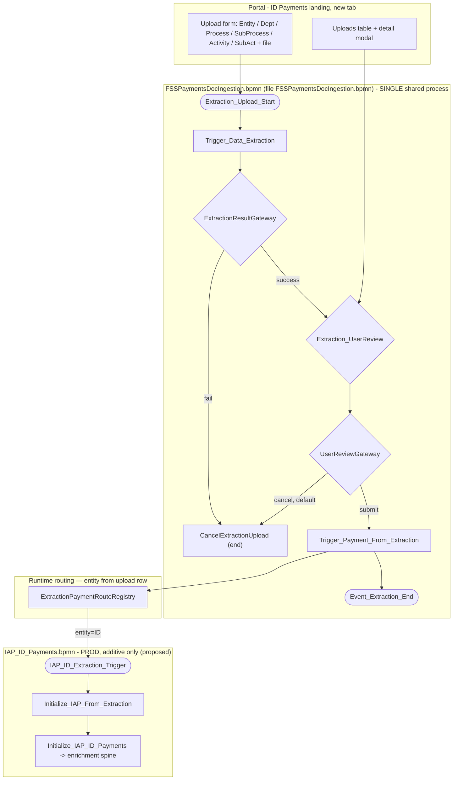
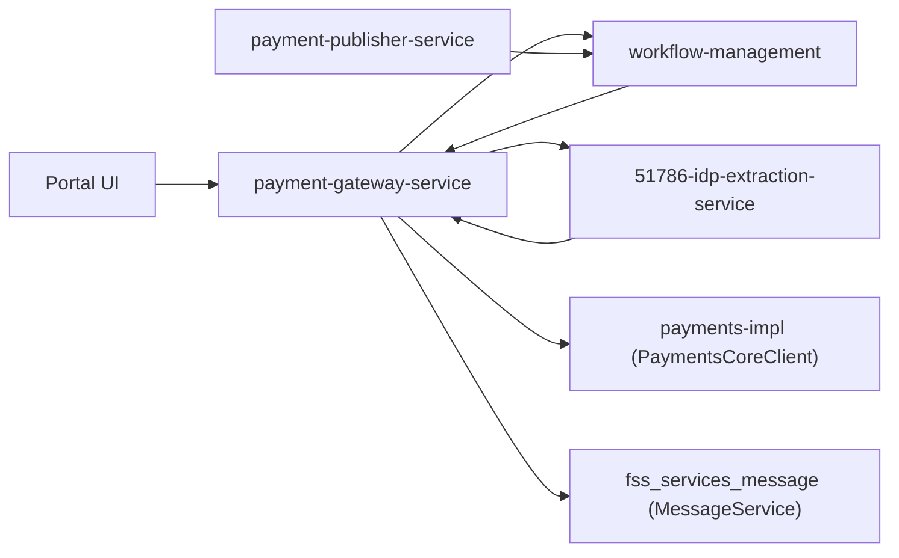
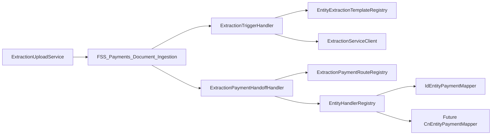
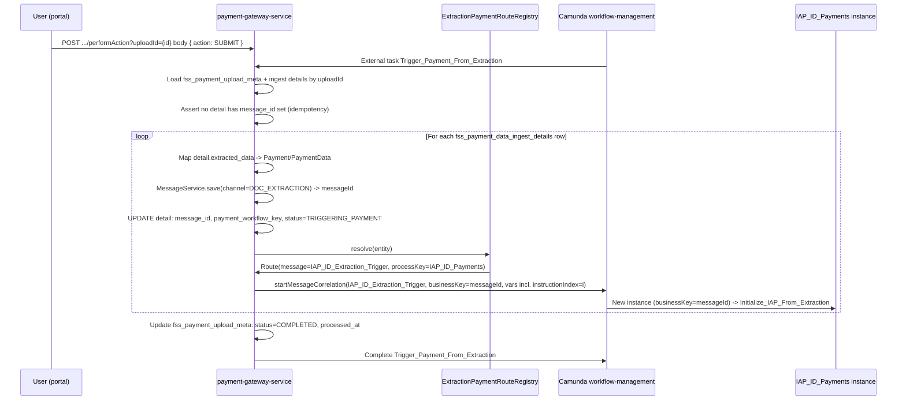
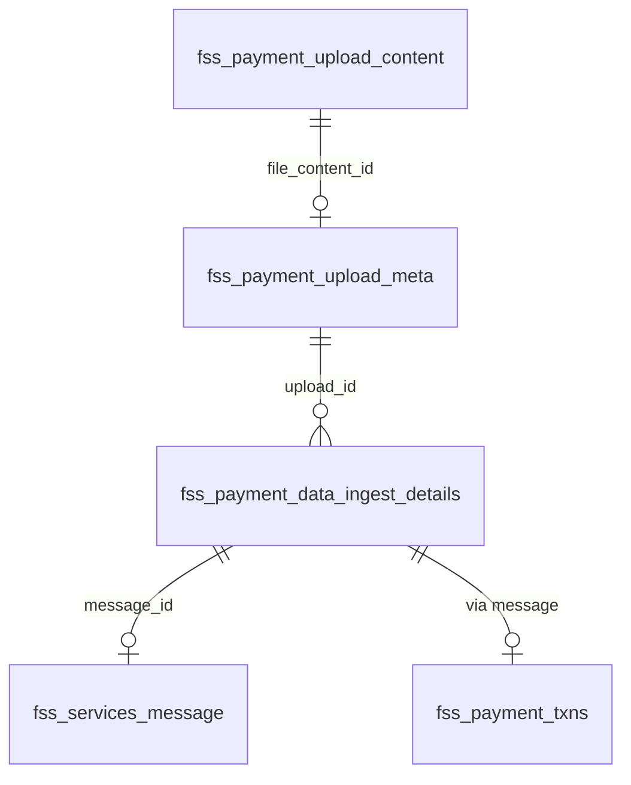
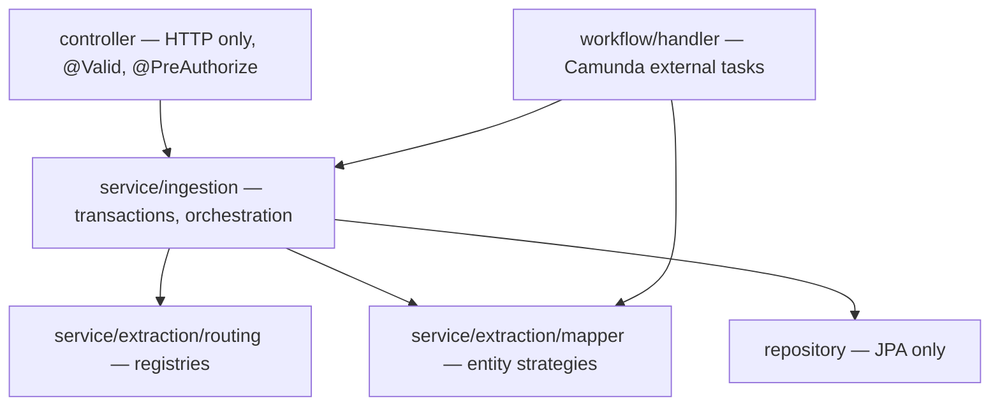

# FSS Payments Document Ingestion — Low Level Design (LLD)

> **Status:** Final v9 — **implementation guide** (extensibility patterns, Java 8/11/17 feature matrix, generics, enterprise layering, interfaces, entity routing, Jackson POJOs, Camunda handlers, nested ZIP + password-protected upload)
> **Created:** 2026-07-30 · **Corrected:** 2026-08-03 (v2/v3) · **Corrected:** 2026-08-04 (v4/v6) · **Corrected:** 2026-08-04 (v7) · **Corrected:** 2026-08-06 (v8) · **Corrected:** 2026-08-07 (v9)
> **Canonical:** **This file (`IDP_LLD.md`) is the only LLD to use for implementation.** Run [IDP_LLD_REPO_SCAN_PROMPT.md](./IDP_LLD_REPO_SCAN_PROMPT.md) against active code repos before coding.
> **Related:** [README.md](./README.md) · [IDP_Document_Ingestion_Design.md](./IDP_Document_Ingestion_Design.md) · [IDP_UX_Design.md](./IDP_UX_Design.md) · [FSSPaymentsDocIngestion.bpmn](./FSSPaymentsDocIngestion.bpmn) · [../IAP_ID_Payments.md](../IAP_ID_Payments.md)

---

## 1. Purpose and scope

Implementable detail for: one common `FSS_Payments_Document_Ingestion` Camunda process (file `FSSPaymentsDocIngestion.bpmn`), an additive trigger proposed on `IAP_ID_Payments.bpmn`, database schema (manual SQL only), REST contracts (built on the **real** `WorkflowServicesController`), and Java/UI implementation strategy.

### 1.1 In scope (v1)

- Landing-page tab UX for Indonesia entity (`entity=ID`)
- `FSS_Payments_Document_Ingestion` workflow (upload → data extraction → single user review → routing to IAP_ID)
- ZIP bulk upload (one upload row + workflow per PDF inside the archive; non-PDF ZIP entries ignored; **configurable nested-folder depth** — default: root + 1 subfolder level)
- Password-protected upload support — ZIP archive encryption and PDF document encryption; password supplied by user at upload time only (**never persisted**)
- Additive 4th entry on `IAP_ID_Payments` (`IAP_ID_Extraction_Trigger`) — **proposal, not applied**
- Manual SQL DDL for `fss_payment_upload_*` + `fss_payment_data_ingest_details` tables
- Gateway REST + external task handlers (new)
- `51786-idp-extraction-service` — **already built**, contract documented as-is

### 1.2 Out of scope (v1)

- New sidebar nav route
- China ETF extraction handoff (registry entry only, phase 2)
- SSTM feedback changes for `channel=DOC_EXTRACTION`
- `51786-document-service` integration (phase 2 — phase 1 uses in-table BLOB + lazy fetch)
- Feature flag (none — see §8)
- Liquibase/Flyway (not used anywhere in this codebase — see §5)

### 1.3 Domain glossary

| Term | Table / artifact | Meaning |
|---|---|---|
| **Upload (meta)** | `fss_payment_upload_meta` | One row per PDF file — file name, entity, file-level `status`, link to BLOB (`id` = Camunda business key for `FSS_Payments_Document_Ingestion`) |
| **Upload content** | `fss_payment_upload_content` | PDF bytes (lazy-fetched via `file_content_id` on meta) |
| **Ingest detail** | `fss_payment_data_ingest_details` | One row per `initiationDetail` instruction — `extracted_data`, per-instruction `status`, `confidence_score`, workflow keys, `retry`, `error_desc` |
| **Review payload** | `extracted_data` CLOB (on ingest details) | Per-instruction JSON `{ header, initiationDetail }` the user views and edits in review |
| **Workflow** | Camunda `FSS_Payments_Document_Ingestion` | Orchestration per PDF upload — passes `uploadId` (= `fss_payment_upload_meta.id`), never OCR/LLM payloads |

---

## 2. Architecture overview

### 2.1 Two-layer BPMN model



**Principle:** OCR, LLM, extraction user review, and upload persistence live **only** in `FSS_Payments_Document_Ingestion`. Payment enrichment, cut-off, S2B, and payment maker/checker stay in `IAP_ID_Payments` — unchanged except for one new message start + one init external task. No BPMN messages are used inside `FSS_Payments_Document_Ingestion` — extraction result and user Submit/Cancel are plain exclusive-gateway decisions on process variables, evaluated the instant the preceding task completes.

### 2.2 Service interaction



| Service | Responsibility |
| --- | --- |
| `51786-payment-gateway-service` | `ExtractionUploadController` (meta + content tables), extraction external task workers, `Trigger_Payment_From_Extraction` routing, `IAPExtractionInitializeHandler`, internal content endpoint for extraction |
| `51786-idp-extraction-service` | OCR client, LLM structuring, `POST /v1/extract`, `GET /v1/extract/{id}`, technical audit (`idp_extraction_audit`) — **already built, unchanged** |
| `51786-workflow-management` | Deploy `FSSPaymentsDocIngestion.bpmn` (process id `FSS_Payments_Document_Ingestion`) + additive `IAP_ID_Payments.bpmn` |
| `51786-document-service` | Phase 2 only — not invoked in phase 1 |
| `51786-payment-publisher-service` | No changes in v1 — existing cut-off/status path runs unchanged after handoff |

### 2.3 Orchestration boundary (unchanged principle, confirmed true in the built service)

`51786-idp-extraction-service`'s own README states: *"No Camunda, payment orchestration, or workflow clients — callers (e.g. payment-gateway-service) own orchestration."* Confirmed in its `pom.xml` — no Camunda/workflow-client dependency present.

```mermaid
sequenceDiagram
    participant WFM as Camunda (workflow-management)
    participant GW as payment-gateway-service
    participant EXT as 51786-idp-extraction-service

    WFM->>GW: External task Trigger_Data_Extraction
    GW->>GW: Load blob; INSERT fss_payment_data_ingest_details rows (status=PROCESSING)
    GW->>EXT: POST /v1/extract (correlationId=extractionUploadId)
    EXT->>EXT: OCR -> LLM -> idp_extraction_audit
    EXT->>GW: 200 structuredOutput+extractionId, OR 422 status=FAILED
    GW->>GW: UPDATE ingest details: extracted_data, confidence_score, status=READY_FOR_REVIEW; sync meta.status
    GW->>WFM: complete Trigger_Data_Extraction with extractionStatus (ExtractionResultGateway evaluates immediately - no wait/correlation step)
    Note over GW,WFM: Gateway owns workflow - extraction service never calls WorkflowService

```

### 2.4 Extensibility design patterns (required for implementation)

New **document types**, **payment entities**, and **LLM template changes** must be addable without modifying core orchestration code. Apply these patterns in `51786-payment-gateway-service`:

| Pattern | Where | Purpose |
|---------|-------|---------|
| **Registry** | `ExtractionPaymentRouteRegistry`, `EntityExtractionTemplateRegistry` | Map `entity` → payment BPMN message + extraction `templateId` |
| **Strategy** | `EntityPaymentMapper` (per entity) | Map `StoredExtractedData` POJO → `Payment` / `PaymentData` |
| **Template method** | `AbstractExtractionExternalTaskHandler` | Shared Camunda lock/retry/complete; subclasses implement `doExecute` |
| **Factory / resolver** | `EntityHandlerRegistry` | `resolve(entity)` → correct `EntityPaymentMapper` bean |
| **Facade** | `ExtractionUploadActionService` | Single orchestration for DB + audit + WFM (all user actions) |
| **Adapter** | `ExtractionServiceClient` | HTTP to `51786-idp-extraction-service`; returns typed `ExtractResponse` POJO |

**Extension scenarios:**

| Change | Touch points | Do **not** change |
|--------|--------------|-------------------|
| New payment entity (e.g. `CN`) | `application.yml` route row + new `CnEntityPaymentMapper` + BPMN message start on that entity's payment process | `FSSPaymentsDocIngestion.bpmn`, `ExtractionTriggerHandler` core loop |
| New LLM template for entity | `entity-templates` config: `entity → templateId` passed in extract request metadata | Extraction service API (still `POST /v1/extract`) |
| LLM JSON shape change for entity | New Jackson POJO package or versioned DTO under `model/extraction/{entity}/` + entity-specific mapper | DB schema (`extracted_data` stays CLOB) |
| New upload file type (phase 2) | New `DocumentTypeHandler` strategy (`PdfDocumentTypeHandler`, future `XlsxDocumentTypeHandler`) | Meta/detail tables |



---

## 3. BPMN design

### 3.1 Common process: `FSSPaymentsDocIngestion.bpmn` (file `FSSPaymentsDocIngestion.bpmn`)

| Attribute | Value |
| --- | --- |
| Process ID | `FSS_Payments_Document_Ingestion` |
| Executable | `true` |
| Module | `51786-workflow-management` |
| Country scope | Global — one definition for all countries |

#### Process variables

| Variable | Type | Set by | Purpose |
| --- | --- | --- | --- |
| `extractionUploadId` | String | Upload REST | Business key; correlation id |
| `entity` | String | UI upload form | **Routing key** — selects payment BPMN + LLM template (phase 1: `ID`) |
| `deptId`, `processId`, `subProcessId`, `activityId`, `subActivityId` | String | UI metadata dropdowns | Passed to OCR/LLM `metadata` map |
| `paymentMaker` | String | Config / upload | Assignee on `Extraction_UserReview` |
| `extractionStatus` | String | `ExtractionTriggerHandler` | `PROCESSING`, `READY_FOR_REVIEW`, `FAILED` — evaluated immediately by `ExtractionResultGateway` on task completion |
| `reviewAction` | String | Portal (Submit/Cancel button) | `SUBMIT` or `CANCEL` — evaluated immediately by `UserReviewGateway` on task completion |

#### Task catalog

| BPMN ID | Type | Topic / message | Handler (proposed) |
| --- | --- | --- | --- |
| `Extraction_Upload_Start` | Start | REST `startWorkflowProcess` after meta + content rows persisted | `ExtractionUploadService` |
| `Trigger_Data_Extraction` | External | `Trigger_Data_Extraction` | `ExtractionTriggerHandler` |
| `ExtractionResultGateway` | Exclusive | - evaluated immediately, no wait state | `${extractionStatus=='READY_FOR_REVIEW'}` (default: `CancelExtractionUpload`) |
| `Extraction_UserReview` | User task | `${paymentMaker}` | Portal modal — user edits extracted fields |
| `UserReviewGateway` | Exclusive | - evaluated immediately | `${reviewAction=='SUBMIT'}` (default: `CancelExtractionUpload`) |
| `Trigger_Payment_From_Extraction` | External | `Trigger_Payment_From_Extraction` | `ExtractionPaymentHandoffHandler` |
| `Event_Extraction_End` | End | — | — |
| `CancelExtractionUpload` | End | — | Reached from `ExtractionResultGateway` (fail) or `UserReviewGateway` (cancel); set status `CANCELLED`/`FAILED` accordingly |

#### No boundary events / no BPMN messages

There are **no boundary events and no `bpmn:message` definitions** in this process. `ExtractionResultGateway` and `UserReviewGateway` are plain exclusive gateways evaluated the instant the preceding external/user task completes.

### 3.2 Entity payment BPMN — additive pattern (template, proposal against real `IAP_ID_Payments.bpmn`)

| Addition | Detail |
| --- | --- |
| Message start | `IAP_ID_Extraction_Trigger` |
| External task | `Initialize_IAP_From_Extraction` (topic `Initialize_IAP_From_Extraction`) |
| Merge | `Initialize_IAP_From_Extraction` -> `Initialize_IAP_ID_Payments` (3rd incoming, alongside the 2 existing: `SequenceFlow_1e0z7n9`, `Flow_0af90pb`) |
| Annotation | *"Triggered from FSS_Payments_Document_Ingestion via Trigger_Payment_From_Extraction when entity=ID"* |

Existing paths frozen: `IAP_ID_AutomatedTrigger`, `IAP_ID_BulkTrigger`, `IAP_ID_Manual_Payment` — no edits to sequence flows, gateway expressions, or existing topics (see [Design doc §3](https://www.google.com/search?q=./IDP_Document_Ingestion_Design.md%233-production-safety--what-must-not-change)).

### 3.3 Handoff flow (`Trigger_Payment_From_Extraction`)



**Why `businessKey=messageId`, not `extractionUploadId`:** the real, already-built `IAP_ID_Payments` convention keys every process instance by `messageId` (confirmed: `IAPIDPaymentsMessageHandler.buildWorkflowReqObj(messageId)`, and downstream handlers resolve the payment record via `PaymentProcessing.getPaymentRecord(businessKey)` — see [IAP_ID_Payments.md](https://www.google.com/search?q=../IAP_ID_Payments.md)). Reusing `extractionUploadId` as the new instance's business key would silently break that convention (Cockpit search, reconciliation, any downstream `getPaymentRecord` lookup). So the `fss_services_message` row (and its `messageId`) is created **before** correlation, not inside `Initialize_IAP_From_Extraction` — see `ExtractionPaymentHandoffHandler` (§9.3).

#### Correlation payload

See [Design doc §6.2](https://www.google.com/search?q=./IDP_Document_Ingestion_Design.md%2362-variables-passed-at-correlation) — uses the **real** `IAP_ID_Payments` variable names (`isApproved`, `isRepaired`), not invented ones.

#### Idempotency

1. Before handoff loop: abort if any `fss_payment_data_ingest_details` row for `upload_id` already has `message_id` set.
2. Each detail row stores `message_id` and `payment_workflow_key` (= `message_id`) after successful correlation.
3. `upload_id` (`fss_payment_upload_meta.id`) is the `FSS_Payments_Document_Ingestion` business key; each `message_id` is the payment instance business key (see §3.3).
4. Double submit → no duplicate correlations (`message_id` guard per detail row).

---

## 4. Entity routing & template config

### 4.0 Routing responsibilities

`FSSPaymentsDocIngestion.bpmn` decides only ingestion-internal gateways. **Payment BPMN selection** and **LLM template selection** are config-driven from `entity` on the upload row.

> **Correction (v7):** `country` and `entity` are the same concept in this platform. Use **`entity` only** — no separate `country` column, process variable, or registry dimension.

| Layer | Responsibility |
|-------|----------------|
| Upload form / meta row | `entity` = routing key (phase 1: `ID` for Indonesia) |
| `EntityExtractionTemplateRegistry` | `entity` → `templateId` for `POST /v1/extract` (phase 1: `ID` → `id-payment-v1`) |
| `ExtractionPaymentRouteRegistry` | `entity` → payment message + process key |
| `EntityHandlerRegistry` | `entity` → `EntityPaymentMapper` implementation |

### 4.1 `application.yml` configuration

**Proposed location:** `51786-payment-gateway-service/src/main/resources/application.yml`

```yaml
extraction:
  payment-routes:
    - entity: ID
      message-name: IAP_ID_Extraction_Trigger
      process-definition-key: IAP_ID_Payments
      initialize-topic: Initialize_IAP_From_Extraction
  entity-templates:
    - entity: ID
      template-id: id-payment-v1
  upload:
    enabled: true
    max-file-size-mb: 50
    zip:
      max-folder-depth: 1          # 0 = root entries only; 1 = root + one subfolder level (default)
      max-extracted-pdf-count: 100
      max-uncompressed-size-mb: 500
    password:
      required-when-encrypted: true  # if user leaves slider off but file is encrypted → 400
```

**`zip.max-folder-depth` semantics** — depth is measured as the number of path segments **below** the ZIP root (directory entries themselves are not uploaded):

| Entry path in ZIP | Depth | Included when `max-folder-depth=1`? |
|---|---|---|
| `invoice.pdf` | 0 | Yes |
| `batch01/invoice.pdf` | 1 | Yes |
| `batch01/sub/invoice.pdf` | 2 | No — added to `skippedEntries` with reason `EXCEEDS_MAX_DEPTH` |
| `__MACOSX/._invoice.pdf` | varies | No — always skipped (`SYSTEM_ENTRY`) |

Depth is **configurable per environment** via `application.yml`; ops can raise to `2` or `3` without code change. Default `1` matches the business rule: root files plus one level of subfolders.

**Adding a new entity (checklist):**

1. Add row to `extraction.payment-routes` and `extraction.entity-templates`.
2. Implement `EntityPaymentMapper` (e.g. `CnEntityPaymentMapper`) and register as Spring bean.
3. Deploy message start + init external task on that entity's payment BPMN.
4. Add LLM template in extraction service (if new JSON shape → new Jackson POJO package).

### 4.2 Java interfaces & config binding

```java
// com.sc.fss.paymentgateway.config.extraction.ExtractionRouteProperties
@ConfigurationProperties(prefix = "extraction")
public class ExtractionProperties {
    private List<PaymentRouteEntry> paymentRoutes = List.of();
    private List<EntityTemplateEntry> entityTemplates = List.of();
    private UploadProperties upload = new UploadProperties();
    // getters/setters
}

public record PaymentRouteEntry(
    String entity,
    String messageName,
    String processDefinitionKey,
    String initializeTopic
) {}

public record EntityTemplateEntry(String entity, String templateId) {}

public record UploadProperties(
    boolean enabled,
    int maxFileSizeMb,
    ZipUploadProperties zip,
    PasswordUploadProperties password
) {}

public record ZipUploadProperties(
    int maxFolderDepth,
    int maxExtractedPdfCount,
    int maxUncompressedSizeMb
) {}

public record PasswordUploadProperties(boolean requiredWhenEncrypted) {}
```

```java
// com.sc.fss.paymentgateway.service.extraction.routing
public interface ExtractionPaymentRouteRegistry {
    PaymentRouteEntry resolve(String entity);
}

@Component
public class YamlExtractionPaymentRouteRegistry implements ExtractionPaymentRouteRegistry {
    private final Map<String, PaymentRouteEntry> byEntity;

    public YamlExtractionPaymentRouteRegistry(ExtractionProperties props) {
        this.byEntity = props.getPaymentRoutes().stream()
            .collect(Collectors.toUnmodifiableMap(
                e -> e.entity().toUpperCase(Locale.ROOT),
                Function.identity(),
                (a, b) -> { throw new IllegalStateException("Duplicate entity: " + a.entity()); }));
    }

    @Override
    public PaymentRouteEntry resolve(String entity) {
        return Optional.ofNullable(byEntity.get(entity.toUpperCase(Locale.ROOT)))
            .orElseThrow(() -> new UnknownEntityException(entity));
    }
}
```

```java
public interface EntityExtractionTemplateRegistry {
    String resolveTemplateId(String entity);
}

@Component
public class YamlEntityExtractionTemplateRegistry implements EntityExtractionTemplateRegistry {
  // same Map pattern as route registry
}
```

**Reuse scan:** mirror `CountrySpecificProcessorFactory` / `CountryExcelMsgProcessorFactory` wiring — see [IDP_LLD_REPO_SCAN_PROMPT.md](./IDP_LLD_REPO_SCAN_PROMPT.md).

### 4.3 UI entity selection

See [UX doc §2.4](./IDP_UX_Design.md). On the ID landing page, `entity` defaults to `ID` (hidden or read-only until multi-entity tabs exist).

---

## 5. Database design (manual SQL, no Liquibase)

**No migration tool (Liquibase/Flyway) exists anywhere in this codebase today.** DDL is delivered as **plain, manually-run `.sql` scripts**.

**Proposed location:** `51786-payment-gateway-service/src/main/resources/sql/manual-ddl/`

```
V1__fss_payment_upload_content.sql
V2__fss_payment_upload_meta.sql
V3__fss_payment_data_ingest_details.sql
V4__fss_payment_upload_audit.sql
```

### 5.1 Three-table model

The ingestion pipeline uses **three tables** with clear separation of concerns:

| Table | Granularity | Role |
|-------|-------------|------|
| `fss_payment_upload_content` | Per file | BLOB storage only — never joined in list queries |
| `fss_payment_upload_meta` | Per PDF | File metadata, upload audit fields, file-level `status`, FK to content |
| `fss_payment_data_ingest_details` | Per instruction | One row per `initiationDetail` — extraction result, per-instruction lifecycle, payment handoff keys, `retry`, `error_desc` |



**Relationships (from schema diagram):**

- `fss_payment_upload_meta.file_content_id` → `fss_payment_upload_content.id` (many meta rows could theoretically share content; in practice 1:1 per PDF upload).
- `fss_payment_data_ingest_details.upload_id` → `fss_payment_upload_meta.id` (**1:N** — one PDF upload produces N detail rows when the LLM returns N instructions).
- Camunda `FSS_Payments_Document_Ingestion` business key = `fss_payment_upload_meta.id` (`uploadId`).
- Each detail row's `payment_workflow_key` / `message_id` = `IAP_ID_Payments` business key after handoff.

---

#### `fss_payment_upload_content` (BLOB — isolated)

| Column | Type | Null | Notes |
| --- | --- | --- | --- |
| `id` | VARCHAR2(36) | N | PK, UUID |
| `file_content` | BLOB | N | PDF bytes |

---

#### `fss_payment_upload_meta` (per PDF file)

| Column | Type | Null | Notes |
| --- | --- | --- | --- |
| `id` | VARCHAR2(36) | N | PK, UUID; **Camunda business key** for `FSS_Payments_Document_Ingestion` |
| `batch_id` | VARCHAR2(36) | Y | Shared by all PDFs extracted from one ZIP upload |
| `file_name` | VARCHAR2(255) | N | Original PDF file name |
| `entity` | VARCHAR2(50) | N | **Routing key** — phase 1: `ID`; selects payment BPMN + LLM template |
| `dept_id` | VARCHAR2(50) | Y | Upload metadata |
| `process_id` | VARCHAR2(50) | Y | Upload metadata |
| `sub_process_id` | VARCHAR2(50) | Y | Upload metadata |
| `activity_id` | VARCHAR2(50) | Y | Upload metadata |
| `sub_activity_id` | VARCHAR2(50) | Y | Upload metadata |
| `status` | VARCHAR2(30) | N | File-level lifecycle — see §5.4; aggregate of child detail statuses |
| `file_content_id` | VARCHAR2(36) | N | FK → `fss_payment_upload_content.id` |
| `uploaded_by` | VARCHAR2(100) | N | |
| `uploaded_at` | TIMESTAMP | N | Sort key (DESC) |
| `processed_at` | TIMESTAMP | Y | Set when all details reach terminal state |
| `remarks` | VARCHAR2(500) | Y | Last cancel reason (also in audit) |
| `approved_by` | VARCHAR2(100) | Y | User who submitted for routing (set on `SUBMITTED`) |
| `approved_at` | TIMESTAMP | Y | When user submitted (`SUBMITTED`) |
| `instruction_count` | NUMBER(5) | N | Default `0` — **denormalized** count of child detail rows; drives uploads table Instructions column |
| `confidence` | NUMBER(5,2) | Y | **Denormalized** overall document LLM confidence — `AVG(confidence_score)` across details for this upload; `NULL` before extraction creates rows |

**List-query rule:** `getUploads` reads `instruction_count` and `confidence` from **meta only** — no `COUNT`/`JOIN` to `fss_payment_data_ingest_details` on list or poll. Refreshed on write paths (§5.1.1).

**Phase 2 (optional):** per-instruction low-confidence rollups (e.g. count of instructions with `low_confidence_field_count > 0`) — **not in v1**; modal still uses `low_confidence_field_count` on each detail row.

**Indexes:** `idx_payment_upload_meta_entity` (`entity`), `idx_payment_upload_meta_batch` (`batch_id`), `idx_payment_upload_meta_status_ts` (`status`, `uploaded_at` DESC), `idx_payment_upload_meta_user` (`uploaded_by`, `uploaded_at` DESC).

---

#### `fss_payment_data_ingest_details` (per instruction — core pipeline row)

| Column | Type | Null | Notes |
| --- | --- | --- | --- |
| `id` | VARCHAR2(36) | N | PK, UUID |
| `upload_id` | VARCHAR2(36) | N | FK → `fss_payment_upload_meta.id` |
| `instruction_index` | NUMBER(5) | N | 0-based position in LLM `initiationDetail[]` |
| `status` | VARCHAR2(30) | N | Per-instruction lifecycle — see §5.4 |
| `extraction_id` | VARCHAR2(36) | Y | `extractionId` from `51786-idp-extraction-service` (shared across details from same OCR pass) |
| `extracted_data` | CLOB | Y | Per-instruction JSON: `{ "header": {…}, "initiationDetail": {…} }` — maker edits merged in place |
| `confidence_score` | NUMBER(5,2) | Y | From `initiationDetail.Confidence1` (parsed double) |
| `tx_ref` | VARCHAR2(50) | Y | Denormalized from `initiationDetail.TxRef` — list/sort without parsing CLOB |
| `sub_activity_id` | VARCHAR2(50) | Y | Denormalized — e.g. `Redemption`, `Subscription` |
| `activity_id` | VARCHAR2(10) | Y | Denormalized — e.g. `BT`, `OTT` |
| `trn_typ` | VARCHAR2(50) | Y | Denormalized from `TransactionDetails.TrnTyp` |
| `value_date` | DATE | Y | Denormalized from `TransactionDetails.ValDt` |
| `client_name` | VARCHAR2(255) | Y | Denormalized from `TransactionDetails.ClntNm` |
| `debit_amount` | VARCHAR2(50) | Y | Denormalized from first debit leg `DrAmt` (display only) |
| `low_confidence_field_count` | NUMBER(5) | Y | Count of fields with `Confidence < 90` — drives ⚠ badge in UI |
| `extraction_workflow_key` | VARCHAR2(36) | Y | = `upload_id` — FSS ingestion process business key |
| `message_id` | VARCHAR2(36) | Y → **N after handoff** | **Mandatory link to `fss_services_message`** — created **before** `startMessageCorrelation`; becomes IAP business key. `NOT NULL` when `status IN (TRIGGERING_PAYMENT, COMPLETED)` |
| `payment_workflow_key` | VARCHAR2(36) | Y | = `message_id` after handoff (same convention as existing IAP handlers) |
| `payment_id` | VARCHAR2(36) | Y | Backfilled from `MessageService.getMessage(message_id).getFuncId()` after `Save_Payment_Transaction` |
| `handoff_at` | TIMESTAMP | Y | When `message_id` was saved and correlation succeeded |
| `handoff_message_name` | VARCHAR2(100) | Y | e.g. `IAP_ID_Extraction_Trigger` — audited registry resolution |
| `approved_by` | VARCHAR2(100) | Y | User who triggered handoff |
| `approved_at` | TIMESTAMP | Y | |
| `started_at` | TIMESTAMP | Y | Extraction/handoff attempt start |
| `completed_at` | TIMESTAMP | Y | Terminal state reached |
| `updated_by` | VARCHAR2(100) | Y | Last actor/handler |
| `updated_at` | TIMESTAMP | Y | |
| `retry` | NUMBER(5) | N | Default `0`; incremented on re-extract or retried handoff |
| `error_desc` | VARCHAR2(500) | Y | Human-readable failure reason (extraction `422`, timeout, handoff error); cleared on re-extract |

**Unique constraint:** `(upload_id, instruction_index)`.

**Indexes:** `idx_ingest_details_upload` (`upload_id`), `idx_ingest_details_status` (`status`), `idx_ingest_details_message` (`message_id`).

**Why one row per instruction:** each row is the **complete lifecycle record** for one `initiationDetail` → one `fss_services_message` → one `IAP_ID_Payments` instance. Do **not** deprecate `message_id` — it is the mandatory handoff anchor required by `ID_payments.bpmn` (business key = `messageId`). There is no separate handoff table; tracking lives on this row.

**Handoff invariant (application-enforced):**

```
FOR each detail WHERE status transitions to TRIGGERING_PAYMENT or COMPLETED:
  1. MessageService.save(channel=DOC_EXTRACTION) → message_id  (REQUIRED)
  2. UPDATE detail SET message_id, payment_workflow_key=message_id, handoff_at, handoff_message_name
  3. startMessageCorrelation(..., businessKey=message_id)
  4. Abort if message_id IS NULL before correlate
```

Partial handoff: details that already have `message_id` are skipped on retry; details without `message_id` are retried. `retry` + `error_desc` capture per-instruction failures.

**`retry` / `error_desc` usage:**

| Scenario | `retry` | `error_desc` |
| --- | --- | --- |
| Extraction fails (HTTP 422) | unchanged | OCR/LLM error from extraction service |
| Extraction timeout (exhausted Camunda retries) | unchanged | e.g. `OCR_TIMEOUT` |
| Re-extract requested | `retry + 1` | cleared |
| Handoff correlate fails | `retry + 1` | correlation error message |
| Success | unchanged | cleared |

#### 5.1.1 File-level aggregates on meta (denormalized — not computed on list read)

The uploads table shows **instruction count** and **overall confidence** per **PDF file**. That is **file-level** data — store on `fss_payment_upload_meta`, not via live aggregation on every `getUploads` (polls every 5s while processing).

| UI / API field | DB column (`fss_payment_upload_meta`) | Computation (on refresh only) |
| --- | --- | --- |
| `instructionCount` | `instruction_count` | Number of detail rows for `upload_id` |
| `confidence` | `confidence` | **Overall document LLM confidence** — `AVG(confidence_score)` across all instructions in the PDF (single instruction → that row's `Confidence1`); `NULL` before extraction |

**Which table:** only **`fss_payment_upload_meta`** holds file-level rollups. **`fss_payment_data_ingest_details`** holds per-instruction `confidence_score`, `low_confidence_field_count`, etc. for the modal — do not duplicate file-level `confidence` on each detail row.

**Refresh service:** `ExtractionUploadAggregateService.refresh(uploadId)` — recompute `instruction_count` and `confidence`, `UPDATE` meta (one SQL `UPDATE` with subselects, or in-memory when details are loaded in the same transaction).

| Event | Caller | After refresh |
| --- | --- | --- |
| Meta inserted (upload) | `ExtractionUploadService` | `instruction_count=0`, `confidence=NULL` |
| Extraction complete (N details inserted) | `ExtractionTriggerHandler` | `instruction_count=N`, `confidence=AVG(...)` |
| Re-extract (details cleared/reset) | Re-extract service | `instruction_count=0`, `confidence=NULL` until extraction completes |
| Reconciliation (optional) | Scheduler §7.1 | Fix drift if meta ≠ details |

**Not in v1:** `low_confidence_instruction_count` on meta — optional future column; v1 low-confidence UX uses per-field / per-instruction data in the modal only.

**Read paths:** `getUploads` and `getDetail` header read meta `instruction_count` + `confidence`. **Never** aggregate from details on list/poll paths.

---

### 5.2 Existing tables (usage only, no schema change)

| Table | Usage |
|---|---|
| `fss_services_message` | `channel='DOC_EXTRACTION'`; one row **per ingest detail** at handoff |
| `fss_payment_txns` | No schema change; row created by existing `Save_Payment_Transaction` |
| `act_*` | Camunda engine state — new process definitions only |

### 5.3 Status lifecycle

**File-level (`fss_payment_upload_meta.status`)** — synced from workflow + child details:

| Status | Meaning |
| --- | --- |
| `UPLOADED` | Meta row inserted; workflow not yet started |
| `PROCESSING` | `Trigger_Data_Extraction` running (OCR/LLM) |
| `READY_FOR_REVIEW` | Extraction complete; user can review and edit fields |
| `SUBMITTED` | User submitted for routing (`performAction` SUBMIT); `Extraction_UserReview` completed |
| `TRIGGERING_PAYMENT` | `Trigger_Payment_From_Extraction` running — registry routing + `IAP_ID` message correlation per instruction |
| `COMPLETED` | Handoff succeeded; ingestion process ended (`Event_Extraction_End`) |
| `FAILED` | Extraction or handoff failed (not user cancel) — row clickable for re-extract |
| `CANCELLED` | User cancelled during review |

**Typical happy path:** `UPLOADED` → `PROCESSING` → `READY_FOR_REVIEW` → `SUBMITTED` → `TRIGGERING_PAYMENT` → `COMPLETED`.

**Per-instruction (`fss_payment_data_ingest_details.status`)** — same vocabulary; each detail row may transition independently after submit:

| Status | Set by | Notes |
| --- | --- | --- |
| `UPLOADED` | Row inserted (placeholder before extract) | Transient |
| `PROCESSING` | Extraction in flight | |
| `READY_FOR_REVIEW` | Extract complete for this instruction | User editable |
| `SUBMITTED` | User submit (`performAction` SUBMIT) | Bulk with meta |
| `TRIGGERING_PAYMENT` | Handoff loop — `message_id` saved, correlation in flight | Transient per detail |
| `COMPLETED` | Handoff complete for this instruction | `message_id` set |
| `FAILED` | Extraction or handoff failed | `error_desc` populated |
| `CANCELLED` | User cancel | |

### 5.4 DDL (Oracle — manual scripts)

```sql
-- V1__fss_payment_upload_content.sql
CREATE TABLE fss_payment_upload_content (
    id              VARCHAR2(36) PRIMARY KEY,
    file_content    BLOB         NOT NULL
);

-- V2__fss_payment_upload_meta.sql
CREATE TABLE fss_payment_upload_meta (
    id              VARCHAR2(36) PRIMARY KEY,
    batch_id        VARCHAR2(36),
    file_name       VARCHAR2(255) NOT NULL,
    entity          VARCHAR2(50) NOT NULL,
    dept_id         VARCHAR2(50),
    process_id      VARCHAR2(50),
    sub_process_id  VARCHAR2(50),
    activity_id     VARCHAR2(50),
    sub_activity_id VARCHAR2(50),
    status          VARCHAR2(30) NOT NULL,
    file_content_id VARCHAR2(36) NOT NULL REFERENCES fss_payment_upload_content(id),
    uploaded_by     VARCHAR2(100) NOT NULL,
    uploaded_at     TIMESTAMP    NOT NULL,
    processed_at    TIMESTAMP,
    remarks         VARCHAR2(500),
    approved_by     VARCHAR2(100),
    approved_at     TIMESTAMP,
    instruction_count              NUMBER(5)    DEFAULT 0 NOT NULL,
    confidence                     NUMBER(5,2)
);
CREATE INDEX idx_payment_upload_meta_entity ON fss_payment_upload_meta (entity);
CREATE INDEX idx_payment_upload_meta_batch ON fss_payment_upload_meta (batch_id);
CREATE INDEX idx_payment_upload_meta_status_ts ON fss_payment_upload_meta (status, uploaded_at DESC);
CREATE INDEX idx_payment_upload_meta_user ON fss_payment_upload_meta (uploaded_by, uploaded_at DESC);

-- V3__fss_payment_data_ingest_details.sql
CREATE TABLE fss_payment_data_ingest_details (
    id                      VARCHAR2(36) PRIMARY KEY,
    upload_id               VARCHAR2(36) NOT NULL REFERENCES fss_payment_upload_meta(id),
    instruction_index       NUMBER(5)    NOT NULL,
    status                  VARCHAR2(30) NOT NULL,
    extraction_id           VARCHAR2(36),
    extracted_data          CLOB,
    confidence_score        NUMBER(5,2),
    tx_ref                  VARCHAR2(50),
    sub_activity_id         VARCHAR2(50),
    activity_id             VARCHAR2(10),
    trn_typ                 VARCHAR2(50),
    value_date              DATE,
    client_name             VARCHAR2(255),
    debit_amount            VARCHAR2(50),
    low_confidence_field_count NUMBER(5),
    extraction_workflow_key VARCHAR2(36),
    message_id              VARCHAR2(36),
    payment_workflow_key    VARCHAR2(36),
    payment_id              VARCHAR2(36),
    handoff_at              TIMESTAMP,
    handoff_message_name    VARCHAR2(100),
    approved_by             VARCHAR2(100),
    approved_at             TIMESTAMP,
    started_at              TIMESTAMP,
    completed_at            TIMESTAMP,
    updated_by              VARCHAR2(100),
    updated_at              TIMESTAMP,
    retry                   NUMBER(5)    DEFAULT 0 NOT NULL,
    error_desc              VARCHAR2(500),
    CONSTRAINT uk_ingest_details_upload_idx UNIQUE (upload_id, instruction_index)
);
CREATE INDEX idx_ingest_details_upload ON fss_payment_data_ingest_details (upload_id);
CREATE INDEX idx_ingest_details_status ON fss_payment_data_ingest_details (status);
CREATE INDEX idx_ingest_details_message ON fss_payment_data_ingest_details (message_id);
CREATE INDEX idx_ingest_details_sub_act ON fss_payment_data_ingest_details (upload_id, sub_activity_id);
CREATE INDEX idx_ingest_details_trn_typ ON fss_payment_data_ingest_details (upload_id, trn_typ);

-- V4__fss_payment_upload_audit.sql
CREATE TABLE fss_payment_upload_audit (
    audit_id        NUMBER GENERATED ALWAYS AS IDENTITY PRIMARY KEY,
    upload_id       VARCHAR2(36) NOT NULL REFERENCES fss_payment_upload_meta(id),
    action          VARCHAR2(50) NOT NULL,
    actor           VARCHAR2(100),
    before_status   VARCHAR2(30),
    after_status    VARCHAR2(30),
    remarks         VARCHAR2(500),
    details         CLOB,
    created_at      TIMESTAMP NOT NULL
);
CREATE INDEX idx_payment_upload_audit_upload ON fss_payment_upload_audit (upload_id, created_at DESC);
```

**Audit `action` values:** `UPLOAD`, `EXTRACT_COMPLETE`, `EXTRACT_FAILED`, `USER_SUBMIT`, `USER_CANCEL`, `RE_EXTRACT`, `HANDOFF_STARTED`, `HANDOFF_COMPLETE`, `HANDOFF_FAILED`, `WORKFLOW_ACTION_FAILED`.

#### Who writes audit?

| Event | Writer |
| --- | --- |
| Upload, re-extract | `ExtractionUploadService` |
| Extraction complete/fail | `ExtractionTriggerHandler` |
| Submit, cancel (`performAction`) | **`ExtractionUploadActionService`** (before WFM call) |
| Payment handoff | `ExtractionPaymentHandoffHandler` |

### 5.6 Why not a DB-backed route registry in v1

A `fss_payment_data_ingest_route` table (runtime-editable routing) is optional for phase 2. Ship the registry as a static `application.yml` list in `payment-gateway-service` first.

---

## 6. Structured output contract & JSON -> Payment mapping (corrected, real contract)

**This section replaces the v1 "IDP Document Ingestion" mapping table**, which incorrectly assumed `TrnTyp`/`ClntNm`/`ValDt` were direct fields of `initiationDetail`. The **real**, already-built and tested output of `51786-idp-extraction-service` (`POST /v1/extract`, confirmed against `IdPaymentOutput`/`InitiationDetail`/`ExtractedField` Java records and the actual fixture `after_ocr-llm-output.json`) is documented below **verbatim**. See [README.md decision log item 2](https://www.google.com/search?q=./README.md%23decision-log) for why this contract is kept as-is rather than rewritten.

### 6.1 Real response envelope (`POST /v1/extract`)

On `status=COMPLETED`, the LLM returns **`structuredOutput` with `initiationDetail` array only** (no `header`). `ExtractionTriggerHandler` builds `header` once, then **INSERTs one `fss_payment_data_ingest_details` row per instruction** with `extracted_data = { header, initiationDetail: item[i] }`, `confidence_score`, `extraction_workflow_key = upload_id` — see [Design doc §6.3](./IDP_Document_Ingestion_Design.md#63-llm-output-vs-stored-extracted_data).

```json
{
  "extractionId": "ext-audit-uuid",
  "templateId": "id-payment-v1",
  "correlationId": "extraction-upload-id",
  "status": "COMPLETED",
  "structuredOutput": { "...": "see 6.2" },
  "ocrTraceId": "ocr-job-id",
  "processingTimeMs": 45230,
  "errorCode": null,
  "errorDescription": null
}

```

`status` is one of `PENDING`, `OCR_IN_PROGRESS`, `LLM_IN_PROGRESS`, `COMPLETED`, `FAILED` (`JobStatus` enum, confirmed). On `FAILED`, the HTTP status is **422**, not 200 — see [Design doc § 4.4.1](https://www.google.com/search?q=./IDP_Document_Ingestion_Design.md%23441-how-the-gateway-knows-extraction-is-done-and-the-real-http-status-contract).

### 6.2 Real `structuredOutput` shape (verbatim, confirmed against the built fixture)

```json
{
  "header": {
    "uniqueId": "3897122",
    "country": "SS_ID_DOC",
    "project_version": "1.0.0",
    "request_timestamp": "03022026212204",
    "response_timestamp": "03022026212212",
    "job_id": "JID-549a5d3a-0103-11f1-9107-9e5a5da3c310",
    "doc_ids": ["C0AA239C-0000-CD1F-8C11-408513E7F19F"],
    "ErrorCode": "200",
    "ErrorDescription": "",
    "TotInst": "1",
    "InstructionSummary": [
      { "DeptId": "FundServices", "ProcessId": "Cash", "SubProcessId": "CI", "NoInst1": "1" }
    ]
  },
  "initiationDetail": [
    {
      "TxRef": "3897122-001",
    "DocRef": "page1",
    "DocId": "C0AA239C-0000-CD1F-8C11-408513E7F19F",
    "DocName": "3897122.pdf",
    "DeptId": "FundServices",
    "ProcessId": "Cash",
    "SubProcessId": "CI",
    "ActivityId": "BT",
    "SubActivityId": "Redemption",
    "function": "NEWM",
    "Lang": "Eng",
    "Confidence1": "97.23",
    "TransactionDetails": [
      { "Name": "BankChg", "Value": "No", "Confidence": "94.07" },
      { "Name": "Multi", "Value": "No", "Confidence": "92.78" },
      { "Name": "NonS2B", "Value": "No", "Confidence": "94.36" },
      { "Name": "TrnRef", "Value": "IDPYRE015001", "Confidence": "92.76" },
      { "Name": "ScaRef", "Value": "", "Confidence": "0" },
      { "Name": "TrnTyp", "Value": "Redemption", "Confidence": "94.69" },
      { "Name": "ClntNm", "Value": "PT BNI ASSET MANAGEMENT", "Confidence": "93.23" },
      { "Name": "ValDt", "Value": "2025-10-29", "Confidence": "94.0" }
    ],
    "DebitDetails": {
      "summary": "1",
      "details": [{ "data": [
        { "Name": "Transaction-Id", "Value": "Txn-1", "Confidence": "96.48" },
        { "Name": "DrAccCcy", "Value": "IDR", "Confidence": "97.19" },
        { "Name": "DrAccNo", "Value": "30681655612", "Confidence": "92.58" },
        { "Name": "DrAccNm", "Value": "", "Confidence": "0" },
        { "Name": "DrAmt", "Value": "5000000000", "Confidence": "95.7" },
        { "Name": "DrNarrLn1", "Value": "Redemption", "Confidence": "93.13" }
      ]}]
    },
    "CreditDetails": {
      "summary": "1",
      "details": [{ "data": [
        { "Name": "Transaction-Id", "Value": "Txn-1", "Confidence": "92.94" },
        { "Name": "CrAccCcy", "Value": "IDR", "Confidence": "95.19" },
        { "Name": "CrAccNo", "Value": "30608788756", "Confidence": "94.95" },
        { "Name": "CrAccNm", "Value": "", "Confidence": "0" },
        { "Name": "CrAmt", "Value": "5000000000", "Confidence": "94.38" },
        { "Name": "CrNarrLn1", "Value": "Redemption", "Confidence": "93.8" }
      ]}]
    }
    }
  ]
}
```

**Stored shape** (after gateway merges header): `{ "header": { ... }, "initiationDetail": [ ... ] }`. Single-instruction PDFs use an array of length 1.

**Key facts (all confirmed against real code, not assumed):**

* LLM output is **`initiationDetail[]` only**; `header` is built by `ExtractionTriggerHandler` from OCR/job context (`uniqueId`, `TotInst` = array length, `InstructionSummary`, `doc_ids`, …).
* `header` has 11 fields, including a per-instruction `InstructionSummary[]` array — none of these map to `Payment`, they are OCR/LLM job metadata only, except `doc_ids[0]` (document linkage) and `uniqueId` (external ref candidate).
* `initiationDetail` has **no** direct `TrnTyp`/`ClntNm`/`ValDt`/`TrnRef` fields. Every business field except `TxRef`/`DocRef`/`DocId`/`DocName`/`DeptId`/`ProcessId`/`SubProcessId`/`ActivityId`/`SubActivityId`/`function`/`Lang`/`Confidence1` lives inside `TransactionDetails[]`, `DebitDetails.details[].data[]`, or `CreditDetails.details[].data[]` as `{ "Name", "Value", "Confidence" }` triples.
* `Confidence` (and `Confidence1`) are **JSON strings**, e.g. `"94.07"` — not numbers. Any comparison (e.g. "highlight if `Confidence < 90`") must `Double.parseDouble(...)` first.
* `DebitDetails`/`CreditDetails` share the same `LegDetails { summary, details[] }` shape; `details[].data[]` is the actual field list per leg (supports future multi-leg payments even though phase 1 uses a single leg each).
* **User edits** are merged into `fss_payment_data_ingest_details.extracted_data` in place (per instruction row) via `POST .../fields`.

### 6.2.1 `TransactionDetails[]` known `Name` catalog (from the real fixture — treat as the confirmed baseline; the LLM may omit fields it cannot find, never add undocumented ones without updating this table)

| `Name` | Meaning | Maps to |
| --- | --- | --- |
| `BankChg` | Bank charges indicator (Yes/No) | Payment charge-bearer flag |
| `Multi` | Multi-transaction indicator | Payment attribute |
| `NonS2B` | Non-S2B indicator | Payment attribute |
| `TrnRef` | Transaction reference | Payment attribute (distinct from `initiationDetail.TxRef`) |
| `ScaRef` | SCA reference | Payment attribute (may be empty/`Confidence:"0"` when not present) |
| `TrnTyp` | **Transaction type** | `Payment.transactionType` |
| `ClntNm` | **Client name** | `Payment.clientName` |
| `ValDt` | **Value date** (`YYYY-MM-DD`) | `Payment.valueDate` |

### 6.2.2 `DebitDetails.details[].data[]` / `CreditDetails.details[].data[]` known `Name` catalog

| `Name` | Meaning | Maps to |
| --- | --- | --- |
| `Transaction-Id` | Leg correlation id within the instruction | Debit/credit leg key |
| `DrAccCcy` / `CrAccCcy` | Account currency | Leg currency |
| `DrAccNo` / `CrAccNo` | Account number | Leg account number |
| `DrAccNm` / `CrAccNm` | Account name (often blank, `Confidence:"0"`, pending enrichment) | Leg account name |
| `DrAmt` / `CrAmt` | Amount | Leg amount |
| `DrNarrLn1` / `CrNarrLn1` | Narration line 1 | Leg narration |

### 6.3 Jackson POJO model & entity mappers (no `Map.get()` in v1)

**Rule:** Deserialize `extracted_data` CLOB and extraction HTTP responses with **Jackson POJOs**. Do not use `Map<String,Object>`, `JsonNode.get()`, or stringly-typed field lookup in production mapping code.

#### 6.3.1 Reuse extraction-service types (do not duplicate)

Import from `51786-idp-extraction-service` (scan repo for exact package): `ExtractResponse`, `InitiationDetail`, `ExtractedField`.

Gateway storage wrapper: `StoredExtractedData { ExtractionHeader header; InitiationDetail initiationDetail; }` — serialized via `ExtractedDataCodec` + injected `ObjectMapper`.

When an entity's LLM template changes, add versioned POJOs (e.g. `model.extraction.id.v2`) + new `EntityPaymentMapper`.

#### 6.3.2 `EntityPaymentMapper` strategy

```java
public interface EntityPaymentMapper {
    String entity();
    Payment mapToPayment(StoredExtractedData extracted, PaymentUploadMetaEntity meta);
    PaymentData mapToPaymentData(StoredExtractedData extracted, PaymentUploadMetaEntity meta);
}
```

`EntityHandlerRegistry` collects all `EntityPaymentMapper` Spring beans by `entity()` code. `ExtractionPaymentHandoffHandler` calls `require(meta.getEntity())`.

`Payment`/`PaymentData` from `com.sc.fssservices.model.transaction.*` — mirror `IAPPaymentBulkTransactionHandler` leg-building (scan repo).

#### 6.3.3 Typed helpers (optional)

`InitiationDetailSupport.transactionDetailValue(detail, "TrnTyp")` streams `List<ExtractedField>` — not `Map.get()`.

#### 6.3.4 Denormalized columns

Populate `tx_ref`, `trn_typ`, etc. from POJO getters in `ExtractionTriggerHandler`.

### 6.4 `confidence_score` (on `fss_payment_data_ingest_details`)

| Source | Rule |
| --- | --- |
| Primary | `initiationDetail.Confidence1` on each detail row, parsed as double |
| Meta aggregate (file-level) | `AVG(confidence_score)` across details → API field **`confidence`** on `getUploads` / `getDetail` — overall document LLM extract confidence |
| Fallback | Minimum of all per-field `Confidence` values in `extracted_data` |
| After maker edit | Unchanged; edited fields get `isEdited` metadata inside `extracted_data` |

### 6.5 User review & confidence

* User edits **field values** only (`POST .../fields?uploadId=&detailId=`, see [API Reference §2.5](./IDP_API_Reference.md#25-post-apifsspaymentsgatewayv1extraction-uploadsfieldsuploadididdetailiddetailid)).
* Original LLM `Confidence` is retained for audit regardless of edits.
* UI highlights fields where the **parsed** `Confidence < 90` (configurable threshold, plain constant in v1 — no feature-flag config system, see §8).

---

## 7. Error handling & resilience

| Layer | Strategy |
| --- | --- |
| Extraction HTTP call | `ExtractionTriggerHandler` branches explicitly: `200` -> success, `422` -> permanent fail (no retry), timeout/5xx -> retry via the same `ExternalTaskHelper.getRetries`/`getNextTimeout` pattern every other `IAP_ID_Payments` handler already uses ([IAP_ID_Payments.md](https://www.google.com/search?q=../IAP_ID_Payments.md) §5) |
| Handoff | If correlate fails, do **not** complete `Trigger_Payment_From_Extraction`; upload stays `SUBMITTED` or `TRIGGERING_PAYMENT`; ops alert |
| Extraction retry | `retry` on `fss_payment_data_ingest_details`; re-extract increments `retry`, clears `extracted_data`/`error_desc`, resets `status=PROCESSING` on all detail rows for the upload |
| Stuck uploads | Reconciliation scheduler in the gateway (below) |
| Payment gateways | Existing `IAP_ID_Payments` behavior after handoff — no changes |

### 7.1 Reconciliation scheduler (gateway, new)

| Condition | Action |
| --- | --- |
| `status=PROCESSING` on meta with details still `PROCESSING` after timeout | Mark details `FAILED`, set `error_desc`; sync meta `FAILED` |
| Detail `status IN (TRIGGERING_PAYMENT, COMPLETED)` AND `message_id IS NOT NULL` AND payment not complete | Backfill from `MessageService.getMessage(message_id)` |

### 7.2 Idempotency keys

`uploadId` (`fss_payment_upload_meta.id`) — Camunda business key. Before re-extracting, check `idp_extraction_audit` for `correlation_id=uploadId` and `job_status=COMPLETED`.

---

## 8. Feature flag — none in v1

No feature-flag framework exists anywhere in `51786-transaction-data-tiles` today (confirmed — no LaunchDarkly, no config-toggle pattern). Building one just for this feature is out of scope. Rollout is controlled by:

1. Deploying all backend pieces (§P1–P5 in [Design doc §11](https://www.google.com/search?q=./IDP_Document_Ingestion_Design.md%2311-deployment-plan)) and verifying end-to-end in a lower environment **before** merging the UI tab.
2. The new tab and upload form are only usable by users in the `paymentMaker`/`paymentChecker` candidate groups already configured for `IAP_ID_Payments` — no separate access control needed.
3. If a kill-switch is required later, the simplest option consistent with this codebase's existing config style is a single `application.properties` boolean read once at controller startup (`extraction-upload.enabled=true|false`) returning `404`/disabling the route — not a runtime-toggleable flag service.

---

## 9. Java implementation guide

> **Before coding:** run [IDP_LLD_REPO_SCAN_PROMPT.md](./IDP_LLD_REPO_SCAN_PROMPT.md) in the active workspace and fill §13.2 with findings.

### 9.1 Module layout

```
51786-payment-gateway-service/
  src/main/java/com/sc/fss/paymentgateway/
    config/extraction/
      ExtractionProperties.java              // @ConfigurationProperties("extraction")
      ExtractionAutoConfiguration.java       // enable config props
    controller/
      ExtractionUploadController.java
    client/
      ExtractionServiceClient.java           // Feign/RestTemplate → POST /v1/extract
    service/ingestion/
      ExtractionUploadService.java
      ExtractionUploadActionService.java / ExtractionUploadActionServiceImpl.java
      ExtractionUploadContentService.java
      ExtractionUploadAuditService.java
      ExtractionUploadAggregateService.java   // refresh instruction_count / confidence on meta
      UploadStatusTransitionGuard.java       // validates allowed meta/detail status transitions
      UploadActionHandler.java
      SubmitUploadActionHandler.java
      CancelUploadActionHandler.java
      ZipArchiveExtractor.java              // zip4j — nested traversal + optional archive password
      PdfDecryptor.java                     // PDFBox — decrypt password-protected PDF bytes in-memory
      UploadEntryFilter.java                // depth / extension / system-entry rules
      ExtractedDataCodec.java / JacksonExtractedDataCodec.java
    service/extraction/routing/
      ExtractionPaymentRouteRegistry.java
      YamlExtractionPaymentRouteRegistry.java
      EntityExtractionTemplateRegistry.java
      YamlEntityExtractionTemplateRegistry.java
      EntityHandlerRegistry.java
    service/extraction/mapper/
      EntityPaymentMapper.java
      IdEntityPaymentMapper.java             // phase 1
    service/extraction/document/               // phase 2 file types — stub interface in v1
      DocumentTypeHandler.java
      PdfDocumentTypeHandler.java
    service/extraction/support/
      InitiationDetailSupport.java
    workflow/handler/extraction/
      AbstractExtractionExternalTaskHandler.java
      ExtractionTriggerHandler.java
      ExtractionPaymentHandoffHandler.java
    workflow/handler/iap/id/
      IAPExtractionInitializeHandler.java
    model/entity/ingestion/
      PaymentUploadContentEntity.java
      PaymentUploadMetaEntity.java
      PaymentDataIngestDetailsEntity.java
      PaymentUploadAuditEntity.java
    model/extraction/
      StoredExtractedData.java
      ExtractionHeader.java
    model/dto/ingestion/                       // REST response/request DTOs (records if Java 17+)
      UploadSummaryDto.java                    // getUploads row — incl. instruction aggregates
      UploadDetailDto.java                     // getDetail — upload-level + ingestDetails[]
      IngestDetailSummaryDto.java            // per instruction — incl. paymentRef
      PerformActionRequest.java
      FieldEditRequest.java
    exception/ingestion/
      ExtractionUploadException.java           // base
      UnknownEntityException.java
      InvalidUploadTransitionException.java
      EncryptedFileException.java
      InvalidPasswordException.java
      ZipDepthExceededException.java
    web/advice/
      ExtractionUploadExceptionHandler.java    // maps exceptions → HTTP + errorCode
    repository/ingestion/
      PaymentUploadContentRepository.java
      PaymentUploadMetaRepository.java
      PaymentDataIngestDetailsRepository.java
      PaymentUploadAuditRepository.java
```

### 9.2 Camunda external task implementation

Follow the **same pattern** as existing IAP handlers in `51786-payment-gateway-service` (scan: `@ExternalTaskSubscription`, `ExternalTaskHandler`, `ExternalTaskHelper`).

#### Base template (new — factor shared logic)

```java
@Slf4j
public abstract class AbstractExtractionExternalTaskHandler implements ExternalTaskHandler {

    protected abstract String topic();

    protected abstract void doExecute(ExternalTask task, ExternalTaskService service) throws Exception;

    @Override
    public void execute(ExternalTask externalTask, ExternalTaskService externalTaskService) {
        String businessKey = externalTask.getBusinessKey();
        try {
            doExecute(externalTask, externalTaskService);
        } catch (PermanentFailureException e) {
            log.warn("Permanent fail topic={} key={}: {}", topic(), businessKey, e.getMessage());
            externalTaskService.handleFailure(externalTask, e.getMessage(), null,
                0, 0L); // no retry — mirrors 422 extraction path
        } catch (Exception e) {
            int retries = ExternalTaskHelper.getRetries(externalTask); // reuse existing helper
            long timeout = ExternalTaskHelper.getNextTimeout(externalTask);
            externalTaskService.handleFailure(externalTask, e.getMessage(),
                ExceptionUtils.getStackTrace(e), retries, timeout);
        }
    }

    protected void complete(ExternalTask task, ExternalTaskService service, Map<String, Object> variables) {
        service.complete(task, variables);
    }

    protected String requireVariable(ExternalTask task, String name) {
        return Optional.ofNullable(task.getVariable(name))
            .map(Object::toString)
            .orElseThrow(() -> new IllegalStateException("Missing variable: " + name));
    }
}
```

#### Handler inventory

| Class | `@ExternalTaskSubscription` topic | Extends | Completes with variables |
|-------|-----------------------------------|---------|--------------------------|
| `ExtractionTriggerHandler` | `Trigger_Data_Extraction` | `AbstractExtractionExternalTaskHandler` | `extractionStatus` = `READY_FOR_REVIEW` \| `FAILED` |
| `ExtractionPaymentHandoffHandler` | `Trigger_Payment_From_Extraction` | `AbstractExtractionExternalTaskHandler` | none (empty map) |
| `IAPExtractionInitializeHandler` | `Initialize_IAP_From_Extraction` | existing IAP base if present | per IAP convention |

**Registration:** Spring component scan — same as other `@ExternalTaskSubscription` beans; Camunda client polls topics automatically. **No** changes to `workflow-management` Java for external task workers (workers live in gateway).

**workflow-management changes:** deploy BPMN only (`FSSPaymentsDocIngestion.bpmn`, additive `IAP_ID_Payments.bpmn`).

### 9.3 Interface & class inventory

| Type | Name | Responsibility |
|------|------|----------------|
| REST | `ExtractionUploadController` | Upload, list, detail, fields, re-extract, `performAction` |
| REST | `ExtractionUploadController.getUploads` | List with `instructionCount`, `confidence` from meta |
| Service | `ExtractionUploadService` | Persist meta/content, start workflow |
| Service | `ExtractionUploadActionService` | `performAction(UploadAction, …)` — audit + DB + WFM |
| Service | `ExtractionUploadAuditService` | Insert audit rows |
| Service | `ExtractionUploadAggregateService` | `refresh(uploadId)` — sync meta aggregate columns from details |
| Service | `ExtractionUploadContentService` | BLOB load/store |
| Guard | `UploadStatusTransitionGuard` | Centralized meta/detail status transition rules |
| Client | `ExtractionServiceClient` | Typed `ExtractResponse extract(ExtractRequest)` |
| Codec | `ExtractedDataCodec` | CLOB ↔ `StoredExtractedData` |
| Registry | `ExtractionPaymentRouteRegistry` | `entity` → route |
| Registry | `EntityExtractionTemplateRegistry` | `entity` → `templateId` |
| Registry | `EntityHandlerRegistry` | `entity` → `EntityPaymentMapper` |
| Strategy | `EntityPaymentMapper` | POJO → `Payment` / `PaymentData` |
| Handler | `ExtractionTriggerHandler` | External: extraction |
| Handler | `ExtractionPaymentHandoffHandler` | External: handoff loop |
| Handler | `IAPExtractionInitializeHandler` | External: IAP init |
| Enum | `UploadAction` | `SUBMIT`, `CANCEL` only |
| Enum | `UploadStatus` | Mirrors §5.3 |
| Exception | `UnknownEntityException`, `InvalidUploadTransitionException` | 400/404 mapping |
| Exception | `EncryptedFileException`, `InvalidPasswordException`, `ZipDepthExceededException` | 400 mapping — password / depth failures |
| Component | `ZipArchiveExtractor` | Unpack ZIP with depth filter + optional archive password |
| Component | `PdfDecryptor` | Decrypt PDF bytes in-memory; password never logged or stored |
| Component | `UploadEntryFilter` | Shared depth/extension/`__MACOSX` skip rules |
| Strategy | `UploadActionHandler` | `SUBMIT` / `CANCEL` — registered via Spring `List<>` injection |
| Strategy | `SubmitUploadActionHandler`, `CancelUploadActionHandler` | Per-action DB + audit + WFM orchestration |
| Strategy | `DocumentTypeHandler` (phase 2) | File-type upload pipeline — optional stub in v1 |
| REST advice | `ExtractionUploadExceptionHandler` | Maps ingestion exceptions → HTTP + `errorCode` body |
| DTO | `PerformActionRequest`, `UploadActionResult`, list/detail responses | API boundary — records if POM ≥17 |

### 9.4 `ExtractionUploadActionService` — single entry (`performAction` + switch)

One REST endpoint; one `@PreAuthorize` on the controller method (or service entry):

```java
@PreAuthorize("hasAuthority('paymentMaker')")  // match existing IAP group expression
@PostMapping("/performAction")
public UploadActionResult performAction(@RequestParam String uploadId,
        @RequestBody PerformActionRequest body) {
    return actionService.performAction(uploadId, body.getAction(),
        Optional.ofNullable(body.getRemarks()), currentUser());
}
```

Optional aliases — thin delegates, no duplicate logic:

```java
@PostMapping("/submit")
public UploadActionResult submit(@RequestParam String uploadId) {
    return actionService.performAction(uploadId, UploadAction.SUBMIT, Optional.empty(), currentUser());
}

@PostMapping("/cancel")
public UploadActionResult cancel(@RequestParam String uploadId, @RequestBody OptionalRemarks body) {
    return actionService.performAction(uploadId, UploadAction.CANCEL,
        Optional.ofNullable(body.getRemarks()), currentUser());
}
```

```java
public enum UploadAction { SUBMIT, CANCEL }

public interface ExtractionUploadActionService {
    UploadActionResult performAction(String uploadId, UploadAction action,
        Optional<String> remarks, String actor);
}

@Service
@Transactional
public class ExtractionUploadActionServiceImpl implements ExtractionUploadActionService {

    private final Map<UploadAction, UploadActionHandler> handlers;

    public ExtractionUploadActionServiceImpl(List<UploadActionHandler> handlerList) {
        this.handlers = handlerList.stream()
            .collect(Collectors.toUnmodifiableMap(UploadActionHandler::action, Function.identity()));
    }

    @Override
    public UploadActionResult performAction(String uploadId, UploadAction action,
            Optional<String> remarks, String actor) {
        return handlers.get(action).execute(uploadId, remarks, actor);
    }
}

public interface UploadActionHandler {
    UploadAction action();
    UploadActionResult execute(String uploadId, Optional<String> remarks, String actor);
}
```

| Handler | Audit `action` | Meta status | Camunda |
| --- | --- | --- | --- |
| `SubmitUploadActionHandler` | `USER_SUBMIT` | `SUBMITTED` | `Extraction_UserReview` + `{ reviewAction: "SUBMIT" }` |
| `CancelUploadActionHandler` | `USER_CANCEL` | `CANCELLED` | `Extraction_UserReview` + `{ reviewAction: "CANCEL" }` |

`ExtractionPaymentHandoffHandler` sets meta `TRIGGERING_PAYMENT` when the external task is claimed, then `COMPLETED` when all correlations succeed.

REST: **`POST .../performAction?uploadId={id}`** body `{ "action": "SUBMIT" | "CANCEL", "remarks": "..." }` — see [API Reference §3](./IDP_API_Reference.md#3-user-review-action-apis--gateway-facade-required). `/submit` and `/cancel` are **optional** aliases.

### 9.5 Java language features & version strategy

**Rule:** Match the **parent POM Java version** and **existing gateway code style** (repo scan §13). Use modern features where the build already supports them — not as decoration.

#### 9.5.1 Version detection (mandatory first step)

1. Read `java.version` / `maven.compiler.release` in parent POM and `51786-payment-gateway-service/pom.xml`.
2. Record in §13.2: actual version + examples of features already used in gateway (records? `var`? sealed types?).
3. Apply the matrix below for **that** version only.

#### 9.5.2 Feature matrix by Java release

| Release | Use for ingestion | Do **not** use on Java 8 |
|---------|-------------------|--------------------------|
| **Java 8** (baseline) | `Optional` for absent values; `Stream` for `initiationDetail[]` → detail rows; `Function` / `Supplier` in registries; default methods on strategy interfaces; `enum` for `UploadAction` / `UploadStatus`; `Collections.unmodifiableMap` after `Collectors.toMap` | `var`, `record`, sealed types, `String.isBlank()`, `Map.of`, `List.of`, `Collectors.toUnmodifiableMap` (Java 10+) |
| **Java 11** | `String.isBlank()` / `strip()` on filenames and metadata; `var` for **local** variables only | Text blocks (15+), records |
| **Java 17** | `record` for config entries and REST DTOs; `sealed` for closed exception or action hierarchies if extension set is fixed; pattern-matching `instanceof` in exception handler if repo uses 17+ | Reflection plugins |

**Java 8 immutable registry map (correct — `toUnmodifiableMap` is not Java 8):**

```java
private static <K, V> Map<K, V> immutableMap(Stream<V> items, Function<V, K> keyFn) {
    return items.collect(Collectors.collectingAndThen(
        Collectors.toMap(keyFn, Function.identity(), (a, b) -> {
            throw new IllegalStateException("Duplicate key");
        }),
        Collections::unmodifiableMap));
}
```

**Java 17 DTO example (when POM allows):**

```java
public record UploadActionResult(String uploadId, UploadStatus status,
    String action, Instant actedAt, String actedBy) {}
```

#### 9.5.3 Generics — required usage

| Area | Pattern |
|------|---------|
| Repositories | `JpaRepository<PaymentUploadMetaEntity, String>` — no raw types |
| Codec | `ExtractedDataCodec` — typed `StoredExtractedData` at service boundary, not `Map<String, Object>` |
| Registries | `Map<String, EntityPaymentMapper>` built once at startup |
| Action dispatch | `Map<UploadAction, UploadActionHandler>` keyed by enum |
| Camunda variables | `requireVariable` returns `String`; validate before use — no unchecked casts |

**Avoid:** `Map<String, Object>` for `extracted_data` in handlers; `Class<?>` plugin loading; returning JPA entities from REST.

#### 9.5.4 Spring extensibility (preferred over reflection)

| Mechanism | Use |
|-----------|-----|
| `List<EntityPaymentMapper>` injection | Auto-register mappers by `entity()` |
| `List<UploadActionHandler>` injection | Auto-register submit/cancel |
| `@ConfigurationProperties` + `@Validated` | Bind `extraction.*` at startup — fail fast on duplicate entity keys |
| `@ConditionalOnProperty("extraction.upload.enabled")` | Kill-switch (§8) |
| `@Transactional(readOnly = true)` | `getUploads`, `getDetail`, BLOB load |
| `@Transactional` (write) | Upload, fields, `performAction`, external task handlers |

Do **not** use reflection-based plugin loading in v1.

#### 9.5.5 Immutability & defensive copies

- Registry maps and config: immutable after construction.
- REST layer: DTOs/records only — never expose entities.
- Password `char[]`: method-local; `Arrays.fill(password, '\0')` in `finally`; never a bean field.

### 9.6 Implementation patterns

| Pattern | Application |
| --- | --- |
| External task workers | `@ExternalTaskSubscription` + extend `AbstractExtractionExternalTaskHandler` |
| Message correlation | `WorkflowService.startMessageCorrelation(...)` — same as `IAPIDPaymentsMessageHandler` |
| Human tasks | Gateway `performAction` only — never portal → WFM |
| JSON | Jackson POJOs via `ExtractedDataCodec` + extraction service types |
| Routing | `entity` only — `YamlExtractionPaymentRouteRegistry` |

### 9.7 Key class responsibilities

#### `ExtractionUploadController` (list/detail)

**`getUploads`** — file-level `UploadSummaryDto` (Java 17+ `record` recommended). Map from **meta columns** (no live `COUNT`):

| API field | DB column (`fss_payment_upload_meta`) |
| --- | --- |
| `instructionCount` | `instruction_count` |
| `confidence` | `confidence` — overall document LLM confidence (`AVG` of per-instruction scores) |

See §5.1.1. List query: **meta table only** (+ content not joined).

Do not load `extracted_data` CLOB in list query. See [API Reference §2.3](./IDP_API_Reference.md#23-get-apifsspaymentsgatewayv1extraction-uploadsgetuploads).

**`getDetail`** — `UploadDetailDto` includes the same three aggregates at upload level (modal header) plus flat `ingestDetails[]`. Each `IngestDetailSummaryDto` includes `paymentRef` when `payment_id` is set. UI groups left panel by `subActivityId` / `trnTyp` client-side.

Map entities → DTOs only; never return JPA types from controller.

#### `ExtractionUploadService`

1. Validate file type/size — accept `.pdf` or `.zip`.
2. Read `passwordProtected` (boolean) + `password` (optional `char[]`) from multipart form — **never persist, log, or audit the password value**.
3. **If PDF:**
   - If `passwordProtected=true` and password blank → `400 PASSWORD_REQUIRED`.
   - If file is encrypted: `PdfDecryptor.decrypt(bytes, password)` → decrypted bytes; on failure → `400 INVALID_PASSWORD` (wrong password or user forgot to enter it).
   - If `passwordProtected=false` but PDF is encrypted → `400 ENCRYPTED_FILE_PASSWORD_REQUIRED` (when `password.required-when-encrypted=true`).
   - Insert decrypted content + meta (`status=UPLOADED`, `entity` from form).
4. **If ZIP:**
   - If archive is encrypted and (`passwordProtected=false` or password blank) → `400 PASSWORD_REQUIRED`.
   - `ZipArchiveExtractor.extract(zipBytes, password, maxFolderDepth)` → list of `ExtractedPdfEntry { fileName, relativePath, depth, bytes }`.
   - Per eligible `.pdf` entry (depth ≤ `zip.max-folder-depth`): optionally decrypt individual PDF if needed (files inside ZIP are **not** individually encrypted — only the archive may be); insert content + meta with shared `batchId`.
   - Entries beyond max depth or non-PDF → `skippedEntries` (not stored).
   - Zero eligible PDFs → `400 NO_PDF_IN_ARCHIVE`.
5. `startWorkflowProcess(processKey=FSS_Payments_Document_Ingestion, referenceId=uploadId, variables incl. entity)`.
6. Update meta: `status=PROCESSING`.
7. **Security:** zero password `char[]` after use (`Arrays.fill(password, '\0')`); do not bind password to a `String` field on any Spring bean.

#### `ExtractionUploadActionService`

See §9.4 and [API Reference §3](./IDP_API_Reference.md#3-user-review-action-apis--gateway-facade-required).

#### `ExtractionTriggerHandler`

1. Load meta + blob; resolve `templateId = entityTemplateRegistry.resolveTemplateId(meta.getEntity())`.
2. `extractionServiceClient.extract(...)` → typed `ExtractResponse`.
3. On success: build `ExtractionHeader`; for each `InitiationDetail` build `StoredExtractedData`, `codec.toJson`, INSERT detail row, denormalize columns from POJO.
4. `aggregateService.refresh(uploadId)` — update meta `instruction_count`, `confidence`.
5. On 422: FAIL details + meta; on timeout: rethrow for Camunda retry.
6. `complete(task, Map.of("extractionStatus", status))` — use `Collections.singletonMap("extractionStatus", status)` on Java 8 (`Map.of` is Java 9+).

#### `ExtractionPaymentHandoffHandler`

1. Load meta + details; idempotency guard on `message_id`.
2. `EntityPaymentMapper mapper = entityHandlerRegistry.require(meta.getEntity())`.
3. Per detail: `mapper.mapToPayment(codec.fromJson(detail.getExtractedData()), meta)` → `MessageService.save` → correlate via `routeRegistry.resolve(meta.getEntity())`.
4. Update meta `COMPLETED`; complete task.

#### `IAPExtractionInitializeHandler`

Load `fss_services_message` by `businessKey`; complete task — same package as `IAPIDPaymentTransactionHandler`.

### 9.8 Upload enhancements — nested ZIP folders & password-protected files

#### 9.8.1 Problem statement

| Gap | Requirement |
|-----|-------------|
| Flat ZIP only | ZIPs may contain PDFs at the root **or** inside one (or more) subfolders; all eligible PDFs must be ingested |
| No depth control | Ops must be able to cap how deep the extractor walks without a code deploy |
| Encrypted archives | ZIP itself may be password-protected; individual PDFs inside are plain |
| Encrypted PDFs | A directly uploaded PDF may be password-protected |
| No password storage | User supplies password via UI; application must not persist it anywhere (DB, logs, audit, Camunda variables) |

#### 9.8.2 ZIP nested-folder traversal

**Library:** [`zip4j`](https://github.com/srikanth-lingala/zip4j) (`net.lingala.zip4j:zip4j`) — Apache 2.0, actively maintained, supports traditional ZIP encryption (ZipCrypto) and AES-256, and exposes entry paths for depth calculation. `java.util.zip` and Apache Commons Compress do **not** support password-protected ZIP extraction.

**Depth algorithm** (`UploadEntryFilter`):

```java
int folderDepth(String entryPath) {
    String normalized = entryPath.replace('\\', '/');
    if (normalized.endsWith("/")) return -1; // directory entry — skip
    int lastSlash = normalized.lastIndexOf('/');
    if (lastSlash < 0) return 0;           // root-level file
    return normalized.substring(0, lastSlash).split("/").length;
}
```

**`ZipArchiveExtractor` responsibilities:**

1. Open archive from in-memory bytes (never write extracted files to disk).
2. If `zipFile.isEncrypted()` → `zipFile.setPassword(password)` before reading entries.
3. Iterate `zipFile.getFileHeaders()`; for each non-directory entry:
   - Skip system junk: `__MACOSX/`, `._*`, `.DS_Store` → reason `SYSTEM_ENTRY`.
   - Compute depth; if `depth > zip.max-folder-depth` → skip with reason `EXCEEDS_MAX_DEPTH`.
   - If extension ≠ `.pdf` (case-insensitive) → skip with reason `NOT_PDF`.
   - Enforce `max-extracted-pdf-count` and `max-uncompressed-size-mb` (ZIP-bomb guard).
   - Extract bytes to memory; return `ExtractedPdfEntry`.
4. Wrong/missing password on encrypted archive → throw `InvalidPasswordException` → HTTP `400`.

```java
@Service
public class ZipArchiveExtractor {

    public List<ExtractedPdfEntry> extract(byte[] zipBytes, char[] password, int maxFolderDepth) {
        try {
            ZipFile zipFile = new ZipFile(new ByteArrayInputStream(zipBytes));
            if (zipFile.isEncrypted()) {
                if (password == null || password.length == 0) {
                    throw new EncryptedFileException("ZIP archive is password-protected");
                }
                zipFile.setPassword(password);
            }
            List<ExtractedPdfEntry> results = new ArrayList<>();
            for (FileHeader header : zipFile.getFileHeaders()) {
                if (header.isDirectory()) continue;
                String path = header.getFileName();
                int depth = UploadEntryFilter.folderDepth(path);
                if (depth < 0 || UploadEntryFilter.isSystemEntry(path)) continue;
                if (depth > maxFolderDepth) continue; // caller collects as skipped
                if (!UploadEntryFilter.isPdf(path)) continue;
                byte[] pdfBytes = zipFile.getInputStream(header).readAllBytes();
                results.add(new ExtractedPdfEntry(
                    UploadEntryFilter.baseName(path), path, depth, pdfBytes));
            }
            return results;
        } catch (net.lingala.zip4j.exception.ZipException e) {
            throw new InvalidPasswordException("Could not decrypt ZIP — check password", e);
        }
    }
}
```

**`file_name` on meta row:** store `baseName` only (e.g. `invoice.pdf`); store full ZIP path in audit `details` JSON as `sourcePath` for traceability.

#### 9.8.3 Password-protected PDF handling

**Library:** [Apache PDFBox](https://pdfbox.apache.org/) (`org.apache.pdfbox:pdfbox`) — standard OSS for encrypted PDFs. Use `Loader.loadPDF(bytes, password)` (PDFBox 3.x) or `PDDocument.load(bytes, password)` (PDFBox 2.x — match parent POM version).

**Rules:**

| Upload type | What is encrypted | Password applies to |
|-------------|-------------------|---------------------|
| `.zip` | The ZIP archive | Archive only — PDFs inside are plain bytes after unzip |
| `.pdf` | The PDF document | The PDF file itself |

**`PdfDecryptor`:**

```java
@Service
public class PdfDecryptor {

    public byte[] decrypt(byte[] encryptedPdf, char[] password) {
        try {
            PDDocument doc = Loader.loadPDF(encryptedPdf, password);
            if (doc.isEncrypted()) {
                // still encrypted after load → wrong password
                throw new InvalidPasswordException("PDF decryption failed");
            }
            ByteArrayOutputStream out = new ByteArrayOutputStream();
            doc.save(out);
            doc.close();
            return out.toByteArray();
        } catch (InvalidPasswordException e) {
            throw e;
        } catch (IOException e) {
            throw new InvalidPasswordException("PDF decryption failed — check password", e);
        }
    }

    public boolean isEncrypted(byte[] pdfBytes) {
        try (PDDocument doc = Loader.loadPDF(pdfBytes)) {
            return doc.isEncrypted();
        } catch (IOException e) {
            return true; // treat unreadable as encrypted/protected
        }
    }
}
```

**In-memory only:** decrypted bytes flow directly into `fss_payment_upload_content.file_content`. No temp files. Password `char[]` cleared in a `finally` block in `ExtractionUploadService`.

#### 9.8.4 REST contract extension

Add to `POST /api/fss/payments/gateway/v1/extraction-uploads` multipart parts (see [IDP_API_Reference.md §2.2](./IDP_API_Reference.md#22-post-apifsspaymentsgatewayv1extraction-uploads)):

| Part | Type | Required | Description |
|------|------|----------|-------------|
| `passwordProtected` | boolean | No | Default `false`. UI slider — user declares file is encrypted |
| `password` | string | Conditional | Required when `passwordProtected=true`; ignored otherwise |

**Extended ZIP response `skippedEntries`:**

```json
{
  "batchId": "batch-uuid",
  "uploads": [ { "uploadId": "...", "fileName": "doc1.pdf", "sourcePath": "batch01/doc1.pdf", "uploadStatus": "PROCESSING" } ],
  "skippedEntries": [
    { "path": "readme.txt", "reason": "NOT_PDF" },
    { "path": "deep/sub/invoice.pdf", "reason": "EXCEEDS_MAX_DEPTH" },
    { "path": "__MACOSX/._doc1.pdf", "reason": "SYSTEM_ENTRY" }
  ]
}
```

**New HTTP `400` error codes** (body `errorCode` field):

| `errorCode` | When |
|-------------|------|
| `PASSWORD_REQUIRED` | `passwordProtected=true` but `password` blank, or encrypted file with slider off |
| `INVALID_PASSWORD` | Password supplied but decryption failed (wrong password / typo) |
| `ENCRYPTED_FILE_PASSWORD_REQUIRED` | File is encrypted but `passwordProtected=false` |
| `NO_PDF_IN_ARCHIVE` | ZIP unpacked but zero eligible PDFs (unchanged semantics) |
| `ZIP_DEPTH_EXCEEDED` | Optional — all PDFs beyond `max-folder-depth` (zero uploads) |

#### 9.8.5 UI contract

See [IDP_UX_Design.md](./IDP_UX_Design.md) — add to upload form:

```
┌─────────────────────────────────────────────────────────┐
│ Password protected?  [ No ●────○ Yes ]                  │
│ Password:            [ •••••••• ]  (shown only if Yes)│
└─────────────────────────────────────────────────────────┘
```

| UI state | Behaviour |
|----------|-----------|
| Slider = No | `passwordProtected=false`; `password` part omitted |
| Slider = Yes | `passwordProtected=true`; password field visible and required before Upload enabled |
| Upload click with empty password | Client-side validation — do not POST |
| API returns `INVALID_PASSWORD` | Toast: "Incorrect password — file could not be opened" |
| API returns `PASSWORD_REQUIRED` | Toast: "This file is password-protected — enable the slider and enter the password" |

Password field: `type="password"`, `autocomplete="off"`, cleared from component state after successful upload or on tab close.

#### 9.8.6 Maven dependencies (`51786-payment-gateway-service/pom.xml`)

Add **only** these two — no other new libraries required:

```xml
<!-- ZIP: nested traversal + password-protected archive extraction -->
<dependency>
    <groupId>net.lingala.zip4j</groupId>
    <artifactId>zip4j</artifactId>
    <version>2.11.5</version>
</dependency>

<!-- PDF: password-protected document decryption (align version with parent BOM if managed) -->
<dependency>
    <groupId>org.apache.pdfbox</groupId>
    <artifactId>pdfbox</artifactId>
    <version>3.0.3</version>
</dependency>
```

| Library | Why this one | Alternatives rejected |
|---------|--------------|----------------------|
| **zip4j** | Password-protected ZIP + path-based entry iteration + in-memory extract | `java.util.zip` — no encryption; Commons Compress — no ZIP decryption |
| **PDFBox** | Standard Apache OSS for encrypted PDF open/decrypt/save | iText 7+ — licensing; OpenPDF — limited encryption support |

**Scan parent POM first:** if `pdfbox` is already a managed dependency elsewhere in the FSS stack, omit the explicit version and reuse the BOM entry.

#### 9.8.7 Audit and security invariants

| Rule | Enforcement |
|------|-------------|
| Password never in DB | No column on any table; not in `fss_payment_upload_audit.details` |
| Password never in logs | `@ToString.Exclude` on any DTO that might transiently hold it; log only `passwordProtected=true/false` |
| Password never in Camunda | Not passed as process variable |
| Password never in extraction service | Gateway decrypts **before** persisting BLOB; `POST /v1/extract` receives plain PDF bytes only |
| Wrong password = hard fail | `400 INVALID_PASSWORD`; no partial ZIP upload (transaction rolled back) |
| Re-extract | Does **not** re-prompt for password — BLOB already stored decrypted |

**Audit `action` additions:** no new action for password events (password must not appear in audit). Failed uploads may log `UPLOAD_FAILED` with `details={"errorCode":"INVALID_PASSWORD"}` only.

### 9.9 Enterprise layering & SOLID conventions

Strict boundaries — mirror existing IAP packages in gateway (scan §13):



| Principle | Application |
|-----------|-------------|
| **Single responsibility** | `ExtractionUploadAuditService` — audit only; `ExtractionUploadContentService` — BLOB only; handlers do not write audit directly |
| **Open/closed** | New entity = new `EntityPaymentMapper` + YAML row — no edits to `ExtractionTriggerHandler` loop body |
| **Liskov** | All `EntityPaymentMapper` implementations honor same `Payment` / `PaymentData` contracts as bulk IAP handler |
| **Interface segregation** | Small interfaces: `ExtractedDataCodec`, `ExtractionPaymentRouteRegistry`, `UploadActionHandler` — not one mega-service interface |
| **Dependency inversion** | Handlers depend on registry interfaces, not `Yaml*` implementations |

**Controller rules:** validate multipart + metadata; map to DTOs; delegate; no `WorkflowService` or `MessageService` in controller.

**Service rules:** own `@Transactional` boundaries; call `WorkflowService` only from `ExtractionUploadActionService` and action handlers — not from read paths.

**Handler rules:** external tasks load state via services/repos; complete/fail via `AbstractExtractionExternalTaskHandler`; no HTTP clients except through `ExtractionServiceClient`.

### 9.10 Type-safe registry template (copy pattern)

Shared YAML-list → immutable map pattern for all registries:

```java
public final class EntityHandlerRegistry {

    private final Map<String, EntityPaymentMapper> byEntity;

    public EntityHandlerRegistry(List<EntityPaymentMapper> mappers) {
        this.byEntity = mappers.stream()
            .collect(Collectors.collectingAndThen(
                Collectors.toMap(m -> m.entity().toUpperCase(Locale.ROOT), Function.identity(),
                    (a, b) -> { throw new IllegalStateException("Duplicate entity: " + a.entity()); }),
                Collections::unmodifiableMap));
    }

    public EntityPaymentMapper require(String entity) {
        var key = entity.toUpperCase(Locale.ROOT);
        var mapper = byEntity.get(key);
        if (mapper == null) {
            throw new UnknownEntityException(entity);
        }
        return mapper;
    }
}
```

Apply the same structure to `YamlExtractionPaymentRouteRegistry` and `YamlEntityExtractionTemplateRegistry`. **Duplicate keys fail at startup**, not at first production upload.

### 9.11 Exception model & HTTP mapping

**Base:** `ExtractionUploadException` (runtime) with `errorCode` string aligned to [API Reference §2.2](./IDP_API_Reference.md#22-post-apifsspaymentsgatewayv1extraction-uploads).

| Exception | HTTP | `errorCode` |
|-----------|------|-------------|
| `UnknownEntityException` | 400 | `UNKNOWN_ENTITY` |
| `InvalidUploadTransitionException` | 409 | `INVALID_STATUS_TRANSITION` |
| `EncryptedFileException` | 400 | `PASSWORD_REQUIRED` |
| `InvalidPasswordException` | 400 | `INVALID_PASSWORD` |
| `ZipDepthExceededException` | 400 | `ZIP_DEPTH_EXCEEDED` |

`ExtractionUploadExceptionHandler` (`@RestControllerAdvice` scoped to ingestion controller or package):

```java
@ExceptionHandler(ExtractionUploadException.class)
public ResponseEntity<ErrorBody> handle(ExtractionUploadException ex) {
    return ResponseEntity.status(ex.getHttpStatus())
        .body(new ErrorBody(ex.getErrorCode(), ex.getMessage()));
}
```

Use **Java 17 sealed hierarchy** only if POM ≥17 and team already uses sealed exceptions elsewhere:

```java
public sealed class ExtractionUploadException extends RuntimeException
    permits UnknownEntityException, InvalidUploadTransitionException, ... {}
```

Otherwise: plain subclasses — match repo convention.

**`UploadStatusTransitionGuard`:** centralize allowed transitions (meta + detail) — services call `guard.assertCanTransition(from, to)` instead of scattered `if` chains. Enables unit tests without Spring context.

### 9.12 Extension checklist (enterprise onboarding)

When adding a **new payment entity** (e.g. `CN`):

1. `application.yml` — `payment-routes` + `entity-templates` rows.
2. `CnEntityPaymentMapper` implements `EntityPaymentMapper` — `@Component`.
3. Jackson POJO package `model/extraction/cn/` if LLM shape differs.
4. BPMN message start on that entity's payment process (workflow-management).
5. **No** changes to: `FSSPaymentsDocIngestion.bpmn`, `ExtractionUploadController`, registry interface signatures.

When adding a **new upload action** (future): new `UploadAction` enum value + `UploadActionHandler` implementation + `UploadStatusTransitionGuard` row — **do not** extend `performAction` with a switch.

When adding a **new file type** (phase 2): new `DocumentTypeHandler` + register in `List<DocumentTypeHandler>` — `ExtractionUploadService` delegates unpack to handler chain.

---

## 10. Frontend implementation strategy

See [IDP_UX_Design.md §8](./IDP_UX_Design.md#8-implementation-task-list-frontend) for the concrete, buildable task list against the real current components.

---

## 11. Two maker-checker cycles

See [Design doc §7](./IDP_Document_Ingestion_Design.md#7-two-maker-checker-cycles).

---

## 12. Test strategy

### 12.1 Regression (on `IAP_ID_Payments` v(N+1) before prod)

See [Design doc §12](./IDP_Document_Ingestion_Design.md#12-regression-test-matrix).

### 12.2 Extraction-specific

| # | Scenario | Expected |
|---|---|---|
| 1 | Upload PDF | Row `PROCESSING`, `FSS_Payments_Document_Ingestion` instance started |
| 2 | Extraction complete (200) | `READY_FOR_REVIEW`, row clickable |
| 3 | Extraction fails (422) | `FAILED`, no retry, row clickable for re-extract; `ExtractionResultGateway` default flow routes to `CancelExtractionUpload` |
| 4 | Extraction times out | Retried per `ExternalTaskHelper` policy, then `FAILED` after exhaustion |
| 5 | User submit for routing | `POST {GW}/performAction` `{ "action": "SUBMIT" }` → audit `USER_SUBMIT`, meta `SUBMITTED`, completes `Extraction_UserReview` → external task → `TRIGGERING_PAYMENT` → `COMPLETED` |
| 6 | Re-extract | All detail rows: `retry+1`, clear `extracted_data`/`error_desc`, `status=PROCESSING` |
| 7 | User cancel upload | `POST {GW}/performAction?uploadId={id}` `{ "action": "CANCEL" }` → audit `USER_CANCEL`, `CANCELLED` |
| 8 | ZIP with 2 PDFs | 2 upload rows, shared `batch_id`, 2 ingestion instances |
| 9 | ZIP with no PDFs | `400` from upload API |
| 10 | Multi-instruction PDF (N=3) submit | 3 rows in `fss_payment_data_ingest_details` with `message_id`; 3× `IAP_ID_Extraction_Trigger` |
| 11 | ZIP with nested folders (depth ≤ `max-folder-depth`) | PDFs at root and in `folder/` both ingested; deeper paths in `skippedEntries` |
| 12 | ZIP `max-folder-depth=0` | Only root-level PDFs ingested; `folder/x.pdf` skipped |
| 13 | Password-protected PDF, correct password | Decrypts, stores plain BLOB, `PROCESSING` |
| 14 | Password-protected PDF, wrong / missing password | `400 INVALID_PASSWORD` or `PASSWORD_REQUIRED`; no DB row |
| 15 | Password-protected ZIP, correct password | All eligible PDFs extracted and uploaded |
| 16 | Password-protected ZIP, wrong password | `400 INVALID_PASSWORD`; no partial batch |
| 17 | Encrypted file, slider off | `400 ENCRYPTED_FILE_PASSWORD_REQUIRED` |
| 18 | Re-extract after encrypted upload | Uses stored decrypted BLOB — no password re-entry |

### 12.3 Unit & integration tests (per implementation step)

Mirror existing gateway test stack (JUnit 4/5, Mockito — scan §13). **Minimum coverage before merge:**

| Layer | Class / focus | Technique |
|-------|---------------|-----------|
| Registry | `EntityHandlerRegistry`, YAML registries | Duplicate entity key → startup failure; `require` unknown → `UnknownEntityException` |
| Guard | `UploadStatusTransitionGuard` | All allowed/forbidden transitions from §5.3 |
| Aggregate | `ExtractionUploadAggregateService.refresh` | Meta columns match details after extraction / field save |
| Codec | `JacksonExtractedDataCodec` | Round-trip fixture `after_ocr-llm-output.json`; multi-instruction array |
| Mapper | `IdEntityPaymentMapper` | `TrnTyp`/`ClntNm` from `TransactionDetails[]` triples — not flat fields |
| ZIP/PDF | `ZipArchiveExtractor`, `PdfDecryptor`, `UploadEntryFilter` | Depth filter, `__MACOSX` skip, wrong password, in-memory only (no temp files) |
| Service | `ExtractionUploadService` | Mock `WorkflowService`; assert no password in audit payload |
| Action | `SubmitUploadActionHandler`, `CancelUploadActionHandler` | Mock WFM; verify audit + status order (DB before WFM) |
| Handler | `ExtractionTriggerHandler` | Mock client: 200 → N detail rows; 422 → permanent fail |
| Handler | `ExtractionPaymentHandoffHandler` | Idempotency: existing `message_id` skipped; N correlations for N details |
| REST | `ExtractionUploadController` | `@WebMvcTest` — `errorCode` body on 400/409 |
| REST | `getUploads` aggregates | 18 details → `instructionCount=18`, `confidence` = AVG of detail `confidence_score` |
| Exception | `ExtractionUploadExceptionHandler` | Each exception → correct HTTP status |

**Integration (lower env):** upload PDF → poll → `getDetail` → edit fields → `performAction` SUBMIT → verify N `message_id` rows (§12.2 #10).

---

## 13. Repository discovery (run before implementation)

### 13.1 How to run

1. Open workspace containing `51786-payment-gateway-service`, `51786-workflow-management`, `51786-idp-extraction-service`.
2. Paste prompt from [IDP_LLD_REPO_SCAN_PROMPT.md](./IDP_LLD_REPO_SCAN_PROMPT.md) into Cursor/agent.
3. Record findings in §13.2 below (or `IDP_LLD_REPO_FINDINGS.md`).

### 13.2 Reuse & alignment report (fill after scan)

| LLD class / concern | Reuse (path) or New | Pattern reference (path:line) | Notes |
|---------------------|---------------------|-------------------------------|-------|
| `AbstractExtractionExternalTaskHandler` | _TBD_ | _e.g. IAP*Handler_ | |
| `ExternalTaskHelper` | _TBD_ | | |
| `WorkflowService` | _TBD_ | | |
| `IAPIDPaymentsMessageHandler` | _TBD_ | | |
| `MessageService` / DOC_EXTRACTION | _TBD_ | | |
| `CountrySpecificProcessorFactory` | _TBD_ | | Registry pattern |
| `InitiationDetail` / `ExtractedField` | _TBD_ | extraction service | Import, don't duplicate |
| `BulkUploadController` | _TBD_ | | URL conventions |
| `ObjectMapper` / Jackson config | _TBD_ | | |
| Java version (parent POM) | _TBD_ | | Enables record/sealed |

### 13.3 Expected repo touch list

| Repo | Changes |
|------|---------|
| `51786-payment-gateway-service` | All Java in §9.1, `application.yml`, manual DDL scripts |
| `51786-workflow-management` | Deploy `FSSPaymentsDocIngestion.bpmn`; additive `IAP_ID_Payments.bpmn` — **no new Java** for external workers |
| `51786-idp-extraction-service` | **No change** in v1 — consume existing API + POJOs |
| Portal UI | Per [IDP_UX_Design.md](./IDP_UX_Design.md) |

---

## 14. Implementation order

Phases include **quality gates** — do not skip tests between steps (§12.3).

| Step | Deliverable | Depends on | Gate |
|------|-------------|------------|------|
| 0 | Repo scan (§13) — Java version, patterns, packages | Active workspace | §13.2 filled |
| 1 | Manual DDL V1–V4 | DBA | Scripts run in lower env |
| 2 | JPA entities + repositories | DDL | Repo integration smoke |
| 3 | Exception classes + `UploadStatusTransitionGuard` + `ExtractionUploadExceptionHandler` | — | Unit tests |
| 4 | REST DTOs (`model/dto/ingestion`) — records if Java 17+ | Step 0 | Compile |
| 5 | `ExtractionProperties` + YAML registries (§9.10 pattern) | — | Duplicate-key startup test |
| 6 | `ExtractedDataCodec` + import extraction POJOs | Scan §13 | Fixture round-trip test |
| 7 | `IdEntityPaymentMapper` + `InitiationDetailSupport` | Step 6 | Mapper unit tests |
| 7b | `ExtractionUploadAggregateService` | Step 2 | Meta aggregate refresh unit tests |
| 7b | `ExtractionUploadAggregateService` | Step 2 | Refresh meta columns after fixture details |
| 8 | `ZipArchiveExtractor` + `PdfDecryptor` + `UploadEntryFilter` + pom deps | Step 5 | §12.3 ZIP/PDF tests |
| 9 | `ExtractionUploadContentService` + `ExtractionUploadAuditService` | Step 2 | Unit tests |
| 10 | `ExtractionUploadService` + controller upload/list/detail | Steps 2, 8, 9 | Upload + `getDetail` integration |
| 11 | `AbstractExtractionExternalTaskHandler` + `ExtractionTriggerHandler` | Client, codec, registries | Handler tests §12.3 |
| 12 | `ExtractionUploadActionService` + action handlers | Audit, WorkflowService, Step 3 | Action + WFM order tests |
| 13 | Controller `fields`, `re-extract`, `performAction` | Steps 10, 12 | `@WebMvcTest` |
| 14 | `ExtractionPaymentHandoffHandler` | Mapper, route registry, MessageService | Multi-instruction handoff test |
| 15 | `IAPExtractionInitializeHandler` | IAP handler pattern | Handler smoke |
| 16 | BPMN deploy (`FSSPaymentsDocIngestion` + additive `IAP_ID`) | workflow-management | Camunda Cockpit verify |
| 17 | E2E + regression | §12.2, Design §12 | All scenarios green |
| 18 | Portal UI tab | [IDP_UX_Design.md](./IDP_UX_Design.md) | UX acceptance §10 |

**Parallel tracks after step 5:** Steps 7–8 (mapper vs ZIP/PDF) can run in parallel; step 10 blocks on both.

**Definition of done (backend):** all §12.2 scenarios pass; no direct portal → WFM calls; new entity extension works with YAML + mapper only (§9.12 dry-run).