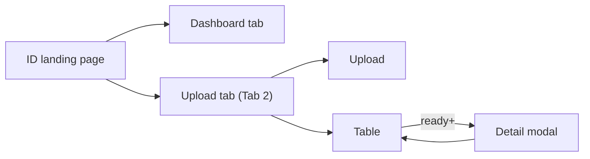
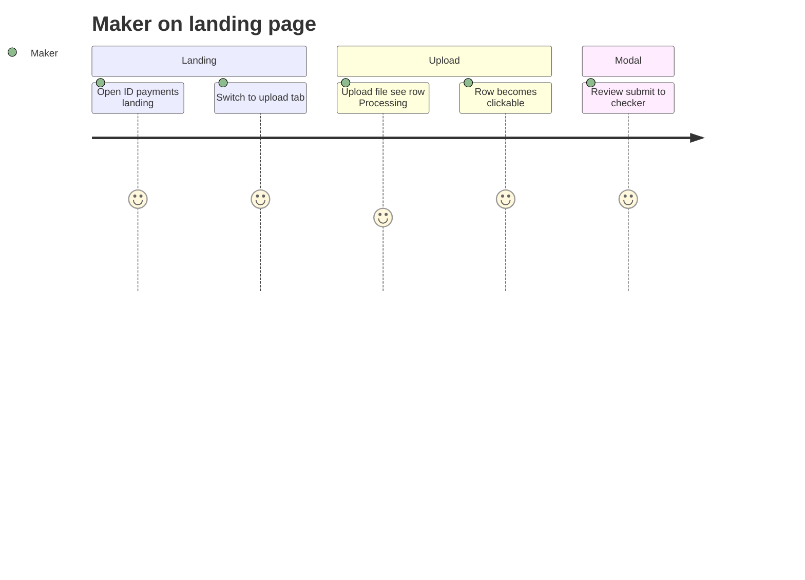
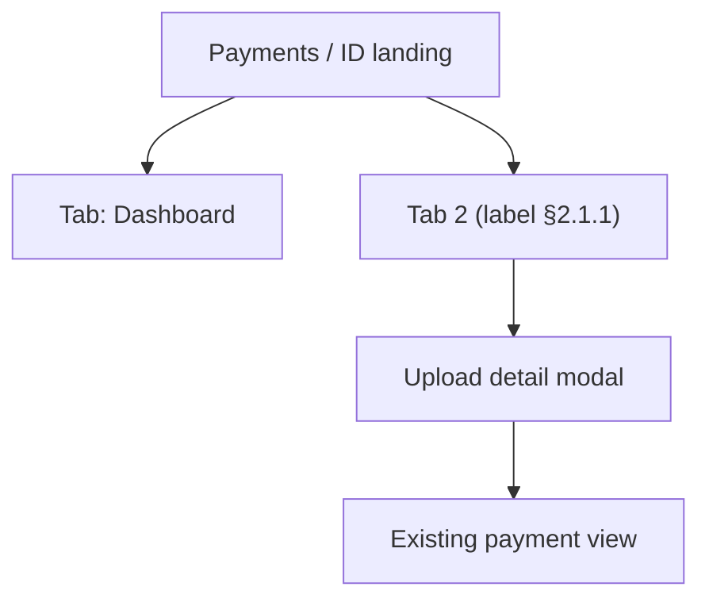

# FSS Payments Document Upload — UX Design Specification

> **Status:** **Final v4** — ZIP bulk upload, multi-instruction review (see [README.md](./README.md))  
> **Created:** 2026-07-30 · **Finalized:** 2026-08-04  
> **Related:** [README.md](./README.md) · [IDP_Document_Ingestion_Design.md](./IDP_Document_Ingestion_Design.md) · [IDP_LLD.md](./IDP_LLD.md) · [IDP_API_Reference.md](./IDP_API_Reference.md) · [../after_ocr-llm-output.json](../after_ocr-llm-output.json)

---

## 1. Design principle

**Existing landing page + tabs** — do not add a new top-level menu item.

| Pattern | Detail |
|---------|--------|
| Landing page | **Keep** current ID Payments dashboard as default view |
| Navigation | **Two tabs** on the same landing page |
| IDP UX | **One tab** = upload zone + table + **detail modal** (no extra routes) |
| Processing | Status in table; row click disabled until ready |

---

## 2. Landing page — tab layout

### 2.1 Tab names

| Tab | Label (UI) | Purpose |
|-----|------------|---------|
| **Tab 1** | **Dashboard** | Existing landing content (charts, summaries, task counts — **no change**) |
| **Tab 2** | **TBD — pick from §2.1.1** | Upload, uploads list, review/approve in modal |

#### 2.1.1 Tab 2 label options (pick one for UX sign-off)

| # | Tab label | Tone | Best when |
|---|-----------|------|-----------|
| A | **Upload & review** | Action-oriented | Makers do upload + checker reviews here — describes the full loop |
| B | **Payment instructions** | Business / formal | Matches “payment instruction document” language in ops |
| C | **Instruction upload** | Short + specific | Clear it’s uploaded instructions, not generic files |
| D | **Upload documents** | Simple | Closest to legacy “upload” screen; lowest jargon |
| E | **Document upload** | Simple | Even shorter; upload-first |
| F | **Payment documents** | Domain | Emphasizes payment context vs generic document mgmt |
| G | **Scan & submit** | Legacy-adjacent | If legacy UX used scan/OCR wording |
| H | **From document** | Workflow hint | Implies payment created from a file (vs manual entry) |
| I | **File to payment** | Process hint | Describes outcome: file becomes a payment |
| J | **Instructions (upload)** | Paired with Dashboard | “Dashboard” vs “Instructions (upload)” — parallel structure |

**Avoid for tab label (too internal or vague):** IDP, ingestion, intake, OCR, LLM, Camunda, SSTM.

**Shortlist for review (recommended top 3):**

1. **Upload & review** — covers upload + maker/checker in one label  
2. **Payment instructions** — professional; fits banking ops vocabulary  
3. **Instruction upload** — short; distinct from manual payment keying  

**Internal / code name (stable regardless of UI label):** `instruction-upload` — tab id, feature flag, URL query `?tab=instruction-upload`.

### 2.2 Route & deep linking

| Item | Value |
|------|--------|
| Base route | Existing landing, e.g. `/payments/id` or current dashboard path — **unchanged** |
| Default tab | `dashboard` |
| Upload tab | `?tab=instruction-upload` (or final slug from §2.1.1) |
| Deep link to row | `?tab=instruction-upload&uploadId={extractionUploadId}` → opens modal on load |

### 2.3 Landing page wireframe (tabs)

```
┌─────────────────────────────────────────────────────────────────────────┐
│ Payments / Indonesia (ID)                                               │
├─────────────────────────────────────────────────────────────────────────┤
│  [ Dashboard ]  [ Upload & review * ]        ← tab bar (* label TBD §2.1.1) │
├─────────────────────────────────────────────────────────────────────────┤
│                                                                         │
│  (Tab 1: existing dashboard — unchanged)                                │
│  OR                                                                     │
│  (Tab 2: upload + table — see §2.4)                                     │
│                                                                         │
└─────────────────────────────────────────────────────────────────────────┘
```

### 2.4 Upload tab content (Tab 2)

Same single-surface pattern as before — **all IDP functionality lives in this tab only.**

```
┌─────────────────────────────────────────────────────────────────────────┐
│  [ Dashboard ]  [ Upload & review * ● ]                                   │
├─────────────────────────────────────────────────────────────────────────┤
│ UPLOAD PAYMENT DOCUMENT                                                 │
│ Entity [ID]  Dept ▼  Process ▼  SubProcess ▼  Activity ▼  SubAct ▼    │
│ [ Choose file ] 3897122.pdf or batch.zip   [ Upload ]                   │
│ Accepts: .pdf (single) or .zip (multiple PDFs inside; other files ignored) │
├─────────────────────────────────────────────────────────────────────────┤
│ UPLOADS                                          Recent first             │
├──────────────┬────────────┬──────────────┬────────────┬──────────────┬─────┤
│ File name    │ Uploaded   │ Status       │ Instructions │ Confidence   │ By  │
├──────────────┼────────────┼──────────────┼──────────────┼──────────────┼─────┤
│ 3897122.pdf  │ 10:22 today│ Ready review │ 18           │ 91.2%        │ you │  ← multi-instruction
│ 3897011.pdf  │ 09:15 today│ Processing   │ —            │ —            │ you │  ← disabled
│ 3896990.pdf  │ yesterday  │ Submitted    │ 2            │ 95.0%        │ jsmith│
│ 3896880.pdf  │ yesterday  │ Completed    │ 1            │ 96.5%        │ you │
└──────────────┴────────────┴──────────────┴──────────────┴──────────────┴─────┘
     Instructions = instruction_count · Confidence = overall LLM extract confidence (meta.confidence)
```

After upload: stay on **upload tab**; new row(s) appear at top with `Processing`. ZIP uploads create **one table row per PDF** (shared `batchId`); show a toast summarising count and any `skippedEntries`.

**Table rules**

- Sort: `uploaded_timestamp` descending (recent first)  
- Auto-refresh every 5s while any row is processing (pause when modal open)  
- Optional filters: Status, date range, My uploads only, **Batch ID** (for ZIP uploads)  

#### 2.4.1 Table column rule — instructions only (no payment ref)

The uploads table **always** shows **instruction count** in the Instructions column (`1`, `2`, `18`), regardless of status — including `COMPLETED`. Do **not** swap that column to `PAY-12345` for completed files; mixed semantics (numbers vs payment refs in the same column) confuses users.

**Payment references and navigation** live in the **detail modal** only:

- `COMPLETED` → open modal (same screen as review) → per-instruction **View payment** link when `paymentRef` / `paymentId` is set on `ingestDetails[]`
- Single-payment file: table shows `1`; user clicks row → modal → one link
- Multi-payment file: table shows `18`; user clicks row → modal → 18 links in left panel or footer

---

## 3. Row click behavior

| Status | Row | Click | Modal |
|--------|-----|-------|-------|
| `Processing` / OCR / LLM | Muted | **Disabled** | — |
| `FAILED` | Error chip | Enabled | Error + Re-upload (maker) |
| `READY_FOR_REVIEW` | Active | Enabled | Editable |
| `SUBMITTED` | Active | Enabled | Read-only (submit acknowledged) |
| `TRIGGERING_PAYMENT` | Active | Enabled | Read-only (routing in progress) |
| `COMPLETED` | Active | Enabled | Read-only + payment link(s) |
| `COMPLETED` | Neutral | Enabled | Read-only view |
| `CANCELLED` | Muted | Optional | Read-only |

Disabled row tooltip: *“Still processing — available when extraction completes”*.

---

## 4. Detail modal — multi-instruction review (10–20 per file)

Tabs **do not scale** beyond ~5 instructions. Use a **master–detail** layout: scrollable instruction list on the left, full field editor on the right.

### 4.1 Layout (recommended)

```
┌──────────────────────────────────────────────────────────────────────────────┐
│ 3897122.pdf · 18 instructions · Ready for review          Confidence: 91.2% [×]│
     API: instructionCount · confidence (getDetail / meta)
├───────────────────────────────┬──────────────────────────────────────────────┤
│ INSTRUCTIONS (18)             │ INSTRUCTION 7 — 3897122-007                  │
│ [Search…] [SubAct ▼] [BT|OTT] │ SubActivity: Subscription · TrnTyp: BT       │
│ ┌────┬──────────┬─────┬──────┐│ ┌──────────────────────────────────────────┐ │
│ │ #  │ TxRef    │SubAct│Conf││ │ TRANSACTION DETAILS (editable grid)      │ │
│ ├────┼──────────┼─────┼──────┤│ │ Field          │ Value      │ Conf       │ │
│ │ 1  │ …-001    │ Red │ 97 ││ │ │ TrnTyp         │ Redemption │ 94.7       │ │
│ │ 2  │ …-002    │ Sub │ 95 ││ │ │ ClntNm         │ PT BNI…    │ 93.2       │ │
│ │…   │          │     │    ││ │ │ ValDt          │ 2025-10-29 │ 94.0       │ │
│ │ 7● │ …-007    │ Sub │ 88⚠││ │ └──────────────────────────────────────────┘ │
│ │…   │          │     │    ││ │ DEBIT / CREDIT legs (same grid pattern)      │
│ │ 18 │ …-018    │ OTT │ 96 ││ │                                              │
│ └────┴──────────┴─────┴──────┘│                                              │
├───────────────────────────────┴──────────────────────────────────────────────┤
│ ⚠ 3 instructions below confidence threshold · [Show low-confidence only]      │
│ Comments (file-level)                                                          │
│ [ Save draft ]  [ Submit for routing ]  [ Re-extract ]  [ Cancel upload ]      │
└──────────────────────────────────────────────────────────────────────────────┘
```

### 4.2 Instruction list (left panel)

Data source: `GET .../getDetail?uploadId=` → `ingestDetails[]` (one row per `fss_payment_data_ingest_details`).

| Column | Source | Purpose |
|--------|--------|---------|
| `#` | `instructionIndex + 1` | Row number |
| `TxRef` | `tx_ref` (denormalized) | Quick identity |
| `SubAct` | `sub_activity_id` | Redemption / Subscription / … |
| `Type` | `activity_id` or `trn_typ` | BT / OTT badge |
| `ValDt` | `value_date` | Sortable |
| `Amount` | `debit_amount` | Optional |
| `Conf` | `confidence_score` | Color-coded |
| `⚠` | `low_confidence_field_count > 0` | Needs attention |

**Interactions:**

- **Search** — filter by TxRef, client name, account number (server-side or client filter on denormalized fields).
- **SubActivity filter** — multi-select chips (Redemption, Subscription, …) from distinct values in the batch.
- **BT / OTT toggle** — filter by `activity_id`.
- **“Low confidence only”** — hides rows where all fields pass threshold.
- **Keyboard** — ↑/↓ moves selection; right panel updates without closing modal.
- **Row click** — loads `extracted_data` field grids in right panel; **Save draft** persists edits for **selected** `detailId` only.

### 4.3 Right panel (field editor)

Same field grids as today (`TransactionDetails`, `DebitDetails`, `CreditDetails`) scoped to **one** `ingestDetails[].extractedData`. Low-confidence cells highlighted (`Confidence < 90`).

After submit for routing, show **View payment** link on each instruction when `paymentId` / `paymentRef` is set (`COMPLETED`). For `READY_FOR_REVIEW`, no payment links — fields only.

**Completed modal (read-only):** same master–detail layout; footer shows **Close** (+ optional **View payment** for selected instruction). Payment refs are never duplicated in the uploads table.

### 4.4 Uploads table (landing)

| File name | Uploaded | Status | Instructions | Confidence | By |
|-----------|----------|--------|--------------|------------|-----|
| 3897122.pdf | today | Ready | **18** | 91.2% | you |

**API mapping** ([API Reference §2.3](./IDP_API_Reference.md#23-get-apifsspaymentsgatewayv1extraction-uploadsgetuploads)):

| Column | Response field | DB source |
|--------|----------------|-----------|
| Instructions | `instructionCount` | `fss_payment_upload_meta.instruction_count` |
| Confidence | `confidence` — hide when `null` (`PROCESSING`) | `fss_payment_upload_meta.confidence` — overall LLM extract confidence for the document |

Aggregates are **stored on meta** and refreshed on write — not computed on each list poll ([LLD §5.1.1](./IDP_LLD.md#511-file-level-aggregates-on-meta-denormalized--not-computed-on-list-read)).

Do **not** show `paymentRef` in the table. Payment links: `getDetail` → `ingestDetails[].paymentRef` in modal only ([§2.4.1](./IDP_UX_Design.md#241-table-column-rule--instructions-only-no-payment-ref)).

Do **not** list 18 rows on the landing table — one row per **PDF**; drill into modal for instructions and payment links.

### 4.5 Why this fits the data model

| Layer | Camunda | DB | UI |
|-------|---------|-----|-----|
| File | 1× `FSS_Payments_Document_Ingestion` per PDF | 1× `fss_payment_upload_meta` | 1 uploads-table row |
| Instruction | N/A until handoff | N× `fss_payment_data_ingest_details` | N rows in left panel |
| Payment | N× `IAP_ID_Payments` after submit | N× `message_id` on detail rows | N payment links post-handoff |

One user review task covers **the whole file**; each instruction still gets its own `fss_services_message` and payment process at handoff.

---

## 4.6 Detail modal (legacy wireframe — 2-instruction tabs)

For files with **≤5** instructions, horizontal tabs remain acceptable. Default to master–detail when `ingestDetails.length > 5` (configurable).

---

## 5. Modal buttons by role and status

### User (`paymentMaker`)

| Status | Fields | Buttons |
|--------|--------|---------|
| `READY_FOR_REVIEW` | Editable | Save draft · Submit for routing · Re-extract · Cancel upload |
| `SUBMITTED` / `TRIGGERING_PAYMENT` | Read-only | Close (routing in progress) |
| `COMPLETED` | Read-only | Close · **View payment** (per instruction in modal — not in table) |
| `FAILED` | Error | Re-upload · Close |
| `CANCELLED` | Read-only | Close |

| Button | Gateway API (not workflow-management) |
|--------|--------------------------------------|
| Submit for routing | `POST .../performAction?uploadId={id}` `{ "action": "SUBMIT" }` (optional alias: `/submit`) |
| Cancel upload | `POST .../performAction?uploadId={id}` `{ "action": "CANCEL" }` (optional alias: `/cancel`) |
| Re-extract | `POST .../re-extract?uploadId={id}` → row returns to Processing |

---

## 6. User journey





---

## 7. Information architecture



- **No new sidebar menu item** for v1  
- Optional: Dashboard widget “Pending reviews (3)” → switches to upload tab  

---

## 8. Implementation guide (frontend)

### 8.1 Page structure

| Piece | Action |
|-------|--------|
| `IdPaymentsLandingPage` (existing) | Add tab container; wrap current body in **Dashboard** tab |
| `InstructionUploadTab` | **New** — upload form + uploads table |
| `UploadDetailModal` | **New** — fields grid + role-based footer actions |
| `useUploadsTable` | **New** — fetch, poll, sort recent-first |
| Feature flag | e.g. `idp.instruction-upload.enabled` — hide tab when off |

### 8.2 Component breakdown

```
IdPaymentsLandingPage
├── TabBar
│   ├── Tab "Dashboard"     → DashboardTab (existing content, unchanged)
│   └── Tab (TBD label) → InstructionUploadTab (new)
│         ├── UploadForm
│         │     ├── MetadataDropdowns (dept, process, …)
│         │     ├── FilePicker
│         │     └── UploadButton → POST /v1/idp/uploads
│         ├── UploadsTable
│         │     ├── columns: file, uploaded, status, instructions, confidence, by
│         │     ├── rowClick → open modal if clickable
│         │     └── polling when status = processing
│         └── UploadDetailModal (portal)
│               ├── FieldGrids (transaction, debit, credit)
│               ├── CommentsField
│               └── ActionBar (role + status driven)
```

### 8.3 Tab state

| Concern | Approach |
|---------|----------|
| Active tab | URL query `tab=instruction-upload` (shareable, back button works) |
| Persist on upload | After upload, force upload tab active |
| Modal + URL | `uploadId` in query opens modal; closing removes `uploadId` |
| Dashboard default | `tab` absent or `tab=dashboard` |

### 8.4 Role detection

Use existing portal auth / candidate groups:

- `paymentMaker` → editable modal + upload form visible  
- `paymentChecker` → no upload form (optional: hide Upload zone for checker-only users)  
- Both → show upload; modal actions depend on status + task assignee  

### 8.5 API calls (by interaction)

See [IDP_API_Reference.md](./IDP_API_Reference.md) for full request/response shapes.

| Interaction | API |
|-------------|-----|
| Tab load | `GET /api/fss/payments/gateway/v1/extraction-uploads/getUploads?sort=recent` |
| Upload (PDF or ZIP) | `POST /api/fss/payments/gateway/v1/extraction-uploads` |
| Table poll | `GET .../getUploads?sort=recent` every 5s if processing rows exist |
| Open modal | `GET .../getDetail?extractionUploadId={id}` |
| Save draft | `POST .../fields?extractionUploadId={id}` |
| Submit / Cancel | `POST .../performAction?uploadId={id}` with `{ "action": "SUBMIT" | "CANCEL" }` — optional `/submit`, `/cancel` aliases — **never** direct `workflow-management` |
| Re-extract | `POST .../re-extract?extractionUploadId={id}` |
| View payment(s) | Navigate to payment detail per `paymentHandoffs[]` entry |

### 8.6 Backend / workflow

| UI action | Workflow effect |
|-----------|-----------------|
| Upload (PDF) | Starts `FSS_Payments_Document_Ingestion` — one instance per PDF |
| Upload (ZIP) | Unpacks PDFs; one ingestion instance **per PDF**; shared `batchId` |
| Submit for routing | `POST .../performAction?uploadId={id}` `{ "action": "SUBMIT" }` → gateway DB + audit → `Extraction_UserReview` complete → `Trigger_Payment_From_Extraction` → **N ×** `IAP_ID_Extraction_Trigger` |

UI change is **placement on landing tabs**, not workflow change. Entity routing is config-driven in gateway — see [IDP_Document_Ingestion_Design.md §2.1](./IDP_Document_Ingestion_Design.md#21-entity--payment-routing-responsibilities) and [IDP_LLD.md §4](./IDP_LLD.md#4-entity-routing--template-config).

### 8.7 Implementation checklist

- [ ] Add `TabBar` to existing ID landing page  
- [ ] Move current dashboard into `Dashboard` tab (zero functional change)  
- [ ] Add upload tab (final label from §2.1.1) behind feature flag  
- [ ] Implement `UploadForm` + validation  
- [ ] Implement `UploadsTable` with disabled rows for processing  
- [ ] Implement `UploadDetailModal` with role/status actions  
- [ ] URL sync: `tab` + optional `uploadId`  
- [ ] Polling stops when modal open or no processing rows  
- [ ] (Optional) Dashboard badge linking to upload tab  

---

## 9. Legacy migration

| Legacy | New |
|--------|-----|
| External portal list | Upload tab **table** |
| External upload form | **Upload zone** in same tab |
| OCR status screen | **Status** column + disabled rows |
| Field review screen | **Modal** |

---

## 10. UX acceptance criteria

- [ ] Landing page opens on **Dashboard** tab by default  
- [ ] Upload tab shows upload + table without leaving landing page  
- [ ] Dashboard tab content unchanged from current prod  
- [ ] Upload adds row at top; user remains on upload tab  
- [ ] Processing rows not clickable  
- [ ] Modal actions match role + status (§5)  
- [ ] Deep link `?tab=instruction-upload&uploadId=` opens modal  
- [ ] Feature flag hides upload tab when disabled  

---

## 11. Out of scope (v1)

- New sidebar nav entry for IDP  
- Separate `/payments/id/idp` route  
- Batch multi-file upload  

---

## 12. Document history

| Date | Change |
|------|--------|
| 2026-07-30 | Initial multi-screen spec |
| 2026-07-30 | Simplified to single page + modal |
| 2026-07-30 | Tabs on existing landing: Dashboard + upload tab (label TBD §2.1.1) |
| 2026-08-02 | Final pack; §8.6 routing cross-reference; confidence UI aligned with LLM contract |

---

## 13. Open questions

| # | Question |
|---|----------|
| 1 | Final tab label — see §2.1.1 shortlist |
| 2 | Show upload form to checkers or maker-only? |
| 3 | Dashboard widget count for pending document tasks? |
| 4 | PDF preview in modal v1? |
