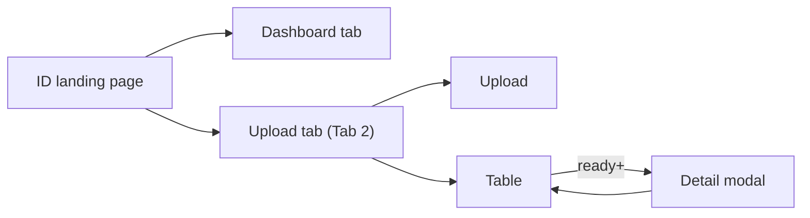
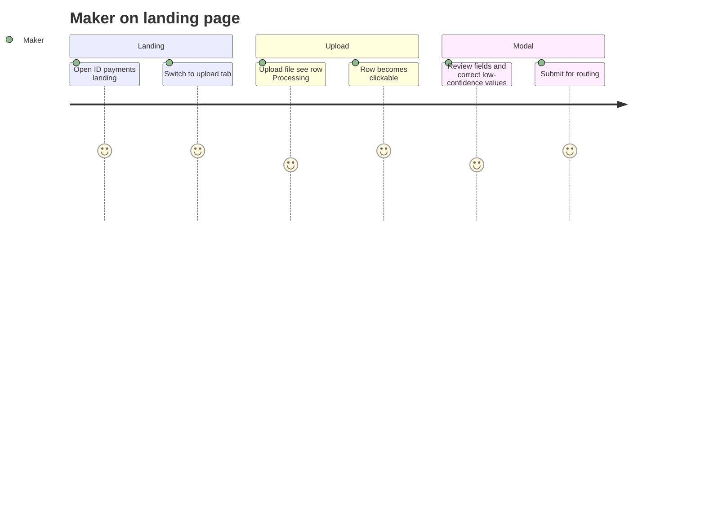
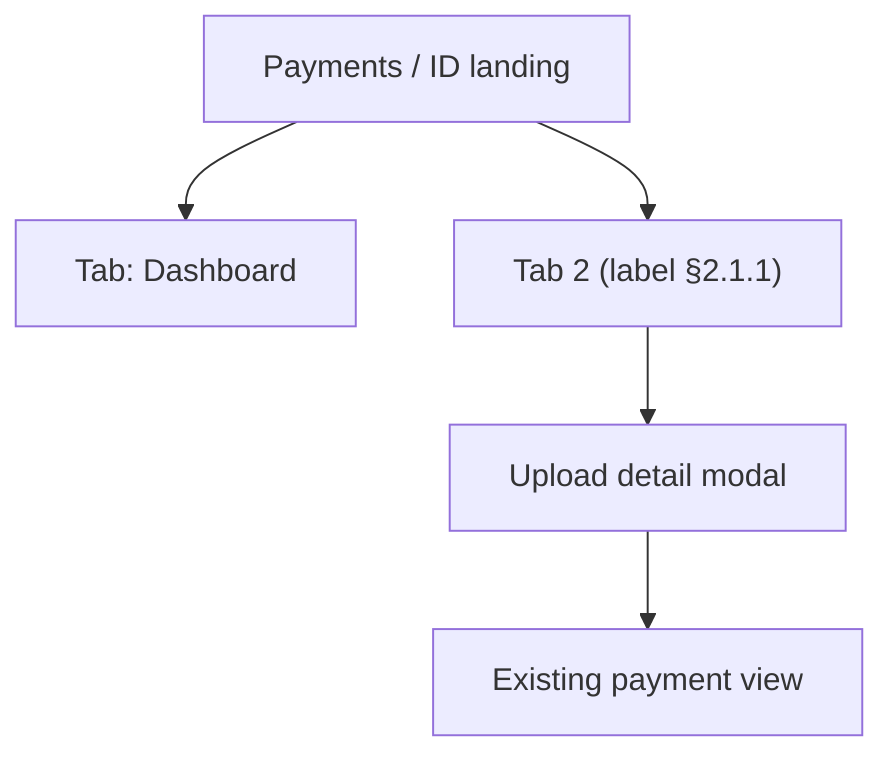

# FSS Payments Document Upload — UX Design Specification

> **Status:** **Final v5** — ZIP bulk upload, multi-instruction review, password-protected upload; **re-extract removed**; per-row status; three confidence scopes (see [README.md](./README.md))  
> **Created:** 2026-07-30 · **Finalized:** 2026-08-04 · **Corrected:** 2026-08-10 (v5)  
> **Related:** [README.md](./README.md) · [IDP_Document_Ingestion_Design.md](./IDP_Document_Ingestion_Design.md) · [IDP_LLD.md](./IDP_LLD.md) · [IDP_API_Reference.md](./IDP_API_Reference.md) · [../after_ocr-llm-output.json](../after_ocr-llm-output.json)

> **v5 — what changed and why it matters on screen.**
>
> | Change | UI consequence |
> | --- | --- |
> | **Re-extract removed** ([API §2.6](./IDP_API_Reference.md#26-removed-post-re-extract)) | The **Re-extract** button is gone from the modal footer. `FAILED` is terminal, and the only recovery is **Upload again** — which, for an encrypted document, means **re-entering the password**, because it is never stored |
> | **A file's status is a fold over its instructions** ([LLD §5.3.2](./IDP_LLD.md#532-the-fold--how-metastatus-is-derived-from-its-children)) | A file chipped `Failed` can still contain instructions that extracted cleanly. The modal must show a **status per instruction row**, not only the file chip, or those rows look identical to the broken ones |
> | **Confidence exists at three scopes** ([API §2.3](./IDP_API_Reference.md#response-fields-content--maps-to-uploadsummarydto)) | The table's `Confidence` is the **file** score straight from the payload — it will not equal the average of the row scores in the modal, so the two must be labelled distinctly rather than both called "Confidence" |
> | **Password-protected upload** ([LLD §9.8.5](./IDP_LLD.md#985-ui-contract)) | The upload form gains a *Password protected?* toggle and a password field ([§2.4.0](#240-password-protected-uploads)) |
> | **Feature flag renamed** | `idp.instruction-upload.enabled` is **retired**. The single kill-switch is the backend property `extraction.upload.enabled` (§8.1) |

---

## 1. Design principle

**Existing landing page + tabs** — do not add a new top-level menu item.

| Pattern | Detail |
|---------|--------|
| Landing page | **Keep** current ID Payments dashboard as default view |
| Navigation | **Two tabs** on the same landing page |
| IDP UX | **One tab** = upload zone + table + **detail modal** (no extra routes) |
| Processing | Status in table; row click disabled until ready |

---

## 2. Landing page — tab layout

### 2.1 Tab names

| Tab | Label (UI) | Purpose |
|-----|------------|---------|
| **Tab 1** | **Dashboard** | Existing landing content (charts, summaries, task counts — **no change**) |
| **Tab 2** | **TBD — pick from §2.1.1** | Upload, uploads list, review/approve in modal |

#### 2.1.1 Tab 2 label options (pick one for UX sign-off)

| # | Tab label | Tone | Best when |
|---|-----------|------|-----------|
| A | **Upload & review** | Action-oriented | Makers do upload + checker reviews here — describes the full loop |
| B | **Payment instructions** | Business / formal | Matches “payment instruction document” language in ops |
| C | **Instruction upload** | Short + specific | Clear it’s uploaded instructions, not generic files |
| D | **Upload documents** | Simple | Closest to legacy “upload” screen; lowest jargon |
| E | **Document upload** | Simple | Even shorter; upload-first |
| F | **Payment documents** | Domain | Emphasizes payment context vs generic document mgmt |
| G | **Scan & submit** | Legacy-adjacent | If legacy UX used scan/OCR wording |
| H | **From document** | Workflow hint | Implies payment created from a file (vs manual entry) |
| I | **File to payment** | Process hint | Describes outcome: file becomes a payment |
| J | **Instructions (upload)** | Paired with Dashboard | “Dashboard” vs “Instructions (upload)” — parallel structure |

**Avoid for tab label (too internal or vague):** IDP, ingestion, intake, OCR, LLM, Camunda, SSTM.

**Shortlist for review (recommended top 3):**

1. **Upload & review** — covers upload + maker/checker in one label  
2. **Payment instructions** — professional; fits banking ops vocabulary  
3. **Instruction upload** — short; distinct from manual payment keying  

**Internal / code name (stable regardless of UI label):** `instruction-upload` — tab id, feature flag, URL query `?tab=instruction-upload`.

### 2.2 Route & deep linking

| Item | Value |
|------|--------|
| Base route | Existing landing, e.g. `/payments/id` or current dashboard path — **unchanged** |
| Default tab | `dashboard` |
| Upload tab | `?tab=instruction-upload` (or final slug from §2.1.1) |
| Deep link to row | `?tab=instruction-upload&uploadId={uploadId}` → opens modal on load. A `404` from the deep link is normal for another entity's upload (§8.4) |

### 2.3 Landing page wireframe (tabs)

```
┌─────────────────────────────────────────────────────────────────────────┐
│ Payments / Indonesia (ID)                                               │
├─────────────────────────────────────────────────────────────────────────┤
│  [ Dashboard ]  [ Upload & review * ]        ← tab bar (* label TBD §2.1.1) │
├─────────────────────────────────────────────────────────────────────────┤
│                                                                         │
│  (Tab 1: existing dashboard — unchanged)                                │
│  OR                                                                     │
│  (Tab 2: upload + table — see §2.4)                                     │
│                                                                         │
└─────────────────────────────────────────────────────────────────────────┘
```

### 2.4 Upload tab content (Tab 2)

Same single-surface pattern as before — **all IDP functionality lives in this tab only.**

```
┌─────────────────────────────────────────────────────────────────────────┐
│  [ Dashboard ]  [ Upload & review * ● ]                                   │
├─────────────────────────────────────────────────────────────────────────┤
│ UPLOAD PAYMENT DOCUMENT                                                 │
│ Entity [ID]                                                             │
│ [ Choose file ] 3897122.pdf or batch.zip                                │
│ Password protected?  [ No ●────○ Yes ]                                  │
│ Password: [ •••••••• ]        ← shown only when the slider is Yes       │
│                                               [ Upload ]                │
│ Accepts: .pdf (single) or .zip (multiple PDFs inside; other files ignored) │
├─────────────────────────────────────────────────────────────────────────┤
│ UPLOADS                                          Recent first             │
├──────────────┬────────────┬──────────────┬────────────┬──────────────┬─────┤
│ File ID / name             │ Uploaded   │ Status       │ Instructions │ Confidence │
├──────────────┼────────────┼──────────────┼──────────────┼──────────────┼─────┤
│ 3897122.pdf  │ 10:22 today│ Ready review │ 18           │ 91.2%        │ you │  ← multi-instruction
│ 3897011.pdf  │ 09:15 today│ Processing   │ —            │ —            │ you │  ← disabled
│ 3896990.pdf  │ yesterday  │ Submitted    │ 2            │ 95.0%        │ jsmith│
│ 3896880.pdf  │ yesterday  │ Completed    │ 1            │ 96.5%        │ you │
│ 3896875.pdf  │ yesterday  │ Failed       │ —            │ —            │ you │  ← terminal
└──────────────┴────────────┴──────────────┴──────────────┴──────────────┴─────┘
     Instructions = instruction_count · Confidence = whole-file score from the extraction payload (meta.confidence)
```

#### 2.4.0 Password-protected uploads

| UI state | Behaviour |
|----------|-----------|
| Slider = **No** | `passwordProtected=false`; the `password` part is omitted from the request entirely |
| Slider = **Yes** | `passwordProtected=true`; the password field appears and **Upload** stays disabled until it is filled |
| Upload clicked with an empty password | Client-side validation blocks it — do not POST |

For a ZIP, the password opens the **archive**, not the PDFs inside it. Field attributes: `type="password"`, `autocomplete="off"`, cleared from component state after a successful upload and on tab close.

**The password is never stored server-side, and the UI has to be honest about the consequence.** It is used in memory to decrypt and then discarded, so there is no saved copy to reuse. Any retry of a protected document is a fresh upload with the password re-entered — which is also why no screen offers to "retry" a failed file ([§3](#3-row-click-behavior)).

After upload: stay on **upload tab**; new row(s) appear at top with `Processing`. ZIP uploads create **one table row per PDF** (shared `batchId`); show a toast summarising count and any `skippedEntries`. Each row shows its system-generated **File ID** above or beside the original file name.

**Table rules**

- Sort: `uploaded_timestamp` descending (recent first)  
- Auto-refresh every 5s while any row is processing (pause when modal open)  
- Optional filters: Status, date range, My uploads only, **Batch ID** (for ZIP uploads)  

#### 2.4.1 File ID display and assignment

- Display the File ID as the primary row identifier, e.g. `26IDJY00002`; retain the original file name as secondary text.
- Format: `YYENTYXXXXX` — `YY` is the upload year, `ENTY` is the user's Level-1 access (Entity Location + support region/area), `XXXXX` is the system-generated sequence starting at `00001`.
- `ENTY` is configuration-driven: `IDJY` for Indonesia now; each further rollout supplies its own four-character code.
- The backend identifies all eligible files, sorts them by file upload timestamp ascending, and allocates one sequence value per file in that order.
- Equal timestamps are resolved deterministically by normalized ZIP source path and then discovery order. Therefore, duplicate file names in different ZIP folders always receive distinct File IDs.
- This ascending order is an **ID-assignment rule** only. The landing table remains sorted by `uploaded_timestamp` descending (recent first).

**Treat the File ID as variable-length text.** The sequence is padded to five digits, but it is not capped there: after `26IDJY99999` the next ID is `26IDJY100000`. Size the column for at least 16 characters, never truncate it, and never sort rows by File ID as a string — sort by uploaded timestamp. Search and filter must match on prefix or substring rather than an exact 11-character pattern.

#### 2.4.2 Table column rule — instructions only (no payment ref)

The uploads table **always** shows **instruction count** in the Instructions column (`1`, `2`, `18`), regardless of status — including `COMPLETED`. Do **not** swap that column to `PAY-12345` for completed files; mixed semantics (numbers vs payment refs in the same column) confuses users.

**Payment references and navigation** live in the **detail modal** only:

- `COMPLETED` → open modal (same screen as review) → per-instruction **View payment** link when `paymentRef` is set on `ingestDetails[]`
- Single-payment file: table shows `1`; user clicks row → modal → one link
- Multi-payment file: table shows `18`; user clicks row → modal → 18 links in left panel or footer

---

## 3. Row click behavior

The Status column shows the **file** status. Every status is one of eight values ([API §2.3](./IDP_API_Reference.md#23-get-apifsspaymentsgatewayv1extraction-uploadsgetuploads)) — there is no ninth, and no client-side status the API does not send.

| Status | Row | Click | Modal |
|--------|-----|-------|-------|
| `UPLOADED` | Muted | **Disabled** | — (transient; usually never seen) |
| `PROCESSING` | Muted | **Disabled** | — |
| `READY_FOR_REVIEW` | Active | Enabled | Editable |
| `SUBMITTED` | Active | Enabled | Read-only (submit acknowledged) |
| `TRIGGERING_PAYMENT` | Active | Enabled | Read-only (routing in progress) |
| `COMPLETED` | Active | Enabled | Read-only + payment link(s) |
| `FAILED` | Error chip | Enabled | Read-only — reason + **Upload again** |
| `CANCELLED` | Muted | Enabled | Read-only |

Disabled row tooltip: *"Still processing — available when extraction completes"*.

**`FAILED` is terminal and the modal must not imply otherwise.** There is no re-extract and no retry action; the only way forward is uploading the document again, which creates a **new row with a new File ID**. The failed row stays in the table as the record of what happened. Copy the user sees: *"Extraction failed — {reason}. Upload the document again to retry."* Never *"Retry"* or *"Re-extract"*, both of which promise an in-place recovery that does not exist.

**A `FAILED` file can still contain instructions that extracted cleanly, so the modal shows both the file chip and a per-instruction chip.** The file status is a fold over its instructions with `FAILED` ranked first ([API §2.4](./IDP_API_Reference.md#24-get-apifsspaymentsgatewayv1extraction-uploadsgetdetailuploadidid)), so one bad instruction out of eighteen turns the whole file red. Showing only the header chip would hide seventeen usable rows; showing only row chips would hide that the file cannot be submitted. Render `status` in the modal header **and** `ingestDetails[].status` on each left-panel row.

**Instruction rows never read `UPLOADED` or `PROCESSING`.** Those two exist only on the file, because instruction rows are not created until extraction returns. A left-panel chip for either value indicates a frontend bug, not a real state.

---

## 4. Detail modal — multi-instruction review (10–20 per file)

Tabs **do not scale** beyond ~5 instructions. Use a **master–detail** layout: scrollable instruction list on the left, full field editor on the right.

### 4.1 Layout (recommended)

```
┌──────────────────────────────────────────────────────────────────────────────┐
│ 3897122.pdf · 18 instructions · Ready for review          Confidence: 91.2% [×]│
     API: instructionCount · confidence (getDetail / meta)
├───────────────────────────────┬──────────────────────────────────────────────┤
│ INSTRUCTIONS (18)             │ INSTRUCTION 7 — 3897122-007                  │
│ [Search…] [Txn type ▼]        │ TrnTyp: Subscription                         │
│ ┌────┬──────────┬─────┬──────┐│ ┌──────────────────────────────────────────┐ │
│ │ #  │ TxRef    │Type │Conf││ │ TRANSACTION DETAILS (editable grid)      │ │
│ ├────┼──────────┼─────┼──────┤│ │ Field          │ Value      │ Conf       │ │
│ │ 1  │ …-001    │ Red │ 97 ││ │ │ TrnTyp         │ Redemption │ 94.7       │ │
│ │ 2  │ …-002    │ Sub │ 95 ││ │ │ ClntNm         │ PT BNI…    │ 93.2       │ │
│ │…   │          │     │    ││ │ │ ValDt          │ 2025-10-29 │ 94.0       │ │
│ │ 7● │ …-007    │ Sub │ 88⚠││ │ └──────────────────────────────────────────┘ │
│ │…   │          │     │    ││ │ DEBIT / CREDIT legs (same grid pattern)      │
│ │ 18 │ …-018    │ Red │ 96 ││ │                                              │
│ └────┴──────────┴─────┴──────┘│                                              │
├───────────────────────────────┴──────────────────────────────────────────────┤
│ ⚠ 3 instructions below confidence threshold · [Show low-confidence only]      │
│ Comments (file-level)                                                          │
│ [ Save draft ]  [ Submit for routing ]  [ Cancel upload ]                      │
└──────────────────────────────────────────────────────────────────────────────┘
```

**Confidence: three different numbers on this one screen, and they must not be conflated.** The header shows the **file** score, each left-panel row shows its **instruction** score, and each right-panel cell shows its **field** score — all three come from the extraction payload ([LLD §6.4](./IDP_LLD.md#64-confidence--three-scopes-three-homes)). The header value is not the average of the rows, so a header reading 91.2% with rows at 97 and 88 is correct, not an inconsistency to "fix" in the frontend.

**The low-confidence threshold is server-supplied, not a frontend constant.** Cell highlighting, the `⚠` row badge, and the "N instructions below threshold" banner must all read the same number the server used to compute `lowConfidenceFieldCount` — `extraction.confidence.low-threshold`, default `90`. Hard-coding `90` in the UI works until the server value changes, at which point the badge and the highlighting disagree and neither is obviously wrong. Read it from the config the portal already fetches, or from the `getDetail` response.

### 4.2 Instruction list (left panel)

Data source: `GET .../getDetail?uploadId=` → `ingestDetails[]` (one row per `fss_payment_data_ingest_details`).

| Column | API field | Purpose |
|--------|-----------|---------|
| `#` | `instructionIndex + 1` | Row number |
| `TxRef` | `txRef` | Quick identity |
| `Type` | `trnTyp` | Transaction type — the grouping key |
| `Status` | `status` | Per-instruction chip — required, because it can differ from the file chip in the header (§3) |
| `ValDt` | `valueDate` | Sortable |
| `Amount` | `debitAmount` | Optional |
| `Conf` | `confidenceScore` | Color-coded — the **instruction** score, not the file score |
| `⚠` | `lowConfidenceFieldCount > 0` | Needs attention (derived server-side) |

Only `trnTyp` is a stored column; `txRef`, `valueDate`, `clientName`, `debitAmount`, and `lowConfidenceFieldCount` are parsed from the extracted JSON by the gateway before the response is sent ([LLD §5.1](./IDP_LLD.md#51-three-table-model)). The frontend consumes them the same way either case.

**Interactions:**

- **Search** — filter by TxRef or client name; client-side over the loaded `ingestDetails[]`.
- **Transaction type filter** — multi-select chips built from the distinct `trnTyp` values in this file.
- **“Low confidence only”** — hides rows where all fields pass threshold.
- **Keyboard** — ↑/↓ moves selection; right panel updates without closing modal.
- **Row click** — loads `extracted_data` field grids in right panel. Edits are held client-side per row; switching rows never discards them.
- **Dirty marker** — a row the maker has edited but not yet saved shows a distinct indicator (not the selection marker), so pending work is visible while scrolling a long list.
- **Save draft** — file-level footer button; persists **every dirty instruction in one call** (`POST .../fields?uploadId={id}` with `instructions[]`). It must not save only the selected row: the maker can edit instruction 1, arrow to instruction 7, edit that, and press one button, and both edits have to persist.

### 4.3 Right panel (field editor)

Same field grids as today (`TransactionDetails`, `DebitDetails`, `CreditDetails`) scoped to **one** `ingestDetails[].extractedData`. Cells whose field `Confidence` falls below the server threshold (§4.1) are highlighted.

**Every editable field lives under `initiationDetail`; nothing under `header` is editable.** The `header` node is built by the gateway from data it already owns — File ID, entity, uploader, timestamps — so it is not an extraction result the maker could sensibly correct ([API §5](./IDP_API_Reference.md#5-extraction-service-apis---51786-idp-extraction-service-built-one-change-required)). Render it as read-only context in the modal header, and note that the same `header` is repeated on every instruction of the file: editing it per row would be meaningless even if the API allowed it, which it does not — the `fields` request addresses paths relative to `initiationDetail`, so a header edit cannot be expressed at all.

After submit for routing, show **View payment** link on each instruction when `paymentRef` is set (`COMPLETED`). The reference is resolved server-side from the instruction's message key, so it stays `null` until the payment is actually saved — hide the link in that case rather than showing a dead one. For `READY_FOR_REVIEW`, no payment links — fields only.

**Completed modal (read-only):** same master–detail layout; footer shows **Close** (+ optional **View payment** for selected instruction). Payment refs are never duplicated in the uploads table.

**A save can come back `409` even though the maker did nothing wrong.** Two distinct cases, each with its own recovery — copy for both lives in [§5.1](#51-error-copy):

| Response | Recovery |
| --- | --- |
| `409 INVALID_STATUS_TRANSITION` | The upload moved on while the maker was reviewing. Reload the modal read-only |
| `409 CONCURRENT_EDIT` | Someone else changed this instruction. Offer **Reload** — never a silent auto-retry, which would overwrite their edit |

The save is **all-or-nothing across every dirty instruction**, so on failure the UI must keep all pending edits in state and repaint none of them as saved. Reporting partial success on a rejected batch is the worst outcome on this screen: the discarded values become real payments at handoff.

### 4.4 Uploads table (landing)

| File ID / name | Uploaded | Status | Instructions | Confidence | By |
|----------------|----------|--------|--------------|------------|-----|
| `26IDJY00002` / 3897122.pdf | today | Ready | **18** | 91.2% | you |

**API mapping** ([API Reference §2.3](./IDP_API_Reference.md#23-get-apifsspaymentsgatewayv1extraction-uploadsgetuploads)):

| Column | Response field | DB source |
|--------|----------------|-----------|
| File ID | `fileId` | `fss_payment_upload_meta.file_id` |
| File name | `fileName` | `fss_payment_upload_meta.file_name` |
| Instructions | `instructionCount` | `fss_payment_upload_meta.instruction_count` |
| Status | `uploadStatus` | `fss_payment_upload_meta.status` — the folded file status (§3) |
| Confidence | `confidence` — hide when `null` (`PROCESSING`, `FAILED`) | `fss_payment_upload_meta.confidence` — the **whole-file** score from the extraction payload, not an average of the instruction scores |

Aggregates are **stored on meta** and refreshed on write — not computed on each list poll ([LLD §5.1.2](./IDP_LLD.md#512-file-level-aggregates-on-meta-denormalized--not-computed-on-list-read)).

Do **not** show `paymentRef` in the table. Payment links: `getDetail` → `ingestDetails[].paymentRef` in modal only ([§2.4.2](./IDP_UX_Design.md#242-table-column-rule--instructions-only-no-payment-ref)).

Do **not** list 18 rows on the landing table — one row per **PDF**; drill into modal for instructions and payment links.

### 4.5 Why this fits the data model

| Layer | Camunda | DB | UI |
|-------|---------|-----|-----|
| File | 1× `FSS_Payments_Document_Ingestion` per PDF | 1× `fss_payment_upload_meta` | 1 uploads-table row |
| Instruction | N/A until handoff | N× `fss_payment_data_ingest_details` | N rows in left panel |
| Payment | N× `IAP_ID_Payments` after submit | N× `message_id` on detail rows | N payment links post-handoff |

One user review task covers **the whole file**; each instruction still gets its own `fss_services_message` and payment process at handoff.

---

## 4.6 Detail modal (legacy wireframe — 2-instruction tabs)

For files with **≤5** instructions, horizontal tabs remain acceptable. Default to master–detail when `ingestDetails.length > 5` (configurable).

---

## 5. Modal buttons by role and status

### Maker (`paymentMaker`)

| Status | Fields | Buttons |
|--------|--------|---------|
| `READY_FOR_REVIEW` | Editable | Save draft · Submit for routing · Cancel upload |
| `SUBMITTED` / `TRIGGERING_PAYMENT` | Read-only | Close (routing in progress) |
| `COMPLETED` | Read-only | Close · **View payment** (per instruction in modal — not in table) |
| `FAILED` | Read-only | **Upload again** (focuses the upload zone; it is not an API call) · Close |
| `CANCELLED` | Read-only | Close |

### Checker (`paymentChecker`)

| Status | Fields | Buttons |
|--------|--------|---------|
| *Any* | **Read-only, always** | Close · **View payment** on `COMPLETED` |

A checker can open the list and the modal but never edits extracted values and never submits or cancels — ingestion review is a maker-only step, and the checker role belongs to the downstream payment process after handoff. The gateway enforces this on `POST .../fields` and `POST .../performAction` regardless of what the UI renders ([API §2](./IDP_API_Reference.md#2-portal-upload-apis---payment-gateway-service)); hiding the buttons is a usability measure, not the control.

| Button | Gateway API (not workflow-management) |
|--------|--------------------------------------|
| Save draft | `POST .../fields?uploadId={id}` — every dirty instruction in one call |
| Submit for routing | `POST .../performAction?uploadId={id}` `{ "action": "SUBMIT" }` (optional alias: `/submit`) |
| Cancel upload | `POST .../performAction?uploadId={id}` `{ "action": "CANCEL" }` (optional alias: `/cancel`) |

**Removed: the Re-extract button.** Earlier versions put *Re-extract* in the `READY_FOR_REVIEW` footer and offered it on failed rows, calling `POST .../re-extract`. That endpoint no longer exists ([API §2.6](./IDP_API_Reference.md#26-removed-post-re-extract)). Retrying is re-uploading the document, so nothing in the modal re-runs extraction on an existing row — and on a protected file the user re-enters the password, because none was kept (§2.4.0).

**Disable Submit while any row is dirty, rather than silently saving.** The maker's edits live client-side until **Save draft**, so submitting with unsaved changes would route the machine-extracted values while the screen shows the corrected ones. Either block Submit until the draft is saved or save it as part of Submit — but never submit values the user cannot see.

### 5.1 Error copy

`errorCode` is the contract; the strings below are display copy ([API §8.2](./IDP_API_Reference.md#82-error-code-catalog)). Branch on the code, never on the message.

| `errorCode` | Message shown |
|-------------|---------------|
| `INVALID_PASSWORD` | "Incorrect password — the file could not be opened." |
| `PASSWORD_REQUIRED` | "This file is password-protected — turn on the slider and enter the password." |
| `ENCRYPTED_FILE_PASSWORD_REQUIRED` | "This file is password-protected. Turn on the slider and enter the password, then upload again." |
| `CORRUPT_FILE` | "This PDF could not be read. Check the file and upload a valid document." |
| `CORRUPT_ARCHIVE` | "This ZIP file could not be opened. Re-create the archive and upload again." |
| `NO_PDF_IN_ARCHIVE` | "No PDF files were found in this archive." |
| `UNSUPPORTED_FILE_TYPE` | "Only PDF and ZIP files are accepted." |
| `ZIP_TOO_MANY_FILES` / `ZIP_SIZE_EXCEEDED` | "This archive is too large to process. Split it and upload again." |
| `UPLOAD_SIZE_EXCEEDED` | "This file is larger than the {limit} MB limit." |
| `INVALID_STATUS_TRANSITION` | "This action is no longer available — the file has moved on. Refresh to see its current state." |
| `CONCURRENT_EDIT` | "Someone else changed this instruction while you were editing. Reload to see their changes, then re-apply yours." |
| `UNKNOWN_FIELD_ADDRESS` | "This field can no longer be saved. Reload the instruction and try again." |
| `INTERNAL_ERROR` | "Something went wrong. Try again, and contact support if it keeps happening." |

**Extraction failure is not a toast — it is a row state.** It happens behind an external task, long after the upload request returned `201`, so nothing is on screen to fail. The user learns about it from the row turning `Failed` on the next poll, and the reason comes from `ingestDetails[].errorDesc` rendered inside the modal: *"Extraction failed — {errorDesc}. Upload the document again to retry."* A UI that only surfaces failures through toasts will show nothing at all for the most common failure in this feature.

**Keep `CORRUPT_FILE` and the two password codes visibly different.** They are the errors users hit most, and one wrong-but-plausible message costs real time: telling someone their password is wrong on a truncated file sends them hunting for a password that would never have worked. A single "Upload failed" toast for all three is the failure to avoid.

**`CONCURRENT_EDIT` must offer a reload, not a retry.** The maker's screen holds values read before someone else's write. Re-sending them would overwrite that write with stale data, which is the lost update the `409` exists to prevent — so the only action on this toast is to reload.

---

## 6. User journey





**There is no ingestion checker step.** The maker's **Submit for routing** hands each instruction straight to the payment process; approval happens there, under `IAP_ID_Payments`, with its own maker/checker pair. Earlier copy in this section said "submit to checker", which described a review task that was removed from `FSSPaymentsDocIngestion.bpmn` ([API §3](./IDP_API_Reference.md#3-user-review-action-apis--gateway-facade-required)).

---

## 7. Information architecture



- **No new sidebar menu item** for v1  
- Optional: Dashboard widget “Pending reviews (3)” → switches to upload tab  

---

## 8. Implementation guide (frontend)

### 8.1 Page structure

| Piece | Action |
|-------|--------|
| `IdPaymentsLandingPage` (existing) | Add tab container; wrap current body in **Dashboard** tab |
| `InstructionUploadTab` | **New** — upload form + uploads table |
| `UploadDetailModal` | **New** — fields grid + role-based footer actions |
| `useUploadsTable` | **New** — fetch, poll, sort recent-first |
| Feature flag | Backend kill-switch is **`extraction.upload.enabled`** — the single canonical key ([LLD §4.1](./IDP_LLD.md#41-applicationyml-configuration)). The earlier `idp.instruction-upload.enabled` spelling is retired |

### 8.2 Component breakdown

```
IdPaymentsLandingPage
├── TabBar
│   ├── Tab "Dashboard"     → DashboardTab (existing content, unchanged)
│   └── Tab (TBD label) → InstructionUploadTab (new)
│         ├── UploadForm
│         │     ├── FilePicker
│         │     ├── PasswordProtectedToggle + PasswordField (§2.4.0)
│         │     └── UploadButton → POST /api/fss/payments/gateway/v1/extraction-uploads
│         ├── UploadsTable
│         │     ├── columns: file ID/name, uploaded, status, instructions, confidence, by
│         │     ├── rowClick → open modal if clickable
│         │     └── polling when status = processing
│         └── UploadDetailModal (portal)
│               ├── InstructionList (left) — per-row status chip + confidence
│               ├── FieldGrids (transaction, debit, credit)
│               ├── CommentsField
│               └── ActionBar (role + status driven — no Re-extract)
```

### 8.3 Tab state

| Concern | Approach |
|---------|----------|
| Active tab | URL query `tab=instruction-upload` (shareable, back button works) |
| Persist on upload | After upload, force upload tab active |
| Modal + URL | `uploadId` in query opens modal; closing removes `uploadId` |
| Dashboard default | `tab` absent or `tab=dashboard` |

**When the kill-switch is off the route is gone, not broken.** `@ConditionalOnProperty` removes the controller entirely, so a disabled deployment answers `404` — not a `403` or an empty list. The tab must be hidden rather than rendered-and-failing, and a stale deep link with `?tab=instruction-upload` has to fall back to Dashboard instead of showing an error surface for a feature that is not there. The switch is read at startup and is **not** runtime-toggleable, so no polling for its state.

### 8.4 Role detection

Use existing portal auth / candidate groups:

- `paymentMaker` → upload zone visible; modal editable at `READY_FOR_REVIEW`; Save draft / Submit / Cancel available
- `paymentChecker` → **no upload zone, read-only modal, no action buttons** — list and detail only (§5)
- Both authorities → treat as maker

**The frontend's role check is presentation; the gateway's is the control.** Hiding a button prevents an accidental click, not a deliberate request — the maker-only rules on `POST .../fields` and `POST .../performAction` are enforced server-side, and the UI is expected to be redundant with them rather than trusted instead of them.

**Uploads are also scoped by entity, which the UI must not try to widen.** A user sees only uploads for their own entity; requesting another entity's `uploadId` returns `404`, deliberately indistinguishable from an id that does not exist ([API §2](./IDP_API_Reference.md#2-portal-upload-apis---payment-gateway-service)). A `404` from a deep link is therefore normal and should read *"This upload is not available"* — not *"not found"*, which invites the user to believe the link is broken and ask someone to re-send it.

### 8.5 API calls (by interaction)

See [IDP_API_Reference.md](./IDP_API_Reference.md) for full request/response shapes.

| Interaction | API |
|-------------|-----|
| Tab load | `GET /api/fss/payments/gateway/v1/extraction-uploads/getUploads?sort=recent` |
| Upload (PDF or ZIP) | `POST /api/fss/payments/gateway/v1/extraction-uploads` — multipart: `file`, `entity`, `passwordProtected`, optional `password` |
| Table poll | `GET .../getUploads?sort=recent` every 5s if processing rows exist |
| Open modal | `GET .../getDetail?uploadId={id}` |
| Save draft | `POST .../fields?uploadId={id}` — body `{ instructions: [ { detailId, fields[] } ] }`, all dirty rows in one call |
| Submit / Cancel | `POST .../performAction?uploadId={id}` with `{ "action": "SUBMIT" \| "CANCEL" }` — optional `/submit`, `/cancel` aliases — **never** direct `workflow-management` |
| Retry a failed file | *No API.* Focus the upload zone so the user re-uploads (§5) |
| View payment(s) | Navigate to payment detail per `ingestDetails[].paymentRef`, hiding the link while it is `null` |

Every query parameter carrying an upload id is named **`uploadId`** on every endpoint. Earlier drafts used `extractionUploadId` on `getDetail` alone; that inconsistency is corrected ([API §2.1](./IDP_API_Reference.md#21-summary-table)).

### 8.6 Backend / workflow

| UI action | Workflow effect |
|-----------|-----------------|
| Upload (PDF) | Starts `FSS_Payments_Document_Ingestion` — one instance per PDF |
| Upload (ZIP) | Unpacks PDFs; one ingestion instance **per PDF**; shared `batchId` |
| Submit for routing | `POST .../performAction?uploadId={id}` `{ "action": "SUBMIT" }` → gateway DB + audit → `Extraction_UserReview` complete → `Trigger_Payment_From_Extraction` → **N ×** `IAP_ID_Extraction_Trigger` |

UI change is **placement on landing tabs**, not workflow change. Entity routing is config-driven in gateway — see [IDP_Document_Ingestion_Design.md §2.1](./IDP_Document_Ingestion_Design.md#21-entity--payment-routing-responsibilities) and [IDP_LLD.md §4](./IDP_LLD.md#4-entity-routing--template-config).

### 8.7 Implementation checklist

- [ ] Add `TabBar` to existing ID landing page  
- [ ] Move current dashboard into `Dashboard` tab (zero functional change)  
- [ ] Add upload tab (final label from §2.1.1) behind feature flag  
- [ ] Implement `UploadForm` + validation, including the password toggle and field (§2.4.0)  
- [ ] Clear the password from component state after upload and on tab close — never log it, never put it in a URL  
- [ ] Implement `UploadsTable` with disabled rows for `UPLOADED` / `PROCESSING`  
- [ ] Implement `UploadDetailModal` with role/status actions — **no Re-extract button**  
- [ ] Render the per-instruction status chip in the left panel, separate from the file chip  
- [ ] Read the low-confidence threshold from the server, not a constant (§4.1)  
- [ ] Map every `errorCode` in §5.1 to its own message; no shared "Upload failed" fallback for the password and corrupt-file codes  
- [ ] Handle `409 CONCURRENT_EDIT` with a reload prompt, and keep unsaved edits in state on any save failure  
- [ ] URL sync: `tab` + optional `uploadId`  
- [ ] Polling stops when modal open or no processing rows  
- [ ] (Optional) Dashboard badge linking to upload tab  

---

## 9. Legacy migration

| Legacy | New |
|--------|-----|
| External portal list | Upload tab **table** |
| External upload form | **Upload zone** in same tab |
| OCR status screen | **Status** column + disabled rows |
| Field review screen | **Modal** |

---

## 10. UX acceptance criteria

- [ ] Landing page opens on **Dashboard** tab by default  
- [ ] Upload tab shows upload + table without leaving landing page  
- [ ] Dashboard tab content unchanged from current prod  
- [ ] Upload adds row at top; user remains on upload tab  
- [ ] Every identified PDF shows a unique File ID in `YYENTYXXXXX` format
- [ ] File ID renders and searches correctly when the sequence grows past `99999`
- [ ] File suffixes follow ascending file-upload timestamp; equal timestamps remain deterministic
- [ ] Same-named PDFs in different ZIP folders receive different File IDs
- [ ] Processing rows not clickable  
- [ ] Modal actions match role + status (§5)  
- [ ] Deep link `?tab=instruction-upload&uploadId=` opens modal  
- [ ] Feature flag `extraction.upload.enabled` hides the upload tab when disabled, and a stale deep link falls back to Dashboard instead of erroring
- [ ] Password slider gates the password field, and **Upload** stays disabled until a protected file has one
- [ ] A wrong password, a missing password, and a corrupt PDF each produce **different** messages (§5.1)
- [ ] No screen anywhere offers Re-extract or Retry; a `FAILED` file offers **Upload again** only
- [ ] A `FAILED` file containing successful instructions shows the red file chip **and** the per-instruction chips
- [ ] Header confidence, row confidence, and cell confidence render independently — the header is not recomputed from the rows
- [ ] Low-confidence highlighting, the `⚠` badge, and the banner count all use the server-supplied threshold
- [ ] A `paymentChecker` sees no upload zone and no modal action buttons
- [ ] `CONCURRENT_EDIT` shows a reload prompt, not a retry
- [ ] Submit is unavailable while unsaved edits exist

---

## 11. Out of scope (v1)

- New sidebar nav entry for IDP  
- Separate `/payments/id/idp` route  
- Batch multi-file upload  

---

## 12. Document history

| Date | Change |
|------|--------|
| 2026-07-30 | Initial multi-screen spec |
| 2026-07-30 | Simplified to single page + modal |
| 2026-07-30 | Tabs on existing landing: Dashboard + upload tab (label TBD §2.1.1) |
| 2026-08-02 | Final pack; §8.6 routing cross-reference; confidence UI aligned with LLM contract |
| 2026-08-09 | Added File ID display and deterministic timestamp-ordered assignment |
| 2026-08-09 | File ID simplified to `YYENTYXXXXX`; sequence padded to 5 digits but allowed to grow |
| 2026-08-10 | **v5.** Re-extract button removed and `FAILED` made terminal; per-instruction status chip added to the left panel; three confidence scopes separated; password toggle and field added to the upload form; error-copy table added (§5.1); checker role specified as read-only; feature flag renamed to `extraction.upload.enabled`; `getDetail` parameter corrected to `uploadId` and `paymentHandoffs[]` corrected to `ingestDetails[].paymentRef` |

---

## 13. Open questions

| # | Question |
|---|----------|
| 1 | Final tab label — see §2.1.1 shortlist |
| 2 | Dashboard widget count for pending document tasks? |
| 3 | PDF preview in modal v1? |
| 4 | Should the uploads table warn when the same file name is uploaded twice? Re-upload is now the only retry path (§3), so a duplicate is expected rather than exceptional — but nothing currently distinguishes an intentional retry from an accidental double upload, and both become real payments at handoff |

**Closed since v4:** *"Show upload form to checkers or maker-only?"* — **maker-only.** A checker gets read-only list and modal access with no upload zone and no action buttons (§5, §8.4). This is no longer a UX preference: the gateway enforces maker-only on `POST .../fields` and `POST .../performAction`, so a checker-visible upload form would render controls the server rejects.
