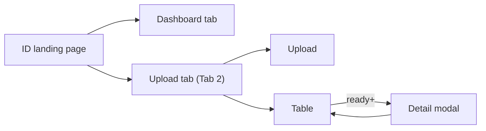
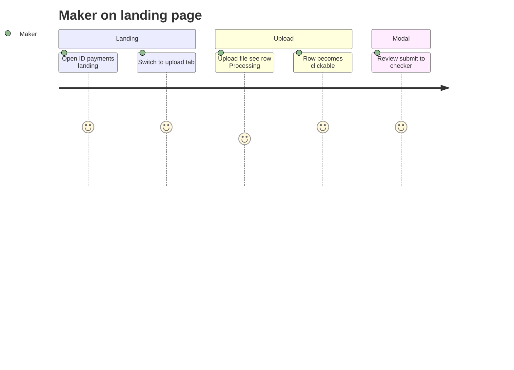
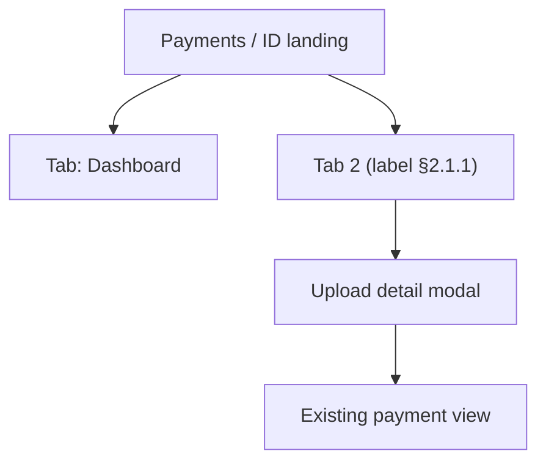

# IDP Document Upload — UX Design Specification (Simplified)

> **Status:** **Final** — UX specification (see [README.md](./README.md))  
> **Created:** 2026-07-30 · **Finalized:** 2026-08-02  
> **Related:** [README.md](./README.md) · [IDP_Document_Ingestion_Design.md](./IDP_Document_Ingestion_Design.md) · [IDP_LLD.md](./IDP_LLD.md) · [../after_ocr-llm-output.json](../after_ocr-llm-output.json)

---

## 1. Design principle

**Existing landing page + tabs** — do not add a new top-level menu item.

| Pattern | Detail |
|---------|--------|
| Landing page | **Keep** current ID Payments dashboard as default view |
| Navigation | **Two tabs** on the same landing page |
| IDP UX | **One tab** = upload zone + table + **detail modal** (no extra routes) |
| Processing | Status in table; row click disabled until ready |

---

## 2. Landing page — tab layout

### 2.1 Tab names

| Tab | Label (UI) | Purpose |
|-----|------------|---------|
| **Tab 1** | **Dashboard** | Existing landing content (charts, summaries, task counts — **no change**) |
| **Tab 2** | **TBD — pick from §2.1.1** | Upload, uploads list, review/approve in modal |

#### 2.1.1 Tab 2 label options (pick one for UX sign-off)

| # | Tab label | Tone | Best when |
|---|-----------|------|-----------|
| A | **Upload & review** | Action-oriented | Makers do upload + checker reviews here — describes the full loop |
| B | **Payment instructions** | Business / formal | Matches “payment instruction document” language in ops |
| C | **Instruction upload** | Short + specific | Clear it’s uploaded instructions, not generic files |
| D | **Upload documents** | Simple | Closest to legacy “upload” screen; lowest jargon |
| E | **Document upload** | Simple | Even shorter; upload-first |
| F | **Payment documents** | Domain | Emphasizes payment context vs generic document mgmt |
| G | **Scan & submit** | Legacy-adjacent | If legacy UX used scan/OCR wording |
| H | **From document** | Workflow hint | Implies payment created from a file (vs manual entry) |
| I | **File to payment** | Process hint | Describes outcome: file becomes a payment |
| J | **Instructions (upload)** | Paired with Dashboard | “Dashboard” vs “Instructions (upload)” — parallel structure |

**Avoid for tab label (too internal or vague):** IDP, ingestion, intake, OCR, LLM, Camunda, SSTM.

**Shortlist for review (recommended top 3):**

1. **Upload & review** — covers upload + maker/checker in one label  
2. **Payment instructions** — professional; fits banking ops vocabulary  
3. **Instruction upload** — short; distinct from manual payment keying  

**Internal / code name (stable regardless of UI label):** `instruction-upload` — tab id, feature flag, URL query `?tab=instruction-upload`.

### 2.2 Route & deep linking

| Item | Value |
|------|--------|
| Base route | Existing landing, e.g. `/payments/id` or current dashboard path — **unchanged** |
| Default tab | `dashboard` |
| Upload tab | `?tab=instruction-upload` (or final slug from §2.1.1) |
| Deep link to row | `?tab=instruction-upload&uploadId={idpUploadId}` → opens modal on load |

### 2.3 Landing page wireframe (tabs)

```
┌─────────────────────────────────────────────────────────────────────────┐
│ Payments / Indonesia (ID)                                               │
├─────────────────────────────────────────────────────────────────────────┤
│  [ Dashboard ]  [ Upload & review * ]        ← tab bar (* label TBD §2.1.1) │
├─────────────────────────────────────────────────────────────────────────┤
│                                                                         │
│  (Tab 1: existing dashboard — unchanged)                                │
│  OR                                                                     │
│  (Tab 2: upload + table — see §2.4)                                     │
│                                                                         │
└─────────────────────────────────────────────────────────────────────────┘
```

### 2.4 Upload tab content (Tab 2)

Same single-surface pattern as before — **all IDP functionality lives in this tab only.**

```
┌─────────────────────────────────────────────────────────────────────────┐
│  [ Dashboard ]  [ Upload & review * ● ]                                   │
├─────────────────────────────────────────────────────────────────────────┤
│ UPLOAD PAYMENT DOCUMENT                                                 │
│ Country [ID]  Dept ▼  Process ▼  SubProcess ▼  Activity ▼  SubAct ▼    │
│ [ Choose file ] 3897122.pdf          [ Upload ]                         │
├─────────────────────────────────────────────────────────────────────────┤
│ UPLOADS                                          Recent first             │
├──────────────┬────────────┬──────────────┬────────────┬────────────────┤
│ File name    │ Uploaded   │ Status       │ By         │ Payment ref    │
├──────────────┼────────────┼──────────────┼────────────┼────────────────┤
│ 3897122.pdf  │ 10:22 today│ Ready review │ you        │ —              │  ← clickable
│ 3897011.pdf  │ 09:15 today│ Processing   │ you        │ —              │  ← disabled
│ 3896990.pdf  │ yesterday  │ With checker │ jsmith     │ —              │  ← clickable
│ 3896880.pdf  │ yesterday  │ Completed    │ you        │ PAY-12345      │  ← clickable
└──────────────┴────────────┴──────────────┴────────────┴────────────────┘
```

After upload: stay on **upload tab**; new row appears at top with `Processing`.

**Table rules**

- Sort: `uploaded_timestamp` descending (recent first)  
- Auto-refresh every 5s while any row is processing (pause when modal open)  
- Optional filters: Status, date range, My uploads only  

---

## 3. Row click behavior

| Status | Row | Click | Modal |
|--------|-----|-------|-------|
| `Processing` / OCR / LLM | Muted | **Disabled** | — |
| `FAILED` | Error chip | Enabled | Error + Re-upload (maker) |
| `READY_FOR_REVIEW` | Active | Enabled | Editable (maker) |
| `SUBMITTED` | Active | Enabled | Read-only; checker actions |
| `REJECTED` | Warning | Enabled | Editable (maker) |
| `APPROVED` / in progress | Active | Enabled | Read-only + payment link |
| `COMPLETED` | Neutral | Enabled | Read-only view |
| `CANCELLED` | Muted | Optional | Read-only |

Disabled row tooltip: *“Still processing — available when extraction completes”*.

---

## 4. Detail modal

Clicking an **enabled** row opens a **large modal** over the landing page (upload tab stays active).

```
┌─────────────────────────────────────────────────────────────────────────┐
│ 3897122.pdf                                    Status: Ready for review │
│ Upload ID: …7122  ·  Run: ext-a1b2…  ·  Overall: 97.2%          [ × ]                      │
├──────────────────────┬──────────────────────────────────────────────────┤
│ DOCUMENT (optional)  │ EXTRACTED FIELDS (Field | Value | Confidence)    │
│ [ PDF preview ]      │ Transaction · Debit · Credit grids                 │
├──────────────────────┴──────────────────────────────────────────────────┤
│ Comments                                                                │
├─────────────────────────────────────────────────────────────────────────┤
│  [ role + status buttons — §5 ]                                         │
└─────────────────────────────────────────────────────────────────────────┘
```

Fields: same as [../after_ocr-llm-output.json](../after_ocr-llm-output.json) (TransactionDetails, DebitDetails, CreditDetails). Each field row shows LLM **Confidence** (0–100). Header shows **overall confidence** from `fss_idp_extraction_run.overall_confidence` (same as `initiationDetail.Confidence1`).

**Low-confidence highlight:** fields with `Confidence < 90` (configurable) — amber/warning style. Maker edits **values** only; original confidence is preserved for audit.

---

## 5. Modal buttons by role and status

### Maker (`paymentMaker`)

| Status | Fields | Buttons |
|--------|--------|---------|
| `READY_FOR_REVIEW` / `REJECTED` | Editable | Save draft · Submit to checker · Re-extract · Cancel upload |
| `SUBMITTED` | Read-only | Close |
| `APPROVED` / `COMPLETED` | Read-only | Close · View payment |
| `FAILED` | Error | Re-upload · Close |

### Checker (`paymentChecker`)

| Status | Fields | Buttons |
|--------|--------|---------|
| `SUBMITTED` | Read-only | Approve · Reject (comment required) · Close |
| Other | Read-only | Close · View payment (if done) |

| Button | Camunda / API |
|--------|----------------|
| Submit to checker | Complete `IDP_MakerReview` |
| Approve / Reject | Complete `IDP_CheckerReview` |
| Cancel upload | `CancelIDPUpload` |
| Re-extract | `POST .../re-extract` → row returns to Processing |

---

## 6. User journey





---

## 7. Information architecture



- **No new sidebar menu item** for v1  
- Optional: Dashboard widget “Pending reviews (3)” → switches to upload tab  

---

## 8. Implementation guide (frontend)

### 8.1 Page structure

| Piece | Action |
|-------|--------|
| `IdPaymentsLandingPage` (existing) | Add tab container; wrap current body in **Dashboard** tab |
| `InstructionUploadTab` | **New** — upload form + uploads table |
| `UploadDetailModal` | **New** — fields grid + role-based footer actions |
| `useUploadsTable` | **New** — fetch, poll, sort recent-first |
| Feature flag | e.g. `idp.instruction-upload.enabled` — hide tab when off |

### 8.2 Component breakdown

```
IdPaymentsLandingPage
├── TabBar
│   ├── Tab "Dashboard"     → DashboardTab (existing content, unchanged)
│   └── Tab (TBD label) → InstructionUploadTab (new)
│         ├── UploadForm
│         │     ├── MetadataDropdowns (dept, process, …)
│         │     ├── FilePicker
│         │     └── UploadButton → POST /v1/idp/uploads
│         ├── UploadsTable
│         │     ├── columns: file, uploaded, status, by, paymentRef
│         │     ├── rowClick → open modal if clickable
│         │     └── polling when status = processing
│         └── UploadDetailModal (portal)
│               ├── FieldGrids (transaction, debit, credit)
│               ├── CommentsField
│               └── ActionBar (role + status driven)
```

### 8.3 Tab state

| Concern | Approach |
|---------|----------|
| Active tab | URL query `tab=instruction-upload` (shareable, back button works) |
| Persist on upload | After upload, force upload tab active |
| Modal + URL | `uploadId` in query opens modal; closing removes `uploadId` |
| Dashboard default | `tab` absent or `tab=dashboard` |

### 8.4 Role detection

Use existing portal auth / candidate groups:

- `paymentMaker` → editable modal + upload form visible  
- `paymentChecker` → no upload form (optional: hide Upload zone for checker-only users)  
- Both → show upload; modal actions depend on status + task assignee  

### 8.5 API calls (by interaction)

See [IDP_API_Reference.md](./IDP_API_Reference.md) for full request/response shapes.

| Interaction | API |
|-------------|-----|
| Tab load | `GET /v1/idp/uploads?sort=recent` |
| Upload | `POST /v1/idp/uploads` |
| Table poll | `GET /v1/idp/uploads?sort=recent` every 5s if processing rows exist |
| Open modal | `GET /v1/idp/uploads/{id}` |
| Save draft | `PATCH /v1/idp/uploads/{id}/fields` |
| Submit / Approve / Reject | `POST /v1/workflow/complete` |
| Re-extract | `POST /v1/idp/uploads/{id}/re-extract` |
| View payment | Navigate to existing payment detail route |

### 8.6 Backend / workflow

| UI action | Workflow effect |
|-----------|-----------------|
| Upload | Starts `IDP_Document_Ingestion` (common process — not country payment BPMN) |
| Checker approve | Completes `IDP_CheckerReview` → `Trigger_IDP_Payment` → gateway registry resolves handoff message (phase 1: `IAP_ID_IDP_Trigger` when `country=ID`) |

UI change is **placement on landing tabs**, not workflow change. Country routing is config-driven in gateway — see [IDP_Document_Ingestion_Design.md §2.1](./IDP_Document_Ingestion_Design.md#21-country--payment-routing-responsibilities) and [IDP_LLD.md §4](./IDP_LLD.md#4-country--entity-routing).

### 8.7 Implementation checklist

- [ ] Add `TabBar` to existing ID landing page  
- [ ] Move current dashboard into `Dashboard` tab (zero functional change)  
- [ ] Add upload tab (final label from §2.1.1) behind feature flag  
- [ ] Implement `UploadForm` + validation  
- [ ] Implement `UploadsTable` with disabled rows for processing  
- [ ] Implement `UploadDetailModal` with role/status actions  
- [ ] URL sync: `tab` + optional `uploadId`  
- [ ] Polling stops when modal open or no processing rows  
- [ ] (Optional) Dashboard badge linking to upload tab  

---

## 9. Legacy migration

| Legacy | New |
|--------|-----|
| External portal list | Upload tab **table** |
| External upload form | **Upload zone** in same tab |
| OCR status screen | **Status** column + disabled rows |
| Field review screen | **Modal** |

---

## 10. UX acceptance criteria

- [ ] Landing page opens on **Dashboard** tab by default  
- [ ] Upload tab shows upload + table without leaving landing page  
- [ ] Dashboard tab content unchanged from current prod  
- [ ] Upload adds row at top; user remains on upload tab  
- [ ] Processing rows not clickable  
- [ ] Modal actions match role + status (§5)  
- [ ] Deep link `?tab=instruction-upload&uploadId=` opens modal  
- [ ] Feature flag hides upload tab when disabled  

---

## 11. Out of scope (v1)

- New sidebar nav entry for IDP  
- Separate `/payments/id/idp` route  
- Batch multi-file upload  

---

## 12. Document history

| Date | Change |
|------|--------|
| 2026-07-30 | Initial multi-screen spec |
| 2026-07-30 | Simplified to single page + modal |
| 2026-07-30 | Tabs on existing landing: Dashboard + upload tab (label TBD §2.1.1) |
| 2026-08-02 | Final pack; §8.6 routing cross-reference; confidence UI aligned with LLM contract |

---

## 13. Open questions

| # | Question |
|---|----------|
| 1 | Final tab label — see §2.1.1 shortlist |
| 2 | Show upload form to checkers or maker-only? |
| 3 | Dashboard widget count for pending document tasks? |
| 4 | PDF preview in modal v1? |
