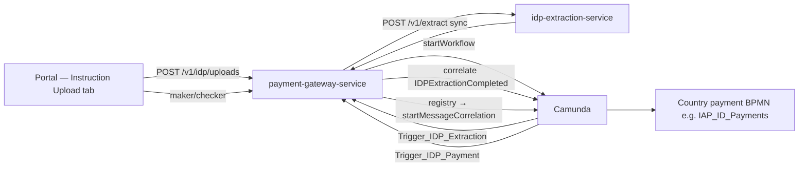

# IDP Document Ingestion — Final Documentation Pack

> **Status:** Final — consolidated for implementation and review  
> **Created:** 2026-08-02  
> **Supersedes:** `draft/` working copies (keep `draft/` for history; use **`final/`** as source of truth)

---

## Document set

| # | Document | Audience | Purpose |
|---|----------|----------|---------|
| 1 | [IDP_Document_Ingestion_Design.md](./IDP_Document_Ingestion_Design.md) | Architects, tech leads, BPMN reviewers | Production-safe two-BPMN strategy, routing model, deployment & regression plan |
| 2 | [IDP_LLD.md](./IDP_LLD.md) | Backend, DB, integration engineers | Implementation LLD — schema, REST, handlers, timeouts, registry config |
| 3 | [IDP_UX_Design.md](./IDP_UX_Design.md) | Frontend, UX, product | Landing-page tabs, upload table, detail modal, role-based actions |
| 4 | [IDP_API_Reference.md](./IDP_API_Reference.md) | Frontend, backend, integration | **All REST APIs** — request/response shapes, UI action map, extraction service contract |

### BPMN artifact (in this folder)

| File | Description |
|------|-------------|
| [IDP_Document_Ingestion.bpmn](./IDP_Document_Ingestion.bpmn) | Common country-agnostic IDP process — deploy to `51786-workflow-management` |

### Related repo artifacts (outside `final/`)

| Path | Description |
|------|-------------|
| [../ID_payments.bpmn](../ID_payments.bpmn) | Indonesia payment process — **additive** change: `IAP_ID_IDP_Trigger` + `Initialize_IAP_From_IDP` |
| [../ID_payments.md](../ID_payments.md) | Existing IAP_ID_Payments workflow reference |
| [../after_ocr-llm-output.json](../after_ocr-llm-output.json) | Target structured extraction JSON (per-field `Confidence`) |
| [../51786-idp-extraction-service/](../51786-idp-extraction-service/) | Built extraction service (`POST /v1/extract`, mock mode) |

---

## Recommended reading order

1. **Design** §1–§2 — decisions and architecture (including [routing responsibilities](./IDP_Document_Ingestion_Design.md#21-country--payment-routing-responsibilities))
2. **UX** §2–§5 — what users see and do
3. **LLD** §2–§5 — services, BPMN task map, DDL
4. **[API Reference](./IDP_API_Reference.md)** — endpoints, payloads, UI → API map
5. **LLD** §4 — `IDPPaymentRouteRegistry` (country handoff)
6. **Design** §14–§16 — regression matrix and implementation checklist

---

## Architecture at a glance

### Key design rules

| Rule | Detail |
|------|--------|
| One IDP BPMN for all countries | `IDP_Document_Ingestion` — upload, OCR/LLM QC, IDP maker/checker only |
| Country routing **not** in IDP BPMN | `Trigger_IDP_Payment` is one external-task hook; `IDPPaymentRouteRegistry` picks the message |
| Entry points in country BPMNs | e.g. `IAP_ID_IDP_Trigger` declared on `IAP_ID_Payments.bpmn` |
| Extraction service is domain-agnostic | No Camunda, no payment tables — gateway owns workflow |
| Phase 1 = sync extract | Gateway blocks on `POST /v1/extract` (~10 min budget, 15 min HTTP envelope) |
| Phase 1 country | Indonesia (`country=ID`) — registry row only; BPMN pattern repeats per country |

---

## Phase 1 scope summary

| In scope | Out of scope (v1) |
|----------|-------------------|
| ID landing tab UX (upload + table + modal) | New sidebar nav route |
| `fss_idp_upload` + content + extraction_run tables | `document-service` integration |
| `51786-idp-extraction-service` | China ETF IDP handoff (registry stub only) |
| Additive `IAP_ID_Payments.bpmn` change | Batch multi-file upload |
| Gateway handlers + route registry | SSTM feedback for `IDP_UPLOAD` channel |

---

## Implementation status (high level)

| Component | Status |
|-----------|--------|
| `51786-idp-extraction-service` | Built (sync `/v1/extract`, mock mode, `id-payment-v1` template) |
| `IDP_Document_Ingestion.bpmn` | In `final/` — ready for workflow-management |
| `IAP_ID_Payments.bpmn` additive diff | In repo root `ID_payments.bpmn` |
| `51786-payment-gateway-service` | Planned — handlers documented in LLD |
| Portal UI | Specified in UX doc — not built |

---

## Document history

| Date | Change |
|------|--------|
| 2026-07-30 | Initial draft pack in `draft/` |
| 2026-08-02 | Routing responsibilities, registry model, sync extract, timeouts |
| 2026-08-02 | **Final pack** — consolidated into `final/` with README index |
| 2026-08-02 | Added [IDP_API_Reference.md](./IDP_API_Reference.md) |
